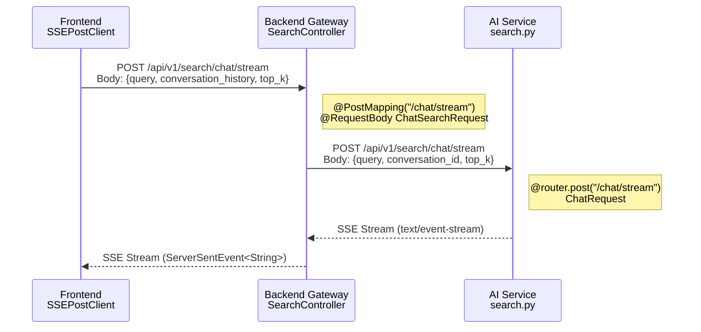

# SSE Streaming Endpoint GET/POST Method Mismatch Report

**Cross-Story BLOCKING Issue**

| 항목 | 내용 |
|------|------|
| **문서 유형** | TechLead Issue Report |
| **심각도** | CRITICAL (서비스 간 통합 불가) |
| **발견자** | TechLead Agent (Sprint 04 Day 2 Code Review) |
| **작성일** | 2026-01-28 |
| **Sprint** | Sprint 04 (Improvement + Quality Enhancement) |
| **영향 범위** | STORY-050 (SSE) / STORY-044 (Backend Search) / STORY-051 (RAG Pipeline) |
| **상태** | **RESOLVED** - P0 수정 완료 (소스 3개 + 테스트 3개 수정) |

---

## 1. Executive Summary

Sprint 04 Day 2 코드 리뷰 과정에서 **SSE Streaming 엔드포인트의 HTTP Method 불일치(GET/POST Mismatch)** 가 발견되었다. 이 이슈는 Frontend, Backend Gateway, AI Service 세 레이어에 걸친 Cross-Story Blocking 문제로, **현재 상태에서는 SSE 스트리밍 통합이 완전히 불가능하다.**

핵심 문제: Frontend는 POST로 요청하지만 Backend는 GET으로만 수신하며, Backend는 AI Service에 GET으로 요청하지만 AI Service는 POST만 수신한다. 총 2개 지점에서 Method Mismatch가 발생한다.

---

## 2. Mismatch 상세 분석

### 2.1 Mismatch #1: Frontend --> Backend Gateway

요청 흐름에서 첫 번째 단절 지점이다.

| 구성요소 | HTTP Method | 엔드포인트 | Request 형태 | 소스 위치 |
|---------|------------|-----------|-------------|----------|
| **Frontend** SSEPostClient | **POST** | `/api/v1/search/chat/stream` | JSON body: `{query, conversation_history, top_k}` | `frontend/src/shared/api/sse.ts:267` |
| **Backend** SearchController | **GET** | `/api/v1/search/chat/stream` | `@RequestParam query` (URL 파라미터) | `SearchController.java:164` |

**증거 코드 - Frontend (sse.ts:264-276)**:

```typescript
// SSEPostClient.startFetch()
const response = await fetch(this.url, {
    method: "POST",                              // <-- POST 사용
    headers: {
        "Content-Type": "application/json",
        Accept: "text/event-stream",
        "Cache-Control": "no-cache",
        ...this.options.headers,
    },
    body: JSON.stringify(this.options.body),      // <-- JSON body 전송
    signal: this.abortController?.signal,
});
```

**증거 코드 - Backend (SearchController.java:164-183)**:

```java
@GetMapping(value = "/chat/stream", produces = MediaType.TEXT_EVENT_STREAM_VALUE)  // <-- GET 매핑
@PreAuthorize("hasAnyRole(\"USER\", \"VIEWER\", \"DEVELOPER\", \"ADMIN\")")
public Flux<ServerSentEvent<String>> streamSearch(
    @RequestParam @Size(max = 1000) String query,   // <-- URL 파라미터로만 수신
    @AuthenticationPrincipal JwtUser user
) {
    String sanitizedQuery = validateAndSanitizeQuery(query);
    String userId = user != null ? user.id() : null;
    return searchService.streamSearch(sanitizedQuery, userId)
        .map(chunk -> ServerSentEvent.<String>builder().data(chunk).build());
}
```

**결과**: Frontend POST 요청 --> Backend `@GetMapping` --> **HTTP 405 Method Not Allowed**

---

### 2.2 Mismatch #2: Backend Gateway --> AI Service

두 번째 단절 지점으로, Backend가 AI Service를 호출할 때도 불일치가 발생한다.

| 구성요소 | HTTP Method | 엔드포인트 | Request 형태 | 소스 위치 |
|---------|------------|-----------|-------------|----------|
| **Backend** AIServiceClient | **GET** | `/api/v1/search/stream` | `queryParam: query, user_id` | `AIServiceClient.java:123` |
| **AI Service** Python | **POST** | `/api/v1/search/chat/stream` | JSON body: `ChatRequest {query, conversation_id, top_k}` | `search.py:386` |

**증거 코드 - Backend (AIServiceClient.java:120-134)**:

```java
public Flux<String> streamSearch(String query, String userId) {
    return aiServiceWebClient.get()                      // <-- GET 사용
        .uri(uriBuilder -> uriBuilder
            .path("/api/v1/search/stream")               // <-- 경로: /stream (chat/stream 아님)
            .queryParam("query", query)                  // <-- URL 파라미터
            .queryParam("user_id", userId)
            .build())
        .retrieve()
        .bodyToFlux(String.class);
}
```

**증거 코드 - AI Service (search.py:386-391)**:

```python
@router.post(                                            # <-- POST 매핑
    "/chat/stream",                                      # <-- 경로: /chat/stream
    summary="스트리밍 대화형 검색",
)
async def chat_stream(request: ChatRequest) -> StreamingResponse:
    # ChatRequest: JSON body {query, conversation_id, top_k, use_reasoner}
```

**결과**: 2가지 불일치 동시 발생
- **Method 불일치**: Backend GET --> AI Service POST --> **HTTP 405**
- **경로 불일치**: `/api/v1/search/stream` vs `/api/v1/search/chat/stream` --> **HTTP 404**

---

## 3. 전체 호출 흐름 다이어그램

### 3.1 현재 상태 (BROKEN)

```
Frontend (POST)                Backend Gateway (GET)           AI Service (POST)
====================          =======================          ====================
SSEPostClient                  SearchController                 search.py
  method: POST                   @GetMapping                     @router.post
  url: /chat/stream              /chat/stream                    /chat/stream
  body: {query,                  @RequestParam query             body: ChatRequest
         conversation_history,                                   {query,
         top_k}                                                   conversation_id,
                               AIServiceClient                    top_k}
                                 method: GET
                                 url: /stream        <-- 경로도 다름
                                 queryParam: query

  [POST] ----X----> [GET]                   [GET] ----X----> [POST]
           405                                       404/405
```

### 3.2 수정 후 기대 상태 (FIXED)



---

## 4. 근본 원인 분석 (Root Cause Analysis)

### 4.1 원인 요약

**설계 자체가 잘못된 것이 아니다.** Sprint 03에서 EventSource(GET-only) 기반으로 올바르게 설계되었으나, Sprint 04 STORY-050에서 Frontend를 POST 기반으로 마이그레이션할 때 **Backend Gateway 측 변경이 누락**되었다.

### 4.2 타임라인

| Sprint | Story | 변경 내용 | GET/POST | 일관성 |
|--------|-------|----------|----------|--------|
| Sprint 03 | STORY-043 | EventSource 기반 SSE 구현 | 전 레이어 GET | **일관** |
| Sprint 04 | STORY-050 | Frontend를 POST(fetch+ReadableStream)로 전환 | Frontend만 POST | **불일치 발생** |
| Sprint 04 | STORY-044 | Backend SearchController 구현 | GET 유지 (미변경) | **미반영** |
| Sprint 04 | STORY-051 | AI Service RAG Pipeline 구현 | POST 구현 | **Frontend와 일치, Backend와 불일치** |

### 4.3 분류

이것은 **Cross-Story Gap** (스토리 간 연결 누락)이다.

- STORY-050 (Frontend)이 POST로 전환할 때, STORY-044 (Backend)의 연쇄 변경이 식별되지 않았다.
- STORY-051 (AI Service)은 독립적으로 POST를 채택했으나, Backend의 AIServiceClient는 여전히 GET을 사용한다.
- 결과적으로 **Backend Gateway가 양쪽(Frontend/AI Service) 모두와 불일치하는 "Sandwich Mismatch"** 상태이다.

---

## 5. 영향 분석 (Impact Analysis)

### 5.1 직접적 영향

| 영향 | 심각도 | 설명 |
|------|--------|------|
| **SSE 스트리밍 완전 불통** | CRITICAL | Frontend POST --> Backend GET --> 405 반환. 사용자에게 스트리밍 응답 불가 |
| **conversation_history 전달 불가** | HIGH | GET 쿼리 파라미터로는 대화 이력(배열 구조) 전달 제한. URL 길이 한계(2048~8192 chars) |
| **URL 보안 약화** | MEDIUM | GET 파라미터로 쿼리 전달 시 서버 접근 로그/프록시 로그에 검색어 노출 |

### 5.2 연쇄 영향 (Downstream Blocking)

| 차단되는 Story | 차단 이유 |
|---------------|----------|
| **STORY-057** (대화이력 + 진정한 스트리밍) | POST body 없이는 멀티턴 대화 이력 전달 불가 |
| **STORY-054** (E2E 통합 테스트) | SSE 통합이 불통이므로 스트리밍 E2E 테스트 작성 불가 |
| **Sprint 05 RAG 고도화** | 스트리밍 기반 RAG 응답이 전제 조건 |

### 5.3 영향받지 않는 기능

| 기능 | 이유 |
|------|------|
| POST `/chat` (비스트리밍) | Frontend/Backend/AI Service 모두 POST, 정상 동작 |
| POST `/hybrid` (하이브리드 검색) | 스트리밍과 무관, 정상 동작 |
| GET `/stream` (레거시 스트리밍) | GET-GET으로 일관, 단 대화이력 전달 불가 |

---

## 6. 수정 방향

### 6.1 원칙: POST 기반 통일

SSE 프로토콜을 **POST 기반으로 통일**한다. 이유는 다음과 같다.

1. **복합 요청 지원**: conversation_history, filters 등 복잡한 JSON 페이로드를 body로 전달
2. **보안 강화**: 쿼리 문자열이 서버 로그에 노출되지 않음
3. **URL 길이 제한 회피**: GET 파라미터의 URL 길이 제한(브라우저/프록시별 상이) 문제 해소
4. **Frontend 이미 완료**: SSEPostClient가 이미 POST 기반으로 구현되어 Frontend 재작업 불필요

### 6.2 수정 대상 파일 (3개)

#### 수정 1: SearchController.java (P0)

**위치**: `knowledge_service/backend/src/main/java/com/knowledge/backend/api/controller/SearchController.java`
**라인**: 164

| 변경 전 | 변경 후 |
|---------|---------|
| `@GetMapping("/chat/stream")` | `@PostMapping("/chat/stream")` |
| `@RequestParam String query` | `@Valid @RequestBody ChatSearchRequest request` |
| `streamSearch(query, userId)` | `streamSearch(request.getQuery(), request.getHistory(), request.getTopK(), userId)` |

```java
// 변경 후 시그니처
@PostMapping(value = "/chat/stream", produces = MediaType.TEXT_EVENT_STREAM_VALUE)
@PreAuthorize("hasAnyRole(\"USER\", \"VIEWER\", \"DEVELOPER\", \"ADMIN\")")
public Flux<ServerSentEvent<String>> streamSearch(
    @Valid @RequestBody ChatSearchRequest request,
    @AuthenticationPrincipal JwtUser user
) {
    String sanitizedQuery = validateAndSanitizeQuery(request.getQuery());
    String userId = user != null ? user.id() : null;
    return searchService.streamSearch(
        sanitizedQuery, request.getHistory(), request.getTopK(), userId
    ).map(chunk -> ServerSentEvent.<String>builder().data(chunk).build());
}
```

#### 수정 2: AIServiceClient.java (P0)

**위치**: `knowledge_service/backend/src/main/java/com/knowledge/backend/client/AIServiceClient.java`
**라인**: 120-134

| 변경 전 | 변경 후 |
|---------|---------|
| `aiServiceWebClient.get()` | `aiServiceWebClient.post()` |
| `.path("/api/v1/search/stream")` | `.path("/api/v1/search/chat/stream")` |
| `.queryParam("query", query)` | `.bodyValue(chatRequest)` |

```java
// 변경 후 시그니처
public Flux<String> streamSearch(
    String query,
    List<ChatSearchRequest.ChatMessage> history,
    Integer topK,
    String userId
) {
    ChatSearchRequest aiRequest = ChatSearchRequest.builder()
        .query(query).history(history).topK(topK).build();

    return aiServiceWebClient.post()
        .uri("/api/v1/search/chat/stream")
        .bodyValue(aiRequest)
        .retrieve()
        .bodyToFlux(String.class);
}
```

#### 수정 3: SearchService.java (P0)

**위치**: `knowledge_service/backend/src/main/java/com/knowledge/backend/service/SearchService.java`
**라인**: 201

| 변경 전 | 변경 후 |
|---------|---------|
| `streamSearch(String query, String userId)` | `streamSearch(String query, List<ChatMessage> history, Integer topK, String userId)` |

```java
// 변경 후 시그니처
public Flux<String> streamSearch(
    String query,
    List<ChatSearchRequest.ChatMessage> history,
    Integer topK,
    String userId
) {
    return aiServiceClient.streamSearch(query, history, topK, userId);
}
```

### 6.3 하위 호환성

| 엔드포인트 | 처리 방식 |
|-----------|----------|
| GET `/stream` (레거시) | **유지** - 기존 GET 기반 레거시 클라이언트 호환 |
| GET `/chat/stream` (기존) | **제거** - POST로 대체 |
| POST `/chat/stream` (신규) | **추가** - Frontend SSEPostClient와 일치 |

---

## 7. 조치 계획

### 7.1 수정 작업 목록

| 우선순위 | 조치 | 담당 Agent | 관련 Story | 예상 소요 |
|---------|------|-----------|-----------|----------|
| **P0** | SearchController `/chat/stream` POST 전환 | Backend | STORY-050 보완 | 0.5h |
| **P0** | AIServiceClient POST + 경로 수정 | Backend | STORY-051 보완 | 0.5h |
| **P0** | SearchService streamSearch 시그니처 확장 | Backend | STORY-051 보완 | 0.5h |
| **P0** | 기존 단위 테스트 수정 (SearchControllerTest, AIServiceClientTest, SearchServiceTest) | Backend | STORY-054 보완 | 1.0h |
| **P1** | 통합 테스트 추가 (POST SSE E2E) | QA | STORY-054 | 1.0h |
| **P1** | API 문서 업데이트 (OpenAPI spec) | Doc | - | 0.5h |

### 7.2 검증 기준

수정 후 다음 시나리오가 모두 통과해야 한다.

| 검증 항목 | 기대 결과 |
|----------|----------|
| Frontend SSEPostClient --> Backend `/chat/stream` | HTTP 200, `text/event-stream` |
| Backend --> AI Service `/chat/stream` | HTTP 200, SSE 스트림 수신 |
| conversation_history 포함 요청 | 대화 이력이 AI Service까지 전달됨 |
| 레거시 GET `/stream` | 기존과 동일하게 동작 (하위 호환) |
| 인증 실패 시 | HTTP 401/403 반환 |
| 빈 query 전달 시 | HTTP 400 Bad Request |

---

## 8. 교훈 및 재발 방지

### 8.1 교훈

| 항목 | 내용 |
|------|------|
| **이슈 유형** | Cross-Story Gap (스토리 간 인터페이스 계약 불일치) |
| **근본 원인** | Frontend 프로토콜 변경(GET-->POST) 시 Backend Gateway + AI Service Client 동시 변경 미식별 |
| **발견 시점** | Day 2 코드 리뷰 (구현 완료 후) |

### 8.2 재발 방지 방안

| 방안 | 설명 |
|------|------|
| **Interface Contract Review** | 프로토콜 변경 Story에는 반드시 "영향받는 레이어 목록"을 Acceptance Criteria에 포함 |
| **Cross-Story Dependency Matrix** | Sprint Planning 시 스토리 간 API 의존성을 명시적으로 매핑 |
| **Integration Test First** | 레이어 간 통합 테스트를 단위 테스트보다 먼저 작성하여 계약 위반 조기 탐지 |
| **API Contract Testing** | OpenAPI spec 기반 contract test를 CI에 추가하여 Method/Path 불일치 자동 탐지 |

### 8.3 ADR 제안

**ADR-007: SSE 프로토콜은 POST 기반으로 통일**

- **Status**: Proposed
- **Context**: EventSource(GET-only)에서 fetch+ReadableStream(POST) 기반으로 전환 완료. GET은 복합 페이로드 전달 한계 및 보안 취약점 존재.
- **Decision**: 모든 SSE Streaming 엔드포인트는 POST method를 사용하며, 요청 데이터는 JSON body로 전달한다.
- **Consequences**: 레거시 GET `/stream`은 deprecated 처리하되 하위 호환을 위해 당분간 유지. 신규 스트리밍 엔드포인트는 반드시 POST로 구현.

---

## 9. 참고 파일 목록

| 파일 | 절대 경로 | 역할 |
|------|----------|------|
| SSEPostClient | `knowledge_service/frontend/src/shared/api/sse.ts` | Frontend SSE 클라이언트 (POST) |
| SearchController | `knowledge_service/backend/src/main/java/com/knowledge/backend/api/controller/SearchController.java` | Backend SSE 엔드포인트 (GET - 수정 필요) |
| AIServiceClient | `knowledge_service/backend/src/main/java/com/knowledge/backend/client/AIServiceClient.java` | Backend --> AI Service 호출 (GET - 수정 필요) |
| SearchService | `knowledge_service/backend/src/main/java/com/knowledge/backend/service/SearchService.java` | Backend 검색 서비스 (시그니처 확장 필요) |
| search.py | `knowledge_service/src/app/api/routes/search.py` | AI Service SSE 엔드포인트 (POST - 정상) |
| Day 2 Code Review | `knowledge_service/docs/02_design/review/2026-01-28_sprint04_day2_code_review.md` | 본 이슈 발견 리뷰 |

---

**작성**: TechLead Agent
**검토 요청 대상**: Backend Developer, PM Agent
**다음 단계**: Backend Developer에게 P0 수정 작업 할당 (PM 조율)
