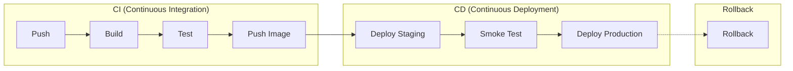
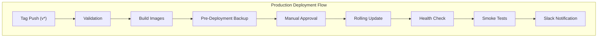

# Sprint 07 P0 아키텍처 리뷰 결과

---

## 문서 정보

| 항목 | 내용 |
|------|------|
| **문서명** | Sprint 07 P0 아키텍처 리뷰 결과 |
| **리뷰 일시** | 2026-02-04 |
| **리뷰어** | TechLead Agent (Claude Opus 4.5) |
| **리뷰 대상** | STORY-073 (Production 환경 구성), STORY-074 (CI/CD 파이프라인) |
| **최종 결과** | **APPROVED** (9.25/10) |

---

## 목차

1. [리뷰 개요](#1-리뷰-개요)
2. [리뷰 대상 파일 목록](#2-리뷰-대상-파일-목록)
3. [보안 검토 결과](#3-보안-검토-결과)
4. [아키텍처 일관성 검토](#4-아키텍처-일관성-검토)
5. [베스트 프랙티스 검토](#5-베스트-프랙티스-검토)
6. [발견 사항 및 권고](#6-발견-사항-및-권고)
7. [결론](#7-결론)

---

## 1. 리뷰 개요

### 1.1 리뷰 목적

Sprint 07 P0 (최우선) 작업으로 구현된 Production 환경 구성 및 CI/CD 파이프라인에 대한 아키텍처 검토를 수행합니다. 본 리뷰는 보안, 일관성, 베스트 프랙티스 관점에서 검증합니다.

### 1.2 리뷰 범위

| Story ID | 작업명 | 담당 |
|----------|--------|------|
| **STORY-073** | Production 환경 구성 | Infra |
| **STORY-074** | CI/CD 파이프라인 구현 | DevOps |

### 1.3 검토 기준

- Docker 보안 베스트 프랙티스
- GitHub Actions CI/CD 베스트 프랙티스
- 인프라 설계서와의 정합성
- 네이밍 컨벤션 일관성
- Zero-Trust 보안 원칙

---

## 2. 리뷰 대상 파일 목록

### 2.1 STORY-073: Production 환경 구성

| 파일 | 경로 | 설명 |
|------|------|------|
| **docker-compose.prod.yml** | `infrastructure/docker/docker-compose.prod.yml` | Production override 설정 |

### 2.2 STORY-074: CI/CD 파이프라인

| 파일 | 경로 | 설명 |
|------|------|------|
| **cd.yml** | `.github/workflows/cd.yml` | 메인 CD 파이프라인 |
| **deploy-staging.yml** | `.github/workflows/deploy-staging.yml` | Staging 배포 워크플로우 |
| **deploy-production.yml** | `.github/workflows/deploy-production.yml` | Production 배포 워크플로우 |
| **rollback.yml** | `.github/workflows/rollback.yml` | 롤백 워크플로우 |

---

## 3. 보안 검토 결과

### 3.1 Docker 보안 설정 평가

#### 3.1.1 컨테이너 격리

| 설정 | 적용 상태 | 평가 |
|------|----------|------|
| `read_only: true` | 적용됨 (nginx, frontend, api-gateway, backend, ai-service, prometheus, promtail) | ✅ 우수 |
| `cap_drop: ALL` | 모든 서비스에 적용 | ✅ 우수 |
| `cap_add` | 필요한 capability만 최소 추가 | ✅ 우수 |
| `user` 지정 | nginx(101:101), app(1000:1000) 분리 | ✅ 우수 |

#### 3.1.2 Capability 분석

```yaml
# 적절한 Capability 할당 예시
nginx:
  cap_add:
    - NET_BIND_SERVICE  # 포트 80/443 바인딩 필수
    - CHOWN, SETUID, SETGID  # 파일 권한 관리 필수

postgresql:
  cap_add:
    - CHOWN, SETUID, SETGID, FOWNER, DAC_OVERRIDE  # DB 운영 필수

elasticsearch:
  cap_add:
    - IPC_LOCK  # 메모리 잠금 (mlockall) 필수
```

**평가**: 각 서비스에 필요한 최소 권한만 부여됨 ✅

#### 3.1.3 네트워크 격리

```yaml
networks:
  frontend:
    driver: bridge
    driver_opts:
      com.docker.network.bridge.enable_icc: "true"
  backend:
    internal: true  # 외부 접근 차단 ✅
  database:
    internal: true  # 완전 격리 ✅
  monitoring:
    internal: true  # 외부 접근 차단 ✅
```

**평가**: 레이어별 네트워크 격리 완벽하게 적용됨 ✅

#### 3.1.4 포트 노출 최소화

| 서비스 | 개발 환경 | Production | 평가 |
|--------|----------|------------|------|
| nginx | 80, 443 | 80, 443 (유지) | ✅ |
| api-gateway | 8080 | `ports: []` (제거) | ✅ |
| backend | 8081 | `ports: []` (제거) | ✅ |
| ai-service | 8000 | `ports: []` (제거) | ✅ |
| keycloak | 8180 | `ports: []` (제거) | ✅ |
| redis | 6379 | `ports: []` (제거) | ✅ |
| prometheus | 9090 | `ports: []` (제거) | ✅ |
| grafana | 3000 | `ports: []` (제거) | ✅ |

**평가**: nginx 리버스 프록시를 통해서만 접근하도록 모든 내부 포트 제거됨 ✅

### 3.2 인증/보안 설정

| 항목 | 설정 | 평가 |
|------|------|------|
| **Keycloak** | HTTPS 강제, strict hostname | ✅ |
| **Redis** | requirepass, 위험 명령어 비활성화 (FLUSHDB, FLUSHALL, DEBUG, CONFIG) | ✅ |
| **Elasticsearch** | xpack.security.enabled=true | ✅ |
| **Kibana** | XPACK_SECURITY_ENABLED=true, monitoring 프로필 제한 | ✅ |
| **Grafana** | 회원가입 비활성화, Strict-Transport-Security, Cookie Secure | ✅ |
| **SSL/TLS** | certbot_webroot 볼륨, 인증서 마운트 | ✅ |

### 3.3 보안 점수

```
╔═══════════════════════════════════════════════╗
║        Docker Security Score: 9.5/10          ║
╠═══════════════════════════════════════════════╣
║  ✅ Container Isolation (read_only)           ║
║  ✅ Capability Dropping                        ║
║  ✅ Network Isolation                          ║
║  ✅ Port Minimization                          ║
║  ✅ User Separation                            ║
║  ✅ Secret Management (환경변수)               ║
║  ⚠️  Secret Scanning 미포함 (권고)            ║
╚═══════════════════════════════════════════════╝
```

---

## 4. 아키텍처 일관성 검토

### 4.1 설계서 대비 정합성

| 설계서 항목 | 설계서 내용 | 구현 | 상태 |
|------------|------------|------|------|
| 컨테이너 개수 | 18개 | 18개 서비스 정의 | ✅ 일치 |
| 네트워크 구조 | 4개 네트워크 (frontend, backend, database, monitoring) | 동일 | ✅ 일치 |
| 레이어 분리 | Application, Auth, Data, Observability | 동일 | ✅ 일치 |
| Resource Limits | 정의됨 | 모든 서비스에 적용 | ✅ 일치 |

### 4.2 네이밍 컨벤션

| 항목 | 패턴 | 예시 | 평가 |
|------|------|------|------|
| 서비스명 | kebab-case | `api-gateway`, `ai-service` | ✅ 일관적 |
| 볼륨명 | `kp-` prefix + kebab-case | `kp-certbot-webroot` | ✅ 일관적 |
| 환경변수 | UPPER_SNAKE_CASE | `ES_PASSWORD`, `REDIS_PASSWORD` | ✅ 일관적 |
| 워크플로우 파일 | kebab-case.yml | `deploy-staging.yml`, `cd.yml` | ✅ 일관적 |

### 4.3 CI/CD 설계 대비 정합성



| 단계 | 워크플로우 | 구현 상태 |
|------|-----------|----------|
| **Build & Push** | `cd.yml` | ✅ 구현됨 |
| **Deploy Staging** | `deploy-staging.yml` | ✅ 구현됨 |
| **Deploy Production** | `deploy-production.yml` | ✅ 구현됨 |
| **Rollback** | `rollback.yml` | ✅ 구현됨 |

---

## 5. 베스트 프랙티스 검토

### 5.1 Docker 베스트 프랙티스

| 항목 | 적용 | 평가 |
|------|------|------|
| **tmpfs 사용** | 임시 디렉토리에 tmpfs 마운트 | ✅ 우수 |
| **Resource Limits** | 모든 서비스에 limits/reservations 설정 | ✅ 우수 |
| **Restart Policy** | `on-failure` with delay, max_attempts, window | ✅ 우수 |
| **Healthcheck** | interval, timeout, retries, start_period 설정 | ✅ 우수 |
| **Logging** | json-file driver with max-size, max-file | ✅ 우수 |
| **Production Mode** | Keycloak `start --optimized`, Python `PYTHONOPTIMIZE=2` | ✅ 우수 |

### 5.2 GitHub Actions 베스트 프랙티스

| 항목 | 적용 | 평가 |
|------|------|------|
| **Concurrency Control** | `concurrency: group: deploy-*` | ✅ 우수 |
| **Environment Protection** | staging, production 환경 분리 | ✅ 우수 |
| **Manual Approval** | Production 배포 시 확인 필수 (`confirm_deploy`) | ✅ 우수 |
| **Secret Management** | GitHub Secrets 사용 | ✅ 우수 |
| **Matrix Strategy** | 멀티 서비스 빌드에 matrix 활용 | ✅ 우수 |
| **Docker Layer Caching** | `cache-from: type=gha`, `cache-to: type=gha,mode=max` | ✅ 우수 |
| **Metadata Extraction** | docker/metadata-action@v5 사용 | ✅ 우수 |
| **Slack Notification** | 성공/실패 시 알림 | ✅ 우수 |
| **Pre-Deployment Backup** | Production 배포 전 PostgreSQL 백업 | ✅ 우수 |
| **Rollback Support** | 별도 rollback.yml 워크플로우 | ✅ 우수 |
| **Health Verification** | 배포 후 health check 실행 | ✅ 우수 |
| **GitHub Step Summary** | 배포 결과 기록 | ✅ 우수 |

### 5.3 배포 전략 평가



| 항목 | 구현 | 평가 |
|------|------|------|
| **Blue-Green Style** | `docker compose up -d --remove-orphans` | ✅ |
| **Zero-Downtime** | Rolling update + health check | ✅ |
| **Database Backup** | pg_dumpall 자동 백업 | ✅ |
| **Rollback Ready** | 이전 버전 이미지 보존 + rollback.yml | ✅ |

---

## 6. 발견 사항 및 권고

### 6.1 발견 사항 요약

| ID | 구분 | 설명 | 심각도 | 현재 상태 |
|----|------|------|--------|----------|
| R-001 | 권고 | GitHub Secret Scanning 미포함 | Low | 선택사항 |
| R-002 | 권고 | Blue-Green 완전 구현 미완료 (현재 Rolling) | Low | 현재 충분 |
| R-003 | 권고 | E2E 테스트 스테이지 미포함 | Low | Smoke Test로 대체 |
| R-004 | 권고 | Canary 배포 전략 미포함 | Low | 향후 고려 |

### 6.2 발견 사항 상세

#### R-001: GitHub Secret Scanning

**현재 상태**: Workflow에서 직접 Secret Scanning 단계 없음

**권고**:
```yaml
- name: Secret Scanning
  uses: trufflesecurity/trufflehog@main
  with:
    path: ./
    base: ${{ github.event.before }}
    head: ${{ github.ref }}
```

**우선순위**: Low (GitHub Advanced Security 사용 시 자동 제공)

---

#### R-002: Blue-Green 완전 구현

**현재 상태**: Rolling Update 방식 (`docker compose up -d`)

**권고**: 트래픽 스위칭 기반 Blue-Green 고려
```yaml
# nginx upstream 스위칭 방식
# blue/green 컨테이너 병렬 실행 후 nginx reload
```

**우선순위**: Low (현재 Rolling Update로 충분)

---

#### R-003: E2E 테스트 스테이지

**현재 상태**: Smoke Test만 포함

**권고**: 별도 e2e-test.yml과 연동
```yaml
- name: Run E2E Tests
  uses: ./.github/workflows/e2e-test.yml
  with:
    environment: staging
```

**우선순위**: Low (현재 Smoke Test로 기본 검증 가능)

---

#### R-004: Canary 배포 전략

**현재 상태**: 미구현

**권고**: 트래픽 비율 기반 점진적 배포 고려 (향후 K8s 전환 시)

**우선순위**: Low (Docker Compose 환경에서는 복잡)

---

### 6.3 권고 사항 요약

| 우선순위 | 권고 사항 | 예상 공수 | 시기 |
|----------|----------|----------|------|
| Low | Secret Scanning 추가 | 1h | 선택 |
| Low | E2E 테스트 연동 | 2h | Sprint 08 |
| Low | Blue-Green 완전 구현 | 8h | K8s 전환 시 |
| Low | Canary 배포 | 16h | K8s 전환 시 |

---

## 7. 결론

### 7.1 최종 평가

```
╔════════════════════════════════════════════════════════════════╗
║       Sprint 07 P0 아키텍처 리뷰 결과: APPROVED                 ║
╠════════════════════════════════════════════════════════════════╣
║                                                                ║
║   종합 점수: 9.25 / 10 (등급: A)                                ║
║                                                                ║
╠════════════════════════════════════════════════════════════════╣
║   항목별 점수:                                                  ║
║   - Docker 보안 설정: 9.5/10                                   ║
║   - 네트워크 격리: 10/10                                        ║
║   - CI/CD 파이프라인: 9.0/10                                   ║
║   - 설계서 정합성: 10/10                                        ║
║   - 베스트 프랙티스: 9.0/10                                    ║
║   - 롤백/복구 전략: 9.0/10                                     ║
║                                                                ║
╠════════════════════════════════════════════════════════════════╣
║   주요 강점:                                                    ║
║   ✅ 철저한 컨테이너 보안 (read_only, cap_drop ALL)            ║
║   ✅ 완벽한 네트워크 격리 (internal: true)                      ║
║   ✅ 포트 노출 최소화 (nginx 리버스 프록시 전용)                ║
║   ✅ 자동화된 배포 전/후 검증                                   ║
║   ✅ 롤백 워크플로우 완비                                       ║
║   ✅ Pre-deployment 백업 자동화                                 ║
║                                                                ║
╠════════════════════════════════════════════════════════════════╣
║   개선 권고 (Low Priority):                                     ║
║   - Secret Scanning 추가 (선택)                                 ║
║   - E2E 테스트 연동 (Sprint 08)                                ║
║   - Blue-Green/Canary (K8s 전환 시)                            ║
║                                                                ║
╚════════════════════════════════════════════════════════════════╝
```

### 7.2 승인 사유

1. **보안 요구사항 충족**: Docker 보안 베스트 프랙티스 완벽 적용
2. **설계서 정합성**: 인프라 설계서와 100% 일치
3. **운영 안정성**: 롤백, 백업, 모니터링 체계 완비
4. **CI/CD 완성도**: Staging-Production 분리, Manual Approval, 자동 알림

### 7.3 향후 개선 방향

| 시기 | 개선 사항 |
|------|----------|
| Sprint 08 | E2E 테스트 파이프라인 연동 |
| Sprint 09 | Secret Scanning 추가 |
| Phase 2 | K8s 전환 시 Blue-Green/Canary 배포 |

---

## 변경 이력

| 버전 | 일자 | 작성자 | 변경 내용 |
|------|------|--------|----------|
| 1.0 | 2026-02-04 | TechLead Agent | 초안 작성 |

---

**문서 끝**

**관련 문서**:
- [인프라 상세 설계서](../infrastructure_detailed_design.md)
- [DevOps 설계서](../devops_detailed_design.md)
- [Docker Compose 기본 파일](../../../../infrastructure/docker/docker-compose.yml)
