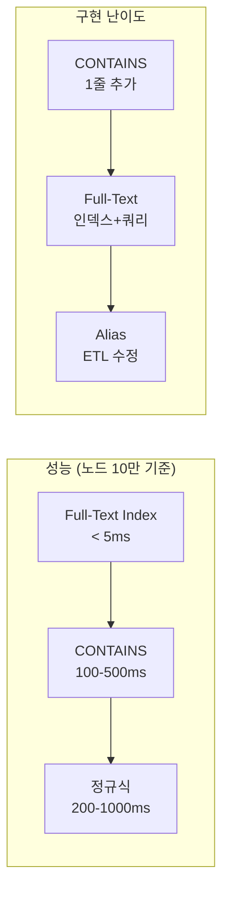

# Neo4j Subgraph 쿼리 최적화 - CONTAINS vs Full-Text Index

**작성일**: 2026-02-08
**작성자**: Claude Code (TechLead 위임)
**상태**: CONTAINS 적용 → Full-Text Index 전환 예정

---

## 1. 문제 배경

### 현상
Graph Panel에서 엔티티를 검색할 때 **정확히 일치하는 이름**만 매칭되어 관련 노드가 0건 반환됨.

```
요청: entity_name = "MSA"
Neo4j 실제 노드: "MSA 기반 서비스 전환 프로젝트", "마이크로서비스 아키텍처(MSA)"
결과: nodes=[], edges=[], node_count=0
```

### 원인
`query_subgraph` Cypher 쿼리가 **exact match** (`=`)만 사용:

```cypher
-- 변경 전 (exact match only)
WHERE center.name = $entity_name OR center.value = $entity_name
```

---

## 2. 해결 방법 비교

### 방법 A: CONTAINS (현재 적용)

```cypher
WHERE center.name = $entity_name
   OR center.value = $entity_name
   OR center.name CONTAINS $entity_name
ORDER BY CASE
    WHEN center.name = $entity_name THEN 0
    WHEN center.value = $entity_name THEN 1
    ELSE 2
END
LIMIT 1
```

| 항목 | 평가 |
|------|------|
| **구현 난이도** | 매우 쉬움 (1줄 추가) |
| **매칭 방식** | 부분 문자열 매칭 |
| **인덱스 활용** | 불가 (전체 노드 스캔) |
| **성능** | O(N) - 전체 노드 수에 비례 |
| **현재 노드 수** | 73개 → **< 1ms** |
| **1만 노드** | ~10-50ms (허용 가능) |
| **10만 노드** | ~100-500ms (성능 저하 시작) |
| **100만 노드** | ~수 초 (사용 불가) |

**장점**: 즉시 적용 가능, 코드 변경 최소
**단점**: 노드 증가 시 선형 성능 저하, 형태소/유사어 매칭 불가

### 방법 B: Full-Text Index (권장, 전환 예정)

```cypher
-- 1. 인덱스 생성 (1회)
CREATE FULLTEXT INDEX entity_fulltext_idx
FOR (n:Topic|Technology|Person|Knowledge|Keyword|Chunk)
ON EACH [n.name, n.value]
OPTIONS { indexConfig: {
  `fulltext.analyzer`: 'standard-no-stop-words',
  `fulltext.eventually_consistent`: false
}}

-- 2. 쿼리
CALL db.index.fulltext.queryNodes("entity_fulltext_idx", $entity_name)
YIELD node, score
WITH node AS center, score
ORDER BY score DESC
LIMIT 1
```

| 항목 | 평가 |
|------|------|
| **구현 난이도** | 중간 (인덱스 생성 + 쿼리 변경) |
| **매칭 방식** | 토큰 기반 (단어 단위 매칭) |
| **인덱스 활용** | Lucene 역인덱스 활용 |
| **성능** | O(1) ~ O(log N) |
| **현재 노드 수** | 73개 → **< 1ms** |
| **1만 노드** | **< 1ms** |
| **10만 노드** | **< 5ms** |
| **100만 노드** | **< 10ms** |

**장점**: 일정한 성능, 토큰 단위 매칭 ("MSA"로 "MSA 기반 프로젝트" 검색 가능), 관련도 점수 제공
**단점**: 인덱스 생성 필요, 한글 형태소 분석은 기본 analyzer로 제한적

### 방법 C: 정규식 매칭 (`=~`)

```cypher
WHERE center.name =~ ('(?i).*' + $entity_name + '.*')
```

| 항목 | 평가 |
|------|------|
| **성능** | CONTAINS보다 **느림** (정규식 엔진 오버헤드) |
| **유연성** | 높음 (패턴 매칭 가능) |
| **인덱스 활용** | 불가 |

**비추천**: CONTAINS보다 느리면서 실용적 이점이 적음.

### 방법 D: 별도 Alias 속성

```cypher
-- 노드에 aliases 배열 추가
SET n.aliases = ["MSA", "마이크로서비스"]

-- 쿼리
WHERE $entity_name IN center.aliases
```

**비추천**: ETL 파이프라인 수정 필요, 유지보수 비용 높음.

---

## 3. 비교 요약



| 방법 | 성능 (10만 노드) | 구현 난이도 | 한글 지원 | 관련도 점수 | 추천 |
|------|:-:|:-:|:-:|:-:|:-:|
| **Full-Text Index** | < 5ms | 중간 | 토큰 단위 | O | **1순위** |
| **CONTAINS** | 100-500ms | 매우 쉬움 | 부분 문자열 | X | 임시 사용 |
| **정규식** | 200-1000ms | 쉬움 | 패턴 매칭 | X | 비추천 |
| **Alias 속성** | < 1ms | 높음 | 수동 관리 | X | 비추천 |

---

## 4. 전환 계획: CONTAINS → Full-Text Index

### Phase 1: 현재 (CONTAINS 적용 중)
- 73개 노드에서 성능 문제 없음
- exact match 우선 (`ORDER BY CASE`)으로 정확도 보장

### Phase 2: Full-Text Index 전환

#### Step 1. 인덱스 생성

```cypher
-- Neo4j Browser 또는 cypher-shell에서 실행
CREATE FULLTEXT INDEX entity_fulltext_idx IF NOT EXISTS
FOR (n:Topic|Technology|Person|Knowledge|Keyword|Chunk)
ON EACH [n.name]
OPTIONS { indexConfig: {
  `fulltext.analyzer`: 'standard-no-stop-words',
  `fulltext.eventually_consistent`: false
}}
```

#### Step 2. 인덱스 상태 확인

```cypher
SHOW INDEXES
WHERE name = 'entity_fulltext_idx'
```

#### Step 3. `query_subgraph` 쿼리 변경

**파일**: `knowledge_service/src/app/storage/neo4j_storage.py` (line 775~)

```python
# Before (CONTAINS)
cypher = f"""
MATCH (center)
WHERE center.name = $entity_name OR center.value = $entity_name
   OR center.name CONTAINS $entity_name
...
"""

# After (Full-Text Index)
cypher = f"""
CALL db.index.fulltext.queryNodes("entity_fulltext_idx", $entity_name)
YIELD node AS center, score
WITH center
ORDER BY score DESC
LIMIT 1
CALL {{
    WITH center
    MATCH (center)-[r*1..{validated_depth}]-(related)
    WITH DISTINCT related
    RETURN related
    LIMIT $limit
}}
...
"""
```

#### Step 4. Fallback 전략 (인덱스 미존재 시)

```python
async def query_subgraph(self, entity_name, depth=2, limit=50):
    # Full-text index 사용 시도
    try:
        result = await self._query_subgraph_fulltext(entity_name, depth, limit)
        if result["nodes"]:
            return result
    except Exception:
        logger.warning("Full-text index not available, falling back to CONTAINS")

    # Fallback: CONTAINS
    return await self._query_subgraph_contains(entity_name, depth, limit)
```

### Phase 3: 한글 형태소 분석 (선택)

Neo4j 기본 `standard` analyzer는 공백/구두점 기반 토크나이저입니다. 한글 형태소 분석이 필요하면:

1. **Custom Analyzer 플러그인**: `lucene-analysis-nori` (한국어) 설치
2. **인덱스 재생성**: nori analyzer 적용

```cypher
-- nori analyzer 적용 (플러그인 설치 후)
CREATE FULLTEXT INDEX entity_fulltext_kr_idx
FOR (n:Topic|Technology|Person)
ON EACH [n.name]
OPTIONS { indexConfig: {
  `fulltext.analyzer`: 'korean'
}}
```

현재 데이터가 "MSA 기반 서비스 전환 프로젝트" 형태이므로 standard analyzer의 공백 토크나이저만으로도 "MSA"를 매칭할 수 있습니다.

---

## 5. 모니터링 기준

Full-Text Index 전환 후 확인할 지표:

| 지표 | 기준값 | 측정 방법 |
|------|--------|----------|
| subgraph 응답 시간 | < 100ms | Gateway 로그 Duration |
| 매칭 정확도 | 검색어와 center 노드 관련도 | 수동 검증 |
| 인덱스 크기 | < 10MB (현재 규모) | `SHOW INDEXES` |

---

## 6. 참고

- [Neo4j Full-Text Indexes](https://neo4j.com/docs/cypher-manual/current/indexes/semantic-indexes/full-text-indexes/)
- 현재 프로젝트 Neo4j 노드: 73개 (Technology 26, Topic 24, Person 8, Chunk 7, Knowledge 5, Keyword 3)
- 수정 대상 파일: `knowledge_service/src/app/storage/neo4j_storage.py` → `query_subgraph()`
