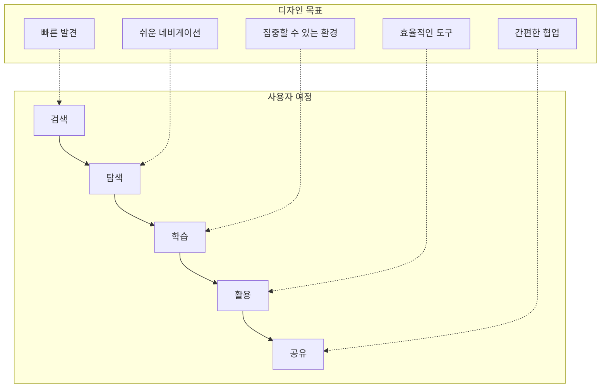
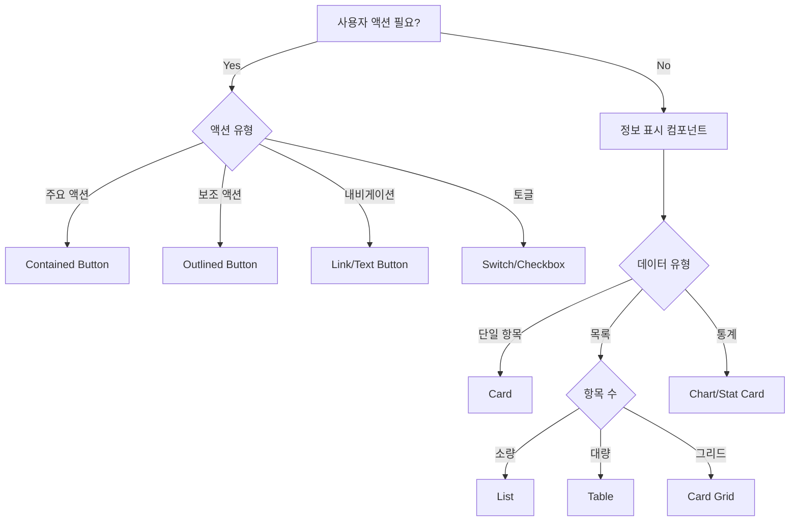

# UI 디자인 시스템 가이드

---

## 문서 정보

| 항목 | 내용 |
|------|------|
| **문서명** | UI 디자인 시스템 가이드 |
| **버전** | 1.0 |
| **작성일** | 2026-01-16 |
| **작성자** | Claude Code (Opus 4.5) |
| **상태** | Draft |
| **관련 문서** | [프론트엔드 설계서](./frontend_detailed_design.md), [UI 스토리보드](./ui_storyboard/), [용어집](./glossary.md) |

---

## 변경 이력

| 버전 | 일자 | 작성자 | 변경 내용 |
|------|------|--------|----------|
| 1.0 | 2026-01-16 | Claude Code | 초안 작성 |

---

## 목차

1. [디자인 원칙](#1-디자인-원칙)
2. [브랜드 아이덴티티](#2-브랜드-아이덴티티)
3. [색상 시스템](#3-색상-시스템)
4. [타이포그래피](#4-타이포그래피)
5. [스페이싱 시스템](#5-스페이싱-시스템)
6. [아이콘 가이드라인](#6-아이콘-가이드라인)
7. [컴포넌트 가이드라인](#7-컴포넌트-가이드라인)
8. [레이아웃 패턴](#8-레이아웃-패턴)
9. [모션 & 애니메이션](#9-모션--애니메이션)
10. [접근성 가이드](#10-접근성-가이드)
11. [다크 모드](#11-다크-모드)
12. [반응형 디자인](#12-반응형-디자인)
13. [UI 카피 가이드](#13-ui-카피-가이드)

---

## 1. 디자인 원칙

### 1.1 핵심 원칙

Knowledge Platform의 UI는 다음 5가지 원칙을 따릅니다:

```
┌─────────────────────────────────────────────────────────────┐
│                      디자인 원칙                             │
├─────────────────────────────────────────────────────────────┤
│                                                             │
│   1. 명확성 (Clarity)                                       │
│      └─ 정보는 한눈에 이해할 수 있어야 한다                   │
│                                                             │
│   2. 효율성 (Efficiency)                                    │
│      └─ 최소한의 클릭으로 목표에 도달한다                    │
│                                                             │
│   3. 일관성 (Consistency)                                   │
│      └─ 동일한 패턴은 동일하게 동작한다                      │
│                                                             │
│   4. 접근성 (Accessibility)                                 │
│      └─ 모든 사용자가 동등하게 사용할 수 있다                │
│                                                             │
│   5. 신뢰성 (Trust)                                         │
│      └─ 예측 가능하고 안정적인 경험을 제공한다               │
│                                                             │
└─────────────────────────────────────────────────────────────┘
```

### 1.2 디자인 철학

#### Anti-Pattern First 접근

**뻔한 디자인을 피하고 독창성을 추구합니다.**

```
❌ 피해야 할 패턴:
   • 무분별한 파란색 그라데이션
   • 의미 없는 장식적 요소
   • 과도한 그림자와 효과
   • 획일적인 카드 레이아웃

✅ 추구하는 패턴:
   • 목적에 맞는 색상 사용
   • 기능에 충실한 미니멀리즘
   • 의도적인 여백 활용
   • 정보 계층에 맞는 레이아웃
```

### 1.3 사용자 중심 설계



---

## 2. 브랜드 아이덴티티

### 2.1 브랜드 가치

| 가치 | 설명 | 디자인 반영 |
|------|------|------------|
| **전문성** | 신뢰할 수 있는 지식 플랫폼 | 절제된 색상, 명확한 타이포그래피 |
| **혁신성** | AI 기반 지능형 검색 | 현대적 UI, 스마트한 인터랙션 |
| **접근성** | 누구나 쉽게 사용 | 직관적 네비게이션, WCAG 준수 |
| **협업** | 지식의 공유와 성장 | 소셜 기능, 공유 UI |

### 2.2 로고 사용 가이드라인

```
┌─────────────────────────────────────────────────────────────┐
│                      로고 사용 규칙                          │
├─────────────────────────────────────────────────────────────┤
│                                                             │
│   최소 여백 (Clear Space):                                  │
│                                                             │
│       ┌──────────┐                                          │
│       │  ╔════╗  │  ← 로고 높이의 50%를                     │
│       │  ║ K  ║  │    사방에 여백으로 확보                   │
│       │  ╚════╝  │                                          │
│       └──────────┘                                          │
│                                                             │
│   최소 크기:                                                │
│   • 디지털: 24px (높이)                                     │
│   • 인쇄: 10mm (높이)                                       │
│                                                             │
│   배경 색상별 로고:                                          │
│   • 밝은 배경: Primary 색상 로고                             │
│   • 어두운 배경: 흰색 로고                                   │
│   • 사진 위: 흰색 로고 + 반투명 배경                         │
│                                                             │
└─────────────────────────────────────────────────────────────┘
```

### 2.3 브랜드 톤 앤 매너

```
Voice (목소리):
├── 전문적이면서 친근한
├── 간결하고 명확한
├── 도움을 주려는 태도
└── 긍정적이고 격려하는

Tone (어조):
├── 일반 상황: 중립적, 정보 제공적
├── 성공 메시지: 축하하는, 격려하는
├── 오류 메시지: 차분한, 해결 지향적
└── 로딩 상태: 기대감을 주는
```

---

## 3. 색상 시스템

### 3.1 Primary 색상

> **참고**: MUI 테마 구현은 [프론트엔드 설계서 8.2절](./frontend_detailed_design.md#82-색상-팔레트) 참조

```
┌─────────────────────────────────────────────────────────────┐
│                    Primary Color: Blue                       │
├─────────────────────────────────────────────────────────────┤
│                                                             │
│   ┌─────────┐  Primary Main: #1976D2                        │
│   │ ██████  │  • CTA 버튼, 주요 링크                         │
│   │ ██████  │  • 선택된 상태, 활성 탭                        │
│   └─────────┘  • 대비비: 흰색 텍스트 4.5:1 ✓                │
│                                                             │
│   ┌─────────┐  Primary Light: #42A5F5                       │
│   │ ░░░░░░  │  • 호버 상태                                  │
│   │ ░░░░░░  │  • 배경 강조                                  │
│   └─────────┘  • 보조 표시자                                │
│                                                             │
│   ┌─────────┐  Primary Dark: #1565C0                        │
│   │ ▓▓▓▓▓▓  │  • 눌림 상태                                  │
│   │ ▓▓▓▓▓▓  │  • 강조된 헤더                                │
│   └─────────┘  • 포커스 링                                  │
│                                                             │
└─────────────────────────────────────────────────────────────┘
```

### 3.2 시맨틱 색상 가이드

| 색상 | 용도 | 사용 예시 | Do | Don't |
|------|------|----------|-----|-------|
| **Success** (#2E7D32) | 긍정적 결과 | 저장 완료, 검증 통과 | 동작 완료 알림 | 일반 버튼 색상 |
| **Error** (#D32F2F) | 오류, 위험 | 유효성 오류, 삭제 경고 | 필수 입력 표시 | 장식용 강조 |
| **Warning** (#ED6C02) | 주의, 경고 | 만료 예정, 주의 사항 | 비가역적 작업 경고 | 정보 표시용 |
| **Info** (#0288D1) | 정보, 안내 | 도움말, 힌트 | 추가 정보 제공 | 액션 버튼 |

### 3.3 색상 사용 규칙

#### 60-30-10 Rule

```
┌─────────────────────────────────────────────────────────────┐
│                    색상 비율 가이드                          │
├─────────────────────────────────────────────────────────────┤
│                                                             │
│   60% ─ 배경 색상 (Background)                              │
│         Light: #F5F5F5 / Dark: #121212                      │
│         └─ 페이지 배경, 카드 배경                           │
│                                                             │
│   30% ─ 보조 색상 (Secondary)                               │
│         Text, Borders, Dividers                             │
│         └─ 텍스트, 구분선, 아이콘                           │
│                                                             │
│   10% ─ 강조 색상 (Accent)                                  │
│         Primary Blue, Semantic Colors                       │
│         └─ CTA, 링크, 중요 정보 강조                        │
│                                                             │
└─────────────────────────────────────────────────────────────┘
```

#### 색상 접근성 체크리스트

```
✅ 필수 확인 사항:

□ 텍스트 대비비 4.5:1 이상 (WCAG AA)
  • 일반 텍스트: 16px 미만

□ 큰 텍스트 대비비 3:1 이상
  • 18px 이상 또는 14px Bold

□ UI 컴포넌트 대비비 3:1 이상
  • 버튼 테두리, 입력 필드 테두리

□ 색상만으로 정보 전달 금지
  • 아이콘, 텍스트 레이블 병행
```

### 3.4 색상 토큰

```typescript
// 시맨틱 토큰 (의미 기반)
const semanticTokens = {
  // 텍스트
  'text.primary': '#212121',        // 주요 텍스트
  'text.secondary': '#757575',      // 보조 텍스트
  'text.disabled': '#9E9E9E',       // 비활성 텍스트
  'text.inverse': '#FFFFFF',        // 반전 텍스트 (어두운 배경)

  // 배경
  'bg.primary': '#FFFFFF',          // 주요 배경
  'bg.secondary': '#F5F5F5',        // 보조 배경
  'bg.elevated': '#FFFFFF',         // 떠있는 요소 배경

  // 테두리
  'border.default': '#E0E0E0',      // 기본 테두리
  'border.focused': '#1976D2',      // 포커스 테두리
  'border.error': '#D32F2F',        // 에러 테두리

  // 인터랙티브
  'interactive.primary': '#1976D2', // 주요 인터랙티브
  'interactive.hover': '#42A5F5',   // 호버 상태
  'interactive.pressed': '#1565C0', // 눌림 상태
  'interactive.disabled': '#BDBDBD' // 비활성 상태
};
```

---

## 4. 타이포그래피

### 4.1 폰트 선택

> **참고**: 폰트 스타일 구현은 [프론트엔드 설계서 8.3절](./frontend_detailed_design.md#83-타이포그래피) 참조

```
┌─────────────────────────────────────────────────────────────┐
│                      폰트 스택                               │
├─────────────────────────────────────────────────────────────┤
│                                                             │
│   Primary: Pretendard                                       │
│   ├── 한글 최적화된 가변 폰트                                │
│   ├── 다양한 굵기 지원 (100-900)                            │
│   └── 웹 성능 최적화 (Variable Font)                        │
│                                                             │
│   Fallback Stack:                                           │
│   Pretendard → -apple-system → BlinkMacSystemFont          │
│   → Segoe UI → Roboto → sans-serif                         │
│                                                             │
│   Monospace: D2Coding                                       │
│   └── 코드 블록, 기술 정보 표시                             │
│                                                             │
└─────────────────────────────────────────────────────────────┘
```

### 4.2 타입 스케일

```
┌─────────────────────────────────────────────────────────────┐
│                     Type Scale (1.25 ratio)                  │
├─────────────────────────────────────────────────────────────┤
│                                                             │
│   Display     48px / 700 / 1.1    페이지 메인 타이틀        │
│   ════════════════════════════                              │
│                                                             │
│   H1          40px / 700 / 1.2    섹션 헤딩                 │
│   ══════════════════════                                    │
│                                                             │
│   H2          32px / 700 / 1.3    서브섹션 헤딩             │
│   ════════════════════                                      │
│                                                             │
│   H3          24px / 600 / 1.4    카드 타이틀               │
│   ══════════════                                            │
│                                                             │
│   H4          20px / 600 / 1.4    리스트 아이템 헤딩        │
│   ════════════                                              │
│                                                             │
│   Body 1      16px / 400 / 1.6    본문 텍스트               │
│   ══════════                                                │
│                                                             │
│   Body 2      14px / 400 / 1.6    보조 텍스트               │
│   ════════                                                  │
│                                                             │
│   Caption     12px / 400 / 1.5    캡션, 힌트                │
│   ══════                                                    │
│                                                             │
└─────────────────────────────────────────────────────────────┘
```

### 4.3 한글 타이포그래피 최적화

```css
/* 한글 최적화 CSS */

/* 1. 행간 (Line Height) - 한글은 영문보다 넓게 */
body {
  line-height: 1.6;      /* 본문: 영문 1.5 → 한글 1.6 */
}

h1, h2, h3 {
  line-height: 1.3;      /* 제목: 타이트하게 */
}

/* 2. 자간 (Letter Spacing) - 약간 타이트하게 */
body {
  letter-spacing: -0.01em;
}

h1 {
  letter-spacing: -0.02em;  /* 큰 제목은 더 타이트 */
}

/* 3. 단어 분리 - 한글 단어 단위로 줄바꿈 */
p, li, td {
  word-break: keep-all;
  overflow-wrap: break-word;
}

/* 4. 숫자 정렬 - 테이블에서 숫자 폭 고정 */
.numeric {
  font-variant-numeric: tabular-nums;
}
```

### 4.4 타이포그래피 사용 가이드

| 요소 | 스타일 | 사용 예시 |
|------|--------|----------|
| **Display** | 48px Bold | 대시보드 환영 메시지 |
| **H1** | 40px Bold | 페이지 타이틀 (지식 검색) |
| **H2** | 32px Bold | 섹션 타이틀 (최근 검색) |
| **H3** | 24px Semi | 카드 타이틀 |
| **Body 1** | 16px Regular | 본문, 설명 |
| **Body 2** | 14px Regular | 메타 정보, 날짜 |
| **Caption** | 12px Regular | 힌트, 라벨 |
| **Overline** | 10px Semi CAPS | 카테고리 태그 |

---

## 5. 스페이싱 시스템

### 5.1 기본 단위

```
┌─────────────────────────────────────────────────────────────┐
│                 Spacing Scale (Base: 8px)                    │
├─────────────────────────────────────────────────────────────┤
│                                                             │
│   Space Token   Value    Visual          Use Case           │
│   ─────────────────────────────────────────────────────────│
│                                                             │
│   spacing-0     0px      │               없음               │
│   spacing-1     4px      ├─              인라인 간격        │
│   spacing-2     8px      ├───            아이콘-텍스트      │
│   spacing-3     12px     ├─────          관련 요소 간격     │
│   spacing-4     16px     ├───────        컴포넌트 내부      │
│   spacing-5     20px     ├─────────      카드 패딩          │
│   spacing-6     24px     ├───────────    섹션 내 간격       │
│   spacing-8     32px     ├─────────────  컴포넌트 간격      │
│   spacing-10    40px     ├───────────────섹션 간격          │
│   spacing-12    48px     ├─────────────────대섹션 간격      │
│   spacing-16    64px     ├───────────────────페이지 패딩    │
│                                                             │
└─────────────────────────────────────────────────────────────┘
```

### 5.2 스페이싱 적용 예시

```
┌─────────────────────────────────────────────────────────────┐
│                        카드 컴포넌트                         │
├─────────────────────────────────────────────────────────────┤
│                                                             │
│   ┌─────────────────────────────────────────┐              │
│   │← padding-5 (20px) →│                    │              │
│   │ ┌─────────────────────────────────────┐ │              │
│   │ │ ◉ 아이콘  제목 텍스트               │ │              │
│   │ │  ↑                                  │ │              │
│   │ │  spacing-2 (8px)                    │ │              │
│   │ └─────────────────────────────────────┘ │              │
│   │           ↓ spacing-3 (12px)            │              │
│   │ ┌─────────────────────────────────────┐ │              │
│   │ │ 본문 설명 텍스트가 여기에            │ │              │
│   │ │ 들어갑니다...                        │ │              │
│   │ └─────────────────────────────────────┘ │              │
│   │           ↓ spacing-4 (16px)            │              │
│   │ ┌─────────────────────────────────────┐ │              │
│   │ │ [버튼 1]  [버튼 2]                   │ │              │
│   │ │    ↑ spacing-2 (8px) ↑              │ │              │
│   │ └─────────────────────────────────────┘ │              │
│   └─────────────────────────────────────────┘              │
│                                                             │
│   카드 간 간격: spacing-6 (24px)                            │
│                                                             │
└─────────────────────────────────────────────────────────────┘
```

### 5.3 컴포넌트별 스페이싱

| 컴포넌트 | 내부 패딩 | 요소 간 간격 | 외부 간격 |
|----------|----------|-------------|----------|
| **Button** | 8px 16px | - | - |
| **Card** | 20px | 12-16px | 24px |
| **Input** | 8px 12px | - | 16px (label) |
| **Dialog** | 24px | 16px | - |
| **Table Cell** | 12px 16px | - | - |
| **List Item** | 12px 16px | 8px | - |
| **Nav Item** | 8px 16px | 4px | - |

---

## 6. 아이콘 가이드라인

### 6.1 아이콘 시스템

```
┌─────────────────────────────────────────────────────────────┐
│                      아이콘 라이브러리                        │
├─────────────────────────────────────────────────────────────┤
│                                                             │
│   Primary: Material Icons (Outlined)                        │
│   ├── 일관된 스타일                                         │
│   ├── 다양한 카테고리                                       │
│   └── React 컴포넌트 지원 (@mui/icons-material)             │
│                                                             │
│   Secondary: Custom Icons (SVG)                             │
│   └── 브랜드 특화 아이콘 (로고, 특수 기능)                  │
│                                                             │
└─────────────────────────────────────────────────────────────┘
```

### 6.2 아이콘 크기

```
┌────────────────────────────────────────────────────────────┐
│                      Icon Sizes                             │
├────────────────────────────────────────────────────────────┤
│                                                            │
│   Size      Dimension    Touch Target    Use Case          │
│   ────────────────────────────────────────────────────────│
│                                                            │
│   Small     16×16px      -               인라인 텍스트     │
│             ○                            작은 버튼         │
│                                                            │
│   Medium    20×20px      -               버튼 내 아이콘    │
│             ◎                            리스트 아이콘     │
│                                                            │
│   Default   24×24px      44×44px         네비게이션        │
│             ◉                            액션 버튼         │
│                                                            │
│   Large     32×32px      48×48px         빈 상태 일러스트  │
│             ⬤                            강조 아이콘       │
│                                                            │
│   XLarge    48×48px      -               페이지 아이콘     │
│             ⬤⬤                           빈 상태 메인     │
│                                                            │
└────────────────────────────────────────────────────────────┘
```

### 6.3 아이콘 사용 원칙

```
✅ Do (올바른 사용):

• 텍스트 레이블과 함께 사용
  [🔍 검색]  [📄 문서]  [⚙️ 설정]

• 일관된 스타일 유지
  모든 아이콘 Outlined 스타일 사용

• 의미 있는 아이콘 선택
  저장 → save, 삭제 → delete

• 접근성 레이블 제공
  aria-label="검색"
```

```
❌ Don't (잘못된 사용):

• 아이콘만으로 기능 표현
  [🔧] ← 무슨 기능인지 불명확

• 스타일 혼용
  Filled + Outlined + Rounded 혼합

• 의미가 불분명한 아이콘
  ⭐ → 즐겨찾기? 평점? 추천?

• 과도한 아이콘 사용
  모든 메뉴에 아이콘 추가
```

### 6.4 핵심 아이콘 매핑

| 기능 | 아이콘 | MUI 이름 | 대안 |
|------|--------|----------|------|
| 검색 | 🔍 | `SearchOutlined` | - |
| 홈 | 🏠 | `HomeOutlined` | - |
| 설정 | ⚙️ | `SettingsOutlined` | `TuneOutlined` |
| 사용자 | 👤 | `PersonOutlined` | `AccountCircleOutlined` |
| 문서 | 📄 | `DescriptionOutlined` | `ArticleOutlined` |
| 폴더 | 📁 | `FolderOutlined` | - |
| 저장 | 💾 | `SaveOutlined` | `BookmarkOutlined` |
| 공유 | 📤 | `ShareOutlined` | `SendOutlined` |
| 삭제 | 🗑️ | `DeleteOutlined` | - |
| 편집 | ✏️ | `EditOutlined` | - |
| 추가 | ➕ | `AddOutlined` | - |
| 닫기 | ✕ | `CloseOutlined` | - |
| 메뉴 | ☰ | `MenuOutlined` | - |
| 알림 | 🔔 | `NotificationsOutlined` | - |
| 도움말 | ❓ | `HelpOutlineOutlined` | - |

---

## 7. 컴포넌트 가이드라인

### 7.1 버튼 (Button)

```
┌─────────────────────────────────────────────────────────────┐
│                       Button Variants                        │
├─────────────────────────────────────────────────────────────┤
│                                                             │
│   Contained (Primary Action)                                │
│   ┌─────────────────┐                                       │
│   │   저장하기       │  • CTA, 주요 액션                    │
│   └─────────────────┘  • 페이지당 1-2개                     │
│                                                             │
│   Outlined (Secondary Action)                               │
│   ┌─────────────────┐                                       │
│   │   취소          │  • 보조 액션                          │
│   └─────────────────┘  • Contained와 함께 사용              │
│                                                             │
│   Text (Tertiary Action)                                    │
│   ┌─────────────────┐                                       │
│   │   더보기        │  • 덜 중요한 액션                     │
│   └─────────────────┘  • 링크 스타일 대체                   │
│                                                             │
│   Icon Button                                               │
│   ┌───┐                                                     │
│   │ ⚙ │            • 공간 제약 시                          │
│   └───┘            • 명확한 의미의 아이콘만                 │
│                                                             │
└─────────────────────────────────────────────────────────────┘
```

#### 버튼 상태

```
┌─────────────────────────────────────────────────────────────┐
│                      Button States                           │
├─────────────────────────────────────────────────────────────┤
│                                                             │
│   Default    ██████████  #1976D2   기본 상태               │
│                                                             │
│   Hover      ░░░░░░░░░░  #42A5F5   마우스 오버             │
│                                                             │
│   Focus      ┌────────┐  + Focus Ring   키보드 포커스      │
│              │████████│  (2px solid)                       │
│              └────────┘                                     │
│                                                             │
│   Pressed    ▓▓▓▓▓▓▓▓▓▓  #1565C0   클릭 중                 │
│                                                             │
│   Disabled   ▒▒▒▒▒▒▒▒▒▒  #BDBDBD   비활성 (cursor: not)   │
│                                                             │
│   Loading    ████ ○ ████  Spinner   로딩 중                │
│                                                             │
└─────────────────────────────────────────────────────────────┘
```

### 7.2 입력 필드 (Input)

```
┌─────────────────────────────────────────────────────────────┐
│                      Input Field                             │
├─────────────────────────────────────────────────────────────┤
│                                                             │
│   Label                                                     │
│   ┌─────────────────────────────────┐                       │
│   │ Placeholder text                │ ← Helper icon        │
│   └─────────────────────────────────┘                       │
│   Helper text                                               │
│                                                             │
│   ─────────────────────────────────────────────────────────│
│                                                             │
│   States:                                                   │
│                                                             │
│   Default    ┌──────────────────┐   #E0E0E0 border        │
│              │                  │                          │
│              └──────────────────┘                          │
│                                                             │
│   Focused    ┌──────────────────┐   #1976D2 border (2px)  │
│              │ |                │                          │
│              └──────────────────┘                          │
│                                                             │
│   Error      ┌──────────────────┐   #D32F2F border        │
│              │ Invalid input    │                          │
│              └──────────────────┘                          │
│              ⚠ 필수 입력 항목입니다                         │
│                                                             │
│   Disabled   ┌──────────────────┐   #F5F5F5 background    │
│              │ Disabled         │                          │
│              └──────────────────┘                          │
│                                                             │
└─────────────────────────────────────────────────────────────┘
```

### 7.3 카드 (Card)

```
┌─────────────────────────────────────────────────────────────┐
│                      Card Variants                           │
├─────────────────────────────────────────────────────────────┤
│                                                             │
│   Basic Card                                                │
│   ┏━━━━━━━━━━━━━━━━━━━━━━━━━━━━━━━━━━━━━━━━━━━━━┓          │
│   ┃                                             ┃          │
│   ┃   Card Title                               ┃          │
│   ┃                                             ┃          │
│   ┃   Card content goes here. This can be      ┃          │
│   ┃   multiple lines of text.                  ┃          │
│   ┃                                             ┃          │
│   ┃   [Action 1]  [Action 2]                   ┃          │
│   ┃                                             ┃          │
│   ┗━━━━━━━━━━━━━━━━━━━━━━━━━━━━━━━━━━━━━━━━━━━━━┛          │
│                                                             │
│   Knowledge Card (특화)                                     │
│   ┏━━━━━━━━━━━━━━━━━━━━━━━━━━━━━━━━━━━━━━━━━━━━━┓          │
│   ┃ POLICY                         ⋮ ☆ 📤     ┃          │
│   ┃━━━━━━━━━━━━━━━━━━━━━━━━━━━━━━━━━━━━━━━━━━━━┃          │
│   ┃ 📄 문서 제목이 여기에 표시됩니다            ┃          │
│   ┃                                             ┃          │
│   ┃ 문서 요약 내용이 2-3줄 정도로 표시...       ┃          │
│   ┃                                             ┃          │
│   ┃ 👤 작성자  📅 2026-01-15  👁 1,234         ┃          │
│   ┃                                             ┃          │
│   ┃ #태그1  #태그2  #태그3                      ┃          │
│   ┗━━━━━━━━━━━━━━━━━━━━━━━━━━━━━━━━━━━━━━━━━━━━━┛          │
│                                                             │
└─────────────────────────────────────────────────────────────┘
```

### 7.4 모달/다이얼로그 (Dialog)

```
┌─────────────────────────────────────────────────────────────┐
│                      Dialog Structure                        │
├─────────────────────────────────────────────────────────────┤
│                                                             │
│   ┏━━━━━━━━━━━━━━━━━━━━━━━━━━━━━━━━━━━━━━━━━━━━━━━━━━━━┓   │
│   ┃                                                    ┃   │
│   ┃   Dialog Title                               ✕    ┃   │
│   ┃────────────────────────────────────────────────────┃   │
│   ┃                                                    ┃   │
│   ┃   Dialog content area.                             ┃   │
│   ┃                                                    ┃   │
│   ┃   - 최대 너비: 560px (sm), 720px (md)             ┃   │
│   ┃   - 모바일: 전체 너비 - 32px                      ┃   │
│   ┃                                                    ┃   │
│   ┃────────────────────────────────────────────────────┃   │
│   ┃                          [취소]  [확인]           ┃   │
│   ┃                                                    ┃   │
│   ┗━━━━━━━━━━━━━━━━━━━━━━━━━━━━━━━━━━━━━━━━━━━━━━━━━━━━┛   │
│                                                             │
│   Types:                                                    │
│   • Alert: 정보 전달 (확인 버튼만)                          │
│   • Confirm: 확인/취소 선택                                 │
│   • Form: 입력 폼 포함                                      │
│   • Full-screen: 복잡한 작업 (모바일)                       │
│                                                             │
└─────────────────────────────────────────────────────────────┘
```

### 7.5 테이블 (Table)

```
┌─────────────────────────────────────────────────────────────┐
│                      Data Table                              │
├─────────────────────────────────────────────────────────────┤
│                                                             │
│   ┏━━━━━━━━━━━━━━━━━━━━━━━━━━━━━━━━━━━━━━━━━━━━━━━━━━━━━┓  │
│   ┃ ☐ │ 제목 ▼      │ 유형   │ 작성자  │ 날짜 ▼  │ ⋮  ┃  │
│   ┣━━━┿━━━━━━━━━━━━━┿━━━━━━━━┿━━━━━━━━━┿━━━━━━━━━┿━━━━┫  │
│   ┃ ☐ │ 문서 제목 1  │ 정책   │ 홍길동  │ 01-15  │ ⋮  ┃  │
│   ┃───┼─────────────┼────────┼─────────┼─────────┼────┃  │
│   ┃ ☑ │ 문서 제목 2  │ 매뉴얼 │ 김철수  │ 01-14  │ ⋮  ┃  │
│   ┃───┼─────────────┼────────┼─────────┼─────────┼────┃  │
│   ┃ ☐ │ 문서 제목 3  │ 가이드 │ 이영희  │ 01-13  │ ⋮  ┃  │
│   ┗━━━┷━━━━━━━━━━━━━┷━━━━━━━━┷━━━━━━━━━┷━━━━━━━━━┷━━━━┛  │
│                                                             │
│   Features:                                                 │
│   • 정렬: 클릭 시 오름/내림차순 토글                        │
│   • 선택: 체크박스로 다중 선택                              │
│   • 액션: 행별 컨텍스트 메뉴                                │
│   • 페이지네이션: 하단에 표시                               │
│   • 반응형: 모바일에서 카드 뷰로 전환                       │
│                                                             │
└─────────────────────────────────────────────────────────────┘
```

### 7.6 컴포넌트 선택 가이드



---

## 8. 레이아웃 패턴

### 8.1 페이지 구조

```
┌─────────────────────────────────────────────────────────────┐
│                      Page Layout                             │
├─────────────────────────────────────────────────────────────┤
│                                                             │
│   ┌─────────────────────────────────────────────────────┐  │
│   │                    Header (64px)                     │  │
│   │  [Logo]      [Nav]  [Nav]  [Nav]    [🔔] [👤]       │  │
│   └─────────────────────────────────────────────────────┘  │
│                                                             │
│   ┌──────────┬──────────────────────────────────────────┐  │
│   │          │                                          │  │
│   │ Sidebar  │              Main Content                │  │
│   │ (240px)  │                                          │  │
│   │          │  ┌────────────────────────────────────┐  │  │
│   │ [Nav]    │  │          Page Header               │  │  │
│   │ [Nav]    │  │  Title              [Actions]      │  │  │
│   │ [Nav]    │  └────────────────────────────────────┘  │  │
│   │ ───────  │                                          │  │
│   │ [Nav]    │  ┌────────────────────────────────────┐  │  │
│   │ [Nav]    │  │                                    │  │  │
│   │          │  │          Content Area              │  │  │
│   │          │  │                                    │  │  │
│   │          │  │                                    │  │  │
│   │          │  └────────────────────────────────────┘  │  │
│   │          │                                          │  │
│   └──────────┴──────────────────────────────────────────┘  │
│                                                             │
└─────────────────────────────────────────────────────────────┘
```

### 8.2 콘텐츠 영역 패턴

```
┌─────────────────────────────────────────────────────────────┐
│                    Content Patterns                          │
├─────────────────────────────────────────────────────────────┤
│                                                             │
│   1. Card Grid (지식 목록)                                  │
│   ┌───────┐ ┌───────┐ ┌───────┐                            │
│   │ Card  │ │ Card  │ │ Card  │                            │
│   │       │ │       │ │       │                            │
│   └───────┘ └───────┘ └───────┘                            │
│   ┌───────┐ ┌───────┐ ┌───────┐                            │
│   │ Card  │ │ Card  │ │ Card  │                            │
│   │       │ │       │ │       │                            │
│   └───────┘ └───────┘ └───────┘                            │
│                                                             │
│   2. Split View (상세 + 목록)                               │
│   ┌─────────────────────┬───────────────┐                  │
│   │                     │               │                  │
│   │    Main Content     │   Side Panel  │                  │
│   │    (2/3)            │   (1/3)       │                  │
│   │                     │               │                  │
│   └─────────────────────┴───────────────┘                  │
│                                                             │
│   3. Master-Detail (목록 → 상세)                           │
│   ┌────────────┐ ←──→ ┌────────────────────────┐           │
│   │ List Item  │      │                        │           │
│   │ List Item* │  →   │    Detail View         │           │
│   │ List Item  │      │                        │           │
│   └────────────┘      └────────────────────────┘           │
│                                                             │
│   4. Single Column (문서 읽기)                              │
│   ┌─────────────────────────────────────────┐              │
│   │           max-width: 800px              │              │
│   │                                         │              │
│   │    Long-form content optimized for      │              │
│   │    reading...                           │              │
│   │                                         │              │
│   └─────────────────────────────────────────┘              │
│                                                             │
└─────────────────────────────────────────────────────────────┘
```

### 8.3 그리드 시스템

```css
/* 12 Column Grid */
.grid-container {
  display: grid;
  grid-template-columns: repeat(12, 1fr);
  gap: 24px;  /* spacing-6 */
}

/* 반응형 카드 그리드 */
.card-grid {
  display: grid;
  grid-template-columns: repeat(auto-fill, minmax(300px, 1fr));
  gap: 24px;
}

/* 콘텐츠 최대 너비 */
.content-container {
  max-width: 1200px;
  margin: 0 auto;
  padding: 0 24px;
}

/* 읽기 최적화 너비 */
.reading-container {
  max-width: 720px;  /* 60-70 characters per line */
  margin: 0 auto;
}
```

---

## 9. 모션 & 애니메이션

### 9.1 모션 원칙

```
┌─────────────────────────────────────────────────────────────┐
│                    Motion Principles                         │
├─────────────────────────────────────────────────────────────┤
│                                                             │
│   1. 목적성 (Purpose)                                       │
│      └─ 모든 모션은 의미가 있어야 함                        │
│                                                             │
│   2. 자연스러움 (Natural)                                   │
│      └─ 물리 법칙을 따르는 움직임                           │
│                                                             │
│   3. 빠른 피드백 (Responsive)                               │
│      └─ 100ms 이내 반응                                     │
│                                                             │
│   4. 일관성 (Consistent)                                    │
│      └─ 동일 패턴, 동일 모션                                │
│                                                             │
│   5. 접근성 (Accessible)                                    │
│      └─ reduced-motion 지원                                │
│                                                             │
└─────────────────────────────────────────────────────────────┘
```

### 9.2 타이밍 시스템

```css
:root {
  /* Duration */
  --duration-instant: 50ms;    /* 즉각 반응 (호버) */
  --duration-fast: 150ms;      /* 빠른 피드백 */
  --duration-normal: 300ms;    /* 일반 전환 */
  --duration-slow: 500ms;      /* 강조 전환 */

  /* Easing */
  --ease-out: cubic-bezier(0, 0, 0.2, 1);         /* 감속 */
  --ease-in: cubic-bezier(0.4, 0, 1, 1);          /* 가속 */
  --ease-in-out: cubic-bezier(0.4, 0, 0.2, 1);    /* 가속+감속 */
  --ease-bounce: cubic-bezier(0.68, -0.55, 0.265, 1.55);
}
```

### 9.3 모션 패턴

```
┌─────────────────────────────────────────────────────────────┐
│                     Motion Patterns                          │
├─────────────────────────────────────────────────────────────┤
│                                                             │
│   Entrance (등장)                                           │
│   ────────────────                                          │
│   • Fade In + Slide Up                                      │
│   • Duration: 300ms                                         │
│   • Easing: ease-out                                        │
│                                                             │
│   ○ → ◐ → ● (opacity: 0 → 1, translateY: 20px → 0)        │
│                                                             │
│   ─────────────────────────────────────────────────────────│
│                                                             │
│   Exit (퇴장)                                               │
│   ────────────                                              │
│   • Fade Out                                                │
│   • Duration: 200ms                                         │
│   • Easing: ease-in                                         │
│                                                             │
│   ● → ◐ → ○ (opacity: 1 → 0)                              │
│                                                             │
│   ─────────────────────────────────────────────────────────│
│                                                             │
│   Hover (호버)                                              │
│   ──────────                                                │
│   • Scale + Shadow                                          │
│   • Duration: 150ms                                         │
│   • Easing: ease-out                                        │
│                                                             │
│   ┌────┐ → ┌─────┐                                          │
│   │    │   │     │ (scale: 1.02, shadow increase)          │
│   └────┘   └─────┘                                          │
│                                                             │
│   ─────────────────────────────────────────────────────────│
│                                                             │
│   Loading (로딩)                                            │
│   ─────────────                                             │
│   • Skeleton Shimmer / Spinner                              │
│   • Duration: 1.5s (반복)                                   │
│                                                             │
│   ▓░░░░░░░ → ░▓░░░░░░ → ░░▓░░░░░ → ... (shimmer)           │
│                                                             │
└─────────────────────────────────────────────────────────────┘
```

### 9.4 Reduced Motion 지원

```css
/* 모션 민감 사용자를 위한 설정 */
@media (prefers-reduced-motion: reduce) {
  *,
  *::before,
  *::after {
    animation-duration: 0.01ms !important;
    animation-iteration-count: 1 !important;
    transition-duration: 0.01ms !important;
  }

  /* 스크롤 동작도 즉시 이동 */
  html {
    scroll-behavior: auto !important;
  }
}
```

---

## 10. 접근성 가이드

### 10.1 WCAG 2.1 준수 기준

```
┌─────────────────────────────────────────────────────────────┐
│                    WCAG 2.1 Level AA                         │
├─────────────────────────────────────────────────────────────┤
│                                                             │
│   1. 인식 (Perceivable)                                     │
│   ├── 1.1 텍스트 대안: 이미지에 alt 텍스트                  │
│   ├── 1.3 구조: 시맨틱 HTML 사용                            │
│   └── 1.4 구분: 색상 대비 4.5:1                            │
│                                                             │
│   2. 운용 (Operable)                                        │
│   ├── 2.1 키보드: 모든 기능 키보드 접근                     │
│   ├── 2.2 시간: 시간 제한 조절 가능                         │
│   ├── 2.4 탐색: 건너뛰기 링크, 포커스 표시                  │
│   └── 2.5 입력: 터치 타겟 44×44px                          │
│                                                             │
│   3. 이해 (Understandable)                                  │
│   ├── 3.1 가독성: 명확한 언어                               │
│   ├── 3.2 예측: 일관된 UI 패턴                              │
│   └── 3.3 입력: 오류 식별 및 제안                           │
│                                                             │
│   4. 견고 (Robust)                                          │
│   └── 4.1 호환: 보조 기술과 호환                            │
│                                                             │
└─────────────────────────────────────────────────────────────┘
```

### 10.2 키보드 네비게이션

```
┌─────────────────────────────────────────────────────────────┐
│                  Keyboard Navigation                         │
├─────────────────────────────────────────────────────────────┤
│                                                             │
│   Tab Order:                                                │
│   ┌─────────────────────────────────────────────────────┐  │
│   │ [1. Skip Link] → [2. Logo] → [3. Nav] → [4. Search] │  │
│   │                                                     │  │
│   │ [5. Main Content]                                   │  │
│   │   ├── [6. Card 1]                                   │  │
│   │   ├── [7. Card 2]                                   │  │
│   │   └── [8. Card 3]                                   │  │
│   │                                                     │  │
│   │ [9. Footer Links]                                   │  │
│   └─────────────────────────────────────────────────────┘  │
│                                                             │
│   Key Bindings:                                             │
│   ─────────────                                             │
│   Tab           다음 요소로 이동                            │
│   Shift+Tab     이전 요소로 이동                            │
│   Enter         버튼 클릭, 링크 이동                        │
│   Space         체크박스 토글, 버튼 클릭                    │
│   Escape        모달/드롭다운 닫기                          │
│   Arrow Keys    메뉴/리스트 내 이동                         │
│                                                             │
└─────────────────────────────────────────────────────────────┘
```

### 10.3 포커스 인디케이터

```css
/* 포커스 스타일 - 절대 제거 금지! */

/* 기본 포커스 링 */
:focus-visible {
  outline: 2px solid var(--color-primary);
  outline-offset: 2px;
}

/* 버튼 포커스 */
button:focus-visible {
  outline: 2px solid var(--color-primary);
  outline-offset: 2px;
  box-shadow: 0 0 0 4px rgba(25, 118, 210, 0.2);
}

/* 입력 필드 포커스 */
input:focus-visible,
textarea:focus-visible {
  outline: none;
  border-color: var(--color-primary);
  box-shadow: 0 0 0 3px rgba(25, 118, 210, 0.2);
}

/* 카드 포커스 (클릭 가능한 경우) */
.card:focus-visible {
  outline: 2px solid var(--color-primary);
  outline-offset: 4px;
}
```

### 10.4 스크린 리더 지원

```html
<!-- 시맨틱 구조 -->
<header role="banner">
  <nav role="navigation" aria-label="주 메뉴">...</nav>
</header>

<main role="main" id="main-content">
  <h1>페이지 제목</h1>
  <article>...</article>
</main>

<aside role="complementary">...</aside>

<footer role="contentinfo">...</footer>

<!-- 건너뛰기 링크 -->
<a href="#main-content" class="skip-link">
  본문으로 바로가기
</a>

<!-- 아이콘 버튼 접근성 -->
<button aria-label="검색">
  <SearchIcon aria-hidden="true" />
</button>

<!-- 로딩 상태 알림 -->
<div aria-live="polite" aria-busy="true">
  검색 결과를 불러오는 중...
</div>

<!-- 오류 알림 -->
<div role="alert">
  이메일 형식이 올바르지 않습니다.
</div>
```

### 10.5 색상과 접근성

```
┌─────────────────────────────────────────────────────────────┐
│                Color Accessibility                           │
├─────────────────────────────────────────────────────────────┤
│                                                             │
│   ❌ 색상만으로 정보 전달                                   │
│   ─────────────────────                                     │
│   ● 필수  ● 선택  ● 권장    ← 색맹 사용자 구분 불가        │
│                                                             │
│   ✅ 색상 + 아이콘/텍스트 병행                              │
│   ────────────────────────                                  │
│   ● * 필수  ○ 선택  △ 권장  ← 모두 구분 가능              │
│                                                             │
│   ─────────────────────────────────────────────────────────│
│                                                             │
│   ❌ 저대비 텍스트                                          │
│   ──────────────────                                        │
│   Light gray (#BDBDBD) on white (#FFFFFF)                  │
│   Contrast: 1.87:1 ✗                                        │
│                                                             │
│   ✅ 충분한 대비                                            │
│   ───────────────                                           │
│   Dark gray (#757575) on white (#FFFFFF)                   │
│   Contrast: 4.6:1 ✓                                         │
│                                                             │
└─────────────────────────────────────────────────────────────┘
```

---

## 11. 다크 모드

### 11.1 다크 모드 원칙

```
┌─────────────────────────────────────────────────────────────┐
│                   Dark Mode Principles                       │
├─────────────────────────────────────────────────────────────┤
│                                                             │
│   1. 완전한 검정(#000) 피하기                               │
│      └─ 순수 검정은 눈의 피로 유발                          │
│      └─ 권장: #121212 ~ #1E1E1E                             │
│                                                             │
│   2. 순수 흰색(#FFF) 피하기                                 │
│      └─ 어두운 배경에서 너무 눈부심                         │
│      └─ 권장: #E0E0E0 ~ #F5F5F5                             │
│                                                             │
│   3. 깊이는 밝기로 표현                                     │
│      └─ 라이트: 그림자로 깊이                               │
│      └─ 다크: 밝기로 깊이 (앞 = 밝음)                       │
│                                                             │
│   4. 채도 낮추기                                            │
│      └─ 선명한 색상은 어두운 배경에서 눈부심                │
│      └─ Primary: #1976D2 → #90CAF9                          │
│                                                             │
└─────────────────────────────────────────────────────────────┘
```

### 11.2 다크 모드 색상 매핑

```
┌─────────────────────────────────────────────────────────────┐
│                  Light → Dark Mapping                        │
├─────────────────────────────────────────────────────────────┤
│                                                             │
│   Element            Light Mode      Dark Mode              │
│   ─────────────────────────────────────────────────────────│
│                                                             │
│   Background         #FFFFFF    →    #121212               │
│   Surface            #F5F5F5    →    #1E1E1E               │
│   Elevated           #FFFFFF    →    #2C2C2C               │
│                                                             │
│   Text Primary       #212121    →    #E0E0E0               │
│   Text Secondary     #757575    →    #A0A0A0               │
│                                                             │
│   Primary            #1976D2    →    #90CAF9               │
│   Primary Dark       #1565C0    →    #42A5F5               │
│                                                             │
│   Error              #D32F2F    →    #EF5350               │
│   Success            #2E7D32    →    #66BB6A               │
│                                                             │
│   Border             #E0E0E0    →    #424242               │
│   Divider            #E0E0E0    →    #303030               │
│                                                             │
└─────────────────────────────────────────────────────────────┘
```

### 11.3 다크 모드 엘리베이션

```css
/* 라이트 모드: 그림자로 깊이 */
.card {
  background: #FFFFFF;
  box-shadow: 0 2px 8px rgba(0, 0, 0, 0.1);
}

.card:hover {
  box-shadow: 0 4px 16px rgba(0, 0, 0, 0.15);
}

/* 다크 모드: 밝기로 깊이 */
[data-theme="dark"] .card {
  background: #1E1E1E;  /* 기본 surface */
  box-shadow: none;
}

[data-theme="dark"] .card:hover {
  background: #2C2C2C;  /* 더 밝게 = 더 앞으로 */
}

/* 다크 모드 엘리베이션 레벨 */
:root[data-theme="dark"] {
  --elevation-0: #121212;  /* 배경 */
  --elevation-1: #1E1E1E;  /* 카드, 사이드바 */
  --elevation-2: #252525;  /* 호버 */
  --elevation-3: #2C2C2C;  /* 모달, 드롭다운 */
  --elevation-4: #333333;  /* 팝오버 */
}
```

### 11.4 시스템 테마 감지

```typescript
// 시스템 테마 감지 및 적용
const useTheme = () => {
  const [theme, setTheme] = useState<'light' | 'dark'>('light');

  useEffect(() => {
    // 저장된 테마 확인
    const saved = localStorage.getItem('theme');
    if (saved) {
      setTheme(saved as 'light' | 'dark');
      return;
    }

    // 시스템 테마 감지
    const mediaQuery = window.matchMedia('(prefers-color-scheme: dark)');
    setTheme(mediaQuery.matches ? 'dark' : 'light');

    // 시스템 테마 변경 감지
    const handler = (e: MediaQueryListEvent) => {
      if (!localStorage.getItem('theme')) {
        setTheme(e.matches ? 'dark' : 'light');
      }
    };

    mediaQuery.addEventListener('change', handler);
    return () => mediaQuery.removeEventListener('change', handler);
  }, []);

  return { theme, setTheme };
};
```

---

## 12. 반응형 디자인

### 12.1 브레이크포인트

```
┌─────────────────────────────────────────────────────────────┐
│                     Breakpoints                              │
├─────────────────────────────────────────────────────────────┤
│                                                             │
│   xs    0px - 599px      모바일 (세로)                      │
│   ├────────┤                                                │
│                                                             │
│   sm    600px - 899px    모바일 (가로) / 소형 태블릿        │
│   ├────────────┤                                            │
│                                                             │
│   md    900px - 1199px   태블릿                             │
│   ├────────────────┤                                        │
│                                                             │
│   lg    1200px - 1535px  노트북 / 소형 데스크탑            │
│   ├────────────────────┤                                    │
│                                                             │
│   xl    1536px+          대형 데스크탑                      │
│   ├────────────────────────┤                                │
│                                                             │
└─────────────────────────────────────────────────────────────┘
```

### 12.2 반응형 레이아웃 전환

```
┌─────────────────────────────────────────────────────────────┐
│                  Responsive Layout                           │
├─────────────────────────────────────────────────────────────┤
│                                                             │
│   Desktop (lg+)                                             │
│   ┌──────────┬─────────────────────────────────────────┐   │
│   │ Sidebar  │          Main Content                   │   │
│   │          │  ┌─────┐ ┌─────┐ ┌─────┐ ┌─────┐      │   │
│   │ [Nav]    │  │Card │ │Card │ │Card │ │Card │      │   │
│   │ [Nav]    │  └─────┘ └─────┘ └─────┘ └─────┘      │   │
│   │ [Nav]    │                                        │   │
│   └──────────┴─────────────────────────────────────────┘   │
│                                                             │
│   Tablet (md)                                               │
│   ┌─────────────────────────────────────────────────────┐  │
│   │ [☰]  [Logo]                    [🔔] [👤]          │  │
│   ├─────────────────────────────────────────────────────┤  │
│   │  ┌─────────┐ ┌─────────┐ ┌─────────┐               │  │
│   │  │  Card   │ │  Card   │ │  Card   │               │  │
│   │  └─────────┘ └─────────┘ └─────────┘               │  │
│   └─────────────────────────────────────────────────────┘  │
│                                                             │
│   Mobile (xs)                                               │
│   ┌─────────────────────┐                                  │
│   │ [☰]  [Logo]  [🔔]  │                                  │
│   ├─────────────────────┤                                  │
│   │  ┌───────────────┐  │                                  │
│   │  │    Card       │  │                                  │
│   │  └───────────────┘  │                                  │
│   │  ┌───────────────┐  │                                  │
│   │  │    Card       │  │                                  │
│   │  └───────────────┘  │                                  │
│   ├─────────────────────┤                                  │
│   │ [🏠] [🔍] [📄] [👤]│  ← Bottom Nav                    │
│   └─────────────────────┘                                  │
│                                                             │
└─────────────────────────────────────────────────────────────┘
```

### 12.3 컴포넌트별 반응형 동작

| 컴포넌트 | Desktop | Tablet | Mobile |
|----------|---------|--------|--------|
| **Header** | 전체 네비게이션 | 축소 메뉴 | 햄버거 메뉴 |
| **Sidebar** | 항상 표시 | 오버레이 | 오버레이 |
| **Card Grid** | 4열 | 3열 | 1열 |
| **Table** | 전체 컬럼 | 축소 컬럼 | 카드 뷰 변환 |
| **Dialog** | 중앙 팝업 | 중앙 팝업 | 전체 화면 |
| **Navigation** | Top + Side | Top + Drawer | Bottom Tab |

### 12.4 터치 최적화

```css
/* 터치 타겟 최소 크기 */
.touch-target {
  min-width: 44px;
  min-height: 44px;
}

/* 모바일 버튼 */
@media (max-width: 599px) {
  .button {
    min-height: 48px;
    padding: 12px 24px;
  }

  .icon-button {
    min-width: 48px;
    min-height: 48px;
  }
}

/* 충분한 간격 */
.button-group {
  gap: 12px;  /* 실수 터치 방지 */
}
```

---

## 13. UI 카피 가이드

### 13.1 작성 원칙

```
┌─────────────────────────────────────────────────────────────┐
│                  UI Copy Principles                          │
├─────────────────────────────────────────────────────────────┤
│                                                             │
│   1. 명확하게 (Clear)                                       │
│      ❌ "처리가 완료되었습니다"                              │
│      ✅ "문서가 저장되었습니다"                              │
│                                                             │
│   2. 간결하게 (Concise)                                     │
│      ❌ "확인 버튼을 클릭하시면 진행됩니다"                  │
│      ✅ "확인"                                               │
│                                                             │
│   3. 일관되게 (Consistent)                                  │
│      ❌ "저장" / "저장하기" / "Save" 혼용                   │
│      ✅ "저장" 통일                                          │
│                                                             │
│   4. 행동 지향적으로 (Action-oriented)                      │
│      ❌ "삭제 확인"                                          │
│      ✅ "이 문서를 삭제할까요?"                              │
│                                                             │
│   5. 사용자 관점으로 (User-focused)                         │
│      ❌ "시스템에서 오류가 발생했습니다"                     │
│      ✅ "연결에 문제가 있습니다. 다시 시도해 주세요."        │
│                                                             │
└─────────────────────────────────────────────────────────────┘
```

### 13.2 버튼 레이블

| 동작 | 권장 | 피하기 |
|------|------|--------|
| 생성 | 만들기, 추가 | 생성하기, Create |
| 저장 | 저장 | 저장하기, Save |
| 삭제 | 삭제 | 삭제하기, 지우기 |
| 취소 | 취소 | 돌아가기, Cancel |
| 확인 | 확인 | OK, 예 |
| 다음 | 다음 | 다음으로, Next |
| 제출 | 제출, 보내기 | Submit |
| 검색 | 검색 | 찾기, Search |

### 13.3 오류 메시지

```
┌─────────────────────────────────────────────────────────────┐
│                   Error Messages                             │
├─────────────────────────────────────────────────────────────┤
│                                                             │
│   구조:                                                     │
│   [무엇이 잘못됐는지] + [어떻게 해결하는지]                  │
│                                                             │
│   ─────────────────────────────────────────────────────────│
│                                                             │
│   입력 오류:                                                │
│   ❌ "유효하지 않은 입력입니다"                              │
│   ✅ "이메일 형식이 올바르지 않습니다. 예: name@example.com" │
│                                                             │
│   네트워크 오류:                                            │
│   ❌ "Error 500: Internal Server Error"                     │
│   ✅ "연결에 문제가 있습니다. 잠시 후 다시 시도해 주세요."   │
│                                                             │
│   권한 오류:                                                │
│   ❌ "403 Forbidden"                                        │
│   ✅ "이 문서를 볼 수 있는 권한이 없습니다."                 │
│                                                             │
│   찾을 수 없음:                                             │
│   ❌ "404 Not Found"                                        │
│   ✅ "요청하신 문서를 찾을 수 없습니다."                     │
│                                                             │
└─────────────────────────────────────────────────────────────┘
```

### 13.4 빈 상태 메시지

```
┌─────────────────────────────────────────────────────────────┐
│                   Empty States                               │
├─────────────────────────────────────────────────────────────┤
│                                                             │
│   검색 결과 없음:                                           │
│   ┌─────────────────────────────────────┐                  │
│   │         🔍                          │                  │
│   │                                     │                  │
│   │   검색 결과가 없습니다               │                  │
│   │                                     │                  │
│   │   다른 키워드로 검색하거나           │                  │
│   │   필터를 조정해 보세요.              │                  │
│   │                                     │                  │
│   │   [필터 초기화]                     │                  │
│   └─────────────────────────────────────┘                  │
│                                                             │
│   북마크 없음:                                              │
│   ┌─────────────────────────────────────┐                  │
│   │         ⭐                          │                  │
│   │                                     │                  │
│   │   아직 저장한 문서가 없습니다        │                  │
│   │                                     │                  │
│   │   관심 있는 문서를 북마크하면        │                  │
│   │   여기에서 빠르게 찾을 수 있어요.    │                  │
│   │                                     │                  │
│   │   [문서 둘러보기]                   │                  │
│   └─────────────────────────────────────┘                  │
│                                                             │
└─────────────────────────────────────────────────────────────┘
```

### 13.5 성공/확인 메시지

| 동작 | 메시지 |
|------|--------|
| 저장 완료 | "변경사항이 저장되었습니다." |
| 삭제 완료 | "문서가 삭제되었습니다." |
| 복사 완료 | "클립보드에 복사되었습니다." |
| 업로드 완료 | "파일이 업로드되었습니다." |
| 공유 완료 | "공유 링크가 생성되었습니다." |

---

## 관련 문서

| 문서 | 경로 | 설명 |
|------|------|------|
| 프론트엔드 설계서 | [frontend_detailed_design.md](./frontend_detailed_design.md) | MUI 테마 구현 코드 |
| UI 스토리보드 | [ui_storyboard/](./ui_storyboard/) | 화면별 와이어프레임 |
| 용어집 | [glossary.md](./glossary.md) | UI 용어 정의 |
| 에러코드 표준 | [error_code_standards.md](./error_code_standards.md) | 오류 메시지 코드 |

---

## 체크리스트

### 디자인 리뷰 체크리스트

```markdown
## 컴포넌트 리뷰

### 시각적 일관성
- [ ] 색상이 정의된 팔레트를 따르는가?
- [ ] 타이포그래피가 타입 스케일을 따르는가?
- [ ] 스페이싱이 8px 그리드를 따르는가?
- [ ] 아이콘 스타일이 일관적인가?

### 접근성
- [ ] 색상 대비비 4.5:1 이상인가?
- [ ] 키보드 네비게이션이 가능한가?
- [ ] 포커스 인디케이터가 명확한가?
- [ ] aria 레이블이 적절한가?

### 반응형
- [ ] 모바일에서 터치 타겟이 44px 이상인가?
- [ ] 다양한 화면 크기에서 레이아웃이 적절한가?
- [ ] 텍스트가 잘리거나 넘치지 않는가?

### 다크 모드
- [ ] 다크 모드에서 대비가 적절한가?
- [ ] 깊이 표현이 밝기로 되어 있는가?
- [ ] 이미지/아이콘이 다크 모드에 적합한가?

### UI 카피
- [ ] 메시지가 명확하고 간결한가?
- [ ] 오류 메시지가 해결 방법을 제시하는가?
- [ ] 버튼 레이블이 일관적인가?
```
