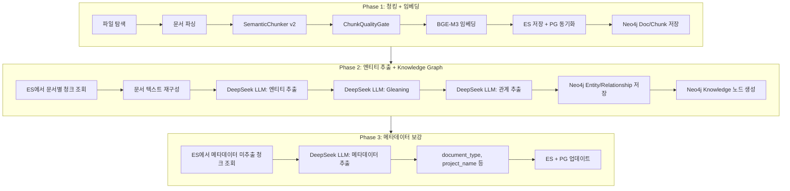
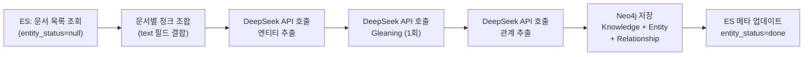
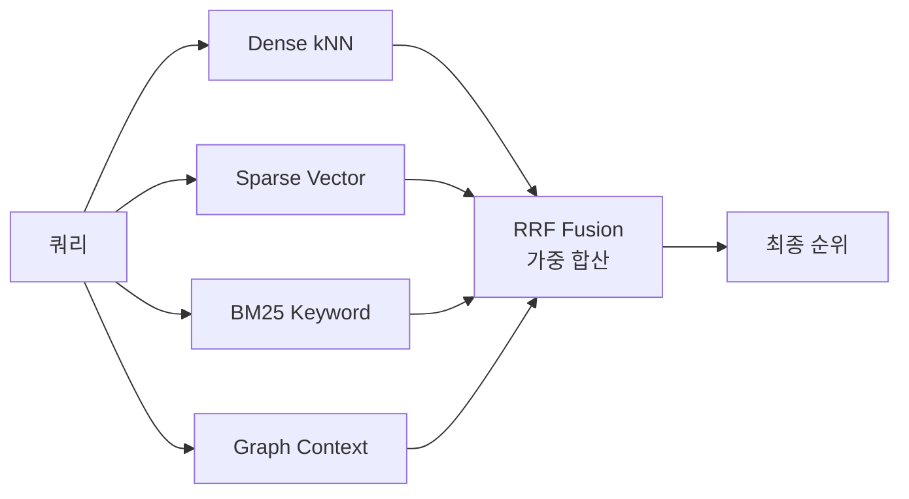

# ETL 배치 파이프라인 상세 설계서

**Version**: 1.1
**작성일**: 2026-02-13 (v1.1: 2026-02-14 Sparse 벡터 + 엔티티 추출 활성화)
**작성자**: Claude Code (Opus 4.6)
**상태**: 구현 진행 중

---

## 1. 현황 분석

### 1.1 현재 데이터 현황

| 항목 | 수치 | 비고 |
|------|------|------|
| ES 총 청크 | 96,258개 | knowledge_chunks 인덱스 |
| 임베딩 완료 | 96,258개 (100%) | dense_vector 필드 존재 |
| 고유 문서 수 | 1,460개 | document_id 기준 |
| 평균 청크/문서 | 65.9개 | |
| Neo4j Document | 1,457개 | |
| Neo4j Chunk | 106,955개 | ES와 차이 있음 |
| **Neo4j Entity** | **0개** | Person, Technology, Topic, Keyword 모두 0 |
| **Neo4j Knowledge** | **0개** | save_document_graph 미실행 |
| PART_OF 관계 | 106,955개 | Chunk→Document 연결만 존재 |
| RELATED_TO 관계 | **0개** | 엔티티 간 관계 없음 |

### 1.2 현재 청크 필드 구조 (ES)

```json
{
  "document_id": "uuid",
  "chunk_id": "uuid",
  "chunk_index": 0,
  "text": "청크 본문",
  "heading": "섹션 제목",
  "token_count": 150,
  "metadata": {},
  "created_at": "2026-02-10T...",
  "dense_vector": [0.012, -0.034, ...]
}
```

**누락 필드** (v2에서 추가 설계 완료):
- `embedding_status`: 임베딩 상태 (pending/success/failed)
- `chunker_version`: 청커 버전 (v1/v2)
- `original_text_length`: 원본 텍스트 길이
- `embedded_at`: 임베딩 생성 시점
- `embedding_model`: 사용된 임베딩 모델명
- `sparse_vector`: **BGE-M3 Sparse 벡터** (v1.1 추가)

---

## 2. 문제점 분석

### 2.1 그래프 시각화 불가 (Critical)

**증상**: `/api/v1/graph/subgraph` API가 모든 엔티티에 대해 빈 결과 반환

```
POST /api/v1/graph/subgraph
  {"entity_name": "01.스프링"} → nodes:[], edges:[], node_count:0
  {"entity_name": "Neo4j와 Elasticsearch"} → nodes:[], edges:[], node_count:0
```

**원인**: Neo4j에 Entity 노드가 0개. 엔티티 추출이 한 번도 실행된 적 없음.

**로그 증거**:
```
"Entities extracted" 로그: 0건
"Entity extraction failed" 로그: 0건
"Graph entity match returned 0 - falling back to content search" (반복 발생)
```

### 2.2 graph_context.related_entities 품질 저하

**증상**: 검색 결과의 `related_entities`에 실제 Neo4j 엔티티가 아닌 추천 키워드가 표시됨

```json
"related_entities": ["민감", "데이터", "암호화", "상세", "설계서"]
```

**원인**: Neo4j entity 매칭 실패 → fallback으로 문서 본문 300자에서 정규식 `[가-힣]{2,6}` 추출

**코드 위치**: `rag_workflow.py` `build_sources_from_results()` (line 359-388)

### 2.3 배치 파이프라인 단절

현재 3개 배치 경로 상태 **(v1.1 업데이트)**:

```
경로 A: run_etl_full.py (via InitialDataLoader)
  ✅ 파싱 → ✅ 청킹 → ✅ Dense+Sparse 임베딩 → ✅ ES 저장 → ✅ Neo4j(Doc/Chunk)
  ✅ 엔티티 추출 (enable_entity_extraction=True, v1.1 변경)
  ✅ Sparse 벡터 (return_sparse=True, 기존 완비)

경로 B: DocumentProcessingPipeline (BackgroundWorker)
  ✅ Dense+Sparse 임베딩 (v1.1 활성화)
  ✅ 엔티티 추출 설정 True
  ⚠️ 초기 1,460개 문서는 이 경로를 타지 않음 (신규 업로드 시 사용)

경로 C: add_embeddings_batch.py / embedding_full_cycle.py
  ✅ Dense 임베딩만 수행
  ❌ Sparse 벡터 미생성 (return_sparse=False)
  ❌ 엔티티 추출/관계 추출 없음
```

### 2.4 v2 필드 미적용 (96K 기존 청크)

SemanticChunker v2에서 추가한 5개 필드가 ES 매핑에만 추가됨. 기존 96,258개 청크에는 해당 필드가 없음.

---

## 3. ETL 배치 파이프라인 설계 (3-Phase)

### 3.1 Phase 개요



### 3.2 Phase 1: 청킹 + 임베딩 (기존 완료, 차수 데이터 적용)

**목적**: 문서를 청크로 분할하고 벡터 임베딩 생성

**현재 스크립트**: `run_etl_full.py`, `run_etl_phase2.py`

**처리 단위**: 파일 단위 (file_hash 기반 중복 방지)

#### 차수 데이터 적용 방법

**신규 문서 추가 시**: 기존 `run_etl_full.py` 그대로 실행 가능. file_hash 기반 dedup으로 이미 처리된 파일 자동 건너뜀.

```bash
# 신규 문서 폴더를 knowledge_data/documents/에 추가 후
docker exec -d kp-ai-service nohup python scripts/run_etl_full.py > /tmp/etl.log 2>&1 &
```

**v2 청커로 재처리 시**: ES alias 교체 전략 사용 (ADR-004)

```
1. knowledge_chunks_v2 인덱스 생성
2. v2 청커 + QualityGate로 전체 재청킹
3. 임베딩 생성
4. alias 교체: knowledge_chunks → knowledge_chunks_v2
5. 구 인덱스 삭제
```

#### Phase 1 설정값 (확정)

| 설정 | 값 | 근거 |
|------|-----|------|
| chunk_size | 600자 | 한국어 평균 섹션 길이 기준 |
| chunk_overlap | 100자 | 문맥 연속성 유지 |
| batch_size (임베딩) | **4** | CPU 최적값 (2026-02-10 실측) |
| max_text_length | **1000자** | 메모리 안정성 (2.9GB, OOM 방지) |
| workers | **1** | CPU 경합 방지 (2워커 무의미) |
| 모델 | BGE-M3 | 1024차원, 다국어 |
| **Sparse 벡터** | **활성화 (v1.1)** | Dense + Sparse 동시 생성, ES sparse_vector 필드 |
| QualityGate | 활성화 | v2 노이즈 필터 적용 |

#### Phase 1 소요시간 추정

| 항목 | 현재 (96K 청크) | 차수 데이터 (추가 30K 예상) |
|------|----------------|--------------------------|
| 청킹 | ~5분 | ~2분 |
| 임베딩 (0.7 chunks/sec) | ~38시간 | ~12시간 |
| ES 저장 | ~10분 | ~3분 |
| **합계** | **~38시간** | **~12시간** |

---

### 3.3 Phase 2: 엔티티 추출 + Knowledge Graph (신규, 핵심)

**목적**: 문서에서 엔티티(Person, Technology, Topic 등)와 관계를 추출하여 Neo4j Knowledge Graph를 구축

**신규 스크립트 필요**: `run_entity_extraction_batch.py` (미구현)

#### 처리 흐름



#### 단계별 상세

**Step 1: 대상 문서 식별**

```python
# ES에서 엔티티 미추출 문서 목록 조회
query = {
    "size": 0,
    "aggs": {
        "docs_without_entities": {
            "terms": {"field": "document_id", "size": 10000},
            # entity_status 필드가 없는 문서 = 미추출
        }
    }
}
```

**Step 2: 문서 텍스트 재구성**

```python
# document_id 기준으로 청크를 chunk_index 순서로 조합
chunks = es.search(
    index="knowledge_chunks",
    body={"query": {"term": {"document_id": doc_id}},
          "sort": [{"chunk_index": "asc"}],
          "size": 500}
)
full_text = "\n\n".join(c["text"] for c in chunks)
# max_text_length 적용 (30,000자)
full_text = full_text[:30000]
```

**Step 3: 엔티티 추출 (DeepSeek LLM)**

```python
# EntityExtractionService.extract_entities()
# ENTITY_EXTRACTION_PROMPT → 1차 추출
# GLEANING_PROMPT → 추가 추출 (max_gleanings=1)
extraction_result = await entity_extractor.extract_full(
    text=full_text,
    enable_gleaning=True,
)
```

**Step 4: Neo4j 저장**

```python
# neo4j_storage.save_document_graph()
# Knowledge 노드 + Entity 노드 + Relationship 생성
await neo4j_storage.save_document_graph(
    document_id=doc_id,
    title=doc_title,
    entities=extraction_result.entities,
    relationships=extraction_result.relationships,
    metadata=doc_metadata,
)
```

#### Phase 2 LLM 호출 구조

문서 1건당 LLM 호출:

| 단계 | 호출 수 | 입력 토큰 (평균) | 출력 토큰 (평균) |
|------|---------|----------------|----------------|
| 엔티티 추출 (1차) | 1회 | ~3,000 | ~500 |
| Gleaning (추가 추출) | 1회 | ~4,000 | ~300 |
| 관계 추출 | 1회 | ~4,000 | ~400 |
| **합계** | **3회/문서** | **~11,000** | **~1,200** |

#### Phase 2 비용/시간 추정

**DeepSeek V3.2 가격** (2026-02 기준):
- Input: $0.14 / 1M tokens
- Output: $0.28 / 1M tokens
- Cache hit: $0.014 / 1M tokens

| 항목 | 1,460 문서 기준 |
|------|---------------|
| 총 LLM 호출 | ~4,380회 (3회 × 1,460) |
| 입력 토큰 | ~16M tokens |
| 출력 토큰 | ~1.8M tokens |
| **예상 비용** | **~$2.7** (입력 $2.24 + 출력 $0.50) |
| 평균 응답시간 | ~2초/호출 |
| **총 소요시간** | **~2.5시간** (직렬) / **~50분** (3 concurrent) |

> DeepSeek 95% 비용 절감 효과: 동일 작업 GPT-4 기준 ~$50 → DeepSeek ~$2.7

#### Phase 2 에러 처리

```python
try:
    result = await entity_extractor.extract_full(text)
except LLMError as e:
    # Rate limit → exponential backoff (1s, 2s, 4s, 8s)
    # Token limit exceeded → 텍스트를 15,000자로 축소 후 재시도
    # API 장애 → 해당 문서 skip, 로그 기록, 다음 문서 진행
    logger.warning(f"Entity extraction failed for {doc_id}: {e}")
    failed_docs.append(doc_id)
    continue
```

#### Phase 2 배치 제어 파라미터

| 파라미터 | 기본값 | 설명 |
|---------|-------|------|
| concurrency | 3 | 동시 LLM 호출 수 (rate limit 고려) |
| batch_size | 10 | 진행률 저장 간격 |
| max_retries | 3 | 문서별 최대 재시도 |
| checkpoint_interval | 50 | 체크포인트 저장 간격 (문서 수) |
| resume_from | None | 중단 지점 재개 (document_id) |

---

### 3.4 Phase 3: 메타데이터 보강 (선택)

**목적**: 문서 유형(document_type), 프로젝트명, 카테고리 등 구조화된 메타데이터 추출

**현재 상태**: `extract_metadata()` 구현 완료되어 있으나 파이프라인에서 호출하지 않음

**LLM 호출**: 문서당 1회 (앞부분 5,000자만 사용, 경량)

| 항목 | 수치 |
|------|------|
| LLM 호출 | 1,460회 |
| 입력 토큰 | ~7M tokens |
| **예상 비용** | **~$1.0** |
| **소요시간** | **~50분** |

---

## 4. 차수 데이터 처리 전략

### 4.1 "재처리가 필요한가?"에 대한 답변

| 시나리오 | 재처리 여부 | 설명 |
|---------|-----------|------|
| **신규 문서 추가** | Phase 1만 | file_hash dedup으로 기존 건너뜀, 신규만 처리 |
| **그래프 시각화 활성화** | **Phase 2 필수** | 기존 1,460개 문서 전체에 엔티티 추출 필요 |
| **v2 청커 적용** | Phase 1 재처리 | alias 교체 전략으로 무중단 Re-Chunking |
| **v2 필드 백필** | PUT /_mapping + _update_by_query | 기존 청크에 default 값 설정 |

### 4.2 권장 실행 순서

```
[즉시] Phase 2 실행 → 그래프 시각화 활성화 (~2.5시간, ~$2.7)
        ↓
[선택] Phase 3 실행 → 메타데이터 보강 (~50분, ~$1.0)
        ↓
[차후] Phase 1 재처리 → v2 청커 적용 시 (Re-Chunking)
        ↓
[차후] v2 필드 백필 → ES 매핑 업데이트
```

### 4.3 향후 차수 데이터 추가 시 통합 파이프라인

차수 데이터(새로운 문서 배치) 적재 시에는 **Phase 1 + Phase 2를 순차 실행**하여 그래프까지 한 번에 구축:


**통합 스크립트 설계** (`run_etl_with_entities.py`):

```python
# Phase 1: 기존 run_etl_full.py + v2 청커
loader = InitialDataLoader(
    chunk_size=600,
    chunk_overlap=100,
    batch_size=4,
    enable_embeddings=True,
    enable_entity_extraction=True,  # ← Phase 2 통합
)

# 또는 분리 실행:
# 1. run_etl_full.py (enable_entity_extraction=False)  # 빠른 Phase 1
# 2. run_entity_extraction_batch.py                     # Phase 2 별도
```

---

## 5. Phase 2 배치 스크립트 설계 (`run_entity_extraction_batch.py`)

### 5.1 스크립트 구조

```python
"""
Phase 2: 엔티티 추출 배치
- 기존 ES 청크에서 문서 텍스트를 재구성
- DeepSeek LLM으로 엔티티/관계 추출
- Neo4j Knowledge Graph에 저장

Usage:
    docker exec -d kp-ai-service nohup python scripts/run_entity_extraction_batch.py \
        --concurrency 3 --checkpoint-interval 50 > /tmp/entity_extraction.log 2>&1 &
"""

class EntityExtractionBatch:
    def __init__(
        self,
        concurrency: int = 3,
        max_text_length: int = 30000,
        checkpoint_interval: int = 50,
        max_retries: int = 3,
    ):
        self.es = Elasticsearch(...)
        self.neo4j = Neo4jStorageService(...)
        self.extractor = EntityExtractionService(...)
        self.semaphore = asyncio.Semaphore(concurrency)

    async def get_unprocessed_documents(self) -> List[str]:
        """엔티티 미추출 문서 ID 목록 조회"""
        # Neo4j에 Knowledge 노드가 없는 document_id 조회
        ...

    async def reconstruct_document_text(self, doc_id: str) -> str:
        """ES 청크를 결합하여 문서 텍스트 재구성"""
        ...

    async def process_document(self, doc_id: str, title: str):
        """단일 문서 엔티티 추출 + Neo4j 저장"""
        async with self.semaphore:
            text = await self.reconstruct_document_text(doc_id)
            result = await self.extractor.extract_full(text)
            await self.neo4j.save_document_graph(
                document_id=doc_id,
                title=title,
                entities=result.entities,
                relationships=result.relationships,
            )

    async def run(self):
        """배치 실행 메인"""
        docs = await self.get_unprocessed_documents()
        tasks = [self.process_document(d.id, d.title) for d in docs]
        # checkpoint 간격으로 진행률 저장
        ...
```

### 5.2 진행률 모니터링

```json
// /tmp/entity_extraction_progress.json
{
  "status": "running",
  "total_documents": 1460,
  "processed": 523,
  "success": 510,
  "failed": 13,
  "entities_total": 4280,
  "relationships_total": 2150,
  "elapsed_seconds": 3150,
  "rate_per_minute": 10.2,
  "estimated_remaining_minutes": 92,
  "last_document_id": "8c57c14c-...",
  "llm_cost_usd": 0.98
}
```

### 5.3 모니터링 스크립트

```bash
# scripts/entity_extraction_monitor.sh
#!/bin/bash
while true; do
    clear
    echo "=== Entity Extraction Progress ==="
    docker exec kp-ai-service cat /tmp/entity_extraction_progress.json 2>/dev/null | python3 -m json.tool
    echo ""
    echo "=== Neo4j Entity Count ==="
    docker exec kp-ai-service python -c "
from neo4j import GraphDatabase; import os
d = GraphDatabase.driver(os.environ['NEO4J_URI'], auth=('neo4j', os.environ['NEO4J_PASSWORD']))
with d.session() as s:
    for r in s.run('MATCH (n) WHERE NOT n:Document AND NOT n:Chunk RETURN labels(n)[0] as label, count(n) as cnt'):
        print(f'  {r[\"label\"]}: {r[\"cnt\"]}')
d.close()
"
    sleep 300  # 5분 간격
done
```

---

## 6. 기존 파이프라인 개선 사항

### 6.1 run_etl_full.py 변경 (v1.1 적용 완료)

**변경 전**:
```python
enable_entity_extraction=False,  # 엔티티 추출은 별도 단계
```

**변경 후 (2026-02-14 적용)**:
```python
enable_entity_extraction=True,   # Phase 2 통합: LLM 엔티티/관계 추출 (DeepSeek)
```

> `initial_data_loader.py`는 이미 `return_sparse=True` 사용 (line 1045) + ES 저장 시 sparse_vector 포함 (line 1259-1260).
> 차수 데이터부터 Phase 1 + Phase 2가 통합 실행됩니다.

분리 전략도 병행 가능 (Phase 1 속도 우선 시):
```python
# run_etl_full.py   → Phase 1만 (빠름, CPU only)
# run_entity_extraction_batch.py → Phase 2 (LLM 호출, 별도 실행)
```

### 6.2 BackgroundWorker Sparse 벡터 활성화 (v1.1 적용 완료)

**변경 내용** (`document_processing_pipeline.py`):
```python
# 변경 전
embeddings = await self.embedding_service.aembed_batch(chunk_texts)
es_chunk["dense_vector"] = embeddings[i]

# 변경 후 (2026-02-14)
dense_vectors, sparse_vectors = await self.embedding_service.aembed_batch(
    chunk_texts, return_sparse=True
)
es_chunk["dense_vector"] = dense_vectors[i]
if sparse_vectors and i < len(sparse_vectors) and sparse_vectors[i]:
    es_chunk["sparse_vector"] = sparse_vectors[i]
```

**동작 확인 필요**: UI에서 신규 문서 업로드 시 BackgroundWorker가 Dense + Sparse + 엔티티 추출까지 수행하는지 검증

```bash
# 검증 방법: 문서 1건 업로드 후 로그 확인
docker logs -f kp-ai-service 2>&1 | grep -E "Entities extracted|Entity extraction|sparse"
```

### 6.3 init-db.py Sparse 필드 추가 (v1.1 적용 완료)

**변경 내용**: `knowledge_chunks` 인덱스 생성 매핑에 `sparse_vector` 필드 추가

```python
# 추가된 매핑 (dense_vector 바로 아래)
"sparse_vector": {"type": "sparse_vector"},
```

> `es_storage.py`의 `DEFAULT_INDEX_SETTINGS`에는 이미 존재 (line 84).
> `init-db.py`만 누락되어 있었음.

### 6.4 graph_context.related_entities 품질 개선

**현재 문제**: Neo4j 엔티티 매칭 실패 시 정규식 키워드로 fallback → 무의미한 값

**Phase 2 완료 후 기대 효과**:
- Neo4j에 Entity 노드 존재 → `matched_entities`에 실제 엔티티명 반환
- 그래프 시각화 정상 작동
- related_entities 신뢰성 확보

---

## 7. ES v2 필드 백필 계획

### 7.1 매핑 업데이트

```bash
# init-db.py 및 es_storage.py에 이미 추가됨 (2026-02-13)
# ES 인덱스에 PUT /_mapping으로 반영 필요
PUT /knowledge_chunks/_mapping
{
  "properties": {
    "embedding_status": {"type": "keyword"},
    "chunker_version": {"type": "keyword"},
    "original_text_length": {"type": "long"},
    "embedded_at": {"type": "date"},
    "embedding_model": {"type": "keyword"}
  }
}
```

### 7.2 기존 청크 기본값 설정

```bash
POST /knowledge_chunks/_update_by_query
{
  "query": {"bool": {"must_not": {"exists": {"field": "chunker_version"}}}},
  "script": {
    "source": """
      ctx._source.chunker_version = 'v1';
      ctx._source.embedding_status = 'success';
      ctx._source.embedding_model = 'bge-m3';
    """
  }
}
```

---

## 8. 실행 로드맵

### 8.1 단기 (이번 주)

| 순서 | 작업 | 소요시간 | 비용 |
|------|------|---------|------|
| 1 | Phase 2 스크립트 구현 | ~2시간 | - |
| 2 | Phase 2 실행 (기존 1,460문서) | ~2.5시간 | ~$2.7 |
| 3 | 그래프 시각화 검증 | ~30분 | - |
| 4 | ES v2 필드 PUT /_mapping | ~5분 | - |
| 5 | 기존 청크 기본값 백필 | ~10분 | - |

### 8.2 중기 (다음 스프린트)

| 순서 | 작업 | 소요시간 | 비용 |
|------|------|---------|------|
| 6 | Phase 3 메타데이터 추출 (선택) | ~50분 | ~$1.0 |
| 7 | run_etl_full.py에 Phase 2 통합 옵션 | ~1시간 | - |
| 8 | BackgroundWorker 엔티티 추출 E2E 검증 | ~1시간 | - |

### 8.3 장기 (Re-Chunking)

| 순서 | 작업 | 소요시간 | 비용 |
|------|------|---------|------|
| 9 | v2 청커로 Re-Chunking + Dense+Sparse 동시 생성 (alias 전략) | ~40시간 | - |
| 10 | Re-Chunking 후 Phase 2 재실행 | ~2.5시간 | ~$2.7 |

> 기존 96K 청크의 Sparse 백필은 별도로 하지 않음. Re-Chunking 시 Dense+Sparse를 한 번에 생성.

---

## 9. 리스크 및 대응

| 리스크 | 확률 | 영향 | 대응 |
|--------|------|------|------|
| DeepSeek API rate limit | Medium | Phase 2 지연 | concurrency=3, exponential backoff |
| LLM 응답 파싱 실패 | Low | 일부 문서 skip | max_retries=3, JSON 파싱 fallback |
| Neo4j 메모리 부족 | Low | 저장 실패 | batch_size=10으로 분할 저장 |
| 중간 중단 (컨테이너 재시작) | Medium | 작업 소실 | checkpoint 기반 재개 지원 |
| 엔티티 중복 (동일 개체 다른 이름) | High | 그래프 품질 저하 | 중복 제거 + MERGE 쿼리 |

---

## 10. Sparse 벡터 활성화 (v1.1)

### 10.1 BGE-M3 Sparse 벡터 개요

BGE-M3는 Dense (1024차원) + Sparse (Learned Lexical Weights) + ColBERT를 동시 생성할 수 있는 멀티모달 임베딩 모델입니다.

| 벡터 유형 | 설명 | 검색 방식 |
|-----------|------|----------|
| **Dense** | 의미적 유사도 (1024차원) | kNN (cosine) |
| **Sparse** | 학습된 토큰 중요도 가중치 | Inverted Index (sparse_vector) |
| ColBERT | 토큰 수준 상호작용 | 미사용 (비용 대비 효과 낮음) |

Sparse 벡터는 BM25의 통계적 키워드 매칭 대비 **학습된** 키워드 중요도를 제공하여, Dense 의미 검색과 상호 보완합니다.

### 10.2 활성화 범위 (v1.1 수정 사항)

| 경로 | 파일 | 수정 내용 | 상태 |
|------|------|----------|------|
| **경로 A** (run_etl_full.py) | `initial_data_loader.py` | `return_sparse=True` (line 1045) | 기존 완비 |
| **경로 A** (ES 저장) | `initial_data_loader.py` | `sparse_vector` 필드 저장 (line 1259-1260) | 기존 완비 |
| **경로 B** (BackgroundWorker) | `document_processing_pipeline.py` | `aembed_batch(return_sparse=True)` + ES 저장 | **v1.1 수정** |
| **ES 매핑** (앱 코드) | `es_storage.py` | `sparse_vector: sparse_vector` (line 84) | 기존 완비 |
| **ES 매핑** (초기화) | `init-db.py` | `sparse_vector: sparse_vector` 추가 | **v1.1 수정** |

### 10.3 Sparse 벡터 구조

```json
{
  "sparse_vector": {
    "29871": 0.2856,
    "8225": 0.1923,
    "15482": 0.1547
  }
}
```

- 키: BGE-M3 토크나이저 토큰 ID (문자열)
- 값: 해당 토큰의 학습된 중요도 가중치 (float)
- 희소 표현: 대부분 토큰 가중치 = 0, 의미 있는 토큰만 포함

### 10.4 성능 영향

| 항목 | Dense Only | Dense + Sparse |
|------|-----------|---------------|
| 임베딩 생성 시간 | 기준 | +10~20% |
| ES 인덱스 크기 | 기준 | +5~10% |
| 검색 품질 (RRF) | 기준 | **+5~15% nDCG** |
| 메모리 사용 | 기준 | +최소 (sparse는 경량) |

### 10.5 기존 96K 청크 Sparse 전략

기존 96,258개 청크에는 `sparse_vector` 필드가 없습니다.

**별도 Sparse 백필은 하지 않습니다.** 이유:
- forward pass 재실행 필요 → ~38시간 소요 (dense 임베딩과 동일)
- Re-Chunking(v2 청커 적용) 시 Dense + Sparse를 **한 번에** 생성하는 것이 효율적
- 기존 데이터는 Dense + BM25 2-Channel로 충분히 검색 가능

| 구분 | Sparse 적용 | 시점 |
|------|------------|------|
| 기존 96K 청크 | Re-Chunking 시 자동 적용 | 장기 (v2 청커 전환 시) |
| 차수 데이터 (신규) | 자동 적용 (이미 활성화) | 즉시 |
| 업로드 문서 | 자동 적용 (BackgroundWorker) | 즉시 |

### 10.6 향후 Sparse 검색 활용 (RRF 4-Channel)



Sparse 검색 활성화는 별도 작업으로, `rag_workflow.py`에서 ES 쿼리에 Sparse 매칭을 추가하면 됩니다.

---

## 11. 부록: 현재 배치 스크립트 목록 및 용도

| 스크립트 | Phase | 용도 |
|---------|-------|------|
| `run_etl_full.py` | 1+2 | 전체 ETL (청킹+Sparse임베딩+엔티티 ON, v1.1) |
| `run_etl_phase2.py` | 1 | 바이너리 파일 처리 (PDF/PPTX 등) |
| `run_etl_noembedding.py` | 1 | 임베딩 없이 청킹만 |
| `add_embeddings_batch.py` | 1 | 임베딩 백필 (벡터 없는 청크) |
| `embedding_full_cycle.py` | 1 | 임베딩 전체/선택 재실행 |
| `run_embedding_backfill.py` | 1 | 임베딩 백필 (초기 버전) |
| `run_embedding_backfill_v2.py` | 1 | 임베딩 백필 (CPU 최적화) |
| `run_etl_workers.py` | 1 | 멀티워커 ETL |
| `run_entity_extraction_batch.py` | **2** | **엔티티 추출 배치 (미구현)** |
| `batch_load.py` | 1 | 배치 로드 유틸리티 |
| `load_single.py` | 1+2 | 단일 문서 처리 |
| `load_single_noembedding.py` | 1 | 단일 문서 (임베딩 없이) |

---

*작성: Claude Code (Opus 4.6) | 2026-02-13 (v1.1: 2026-02-14)*
