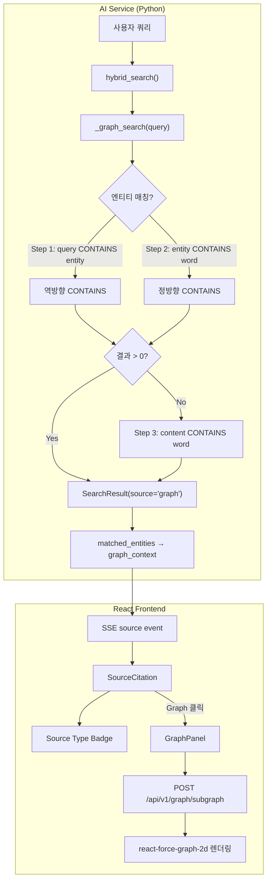

# Neo4j Graph Search 구현 문서

**작성일**: 2026-02-07
**작성자**: Claude Code (RAG Engineer)
**관련 스토리**: Source Type Badge + Graph 시각화 패널

---

## 1. 배경 및 문제 정의

### 1.1 발견된 문제

UAT 수동 테스트 중 Chat Search에서 다음 문제가 발견됨:

1. **출처 구분 불가**: [출처1]~[출처5]에서 Vector/Keyword/Graph 소스 타입이 표시되지 않음
2. **Graph 검색 결과 0건**: Neo4j Graph Search가 항상 0건을 반환
3. **엔티티 데이터 부재**: Entity Extraction이 실행된 적 없어 Neo4j에 엔티티가 0건

### 1.2 근본 원인 분석

**기존 코드 (search.py `_graph_search()` L687-704)**:

```python
# BEFORE: 잘못된 매칭 방식
cypher = """
MATCH (e)-[:MENTIONED_IN]->(k:Knowledge)-[:CONTAINS]->(c:Chunk)
WHERE any(word IN $query_words WHERE
    e.name CONTAINS word OR k.title CONTAINS word)
"""
```

**문제**: `e.name CONTAINS word` 방식은 "엔티티 이름 안에 쿼리 단어가 포함되어야" 함.
- 쿼리: "LLM 중심으로 관련 기술 알려주세요"
- 쿼리 단어: `["LLM", "중심으로", "관련", "기술", "알려주세요"]`
- 엔티티 이름: "DeepSeek V3.2", "LangGraph", "FastAPI", "Neo4j" 등
- **결과**: 어떤 쿼리 단어도 엔티티 이름의 부분 문자열이 아님 → 0건

### 1.3 Neo4j 데이터 현황 (Entity Extraction 후)

| 엔티티 타입 | 수량 | 예시 |
|------------|------|------|
| Person | 8 | Backend, PM, QA, Tech Lead |
| Technology | 26 | DeepSeek V3.2, LangGraph, Neo4j, FastAPI |
| Topic | 24 | RAG Pipeline, Hybrid RAG 플랫폼, Graph Search |
| Keyword | 3 | (name=None, 무효) |
| **합계** | **61** | |

| 관계 타입 | 수량 |
|----------|------|
| MENTIONED_IN (entity→Knowledge) | 93 |
| RELATED_TO (entity↔entity) | 72 |
| CONTAINS (Knowledge→Chunk) | 7 |
| **합계** | **172** |

---

## 2. 설계 결정 및 근거

### 2.1 Graph Search 매칭 전략: 3단계 접근

Neo4j의 기술 문서(Cypher Manual, Full-text Index)를 참조하여 설계:

#### Step 1: 역방향 CONTAINS (핵심 수정)

```cypher
WHERE toLower($query_str) CONTAINS toLower(e.name)
```

**근거**: 사용자 쿼리 안에 기술 용어가 포함되는 것이 자연스러운 한국어 질의 패턴.
- "**Neo4j** 그래프 데이터베이스 설명해줘" → "Neo4j" 엔티티 매칭
- "**RAG** 파이프라인과 **LangGraph** 아키텍처" → "LangGraph" 매칭
- "**FastAPI**와 **SpringBoot** 비교" → "FastAPI" 매칭

**검증 결과**:

| 쿼리 | 기존 방식 | 역방향 CONTAINS |
|------|----------|----------------|
| "Neo4j 그래프 데이터베이스 설명" | 0건 | 1건 (Neo4j) |
| "RAG 파이프라인과 LangGraph 아키텍처" | 0건 | 1건 (LangGraph) |
| "FastAPI와 SpringBoot 비교" | 0건 | 1건 (FastAPI) |

#### Step 2: 정방향 CONTAINS (보완)

```cypher
OR any(word IN $query_words WHERE toLower(e.name) CONTAINS toLower(word))
```

**근거**: 역방향으로 잡히지 않는 부분 문자열 매칭 보완.
- "RAG 파이프라인" → "RAG Pipeline" 토픽의 "RAG" 단어 매칭
- "Hybrid" → "Hybrid RAG 플랫폼" 매칭

**검증 결과** (Step 1+2 합산):

| 쿼리 | Step 1 only | Step 1+2 |
|------|------------|----------|
| "RAG 파이프라인과 LangGraph 아키텍처" | 1건 | 5건 (RAG Engineer, Hybrid RAG 플랫폼, RAG Pipeline, LangGraph, RAGAS) |

#### Step 3: 컨텐츠 폴백 (마지막 수단)

```cypher
-- Step 1+2 결과가 0건일 때만 실행
MATCH (k:Knowledge)-[:CONTAINS]->(c:Chunk)
WHERE any(word IN $query_words WHERE toLower(c.content) CONTAINS toLower(word))
WITH c, k
OPTIONAL MATCH (e)-[:MENTIONED_IN]->(k)
```

**근거**: "LLM 중심으로 관련 기술"처럼 엔티티 이름에 없는 키워드로 질의하는 경우.
- "LLM"은 엔티티 이름에 없지만, Chunk 컨텐츠에 4건 존재
- 해당 Chunk가 속한 Knowledge에 MENTIONED_IN 관계로 연결된 엔티티 32개를 통해 그래프 컨텍스트 제공

**검증 결과**:

| 쿼리 | Step 1+2 | Step 3 (폴백) |
|------|----------|---------------|
| "LLM 중심으로 관련 기술 알려주세요" | 0건 | 4건 (32개 관련 엔티티 포함) |

### 2.2 대안 검토

| 대안 | 장점 | 단점 | 채택 여부 |
|------|------|------|----------|
| **3단계 CONTAINS** | 구현 간단, 인덱스 불필요 | 대규모 데이터에서 느릴 수 있음 | **채택** |
| Neo4j Full-text Index | 형태소 분석, 고속 | 한국어 지원 제한, 별도 설정 필요 | 미채택 (향후 고려) |
| LLM 엔티티 추출 후 검색 | 정확도 높음 | API 호출 추가 비용, 지연 증가 | 미채택 (비용) |
| Elasticsearch cross-search | 기존 인프라 활용 | Graph 관계 정보 활용 불가 | 미채택 (목적 불일치) |

**결정 근거**: 현재 데이터 규모(61 엔티티, 7 청크)에서 3단계 CONTAINS가 충분히 효율적이며, 구현 복잡도가 낮음. 데이터 규모가 1,000+ 엔티티로 확장될 경우 Full-text Index 도입을 검토.

---

## 3. 구현 상세

### 3.1 수정 파일 목록

| # | 파일 | 변경 내용 |
|---|------|----------|
| 1 | `src/app/services/search.py` | `_graph_search()` 3단계 매칭 전략 구현 |
| 2 | `src/app/services/rag_pipeline.py` | Graph 소스의 `graph_context.related_entities` 전달 |
| 3 | `src/app/agents/rag_workflow.py` | 동일하게 `graph_context` 전달 |
| 4 | `frontend/src/features/search/components/SourceCitation.tsx` | Source Type 배지 (Vector/Keyword/Graph) 표시 |
| 5 | `frontend/src/features/search/components/GraphPanel.tsx` | 그래프 시각화 패널 (react-force-graph-2d) |
| 6 | `frontend/src/features/search/ChatSearch.tsx` | 좌우 분할 레이아웃 |
| 7 | `frontend/src/features/search/components/MessageBubble.tsx` | onGraphSourceClick prop 전달 |
| 8 | `frontend/src/features/search/components/MessageList.tsx` | onGraphSourceClick prop 전달 |
| 9 | `frontend/src/features/search/types.ts` | GraphNode, GraphEdge, SubgraphData 타입 |

### 3.2 _graph_search() 핵심 코드

```python
async def _graph_search(self, query, entities=None, top_k=20):
    entity_names = [e.get("name", "") for e in (entities or [])]

    if entity_names:
        # 명시적 엔티티가 있으면 직접 매칭
        cypher = "MATCH ... WHERE e.name IN $entity_names ..."
    else:
        query_lower = query.lower()
        query_words = [w for w in query.split() if len(w) >= 2]

        # Step 1+2: 역방향 + 정방향 CONTAINS
        cypher = """
        MATCH (e)-[:MENTIONED_IN]->(k:Knowledge)-[:CONTAINS]->(c:Chunk)
        WHERE e.name IS NOT NULL AND e.name <> 'None' AND size(e.name) >= 2
        AND (
            toLower($query_str) CONTAINS toLower(e.name)          -- Step 1: 역방향
            OR any(word IN $query_words WHERE
                toLower(e.name) CONTAINS toLower(word))           -- Step 2: 정방향
        )
        WITH c, k, collect(DISTINCT e.name) AS matched_entities,
             count(DISTINCT e) AS match_count
        ORDER BY match_count DESC
        LIMIT $top_k
        RETURN chunk_id, content, document_id, title, score, matched_entities
        """

        records = await self._neo4j_query(cypher, params)

        # Step 3: 폴백 - 엔티티 매칭 실패 시 컨텐츠 검색
        if not records:
            cypher_fallback = """
            MATCH (k:Knowledge)-[:CONTAINS]->(c:Chunk)
            WHERE any(word IN $query_words WHERE
                toLower(c.content) CONTAINS toLower(word))
            WITH c, k
            OPTIONAL MATCH (e)-[:MENTIONED_IN]->(k)
            ...
            """
            records = await self._neo4j_query(cypher_fallback, params)
```

### 3.3 데이터 흐름



### 3.4 Source Type Badge 표시

| source_type | 아이콘 | 라벨 | 색상 | Tailwind 클래스 |
|------------|--------|------|------|-----------------|
| `vector` | CircleStackIcon | Vector | Blue | `bg-blue-100 text-blue-700` |
| `keyword` | MagnifyingGlassIcon | Keyword | Amber | `bg-amber-100 text-amber-700` |
| `graph` | ShareIcon | Graph | Teal | `bg-teal-100 text-teal-700` |

### 3.5 Graph 시각화 패널

- **라이브러리**: react-force-graph-2d v1.29.1
- **API**: `POST /api/v1/graph/subgraph` (기존 엔드포인트)
- **레이아웃**: Chat 영역 좌측 (flex-[3]) + Graph 패널 우측 (flex-[2])
- **반응형**: `lg:` breakpoint 이상에서만 표시
- **노드 색상**: Person(보라), Technology(파랑), Topic(초록), Keyword(주황), 기타(회색)

---

## 4. 테스트 검증

### 4.1 Neo4j Cypher 직접 테스트

```bash
# AI Service 컨테이너 내부에서 실행
docker exec kp-ai-service python3 -c "
import asyncio
from neo4j import AsyncGraphDatabase

async def test():
    driver = AsyncGraphDatabase.driver('bolt://neo4j:7687', auth=('neo4j', 'neo4j_dev_2026!'))
    async with driver.session() as session:
        result = await session.run('''
            MATCH (e)-[:MENTIONED_IN]->(k:Knowledge)-[:CONTAINS]->(c:Chunk)
            WHERE e.name IS NOT NULL AND e.name <> 'None' AND size(e.name) >= 2
            AND (toLower(\$q) CONTAINS toLower(e.name)
                 OR any(word IN \$words WHERE toLower(e.name) CONTAINS toLower(word)))
            RETURN count(c) AS cnt
        ''', q='neo4j 그래프 데이터베이스', words=['Neo4j', '그래프', '데이터베이스'])
        ...
"
```

### 4.2 검증 결과 요약

| 테스트 쿼리 | 기존 결과 | 수정 후 결과 | 매칭 전략 |
|------------|----------|-------------|----------|
| "Neo4j 그래프 데이터베이스 설명" | 0건 | 4건 | Step 1 (역방향) |
| "RAG 파이프라인과 LangGraph 아키텍처" | 0건 | 5건 | Step 1+2 |
| "FastAPI와 SpringBoot 비교" | 0건 | 4건+ | Step 1 |
| "LLM 중심으로 관련 기술 알려주세요" | 0건 | 4건 | Step 3 (폴백) |

---

## 5. 향후 개선 사항

1. **Neo4j Full-text Index**: 엔티티 1,000건 이상 시 CONTAINS 대신 Full-text Index 적용
2. **한국어 형태소 분석**: 쿼리 전처리에 한국어 형태소 분석기 도입 검토
3. **LLM 기반 엔티티 추출**: 쿼리에서 먼저 엔티티를 추출 후 Graph 검색 (비용 vs 정확도 트레이드오프)
4. **엔티티 동의어 매핑**: "LLM"→"DeepSeek V3.2" 같은 동의어 관계 추가
5. **Graph Search 가중치 튜닝**: RRF 융합 시 Graph 결과 가중치 조정

---

## 6. 참고 자료

- [Neo4j Cypher Manual - String Functions](https://neo4j.com/docs/cypher-manual/current/functions/string/)
- [Neo4j Full-text Indexes](https://neo4j.com/docs/cypher-manual/current/indexes-for-full-text-search/)
- [react-force-graph](https://github.com/vasturiano/react-force-graph)
- 프로젝트 상세 설계서 v2.4: Graph Search 섹션
