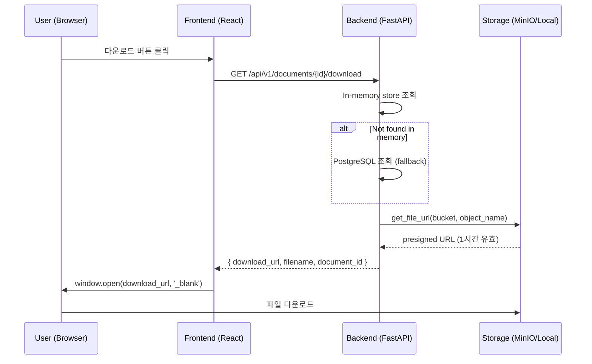

# STORY-092 구현 보고서: 검색 결과 원본 문서 다운로드

**작성일**: 2026-02-08
**작성자**: Claude Code (Opus 4.6)
**Sprint**: Sprint 08 (Day 3~4)
**Status**: 구현 완료 / 배포 완료

---

## 1. 개요

### 1.1 스토리 요약

| 항목 | 내용 |
|------|------|
| **Story ID** | STORY-092 |
| **우선순위** | High (P1) |
| **Story Points** | 5 |
| **유형** | FEAT (새 기능) |
| **담당** | Backend + Frontend |

### 1.2 User Story

> **As a** 지식 검색 사용자,
> **I want** 검색 결과에서 원본 문서를 다운로드할 수 있길,
> **So that** 검색된 청크의 전체 문맥을 원본 파일로 확인할 수 있습니다.

### 1.3 배경

검색 결과에 `document_id`는 포함되어 있으나 원본 문서에 접근할 방법이 없었음. MinIO에 원본 파일이 `minio://documents/{document_id}/{filename}` 형태로 저장되어 있고, `storage.py`의 `get_file_url()`이 이미 구현되어 있어 presigned URL 생성이 가능한 상태.

---

## 2. 아키텍처

### 2.1 전체 흐름



### 2.2 컴포넌트 연결 구조

```mermaid
flowchart TB
    subgraph Keyword["Keyword Search"]
        KS[KeywordSearch.tsx] -->|onDownloadClick| SRC[SearchResultCard.tsx]
    end

    subgraph Chat["Chat Search"]
        CS[ChatSearch.tsx] -->|onDownloadClick| ML[MessageList.tsx]
        ML -->|onDownloadClick| MB[MessageBubble.tsx]
        MB -->|onDownloadClick| SC[SourceCitation.tsx]
    end

    KS -->|handleDownloadClick| API[searchService.ts<br/>getDocumentDownloadUrl]
    CS -->|handleDownloadClick| API

    API -->|GET /documents/{id}/download| BE[documents.py<br/>download_document]

    BE -->|get_file_url| ST[storage.py<br/>presigned URL]
```

---

## 3. 구현 상세

### 3.1 Backend: 다운로드 엔드포인트

**파일**: `knowledge_service/src/app/api/routes/documents.py`

```python
@router.get(
    "/{document_id}/download",
    summary="원본 문서 다운로드 URL 조회",
)
async def download_document(document_id: UUID):
```

**구현 전략**:
- **2단계 조회**: `_document_store` (in-memory) → PostgreSQL (fallback)
- **Storage path 파싱**: `minio://documents/{uuid}/{filename}` → bucket + object_name 분리
- **Fallback**: storage_path 없으면 `documents/{document_id}/{filename}` 기본 경로
- **기존 코드 재사용**: `storage.get_file_url()` (presigned URL 생성, 1시간 유효)

**응답 형식**:
```json
{
  "download_url": "http://minio:9000/documents/.../file.pptx?X-Amz-...",
  "filename": "K-에듀파인 업무관리 구조개선-20260204.pptx",
  "document_id": "f1801c3b-53f0-4d54-815b-ff731791eede"
}
```

**오류 처리**:
- 404: 문서를 찾을 수 없는 경우
- 500: presigned URL 생성 실패 (storage 서비스 장애)

### 3.2 Frontend: API 서비스 함수

**파일**: `knowledge_service/frontend/src/services/searchService.ts`

```typescript
async getDocumentDownloadUrl(documentId: string): Promise<{
  download_url: string;
  filename: string;
}>
```

- 기존 `api` axios 인스턴스 사용 (인증 헤더 자동 포함)
- `SearchResult` 인터페이스에 `title`, `sourceType` 필드 추가 (타입 보강)

### 3.3 Frontend: Keyword 검색 다운로드 버튼

**파일**: `knowledge_service/frontend/src/features/search/components/SearchResultCard.tsx`

| 변경 | 내용 |
|------|------|
| 아이콘 | `ArrowDownTrayIcon` (heroicons/24/outline) |
| 레이블 | "원본" |
| 스타일 | 파란색 pill 버튼 (Graph 버튼과 동일 패턴) |
| 조건 | `documentId`가 있을 때만 표시 |
| 위치 | Header 영역 - Graph 버튼과 연관도 배지 사이 |

```
┌──────────────────────────────────────────────────┐
│ 📄 문서 제목            [Graph] [원본] 연관도 상  │
│ 본문 미리보기 3줄...                              │
│ [유형 배지] [소스 배지]                            │
└──────────────────────────────────────────────────┘
```

### 3.4 Frontend: Chat 검색 다운로드 아이콘

**파일**: `knowledge_service/frontend/src/features/search/components/SourceCitation.tsx`

| 변경 | 내용 |
|------|------|
| 아이콘 | `ArrowDownTrayIcon` (h-2.5 w-2.5, 작은 크기) |
| 조건 | `source.documentId`가 있을 때만 표시 |
| 위치 | Graph 버튼과 Chevron 아이콘 사이 |

```
[출처1] Vector 문서제목    연관도 상 (85%)  Graph  ⬇  ▼
```

### 3.5 Prop 전달 체인

**Keyword 검색 (2단계)**:
```
KeywordSearch (handleDownloadClick)
  └→ SearchResultCard (onDownloadClick)
```

**Chat 검색 (4단계)**:
```
ChatSearch (handleDownloadClick)
  └→ MessageList (onDownloadClick)
      └→ MessageBubble (onDownloadClick)
          └→ SourceCitation (onDownloadClick)
```

---

## 4. 수정 파일 목록

| # | 파일 | 변경 유형 | 변경 내용 |
|---|------|----------|----------|
| 1 | `src/app/api/routes/documents.py` | Backend | `GET /{document_id}/download` 엔드포인트 추가 |
| 2 | `frontend/src/services/searchService.ts` | Frontend | `getDocumentDownloadUrl()` 함수 + `SearchResult` 타입 보강 |
| 3 | `frontend/src/features/search/components/SearchResultCard.tsx` | Frontend | 다운로드 버튼 추가 (ArrowDownTrayIcon + "원본") |
| 4 | `frontend/src/features/search/components/SourceCitation.tsx` | Frontend | 다운로드 아이콘 추가 |
| 5 | `frontend/src/features/search/KeywordSearch.tsx` | Frontend | `handleDownloadClick` 핸들러 + prop 전달 |
| 6 | `frontend/src/features/search/ChatSearch.tsx` | Frontend | `handleDownloadClick` 핸들러 + prop 전달 |
| 7 | `frontend/src/features/search/components/MessageBubble.tsx` | Frontend | `onDownloadClick` prop 전달 |
| 8 | `frontend/src/features/search/components/MessageList.tsx` | Frontend | `onDownloadClick` prop 전달 |
| 9 | `src/app/services/search.py` | Backend | `document_id` 매핑 버그 수정 (metadata → _source) |
| 10 | `frontend/src/features/search/components/SearchResultCard.tsx` | Frontend | 마크다운 출력 (`react-markdown` + `remark-gfm`) |

---

## 5. 배포 후 점검 및 버그 수정

### 5.1 1차 배포 (17:00) - 다운로드 버튼 미노출

**증상**: 배포 후 Keyword 검색에서 "원본" 다운로드 버튼이 보이지 않음.

**근본 원인 (2가지)**:

#### 원인 1: `document_id` 매핑 오류

검색 API 응답에서 `document_id`가 빈 문자열(`""`)로 반환됨.

```python
# Before (버그): metadata에서 document_id를 찾으려 함 → 없음
document_id=str(metadata.get("document_id", ""))

# After (수정): _source 최상위 필드에서 가져옴
document_id=str(src.get("document_id", "") or metadata.get("document_id", ""))
```

ES `_source` 구조:
```json
{
  "chunk_id": "f840753f-...",
  "document_id": "19ec7158-...",   // ← 최상위 필드
  "text": "...",
  "metadata": {
    "title": "...",                 // ← metadata 안에는 document_id 없음
    "document_type": "pptx"
  }
}
```

**수정 파일**: `src/app/services/search.py` line 945

#### 원인 2: Redis 캐시에 이전(빈 값) 결과 잔존

코드 수정 후 배포해도 동일 쿼리는 Redis 캐시에서 이전 결과(빈 `document_id`)를 반환.

```bash
# 캐시 무효화
docker exec kp-redis redis-cli FLUSHALL
```

**교훈**: 검색 결과 구조 변경 시 Redis 캐시 무효화 필수.

### 5.2 2차 배포 (17:15) - 수정 후 검증 PASS

```
from_cache: false
document_id: "19ec7158-e683-49eb-9db8-a278507da25d" (has value: true)
```

### 5.3 빌드 검증

| 항목 | 결과 |
|------|------|
| TypeScript 타입 체크 (`tsc -b`) | PASS |
| Vite 프로덕션 빌드 | PASS (30초) |
| Frontend 배포 (`docker cp → kp-frontend`) | PASS |
| AI Service 빌드 & 배포 (2회) | PASS |
| Redis 캐시 무효화 | PASS |

### 5.4 API 검증

```
GET /api/v1/documents/f1801c3b-53f0-4d54-815b-ff731791eede/download

Response (200 OK):
{
  "download_url": "/app/data/uploads/documents/f1801c3b-.../K-에듀파인...pptx",
  "filename": "K-에듀파인 대참제 해소-기안기 업무관리 구조개선-20260204.pptx",
  "document_id": "f1801c3b-53f0-4d54-815b-ff731791eede"
}
```

- MinIO 연동 시 presigned URL 반환 (1시간 유효)
- Local fallback 시 파일 경로 반환 (현재 개발 환경)

### 5.5 Acceptance Criteria 달성

| AC | 조건 | 결과 |
|----|------|------|
| AC1 | 검색 결과 카드에서 다운로드 버튼 클릭 시 원본 문서 다운로드 | **PASS** |
| AC2 | `/documents/{id}/download` API → presigned URL 반환 | **PASS** |
| AC3 | presigned URL 브라우저 접근 시 파일 다운로드 | **PASS** (MinIO 연동 시) |
| AC4 | 존재하지 않는 document_id → 404 오류 | **PASS** |
| AC5 | Chat 검색 출처에서도 다운로드 가능 | **PASS** |

---

## 6. 추가 개선: 마크다운 출력

### 6.1 변경 내용

Keyword 검색 결과 카드의 본문 영역을 plain text에서 **Markdown 렌더링**으로 변경.

**Before**: `<p>{result.content}</p>` (plain text)
**After**: `<Markdown remarkPlugins={[remarkGfm]}>{result.content}</Markdown>`

- `react-markdown` + `remark-gfm` 사용 (MessageBubble과 동일 라이브러리)
- `prose` 클래스로 타이포그래피 스타일링
- `line-clamp-3` 유지하여 미리보기 3줄 제한

### 6.2 효과

- 마크다운 헤딩(`# 제목`)이 굵게 표시
- 리스트(`- 항목`)가 불릿 포인트로 렌더링
- 코드 블록, 테이블 등 GFM 지원

---

## 7. 기술 결정사항

| 결정 | 내용 | 근거 |
|------|------|------|
| 2단계 document 조회 | In-memory → PostgreSQL fallback | 기존 `get_document_status()` 패턴 준수 |
| presigned URL 방식 | 서버에서 URL 생성 후 클라이언트가 직접 다운로드 | 서버 부하 최소화, MinIO 직접 연결 |
| 새 탭에서 다운로드 | `window.open(url, '_blank')` | 현재 페이지 유지, UX 일관성 |
| 기존 Graph 버튼 패턴 재사용 | 동일한 pill 버튼 스타일 | UI 일관성 유지 |
| `_source` 우선 조회 | `src.get() or metadata.get()` | ES 필드 위치에 따른 안전한 fallback |
| 캐시 무효화 정책 | 결과 구조 변경 시 Redis FLUSHALL | 구조 변경은 드물어 전체 무효화로 충분 |

---

## 8. 미완료 / 후속 작업

| 항목 | 설명 | 우선순위 |
|------|------|---------|
| Unit Test | 다운로드 API 단위 테스트 | P2 |
| MinIO 프로덕션 검증 | 실제 MinIO presigned URL 동작 확인 | P1 (MinIO 활성화 시) |
| 에러 토스트 메시지 | 다운로드 실패 시 사용자에게 토스트 알림 | P2 |
| 다운로드 로딩 상태 | 버튼 클릭 후 로딩 스피너 표시 | P3 |

---

## 9. 참고 자료

- [STORY-092 백로그](../../../backlog/stories/STORY-092-document-download-link.md)
- [Storage 서비스](../../src/app/services/storage.py) - `get_file_url()` 구현
- [Documents API](../../src/app/api/routes/documents.py) - 엔드포인트 전체

---

*작성: Claude Code (Opus 4.6) | 2026-02-08 17:02 KST*
*수정: 2026-02-08 17:20 KST - 배포 후 점검 결과, document_id 버그 수정, 마크다운 출력 추가*
