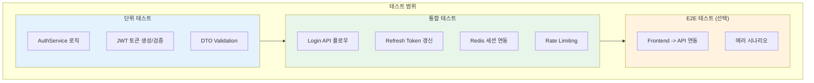
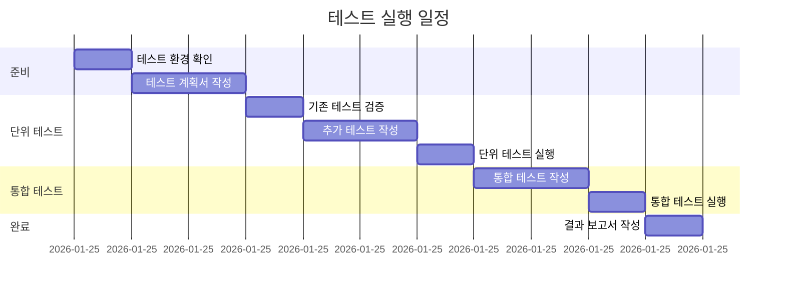

# STORY-024: 직접 로그인 API 테스트 계획서

## 문서 정보

| 항목 | 값 |
|------|-----|
| **테스트 대상** | STORY-024 직접 로그인 API |
| **Jira ID** | SCRUM-24 |
| **테스트 기간** | 2026-01-25 ~ 2026-01-27 |
| **테스트 담당** | QA Agent |
| **버전** | 1.0 |
| **작성일** | 2026-01-25 |

---

## 1. 개요

### 1.1 목적
Frontend 로그인 UI와 연동되는 직접 로그인 API에 대한 테스트 계획을 정의합니다.

### 1.2 테스트 범위



### 1.3 테스트 제외 범위

| 제외 항목 | 사유 |
|----------|------|
| Keycloak SSO 연동 | STORY-024는 직접 로그인만 해당 |
| 성능 테스트 | 별도 성능 테스트 계획에서 수행 |
| 보안 취약점 점검 | 별도 보안 스캔에서 수행 |

---

## 2. 테스트 환경

### 2.1 테스트 서버

| 구분 | 서버 | 포트 | 상태 |
|------|------|------|------|
| **AI Service (Python)** | auth_server.py | 8002 | 동작 중 |
| **Backend (SpringBoot)** | 개발 예정 | 8080 | 미구현 |
| **Redis** | 로컬/Docker | 6379 | 필요 |

### 2.2 테스트 계정

| 이메일 | 비밀번호 | 역할 | 테스트 용도 |
|--------|----------|------|------------|
| test@example.com | password123 | user | 일반 사용자 테스트 |
| admin@example.com | admin123! | admin | 관리자 테스트 |
| user@example.com | user123! | user | 추가 사용자 테스트 |
| manager@example.com | manager123! | manager | 매니저 역할 테스트 |

### 2.3 테스트 도구

| 도구 | 용도 | 버전 |
|------|------|------|
| **pytest** | Python 단위/통합 테스트 | 8.x |
| **pytest-asyncio** | 비동기 테스트 | 0.23+ |
| **httpx** | HTTP 클라이언트 | 0.27+ |
| **JUnit 5** | SpringBoot 테스트 | 5.10+ |
| **Testcontainers** | Redis/DB 통합 테스트 | 1.19+ |
| **React Testing Library** | Frontend 컴포넌트 테스트 | 14.x |

---

## 3. 테스트 케이스

### 3.1 테스트 케이스 개요

| 우선순위 | 케이스 수 | 설명 |
|----------|----------|------|
| **P0 (Critical)** | 7 | 핵심 기능, 100% 통과 필수 |
| **P1 (High)** | 5 | 중요 기능, 95%+ 통과 목표 |
| **P2 (Medium)** | 4 | 부가 기능 |
| **합계** | 16 | - |

### 3.2 단위 테스트 케이스

| ID | 테스트 케이스 | 우선순위 | 사전 조건 | 입력 | 기대 결과 |
|----|-------------|---------|----------|------|----------|
| TC-AUTH-001 | 유효한 자격 증명으로 로그인 성공 | P0 | Mock 사용자 존재 | email: test@example.com, password: password123 | 200 OK + JWT 토큰 반환 |
| TC-AUTH-002 | 잘못된 비밀번호로 로그인 실패 | P0 | Mock 사용자 존재 | email: test@example.com, password: wrongpass | 401 Unauthorized |
| TC-AUTH-003 | 존재하지 않는 이메일로 로그인 실패 | P0 | - | email: notexist@example.com | 401 Unauthorized |
| TC-AUTH-004 | 잘못된 이메일 형식 검증 | P0 | - | email: invalid-email | 422 Validation Error |
| TC-AUTH-005 | 짧은 비밀번호 검증 | P0 | - | password: 12345 (5자) | 422 Validation Error |
| TC-AUTH-006 | Access Token 생성 검증 | P0 | 로그인 성공 | - | JWT 구조 (sub, exp, iat, type) |
| TC-AUTH-007 | 관리자 역할 로그인 검증 | P1 | Admin 계정 존재 | admin@example.com | role: admin 확인 |
| TC-AUTH-008 | 비활성화된 계정 로그인 실패 | P1 | 비활성 계정 존재 | disabled@example.com | 401 Unauthorized |

### 3.3 통합 테스트 케이스

| ID | 테스트 케이스 | 우선순위 | 사전 조건 | 테스트 시나리오 | 기대 결과 |
|----|-------------|---------|----------|---------------|----------|
| TC-AUTH-009 | 로그인 -> 토큰 발급 전체 플로우 | P0 | Redis 연결 | 1. 로그인 요청<br>2. 토큰 수신<br>3. 토큰으로 /me 호출 | 사용자 정보 반환 |
| TC-AUTH-010 | Refresh Token 갱신 성공 | P0 | 로그인 완료 | 1. 로그인<br>2. refresh_token 추출<br>3. /refresh 호출 | 새 access_token 반환 |
| TC-AUTH-011 | 만료된 Refresh Token 갱신 실패 | P1 | - | 만료된 토큰으로 갱신 시도 | 401 Unauthorized |
| TC-AUTH-012 | 로그아웃 후 세션 무효화 | P1 | 로그인 완료 | 1. 로그아웃<br>2. 기존 토큰으로 /me 호출 | 401 Unauthorized |
| TC-AUTH-013 | Redis 세션 저장 검증 | P1 | Redis 연결 | 로그인 후 Redis에서 세션 확인 | 세션 데이터 존재 |
| TC-AUTH-014 | 5회 연속 로그인 실패 Rate Limiting | P2 | Rate Limit 활성화 | 5회 연속 잘못된 비밀번호 | 429 Too Many Requests |
| TC-AUTH-015 | 동시 로그인 처리 | P2 | - | 같은 계정으로 다중 로그인 | 모든 세션 유효 또는 이전 세션 무효화 |

### 3.4 E2E 테스트 케이스 (선택)

| ID | 테스트 케이스 | 우선순위 | 사전 조건 | 테스트 시나리오 | 기대 결과 |
|----|-------------|---------|----------|---------------|----------|
| TC-AUTH-E2E-001 | Frontend 로그인 폼 연동 | P1 | Frontend + API 서버 실행 | 1. 로그인 페이지 접속<br>2. 자격 증명 입력<br>3. 로그인 버튼 클릭 | 대시보드로 리다이렉트 |
| TC-AUTH-E2E-002 | 에러 메시지 표시 확인 | P2 | Frontend + API 서버 실행 | 1. 잘못된 비밀번호 입력<br>2. 로그인 시도 | 에러 메시지 UI 표시 |
| TC-AUTH-E2E-003 | 토큰 만료 시 자동 갱신 | P2 | Access Token 만료 시뮬레이션 | 1. 로그인<br>2. 토큰 만료 대기<br>3. API 호출 | 자동 갱신 후 정상 응답 |
| TC-AUTH-E2E-004 | 로그아웃 UI 플로우 | P2 | 로그인 상태 | 1. 로그아웃 버튼 클릭 | 로그인 페이지로 리다이렉트 |

---

## 4. 테스트 실행 계획

### 4.1 실행 순서



### 4.2 현재 테스트 현황 분석

#### 4.2.1 기존 테스트 파일

| 파일 | 위치 | 테스트 수 | 상태 |
|------|------|----------|------|
| test_auth.py | src/tests/ | 14개 | 작성 완료 |
| test_authentication.py | src/tests/e2e/infrastructure/ | 15개 | Keycloak 전용 |

#### 4.2.2 기존 테스트 커버리지 (test_auth.py)

| 테스트 케이스 | 커버리지 |
|--------------|---------|
| test_login_success | TC-AUTH-001 |
| test_login_admin | TC-AUTH-007 |
| test_login_invalid_email | TC-AUTH-003 |
| test_login_invalid_password | TC-AUTH-002 |
| test_login_invalid_email_format | TC-AUTH-004 |
| test_login_short_password | TC-AUTH-005 |
| test_get_me_success | TC-AUTH-009 (부분) |
| test_get_me_unauthorized | 인증 필요 검증 |
| test_get_me_invalid_token | 잘못된 토큰 검증 |
| test_logout_success | TC-AUTH-012 (부분) |
| test_logout_unauthorized | 인증 필요 검증 |
| test_refresh_token_success | TC-AUTH-010 |
| test_refresh_token_invalid | TC-AUTH-011 |
| test_admin_role | TC-AUTH-007 |

### 4.3 추가 필요 테스트

| 테스트 케이스 | 우선순위 | 작성 필요 |
|-------------|---------|----------|
| TC-AUTH-013: Redis 세션 저장 검증 | P1 | 신규 작성 필요 |
| TC-AUTH-014: Rate Limiting | P2 | 신규 작성 필요 |
| TC-AUTH-015: 동시 로그인 처리 | P2 | 신규 작성 필요 |

---

## 5. 품질 기준

### 5.1 완료 조건

| 기준 | 목표 | 필수 여부 |
|------|------|----------|
| **P0 테스트 통과율** | 100% | 필수 |
| **P1 테스트 통과율** | 95%+ | 필수 |
| **P2 테스트 통과율** | 90%+ | 권장 |
| **단위 테스트 커버리지** | 80%+ | 필수 |
| **Critical/Blocker 버그** | 0건 | 필수 |
| **High 버그** | 0건 | 필수 |

### 5.2 결함 심각도 정의

| 심각도 | 정의 | 대응 |
|--------|------|------|
| **Blocker** | 로그인 불가, 시스템 중단 | 즉시 수정 |
| **Critical** | 토큰 발급 실패, 보안 취약점 | 4시간 내 수정 |
| **High** | 로그아웃 실패, 세션 관리 이슈 | 당일 수정 |
| **Medium** | 에러 메시지 불명확, UI 이슈 | 다음 스프린트 수정 |
| **Low** | 문서/로깅 개선 | 백로그 등록 |

---

## 6. 테스트 결과 리포트 양식

```markdown
# STORY-024 테스트 결과 보고서

## 1. 요약
- 테스트 일시: YYYY-MM-DD HH:MM
- 테스트 환경: [환경 정보]
- 테스트 수행자: QA Agent

## 2. 테스트 결과

### 2.1 전체 결과
| 우선순위 | 계획 | 실행 | 통과 | 실패 | 스킵 | 통과율 |
|---------|------|------|------|------|------|--------|
| P0 | 7 | 7 | - | - | - | -% |
| P1 | 5 | 5 | - | - | - | -% |
| P2 | 4 | 4 | - | - | - | -% |
| 합계 | 16 | 16 | - | - | - | -% |

### 2.2 커버리지
| 영역 | 목표 | 달성 | 상태 |
|------|------|------|------|
| AuthService | 80% | -% | - |
| JWT 처리 | 80% | -% | - |
| DTO 검증 | 80% | -% | - |

## 3. 발견된 이슈
| ID | 심각도 | 설명 | 상태 |
|----|--------|------|------|
| - | - | - | - |

## 4. 권고 사항
- [권고 사항 목록]
```

---

## 7. 참고 문서

| 문서 | 위치 |
|------|------|
| STORY-024 작업 지시서 | work_logs/session_logs/2026-01-25_STORY-024_work_instructions.md |
| 테스트 계획서 템플릿 | knowledge_service/docs/04_testing/unit_integration_test_plan.md |
| 기존 테스트 코드 | knowledge_service/src/tests/test_auth.py |
| Auth 설계서 | knowledge_service/docs/02_design/03_authentication_authorization_detailed_design.md |

---

**작성**: QA Agent
**작성일**: 2026-01-25
