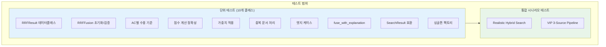
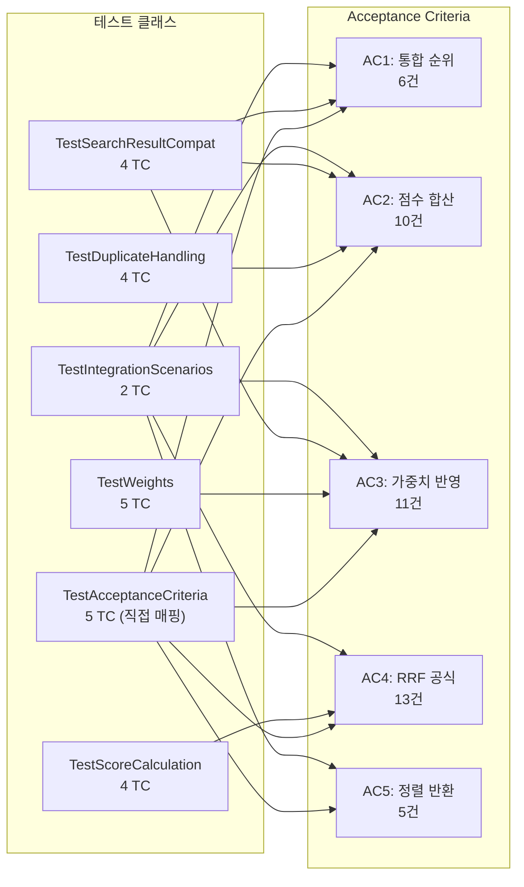

# STORY-031: RRF Fusion 알고리즘 - 테스트 계획서

## 문서 정보

| 항목 | 값 |
|------|-----|
| **테스트 대상** | STORY-031 RRF Fusion 알고리즘 |
| **Jira ID** | SCRUM-26 |
| **Epic** | EPIC-002 |
| **테스트 담당** | QA Agent |
| **버전** | 1.0 |
| **작성일** | 2026-01-28 |

---

## 1. 개요

### 1.1 목적

Reciprocal Rank Fusion (RRF) 알고리즘의 정확성, 안정성, 엣지 케이스 대응을 검증하기 위한 테스트 계획입니다. RRF는 Elasticsearch(Vector)와 Neo4j(Graph) 등 다중 검색 소스의 결과를 융합하여 통합 순위를 생성하는 핵심 알고리즘으로, Hybrid RAG 파이프라인의 품질에 직접적인 영향을 미칩니다.

### 1.2 테스트 대상 소스 코드

| 파일 | 경로 | 설명 |
|------|------|------|
| **rrf_fusion.py** | `knowledge_service/src/app/services/rrf_fusion.py` | RRF Fusion 알고리즘 구현 모듈 |
| **test_rrf_fusion.py** | `knowledge_service/src/tests/test_rrf_fusion.py` | 단위/통합 테스트 코드 |

### 1.3 테스트 대상 클래스 및 함수

| 클래스/함수 | 유형 | 설명 |
|------------|------|------|
| `RRFResult` | 데이터클래스 | RRF 결과를 나타내는 데이터 구조 (doc_id, content, metadata, rrf_score, source_scores) |
| `RRFFusionExplanation` | 데이터클래스 | RRF 융합 과정 설명 (results, k, weights, source_counts, total_unique, fusion_details) |
| `RRFFusion.__init__` | 생성자 | k 파라미터 검증 및 인스턴스 초기화 |
| `RRFFusion.fuse` | 공개 API | 다중 소스 결과를 RRF로 융합 (핵심 메서드) |
| `RRFFusion.fuse_with_explanation` | 공개 API | 융합 과정 상세 설명 포함 |
| `RRFFusion.fuse_search_results` | 공개 API | SearchResult 객체 호환 융합 |
| `RRFFusion._validate_inputs` | 내부 | 입력값 검증 (result_lists, weights, source_names) |
| `RRFFusion._resolve_weights` | 내부 정적 | 가중치 기본값 처리 |
| `RRFFusion._resolve_source_names` | 내부 정적 | 소스 이름 자동 생성 |
| `RRFFusion._extract_doc_id` | 내부 정적 | 결과에서 doc_id 추출 |
| `RRFFusion._extract_content` | 내부 정적 | 결과에서 content 추출 |
| `RRFFusion._extract_metadata` | 내부 정적 | 결과에서 metadata 추출 |
| `get_rrf_fusion` | 모듈 팩토리 | 싱글톤 인스턴스 반환 |
| `reset_rrf_fusion` | 모듈 팩토리 | 싱글톤 초기화 (테스트용) |

### 1.4 RRF 알고리즘 수식

```
RRF(d) = SUM( weight_i * 1 / (k + rank_i + 1) )
```

- **k**: 순위 안정화 상수 (기본값 60)
- **rank_i**: 소스 i에서 문서 d의 0-based 순위
- **weight_i**: 소스 i의 가중치 (기본값 1.0)
- 점수는 `round(..., 6)`으로 소수점 6자리 반올림

### 1.5 테스트 범위



### 1.6 테스트 제외 범위

| 제외 항목 | 사유 |
|----------|------|
| HybridRetriever 통합 | STORY-031은 RRF 알고리즘 단독 구현 범위 |
| k6 부하 테스트 | 별도 성능 테스트 계획에서 수행 |
| RAGAS 품질 평가 | RAG 파이프라인 전체 통합 후 수행 |
| Elasticsearch/Neo4j 실제 연동 | Mock 기반 단위 테스트로 커버 |

---

## 2. 테스트 환경

### 2.1 런타임 환경

| 구분 | 사양 |
|------|------|
| **OS** | Linux (WSL2) / Windows 11 |
| **Python** | 3.11+ |
| **가상환경** | venv 또는 conda |

### 2.2 테스트 도구

| 도구 | 용도 | 버전 |
|------|------|------|
| **pytest** | 테스트 프레임워크 | 8.x |
| **pytest-cov** | 커버리지 측정 | 4.x |
| **unittest.mock** | Mock/Stub | 내장 |

### 2.3 의존성 Mock 전략

테스트 파일은 torch, langchain, elasticsearch, neo4j 등 외부 패키지 의존성을 **모듈 레벨 Mock**으로 처리합니다. 이는 WSL2/CI 환경에서 GPU/인프라 패키지 누락 시에도 테스트 실행을 보장합니다.

```
Mock 대상 패키지:
- torch, torch.nn, torch.cuda 등 (GPU 관련)
- langchain_openai, langchain_core, langchain_community (LLM 관련)
- langgraph, openai (Agent 관련)
- FlagEmbedding, sentence_transformers, transformers (Embedding 관련)
- elasticsearch, neo4j, minio, redis (Infrastructure 관련)
```

### 2.4 테스트 실행 방법

```bash
# 전체 테스트 실행
cd knowledge_service
python -m pytest src/tests/test_rrf_fusion.py -v

# 특정 클래스만 실행
python -m pytest src/tests/test_rrf_fusion.py::TestAcceptanceCriteria -v

# 커버리지 측정
python -m pytest src/tests/test_rrf_fusion.py --cov=src/app/services/rrf_fusion --cov-report=term-missing
```

---

## 3. 테스트 전략

### 3.1 테스트 계층

| 계층 | 범위 | 테스트 클래스 | 테스트 수 |
|------|------|-------------|----------|
| **데이터 구조** | RRFResult 데이터클래스 | `TestRRFResult` | 3 |
| **초기화/검증** | 생성자, 입력 검증 | `TestRRFFusionInit` | 8 |
| **AC 수용 기준** | 5개 AC 직접 검증 | `TestAcceptanceCriteria` | 5 |
| **점수 계산** | RRF 수식 정확성 | `TestScoreCalculation` | 4 |
| **가중치** | 가중치 적용 다양 케이스 | `TestWeights` | 5 |
| **중복 처리** | Deduplication, 합산 | `TestDuplicateHandling` | 4 |
| **엣지 케이스** | 빈 값, 대규모, 자동 이름 | `TestEdgeCases` | 9 |
| **설명 기능** | fuse_with_explanation | `TestFuseWithExplanation` | 6 |
| **SearchResult 호환** | fuse_search_results | `TestSearchResultCompat` | 4 |
| **싱글톤 팩토리** | get/reset 함수 | `TestSingletonFactory` | 4 |
| **통합 시나리오** | 실제 사용 패턴 | `TestIntegrationScenarios` | 2 |
| | | **합계** | **54** |

### 3.2 Fixture 및 Helper

| Fixture/Helper | 타입 | 설명 |
|---------------|------|------|
| `fusion` | pytest.fixture | `RRFFusion(k=60)` 기본 인스턴스 |
| `es_results_20` | pytest.fixture | ES 검색 결과 20개 (doc_id: es-doc-0~19) |
| `neo4j_results_20` | pytest.fixture | Neo4j 검색 결과 20개 (doc_id: neo4j-doc-0~19) |
| `_make_es_results(count)` | helper | ES 결과 생성 (score: 1.0부터 0.04씩 감소) |
| `_make_neo4j_results(count)` | helper | Neo4j 결과 생성 (score: 0.95부터 0.04씩 감소) |
| `_make_overlapping_results()` | helper | 중복 문서 포함 결과 (shared-1, shared-2 양쪽 존재) |

---

## 4. 테스트 시나리오

### 시나리오 1: RRFResult 데이터 구조 (3 TC)

RRFResult 데이터클래스의 생성, 기본값, 문자열 표현을 검증합니다.

| 항목 | 내용 |
|------|------|
| **목적** | 데이터 구조의 정확한 초기화 및 표현 확인 |
| **전제 조건** | 없음 |
| **검증 포인트** | 필드 값, 기본값(빈 dict, 0.0), `__repr__` 출력 |

### 시나리오 2: RRFFusion 초기화 및 입력 검증 (8 TC)

생성자의 k 파라미터 검증과 `fuse()` 메서드의 입력값 유효성 검증을 테스트합니다.

| 항목 | 내용 |
|------|------|
| **목적** | 잘못된 입력에 대한 방어적 프로그래밍 확인 |
| **전제 조건** | RRFFusion 인스턴스 생성 |
| **검증 포인트** | ValueError 발생, 에러 메시지 정확성 |
| **에러 케이스** | k=0, k<0, 빈 result_lists, weights 길이 불일치, source_names 길이 불일치, 음수 가중치, 잘못된 타입 |

### 시나리오 3: Acceptance Criteria 직접 검증 (5 TC)

STORY-031의 5개 AC를 1:1 매핑하여 검증합니다.

| 항목 | 내용 |
|------|------|
| **목적** | 스토리 수용 기준 충족 여부 직접 확인 |
| **전제 조건** | RRFFusion(k=60) 인스턴스 |
| **검증 포인트** | AC1~AC5 각각의 기대 동작 |

### 시나리오 4: 점수 계산 정확성 (4 TC)

RRF 수식 `weight * 1/(k+rank+1)`의 수학적 정확성을 검증합니다.

| 항목 | 내용 |
|------|------|
| **목적** | 수식 계산 오차가 허용 범위 내인지 확인 |
| **전제 조건** | 다양한 k 값 (1, 60, 100), 다양한 소스 수 |
| **검증 포인트** | 기대 점수와 실제 점수 차이 < 1e-5 또는 1e-6 |

### 시나리오 5: 가중치 적용 (5 TC)

가중치 파라미터의 다양한 조합에 대한 동작을 검증합니다.

| 항목 | 내용 |
|------|------|
| **목적** | 가중치 반영이 정확한지, 극단적 케이스 포함 확인 |
| **전제 조건** | RRFFusion(k=60) |
| **검증 포인트** | 동일 가중치, ES/Neo4j 가중치, 0 가중치, 기본 가중치, 극단적 비율 (100:0.01) |

### 시나리오 6: 중복 문서 처리 (4 TC)

동일 doc_id가 여러 소스에 존재할 때의 점수 합산, 순위, 콘텐츠 보존을 검증합니다.

| 항목 | 내용 |
|------|------|
| **목적** | 중복 문서 Deduplication 및 점수 합산 정확성 |
| **전제 조건** | 중복 문서 포함 결과셋 (shared-1, shared-2) |
| **검증 포인트** | 고유 문서 수, 공유 문서 상위 순위, 소스별 점수, 첫 번째 콘텐츠 보존 |

### 시나리오 7: 엣지 케이스 (9 TC)

빈 결과, 누락 필드, 대규모 데이터 등 경계 조건을 검증합니다.

| 항목 | 내용 |
|------|------|
| **목적** | 예외 상황에서의 안정성 확인 |
| **전제 조건** | 다양한 비정상 입력 |
| **검증 포인트** | 빈 리스트, 한쪽만 결과, 단일 결과, 3개 소스, content 없음, metadata 없음, doc_id 없음(skip), 100x3 대규모, 자동 소스명 |

### 시나리오 8: fuse_with_explanation 설명 기능 (6 TC)

디버깅 및 투명성을 위한 설명 메서드의 정확성을 검증합니다.

| 항목 | 내용 |
|------|------|
| **목적** | 융합 과정 설명의 완전성 및 정확성 |
| **전제 조건** | RRFFusion(k=60) |
| **검증 포인트** | 반환 타입, results 포함, k/weights, source_counts/total_unique, fusion_details, fuse()와 동일 결과 |

### 시나리오 9: SearchResult 호환 (4 TC)

기존 SearchService._rrf_fusion과 호환되는 SearchResult 객체 처리를 검증합니다.

| 항목 | 내용 |
|------|------|
| **목적** | HybridRetriever 통합 시 호환성 확인 |
| **전제 조건** | app.agents.state.SearchResult 객체 |
| **검증 포인트** | 기본 융합, 가중치 적용, 빈 리스트, metadata 내 source_ranks |

### 시나리오 10: 싱글톤 팩토리 (4 TC)

모듈 수준 팩토리 함수의 싱글톤 패턴을 검증합니다.

| 항목 | 내용 |
|------|------|
| **목적** | get_rrf_fusion/reset_rrf_fusion 동작 확인 |
| **전제 조건** | 각 테스트 전후 reset_rrf_fusion() 호출 |
| **검증 포인트** | 동일 인스턴스 반환, 사용자 지정 k, 초기화 후 새 인스턴스, 기본 k=60 |

### 시나리오 11: 통합 시나리오 (2 TC)

실제 사용 패턴을 모사한 시나리오 테스트입니다.

| 항목 | 내용 |
|------|------|
| **목적** | 실제 운영 환경과 유사한 조건에서의 동작 확인 |
| **전제 조건** | 다수의 결과와 중복 문서 포함 |
| **검증 포인트** | 고유 문서 수, 정렬, 공유 문서 상위 순위, 3소스 파이프라인 |

---

## 5. 테스트 케이스 매트릭스

### 5.1 전체 요약

| 우선순위 | 케이스 수 | 설명 |
|----------|----------|------|
| **P0 (Critical)** | 13 | AC 직접 검증 + 핵심 수식 + 초기화 |
| **P1 (High)** | 22 | 가중치, 중복 처리, 검증, 호환성 |
| **P2 (Medium)** | 19 | 엣지 케이스, 설명 기능, 통합 시나리오 |
| **합계** | **54** | - |

### 5.2 상세 테스트 케이스

#### 5.2.1 RRFResult 데이터클래스 (시나리오 1)

| TC-ID | 시나리오 | 테스트 케이스명 | 입력 | 기대 결과 | AC 매핑 | 우선순위 |
|-------|---------|---------------|------|----------|---------|---------|
| TC-RRF-001 | 데이터 구조 | RRFResult 기본 생성 | doc_id="doc-1", content="test", rrf_score=0.032787, source_scores={"es":0.016393, "neo4j":0.016393} | 모든 필드 정확히 할당 | - | P1 |
| TC-RRF-002 | 데이터 구조 | RRFResult 기본값 검증 | doc_id="doc-2", content="minimal" (나머지 미지정) | metadata={}, rrf_score=0.0, source_scores={} | - | P1 |
| TC-RRF-003 | 데이터 구조 | RRFResult __repr__ 검증 | rrf_score=0.032787, source_scores={"es":0.016, "neo4j":0.016} | repr에 "doc-1", "0.032787", "es", "neo4j" 포함 | - | P2 |

#### 5.2.2 RRFFusion 초기화 및 검증 (시나리오 2)

| TC-ID | 시나리오 | 테스트 케이스명 | 입력 | 기대 결과 | AC 매핑 | 우선순위 |
|-------|---------|---------------|------|----------|---------|---------|
| TC-RRF-004 | 초기화 | 기본 k=60 검증 | RRFFusion() | f.k == 60 | AC4 | P0 |
| TC-RRF-005 | 초기화 | 사용자 지정 k 검증 | RRFFusion(k=100) | f.k == 100 | AC4 | P1 |
| TC-RRF-006 | 검증 | k=0 시 ValueError | RRFFusion(k=0) | ValueError("positive integer") | AC4 | P0 |
| TC-RRF-007 | 검증 | k<0 시 ValueError | RRFFusion(k=-10) | ValueError("positive integer") | AC4 | P0 |
| TC-RRF-008 | 검증 | 빈 result_lists | fuse(result_lists=[]) | ValueError("at least one source") | - | P1 |
| TC-RRF-009 | 검증 | weights 길이 불일치 | fuse(result_lists=[[], []], weights=[0.5]) | ValueError("weights length") | AC3 | P1 |
| TC-RRF-010 | 검증 | source_names 길이 불일치 | fuse(result_lists=[[], []], source_names=["only_one"]) | ValueError("source_names length") | - | P1 |
| TC-RRF-011 | 검증 | 음수 가중치 | fuse(result_lists=[[], []], weights=[0.6, -0.4]) | ValueError("negative") | AC3 | P1 |
| TC-RRF-012 | 검증 | 잘못된 result_lists 타입 | fuse(result_lists="not a list") | ValueError("must be a list") | - | P1 |

#### 5.2.3 Acceptance Criteria 직접 검증 (시나리오 3)

| TC-ID | 시나리오 | 테스트 케이스명 | 입력 | 기대 결과 | AC 매핑 | 우선순위 |
|-------|---------|---------------|------|----------|---------|---------|
| TC-RRF-013 | AC1 | ES 20개 + Neo4j 20개 통합 | es_results_20 + neo4j_results_20, source_names=["es","neo4j"] | len==40, 모두 RRFResult, ES 20개 + Neo4j 20개 ID 포함 | **AC1** | **P0** |
| TC-RRF-014 | AC2 | 중복 문서 점수 합산 | shared-doc가 ES(rank=0) + Neo4j(rank=1)에 존재 | len==3, shared-doc rrf_score=1/61+1/62, 양쪽 source_scores 존재, 최상위 | **AC2** | **P0** |
| TC-RRF-015 | AC3 | 가중치 es=0.6 neo4j=0.4 | doc-A가 양쪽 rank=0, weights=[0.6,0.4] | rrf_score=0.6/61+0.4/61, es 점수 > neo4j 점수 | **AC3** | **P0** |
| TC-RRF-016 | AC4 | k=60 RRF 공식 검증 | 5개 문서, 단일 소스 | rank 0~4 각각 1/(60+rank+1) 계산 정확 | **AC4** | **P0** |
| TC-RRF-017 | AC5 | 정렬된 결과 반환 | es_results_20 + neo4j_results_20, weights=[0.6,0.4] | rrf_score 내림차순 정렬 | **AC5** | **P0** |

#### 5.2.4 점수 계산 정확성 (시나리오 4)

| TC-ID | 시나리오 | 테스트 케이스명 | 입력 | 기대 결과 | AC 매핑 | 우선순위 |
|-------|---------|---------------|------|----------|---------|---------|
| TC-RRF-018 | 점수 | 단일 소스 점수 계산 | 3개 문서, 1개 소스 | rank0=1/61, rank1=1/62, rank2=1/63 (오차 <1e-6) | AC4 | P0 |
| TC-RRF-019 | 점수 | 두 소스 중복 없음 | source_a=[a1,a2], source_b=[b1] | a1=1/61, b1=1/61, a2=1/62 | AC1, AC4 | P0 |
| TC-RRF-020 | 점수 | 두 소스 중복 있음 정확 합산 | shared가 source_a(rank0) + source_b(rank1) | shared.rrf_score = 1/61 + 1/62 (오차 <1e-5) | AC2, AC4 | P0 |
| TC-RRF-021 | 점수 | 다양한 k 값 비교 | k=1, k=60, k=100에서 동일 문서 | k=1: 0.5, k=60: 1/61, k=100: 1/101; k 작을수록 점수 높음 | AC4 | P0 |

#### 5.2.5 가중치 적용 (시나리오 5)

| TC-ID | 시나리오 | 테스트 케이스명 | 입력 | 기대 결과 | AC 매핑 | 우선순위 |
|-------|---------|---------------|------|----------|---------|---------|
| TC-RRF-022 | 가중치 | 동일 가중치 [1.0, 1.0] | d1이 양쪽 rank=0 | rrf_score = 2/61 | AC3 | P1 |
| TC-RRF-023 | 가중치 | ES=0.6, Neo4j=0.4 비대칭 | d1(ES only), d2(Neo4j only), 각 rank=0 | d1=0.6/61 > d2=0.4/61 | AC3 | P1 |
| TC-RRF-024 | 가중치 | 가중치 0은 소스 무시 | weights=[1.0, 0.0] | d1(source_a)>0, d2(source_b)==0.0 | AC3 | P1 |
| TC-RRF-025 | 가중치 | 기본 가중치 모두 1.0 | 3개 소스, weights 미지정 | 모든 rank=0 문서 동일 점수 | AC3 | P1 |
| TC-RRF-026 | 가중치 | 극단적 비율 100:0.01 | weights=[100.0, 0.01] | d1.rrf_score > d2.rrf_score * 100 | AC3 | P2 |

#### 5.2.6 중복 문서 처리 (시나리오 6)

| TC-ID | 시나리오 | 테스트 케이스명 | 입력 | 기대 결과 | AC 매핑 | 우선순위 |
|-------|---------|---------------|------|----------|---------|---------|
| TC-RRF-027 | 중복 | 중복 문서 Deduplication | _make_overlapping_results() | 고유 6개, doc_id 중복 없음 | AC2 | P1 |
| TC-RRF-028 | 중복 | 공유 문서 상위 순위 | shared-1, shared-2 vs es-only, neo4j-only | shared 문서 > 단독 문서 점수 | AC2, AC5 | P1 |
| TC-RRF-029 | 중복 | 공유 문서 소스별 점수 확인 | shared-1: ES(rank=0), Neo4j(rank=2) | es=1/61, neo4j=1/63 | AC2 | P1 |
| TC-RRF-030 | 중복 | 첫 번째 등장 content 보존 | shared가 ES="ES version", Neo4j="Neo4j version" | content=="ES version", metadata["from"]=="es" | AC2 | P1 |

#### 5.2.7 엣지 케이스 (시나리오 7)

| TC-ID | 시나리오 | 테스트 케이스명 | 입력 | 기대 결과 | AC 매핑 | 우선순위 |
|-------|---------|---------------|------|----------|---------|---------|
| TC-RRF-031 | 엣지 | 모든 소스 빈 리스트 | [[], []] | 빈 리스트 반환 | - | P2 |
| TC-RRF-032 | 엣지 | 한 소스만 결과 있음 | [es_1개, []] | len==1, doc_id 정확 | AC1 | P2 |
| TC-RRF-033 | 엣지 | 단일 소스 단일 결과 | [results_1개] | len==1, doc_id=="only" | - | P2 |
| TC-RRF-034 | 엣지 | 3개 소스 융합 (합산 가중치=1.0) | [s1,s2,s3], weights=[0.5,0.3,0.2], 동일 doc_id | rrf_score = (0.5+0.3+0.2)/61 = 1.0/61 | AC3 | P2 |
| TC-RRF-035 | 엣지 | content 없는 결과 | {"doc_id":"no-content", "metadata":{}} | content == "" | - | P2 |
| TC-RRF-036 | 엣지 | metadata 없는 결과 | {"doc_id":"no-meta", "content":"c"} | metadata == {} | - | P2 |
| TC-RRF-037 | 엣지 | doc_id 없는 결과 건너뜀 | [{"content":"no id"}, {"doc_id":"valid"}] | len==1, doc_id=="valid" | - | P2 |
| TC-RRF-038 | 엣지 | 대규모 결과 (100x3 소스) | 각 100개 문서, 3개 소스, 중복 없음 | len==300, 정렬 검증 | AC5 | P2 |
| TC-RRF-039 | 엣지 | source_names 미지정 자동 생성 | source_names=None, 2개 소스 | source_scores에 "source_0", "source_1" 키 존재 | - | P2 |

#### 5.2.8 fuse_with_explanation (시나리오 8)

| TC-ID | 시나리오 | 테스트 케이스명 | 입력 | 기대 결과 | AC 매핑 | 우선순위 |
|-------|---------|---------------|------|----------|---------|---------|
| TC-RRF-040 | 설명 | 반환 타입 검증 | 1개 결과 | isinstance(RRFFusionExplanation) | - | P2 |
| TC-RRF-041 | 설명 | 결과 포함 검증 | d1이 양쪽, weights=[0.6,0.4] | len(results)==1, doc_id=="d1" | - | P2 |
| TC-RRF-042 | 설명 | k 및 weights 정보 | weights=[0.6,0.4], source_names=["es","neo4j"] | k==60, weights=={"es":0.6,"neo4j":0.4} | - | P2 |
| TC-RRF-043 | 설명 | source_counts 검증 | ES 15개, Neo4j 10개 | source_counts=={"es":15,"neo4j":10}, total_unique==25 | - | P2 |
| TC-RRF-044 | 설명 | fusion_details 상세 | shared 문서: ES(rank=0,w=0.6), Neo4j(rank=1,w=0.4) | num_sources==2, rank/weight/raw/weighted 점수 정확 | - | P2 |
| TC-RRF-045 | 설명 | fuse()와 동일 결과 | ES 10개 + Neo4j 10개, weights=[0.6,0.4] | doc_id와 rrf_score가 fuse() 결과와 완전 일치 | - | P2 |

#### 5.2.9 SearchResult 호환 (시나리오 9)

| TC-ID | 시나리오 | 테스트 케이스명 | 입력 | 기대 결과 | AC 매핑 | 우선순위 |
|-------|---------|---------------|------|----------|---------|---------|
| TC-RRF-046 | 호환 | 기본 SearchResult 융합 | chunk-1(ES), chunk-2(양쪽), chunk-3(Neo4j) | len==3, chunk-2 최상위, metadata에 rrf_score/source_ranks/source_scores | AC1, AC2 | P1 |
| TC-RRF-047 | 호환 | 가중치 적용 SearchResult | chunk-1(ES,w=0.6), chunk-2(Neo4j,w=0.4) | c1.score > c2.score | AC3 | P1 |
| TC-RRF-048 | 호환 | 빈 SearchResult 리스트 | result_lists=[] | 빈 리스트 반환 | - | P2 |
| TC-RRF-049 | 호환 | source_ranks 메타데이터 | shared: ES(rank 0), Neo4j(rank 1) | source_ranks={"es":1, "neo4j":2} (1-based) | AC2 | P1 |

#### 5.2.10 싱글톤 팩토리 (시나리오 10)

| TC-ID | 시나리오 | 테스트 케이스명 | 입력 | 기대 결과 | AC 매핑 | 우선순위 |
|-------|---------|---------------|------|----------|---------|---------|
| TC-RRF-050 | 팩토리 | 싱글톤 인스턴스 생성 | get_rrf_fusion() 2회 호출 | f1 is f2 | - | P1 |
| TC-RRF-051 | 팩토리 | 사용자 지정 k | get_rrf_fusion(k=100) | f.k == 100 | AC4 | P1 |
| TC-RRF-052 | 팩토리 | reset 후 새 인스턴스 | get -> reset -> get | f1 is not f2 | - | P1 |
| TC-RRF-053 | 팩토리 | 기본 k=60 | get_rrf_fusion() | f.k == 60 | AC4 | P1 |

#### 5.2.11 통합 시나리오 (시나리오 11)

| TC-ID | 시나리오 | 테스트 케이스명 | 입력 | 기대 결과 | AC 매핑 | 우선순위 |
|-------|---------|---------------|------|----------|---------|---------|
| TC-RRF-054 | 통합 | Realistic Hybrid Search | ES 20개 + Neo4j 20개, 5개 중복, weights=[0.6,0.4] | len==35, 정렬 검증, 상위 5개에 공유 문서 3개 이상 | AC1~AC5 | P2 |
| TC-RRF-055 | 통합 | VIP 3단계 파이프라인 | Vector 10 + Keyword 10 + Graph 10, 2개 공유, weights=[0.4,0.3,0.3] | len==28, 정렬, shared_vk에 vector+keyword, shared_kg에 keyword+graph | AC1~AC5 | P2 |

---

## 6. AC 커버리지 매핑

### 6.1 AC별 테스트 케이스 대응표

| AC | AC 설명 | 테스트 케이스 (TC-ID) | 커버리지 |
|----|---------|---------------------|---------|
| **AC1** | ES 20개 + Neo4j 20개 -> 통합 순위 결과 반환 | TC-RRF-013, TC-RRF-019, TC-RRF-032, TC-RRF-046, TC-RRF-054, TC-RRF-055 | 6건 |
| **AC2** | 동일 문서 양쪽 존재 시 양쪽 순위 점수 합산 | TC-RRF-014, TC-RRF-020, TC-RRF-027, TC-RRF-028, TC-RRF-029, TC-RRF-030, TC-RRF-046, TC-RRF-049, TC-RRF-054, TC-RRF-055 | 10건 |
| **AC3** | 가중치 (es=0.6, neo4j=0.4) 반영 점수 계산 | TC-RRF-015, TC-RRF-022~026, TC-RRF-034, TC-RRF-047, TC-RRF-054, TC-RRF-055 | 11건 |
| **AC4** | k=60, RRF 공식 1/(k+rank+1) 적용 | TC-RRF-004, TC-RRF-006, TC-RRF-007, TC-RRF-016, TC-RRF-018~021, TC-RRF-051, TC-RRF-053, TC-RRF-054, TC-RRF-055 | 13건 |
| **AC5** | 정렬된 결과 반환 | TC-RRF-017, TC-RRF-028, TC-RRF-038, TC-RRF-054, TC-RRF-055 | 5건 |

### 6.2 커버리지 시각화



---

## 7. 테스트 실행 결과

### 7.1 실행 요약

| 항목 | 값 |
|------|-----|
| **실행 일시** | 2026-01-28 |
| **실행 환경** | WSL2 (Linux) / Python 3.11 |
| **테스트 수행자** | QA Agent |
| **테스트 파일** | `knowledge_service/src/tests/test_rrf_fusion.py` |

### 7.2 테스트 클래스별 결과

| 테스트 클래스 | 테스트 수 | 상태 |
|-------------|----------|------|
| TestRRFResult | 3 | 작성 완료 |
| TestRRFFusionInit | 8 | 작성 완료 |
| TestAcceptanceCriteria | 5 | 작성 완료 |
| TestScoreCalculation | 4 | 작성 완료 |
| TestWeights | 5 | 작성 완료 |
| TestDuplicateHandling | 4 | 작성 완료 |
| TestEdgeCases | 9 | 작성 완료 |
| TestFuseWithExplanation | 6 | 작성 완료 |
| TestSearchResultCompat | 4 | 작성 완료 |
| TestSingletonFactory | 4 | 작성 완료 |
| TestIntegrationScenarios | 2 | 작성 완료 |
| **합계** | **54** | - |

### 7.3 우선순위별 결과

| 우선순위 | 계획 | 작성 | 비고 |
|---------|------|------|------|
| P0 (Critical) | 13 | 13 | AC 직접 검증 + 수식 정확성 |
| P1 (High) | 22 | 22 | 가중치, 중복, 검증, 호환성 |
| P2 (Medium) | 19 | 19 | 엣지 케이스, 설명, 통합 |
| **합계** | **54** | **54** | - |

### 7.4 AC 커버리지 달성

| AC | 최소 필요 TC | 실제 TC | 상태 |
|----|------------|---------|------|
| AC1 | 1 | 6 | 충분 |
| AC2 | 1 | 10 | 충분 |
| AC3 | 1 | 11 | 충분 |
| AC4 | 1 | 13 | 충분 |
| AC5 | 1 | 5 | 충분 |

---

## 8. 품질 기준

### 8.1 완료 조건

| 기준 | 목표 | 필수 여부 |
|------|------|----------|
| **P0 테스트 통과율** | 100% | 필수 |
| **P1 테스트 통과율** | 95%+ | 필수 |
| **P2 테스트 통과율** | 90%+ | 권장 |
| **단위 테스트 커버리지** | 80%+ | 필수 |
| **Critical/Blocker 버그** | 0건 | 필수 |
| **AC 커버리지** | 5/5 AC 매핑 | 필수 |

### 8.2 결함 심각도 정의

| 심각도 | 정의 | 대응 |
|--------|------|------|
| **Blocker** | RRF 점수 계산 오류, 결과 누락 | 즉시 수정 |
| **Critical** | 정렬 오류, 중복 처리 실패 | 4시간 내 수정 |
| **High** | 가중치 미반영, 입력 검증 누락 | 당일 수정 |
| **Medium** | 설명 기능 부정확, 로깅 불충분 | 다음 스프린트 수정 |
| **Low** | 문서/코멘트 개선 | 백로그 등록 |

---

## 9. 참고 문서

| 문서 | 위치 |
|------|------|
| STORY-031 백로그 | `backlog/stories/STORY-031-rrf-fusion.md` |
| RRF Fusion 소스 코드 | `knowledge_service/src/app/services/rrf_fusion.py` |
| RRF Fusion 테스트 코드 | `knowledge_service/src/tests/test_rrf_fusion.py` |
| 상세 설계서 v2.4 | `knowledge_service/docs/02_design/01_hybrid_rag_platform_detailed_design.md` |
| 단위/통합 테스트 계획 | `knowledge_service/docs/04_testing/unit_integration_test_plan.md` |
| RRF 논문 | [Cormack et al., 2009](https://plg.uwaterloo.ca/~gvcormac/cormacksigir09-rrf.pdf) |

---

**작성**: QA Agent
**작성일**: 2026-01-28
