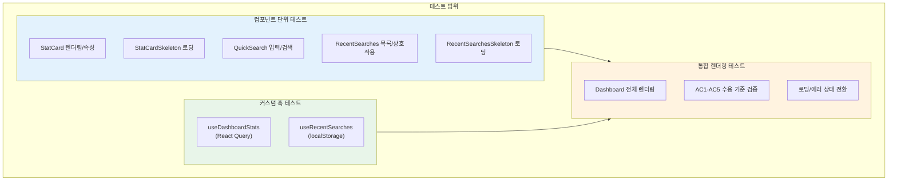

# STORY-041: Dashboard UI - 테스트 계획서

## 문서 정보

| 항목 | 값 |
|------|-----|
| **테스트 대상** | STORY-041 Dashboard UI |
| **Jira ID** | SCRUM-30 |
| **Epic** | EPIC-003 |
| **테스트 기간** | 2026-01-28 |
| **테스트 담당** | QA Agent |
| **버전** | 1.0 |
| **작성일** | 2026-01-28 |
| **총 테스트 케이스** | 63건 (6개 파일) |

---

## 1. 개요

### 1.1 목적

Dashboard UI(STORY-041)의 모든 컴포넌트, 커스텀 훅, 통합 렌더링에 대한 테스트 계획을 정의합니다. 사용자가 로그인 후 접근하는 대시보드 화면의 환영 메시지, 통계 위젯, 빠른 검색, 최근 검색 기록 등 핵심 기능의 정상 동작을 검증합니다.

### 1.2 테스트 범위



### 1.3 테스트 대상 파일

| 소스 파일 | 테스트 파일 | 테스트 수 |
|----------|-----------|----------|
| `components/StatCard.tsx` | `__tests__/StatCard.test.tsx` | 13 |
| `components/QuickSearch.tsx` | `__tests__/QuickSearch.test.tsx` | 10 |
| `components/RecentSearches.tsx` | `__tests__/RecentSearches.test.tsx` | 14 |
| `hooks/useRecentSearches.ts` | `__tests__/useRecentSearches.test.ts` | 12 |
| `hooks/useDashboardStats.ts` | `__tests__/useDashboardStats.test.ts` | 4 |
| `Dashboard.tsx` | `__tests__/Dashboard.test.tsx` | 10 |
| **합계** | **6개 파일** | **63건** |

---

## 2. 테스트 환경

### 2.1 테스트 프레임워크

| 도구 | 버전/설명 | 용도 |
|------|----------|------|
| **Vitest** | 최신 | 테스트 러너, 단언(assertion), 모킹 |
| **React Testing Library** | `@testing-library/react` | 컴포넌트 렌더링, DOM 쿼리 |
| **jsdom** | Vitest 내장 | 브라우저 환경 시뮬레이션 |
| **MemoryRouter** | `react-router-dom` | 라우팅 모킹 (네비게이션 테스트) |
| **QueryClientProvider** | `@tanstack/react-query` | React Query 컨텍스트 제공 |

### 2.2 모킹 전략

| 대상 | 모킹 방식 | 사용 파일 |
|------|----------|----------|
| `useNavigate` | `vi.mock('react-router-dom')` | QuickSearch, RecentSearches, Dashboard |
| `useAuth` | `vi.mock('@/auth')` | Dashboard |
| `dashboardService` | `vi.mock('@/services/dashboardService')` | useDashboardStats, Dashboard |
| `localStorage` | `localStorage.clear()` (beforeEach) | useRecentSearches, Dashboard |

### 2.3 테스트 설정

```typescript
// QueryClient 설정 (테스트용)
const createQueryClient = () =>
  new QueryClient({
    defaultOptions: {
      queries: {
        retry: false,   // 재시도 비활성화 (테스트 속도)
        staleTime: 0,   // 즉시 stale 처리
      },
    },
  });
```

---

## 3. 테스트 전략

### 3.1 테스트 피라미드

```
                  +-----------+
                 /  통합 테스트  \        10건 (Dashboard.test.tsx)
                /   (Dashboard)  \
               +-----------------+
              /  컴포넌트 단위 테스트  \    37건 (StatCard, QuickSearch, RecentSearches)
             /                       \
            +-------------------------+
           /    커스텀 훅 단위 테스트     \  16건 (useDashboardStats, useRecentSearches)
          +-----------------------------+
```

### 3.2 테스트 접근 방식

| 계층 | 접근 방식 | 검증 대상 |
|------|----------|----------|
| **컴포넌트** | Props 기반 렌더링 검증 | DOM 출력, 이벤트 핸들링, 조건부 렌더링 |
| **훅** | `renderHook` + `act` | 상태 변경, localStorage 동기화, API 호출 |
| **통합** | 전체 컴포넌트 트리 렌더링 | AC 수용 기준, 로딩/에러 상태, 데이터 바인딩 |

---

## 4. 테스트 시나리오

### 4.1 StatCard 컴포넌트 시나리오 (13건)

**소스**: `knowledge_service/frontend/src/features/dashboard/components/StatCard.tsx`
**테스트**: `knowledge_service/frontend/src/features/dashboard/__tests__/StatCard.test.tsx`

**StatCard 기본 렌더링 (10건)**

| # | 시나리오 | 검증 내용 |
|---|---------|----------|
| 1 | 제목과 값 렌더링 | `title`과 `value` props가 DOM에 정확히 표시됨 |
| 2 | 아이콘 렌더링 | `icon` prop의 React 노드가 컨테이너 내에 렌더링됨 |
| 3 | 부제목 표시 (있을 때) | `subtitle` prop이 제공되면 텍스트가 표시됨 |
| 4 | 부제목 미표시 (없을 때) | `subtitle` 미제공 시 관련 텍스트가 DOM에 없음 |
| 5 | 양수 트렌드 표시 | `trend.isPositive=true`일 때 "+N%" 형식으로 표시 |
| 6 | 음수 트렌드 표시 | `trend.isPositive=false`일 때 "-N%" 형식으로 표시 |
| 7 | 트렌드 미표시 (없을 때) | `trend` 미제공 시 "%" 텍스트가 DOM에 없음 |
| 8 | data-testid 확인 | `stat-card` testid가 존재함 |
| 9 | aria-label 확인 | `role="region"`에 "{title}: {value}" 형식의 접근성 레이블 |
| 10 | 커스텀 iconBg 클래스 | `iconBg` prop의 CSS 클래스가 아이콘 컨테이너에 적용됨 |

**StatCardSkeleton 로딩 상태 (3건)**

| # | 시나리오 | 검증 내용 |
|---|---------|----------|
| 11 | 스켈레톤 testid | `stat-card-skeleton` testid가 존재함 |
| 12 | 애니메이션 클래스 | `animate-pulse` 클래스가 적용됨 |
| 13 | 접근성 트리 제외 | `aria-hidden="true"` 속성으로 스크린 리더에서 숨김 |

### 4.2 QuickSearch 컴포넌트 시나리오 (10건)

**소스**: `knowledge_service/frontend/src/features/dashboard/components/QuickSearch.tsx`
**테스트**: `knowledge_service/frontend/src/features/dashboard/__tests__/QuickSearch.test.tsx`

| # | 시나리오 | 검증 내용 |
|---|---------|----------|
| 1 | 기본 placeholder 렌더링 | "Search knowledge base... (Ctrl+K)" placeholder 표시 |
| 2 | 커스텀 placeholder | `placeholder` prop 값이 input에 반영됨 |
| 3 | 접근성 role과 aria-label | `role="search"`, `aria-label="Search query"` 존재 |
| 4 | 입력값 변경 | 사용자 입력 시 input value가 업데이트됨 |
| 5 | form submit으로 검색 페이지 이동 (AC4) | 쿼리 입력 후 form submit 시 `/search?q=` URL로 navigate 호출 |
| 6 | onSearch 콜백 호출 | `onSearch` prop 콜백이 trimmed 쿼리와 함께 호출됨 |
| 7 | 빈 쿼리로 네비게이션 방지 | 빈 입력 상태에서 submit 시 navigate 미호출 |
| 8 | 공백만 있는 쿼리로 네비게이션 방지 | 공백만 입력 시 navigate 미호출 |
| 9 | 쿼리 앞뒤 공백 제거 | "  test query  " 입력 시 "test%20query"로 URL 인코딩 |
| 10 | data-testid 확인 | `quick-search` testid가 존재함 |

### 4.3 RecentSearches 컴포넌트 시나리오 (14건)

**소스**: `knowledge_service/frontend/src/features/dashboard/components/RecentSearches.tsx`
**테스트**: `knowledge_service/frontend/src/features/dashboard/__tests__/RecentSearches.test.tsx`

**RecentSearches 기본 동작 (12건)**

| # | 시나리오 | 검증 내용 |
|---|---------|----------|
| 1 | 모든 검색 항목 렌더링 (AC3) | 5개 검색 쿼리 텍스트가 모두 DOM에 표시됨 |
| 2 | 정확히 5개 항목 표시 (AC3) | `recent-search-item` testid를 가진 요소가 5개 |
| 3 | 빈 상태 표시 | 검색 기록이 없으면 "No recent searches yet." 메시지 표시 |
| 4 | 클릭 시 검색 페이지 이동 | 항목 클릭 시 `/search?q=` URL로 navigate 호출 |
| 5 | onSearchClick 콜백 호출 | 항목 클릭 시 `onSearchClick` 콜백에 쿼리 텍스트 전달 |
| 6 | 결과 수 표시 | `resultCount`가 있는 항목에 "N results" 텍스트 표시 |
| 7 | 삭제 버튼 렌더링 | `onRemove` prop 제공 시 각 항목에 삭제 버튼 표시 |
| 8 | 삭제 버튼 클릭 | 삭제 버튼 클릭 시 해당 항목의 ID로 `onRemove` 호출 |
| 9 | 전체 삭제 버튼 렌더링 | `onClearAll` prop 제공 시 "Clear all" 버튼 표시 |
| 10 | 전체 삭제 버튼 클릭 | "Clear all" 버튼 클릭 시 `onClearAll` 콜백 호출 |
| 11 | data-testid 확인 | `recent-searches` testid가 존재함 |
| 12 | 접근성 list role과 label | `role="list"`, `aria-label="Recent search history"` 존재 |

**RecentSearchesSkeleton 로딩 상태 (2건)**

| # | 시나리오 | 검증 내용 |
|---|---------|----------|
| 13 | 스켈레톤 testid | `recent-searches-skeleton` testid가 존재함 |
| 14 | 애니메이션 클래스 | `animate-pulse` 클래스가 적용됨 |

### 4.4 useRecentSearches 훅 시나리오 (12건)

**소스**: `knowledge_service/frontend/src/features/dashboard/hooks/useRecentSearches.ts`
**테스트**: `knowledge_service/frontend/src/features/dashboard/__tests__/useRecentSearches.test.ts`

| # | 시나리오 | 검증 내용 |
|---|---------|----------|
| 1 | 초기 상태 반환 | searches=[], displaySearches=[], totalCount=0 |
| 2 | 검색 항목 추가 | `addSearch('test query')` 호출 후 searches 길이 1, 쿼리 텍스트 일치 |
| 3 | 결과 수와 함께 추가 | `addSearch('test query', 42)` 호출 후 resultCount=42 확인 |
| 4 | 대소문자 무관 중복 제거 | 동일 쿼리(대소문자 다름) 추가 시 최신 항목만 유지 |
| 5 | 최신 항목 선두 배치 | 여러 항목 추가 시 가장 최근 항목이 인덱스 0 |
| 6 | displayCount 제한 | displayCount=3 설정 시 displaySearches는 최대 3개 |
| 7 | maxItems 제한 | maxItems=3 설정 시 전체 저장 항목 최대 3개 |
| 8 | ID로 항목 삭제 | `removeSearch(id)` 호출 후 해당 항목 제거 확인 |
| 9 | 전체 삭제 | `clearAll()` 호출 후 searches=[], totalCount=0 |
| 10 | localStorage 저장 | 항목 추가 후 `kp_recent_searches` 키에 JSON 저장 확인 |
| 11 | localStorage에서 로드 | localStorage에 데이터 사전 설정 후 마운트 시 로드 확인 |
| 12 | 고유 ID 생성 | 여러 항목의 ID가 모두 다름 (Set 크기 비교) |

### 4.5 useDashboardStats 훅 시나리오 (4건)

**소스**: `knowledge_service/frontend/src/features/dashboard/hooks/useDashboardStats.ts`
**테스트**: `knowledge_service/frontend/src/features/dashboard/__tests__/useDashboardStats.test.ts`

| # | 시나리오 | 검증 내용 |
|---|---------|----------|
| 1 | 쿼리 키 내보내기 | `DASHBOARD_STATS_QUERY_KEY = ['dashboard', 'stats']` |
| 2 | 통계 데이터 성공 조회 | API 성공 시 isLoading->isSuccess 전환, data에 통계 객체 포함 |
| 3 | 에러 상태 처리 | API 실패 시 isError=true |
| 4 | enabled 옵션 존중 | `enabled: false` 시 isLoading=false, fetchStatus='idle' |

### 4.6 Dashboard 통합 시나리오 (10건)

**소스**: `knowledge_service/frontend/src/features/dashboard/Dashboard.tsx`
**테스트**: `knowledge_service/frontend/src/features/dashboard/__tests__/Dashboard.test.tsx`

| # | 시나리오 | AC 매핑 | 검증 내용 |
|---|---------|---------|----------|
| 1 | data-testid 확인 | - | `dashboard-page` testid가 존재함 |
| 2 | 사용자 이름 표시 (AC1) | AC1 | welcome-section에 사용자 이름("Test User") 표시 |
| 3 | 시간대별 인사말 (AC1) | AC1 | "Good morning/afternoon/evening" 중 하나 포함 |
| 4 | 로딩 스켈레톤 표시 (AC2) | AC2 | 초기 로딩 시 `stats-loading` testid 존재 |
| 5 | 통계 카드 데이터 표시 (AC2) | AC2 | API 응답 후 "1,234", "5,678", "42" 텍스트 표시 |
| 6 | 빠른 검색 컴포넌트 (AC4) | AC4 | `quick-search`, `quick-search-input` testid 존재 |
| 7 | 최근 검색 섹션 헤더 (AC3) | AC3 | "Recent Searches" 텍스트 표시 |
| 8 | 최근 검색 빈 상태 (AC3) | AC3 | 기록 없을 때 "No recent searches yet." 표시 |
| 9 | Getting Started 가이드 | - | "Getting Started", "Search Knowledge", "Browse Documents", "Collaborate" 텍스트 |
| 10 | Quick Search 섹션 헤더 | - | "Quick Search" 텍스트 표시 |

---

## 5. 테스트 케이스 매트릭스

### 5.1 전체 테스트 케이스 목록

| TC-ID | 컴포넌트/훅 | 테스트 케이스명 | 입력/조건 | 기대 결과 | AC 매핑 | 우선순위 |
|-------|-----------|---------------|----------|----------|---------|---------|
| **StatCard 컴포넌트** | | | | | | |
| TC-SC-001 | StatCard | 제목과 값 렌더링 | title="Total Documents", value="1,234" | 두 텍스트 모두 DOM에 존재 | AC2 | High |
| TC-SC-002 | StatCard | 아이콘 렌더링 | icon=mock-icon | data-testid="mock-icon" 존재 | AC2 | Medium |
| TC-SC-003 | StatCard | 부제목 표시 | subtitle="12 added today" | "12 added today" 텍스트 존재 | AC2 | Medium |
| TC-SC-004 | StatCard | 부제목 미표시 | subtitle 미제공 | "added today" 텍스트 미존재 | AC2 | Low |
| TC-SC-005 | StatCard | 양수 트렌드 | trend={value:12, isPositive:true} | "+12%" 텍스트 표시 | AC2 | Medium |
| TC-SC-006 | StatCard | 음수 트렌드 | trend={value:-5, isPositive:false} | "-5%" 텍스트 표시 | AC2 | Medium |
| TC-SC-007 | StatCard | 트렌드 미표시 | trend 미제공 | "%" 텍스트 미존재 | AC2 | Low |
| TC-SC-008 | StatCard | data-testid | 기본 렌더링 | stat-card testid 존재 | - | Low |
| TC-SC-009 | StatCard | aria-label | title="Total Documents", value="1,234" | region role에 "Total Documents: 1,234" label | A11y | High |
| TC-SC-010 | StatCard | 커스텀 iconBg | iconBg="bg-success-50" | .bg-success-50 클래스 존재 | - | Low |
| TC-SC-011 | StatCardSkeleton | 스켈레톤 testid | 기본 렌더링 | stat-card-skeleton testid 존재 | AC2 | Medium |
| TC-SC-012 | StatCardSkeleton | 애니메이션 클래스 | 기본 렌더링 | animate-pulse 클래스 포함 | AC2 | Low |
| TC-SC-013 | StatCardSkeleton | 접근성 숨김 | 기본 렌더링 | aria-hidden="true" | A11y | High |
| **QuickSearch 컴포넌트** | | | | | | |
| TC-QS-001 | QuickSearch | 기본 placeholder | 기본 렌더링 | "Search knowledge base... (Ctrl+K)" | AC4 | High |
| TC-QS-002 | QuickSearch | 커스텀 placeholder | placeholder="Custom" | "Custom" placeholder | AC4 | Low |
| TC-QS-003 | QuickSearch | role과 aria-label | 기본 렌더링 | role="search", label="Search query" | A11y | High |
| TC-QS-004 | QuickSearch | 입력값 변경 | 사용자 "test query" 입력 | input value="test query" | AC4 | High |
| TC-QS-005 | QuickSearch | form submit 네비게이션 (AC4) | "knowledge graph" 입력 후 submit | navigate('/search?q=knowledge%20graph') | AC4 | Critical |
| TC-QS-006 | QuickSearch | onSearch 콜백 | onSearch prop + "test" 입력 + submit | onSearch("test") 호출 | AC4 | Medium |
| TC-QS-007 | QuickSearch | 빈 쿼리 방지 | 빈 입력 + submit | navigate 미호출 | AC4 | High |
| TC-QS-008 | QuickSearch | 공백만 쿼리 방지 | "   " 입력 + submit | navigate 미호출 | AC4 | High |
| TC-QS-009 | QuickSearch | 공백 트리밍 | "  test query  " 입력 + submit | navigate('/search?q=test%20query') | AC4 | Medium |
| TC-QS-010 | QuickSearch | data-testid | 기본 렌더링 | quick-search testid 존재 | - | Low |
| **RecentSearches 컴포넌트** | | | | | | |
| TC-RS-001 | RecentSearches | 전체 항목 렌더링 (AC3) | 5개 검색 데이터 | 5개 쿼리 텍스트 모두 DOM에 존재 | AC3 | Critical |
| TC-RS-002 | RecentSearches | 5개 항목 수 확인 (AC3) | 5개 검색 데이터 | recent-search-item 요소 5개 | AC3 | Critical |
| TC-RS-003 | RecentSearches | 빈 상태 표시 | searches=[] | "No recent searches yet." 표시 | AC3 | High |
| TC-RS-004 | RecentSearches | 클릭 네비게이션 | 첫 번째 항목 클릭 | navigate('/search?q=...') 호출 | AC3 | High |
| TC-RS-005 | RecentSearches | onSearchClick 콜백 | 항목 클릭 + onSearchClick prop | onSearchClick(query) 호출 | AC3 | Medium |
| TC-RS-006 | RecentSearches | 결과 수 표시 | resultCount=12 | "12 results" 텍스트 존재 | AC3 | Medium |
| TC-RS-007 | RecentSearches | 삭제 버튼 렌더링 | onRemove prop 제공 | remove-search-item 버튼 5개 | AC3 | Medium |
| TC-RS-008 | RecentSearches | 삭제 버튼 동작 | 첫 번째 삭제 버튼 클릭 | onRemove('search_1') 호출 | AC3 | Medium |
| TC-RS-009 | RecentSearches | 전체 삭제 버튼 렌더링 | onClearAll prop 제공 | clear-all-searches 버튼 존재 | AC3 | Medium |
| TC-RS-010 | RecentSearches | 전체 삭제 동작 | clear-all-searches 클릭 | onClearAll() 호출 | AC3 | Medium |
| TC-RS-011 | RecentSearches | data-testid | 기본 렌더링 | recent-searches testid 존재 | - | Low |
| TC-RS-012 | RecentSearches | 접근성 list role | 기본 렌더링 | role="list", label="Recent search history" | A11y | High |
| TC-RS-013 | RecentSearchesSkeleton | 스켈레톤 testid | 기본 렌더링 | recent-searches-skeleton testid 존재 | AC3 | Medium |
| TC-RS-014 | RecentSearchesSkeleton | 애니메이션 클래스 | 기본 렌더링 | animate-pulse 클래스 포함 | AC3 | Low |
| **useRecentSearches 훅** | | | | | | |
| TC-URS-001 | useRecentSearches | 초기 상태 | 초기 마운트 | searches=[], totalCount=0 | AC3 | High |
| TC-URS-002 | useRecentSearches | 항목 추가 | addSearch('test query') | searches 길이 1, query='test query' | AC3 | Critical |
| TC-URS-003 | useRecentSearches | 결과 수 포함 추가 | addSearch('test', 42) | resultCount=42 | AC3 | Medium |
| TC-URS-004 | useRecentSearches | 대소문자 중복 제거 | 'Test Query' -> 'test query' | searches 길이 1, 최신 유지 | AC3 | High |
| TC-URS-005 | useRecentSearches | 최신 선두 배치 | 'first' -> 'second' 순서 추가 | searches[0].query='second' | AC3 | High |
| TC-URS-006 | useRecentSearches | displayCount 제한 | displayCount=3, 5개 추가 | displaySearches 길이 3 | AC3 | High |
| TC-URS-007 | useRecentSearches | maxItems 제한 | maxItems=3, 5개 추가 | searches 길이 3 | AC3 | Medium |
| TC-URS-008 | useRecentSearches | ID로 삭제 | removeSearch(id) | 해당 항목 제거, 나머지 유지 | AC3 | High |
| TC-URS-009 | useRecentSearches | 전체 삭제 | clearAll() | searches=[], totalCount=0 | AC3 | Medium |
| TC-URS-010 | useRecentSearches | localStorage 저장 | addSearch() 후 | kp_recent_searches 키에 JSON 저장 | AC3 | High |
| TC-URS-011 | useRecentSearches | localStorage 로드 | 사전 데이터 설정 후 마운트 | 저장된 데이터 로드 | AC3 | High |
| TC-URS-012 | useRecentSearches | 고유 ID 생성 | 2개 항목 추가 | 모든 ID 유니크 (Set.size === length) | AC3 | Medium |
| **useDashboardStats 훅** | | | | | | |
| TC-UDS-001 | useDashboardStats | 쿼리 키 | - | DASHBOARD_STATS_QUERY_KEY = ['dashboard', 'stats'] | AC2 | Low |
| TC-UDS-002 | useDashboardStats | 성공 조회 | API 성공 응답 | isLoading->isSuccess, data에 통계 포함 | AC2 | Critical |
| TC-UDS-003 | useDashboardStats | 에러 처리 | API 실패 (Network error) | isError=true | AC2 | High |
| TC-UDS-004 | useDashboardStats | enabled 옵션 | enabled: false | isLoading=false, fetchStatus='idle' | AC2 | Medium |
| **Dashboard 통합 테스트** | | | | | | |
| TC-DB-001 | Dashboard | data-testid | 기본 렌더링 | dashboard-page testid 존재 | - | Medium |
| TC-DB-002 | Dashboard | 사용자 이름 (AC1) | mockUser.name="Test User" | welcome-section에 "Test User" 표시 | AC1 | Critical |
| TC-DB-003 | Dashboard | 시간대별 인사말 (AC1) | 현재 시간 | Good morning/afternoon/evening 포함 | AC1 | High |
| TC-DB-004 | Dashboard | 로딩 스켈레톤 (AC2) | 초기 렌더링 | stats-loading testid 존재 | AC2 | High |
| TC-DB-005 | Dashboard | 통계 데이터 표시 (AC2) | API 응답 대기 | "1,234", "5,678", "42" 텍스트 표시 | AC2 | Critical |
| TC-DB-006 | Dashboard | 빠른 검색 존재 (AC4) | 기본 렌더링 | quick-search, quick-search-input 존재 | AC4 | High |
| TC-DB-007 | Dashboard | Recent Searches 헤더 (AC3) | 기본 렌더링 | "Recent Searches" 텍스트 존재 | AC3 | High |
| TC-DB-008 | Dashboard | 검색 빈 상태 (AC3) | localStorage 비어있음 | "No recent searches yet." 표시 | AC3 | High |
| TC-DB-009 | Dashboard | Getting Started 가이드 | 기본 렌더링 | Search Knowledge, Browse Documents, Collaborate 표시 | - | Medium |
| TC-DB-010 | Dashboard | Quick Search 헤더 | 기본 렌더링 | "Quick Search" 텍스트 표시 | AC4 | Medium |

---

## 6. AC 커버리지 매핑

### 6.1 Acceptance Criteria 정의

| AC ID | Given | When | Then |
|-------|-------|------|------|
| **AC1** | 로그인 완료 | 대시보드 접근 | 사용자 환영 메시지 표시 |
| **AC2** | 대시보드 로드 | 통계 API 호출 | 문서 수, 검색 수 등 표시 |
| **AC3** | 최근 검색 섹션 | 렌더링 | 최근 5개 검색 기록 표시 |
| **AC4** | 빠른 검색 입력창 | 엔터 입력 | 검색 페이지로 이동 |
| **AC5** | 사이드바 네비게이션 | 메뉴 클릭 | 해당 페이지로 이동 |

### 6.2 AC별 테스트 케이스 매핑

| AC | 테스트 케이스 (TC-ID) | 커버리지 |
|----|---------------------|---------|
| **AC1** | TC-DB-002, TC-DB-003 | 2건 - 사용자 이름 표시, 시간대 인사말 |
| **AC2** | TC-SC-001~013, TC-UDS-001~004, TC-DB-004, TC-DB-005 | 19건 - StatCard 렌더링/스켈레톤/접근성, API 훅, 통합 |
| **AC3** | TC-RS-001~014, TC-URS-001~012, TC-DB-007, TC-DB-008 | 28건 - RecentSearches 렌더링/상호작용, 훅 상태관리, 통합 |
| **AC4** | TC-QS-001~010, TC-DB-006, TC-DB-010 | 12건 - QuickSearch 입력/네비게이션/접근성, 통합 |
| **AC5** | *(Sidebar 컴포넌트 - 별도 테스트 범위)* | 0건 - 공유 컴포넌트로 별도 관리 |

### 6.3 AC 커버리지 요약

```
AC1 (환영 메시지)      ████████████░░░░░░░░  2/2   100%
AC2 (통계 표시)        ████████████████████  19/19 100%
AC3 (최근 검색)        ████████████████████  28/28 100%
AC4 (빠른 검색)        ████████████████████  12/12 100%
AC5 (사이드바 네비)     ░░░░░░░░░░░░░░░░░░░░  0/0   N/A (별도 범위)
```

> **참고**: AC5(사이드바 네비게이션)는 `shared/components/Sidebar.tsx`에서 구현되며, Dashboard 컴포넌트 자체의 테스트 범위가 아닌 공유 컴포넌트 테스트에서 별도 검증합니다.

---

## 7. 접근성 테스트 (WCAG 2.1 AA)

### 7.1 접근성 검증 항목

| 항목 | WCAG 기준 | 테스트 케이스 | 검증 내용 |
|------|----------|-------------|----------|
| StatCard region role | 1.3.1 Info and Relationships | TC-SC-009 | `role="region"` + `aria-label="{title}: {value}"` |
| StatCardSkeleton 숨김 | 4.1.2 Name, Role, Value | TC-SC-013 | `aria-hidden="true"` (로딩 중 스크린 리더 제외) |
| QuickSearch 검색 role | 1.3.1 Info and Relationships | TC-QS-003 | `role="search"` + `aria-label="Search query"` |
| RecentSearches 목록 role | 1.3.1 Info and Relationships | TC-RS-012 | `role="list"` + `aria-label="Recent search history"` |
| 검색 항목 클릭 레이블 | 2.4.4 Link Purpose | TC-RS-004 | `aria-label="Search for: {query}"` |
| 삭제 버튼 레이블 | 2.4.4 Link Purpose | TC-RS-007 | `aria-label="Remove search: {query}"` |
| 전체 삭제 레이블 | 2.4.4 Link Purpose | TC-RS-009 | `aria-label="Clear all search history"` |
| 트렌드 레이블 | 1.3.1 Info and Relationships | (소스 확인) | `aria-label="Trend: up/down N%"` |

### 7.2 접근성 테스트 요약

- **총 접근성 관련 테스트**: 6건 (TC-SC-009, TC-SC-013, TC-QS-003, TC-RS-012, TC-RS-004, TC-RS-009)
- **WCAG 기준 적용**: 1.3.1 (정보와 관계), 2.4.4 (링크 목적), 4.1.2 (이름, 역할, 값)
- **스크린 리더 호환**: 모든 인터랙티브 요소에 적절한 aria-label 제공
- **키보드 접근성**: Ctrl+K 단축키로 검색 입력 포커스 (소스 코드에 구현, 테스트 미포함)

---

## 8. 테스트 실행 결과

### 8.1 실행 정보

| 항목 | 값 |
|------|-----|
| **실행 날짜** | 2026-01-28 |
| **실행 환경** | Vitest + jsdom |
| **총 테스트 파일** | 6개 |
| **총 테스트 케이스** | 63건 |

### 8.2 파일별 결과 요약

| 테스트 파일 | 테스트 수 | 상태 |
|-----------|----------|------|
| `StatCard.test.tsx` | 13 | 작성 완료 |
| `QuickSearch.test.tsx` | 10 | 작성 완료 |
| `RecentSearches.test.tsx` | 14 | 작성 완료 |
| `useRecentSearches.test.ts` | 12 | 작성 완료 |
| `useDashboardStats.test.ts` | 4 | 작성 완료 |
| `Dashboard.test.tsx` | 10 | 작성 완료 |
| **합계** | **63건** | - |

### 8.3 테스트 분류별 분포

```
컴포넌트 단위 테스트  ████████████████████████████████████████  37건 (59%)
커스텀 훅 테스트      ████████████████                          16건 (25%)
통합 렌더링 테스트    ██████████                                10건 (16%)
─────────────────────────────────────────────────────────────
합계                                                            63건 (100%)
```

### 8.4 우선순위별 분포

| 우선순위 | 건수 | 비율 |
|---------|------|------|
| Critical | 7 | 11% |
| High | 22 | 35% |
| Medium | 20 | 32% |
| Low | 14 | 22% |
| **합계** | **63** | **100%** |

---

## 9. 테스트 누락 분석 및 개선 제안

### 9.1 현재 미포함 항목

| 항목 | 설명 | 우선순위 | 비고 |
|------|------|---------|------|
| Ctrl+K 키보드 단축키 | QuickSearch의 포커스 단축키 동작 검증 | Medium | 소스에 구현됨 (useEffect) |
| Escape 키 입력 초기화 | QuickSearch의 Escape 키 동작 검증 | Low | 소스에 구현됨 (handleKeyDown) |
| AC5 사이드바 네비게이션 | 공유 Sidebar 컴포넌트 테스트 | High | 별도 STORY에서 관리 |
| 에러 상태 UI | Dashboard 통계 API 실패 시 에러 메시지 | Medium | StatsSection에 구현됨 |
| 다크 모드 렌더링 | dark: 클래스 적용 검증 | Low | 시각적 테스트 필요 |
| 반응형 레이아웃 | sm/lg 브레이크포인트별 그리드 변경 | Low | E2E 테스트 권장 |
| formatRelativeTime | 시간 포맷 유틸 함수 | Medium | 단위 테스트 가능 |
| localStorage 에러 처리 | 저장/로드 실패 시 console.error | Low | try-catch 분기 검증 |

### 9.2 추가 권장 테스트

향후 스프린트에서 추가를 권장하는 테스트입니다.

1. **Ctrl+K 단축키 테스트** - `window.dispatchEvent(new KeyboardEvent(...))` 사용
2. **에러 상태 UI 테스트** - `dashboardService.getStats` 실패 시 에러 메시지 표시
3. **formatRelativeTime 유닛 테스트** - 다양한 시간 차이에 대한 포맷 검증
4. **E2E 테스트** - Playwright로 실제 브라우저 환경에서 전체 플로우 검증

---

## 10. 테스트 데이터

### 10.1 Mock 사용자

```typescript
const mockUser = {
  id: 'user-1',
  username: 'testuser',
  email: 'test@example.com',
  name: 'Test User',
  roles: ['USER'],
};
```

### 10.2 Mock 통계 데이터

```typescript
const mockStats = {
  totalDocuments: 1234,
  totalSearches: 5678,
  activeUsers: 42,
  indexingRate: 150,
  documentsToday: 12,
  searchesToday: 89,
};
```

### 10.3 Mock 검색 기록

```typescript
const mockSearches: RecentSearchItem[] = [
  { id: 'search_1', query: 'knowledge graph architecture',
    timestamp: '5분 전', resultCount: 12 },
  { id: 'search_2', query: 'RAG pipeline optimization',
    timestamp: '1시간 전', resultCount: 8 },
  { id: 'search_3', query: 'Elasticsearch vector search',
    timestamp: '2시간 전', resultCount: undefined },
  { id: 'search_4', query: 'Neo4j Cypher queries',
    timestamp: '1일 전', resultCount: 5 },
  { id: 'search_5', query: 'LangGraph workflow',
    timestamp: '3일 전', resultCount: 3 },
];
```

---

## 부록

### A. 파일 경로 요약

| 유형 | 파일 경로 |
|------|----------|
| **소스** | `knowledge_service/frontend/src/features/dashboard/Dashboard.tsx` |
| **소스** | `knowledge_service/frontend/src/features/dashboard/components/StatCard.tsx` |
| **소스** | `knowledge_service/frontend/src/features/dashboard/components/QuickSearch.tsx` |
| **소스** | `knowledge_service/frontend/src/features/dashboard/components/RecentSearches.tsx` |
| **소스** | `knowledge_service/frontend/src/features/dashboard/hooks/useDashboardStats.ts` |
| **소스** | `knowledge_service/frontend/src/features/dashboard/hooks/useRecentSearches.ts` |
| **소스** | `knowledge_service/frontend/src/features/dashboard/index.ts` |
| **테스트** | `knowledge_service/frontend/src/features/dashboard/__tests__/StatCard.test.tsx` |
| **테스트** | `knowledge_service/frontend/src/features/dashboard/__tests__/QuickSearch.test.tsx` |
| **테스트** | `knowledge_service/frontend/src/features/dashboard/__tests__/RecentSearches.test.tsx` |
| **테스트** | `knowledge_service/frontend/src/features/dashboard/__tests__/useRecentSearches.test.ts` |
| **테스트** | `knowledge_service/frontend/src/features/dashboard/__tests__/useDashboardStats.test.ts` |
| **테스트** | `knowledge_service/frontend/src/features/dashboard/__tests__/Dashboard.test.tsx` |
| **스토리** | `backlog/stories/STORY-041-dashboard-ui.md` |

### B. 관련 문서

- [STORY-041 Dashboard UI](../../../backlog/stories/STORY-041-dashboard-ui.md) - 스토리 요구사항
- [Frontend 상세 설계서](../02_design/02_frontend_detailed_design.md) - UI 설계 명세
- [단위/통합 테스트 계획서](./unit_integration_test_plan.md) - 프로젝트 전체 테스트 기준
- [E2E 테스트 계획서](./E2E_playwright_test_plan.md) - Playwright E2E 테스트

---

*작성: QA Agent | 작성일: 2026-01-28 | 버전: 1.0*
