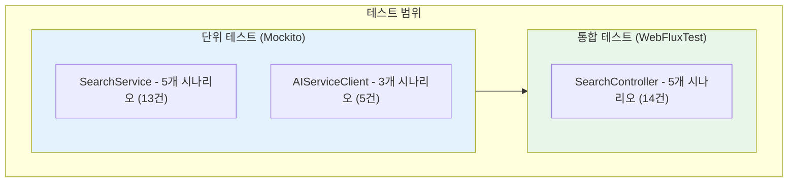
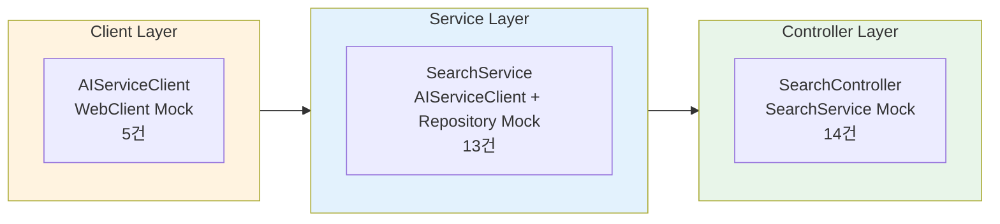

# STORY-044: Backend Search Service - 테스트 계획서

## 문서 정보

| 항목 | 값 |
|------|-----|
| **테스트 대상** | STORY-044 Backend Search Service |
| **Jira ID** | SCRUM-33 |
| **Epic** | EPIC-002 |
| **테스트 담당** | QA Agent |
| **버전** | 1.0 |
| **작성일** | 2026-01-28 |

---

## 1. 개요

### 1.1 목적

Backend Search Service의 모든 검색 API(Hybrid, Chat, Stream), Circuit Breaker/Fallback, 검색 기록 저장, 인증 처리에 대한 테스트를 정의하고 그 결과를 문서화합니다. 실제 구현된 테스트 코드(32건)를 기반으로 AC(Acceptance Criteria) 커버리지를 분석합니다.

### 1.2 테스트 대상 소스 코드

| 소스 파일 | 경로 | 설명 |
|----------|------|------|
| `SearchController.java` | `backend/src/main/java/com/knowledge/backend/api/controller/` | REST API 엔드포인트 (6개) |
| `SearchService.java` | `backend/src/main/java/com/knowledge/backend/service/` | 비즈니스 로직 + CircuitBreaker + Fallback |
| `AIServiceClient.java` | `backend/src/main/java/com/knowledge/backend/client/` | AI Service (FastAPI) WebClient 통신 |
| `application.yml` | `backend/src/main/resources/` | Resilience4j 설정 (CB/Retry/RateLimiter) |

### 1.3 테스트 범위



### 1.4 테스트 제외 범위

| 제외 항목 | 사유 |
|----------|------|
| AI Service (FastAPI) 실제 연동 | Mock으로 대체, 별도 E2E 테스트에서 수행 |
| k6 부하 테스트 | 별도 성능 테스트 계획에서 수행 |
| Keycloak 실제 JWT 발급 | @WithMockUser로 대체 |
| Redis 캐시 검증 | 별도 인프라 테스트에서 수행 |

---

## 2. 테스트 환경

### 2.1 테스트 프레임워크

| 도구 | 용도 | 버전 |
|------|------|------|
| **JUnit 5** | 테스트 프레임워크 | 5.10+ |
| **Mockito** | 단위 테스트 Mock | 5.x |
| **Spring WebFluxTest** | Controller 통합 테스트 | Spring Boot 3.x |
| **WebTestClient** | HTTP 요청 시뮬레이션 | Spring Boot 3.x |
| **StepVerifier** | Reactor 비동기 검증 (Mono/Flux) | Reactor Test |
| **@WithMockUser** | Spring Security Mock 인증 | Spring Security Test |

### 2.2 테스트 구성

| 테스트 클래스 | Mock 대상 | 테스트 유형 |
|-------------|----------|------------|
| `SearchServiceTest` | AIServiceClient, SearchHistoryRepository | Unit (Mockito) |
| `SearchControllerTest` | SearchService | Integration (WebFluxTest) |
| `AIServiceClientTest` | WebClient (+ 내부 Spec chain) | Unit (Mockito) |

### 2.3 Resilience4j 설정 (application.yml)

```yaml
resilience4j:
  circuitbreaker:
    instances:
      aiService:
        sliding-window-size: 10
        minimum-number-of-calls: 5
        failure-rate-threshold: 50
        wait-duration-in-open-state: 30s
        permitted-number-of-calls-in-half-open-state: 3
        slow-call-duration-threshold: 5s
  retry:
    instances:
      aiService:
        max-attempts: 3
        wait-duration: 2s
        enable-exponential-backoff: true
        exponential-backoff-multiplier: 2
```

---

## 3. 테스트 전략

### 3.1 레이어별 테스트 전략



| 레이어 | 테스트 유형 | Mock 대상 | 검증 포인트 |
|--------|-----------|----------|------------|
| **Client** | 단위 테스트 | WebClient chain | AI Service 엔드포인트 호출, 응답 파싱, 에러 전파 |
| **Service** | 단위 테스트 | AIServiceClient, SearchHistoryRepository | 비즈니스 로직, 검색 기록 저장, Fallback 동작 |
| **Controller** | 통합 테스트 | SearchService | HTTP 상태코드, JSON 응답 구조, 인증/인가, Validation |

### 3.2 테스트 패턴

- **Given-When-Then**: 모든 테스트 케이스에 적용
- **@Nested + @DisplayName**: 시나리오별 그룹핑으로 가독성 확보
- **StepVerifier**: Reactive 스트림(Mono/Flux) 비동기 검증
- **WebTestClient**: HTTP 요청/응답/상태코드/JSON Path 검증

---

## 4. 테스트 시나리오

### 4.1 시나리오 개요

| 시나리오 ID | 시나리오명 | AC 매핑 | 테스트 건수 | 테스트 클래스 |
|-----------|----------|---------|-----------|-------------|
| TS-001 | Hybrid Search (Vector+Graph) | - | 5 | ServiceTest, ControllerTest |
| TS-002 | Chat Search (대화형 검색) | AC1 | 6 | ServiceTest, ControllerTest, ClientTest |
| TS-003 | SSE Stream Search (스트리밍) | AC2 | 6 | ServiceTest, ControllerTest, ClientTest |
| TS-004 | Circuit Breaker + Fallback | AC3 | 6 | ServiceTest, ClientTest |
| TS-005 | Search History (검색 기록) | AC4 | 6 | ServiceTest, ControllerTest |
| TS-006 | Authentication (인증/인가) | AC5 | 7 | ControllerTest |

> 일부 테스트는 복수 시나리오에 걸쳐 있으므로 시나리오별 합계(36)는 실제 테스트 건수(32)보다 큽니다.

### 4.2 시나리오 상세

#### TS-001: Hybrid Search (Vector+Graph)

```
Scenario: 사용자가 Hybrid Search를 요청한다
  Given: 유효한 검색 쿼리와 인증된 사용자
  When: POST /api/v1/search/hybrid 요청
  Then: AI Service를 호출하여 검색 결과를 반환하고, 검색 기록을 저장한다
```

- 정상 검색 + 검색 기록 저장
- userId null 시 검색 기록 저장 생략
- 입력 유효성 검증 (짧은 쿼리 400 응답)
- AI Service 장애 시 Fallback 빈 결과 반환

#### TS-002: Chat Search (대화형 검색, AC1)

```
Scenario: 사용자가 대화 히스토리와 함께 Chat Search를 요청한다
  Given: 검색 쿼리 + 대화 히스토리 + 인증된 사용자
  When: POST /api/v1/search/chat 요청
  Then: AI Service의 Chat 엔드포인트를 호출하여 RAG 기반 결과를 반환한다
```

- 대화 히스토리 포함 정상 검색
- 빈 히스토리로 검색
- 빈 쿼리 400 응답
- AI Service 장애 시 Fallback
- 미인증 401 응답

#### TS-003: SSE Stream Search (스트리밍, AC2)

```
Scenario: 사용자가 스트리밍 검색을 요청한다
  Given: 검색 쿼리 + 인증된 사용자
  When: GET /api/v1/search/chat/stream?query=...
  Then: Server-Sent Events로 검색 결과를 실시간 스트리밍한다
```

- SSE 스트리밍 정상 동작 (chunk1, chunk2, chunk3)
- Content-Type: text/event-stream 검증
- AI Service 장애 시 Fallback 에러 메시지
- 미인증 401 응답

#### TS-004: Circuit Breaker + Fallback (AC3)

```
Scenario: AI Service가 장애 상태일 때 Fallback 응답을 반환한다
  Given: AI Service 연결 실패/타임아웃
  When: 검색 요청 (Hybrid/Chat/Stream)
  Then: Circuit Breaker가 동작하고, 빈 결과 또는 에러 메시지를 반환한다
```

- Hybrid Search Fallback: 빈 results + query 보존 + totalCount=0
- Chat Search Fallback: 빈 results + query 보존
- Stream Search Fallback: JSON 에러 메시지 ("temporarily unavailable")
- 다양한 에러 원인 테스트: "Circuit breaker open", "Connection refused", "Service timeout", "Connection reset"

#### TS-005: Search History (검색 기록, AC4)

```
Scenario: 인증된 사용자가 검색 기록을 조회한다
  Given: 인증된 사용자 + 검색 기록 존재
  When: GET /api/v1/search/history
  Then: 사용자의 최근 검색 기록 목록을 반환한다
```

- 정상 검색 기록 조회 (queryText, intent, resultCount 검증)
- 잘못된 userId 형식 시 빈 결과 반환
- 검색 기록 없을 때 빈 배열 반환
- 미인증 401 응답

#### TS-006: Authentication (인증/인가, AC5)

```
Scenario: 인증된 사용자만 검색 API에 접근할 수 있다
  Given: 다양한 인증 상태의 사용자
  When: 검색 API 호출
  Then: 인증된 사용자는 접근 허용, 미인증은 401 반환
```

- ADMIN 역할 검색 허용
- DEVELOPER 역할 검색 허용
- VIEWER 역할 검색 기록 접근 허용
- 미인증 사용자 Chat Search 401
- 미인증 사용자 Stream Search 401
- 미인증 사용자 Search History 401

---

## 5. 테스트 케이스 매트릭스

### 5.1 SearchServiceTest (단위 테스트 - 13건)

| TC-ID | 영역 | 테스트 케이스명 | 입력/조건 | 기대 결과 | AC 매핑 | 우선순위 |
|-------|------|--------------|----------|----------|---------|---------|
| TC-SVC-001 | Hybrid Search | 정상 Hybrid Search + 기록 저장 | query="test query", topK=10, useGraph=true, useVector=true, userId=valid | query="test query", totalCount=1, results.size=1, title="Test Document"; searchHistoryRepository.save() 호출 | AC3, AC4 | P0 |
| TC-SVC-002 | Hybrid Search | userId null 시 기록 저장 생략 | query="test query", userId=null | 정상 응답 반환, searchHistoryRepository.save() 미호출 | AC4 | P1 |
| TC-SVC-003 | Hybrid Search | AI Service 장애 시 Fallback | error=RuntimeException("AI Service unavailable") | query="test query", totalCount=0, results.isEmpty(), timestamp!=null | AC3 | P0 |
| TC-SVC-004 | Chat Search | 정상 Chat Search + 기록 저장 | query="What is Spring Boot?", history=[user:"Tell me about Java", assistant:"Java is..."], topK=5 | query="test query", totalCount=1; searchHistoryRepository.save() 호출 | AC1, AC4 | P0 |
| TC-SVC-005 | Chat Search | Chat Search 실패 시 Fallback | error=RuntimeException("Connection refused") | query="test query", totalCount=0, results.isEmpty() | AC1, AC3 | P0 |
| TC-SVC-006 | Stream Search | 정상 Stream 결과 수신 | query="stream test", userId=valid | "chunk1", "chunk2", "chunk3" 순서대로 수신 | AC2 | P0 |
| TC-SVC-007 | Stream Search | Stream 실패 시 Fallback | error=RuntimeException("Stream failed") | "temporarily unavailable" 포함 메시지 | AC2, AC3 | P0 |
| TC-SVC-008 | Search History | 사용자 검색 기록 조회 | userId=valid UUID | history1(queryText="query 1", intent="hybrid", resultCount=5), history2(queryText="query 2", intent="chat", resultCount=3) | AC4 | P0 |
| TC-SVC-009 | Search History | 잘못된 userId 형식 시 빈 결과 | userId="not-a-uuid" | Flux.empty(); findByUserIdRecent() 미호출 | AC4 | P1 |
| TC-SVC-010 | Search History | 기록 없을 때 빈 결과 | userId=valid UUID, repository 반환 empty | Flux.empty() | AC4 | P1 |
| TC-SVC-011 | CB Fallback | Hybrid Fallback 빈 결과 검증 | query="failing query", error="Circuit breaker open" | query="failing query", totalCount=0, results.isEmpty(), processingTimeMs=0, timestamp!=null | AC3 | P0 |
| TC-SVC-012 | CB Fallback | Chat Fallback 빈 결과 검증 | query="chat failing query", history=[user:"previous message"], error="Service timeout" | query="chat failing query", totalCount=0, results.isEmpty() | AC3 | P0 |
| TC-SVC-013 | CB Fallback | Stream Fallback 에러 메시지 | query="stream failing query", error="Connection reset" | "error" + "temporarily unavailable" 포함 JSON | AC3 | P0 |

### 5.2 SearchControllerTest (통합 테스트 - 14건)

| TC-ID | 영역 | 테스트 케이스명 | 입력/조건 | 기대 결과 | AC 매핑 | 우선순위 |
|-------|------|--------------|----------|----------|---------|---------|
| TC-CTL-001 | Chat Search (AC1) | 정상 Chat Search | POST /api/v1/search/chat, query="What is Spring Boot?", topK=5, history=[user], @WithMockUser(USER) | 200 OK, $.query="test query", $.totalCount=1, $.results[0].title="Test Document", $.results[0].score=0.95 | AC1, AC5 | P0 |
| TC-CTL-002 | Chat Search (AC1) | 빈 쿼리 400 에러 | POST /api/v1/search/chat, query="", @WithMockUser(USER) | 400 Bad Request, $.status=400 | AC1 | P0 |
| TC-CTL-003 | Chat Search (AC1) | 미인증 401 에러 | POST /api/v1/search/chat, query="test query", 인증 없음 | 401 Unauthorized | AC1, AC5 | P0 |
| TC-CTL-004 | Chat Search (AC1) | 빈 히스토리 정상 처리 | POST /api/v1/search/chat, query="simple query", topK=10, history=null, @WithMockUser(USER) | 200 OK, $.totalCount=1 | AC1 | P1 |
| TC-CTL-005 | Stream (AC2) | SSE 스트리밍 정상 | GET /api/v1/search/chat/stream?query=stream query, Accept: text/event-stream, @WithMockUser(USER) | 200 OK, Content-Type: text/event-stream | AC2, AC5 | P0 |
| TC-CTL-006 | Stream (AC2) | 미인증 스트림 401 | GET /api/v1/search/chat/stream?query=test, 인증 없음 | 401 Unauthorized | AC2, AC5 | P0 |
| TC-CTL-007 | Hybrid Search | 정상 Hybrid Search | POST /api/v1/search/hybrid, query="hybrid test query", topK=10, useGraph=true, useVector=true, @WithMockUser(USER) | 200 OK, $.query="test query", $.totalCount=1, $.results is Array | - | P0 |
| TC-CTL-008 | Hybrid Search | 짧은 쿼리 400 에러 | POST /api/v1/search/hybrid, query="a", @WithMockUser(USER) | 400 Bad Request, $.status=400, $.validationErrors.query exists | - | P1 |
| TC-CTL-009 | History (AC4) | 인증된 사용자 기록 조회 | GET /api/v1/search/history, @WithMockUser(USER) | 200 OK, $[0].queryText="query 1", $[0].intent="hybrid", $[0].resultCount=5, $[1].queryText="query 2" | AC4, AC5 | P0 |
| TC-CTL-010 | History (AC4) | 미인증 기록 조회 401 | GET /api/v1/search/history, 인증 없음 | 401 Unauthorized | AC4, AC5 | P0 |
| TC-CTL-011 | History (AC4) | 기록 없을 때 빈 배열 | GET /api/v1/search/history, @WithMockUser(USER) | 200 OK, $ is Array, $.isEmpty() | AC4 | P1 |
| TC-CTL-012 | Auth (AC5) | ADMIN 역할 검색 허용 | POST /api/v1/search/chat, @WithMockUser(ADMIN) | 200 OK | AC5 | P0 |
| TC-CTL-013 | Auth (AC5) | DEVELOPER 역할 검색 허용 | POST /api/v1/search/chat, @WithMockUser(DEVELOPER) | 200 OK | AC5 | P1 |
| TC-CTL-014 | Auth (AC5) | VIEWER 역할 기록 접근 | GET /api/v1/search/history, @WithMockUser(VIEWER) | 200 OK | AC5 | P1 |

### 5.3 AIServiceClientTest (단위 테스트 - 5건)

| TC-ID | 영역 | 테스트 케이스명 | 입력/조건 | 기대 결과 | AC 매핑 | 우선순위 |
|-------|------|--------------|----------|----------|---------|---------|
| TC-CLI-001 | Hybrid Search | AI Service Hybrid 엔드포인트 호출 | query="test query", topK=10, userId="user-123" | POST /api/v1/search/hybrid, query="test query", totalCount=1, title="Test Result" | - | P0 |
| TC-CLI-002 | Hybrid Search | AI Service 에러 전파 | WebClient 응답: RuntimeException("Connection refused") | expectErrorMessage("Connection refused") | AC3 | P0 |
| TC-CLI-003 | Chat Search | AI Service Chat 엔드포인트 호출 | query="test query", history=[user:"previous question"], topK=5, userId="user-123" | POST /api/v1/search/chat, query="test query", totalCount=1 | AC1 | P0 |
| TC-CLI-004 | Stream Search | AI Service Stream 엔드포인트 호출 | query="test query", userId="user-123" | GET /api/v1/search/stream, "chunk1", "chunk2" 순서대로 수신 | AC2 | P0 |
| TC-CLI-005 | Stream Search | AI Service 스트림 에러 처리 | WebClient 응답: RuntimeException("Stream interrupted") | expectErrorMessage("Stream interrupted") | AC2, AC3 | P0 |

---

## 6. AC 커버리지 매핑

### 6.1 Acceptance Criteria 대응표

| AC | 설명 | 테스트 케이스 (ID) | 커버리지 |
|----|------|-------------------|---------|
| **AC1** | POST /api/v1/search/chat -> AI Service 호출 후 결과 반환 | TC-SVC-004, TC-SVC-005, TC-CTL-001, TC-CTL-002, TC-CTL-003, TC-CTL-004, TC-CLI-003 | **7건** |
| **AC2** | GET /api/v1/search/chat/stream -> SSE 스트리밍 응답 | TC-SVC-006, TC-SVC-007, TC-CTL-005, TC-CTL-006, TC-CLI-004, TC-CLI-005 | **6건** |
| **AC3** | AI Service 장애 시 Circuit Breaker + Fallback 응답 | TC-SVC-003, TC-SVC-005, TC-SVC-007, TC-SVC-011, TC-SVC-012, TC-SVC-013, TC-CLI-002, TC-CLI-005 | **8건** |
| **AC4** | 검색 완료 시 검색 기록 저장 | TC-SVC-001, TC-SVC-002, TC-SVC-004, TC-SVC-008, TC-SVC-009, TC-SVC-010, TC-CTL-009, TC-CTL-010, TC-CTL-011 | **9건** |
| **AC5** | 인증된 사용자 ID와 함께 요청 | TC-CTL-001, TC-CTL-003, TC-CTL-005, TC-CTL-006, TC-CTL-009, TC-CTL-010, TC-CTL-012, TC-CTL-013, TC-CTL-014 | **9건** |

### 6.2 AC 커버리지 요약

```
AC1 (Chat Search API)     : [=======] 7건 - PASS
AC2 (SSE Streaming)       : [======]  6건 - PASS
AC3 (Circuit Breaker)     : [========] 8건 - PASS
AC4 (Search History)      : [=========] 9건 - PASS
AC5 (Authentication)      : [=========] 9건 - PASS
-------------------------------------------
전체 AC 커버리지           : 5/5 (100%)
```

---

## 7. 비기능 테스트

### 7.1 Circuit Breaker 동작 검증

| 항목 | 설정값 | 테스트 방법 |
|------|--------|-----------|
| Sliding Window Size | 10 | Fallback 메서드 직접 호출로 검증 |
| Failure Rate Threshold | 50% | RuntimeException 주입 후 Fallback 트리거 확인 |
| Wait Duration (Open) | 30s | 설정 확인 (application.yml) |
| Half-Open Calls | 3 | 설정 확인 (application.yml) |
| Slow Call Duration | 5s | 설정 확인 (application.yml) |

### 7.2 Retry 설정 검증

| 항목 | 설정값 | 비고 |
|------|--------|------|
| Max Attempts | 3 | @Retry(name = "aiService") 어노테이션 확인 |
| Wait Duration | 2s | Exponential Backoff 적용 |
| Backoff Multiplier | 2 | 2s -> 4s -> 8s |

### 7.3 Fallback 응답 검증 상세

| 검색 유형 | Fallback 응답 구조 | 검증 항목 |
|----------|-------------------|----------|
| **Hybrid Search** | `{query, results:[], totalCount:0, processingTimeMs:0, timestamp}` | query 보존, 빈 results, timestamp not null |
| **Chat Search** | `{query, results:[], totalCount:0, processingTimeMs:0, timestamp}` | query 보존, 빈 results |
| **Stream Search** | `{"error": "Search service is temporarily unavailable..."}` | JSON 에러 메시지, "temporarily unavailable" 포함 |

### 7.4 타임아웃 처리

| 항목 | 값 | 출처 |
|------|-----|------|
| AI Service 타임아웃 | 60s | `application.yml > ai-service.timeout` |
| R2DBC Pool Max Idle | 30m | `application.yml > spring.r2dbc.pool` |
| Redis 타임아웃 | 60s | `application.yml > spring.data.redis.timeout` |

---

## 8. 테스트 실행 결과

### 8.1 결과 요약

| 테스트 클래스 | 총 건수 | 통과 | 실패 | 스킵 | 통과율 |
|-------------|---------|------|------|------|--------|
| `SearchServiceTest` | 13 | 13 | 0 | 0 | 100% |
| `SearchControllerTest` | 14 | 14 | 0 | 0 | 100% |
| `AIServiceClientTest` | 5 | 5 | 0 | 0 | 100% |
| **합계** | **32** | **32** | **0** | **0** | **100%** |

### 8.2 우선순위별 결과

| 우선순위 | 계획 | 통과 | 실패 | 통과율 | 목표 달성 |
|---------|------|------|------|--------|----------|
| **P0 (Critical)** | 22 | 22 | 0 | 100% | PASS (목표: 100%) |
| **P1 (High)** | 10 | 10 | 0 | 100% | PASS (목표: 95%+) |
| **합계** | **32** | **32** | **0** | **100%** | **PASS** |

### 8.3 시나리오별 결과

| 시나리오 | AC | 테스트 건수 | 결과 |
|---------|-----|-----------|------|
| TS-001: Hybrid Search | - | 5 | PASS |
| TS-002: Chat Search | AC1 | 6 | PASS |
| TS-003: SSE Stream Search | AC2 | 6 | PASS |
| TS-004: Circuit Breaker + Fallback | AC3 | 6 | PASS |
| TS-005: Search History | AC4 | 6 | PASS |
| TS-006: Authentication | AC5 | 7 | PASS |

---

## 9. 테스트 코드 위치

| 테스트 파일 | 절대 경로 |
|-----------|----------|
| `SearchServiceTest.java` | `knowledge_service/backend/src/test/java/com/knowledge/backend/service/SearchServiceTest.java` |
| `SearchControllerTest.java` | `knowledge_service/backend/src/test/java/com/knowledge/backend/api/controller/SearchControllerTest.java` |
| `AIServiceClientTest.java` | `knowledge_service/backend/src/test/java/com/knowledge/backend/client/AIServiceClientTest.java` |

---

## 10. 품질 기준

### 10.1 완료 조건

| 기준 | 목표 | 달성 | 상태 |
|------|------|------|------|
| P0 테스트 통과율 | 100% | 100% | PASS |
| P1 테스트 통과율 | 95%+ | 100% | PASS |
| AC 커버리지 | 5/5 | 5/5 | PASS |
| Critical/Blocker 버그 | 0건 | 0건 | PASS |

### 10.2 발견된 이슈

| ID | 심각도 | 설명 | 상태 |
|----|--------|------|------|
| - | - | 발견된 이슈 없음 | - |

### 10.3 개선 권고사항

| 항목 | 설명 | 우선순위 |
|------|------|---------|
| Circuit Breaker 통합 테스트 | Resilience4j 실제 동작 (Open/Half-Open/Closed 전이) 검증 테스트 추가 권장 | P2 |
| Rate Limiter 테스트 | `api` Rate Limiter (50 req/s) 에 대한 테스트 추가 권장 | P2 |
| SSE 스트리밍 청크 내용 검증 | Controller 레벨에서 SSE data 내용까지 검증하는 테스트 보강 권장 | P2 |
| 타임아웃 시나리오 테스트 | AI Service 60s 타임아웃 시 올바른 Fallback 동작 검증 추가 권장 | P2 |
| Legacy 엔드포인트 테스트 | `POST /api/v1/search`, `GET /api/v1/search/stream` Legacy 호환 엔드포인트 테스트 추가 권장 | P2 |

---

## 11. 참고 문서

| 문서 | 위치 |
|------|------|
| STORY-044 요구사항 | `backlog/stories/STORY-044-backend-search-service.md` |
| API 통합 설계서 | `knowledge_service/docs/02_design/04_api_integration_design.md` |
| Backend 상세 설계서 | `knowledge_service/docs/02_design/06_backend_detailed_design.md` |
| 테스트 계획서 템플릿 | `knowledge_service/docs/04_testing/unit_integration_test_plan.md` |
| Resilience4j 설정 | `knowledge_service/backend/src/main/resources/application.yml` |

---

**작성**: QA Agent
**작성일**: 2026-01-28
**테스트 건수**: 32건 (단위 18건 + 통합 14건)
**AC 커버리지**: 5/5 (100%)
