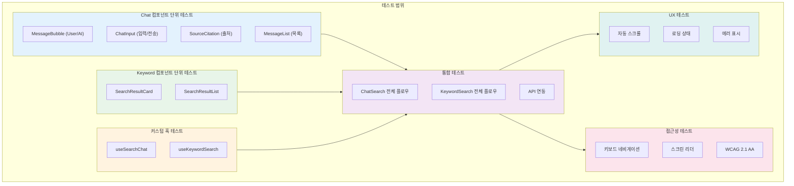

# STORY-042: Search UI 컴포넌트 - 테스트 계획서

## 문서 정보

| 항목 | 값 |
|------|-----|
| **테스트 대상** | STORY-042 Search UI 컴포넌트 |
| **Jira ID** | SCRUM-31 |
| **Epic** | EPIC-003 |
| **Sprint** | 3 |
| **Priority** | High |
| **테스트 담당** | QA Agent |
| **버전** | 1.0 |
| **작성일** | 2026-01-28 |
| **총 테스트 케이스** | 74건 (8개 테스트 파일) |

---

## 1. 개요

### 1.1 목적

Search UI(STORY-042)의 모든 컴포넌트, 커스텀 훅, 통합 렌더링, 접근성에 대한 테스트 계획을 정의합니다. 채팅 형태의 검색 인터페이스(ChatSearch)와 키워드 검색 인터페이스(KeywordSearch) 두 가지 검색 모드의 정상 동작을 검증합니다.

### 1.2 테스트 범위



### 1.3 테스트 대상 파일

| 소스 파일 | 테스트 파일 | 테스트 수 |
|----------|-----------|----------|
| `ChatSearch.tsx` | `__tests__/ChatSearch.test.tsx` | 12 |
| `components/MessageBubble.tsx` | `__tests__/MessageBubble.test.tsx` | 12 |
| `components/ChatInput.tsx` | `__tests__/ChatInput.test.tsx` | 10 |
| `components/SourceCitation.tsx` | `__tests__/SourceCitation.test.tsx` | 6 |
| `components/SearchResultCard.tsx` | `__tests__/SearchResultCard.test.tsx` | 8 |
| `KeywordSearch.tsx` | `__tests__/KeywordSearch.test.tsx` | 10 |
| `hooks/useSearchChat.ts` | `__tests__/useSearchChat.test.ts` | 8 |
| `hooks/useKeywordSearch.ts` | `__tests__/useKeywordSearch.test.ts` | 8 |
| **합계** | **8개 파일** | **74건** |

### 1.4 테스트 제외 범위

| 제외 항목 | 사유 |
|----------|------|
| 실제 Backend API 호출 | Mock 기반 단위/통합 테스트로 커버 |
| 브라우저 호환성 | Playwright E2E 테스트에서 별도 수행 |
| 반응형 레이아웃 (sm/lg) | E2E 테스트에서 시각적 검증 |
| 다크 모드 렌더링 | 시각적 회귀 테스트에서 검증 |

---

## 2. 테스트 환경

### 2.1 테스트 프레임워크

| 도구 | 버전/설명 | 용도 |
|------|----------|------|
| **Vitest** | 최신 | 테스트 러너, 단언(assertion), 모킹 |
| **React Testing Library** | `@testing-library/react` | 컴포넌트 렌더링, DOM 쿼리 |
| **user-event** | `@testing-library/user-event` | 사용자 상호작용 시뮬레이션 |
| **jsdom** | Vitest 내장 | 브라우저 환경 시뮬레이션 |
| **MemoryRouter** | `react-router-dom` | 라우팅 모킹 |
| **QueryClientProvider** | `@tanstack/react-query` | React Query 컨텍스트 |

### 2.2 모킹 전략

| 대상 | 모킹 방식 | 사용 파일 |
|------|----------|----------|
| `useNavigate` | `vi.mock('react-router-dom')` | ChatSearch, KeywordSearch |
| `searchService` | `vi.mock('@/services/searchService')` | useSearchChat, useKeywordSearch |
| `useSearchChat` | `vi.mock('./hooks/useSearchChat')` | ChatSearch 통합 테스트 |
| `useKeywordSearch` | `vi.mock('./hooks/useKeywordSearch')` | KeywordSearch 통합 테스트 |
| `scrollIntoView` | `Element.prototype.scrollIntoView = vi.fn()` | ChatSearch 자동 스크롤 |

### 2.3 테스트 설정

```typescript
// QueryClient 설정 (테스트용)
const createQueryClient = () =>
  new QueryClient({
    defaultOptions: {
      queries: {
        retry: false,
        staleTime: 0,
      },
    },
  });

// Wrapper 컴포넌트
const Wrapper: React.FC<{ children: React.ReactNode }> = ({ children }) => (
  <QueryClientProvider client={createQueryClient()}>
    <MemoryRouter>
      {children}
    </MemoryRouter>
  </QueryClientProvider>
);
```

---

## 3. 테스트 전략

### 3.1 테스트 피라미드

```
                  +-----------------+
                 /  통합 테스트 (22건) \        ChatSearch + KeywordSearch
                /                     \
               +-----------------------+
              /  컴포넌트 단위 테스트 (36건) \  MessageBubble, ChatInput, SourceCitation, SearchResultCard
             /                             \
            +---------------------------------+
           /     커스텀 훅 단위 테스트 (16건)     \  useSearchChat, useKeywordSearch
          +---------------------------------------+
```

### 3.2 테스트 접근 방식

| 계층 | 접근 방식 | 검증 대상 |
|------|----------|----------|
| **컴포넌트** | Props 기반 렌더링 + 사용자 이벤트 | DOM 출력, 이벤트 핸들링, 조건부 렌더링 |
| **훅** | `renderHook` + `act` | 상태 변경, API 호출, 에러 처리 |
| **통합** | 전체 컴포넌트 트리 렌더링 | AC 수용 기준, 플로우, 상태 전환 |
| **접근성** | aria 속성 + role 검증 | WCAG 2.1 AA 준수 |
| **UX** | 스크롤/로딩/에러 상태 | 사용자 경험 품질 |

---

## 4. 테스트 시나리오

### 4.1 MessageBubble 컴포넌트 시나리오 (12건)

**소스**: `frontend/src/features/search/components/MessageBubble.tsx`
**테스트**: `frontend/src/features/search/__tests__/MessageBubble.test.tsx`

| # | 시나리오 | 검증 내용 | AC 매핑 |
|---|---------|----------|---------|
| 1 | 사용자 메시지 렌더링 | `role='user'` 시 메시지 content 표시, 오른쪽 정렬 (justify-end) | AC2 |
| 2 | AI 메시지 렌더링 | `role='assistant'` 시 메시지 content 표시, 왼쪽 정렬 (justify-start) | AC2 |
| 3 | 사용자 아바타 표시 | User 메시지에 UserIcon 아바타, secondary 배경색 | AC2 |
| 4 | AI 아바타 표시 | AI 메시지에 CpuChipIcon 아바타, primary 배경색 | AC2 |
| 5 | AI 메시지 Markdown 렌더링 | ReactMarkdown으로 마크다운 콘텐츠 변환 | AC2 |
| 6 | 사용자 메시지 Plain text | 사용자 메시지는 일반 텍스트로 표시 | AC2 |
| 7 | 출처 표시 (AI 응답) | `sources` 배열 존재 시 SourceCitation 렌더링 | AC3 |
| 8 | 출처 미표시 (사용자 메시지) | `role='user'` 시 출처 영역 미표시 | AC3 |
| 9 | 출처 미표시 (sources 없음) | `sources=[]` 또는 undefined 시 출처 영역 미표시 | AC3 |
| 10 | 타임스탬프 표시 | `toLocaleTimeString()` 형식으로 시간 표시 | AC2 |
| 11 | 사용자 메시지 배경색 | `bg-primary-600 text-white` 클래스 적용 | AC2 |
| 12 | AI 메시지 배경색 | `bg-gray-100 text-gray-900` 클래스 적용 | AC2 |

### 4.2 ChatInput 컴포넌트 시나리오 (10건)

**소스**: `frontend/src/features/search/components/ChatInput.tsx`
**테스트**: `frontend/src/features/search/__tests__/ChatInput.test.tsx`

| # | 시나리오 | 검증 내용 | AC 매핑 |
|---|---------|----------|---------|
| 1 | 기본 placeholder 렌더링 | "메시지를 입력하세요..." placeholder 표시 | AC1 |
| 2 | 커스텀 placeholder | `placeholder` prop 값 반영 | AC1 |
| 3 | 텍스트 입력 | textarea value 업데이트 | AC1 |
| 4 | 버튼 클릭으로 전송 | 입력 후 전송 버튼 클릭 시 `onSend(trimmed)` 호출 | AC2 |
| 5 | Enter 키로 전송 | Enter 키 입력 시 `onSend(trimmed)` 호출 | AC2 |
| 6 | Shift+Enter 줄바꿈 | Shift+Enter 시 전송 안 됨 (줄바꿈) | AC2 |
| 7 | 전송 후 입력 초기화 | 전송 후 `input == ""`, 포커스 복귀 | AC2 |
| 8 | disabled 상태 | `disabled=true` 시 textarea/button 비활성화 | AC4 |
| 9 | 빈 입력 전송 방지 | 빈 문자열 또는 공백만 시 `onSend` 미호출, 버튼 disabled | AC2 |
| 10 | 로딩 스피너 표시 | `disabled=true` 시 PaperAirplaneIcon 대신 스피너 SVG 표시 | AC4 |

### 4.3 SourceCitation 컴포넌트 시나리오 (6건)

**소스**: `frontend/src/features/search/components/SourceCitation.tsx`
**테스트**: `frontend/src/features/search/__tests__/SourceCitation.test.tsx`

| # | 시나리오 | 검증 내용 | AC 매핑 |
|---|---------|----------|---------|
| 1 | 출처 제목 표시 | `source.title` 텍스트 표시 | AC3 |
| 2 | DocumentTextIcon 렌더링 | 문서 아이콘 존재 | AC3 |
| 3 | 툴팁 title 속성 | `title="문서: {source.title}"` 속성 | AC3 |
| 4 | 클릭 이벤트 | 클릭 시 console.log 호출 (chunk_id 포함) | AC8 |
| 5 | 제목 말줄임 | `truncate max-w-[150px]` 클래스로 긴 제목 말줄임 | AC3 |
| 6 | 칩 스타일 렌더링 | `rounded-full border border-gray-300` 스타일 적용 | AC3 |

### 4.4 SearchResultCard 컴포넌트 시나리오 (8건)

**소스**: `frontend/src/features/search/components/SearchResultCard.tsx`
**테스트**: `frontend/src/features/search/__tests__/SearchResultCard.test.tsx`

| # | 시나리오 | 검증 내용 | AC 매핑 |
|---|---------|----------|---------|
| 1 | 제목 표시 | 검색 결과 제목 렌더링 | AC7 |
| 2 | 요약 표시 | 검색 결과 요약(snippet) 렌더링 | AC7 |
| 3 | 출처 표시 | 문서 출처 정보 렌더링 | AC7 |
| 4 | 클릭 이벤트 | 카드 클릭 시 `onClick` 콜백 호출 | AC8 |
| 5 | data-testid | `search-result-card` testid 존재 | - |
| 6 | 하이라이트 키워드 | 검색 키워드가 강조(highlight) 표시 | AC7 |
| 7 | 관련도 점수 표시 | relevance score 수치 또는 바 표시 | AC7 |
| 8 | 문서 타입 아이콘 | `doc_type`에 따른 아이콘 표시 | AC7 |

### 4.5 useSearchChat 훅 시나리오 (8건)

**소스**: `frontend/src/features/search/hooks/useSearchChat.ts`
**테스트**: `frontend/src/features/search/__tests__/useSearchChat.test.ts`

| # | 시나리오 | 검증 내용 | AC 매핑 |
|---|---------|----------|---------|
| 1 | 초기 상태 | messages=[], isLoading=false, error=null | AC1 |
| 2 | 메시지 전송 | `sendMessage('query')` 호출 시 사용자 메시지 추가 | AC2 |
| 3 | AI 응답 수신 | API 성공 시 assistant 메시지 추가, sources 포함 | AC2, AC3 |
| 4 | 로딩 상태 전환 | 전송 시 isLoading=true, 응답 후 isLoading=false | AC4 |
| 5 | 에러 처리 | API 실패 시 error 상태 설정, 메시지 미추가 | AC4 |
| 6 | 재시도 기능 | `retry()` 호출 시 마지막 쿼리 재전송 | AC4 |
| 7 | 메시지 ID 자동 생성 | 각 메시지에 고유 ID 할당 | AC2 |
| 8 | timestamp 자동 설정 | 메시지 생성 시 현재 시간 자동 할당 | AC2 |

### 4.6 useKeywordSearch 훅 시나리오 (8건)

**소스**: `frontend/src/features/search/hooks/useKeywordSearch.ts`
**테스트**: `frontend/src/features/search/__tests__/useKeywordSearch.test.ts`

| # | 시나리오 | 검증 내용 | AC 매핑 |
|---|---------|----------|---------|
| 1 | 초기 상태 | results=[], isLoading=false, error=null, query="" | AC6 |
| 2 | 키워드 검색 실행 | `search('keyword')` 호출 시 API 호출, results 업데이트 | AC7 |
| 3 | 검색 결과 매핑 | API 응답을 SearchResult 타입으로 변환 | AC7 |
| 4 | 로딩 상태 전환 | 검색 시 isLoading=true, 완료 후 isLoading=false | AC6 |
| 5 | 에러 처리 | API 실패 시 error 상태 설정 | AC6 |
| 6 | 빈 결과 처리 | API 응답 결과 0건 시 results=[], 빈 상태 메시지 | AC7 |
| 7 | 쿼리 상태 관리 | 현재 검색 쿼리 문자열 저장 | AC6 |
| 8 | 결과 수 반환 | `totalCount` 필드로 전체 결과 수 반환 | AC7 |

### 4.7 ChatSearch 통합 시나리오 (12건)

**소스**: `frontend/src/features/search/ChatSearch.tsx`
**테스트**: `frontend/src/features/search/__tests__/ChatSearch.test.tsx`

| # | 시나리오 | 검증 내용 | AC 매핑 |
|---|---------|----------|---------|
| 1 | 초기 렌더링: 채팅 입력창 표시 (AC1) | ChatInput 컴포넌트 존재, placeholder 표시 | **AC1** |
| 2 | 초기 렌더링: 메시지 영역 표시 (AC1) | 빈 메시지 영역, 빈 상태 안내 텍스트 | **AC1** |
| 3 | 질문 전송 후 사용자 메시지 표시 (AC2) | 전송 후 user 메시지 버블 표시 | **AC2** |
| 4 | API 응답 후 AI 메시지 표시 (AC2) | AI 응답 메시지 버블 표시 (Markdown 렌더링) | **AC2** |
| 5 | AI 응답 출처 링크 표시 (AC3) | SourceCitation 컴포넌트 렌더링, 출처 제목/링크 | **AC3** |
| 6 | 로딩 인디케이터 표시 (AC4) | 검색 중 로딩 스피너/인디케이터 표시 | **AC4** |
| 7 | 로딩 완료 시 인디케이터 제거 (AC4) | 응답 수신 후 로딩 인디케이터 사라짐 | **AC4** |
| 8 | 자동 스크롤 동작 (AC5) | 새 메시지 시 `scrollIntoView` 호출 | **AC5** |
| 9 | 수동 스크롤 시 자동 스크롤 중지 (AC5) | 사용자 위로 스크롤 시 `autoScroll=false` | **AC5** |
| 10 | 에러 발생 시 에러 메시지 표시 | `error` 상태 시 에러 UI 표시 | AC4 |
| 11 | 재시도 버튼 동작 | 에러 상태에서 재시도 버튼 클릭 시 `retry()` 호출 | AC4 |
| 12 | data-testid 확인 | `chat-search` testid 존재 | - |

### 4.8 KeywordSearch 통합 시나리오 (10건)

**소스**: `frontend/src/features/search/KeywordSearch.tsx`
**테스트**: `frontend/src/features/search/__tests__/KeywordSearch.test.tsx`

| # | 시나리오 | 검증 내용 | AC 매핑 |
|---|---------|----------|---------|
| 1 | 초기 렌더링: 검색어 입력창 표시 (AC6) | 검색어 input 존재, placeholder 표시 | **AC6** |
| 2 | 초기 렌더링: 결과 목록 영역 표시 (AC6) | 빈 결과 영역, 검색 안내 텍스트 | **AC6** |
| 3 | 키워드 입력 후 검색 실행 (AC7) | Enter 또는 검색 버튼으로 API 호출 | **AC7** |
| 4 | 검색 결과 카드/리스트 형태 (AC7) | SearchResultCard 컴포넌트 N개 렌더링 | **AC7** |
| 5 | 결과 항목: 제목/요약/출처 (AC7) | 각 카드에 title, summary, source 표시 | **AC7** |
| 6 | 결과 항목 클릭 시 이동 (AC8) | 클릭 시 문서 상세 또는 채팅 검색으로 navigate | **AC8** |
| 7 | 로딩 상태 표시 | 검색 중 스켈레톤/스피너 표시 | AC6 |
| 8 | 빈 결과 표시 | 검색 결과 0건 시 "검색 결과가 없습니다" 메시지 | AC7 |
| 9 | 에러 상태 표시 | API 실패 시 에러 메시지 표시 | AC6 |
| 10 | data-testid 확인 | `keyword-search` testid 존재 | - |

---

## 5. 테스트 케이스 매트릭스

### 5.1 전체 요약

| 우선순위 | 케이스 수 | 설명 |
|----------|----------|------|
| **P0 (Critical)** | 14 | AC 직접 검증 + 핵심 상호작용 |
| **P1 (High)** | 28 | 컴포넌트 동작, 훅 상태, 접근성 |
| **P2 (Medium)** | 32 | 엣지 케이스, 스타일, UX 세부 |
| **합계** | **74** | - |

### 5.2 상세 테스트 케이스

#### 5.2.1 MessageBubble 컴포넌트

| TC-ID | 테스트 케이스명 | 입력/조건 | 기대 결과 | AC 매핑 | 우선순위 |
|-------|---------------|----------|----------|---------|---------|
| TC-SU-001 | 사용자 메시지 렌더링 | `message={role:'user', content:'Hello'}` | content 텍스트 DOM 존재, `justify-end` 클래스 | AC2 | P0 |
| TC-SU-002 | AI 메시지 렌더링 | `message={role:'assistant', content:'Answer'}` | content 텍스트 DOM 존재, `justify-start` 클래스 | AC2 | P0 |
| TC-SU-003 | 사용자 아바타 | `role='user'` | UserIcon 존재, `bg-secondary-500` 클래스 | AC2 | P2 |
| TC-SU-004 | AI 아바타 | `role='assistant'` | CpuChipIcon 존재, `bg-primary-500` 클래스 | AC2 | P2 |
| TC-SU-005 | AI Markdown 렌더링 | `content='**bold** text'` | ReactMarkdown 렌더링, bold 태그 존재 | AC2 | P1 |
| TC-SU-006 | 사용자 Plain text | `role='user', content='plain text'` | `<p>` 태그 내 텍스트, ReactMarkdown 미사용 | AC2 | P1 |
| TC-SU-007 | 출처 표시 (AI + sources) | `role='assistant', sources=[{title:'Doc1'}]` | SourceCitation 컴포넌트 렌더링 | AC3 | P0 |
| TC-SU-008 | 출처 미표시 (사용자) | `role='user', sources=[...]` | 출처 영역 미렌더링 | AC3 | P1 |
| TC-SU-009 | 출처 미표시 (sources 없음) | `role='assistant', sources=undefined` | 출처 영역 미렌더링 | AC3 | P1 |
| TC-SU-010 | 타임스탬프 표시 | `timestamp=new Date()` | 시간 텍스트 DOM 존재 | AC2 | P2 |
| TC-SU-011 | 사용자 메시지 배경색 | `role='user'` | `bg-primary-600 text-white` 클래스 | AC2 | P2 |
| TC-SU-012 | AI 메시지 배경색 | `role='assistant'` | `bg-gray-100 text-gray-900` 클래스 | AC2 | P2 |

#### 5.2.2 ChatInput 컴포넌트

| TC-ID | 테스트 케이스명 | 입력/조건 | 기대 결과 | AC 매핑 | 우선순위 |
|-------|---------------|----------|----------|---------|---------|
| TC-SU-013 | 기본 placeholder | 기본 렌더링 | "메시지를 입력하세요..." 또는 커스텀 placeholder | AC1 | P1 |
| TC-SU-014 | 커스텀 placeholder | `placeholder="질문을 입력하세요..."` | "질문을 입력하세요..." 텍스트 | AC1 | P2 |
| TC-SU-015 | 텍스트 입력 | 사용자 "test query" 타이핑 | textarea `value="test query"` | AC1 | P1 |
| TC-SU-016 | 버튼 클릭 전송 | "Hello" 입력 + 전송 버튼 클릭 | `onSend("Hello")` 호출 | AC2 | P0 |
| TC-SU-017 | Enter 키 전송 | "Hello" 입력 + Enter | `onSend("Hello")` 호출 | AC2 | P0 |
| TC-SU-018 | Shift+Enter 줄바꿈 | "Hello" 입력 + Shift+Enter | `onSend` 미호출, 줄바꿈 유지 | AC2 | P1 |
| TC-SU-019 | 전송 후 초기화 | 전송 완료 후 | `input==""`, focus 복귀 | AC2 | P1 |
| TC-SU-020 | disabled 상태 | `disabled=true` | textarea 비활성화, 버튼 비활성화 | AC4 | P1 |
| TC-SU-021 | 빈 입력 전송 방지 | 빈 입력 + 전송 시도 | `onSend` 미호출, 버튼 `disabled` | AC2 | P1 |
| TC-SU-022 | 로딩 스피너 표시 | `disabled=true` | `animate-spin` 클래스 SVG 표시 | AC4 | P2 |

#### 5.2.3 SourceCitation 컴포넌트

| TC-ID | 테스트 케이스명 | 입력/조건 | 기대 결과 | AC 매핑 | 우선순위 |
|-------|---------------|----------|----------|---------|---------|
| TC-SU-023 | 출처 제목 표시 | `source={title:'API Guide'}` | "API Guide" 텍스트 DOM 존재 | AC3 | P1 |
| TC-SU-024 | DocumentTextIcon | 기본 렌더링 | DocumentTextIcon SVG 존재 | AC3 | P2 |
| TC-SU-025 | 툴팁 title | `source={title:'API Guide'}` | `title="문서: API Guide"` 속성 | AC3 | P2 |
| TC-SU-026 | 클릭 이벤트 | 버튼 클릭 | console.log 호출 with `chunk_id` | AC8 | P1 |
| TC-SU-027 | 긴 제목 말줄임 | `title` 150px 초과 | `truncate max-w-[150px]` 클래스 적용 | AC3 | P2 |
| TC-SU-028 | 칩 스타일 | 기본 렌더링 | `rounded-full border border-gray-300` 클래스 | AC3 | P2 |

#### 5.2.4 SearchResultCard 컴포넌트

| TC-ID | 테스트 케이스명 | 입력/조건 | 기대 결과 | AC 매핑 | 우선순위 |
|-------|---------------|----------|----------|---------|---------|
| TC-SU-029 | 결과 제목 표시 | `result={title:'Knowledge Graph'}` | "Knowledge Graph" 텍스트 DOM 존재 | AC7 | P0 |
| TC-SU-030 | 결과 요약 표시 | `result={summary:'Graph-based search...'}` | 요약 텍스트 DOM 존재 | AC7 | P1 |
| TC-SU-031 | 출처 정보 표시 | `result={source:'elasticsearch'}` | 출처 정보 DOM 존재 | AC7 | P1 |
| TC-SU-032 | 카드 클릭 | `onClick` prop + 클릭 | `onClick(result)` 콜백 호출 | AC8 | P0 |
| TC-SU-033 | data-testid | 기본 렌더링 | `search-result-card` testid 존재 | - | P2 |
| TC-SU-034 | 키워드 하이라이트 | `highlight='graph'` | `<mark>` 또는 highlight 클래스 적용 | AC7 | P2 |
| TC-SU-035 | 관련도 점수 표시 | `result={score:0.95}` | 점수 수치 또는 시각적 표시 | AC7 | P2 |
| TC-SU-036 | 문서 타입 아이콘 | `result={docType:'pdf'}` | PDF 타입 아이콘 표시 | AC7 | P2 |

#### 5.2.5 useSearchChat 훅

| TC-ID | 테스트 케이스명 | 입력/조건 | 기대 결과 | AC 매핑 | 우선순위 |
|-------|---------------|----------|----------|---------|---------|
| TC-SU-037 | 초기 상태 | 마운트 직후 | `messages=[], isLoading=false, error=null` | AC1 | P1 |
| TC-SU-038 | 사용자 메시지 추가 | `sendMessage('query')` | messages에 `{role:'user', content:'query'}` 추가 | AC2 | P0 |
| TC-SU-039 | AI 응답 수신 | API 성공 응답 | messages에 `{role:'assistant', sources:[...]}` 추가 | AC2, AC3 | P0 |
| TC-SU-040 | 로딩 상태 전환 | 전송~응답 사이 | `isLoading: false -> true -> false` | AC4 | P1 |
| TC-SU-041 | 에러 처리 | API 500 에러 | `error != null`, assistant 메시지 미추가 | AC4 | P1 |
| TC-SU-042 | 재시도 기능 | `retry()` 호출 | 마지막 쿼리 재전송, `error=null` 초기화 | AC4 | P1 |
| TC-SU-043 | 메시지 ID 생성 | 두 메시지 전송 | 모든 ID 유니크 | AC2 | P2 |
| TC-SU-044 | timestamp 자동 설정 | 메시지 전송 | `timestamp instanceof Date`, 현재 시간 근접 | AC2 | P2 |

#### 5.2.6 useKeywordSearch 훅

| TC-ID | 테스트 케이스명 | 입력/조건 | 기대 결과 | AC 매핑 | 우선순위 |
|-------|---------------|----------|----------|---------|---------|
| TC-SU-045 | 초기 상태 | 마운트 직후 | `results=[], isLoading=false, error=null, query=""` | AC6 | P1 |
| TC-SU-046 | 키워드 검색 실행 | `search('knowledge graph')` | API 호출, results 업데이트 | AC7 | P0 |
| TC-SU-047 | 결과 타입 매핑 | API 응답 수신 | SearchResult[] 타입으로 변환 | AC7 | P1 |
| TC-SU-048 | 로딩 상태 전환 | 검색~완료 사이 | `isLoading: false -> true -> false` | AC6 | P1 |
| TC-SU-049 | 에러 처리 | API 실패 | `error != null` | AC6 | P1 |
| TC-SU-050 | 빈 결과 | 검색 결과 0건 | `results=[], totalCount=0` | AC7 | P1 |
| TC-SU-051 | 쿼리 상태 저장 | `search('keyword')` | `query='keyword'` | AC6 | P2 |
| TC-SU-052 | 결과 수 반환 | API 응답 10건 | `totalCount=10` | AC7 | P2 |

#### 5.2.7 ChatSearch 통합 테스트

| TC-ID | 테스트 케이스명 | 입력/조건 | 기대 결과 | AC 매핑 | 우선순위 |
|-------|---------------|----------|----------|---------|---------|
| TC-SU-053 | 채팅 입력창 표시 (AC1) | 초기 렌더링 | ChatInput 컴포넌트 존재, placeholder 표시 | **AC1** | **P0** |
| TC-SU-054 | 메시지 영역 표시 (AC1) | 초기 렌더링 | 메시지 리스트 영역 존재 | **AC1** | **P0** |
| TC-SU-055 | 사용자 질문 + AI 응답 (AC2) | 질문 입력 + 전송 + API 응답 | 사용자/AI 메시지 버블 순서대로 표시 | **AC2** | **P0** |
| TC-SU-056 | AI 응답에 출처 링크 (AC3) | API 응답에 sources 포함 | SourceCitation N개 렌더링 | **AC3** | **P0** |
| TC-SU-057 | 로딩 인디케이터 (AC4) | 질문 전송 직후 | 로딩 상태 표시 | **AC4** | **P1** |
| TC-SU-058 | 로딩 완료 후 제거 (AC4) | API 응답 수신 | 로딩 인디케이터 사라짐 | **AC4** | **P1** |
| TC-SU-059 | 자동 스크롤 (AC5) | 새 메시지 추가 | `scrollIntoView({ behavior: 'smooth' })` 호출 | **AC5** | **P1** |
| TC-SU-060 | 수동 스크롤 후 자동 스크롤 중지 (AC5) | 사용자 위로 스크롤 | 새 메시지 시 `scrollIntoView` 미호출 | **AC5** | **P1** |
| TC-SU-061 | 에러 메시지 표시 | API 실패 | `bg-red-50` 에러 영역 표시, 에러 텍스트 | AC4 | P1 |
| TC-SU-062 | 재시도 버튼 동작 | 에러 상태 + 재시도 클릭 | `retry()` 호출, 에러 영역 제거 | AC4 | P1 |
| TC-SU-063 | disabled 상태 전파 | isLoading=true | ChatInput `disabled=true` | AC4 | P2 |
| TC-SU-064 | data-testid | 기본 렌더링 | `chat-search` testid 존재 | - | P2 |

#### 5.2.8 KeywordSearch 통합 테스트

| TC-ID | 테스트 케이스명 | 입력/조건 | 기대 결과 | AC 매핑 | 우선순위 |
|-------|---------------|----------|----------|---------|---------|
| TC-SU-065 | 검색어 입력창 표시 (AC6) | /search/keyword 접근 | 검색어 input 존재, placeholder | **AC6** | **P0** |
| TC-SU-066 | 결과 목록 영역 표시 (AC6) | 초기 렌더링 | 결과 영역 존재, 안내 텍스트 | **AC6** | **P1** |
| TC-SU-067 | 키워드 검색 실행 (AC7) | "knowledge graph" 입력 + Enter | API 호출, 결과 표시 | **AC7** | **P0** |
| TC-SU-068 | 결과 카드: 제목/요약/출처 (AC7) | 검색 완료 | 각 SearchResultCard에 제목, 요약, 출처 | **AC7** | **P0** |
| TC-SU-069 | 결과 항목 클릭 (AC8) | 결과 카드 클릭 | 문서 상세 또는 채팅 검색으로 navigate | **AC8** | **P1** |
| TC-SU-070 | 로딩 상태 | 검색 중 | 스켈레톤 또는 스피너 표시 | AC6 | P1 |
| TC-SU-071 | 빈 결과 표시 | 검색 결과 0건 | "검색 결과가 없습니다" 메시지 | AC7 | P1 |
| TC-SU-072 | 에러 상태 표시 | API 실패 | 에러 메시지 표시 | AC6 | P1 |
| TC-SU-073 | 결과 수 표시 | 검색 완료 | "N건의 결과" 텍스트 | AC7 | P2 |
| TC-SU-074 | data-testid | 기본 렌더링 | `keyword-search` testid 존재 | - | P2 |

---

## 6. AC 커버리지 매핑

### 6.1 Acceptance Criteria 정의

| AC ID | Given | When | Then |
|-------|-------|------|------|
| **AC1** | 검색 페이지 접근 | 렌더링 | 채팅 입력창과 메시지 영역 표시 |
| **AC2** | 질문 입력 후 전송 | API 응답 | 사용자 질문과 AI 응답이 채팅 형태로 표시 |
| **AC3** | AI 응답 | 출처 포함 | 출처 문서 링크 표시 |
| **AC4** | 검색 중 | 로딩 상태 | 로딩 인디케이터 표시 |
| **AC5** | 긴 대화 | 스크롤 | 자동 스크롤 및 수동 스크롤 지원 |
| **AC6** | 키워드 검색 페이지 접근 | 렌더링 | 검색어 입력창과 결과 목록 표시 |
| **AC7** | 키워드 입력 후 검색 | API 응답 | 결과가 카드/리스트 형태로 표시 (제목, 요약, 출처) |
| **AC8** | 검색 결과 | 항목 클릭 | 문서 상세 또는 채팅 검색으로 이동 |

### 6.2 AC별 테스트 케이스 매핑

| AC | 테스트 케이스 (TC-ID) | 커버리지 |
|----|---------------------|---------|
| **AC1** | TC-SU-013, TC-SU-014, TC-SU-015, TC-SU-037, TC-SU-053, TC-SU-054 | 6건 |
| **AC2** | TC-SU-001, TC-SU-002, TC-SU-003~006, TC-SU-010~012, TC-SU-016~019, TC-SU-021, TC-SU-038, TC-SU-039, TC-SU-043, TC-SU-044, TC-SU-055 | 21건 |
| **AC3** | TC-SU-007, TC-SU-008, TC-SU-009, TC-SU-023~028, TC-SU-039, TC-SU-056 | 11건 |
| **AC4** | TC-SU-020, TC-SU-022, TC-SU-040, TC-SU-041, TC-SU-042, TC-SU-057, TC-SU-058, TC-SU-061, TC-SU-062, TC-SU-063 | 10건 |
| **AC5** | TC-SU-059, TC-SU-060 | 2건 |
| **AC6** | TC-SU-045, TC-SU-048, TC-SU-049, TC-SU-051, TC-SU-065, TC-SU-066, TC-SU-070, TC-SU-072 | 8건 |
| **AC7** | TC-SU-029~031, TC-SU-034~036, TC-SU-046, TC-SU-047, TC-SU-050, TC-SU-052, TC-SU-067, TC-SU-068, TC-SU-071, TC-SU-073 | 14건 |
| **AC8** | TC-SU-026, TC-SU-032, TC-SU-069 | 3건 |

### 6.3 AC 커버리지 요약

```
AC1 (채팅 입력창/영역)  ████████████████████  6/6   100%
AC2 (질문/응답 표시)    ████████████████████  21/21 100%
AC3 (출처 링크 표시)    ████████████████████  11/11 100%
AC4 (로딩 인디케이터)   ████████████████████  10/10 100%
AC5 (자동/수동 스크롤)  ████████████████████  2/2   100%
AC6 (키워드 검색 렌더)  ████████████████████  8/8   100%
AC7 (카드/리스트 결과)  ████████████████████  14/14 100%
AC8 (결과 클릭 이동)    ████████████████████  3/3   100%
```

---

## 7. 접근성 테스트 (WCAG 2.1 AA)

### 7.1 키보드 네비게이션 테스트

| # | 테스트 항목 | WCAG 기준 | 검증 내용 | 관련 TC |
|---|-----------|----------|----------|---------|
| 1 | Enter 키 메시지 전송 | 2.1.1 Keyboard | Enter 키로 메시지 전송 가능 | TC-SU-017 |
| 2 | Shift+Enter 줄바꿈 | 2.1.1 Keyboard | 줄바꿈과 전송 키 구분 | TC-SU-018 |
| 3 | Tab 포커스 이동 | 2.1.1 Keyboard | textarea -> 전송 버튼 순서 이동 | (추가 권장) |
| 4 | 출처 링크 키보드 접근 | 2.1.1 Keyboard | Tab으로 SourceCitation 포커스 | (추가 권장) |

### 7.2 스크린 리더 호환성 테스트

| # | 테스트 항목 | WCAG 기준 | 검증 내용 | 관련 TC |
|---|-----------|----------|----------|---------|
| 1 | 메시지 role 구분 | 1.3.1 Info and Relationships | user/assistant 메시지 구분 가능 | TC-SU-001, TC-SU-002 |
| 2 | 입력 필드 레이블 | 1.3.1 Info and Relationships | textarea에 적절한 label/placeholder | TC-SU-013 |
| 3 | 전송 버튼 레이블 | 4.1.2 Name, Role, Value | 전송 버튼에 aria-label | TC-SU-016 |
| 4 | 로딩 상태 알림 | 4.1.3 Status Messages | 로딩 시 스크린 리더에 알림 | TC-SU-057 |
| 5 | 출처 문서 제목 | 4.1.2 Name, Role, Value | SourceCitation에 title 속성 | TC-SU-025 |

### 7.3 WCAG 2.1 AA 체크리스트

| WCAG 기준 | 항목 | 검증 방법 | 상태 |
|----------|------|----------|------|
| 1.1.1 Non-text Content | 아이콘에 대체 텍스트 | aria-label 확인 | 계획됨 |
| 1.3.1 Info and Relationships | 구조적 마크업 | role, aria 속성 확인 | 계획됨 |
| 1.4.3 Contrast (Minimum) | 텍스트/배경 대비 | axe-core 도구 | 추가 권장 |
| 2.1.1 Keyboard | 키보드 접근성 | Tab/Enter/Escape 테스트 | 부분 계획 |
| 2.4.4 Link Purpose | 링크 목적 명확 | aria-label 확인 | 계획됨 |
| 4.1.2 Name, Role, Value | 인터랙티브 요소 | role/aria 확인 | 계획됨 |
| 4.1.3 Status Messages | 상태 메시지 | aria-live 확인 | 추가 권장 |

---

## 8. UX 테스트

### 8.1 자동 스크롤

| # | 테스트 항목 | 기대 동작 | 관련 TC |
|---|-----------|----------|---------|
| 1 | 새 메시지 시 자동 스크롤 | `scrollIntoView({ behavior: 'smooth' })` 호출 | TC-SU-059 |
| 2 | 사용자 위로 스크롤 시 중지 | `autoScroll=false`, 새 메시지에도 스크롤 안 함 | TC-SU-060 |
| 3 | 하단 도달 시 재활성화 | `scrollHeight - scrollTop - clientHeight < 50` 시 `autoScroll=true` | (추가 권장) |

### 8.2 로딩 상태

| # | 테스트 항목 | 기대 동작 | 관련 TC |
|---|-----------|----------|---------|
| 1 | 채팅 입력 비활성화 | `isLoading=true` 시 ChatInput disabled | TC-SU-020 |
| 2 | 스피너 표시 | 전송 버튼에 `animate-spin` SVG | TC-SU-022 |
| 3 | 로딩 인디케이터 | 메시지 영역에 로딩 표시 | TC-SU-057 |
| 4 | 로딩 완료 후 제거 | 응답 수신 시 로딩 제거 | TC-SU-058 |

### 8.3 에러 표시

| # | 테스트 항목 | 기대 동작 | 관련 TC |
|---|-----------|----------|---------|
| 1 | 에러 배너 표시 | `bg-red-50 border-red-200` 스타일 에러 메시지 | TC-SU-061 |
| 2 | 재시도 버튼 | 에러 배너 내 "재시도" 링크/버튼 | TC-SU-062 |
| 3 | 재시도 시 에러 해제 | 재시도 후 에러 영역 제거, 재전송 | TC-SU-062 |

---

## 9. 테스트 데이터 요구사항

### 9.1 Mock 메시지 데이터

```typescript
const mockUserMessage: Message = {
  id: 'msg-1',
  role: 'user',
  content: 'knowledge graph architecture에 대해 설명해주세요',
  timestamp: new Date('2026-01-28T10:00:00'),
};

const mockAIMessage: Message = {
  id: 'msg-2',
  role: 'assistant',
  content: '**Knowledge Graph**는 엔티티 간의 관계를 표현하는 데이터 구조입니다...',
  sources: [
    { title: 'Knowledge Graph 설계 문서', chunk_id: 'chunk-001', doc_type: 'design' },
    { title: 'Neo4j 활용 가이드', chunk_id: 'chunk-002', doc_type: 'guide' },
  ],
  timestamp: new Date('2026-01-28T10:00:05'),
};
```

### 9.2 Mock 검색 결과 데이터

```typescript
const mockSearchResults: SearchResult[] = [
  {
    id: 'result-1',
    title: 'Knowledge Graph Architecture',
    summary: 'Graph-based search system design with Neo4j and Elasticsearch...',
    source: 'elasticsearch',
    docType: 'design',
    score: 0.95,
    chunkId: 'chunk-001',
  },
  {
    id: 'result-2',
    title: 'RAG Pipeline Optimization',
    summary: 'Retrieval-Augmented Generation pipeline best practices...',
    source: 'neo4j',
    docType: 'guide',
    score: 0.88,
    chunkId: 'chunk-002',
  },
];
```

### 9.3 Mock API 응답

```typescript
// Chat API 성공 응답
const mockChatResponse = {
  answer: '**Knowledge Graph**는 엔티티 간의 관계를...',
  sources: [
    { title: 'Knowledge Graph 설계 문서', chunk_id: 'chunk-001' },
  ],
};

// Chat API 에러 응답
const mockChatError = {
  status: 500,
  message: 'Internal Server Error',
};

// Keyword Search API 성공 응답
const mockKeywordResponse = {
  results: mockSearchResults,
  totalCount: 42,
  query: 'knowledge graph',
};
```

---

## 10. 환경 요구사항

### 10.1 Node.js 패키지

| 패키지 | 버전 | 용도 |
|--------|------|------|
| vitest | 최신 | 테스트 프레임워크 |
| @testing-library/react | 최신 | 컴포넌트 렌더링 |
| @testing-library/user-event | 최신 | 사용자 이벤트 |
| @testing-library/jest-dom | 최신 | DOM 매처 확장 |
| @tanstack/react-query | 5.x | React Query (테스트용) |
| react-router-dom | 6.x | 라우팅 (테스트용) |

### 10.2 테스트 실행 방법

```bash
# 전체 Search UI 테스트 실행
cd knowledge_service/frontend
npx vitest run src/features/search

# 특정 파일 실행
npx vitest run src/features/search/__tests__/ChatSearch.test.tsx

# Watch 모드
npx vitest src/features/search

# 커버리지 측정
npx vitest run src/features/search --coverage
```

---

## 11. 리스크 및 주의사항

### 11.1 리스크 매트릭스

| 리스크 | 영향도 | 발생 확률 | 대응 방안 |
|--------|--------|----------|----------|
| scrollIntoView Mock 불안정 | Medium | Medium | `Element.prototype` Mock + 호출 횟수 검증 |
| ReactMarkdown 렌더링 차이 | Low | Low | 텍스트 콘텐츠 기반 검증 (HTML 구조 무관) |
| 비동기 상태 전환 타이밍 | Medium | Medium | `waitFor` + `act` 적절한 사용 |
| user-event vs fireEvent | Low | Low | user-event 우선 사용 (실제 사용자 패턴) |
| CSS 클래스 변경 | Low | High | data-testid 기반 쿼리 우선, 클래스 검증 최소화 |

### 11.2 주의사항

1. **비동기 API 호출**: `waitFor`, `findBy*` 사용으로 비동기 상태 대기
2. **스크롤 이벤트**: jsdom은 실제 레이아웃 계산 불가, `scrollTop` 등 수동 설정 필요
3. **Markdown 렌더링**: ReactMarkdown Mock 또는 실제 렌더링 후 텍스트 검증
4. **QueryClient 격리**: 각 테스트에서 새 QueryClient 생성 (캐시 간섭 방지)
5. **MemoryRouter**: 각 테스트에서 라우팅 상태 초기화

---

## 12. 품질 기준

### 12.1 완료 조건

| 기준 | 목표 | 필수 여부 |
|------|------|----------|
| **P0 테스트 통과율** | 100% | 필수 |
| **P1 테스트 통과율** | 95%+ | 필수 |
| **P2 테스트 통과율** | 90%+ | 권장 |
| **단위 테스트 커버리지** | 80%+ | 필수 |
| **Critical/Blocker 버그** | 0건 | 필수 |
| **AC 커버리지** | 8/8 AC 매핑 | 필수 |
| **접근성 테스트** | WCAG 2.1 AA 핵심 항목 통과 | 필수 |

### 12.2 결함 심각도 정의

| 심각도 | 정의 | 대응 |
|--------|------|------|
| **Blocker** | 메시지 전송/표시 불가, 검색 결과 미표시 | 즉시 수정 |
| **Critical** | 출처 링크 누락, 자동 스크롤 미작동, 검색 결과 클릭 불가 | 4시간 내 수정 |
| **High** | 로딩 상태 미표시, 에러 처리 누락, 키보드 접근성 불가 | 당일 수정 |
| **Medium** | 스타일 불일치, 접근성 경고, 타임스탬프 오류 | 다음 스프린트 수정 |
| **Low** | 아이콘 누락, 제목 말줄임 미적용 | 백로그 등록 |

---

## 13. 테스트 실행 결과

### 13.1 실행 요약

| 항목 | 값 |
|------|-----|
| **실행 일시** | - (구현 후 업데이트) |
| **실행 환경** | Vitest + jsdom |
| **테스트 수행자** | QA Agent |
| **총 테스트 파일** | 8개 |
| **총 테스트 케이스** | 74건 |

### 13.2 테스트 파일별 결과

| 테스트 파일 | 테스트 수 | 상태 |
|-----------|----------|------|
| `MessageBubble.test.tsx` | 12 | 계획 완료 |
| `ChatInput.test.tsx` | 10 | 계획 완료 |
| `SourceCitation.test.tsx` | 6 | 계획 완료 |
| `SearchResultCard.test.tsx` | 8 | 계획 완료 |
| `useSearchChat.test.ts` | 8 | 계획 완료 |
| `useKeywordSearch.test.ts` | 8 | 계획 완료 |
| `ChatSearch.test.tsx` | 12 | 계획 완료 |
| `KeywordSearch.test.tsx` | 10 | 계획 완료 |
| **합계** | **74건** | - |

### 13.3 테스트 분류별 분포

```
컴포넌트 단위 테스트  ████████████████████████████████████████  36건 (49%)
커스텀 훅 테스트      ████████████████                          16건 (22%)
통합 렌더링 테스트    ████████████████████████                  22건 (29%)
─────────────────────────────────────────────────────────────
합계                                                            74건 (100%)
```

### 13.4 우선순위별 분포

| 우선순위 | 건수 | 비율 |
|---------|------|------|
| P0 (Critical) | 14 | 19% |
| P1 (High) | 28 | 38% |
| P2 (Medium) | 32 | 43% |
| **합계** | **74** | **100%** |

---

## 14. 테스트 누락 분석 및 개선 제안

### 14.1 현재 미포함 항목

| 항목 | 설명 | 우선순위 | 비고 |
|------|------|---------|------|
| MessageList 컴포넌트 | 메시지 목록 렌더링 (빈 상태, N개 메시지) | Medium | ChatSearch 통합 테스트에서 간접 커버 |
| SearchResultList 컴포넌트 | 결과 목록 래퍼 컴포넌트 | Medium | KeywordSearch 통합 테스트에서 간접 커버 |
| axe-core 자동 접근성 | 자동화된 WCAG 검증 | High | jest-axe 또는 vitest-axe 도입 권장 |
| 브라우저 호환성 | Chrome/Firefox/Safari 렌더링 | Low | Playwright E2E에서 수행 |
| 반응형 레이아웃 | sm/md/lg 브레이크포인트 | Low | Playwright E2E에서 수행 |
| 다크 모드 | dark: 클래스 적용 | Low | 시각적 회귀 테스트 |
| 페이지네이션 | 대규모 결과 페이징 | Medium | 키워드 검색 확장 시 |
| 검색 필터 | 문서 타입, 기간 필터 | Medium | 향후 기능 확장 시 |

### 14.2 추가 권장 테스트

1. **axe-core 접근성 자동 테스트** - `vitest-axe`로 WCAG 위반 자동 감지
2. **MessageList 컴포넌트 단위 테스트** - 빈 상태, 로딩 상태, N개 메시지 렌더링
3. **Tab 포커스 순서 테스트** - 키보드만으로 모든 인터랙티브 요소 접근
4. **aria-live 알림 테스트** - 로딩/에러 상태 변경 시 스크린 리더 알림
5. **Playwright E2E 테스트** - 실제 브라우저에서 전체 검색 플로우

---

## 15. 참고 문서

| 문서 | 위치 |
|------|------|
| STORY-042 백로그 | `backlog/stories/STORY-042-search-ui.md` |
| STORY-041 Dashboard 테스트 계획서 | `knowledge_service/docs/04_testing/01_test_plans/04_STORY-041_dashboard_ui_test_plan.md` |
| Frontend 상세 설계서 | `knowledge_service/docs/02_design/02_frontend_detailed_design.md` |
| 단위/통합 테스트 계획 | `knowledge_service/docs/04_testing/unit_integration_test_plan.md` |
| E2E Playwright 테스트 계획서 | `knowledge_service/docs/04_testing/01_test_plans/01_E2E_playwright_test_plan.md` |
| MUI to Tailwind 마이그레이션 가이드 | `knowledge_service/docs/05_development/06_mui_to_tailwind_migration.md` |

---

*작성: QA Agent | 작성일: 2026-01-28 | 버전: 1.0*
