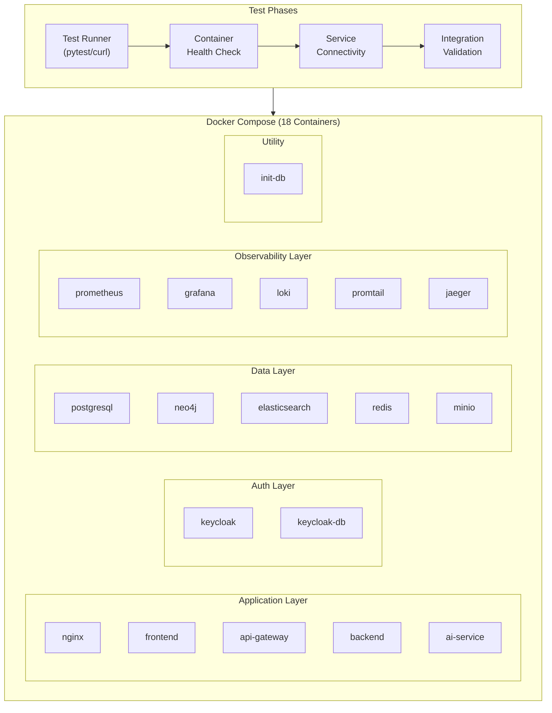
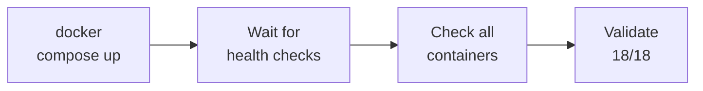
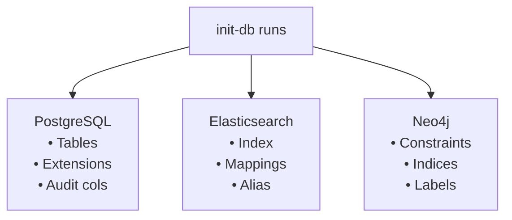
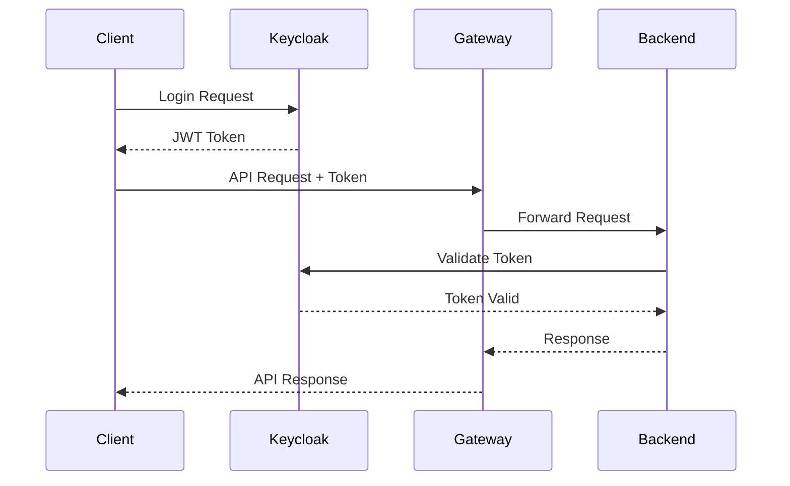
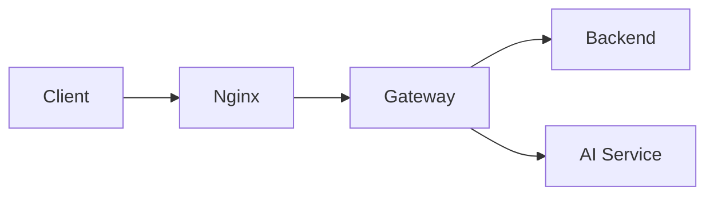
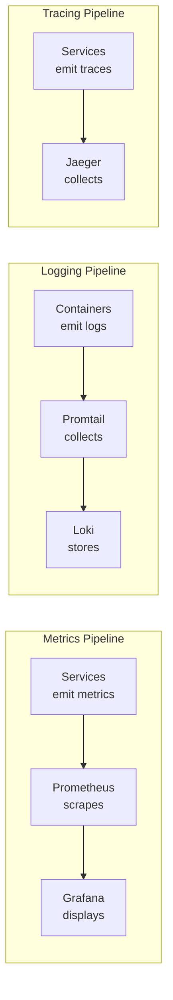
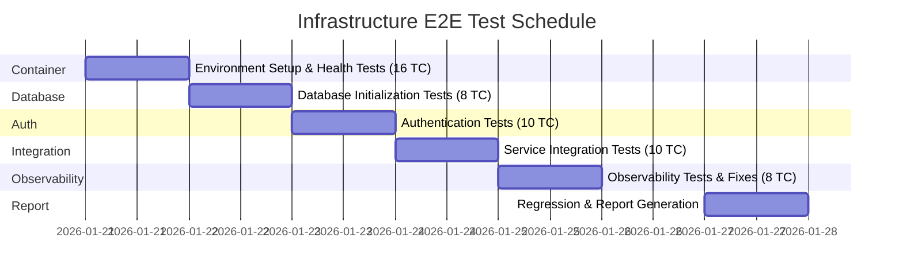

# Infrastructure End-to-End Test Plan

## Document Information

| Item | Value |
|------|-------|
| **Document** | Infrastructure E2E Test Plan |
| **Version** | 1.0 |
| **Created** | 2026-01-20 |
| **Author** | PM Agent (Claude Code) |
| **Status** | Draft |
| **Sprint** | Sprint 01 Validation |
| **Related** | [docker-compose.yml](../../../infrastructure/docker/docker-compose.yml), [Unit Test Plan](../unit_integration_test_plan.md) |

---

## Change History

| Version | Date | Author | Description |
|---------|------|--------|-------------|
| 1.0 | 2026-01-20 | PM Agent | Initial draft |

---

## Table of Contents

1. [Overview](#1-overview)
2. [Test Objectives](#2-test-objectives)
3. [Test Scope](#3-test-scope)
4. [Test Environment Requirements](#4-test-environment-requirements)
5. [Test Scenarios](#5-test-scenarios)
6. [Test Cases](#6-test-cases)
7. [Success Criteria](#7-success-criteria)
8. [Test Schedule](#8-test-schedule)
9. [Risk and Mitigation](#9-risk-and-mitigation)

---

## 1. Overview

### 1.1 Purpose

This document defines the End-to-End (E2E) integration test plan for validating Sprint 01 infrastructure deliverables. The purpose is to verify that all 18 Docker containers work together as an integrated system.

### 1.2 Background

Sprint 01 was completed on Day 1 (2026-01-20) with the following deliverables:
- Docker Compose environment with 18 containers
- Database initialization scripts (PostgreSQL, Elasticsearch, Neo4j)
- Keycloak SSO configuration
- Project skeletons (Backend, Frontend, AI Service, API Gateway)

### 1.3 Test Architecture Overview



---

## 2. Test Objectives

### 2.1 Primary Objectives

| ID | Objective | Description |
|----|-----------|-------------|
| OBJ-1 | Container Health | Verify all 18 containers start and reach healthy state |
| OBJ-2 | Network Connectivity | Validate inter-container communication across networks |
| OBJ-3 | Database Initialization | Confirm PostgreSQL, Elasticsearch, Neo4j schemas are applied |
| OBJ-4 | Authentication Flow | Test Keycloak OAuth2/OIDC authentication end-to-end |
| OBJ-5 | Service Integration | Verify API Gateway routes to Backend and AI Service |
| OBJ-6 | Observability | Confirm metrics, logs, and traces are collected |

### 2.2 Out of Scope

| Item | Reason |
|------|--------|
| Business Logic Testing | Covered in Sprint 02+ |
| Performance/Load Testing | Separate test plan |
| Security Penetration Testing | Separate security review |
| UI Functional Testing | Frontend not fully implemented |

---

## 3. Test Scope

### 3.1 Test Layers

```
+------------------+------------------------------------------+----------------+
|      Layer       |              Components                  |   Test Type    |
+------------------+------------------------------------------+----------------+
| Application (5)  | nginx, frontend, api-gateway,            | Connectivity,  |
|                  | backend, ai-service                      | Health, Routing|
+------------------+------------------------------------------+----------------+
| Auth (2)         | keycloak, keycloak-db                    | OAuth2 Flow,   |
|                  |                                          | Token Validation|
+------------------+------------------------------------------+----------------+
| Data (5)         | postgresql, neo4j, elasticsearch,        | Schema Check,  |
|                  | redis, minio                             | CRUD Operations|
+------------------+------------------------------------------+----------------+
| Observability (5)| prometheus, grafana, loki,               | Metrics,       |
|                  | promtail, jaeger                         | Logs, Traces   |
+------------------+------------------------------------------+----------------+
| Utility (1)      | init-db                                  | Script Success |
+------------------+------------------------------------------+----------------+
```

### 3.2 Container Details

| # | Container | Image | Port | Health Check |
|---|-----------|-------|------|--------------|
| 1 | nginx | nginx:1.25-alpine | 80, 443 | nginx -t |
| 2 | frontend | knowledge-platform/frontend | - | wget localhost:80 |
| 3 | api-gateway | knowledge-platform/api-gateway | 8080 | /actuator/health |
| 4 | backend | knowledge-platform/backend | 8081 | /actuator/health |
| 5 | ai-service | knowledge-platform/ai-service | 8000 | /health |
| 6 | keycloak | quay.io/keycloak/keycloak:23.0 | 8180 | /health/ready |
| 7 | keycloak-db | postgres:16-alpine | 5432 | pg_isready |
| 8 | postgresql | postgres:16-alpine | 5432 | pg_isready |
| 9 | neo4j | neo4j:5.15-community | 7474, 7687 | wget :7474 |
| 10 | elasticsearch | elasticsearch:8.11.0 | 9200 | /_cluster/health |
| 11 | redis | redis:7.2-alpine | 6379 | redis-cli ping |
| 12 | minio | minio/minio | 9000, 9001 | /minio/health/live |
| 13 | prometheus | prom/prometheus:v2.48.0 | 9090 | /-/healthy |
| 14 | grafana | grafana/grafana:10.2.0 | 3001 | /api/health |
| 15 | loki | grafana/loki:2.9.0 | 3100 | /ready |
| 16 | promtail | grafana/promtail:2.9.0 | - | - |
| 17 | jaeger | jaegertracing/all-in-one:1.52 | 16686 | wget :14269 |
| 18 | init-db | python:3.11-slim | - | Exit code 0 |

---

## 4. Test Environment Requirements

### 4.1 Hardware Requirements

| Resource | Minimum | Recommended |
|----------|---------|-------------|
| CPU | 8 cores | 16 cores |
| RAM | 16 GB | 32 GB |
| Disk | 50 GB SSD | 100 GB SSD |

### 4.2 Software Requirements

| Software | Version | Purpose |
|----------|---------|---------|
| Docker | 24.0+ | Container runtime |
| Docker Compose | v2.20+ | Orchestration |
| curl | 7.0+ | API testing |
| jq | 1.6+ | JSON parsing |
| Python | 3.11+ | Test scripts |
| pytest | 8.0+ | Test framework |

### 4.3 Environment Variables

```bash
# .env file required
POSTGRES_PASSWORD=<secure_password>
DB_PASSWORD=<secure_password>
KEYCLOAK_ADMIN_PASSWORD=<secure_password>
KEYCLOAK_DB_PASSWORD=<secure_password>
NEO4J_PASSWORD=<secure_password>
MINIO_ACCESS_KEY=<access_key>
MINIO_SECRET_KEY=<secret_key>
GRAFANA_ADMIN_PASSWORD=<secure_password>
DEEPSEEK_API_KEY=<api_key>
```

### 4.4 Network Configuration

| Network | Type | Purpose |
|---------|------|---------|
| kp-frontend | bridge | Public-facing services |
| kp-backend | bridge | Internal service communication |
| kp-database | internal | Database isolation |
| kp-monitoring | bridge | Observability stack |

---

## 5. Test Scenarios

### 5.1 Scenario 1: Full Stack Startup

**Objective**: Verify all 18 containers start successfully with healthy status.



**Steps**:
1. Run `docker compose up -d`
2. Wait for all health checks to pass (max 5 minutes)
3. Verify all 18 containers are running
4. Check no containers in restart loop

### 5.2 Scenario 2: Database Initialization

**Objective**: Verify all database schemas and initial data are correctly applied.



**Steps**:
1. Run init-db container
2. Check PostgreSQL tables exist (knowledge, users, etc.)
3. Check Elasticsearch index `knowledge-chunks-v1` exists
4. Check Neo4j constraints are applied
5. Check MinIO buckets are created

### 5.3 Scenario 3: Authentication Flow

**Objective**: Verify Keycloak OAuth2/OIDC authentication works end-to-end.



**Steps**:
1. Access Keycloak admin console
2. Verify realm `knowledge-platform` exists
3. Verify client configuration
4. Perform OAuth2 password grant flow
5. Validate JWT token structure
6. Access protected API endpoint with token

### 5.4 Scenario 4: Service Integration

**Objective**: Verify API Gateway correctly routes to Backend and AI Service.



**Steps**:
1. Test Nginx proxy to Frontend
2. Test Gateway health endpoint
3. Test Backend health through Gateway
4. Test AI Service health through Gateway
5. Verify routing rules work correctly

### 5.5 Scenario 5: Observability Stack

**Objective**: Verify metrics, logs, and traces are being collected.



**Steps**:
1. Access Prometheus targets page
2. Verify scrape targets are UP
3. Access Grafana dashboards
4. Query Loki for logs
5. Access Jaeger UI for traces

---

## 6. Test Cases

### 6.1 Container Health Tests (TC-INFRA-1xx)

| TC ID | Test Case | Steps | Expected Result | Priority |
|-------|-----------|-------|-----------------|----------|
| TC-INFRA-101 | All containers start | `docker compose up -d` | 18 containers running | P0 |
| TC-INFRA-102 | Nginx health | `docker exec kp-nginx nginx -t` | Configuration OK | P0 |
| TC-INFRA-103 | Frontend health | `curl http://localhost:80/` | HTTP 200 | P0 |
| TC-INFRA-104 | Gateway health | `curl http://localhost:8080/actuator/health` | {"status":"UP"} | P0 |
| TC-INFRA-105 | Backend health | `curl http://localhost:8081/actuator/health` | {"status":"UP"} | P0 |
| TC-INFRA-106 | AI Service health | `curl http://localhost:8000/health` | {"status":"ok"} | P0 |
| TC-INFRA-107 | Keycloak health | `curl http://localhost:8180/health/ready` | HTTP 200 | P0 |
| TC-INFRA-108 | PostgreSQL health | `docker exec kp-postgresql pg_isready` | accepting connections | P0 |
| TC-INFRA-109 | Neo4j health | `curl http://localhost:7474/` | HTTP 200 | P0 |
| TC-INFRA-110 | Elasticsearch health | `curl http://localhost:9200/_cluster/health` | green or yellow | P0 |
| TC-INFRA-111 | Redis health | `docker exec kp-redis redis-cli ping` | PONG | P0 |
| TC-INFRA-112 | MinIO health | `curl http://localhost:9000/minio/health/live` | HTTP 200 | P0 |
| TC-INFRA-113 | Prometheus health | `curl http://localhost:9090/-/healthy` | Prometheus is Healthy | P1 |
| TC-INFRA-114 | Grafana health | `curl http://localhost:3001/api/health` | {"database":"ok"} | P1 |
| TC-INFRA-115 | Loki health | `curl http://localhost:3100/ready` | ready | P1 |
| TC-INFRA-116 | Jaeger health | `curl http://localhost:16686/` | HTTP 200 | P1 |

### 6.2 Database Initialization Tests (TC-INFRA-2xx)

| TC ID | Test Case | Steps | Expected Result | Priority |
|-------|-----------|-------|-----------------|----------|
| TC-INFRA-201 | PostgreSQL tables exist | Query information_schema | knowledge, users, documents tables | P0 |
| TC-INFRA-202 | PostgreSQL extensions | `SELECT * FROM pg_extension` | uuid-ossp, pgcrypto | P0 |
| TC-INFRA-203 | ES index exists | `GET /knowledge-chunks-v1` | Index with mappings | P0 |
| TC-INFRA-204 | ES alias exists | `GET /_alias/knowledge-chunks` | Alias to v1 | P0 |
| TC-INFRA-205 | ES vector mapping | Check dense_vector field | dims: 1024, similarity: cosine | P0 |
| TC-INFRA-206 | Neo4j constraints | `SHOW CONSTRAINTS` | document_id, entity_id, chunk_id | P0 |
| TC-INFRA-207 | Neo4j indices | `SHOW INDEXES` | entity_name, entity_type | P0 |
| TC-INFRA-208 | MinIO buckets | `mc ls minio/` | documents, processed, temp, backups | P0 |

### 6.3 Authentication Tests (TC-INFRA-3xx)

| TC ID | Test Case | Steps | Expected Result | Priority |
|-------|-----------|-------|-----------------|----------|
| TC-INFRA-301 | Keycloak admin login | Access admin console | Login successful | P0 |
| TC-INFRA-302 | Realm exists | Check realms | knowledge-platform realm | P0 |
| TC-INFRA-303 | Client configured | Check clients | knowledge-frontend, knowledge-backend | P0 |
| TC-INFRA-304 | Roles defined | Check roles | user, admin, editor | P0 |
| TC-INFRA-305 | User creation | Create test user | User created successfully | P1 |
| TC-INFRA-306 | OAuth2 password grant | POST /token | Access token returned | P0 |
| TC-INFRA-307 | Token structure | Decode JWT | Contains sub, roles, exp | P0 |
| TC-INFRA-308 | Token refresh | POST /token (refresh) | New access token | P1 |
| TC-INFRA-309 | Protected API access | GET /api/v1/user with token | User info returned | P0 |
| TC-INFRA-310 | Invalid token rejected | GET /api without token | HTTP 401 | P0 |

### 6.4 Service Integration Tests (TC-INFRA-4xx)

| TC ID | Test Case | Steps | Expected Result | Priority |
|-------|-----------|-------|-----------------|----------|
| TC-INFRA-401 | Nginx -> Frontend | `curl http://localhost/` | Frontend HTML | P0 |
| TC-INFRA-402 | Nginx -> Gateway | `curl http://localhost/api/` | Gateway response | P0 |
| TC-INFRA-403 | Gateway -> Backend | `curl http://localhost:8080/api/health` | Backend UP | P0 |
| TC-INFRA-404 | Gateway -> AI Service | `curl http://localhost:8080/ai/health` | AI Service ok | P0 |
| TC-INFRA-405 | Backend -> PostgreSQL | Backend connection test | Connection successful | P0 |
| TC-INFRA-406 | Backend -> Redis | Backend cache test | Cache working | P0 |
| TC-INFRA-407 | Backend -> MinIO | Backend storage test | File upload/download | P1 |
| TC-INFRA-408 | AI Service -> ES | AI Service search test | Search works | P0 |
| TC-INFRA-409 | AI Service -> Neo4j | AI Service graph test | Graph query works | P0 |
| TC-INFRA-410 | Cross-network communication | Backend to AI Service | Direct communication | P0 |

### 6.5 Observability Tests (TC-INFRA-5xx)

| TC ID | Test Case | Steps | Expected Result | Priority |
|-------|-----------|-------|-----------------|----------|
| TC-INFRA-501 | Prometheus targets | `GET /api/v1/targets` | All targets UP | P1 |
| TC-INFRA-502 | Backend metrics | Query jvm_memory_used | Metrics available | P1 |
| TC-INFRA-503 | AI Service metrics | Query python_gc_collections | Metrics available | P1 |
| TC-INFRA-504 | Grafana datasources | Check datasources | Prometheus, Loki configured | P1 |
| TC-INFRA-505 | Grafana login | Admin login | Successful | P1 |
| TC-INFRA-506 | Loki log ingestion | Query {container="kp-backend"} | Logs returned | P1 |
| TC-INFRA-507 | Promtail scraping | Check Promtail targets | Docker logs collected | P2 |
| TC-INFRA-508 | Jaeger traces | Query traces | Service traces visible | P2 |

---

## 7. Success Criteria

### 7.1 Pass/Fail Criteria

| Category | Pass Criteria |
|----------|---------------|
| **Container Health** | All 18 containers healthy within 5 minutes |
| **Database Init** | All schemas and indices created successfully |
| **Authentication** | OAuth2 flow works with valid JWT |
| **Service Integration** | All service-to-service calls succeed |
| **Observability** | Metrics and logs visible in dashboards |

### 7.2 Test Metrics

| Metric | Target | Measurement |
|--------|--------|-------------|
| Container Startup Time | < 5 minutes | docker compose up to all healthy |
| P0 Test Pass Rate | 100% | All P0 tests pass |
| P1 Test Pass Rate | >= 95% | At least 95% P1 tests pass |
| Overall Test Pass Rate | >= 90% | At least 90% all tests pass |

### 7.3 Exit Criteria

- [ ] All P0 test cases pass (100%)
- [ ] P1 test cases pass rate >= 95%
- [ ] No Critical/High severity defects open
- [ ] Test report generated and reviewed
- [ ] Blocking issues for Sprint 02 resolved

---

## 8. Test Schedule

### 8.1 Test Timeline



### 8.2 Resource Allocation

| Role | Responsibility | Effort |
|------|----------------|--------|
| QA Agent | Test execution, defect logging | 5 days |
| Infra Agent | Environment issues | 2 days |
| DevOps Agent | CI/CD integration | 1 day |
| PM Agent | Coordination, reporting | 1 day |

---

## 9. Risk and Mitigation

### 9.1 Risk Assessment

| Risk ID | Description | Probability | Impact | Mitigation |
|---------|-------------|-------------|--------|------------|
| R1 | Memory exhaustion during full stack | Medium | High | Reduce memory limits, selective startup |
| R2 | Container startup order issues | Low | Medium | Dependency health checks configured |
| R3 | Keycloak realm import failure | Low | High | Manual realm configuration backup |
| R4 | Database initialization timeout | Medium | Medium | Increased timeout, retry logic |
| R5 | Network connectivity issues | Low | High | Verify network configuration |
| R6 | Port conflicts with host | Medium | Low | Use .env for port customization |

### 9.2 Contingency Plans

| Risk | Contingency |
|------|-------------|
| Full stack memory issue | Use `docker-compose.light.yml` with minimal services |
| Keycloak failure | Deploy standalone Keycloak, manual config |
| Database init failure | Run init scripts manually |
| Service unreachable | Check Docker network, restart containers |

---

## Appendix

### A. Test Script Examples

#### A.1 Container Health Check Script

```bash
#!/bin/bash
# infrastructure_health_check.sh

echo "=== Infrastructure E2E Health Check ==="

# Container list
CONTAINERS=(
    "kp-nginx"
    "kp-frontend"
    "kp-api-gateway"
    "kp-backend"
    "kp-ai-service"
    "kp-keycloak"
    "kp-keycloak-db"
    "kp-postgresql"
    "kp-neo4j"
    "kp-elasticsearch"
    "kp-redis"
    "kp-minio"
    "kp-prometheus"
    "kp-grafana"
    "kp-loki"
    "kp-promtail"
    "kp-jaeger"
)

PASS=0
FAIL=0

for container in "${CONTAINERS[@]}"; do
    status=$(docker inspect --format='{{.State.Health.Status}}' "$container" 2>/dev/null || echo "not_found")

    if [[ "$status" == "healthy" ]]; then
        echo "[PASS] $container: $status"
        ((PASS++))
    else
        echo "[FAIL] $container: $status"
        ((FAIL++))
    fi
done

echo ""
echo "=== Summary ==="
echo "Passed: $PASS"
echo "Failed: $FAIL"
echo "Total: $((PASS + FAIL))"

if [[ $FAIL -gt 0 ]]; then
    exit 1
fi
```

#### A.2 Database Initialization Verification

```bash
#!/bin/bash
# verify_db_init.sh

echo "=== Database Initialization Verification ==="

# PostgreSQL
echo -e "\n[PostgreSQL Tables]"
docker exec kp-postgresql psql -U knowledge -d knowledge -c "\dt" 2>/dev/null

# Elasticsearch
echo -e "\n[Elasticsearch Indices]"
curl -s "http://localhost:9200/_cat/indices?v" 2>/dev/null

# Neo4j
echo -e "\n[Neo4j Constraints]"
docker exec kp-neo4j cypher-shell -u neo4j -p "$NEO4J_PASSWORD" "SHOW CONSTRAINTS" 2>/dev/null

# MinIO
echo -e "\n[MinIO Buckets]"
docker exec kp-minio mc ls local/ 2>/dev/null
```

#### A.3 OAuth2 Token Test

```bash
#!/bin/bash
# test_oauth2_flow.sh

KEYCLOAK_URL="http://localhost:8180"
REALM="knowledge-platform"
CLIENT_ID="knowledge-backend"
CLIENT_SECRET="<client_secret>"
USERNAME="test-user"
PASSWORD="test-password"

echo "=== OAuth2 Password Grant Test ==="

# Get access token
TOKEN_RESPONSE=$(curl -s -X POST \
    "$KEYCLOAK_URL/realms/$REALM/protocol/openid-connect/token" \
    -H "Content-Type: application/x-www-form-urlencoded" \
    -d "grant_type=password" \
    -d "client_id=$CLIENT_ID" \
    -d "client_secret=$CLIENT_SECRET" \
    -d "username=$USERNAME" \
    -d "password=$PASSWORD")

ACCESS_TOKEN=$(echo $TOKEN_RESPONSE | jq -r '.access_token')

if [[ "$ACCESS_TOKEN" != "null" && -n "$ACCESS_TOKEN" ]]; then
    echo "[PASS] Access token obtained"

    # Decode JWT header (base64)
    HEADER=$(echo $ACCESS_TOKEN | cut -d'.' -f1 | base64 -d 2>/dev/null | jq .)
    echo "Token Header: $HEADER"
else
    echo "[FAIL] Failed to obtain access token"
    echo "Response: $TOKEN_RESPONSE"
    exit 1
fi
```

### B. Test Report Template

```markdown
# Infrastructure E2E Test Report

## Summary
- Test Period: YYYY-MM-DD ~ YYYY-MM-DD
- Executed By: [Name/Agent]
- Environment: Docker Compose (18 containers)

## Results Overview

| Category | Total | Passed | Failed | Pass Rate |
|----------|-------|--------|--------|-----------|
| Container Health | 16 | - | - | - |
| Database Init | 8 | - | - | - |
| Authentication | 10 | - | - | - |
| Integration | 10 | - | - | - |
| Observability | 8 | - | - | - |
| **Total** | **52** | - | - | - |

## Failed Test Cases

| TC ID | Description | Failure Reason | Severity | Status |
|-------|-------------|----------------|----------|--------|
| - | - | - | - | - |

## Defects Found

| Defect ID | Summary | Severity | Component | Status |
|-----------|---------|----------|-----------|--------|
| - | - | - | - | - |

## Recommendations
- [List any recommendations]

## Sign-off
- [ ] Test Lead
- [ ] PM
- [ ] Tech Lead
```

### C. Related Documents

| Document | Location |
|----------|----------|
| Docker Compose | [infrastructure/docker/docker-compose.yml](../../../infrastructure/docker/docker-compose.yml) |
| Unit Test Plan | [unit_integration_test_plan.md](../unit_integration_test_plan.md) |
| Sprint 01 Backlog | [backlog/sprints/sprint-01.md](../../../backlog/sprints/sprint-01.md) |
| Keycloak Config | [infrastructure/docker/keycloak/realm-export.json](../../../infrastructure/docker/keycloak/realm-export.json) |
| Init DB Script | [infrastructure/docker/scripts/init-db.py](../../../infrastructure/docker/scripts/init-db.py) |

---

**Document End**

**Author**: PM Agent (Claude Code)
**Last Updated**: 2026-01-20
