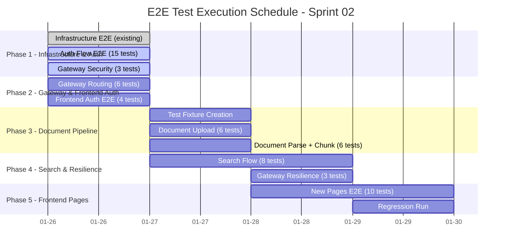

# E2E Test Plan - Sprint 02

**Version**: 1.0
**Created**: 2026-01-26
**Author**: QA Engineer (QA Agent)
**Sprint**: Sprint 02 Day 3
**Status**: Active

---

## Document Information

| Item | Value |
|------|-------|
| **Document** | E2E Test Plan - Sprint 02 |
| **Version** | 1.0 |
| **Created** | 2026-01-26 |
| **Author** | QA Agent (Claude Opus 4.5) |
| **Status** | Active |
| **Related Docs** | [Unit/Integration Test Plan](./unit_integration_test_plan.md), [Playwright E2E Plan](./test_plans/E2E_playwright_test_plan.md), [Infra E2E Report](./infrastructure_e2e/05.infrastructure_e2e_test_report_2026-01-26.md), [API Integration Design](../02_design/04_api_integration_design.md) |

---

## Change History

| Version | Date | Author | Description |
|---------|------|--------|-------------|
| 1.0 | 2026-01-26 | QA Agent | Initial creation - Sprint 02 Day 3 E2E Test Plan |

---

## Table of Contents

1. [Overview](#1-overview)
2. [Test Scope Summary](#2-test-scope-summary)
3. [Test Scenarios by Category](#3-test-scenarios-by-category)
   - [3.1 Authentication Flow](#31-authentication-flow)
   - [3.2 Document Pipeline](#32-document-pipeline)
   - [3.3 Search Flow](#33-search-flow)
   - [3.4 Frontend Pages](#34-frontend-pages)
   - [3.5 Infrastructure](#35-infrastructure)
   - [3.6 API Gateway](#36-api-gateway)
4. [Test Scenario Matrix](#4-test-scenario-matrix)
5. [Executability Analysis](#5-executability-analysis)
6. [Test Environment](#6-test-environment)
7. [Risks and Mitigations](#7-risks-and-mitigations)
8. [Execution Schedule](#8-execution-schedule)
9. [Quality Gates](#9-quality-gates)

---

## 1. Overview

### 1.1 Purpose

This document defines the End-to-End (E2E) test plan for all features completed or in progress during Sprint 02 Day 3. The plan covers the full stack: Frontend (React 18), API Gateway (Spring Cloud Gateway), Backend (SpringBoot 3.x with R2DBC), AI Service (FastAPI/Python), and Infrastructure (Docker Compose 18 containers).

### 1.2 Sprint 02 Day 3 Completed Items

| # | Story/Item | Description | Status | Test Readiness |
|---|-----------|-------------|--------|----------------|
| 1 | STORY-001 | Document Upload API (FastAPI) | Done | Ready |
| 2 | STORY-002 | Docling Parser Integration (35/37 pass) | Done | Ready |
| 3 | STORY-003 | Semantic Chunking (25/25 pass) | Done | Ready |
| 4 | STORY-022 | JWT Auth Filter (Gateway) | Done | Ready |
| 5 | STORY-024 | Direct Login API (login/refresh/logout) | Done | Ready |
| 6 | STORY-046 | Frontend Pages (Bookmark, Profile, Admin, DocUpload) | In Progress | Partial |
| 7 | STORY-047 | Backend API 32 Endpoints (R2DBC Reactive) | In Progress | Partial |
| 8 | Infrastructure | Docker Compose 18 Containers | Done | Ready |
| 9 | Gateway | Routing + JWT + CircuitBreaker | Done | Ready |
| 10 | Critical Fixes | PG Schema, Internal API Block, ES Mapping | Done | Ready |

### 1.3 Test Architecture

```mermaid
flowchart TB
    subgraph E2E["E2E Test Scope"]
        subgraph FE["Frontend E2E"]
            F1["Playwright Tests"]
            F2["Page Navigation"]
            F3["Auth Integration"]
        end

        subgraph GW["Gateway E2E"]
            G1["Route Verification"]
            G2["JWT Validation"]
            G3["CircuitBreaker"]
            G4["Rate Limiting"]
        end

        subgraph API["API E2E"]
            A1["Auth Flow"]
            A2["Document Pipeline"]
            A3["Search Flow"]
            A4["CRUD Operations"]
        end

        subgraph INFRA["Infrastructure E2E"]
            I1["Container Health"]
            I2["Network Connectivity"]
            I3["DB Initialization"]
            I4["Observability"]
        end
    end

    FE --> GW --> API --> INFRA

    style FE fill:#e3f2fd
    style GW fill:#fff3e0
    style API fill:#e8f5e9
    style INFRA fill:#fce4ec
```



---

## 2. Test Scope Summary

### 2.1 In Scope

| Category | Test Count | Priority | Tool |
|----------|-----------|----------|------|
| Authentication Flow | 15 | P0 | pytest / httpx |
| Document Pipeline | 12 | P0/P1 | pytest / httpx |
| Search Flow | 8 | P1 | pytest / httpx |
| Frontend Pages | 14 | P1/P2 | Playwright |
| Infrastructure | 21 (existing) | P0 | pytest |
| API Gateway | 12 | P0/P1 | pytest / httpx |
| **Total** | **82** | | |

### 2.2 Out of Scope (Sprint 02)

| Item | Reason | Expected Sprint |
|------|--------|----------------|
| STORY-004 Embedding Pipeline | Not yet implemented | Sprint 03 |
| RAG Chat (Streaming) | AI Service LangGraph not ready | Sprint 03 |
| RAGAS Quality Evaluation | Requires full RAG pipeline | Sprint 04 |
| k6 Performance Test | After functional E2E pass | Sprint 03 |
| Multi-browser E2E | Chromium-only first | Sprint 04 |
| Mobile Responsive | Desktop first | Sprint 04 |

---

## 3. Test Scenarios by Category

### 3.1 Authentication Flow

Complete Direct Login flow: Login -> JWT Token -> API Call -> Token Refresh -> Logout

#### 3.1.1 Direct Login API

| Test ID | Description | Precondition | Steps | Expected Result | Priority |
|---------|-------------|--------------|-------|-----------------|----------|
| E2E-AUTH-001 | Successful login via Backend (port 8081) | Backend service running, test account exists | 1. POST `http://localhost:8081/api/v1/auth/login` with `{"email":"test@example.com","password":"password123"}` | HTTP 200, response contains `accessToken`, `refreshToken`, `user` object, `expiresIn` | P0 |
| E2E-AUTH-002 | Successful login via Gateway (port 8080) | Gateway + Backend running | 1. POST `http://localhost:8080/api/v1/auth/login` with valid credentials | HTTP 200, JWT tokens returned (proves Gateway routing works) | P0 |
| E2E-AUTH-003 | Successful login via Nginx (port 80) | Full chain: Nginx -> Gateway -> Backend | 1. POST `http://localhost/api/v1/auth/login` with valid credentials | HTTP 200, full routing chain verified | P0 |
| E2E-AUTH-004 | Login with invalid credentials | Backend running | 1. POST login with wrong password | HTTP 401, error message returned | P0 |
| E2E-AUTH-005 | Login with non-existent email | Backend running | 1. POST login with unknown email | HTTP 401, "Invalid credentials" error | P0 |
| E2E-AUTH-006 | Login with empty fields | Backend running | 1. POST login with empty email/password | HTTP 400, validation error | P1 |
| E2E-AUTH-007 | Admin login | Backend running, admin account exists | 1. POST login with `admin@example.com` / `admin123!` | HTTP 200, user roles include "ADMIN" | P0 |

#### 3.1.2 JWT Token Validation

| Test ID | Description | Precondition | Steps | Expected Result | Priority |
|---------|-------------|--------------|-------|-----------------|----------|
| E2E-AUTH-008 | Access protected API with valid JWT | Valid accessToken obtained | 1. Login and obtain token 2. GET `/api/v1/knowledge` with `Authorization: Bearer {token}` via Gateway | HTTP 200, data returned | P0 |
| E2E-AUTH-009 | Access protected API without token | N/A | 1. GET `/api/v1/knowledge` via Gateway without Authorization header | HTTP 401 Unauthorized | P0 |
| E2E-AUTH-010 | Access protected API with invalid token | N/A | 1. GET `/api/v1/knowledge` with `Authorization: Bearer invalid-token` | HTTP 401 Unauthorized | P0 |
| E2E-AUTH-011 | Access protected API with expired token | Expired token (or artificially crafted) | 1. Use an expired JWT 2. Call protected endpoint | HTTP 401, token expired error | P1 |

#### 3.1.3 Token Refresh and Logout

| Test ID | Description | Precondition | Steps | Expected Result | Priority |
|---------|-------------|--------------|-------|-----------------|----------|
| E2E-AUTH-012 | Token refresh with valid refresh token | Valid refreshToken from login | 1. POST `/api/v1/auth/refresh` with `{"refreshToken":"..."}` | HTTP 200, new accessToken and refreshToken | P0 |
| E2E-AUTH-013 | Token refresh with invalid token | N/A | 1. POST `/api/v1/auth/refresh` with invalid token | HTTP 401, refresh failed error | P1 |
| E2E-AUTH-014 | Logout | Valid session | 1. Login 2. POST `/api/v1/auth/logout` with auth header | HTTP 200, session invalidated | P0 |
| E2E-AUTH-015 | Access after logout | Just logged out | 1. Login 2. Logout 3. Use old accessToken | HTTP 401 (if token blacklisted) or still valid until expiry (depending on implementation) | P1 |

---

### 3.2 Document Pipeline

Upload -> Parsing -> Chunking flow (Embedding deferred to STORY-004)

#### 3.2.1 Document Upload API (AI Service - FastAPI)

| Test ID | Description | Precondition | Steps | Expected Result | Priority |
|---------|-------------|--------------|-------|-----------------|----------|
| E2E-DOC-001 | Upload PDF document | AI Service running, MinIO available | 1. POST `/api/v1/documents` with PDF file (multipart) to AI Service (port 8000) | HTTP 201 or 200, document_id returned, status "uploaded" | P0 |
| E2E-DOC-002 | Upload DOCX document | AI Service running | 1. POST `/api/v1/documents` with DOCX file | HTTP 201, accepted format confirmed | P0 |
| E2E-DOC-003 | Upload HWP document | AI Service running | 1. POST `/api/v1/documents` with HWP file | HTTP 201, HWP format detected | P1 |
| E2E-DOC-004 | Upload unsupported format | AI Service running | 1. POST `/api/v1/documents` with `.exe` file | HTTP 400/422, "Unsupported format" error | P0 |
| E2E-DOC-005 | Upload oversized file | AI Service running | 1. POST `/api/v1/documents` with file > 100MB | HTTP 413 or 400, file too large error | P1 |
| E2E-DOC-006 | Upload with metadata | AI Service running | 1. POST `/api/v1/documents` with file + metadata (title, project_name, tags) | HTTP 201, metadata stored correctly | P1 |

#### 3.2.2 Document Parsing (Docling)

| Test ID | Description | Precondition | Steps | Expected Result | Priority |
|---------|-------------|--------------|-------|-----------------|----------|
| E2E-DOC-007 | Parse uploaded PDF | Document uploaded, Docling available | 1. Upload PDF 2. Trigger parse or check status | Document status changes to "parsed", sections extracted | P0 |
| E2E-DOC-008 | Parse document with tables | PDF with tables uploaded | 1. Upload PDF with tables 2. Verify parsed output | Tables detected and converted to markdown | P1 |
| E2E-DOC-009 | Parse Korean text document | Korean document uploaded | 1. Upload Korean text document 2. Verify encoding | Korean text correctly preserved in parsed output | P1 |

#### 3.2.3 Semantic Chunking

| Test ID | Description | Precondition | Steps | Expected Result | Priority |
|---------|-------------|--------------|-------|-----------------|----------|
| E2E-DOC-010 | Chunk parsed document | Parsed document available | 1. Call chunking on parsed document 2. Verify chunks | Chunks created with proper size (300-1500 chars), overlap maintained | P0 |
| E2E-DOC-011 | Chunk preserves section boundaries | Multi-section document parsed | 1. Chunk document 2. Verify sections not split mid-sentence | Section boundaries respected in chunking | P1 |
| E2E-DOC-012 | Document status query | Document in processing | 1. GET `/api/v1/documents/{id}/status` | Status returned (uploaded/parsing/parsed/chunking/ready/error) | P1 |

---

### 3.3 Search Flow

Search request -> Gateway Routing -> AI Service -> Response

| Test ID | Description | Precondition | Steps | Expected Result | Priority |
|---------|-------------|--------------|-------|-----------------|----------|
| E2E-SEARCH-001 | Search API accessible via Gateway | Gateway routing to AI Service | 1. POST `/api/v1/search/hybrid` via Gateway (8080) with `{"query":"test","top_k":5}` | Response from AI Service (may be empty results if no documents indexed) | P1 |
| E2E-SEARCH-002 | Search API requires authentication | Gateway JWT filter active | 1. POST `/api/v1/search/hybrid` without token | HTTP 401 Unauthorized | P0 |
| E2E-SEARCH-003 | Search with valid token | Valid JWT obtained | 1. Login 2. POST search with Bearer token | HTTP 200, search results (or empty array) | P1 |
| E2E-SEARCH-004 | Search health check | AI Service running | 1. GET `/health` on AI Service (8000) | `{"status":"ok"}` | P0 |
| E2E-SEARCH-005 | Search with empty query | Authenticated | 1. POST search with empty query string | HTTP 400/422, validation error | P1 |
| E2E-SEARCH-006 | Search rate limiting | Gateway rate limiter configured | 1. Send 70+ requests in 1 second to search | HTTP 429 Too Many Requests after burst capacity exceeded | P2 |
| E2E-SEARCH-007 | Search stream endpoint | Gateway + AI Service | 1. POST `/api/v1/search/stream` with valid query | SSE stream connection established (or 200 with streaming response) | P2 |
| E2E-SEARCH-008 | Internal API blocked externally | Gateway configured to block `/internal/**` | 1. GET `/internal/v1/search/hybrid` via Gateway (8080) | HTTP 404 (route not found) - internal API not exposed | P0 |

---

### 3.4 Frontend Pages

Page loading, navigation, and authentication integration

#### 3.4.1 Existing Pages (Phase 1 - Already Tested)

| Test ID | Description | Precondition | Steps | Expected Result | Priority |
|---------|-------------|--------------|-------|-----------------|----------|
| E2E-FE-001 | Login page renders | Frontend dev server running | 1. Navigate to `/login` | Login form with email, password fields, submit button | P0 |
| E2E-FE-002 | Successful login redirects | Mock or real auth API | 1. Enter valid credentials 2. Submit | Redirect to `/dashboard` or `/` | P0 |
| E2E-FE-003 | Protected route redirect | Not authenticated | 1. Navigate to `/dashboard` directly | Redirect to `/login` | P0 |
| E2E-FE-004 | Logout flow | Authenticated user | 1. Login 2. Click logout | Redirect to `/login`, session cleared | P1 |

#### 3.4.2 New Pages (STORY-046 - In Progress)

| Test ID | Description | Precondition | Steps | Expected Result | Priority |
|---------|-------------|--------------|-------|-----------------|----------|
| E2E-FE-005 | BookmarkPage renders | Authenticated, BookmarkPage implemented | 1. Navigate to `/bookmarks` | Bookmark list page displayed, empty state or bookmarks shown | P1 |
| E2E-FE-006 | BookmarkPage auth guard | Not authenticated | 1. Navigate to `/bookmarks` directly | Redirect to `/login` | P1 |
| E2E-FE-007 | ProfilePage renders | Authenticated, ProfilePage implemented | 1. Navigate to `/profile` | User profile information displayed (email, name, role) | P1 |
| E2E-FE-008 | ProfilePage auth guard | Not authenticated | 1. Navigate to `/profile` directly | Redirect to `/login` | P1 |
| E2E-FE-009 | AdminPage renders | Admin user authenticated | 1. Login as admin 2. Navigate to `/admin` | Admin dashboard with system stats | P2 |
| E2E-FE-010 | AdminPage role guard | Non-admin user authenticated | 1. Login as regular user 2. Navigate to `/admin` | Access denied or redirect | P2 |
| E2E-FE-011 | DocumentUploadPage renders | Authenticated, page implemented | 1. Navigate to document upload page | Upload form with file input, metadata fields | P1 |
| E2E-FE-012 | DocumentUploadPage file selection | Upload page open | 1. Click file input 2. Select a PDF file | File name displayed, upload button enabled | P1 |
| E2E-FE-013 | Navigation between pages | Authenticated | 1. Login 2. Navigate to each page via sidebar/nav | All pages accessible, correct content rendered | P1 |
| E2E-FE-014 | 404 page for unknown routes | Frontend running | 1. Navigate to `/nonexistent` | NotFoundPage displayed | P2 |

---

### 3.5 Infrastructure

Container health, network, and service initialization (extends existing test suite)

| Test ID | Description | Precondition | Steps | Expected Result | Priority |
|---------|-------------|--------------|-------|-----------------|----------|
| E2E-INFRA-001 | All 18 containers running | Docker Compose up | 1. Check all container status | 18/18 containers in "Up" state | P0 |
| E2E-INFRA-002 | Container health checks | All containers running | 1. Docker inspect health for each container | 17/18 healthy (gateway healthcheck fix pending) | P0 |
| E2E-INFRA-003 | PostgreSQL schema initialized | PG running, init-db executed | 1. Check tables: users, knowledge_master, knowledge_chunks | All tables exist with correct schema | P0 |
| E2E-INFRA-004 | Elasticsearch cluster health | ES running | 1. GET `/_cluster/health` | Status: yellow or green | P0 |
| E2E-INFRA-005 | Redis connectivity | Redis running | 1. `redis-cli PING` | Returns PONG | P0 |
| E2E-INFRA-006 | MinIO bucket exists | MinIO running, init-db executed | 1. Check "documents" bucket | Bucket exists and accessible | P1 |
| E2E-INFRA-007 | Neo4j connectivity | Neo4j running | 1. GET Neo4j browser (7474) | HTTP 200, Neo4j browser accessible | P1 |
| E2E-INFRA-008 | Nginx reverse proxy | Nginx running | 1. GET `http://localhost:80` | Frontend HTML served | P0 |
| E2E-INFRA-009 | Nginx API routing | Nginx + Gateway | 1. GET `http://localhost/api/v1/auth/login` (OPTIONS) | Correct CORS headers returned | P1 |
| E2E-INFRA-010 | Prometheus scraping | Prometheus running | 1. Check active targets | Backend and AI Service targets UP | P1 |
| E2E-INFRA-011 | Grafana accessible | Grafana running | 1. GET `http://localhost:3001/api/health` | `{"database":"ok"}` | P2 |
| E2E-INFRA-012 | Jaeger UI accessible | Jaeger running | 1. GET `http://localhost:16686` | Jaeger UI HTML returned | P2 |
| E2E-INFRA-013 | Network isolation | Docker networks configured | 1. Verify kp-frontend, kp-backend, kp-database, kp-monitoring networks exist | All 4 networks exist with correct containers | P1 |
| E2E-INFRA-014 | Keycloak health | Keycloak running | 1. GET `/health/ready` on Keycloak | HTTP 200 | P1 |
| E2E-INFRA-015 | No container restart loops | All containers stable | 1. Check restart counts | All containers restart count < 3 | P0 |
| E2E-INFRA-016 | Kibana accessible | Kibana running | 1. GET Kibana status endpoint | Status available | P2 |
| E2E-INFRA-017 | Loki log collection | Loki + Promtail running | 1. Query Loki for recent logs | Labels found from Promtail | P2 |
| E2E-INFRA-018 | Backend actuator health | Backend running | 1. GET `http://localhost:8081/actuator/health` | `{"status":"UP"}` | P0 |
| E2E-INFRA-019 | AI Service health | AI Service running | 1. GET `http://localhost:8000/health` | `{"status":"ok"}` | P0 |
| E2E-INFRA-020 | Gateway actuator health | Gateway running | 1. GET `http://localhost:8080/actuator/health` | `{"status":"UP"}` | P0 |
| E2E-INFRA-021 | No critical log errors | All services | 1. Check Docker logs for FATAL/CRITICAL/PANIC | No critical errors found | P1 |

---

### 3.6 API Gateway

Routing accuracy, rate limiting, circuit breaker, and security

#### 3.6.1 Routing Verification

| Test ID | Description | Precondition | Steps | Expected Result | Priority |
|---------|-------------|--------------|-------|-----------------|----------|
| E2E-GW-001 | Auth route: `/api/v1/auth/**` -> Backend | Gateway + Backend running | 1. POST `/api/v1/auth/login` via Gateway (8080) | Response from Backend AuthController | P0 |
| E2E-GW-002 | Auth route: `/api/auth/**` -> Backend | Gateway + Backend running | 1. POST `/api/auth/login` via Gateway (8080) | Response from Backend (legacy route) | P1 |
| E2E-GW-003 | Knowledge route: `/api/v1/knowledge/**` -> Backend | Gateway + Backend + valid JWT | 1. GET `/api/v1/knowledge` with Bearer token | Response from Backend KnowledgeController | P0 |
| E2E-GW-004 | Search route: `/api/v1/search/**` -> AI Service | Gateway + AI Service + valid JWT | 1. POST `/api/v1/search/hybrid` with Bearer token | Response from AI Service SearchController | P0 |
| E2E-GW-005 | User route: `/api/v1/users/**` -> Backend | Gateway + Backend + valid JWT | 1. GET `/api/v1/users/me` with Bearer token | Response from Backend UserController | P1 |
| E2E-GW-006 | Catch-all route: `/api/v1/**` -> Backend | Gateway + Backend + valid JWT | 1. GET `/api/v1/bookmarks` with Bearer token | Response from Backend BookmarkController | P1 |

#### 3.6.2 Security

| Test ID | Description | Precondition | Steps | Expected Result | Priority |
|---------|-------------|--------------|-------|-----------------|----------|
| E2E-GW-007 | Internal API blocked | Gateway running | 1. GET `/internal/v1/search/hybrid` via Gateway (8080) | HTTP 404 (route not registered in Gateway) | P0 |
| E2E-GW-008 | Auth endpoints skip JWT | Gateway running | 1. POST `/api/v1/auth/login` without Bearer token | HTTP 200 (auth routes do not require JWT) | P0 |
| E2E-GW-009 | Protected endpoints require JWT | Gateway running | 1. GET `/api/v1/knowledge` without Bearer token | HTTP 401 Unauthorized | P0 |

#### 3.6.3 Resilience

| Test ID | Description | Precondition | Steps | Expected Result | Priority |
|---------|-------------|--------------|-------|-----------------|----------|
| E2E-GW-010 | CircuitBreaker fallback for auth | Backend down | 1. Stop Backend 2. POST login via Gateway | Fallback response from `/fallback/auth` | P1 |
| E2E-GW-011 | CircuitBreaker fallback for AI Service | AI Service down | 1. Stop AI Service 2. POST search via Gateway | Fallback response from `/fallback/ai-service` | P1 |
| E2E-GW-012 | Rate limiting enforcement | Gateway + Redis running | 1. Send requests exceeding burst capacity (> 40 for auth) | HTTP 429 after limit exceeded | P2 |

---

## 4. Test Scenario Matrix

### 4.1 Priority Distribution

| Priority | Count | Description | Pass Criteria |
|----------|-------|-------------|---------------|
| **P0 (Critical)** | 32 | Core functionality - must pass for release | 100% pass required |
| **P1 (High)** | 33 | Important features - high pass rate needed | 95% pass required |
| **P2 (Medium)** | 17 | Nice-to-have features | 90% pass required |
| **Total** | **82** | | |

### 4.2 Category Distribution

| Category | P0 | P1 | P2 | Total |
|----------|:--:|:--:|:--:|:-----:|
| Authentication Flow | 8 | 5 | 2 | 15 |
| Document Pipeline | 3 | 7 | 2 | 12 |
| Search Flow | 3 | 3 | 2 | 8 |
| Frontend Pages | 3 | 8 | 3 | 14 |
| Infrastructure | 8 | 8 | 5 | 21 |
| API Gateway | 7 | 2 | 3 | 12 |
| **Total** | **32** | **33** | **17** | **82** |

### 4.3 STORY Traceability

| Story ID | Related Test IDs | Count |
|----------|-----------------|-------|
| STORY-001 | E2E-DOC-001 ~ E2E-DOC-006 | 6 |
| STORY-002 | E2E-DOC-007 ~ E2E-DOC-009 | 3 |
| STORY-003 | E2E-DOC-010 ~ E2E-DOC-012 | 3 |
| STORY-022 | E2E-AUTH-008 ~ E2E-AUTH-011, E2E-GW-007 ~ E2E-GW-009 | 7 |
| STORY-024 | E2E-AUTH-001 ~ E2E-AUTH-007, E2E-AUTH-012 ~ E2E-AUTH-015 | 11 |
| STORY-046 | E2E-FE-005 ~ E2E-FE-014 | 10 |
| STORY-047 | E2E-GW-001 ~ E2E-GW-006 | 6 |
| Infrastructure | E2E-INFRA-001 ~ E2E-INFRA-021 | 21 |
| Gateway | E2E-GW-010 ~ E2E-GW-012 | 3 |
| Cross-cutting | E2E-SEARCH-001 ~ E2E-SEARCH-008 | 8 |

---

## 5. Executability Analysis

### 5.1 Immediately Executable (Sprint 02 Day 3)

Tests that can be run right now with the current infrastructure.

| Category | Executable Tests | Tool | Notes |
|----------|-----------------|------|-------|
| **Auth: Direct Login** | E2E-AUTH-001 ~ E2E-AUTH-007 | httpx / curl | Backend + Gateway confirmed working |
| **Auth: JWT Validation** | E2E-AUTH-008 ~ E2E-AUTH-011 | httpx | Gateway JWT filter active |
| **Auth: Refresh/Logout** | E2E-AUTH-012 ~ E2E-AUTH-015 | httpx | Backend AuthController ready |
| **Gateway: Routing** | E2E-GW-001 ~ E2E-GW-006 | httpx | All routes configured |
| **Gateway: Security** | E2E-GW-007 ~ E2E-GW-009 | httpx | Security config active |
| **Infrastructure** | E2E-INFRA-001 ~ E2E-INFRA-021 | pytest (existing) | Existing test suite, 47/77 passing |
| **Frontend: Login/Nav** | E2E-FE-001 ~ E2E-FE-004 | Playwright | Existing auth.spec.ts, 10/10 passing |
| **Search: Health/Block** | E2E-SEARCH-004, E2E-SEARCH-008 | httpx | Health endpoint + internal block |
| **Total Executable** | **~55 tests** | | |

### 5.2 Requires Additional Work

| Category | Tests | Blocker | Required Action | Effort |
|----------|-------|---------|-----------------|--------|
| **Document Upload** | E2E-DOC-001 ~ E2E-DOC-006 | MinIO init + test files | Create test PDF/DOCX fixtures, verify MinIO bucket | 1h |
| **Document Parsing** | E2E-DOC-007 ~ E2E-DOC-009 | Docling integration in API | Ensure parse endpoint triggers Docling | 2h |
| **Semantic Chunking** | E2E-DOC-010 ~ E2E-DOC-012 | Chunking API endpoint | Verify chunking is triggered after parse | 1h |
| **Search via Gateway** | E2E-SEARCH-001 ~ E2E-SEARCH-003 | AI Service search implementation | Need /api/v1/search/hybrid in AI Service | 2h |
| **Search Rate Limit** | E2E-SEARCH-006 | Load test setup | Need k6 or custom load script | 1h |
| **Frontend New Pages** | E2E-FE-005 ~ E2E-FE-014 | STORY-046 completion | Wait for page implementation | Depends on FE |
| **Gateway CircuitBreaker** | E2E-GW-010 ~ E2E-GW-011 | Service stop/start automation | Script to stop containers during test | 1h |
| **Gateway Rate Limit** | E2E-GW-012 | Concurrent request tool | k6 or custom burst script | 1h |
| **Total Requires Work** | **~27 tests** | | | **~9h** |

### 5.3 Execution Readiness Summary

```
Immediately Executable:  55 tests (67%)  [green]
Needs Minor Setup:       12 tests (15%)  [yellow] - test fixtures, scripts
Needs Feature Completion: 15 tests (18%) [red]    - STORY-046, STORY-047 dependent
```

### 5.4 Recommended Execution Order

| Phase | Tests | When | Duration |
|-------|-------|------|----------|
| **Phase 1: Now** | Infrastructure (21), Auth (15), Gateway Security (3) | Day 3 (today) | 1h |
| **Phase 2: Today** | Gateway Routing (6), Frontend Auth (4) | Day 3 (today) | 30min |
| **Phase 3: Day 4** | Document Upload (6), Document Parse (3), Chunk (3) | Day 4 | 2h |
| **Phase 4: Day 4-5** | Search Flow (8), Gateway Resilience (3) | Day 4-5 | 2h |
| **Phase 5: Day 5+** | Frontend New Pages (10) | After STORY-046 done | 1h |

---

## 6. Test Environment

### 6.1 Service Endpoints

| Service | Port | Health Check | Status |
|---------|------|-------------|--------|
| Nginx (Reverse Proxy) | 80 | GET / | Running |
| Frontend (React) | 3000 (dev) / 80 (nginx) | GET / | Running |
| API Gateway | 8080 | GET /actuator/health | Running (unhealthy Docker status - config issue) |
| Backend (SpringBoot) | 8081 | GET /actuator/health | Running |
| AI Service (FastAPI) | 8000 | GET /health | Running |
| Keycloak | 8180 | GET /health/ready | Running |
| PostgreSQL | 5432 | pg_isready | Running |
| Neo4j | 7474/7687 | GET :7474 | Running |
| Elasticsearch | 9200 | GET /_cluster/health | Running |
| Redis | 6379 | redis-cli PING | Running |
| MinIO | 9000/9001 | GET /minio/health/live | Running |
| Prometheus | 9090 | GET /-/healthy | Running |
| Grafana | 3001 | GET /api/health | Running |
| Kibana | 5601 | GET /api/status | Running |
| Loki | 3100 | GET /ready | Running |
| Jaeger | 16686 | GET / | Running |

### 6.2 Test Accounts

| Account Type | Email | Password | Role | Usage |
|-------------|-------|----------|------|-------|
| Normal User | test@example.com | password123 | USER | Standard E2E tests |
| Admin | admin@example.com | admin123! | ADMIN | Admin page tests |
| User 2 | user@example.com | user123! | USER | Additional user tests |
| Manager | manager@example.com | manager123! | MANAGER | Role-based tests |
| Invalid | wrong@example.com | wrongpassword | - | Negative tests |

### 6.3 Test Tools

| Tool | Version | Purpose |
|------|---------|---------|
| pytest | 9.0.2 | Python E2E tests (infra, API) |
| httpx | 0.27+ | Async HTTP client for API tests |
| Playwright | 1.58.0 | Browser E2E tests (Frontend) |
| Docker | 27.x | Container management |
| curl | Latest | Manual verification |

### 6.4 Test Data / Fixtures

| Fixture | Location | Description |
|---------|----------|-------------|
| Test PDF | `src/tests/fixtures/test_document.pdf` | Sample PDF for upload tests |
| Test DOCX | `src/tests/fixtures/test_document.docx` | Sample DOCX for upload tests |
| Test HWP | `src/tests/fixtures/test_document.hwp` | Sample HWP for upload tests |
| Korean PDF | `src/tests/fixtures/test_korean.pdf` | Korean text document for encoding test |
| Oversized file | Generated at runtime | 101MB file for size limit test |

---

## 7. Risks and Mitigations

| Risk ID | Risk | Impact | Probability | Mitigation |
|---------|------|--------|-------------|------------|
| R1 | STORY-046 (Frontend pages) not complete | 10 tests blocked | High | Test available pages first, mock unavailable ones |
| R2 | STORY-047 (Backend APIs) not complete | 6 routing tests affected | Medium | Test with existing endpoints, adapt when ready |
| R3 | Keycloak admin credentials missing | Auth tests cascade failure | High | Create `.env.test` with required credentials |
| R4 | Docker containers exit after idle | Tests fail on startup | Medium | Add `restart: unless-stopped`, pre-check containers |
| R5 | AI Service search not fully implemented | 8 search tests affected | High | Test health/routing only, defer search logic tests |
| R6 | MinIO bucket not initialized | Upload tests fail | Medium | Run init-db or create bucket manually before tests |
| R7 | Gateway healthcheck misconfigured | False unhealthy status | Low | Fix healthcheck to use `/actuator/health` (Infra task) |
| R8 | WSL2 network instability | Intermittent test failures | Low | Add retry logic, increase timeouts |
| R9 | Test environment credential management | Tests skip due to missing env vars | High | Document all required env vars, create setup script |

---

## 8. Execution Schedule

### 8.1 Timeline



### 8.2 Milestones

| Milestone | Target Date | Completion Criteria |
|-----------|-------------|---------------------|
| M1: Auth + Infra E2E | 2026-01-26 | All P0 auth and infra tests pass |
| M2: Gateway + API E2E | 2026-01-27 | All Gateway routing tests pass |
| M3: Document Pipeline E2E | 2026-01-28 | Upload -> Parse -> Chunk verified |
| M4: Full E2E Suite | 2026-01-29 | 95%+ of all 82 tests pass |

---

## 9. Quality Gates

### 9.1 Pass Criteria

| Metric | Threshold | Current |
|--------|-----------|---------|
| P0 Test Pass Rate | 100% | TBD |
| P1 Test Pass Rate | >= 95% | TBD |
| P2 Test Pass Rate | >= 90% | TBD |
| Overall Pass Rate | >= 95% | TBD |
| Auth Flow Complete | All 15 pass | TBD |
| Gateway Routing | All 6 pass | TBD |
| Infrastructure Health | 18/18 containers | 18/18 confirmed |

### 9.2 Exit Criteria

- All P0 (Critical) tests pass (32/32)
- No Critical or High severity defects remain unfixed
- Authentication full flow verified end-to-end (login -> token -> API -> refresh -> logout)
- Gateway routing verified for all service routes
- Infrastructure stability confirmed (no restart loops, all services healthy)
- Test report generated and shared with PM

### 9.3 Defect Severity

| Severity | Definition | SLA |
|----------|-----------|-----|
| Critical | System crash, data loss, security breach | Fix immediately, block release |
| High | Core feature broken, no workaround | Fix before sprint end |
| Medium | Feature limited, workaround exists | Fix next sprint |
| Low | Cosmetic, minor UX issue | Backlog |

---

## Appendix A: Test Case Template

```markdown
## Test Case: [E2E-XXX-NNN]

### Basic Information
- **Test Name**: [Name]
- **Priority**: P0 / P1 / P2
- **Category**: Auth / Document / Search / Frontend / Infra / Gateway
- **Related Story**: STORY-NNN

### Preconditions
- [Condition 1]
- [Condition 2]

### Test Steps
1. [Step 1]
2. [Step 2]
3. [Step 3]

### Expected Result
- [Result 1]
- [Result 2]

### Actual Result
- [ ] Pass
- [ ] Fail (Reason: )
- [ ] Skip (Reason: )
```

---

## Appendix B: Environment Setup Script

```bash
#!/bin/bash
# E2E Test Environment Setup

# 1. Verify all containers are running
echo "=== Checking Docker containers ==="
docker compose ps --format "table {{.Name}}\t{{.Status}}\t{{.Ports}}"

# 2. Set test environment variables
export KEYCLOAK_ADMIN_PASSWORD=admin
export NEO4J_PASSWORD=password
export GRAFANA_ADMIN_PASSWORD=admin

# 3. Verify service health
echo "=== Service Health Checks ==="
curl -s http://localhost:8080/actuator/health | python3 -m json.tool
curl -s http://localhost:8081/actuator/health | python3 -m json.tool
curl -s http://localhost:8000/health | python3 -m json.tool

# 4. Test login
echo "=== Login Test ==="
curl -s -X POST http://localhost:8080/api/v1/auth/login \
  -H "Content-Type: application/json" \
  -d '{"email":"test@example.com","password":"password123"}' | python3 -m json.tool

# 5. Run E2E tests
echo "=== Running E2E Tests ==="
cd knowledge_service
python -m pytest src/tests/e2e/ -v --tb=short
```

---

## Appendix C: Related Documents

| Document | Location | Description |
|----------|----------|-------------|
| Unit/Integration Test Plan | [unit_integration_test_plan.md](./unit_integration_test_plan.md) | Unit/Integration test strategy |
| Playwright E2E Plan | [E2E_playwright_test_plan.md](./test_plans/E2E_playwright_test_plan.md) | Frontend E2E (Phase 1) |
| Infra E2E Report (Jan 26) | [05.infrastructure_e2e_test_report_2026-01-26.md](./infrastructure_e2e/05.infrastructure_e2e_test_report_2026-01-26.md) | Latest infra test results |
| STORY-024 Auth Test Plan | [STORY-024_auth_test_plan.md](./test_plans/STORY-024_auth_test_plan.md) | Auth-specific test plan |
| Docling Test Report | [docling_parser_test_report.md](./docling_parser_test_report.md) | Parser test results |
| API Integration Design | [api_integration_design.md](../02_design/04_api_integration_design.md) | API specification reference |
| Gateway Config | gateway/src/main/resources/application.yml | Route definitions |

---

**Document End**

**Created**: QA Agent (Claude Opus 4.5)
**Date**: 2026-01-26
**Sprint**: Sprint 02 Day 3
