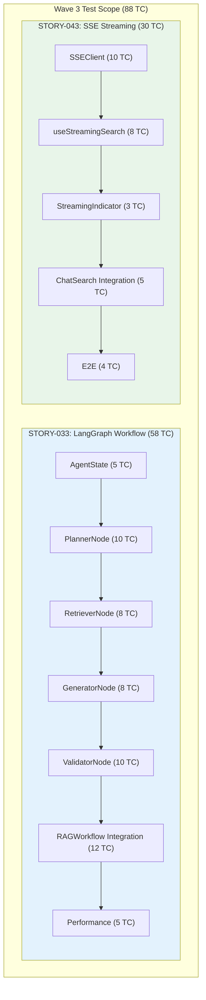
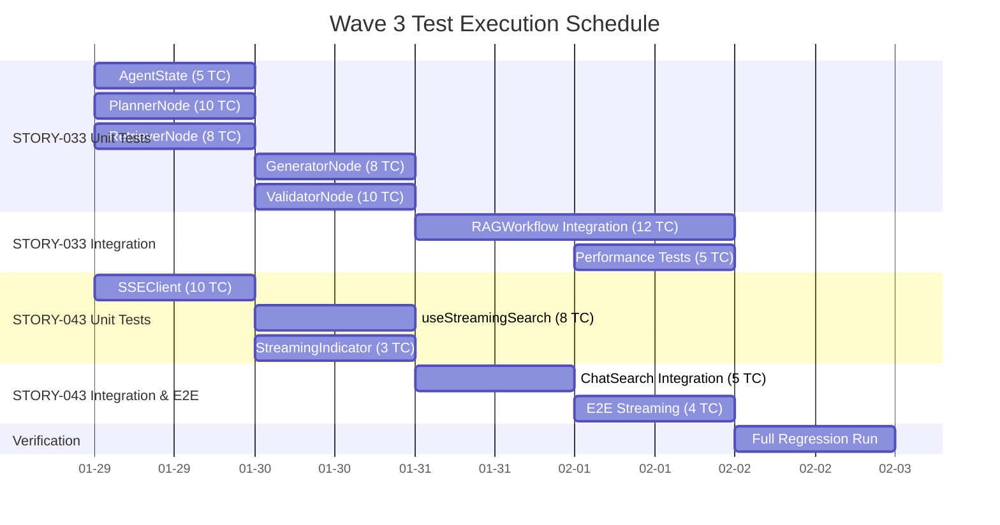

# Sprint 03 Wave 3 Test Plan

## STORY-033 (LangGraph Workflow) + STORY-043 (SSE Streaming)

**Version**: 1.0
**Created**: 2026-01-28
**Author**: QA Engineer (QA Agent)
**Sprint**: Sprint 03 Wave 3
**Status**: Active

---

## Document Information

| Item | Value |
|------|-------|
| **Document** | Sprint 03 Wave 3 Test Plan |
| **Version** | 1.0 |
| **Created** | 2026-01-28 |
| **Author** | QA Agent (Claude Opus 4.5) |
| **Status** | Active |
| **Related Stories** | STORY-033 (SCRUM-28, 8pts), STORY-043 (SCRUM-32, 3pts) |
| **Total Test Cases** | 88 (58 + 30) |
| **Related Docs** | [Unit/Integration Test Plan](./unit_integration_test_plan.md), [E2E Test Plan Sprint 02](./e2e_test_plan_sprint02.md), [Sprint 03 Plan](../../../backlog/sprints/sprint-03.md), [STORY-033](../../../backlog/stories/STORY-033-langgraph-workflow.md), [STORY-043](../../../backlog/stories/STORY-043-sse-streaming.md) |

---

## Change History

| Version | Date | Author | Description |
|---------|------|--------|-------------|
| 1.0 | 2026-01-28 | QA Agent | Initial creation - Wave 3 Test Plan (88 TC) |

---

## Table of Contents

1. [Overview](#1-overview)
2. [Test Scope Summary](#2-test-scope-summary)
3. [STORY-033: LangGraph Workflow Tests](#3-story-033-langgraph-workflow-tests)
   - [3.1 AgentState Tests](#31-agentstate-tests)
   - [3.2 PlannerNode Tests](#32-plannernode-tests)
   - [3.3 RetrieverNode Tests](#33-retrievernode-tests)
   - [3.4 GeneratorNode Tests](#34-generatornode-tests)
   - [3.5 ValidatorNode Tests](#35-validatornode-tests)
   - [3.6 RAGWorkflow Integration Tests](#36-ragworkflow-integration-tests)
   - [3.7 Performance Tests](#37-performance-tests)
4. [STORY-043: SSE Streaming Tests](#4-story-043-sse-streaming-tests)
   - [4.1 SSEClient Tests](#41-sseclient-tests)
   - [4.2 useStreamingSearch Tests](#42-usestreamingsearch-tests)
   - [4.3 StreamingIndicator Tests](#43-streamingindicator-tests)
   - [4.4 ChatSearch Integration Tests](#44-chatsearch-integration-tests)
   - [4.5 E2E Tests](#45-e2e-tests)
5. [Test Scenario Matrix](#5-test-scenario-matrix)
6. [Test Environment](#6-test-environment)
7. [Risks and Mitigations](#7-risks-and-mitigations)
8. [Execution Schedule](#8-execution-schedule)
9. [Quality Gates](#9-quality-gates)

---

## 1. Overview

### 1.1 Purpose

This document defines the comprehensive test plan for Sprint 03 Wave 3, covering two stories:

- **STORY-033** (8 pts, Critical): LangGraph-based RAG workflow with Planner, Retriever, Generator, and Validator nodes
- **STORY-043** (3 pts, Medium): SSE streaming response for real-time AI answer display

### 1.2 Test Architecture



### 1.3 Prerequisite Stories (Completed)

| Story | Description | Status | Dependency |
|-------|-------------|--------|------------|
| STORY-030 | HybridRetriever (43/43 tests) | Done | STORY-033 depends on this |
| STORY-031 | RRF Fusion (55/55 tests) | Done | STORY-033 uses RRF scores |
| STORY-032 | BGE Reranker (65 tests) | Done | STORY-033 uses reranking |
| STORY-042 | Search UI Components (11 files) | Done | STORY-043 extends ChatSearch |
| STORY-044 | Backend Search Service (32 tests) | Done | STORY-033/043 backend routing |

---

## 2. Test Scope Summary

### 2.1 In Scope

| Category | Story | Test Count | Priority | Tool |
|----------|-------|-----------|----------|------|
| AgentState | STORY-033 | 5 | P0/P1 | pytest |
| PlannerNode | STORY-033 | 10 | P0/P1 | pytest + mock |
| RetrieverNode | STORY-033 | 8 | P0/P1 | pytest + mock |
| GeneratorNode | STORY-033 | 8 | P0/P1 | pytest + mock |
| ValidatorNode | STORY-033 | 10 | P0/P1 | pytest + mock |
| RAGWorkflow Integration | STORY-033 | 12 | P0/P1/P2 | pytest + mock |
| Performance | STORY-033 | 5 | P1/P2 | pytest-benchmark / k6 |
| SSEClient | STORY-043 | 10 | P0/P1 | Vitest + jsdom |
| useStreamingSearch | STORY-043 | 8 | P0/P1 | Vitest + RTL |
| StreamingIndicator | STORY-043 | 3 | P1/P2 | Vitest + RTL |
| ChatSearch Integration | STORY-043 | 5 | P1/P2 | Vitest + RTL |
| E2E | STORY-043 | 4 | P1/P2 | Playwright |
| **Total** | | **88** | | |

### 2.2 Out of Scope

| Item | Reason | Expected Sprint |
|------|--------|----------------|
| RAGAS Quality Evaluation | Requires production data + full pipeline | Sprint 04 |
| k6 Load Test (full) | After functional tests pass | Sprint 04 |
| Multi-browser SSE testing | Chromium-only first | Sprint 04 |
| Mobile responsive streaming | Desktop-first | Sprint 04 |

---

## 3. STORY-033: LangGraph Workflow Tests

### 3.1 AgentState Tests

**File**: `ai_service/tests/test_agent_state.py`
**Test Approach**: TDD (data validation / state machine)

| Test ID | Test Name | Priority | Precondition | Test Steps | Expected Result | Automatable |
|---------|-----------|----------|--------------|------------|-----------------|-------------|
| W3-033-AS-001 | AgentState default initialization | P0 | AgentState class defined | 1. Create AgentState with only `query` and `conversation_history` 2. Check all other fields | All optional fields have default values: `search_strategy="hybrid"`, `refined_query=""`, `documents=[]`, `context=""`, `answer=""`, `sources=[]`, `steps=[]`, `error=None` | Yes |
| W3-033-AS-002 | AgentState required fields validation | P0 | AgentState class defined | 1. Attempt to create AgentState without `query` field 2. Observe error | TypeError or validation error raised; `query` is mandatory | Yes |
| W3-033-AS-003 | AgentState field type validation | P1 | AgentState class defined | 1. Create AgentState with `query="test"` 2. Set `search_strategy` to invalid value (e.g., `"invalid"`) 3. Validate type | `search_strategy` must be one of `Literal["keyword", "semantic", "hybrid"]`; invalid values are caught at validation time or runtime | Yes |
| W3-033-AS-004 | AgentState serialization to dict | P1 | AgentState instance created | 1. Create AgentState with all fields populated 2. Convert to dict (if TypedDict, access as dict) 3. Verify all keys present | Dict contains all 10 keys: `query`, `conversation_history`, `search_strategy`, `refined_query`, `documents`, `context`, `answer`, `sources`, `steps`, `error` | Yes |
| W3-033-AS-005 | AgentState immutable update pattern | P1 | AgentState instance created | 1. Create initial state `s1` 2. Create updated state `s2 = {**s1, "search_strategy": "keyword"}` 3. Verify `s1` unchanged, `s2` has new value | Original state unmodified; new state has updated `search_strategy="keyword"` while retaining all other values from `s1` | Yes |

---

### 3.2 PlannerNode Tests

**File**: `ai_service/tests/test_planner_node.py`
**Test Approach**: TDD (strategy selection = business rule / LLM response parsing = data conversion)

| Test ID | Test Name | Priority | Precondition | Test Steps | Expected Result | Automatable |
|---------|-----------|----------|--------------|------------|-----------------|-------------|
| W3-033-PN-001 | Planner selects keyword strategy for specific term query | P0 | PlannerNode initialized with mocked LLM | 1. Mock LLM to return `"strategy: keyword\nrefined_query: JWT 인증 필터"` 2. Call planner with `state["query"] = "JWT 인증 필터 코드"` | `state["search_strategy"] == "keyword"`, `state["refined_query"] == "JWT 인증 필터"`, `"planner"` in `state["steps"]` | Yes |
| W3-033-PN-002 | Planner selects semantic strategy for conceptual query | P0 | PlannerNode initialized with mocked LLM | 1. Mock LLM to return `"strategy: semantic\nrefined_query: RAG 시스템 작동 원리"` 2. Call planner with `state["query"] = "RAG 시스템은 어떻게 동작하나요?"` | `state["search_strategy"] == "semantic"`, `state["refined_query"] == "RAG 시스템 작동 원리"` | Yes |
| W3-033-PN-003 | Planner selects hybrid strategy for complex query | P0 | PlannerNode initialized with mocked LLM | 1. Mock LLM to return `"strategy: hybrid\nrefined_query: 프로젝트X 보안 감사 이슈 해결 방법"` 2. Call planner with complex query containing multiple conditions | `state["search_strategy"] == "hybrid"` | Yes |
| W3-033-PN-004 | Planner defaults to hybrid on ambiguous LLM response | P0 | PlannerNode with mocked LLM | 1. Mock LLM to return malformed response (no `strategy:` line) 2. Call planner | `state["search_strategy"] == "hybrid"` (default fallback), `state["refined_query"] == state["query"]` (original query preserved) | Yes |
| W3-033-PN-005 | Planner handles empty query gracefully | P1 | PlannerNode with mocked LLM | 1. Call planner with `state["query"] = ""` | Node executes without crash; `search_strategy` is set (default `"hybrid"`); `steps` includes `"planner"` | Yes |
| W3-033-PN-006 | Planner refines Korean query correctly | P1 | PlannerNode with mocked LLM returning Korean refined query | 1. Mock LLM to return `"refined_query: 한국어 문서 파싱 방법"` 2. Call planner with Korean input | Korean characters preserved in `refined_query`; no encoding issues | Yes |
| W3-033-PN-007 | Planner handles LLM timeout error | P0 | PlannerNode with LLM that raises TimeoutError | 1. Mock LLM `ainvoke` to raise `asyncio.TimeoutError` 2. Call planner | `state["error"]` is set with timeout message; `state["search_strategy"]` defaults to `"hybrid"` | Yes |
| W3-033-PN-008 | Planner handles LLM API error | P0 | PlannerNode with LLM that raises Exception | 1. Mock LLM `ainvoke` to raise `Exception("API Error")` 2. Call planner | `state["error"]` is set; node does not crash; fallback behavior activated | Yes |
| W3-033-PN-009 | Planner appends to existing steps | P1 | PlannerNode with mocked LLM | 1. Create state with `steps=["init"]` 2. Call planner | `state["steps"] == ["init", "planner"]`; existing steps not overwritten | Yes |
| W3-033-PN-010 | Planner preserves conversation history | P1 | PlannerNode with mocked LLM | 1. Create state with `conversation_history=[{"role":"user","content":"prev"}]` 2. Call planner | `state["conversation_history"]` unchanged; history passed through | Yes |

---

### 3.3 RetrieverNode Tests

**File**: `ai_service/tests/test_retriever_node.py`
**Test Approach**: TDD (weight calculation = algorithm / retrieval integration = external interaction)

| Test ID | Test Name | Priority | Precondition | Test Steps | Expected Result | Automatable |
|---------|-----------|----------|--------------|------------|-----------------|-------------|
| W3-033-RN-001 | Retriever uses keyword weights for keyword strategy | P0 | RetrieverNode with mocked HybridRetriever | 1. Set `state["search_strategy"] = "keyword"` 2. Call retriever | `retriever.retrieve` called with `es_weight=0.3, neo4j_weight=0.7` | Yes |
| W3-033-RN-002 | Retriever uses semantic weights for semantic strategy | P0 | RetrieverNode with mocked HybridRetriever | 1. Set `state["search_strategy"] = "semantic"` 2. Call retriever | `retriever.retrieve` called with `es_weight=0.8, neo4j_weight=0.2` | Yes |
| W3-033-RN-003 | Retriever uses balanced weights for hybrid strategy | P0 | RetrieverNode with mocked HybridRetriever | 1. Set `state["search_strategy"] = "hybrid"` 2. Call retriever | `retriever.retrieve` called with `es_weight=0.5, neo4j_weight=0.5` | Yes |
| W3-033-RN-004 | Retriever builds context from documents | P0 | RetrieverNode returns 3 mock documents | 1. Mock retriever to return 3 documents with `content` and `metadata.doc_title` 2. Call retriever node | `state["context"]` contains all 3 document contents separated by `---`; each prefixed with `[문서: {title}]` | Yes |
| W3-033-RN-005 | Retriever handles empty results | P1 | RetrieverNode with mocked retriever returning [] | 1. Mock retriever to return empty list 2. Call retriever node | `state["documents"] == []`, `state["context"] == ""`, `state["steps"]` includes `"retriever"`, no exception raised | Yes |
| W3-033-RN-006 | Retriever uses refined_query from planner | P1 | RetrieverNode with mocked retriever | 1. Set `state["refined_query"] = "optimized search term"` 2. Call retriever node | `retriever.retrieve` called with `query="optimized search term"` (not original query) | Yes |
| W3-033-RN-007 | Retriever handles retriever service failure | P0 | RetrieverNode with mocked retriever that raises Exception | 1. Mock retriever to raise `ConnectionError` 2. Call retriever node | `state["error"]` is set with error message; `state["documents"]` is empty; node does not crash | Yes |
| W3-033-RN-008 | Retriever converts documents to dict format | P1 | RetrieverNode returns document objects | 1. Mock retriever to return document objects with `to_dict()` method 2. Call retriever node | `state["documents"]` contains serialized dicts (not objects); each dict has `id`, `content`, `metadata` keys | Yes |

---

### 3.4 GeneratorNode Tests

**File**: `ai_service/tests/test_generator_node.py`
**Test Approach**: TDD (response generation = external interaction / source extraction = data conversion)

| Test ID | Test Name | Priority | Precondition | Test Steps | Expected Result | Automatable |
|---------|-----------|----------|--------------|------------|-----------------|-------------|
| W3-033-GN-001 | Generator produces answer from context | P0 | GeneratorNode with mocked LLM | 1. Set `state["context"]` with document text 2. Set `state["query"]` with question 3. Mock LLM to return answer text 4. Call generator | `state["answer"]` is non-empty string; `"generator"` in `state["steps"]` | Yes |
| W3-033-GN-002 | Generator extracts sources from documents | P0 | GeneratorNode with mocked LLM | 1. Set `state["documents"]` with 3 docs each having `metadata.doc_title` and `id` 2. Call generator | `state["sources"]` has 3 entries; each has `title` and `chunk_id` matching input documents | Yes |
| W3-033-GN-003 | Generator handles empty context | P0 | GeneratorNode with mocked LLM | 1. Set `state["context"] = ""` and `state["documents"] = []` 2. Mock LLM to return "관련 정보를 찾을 수 없습니다" 3. Call generator | `state["answer"]` contains fallback message; `state["sources"] == []` | Yes |
| W3-033-GN-004 | Generator passes context and query to prompt | P1 | GeneratorNode with mocked LLM | 1. Set context and query 2. Call generator 3. Capture LLM invocation args | LLM prompt includes both `context` and `query` content; prompt formatted correctly | Yes |
| W3-033-GN-005 | Generator handles LLM timeout | P0 | GeneratorNode with mocked LLM raising timeout | 1. Mock LLM `ainvoke` to raise `asyncio.TimeoutError` 2. Call generator | `state["error"]` set with timeout message; `state["answer"]` is empty or contains error indicator | Yes |
| W3-033-GN-006 | Generator handles LLM rate limit error | P1 | GeneratorNode with mocked LLM raising rate limit | 1. Mock LLM to raise rate limit exception 2. Call generator | `state["error"]` set; graceful handling without crash | Yes |
| W3-033-GN-007 | Generator preserves source metadata with missing fields | P1 | GeneratorNode with documents missing `doc_title` | 1. Set `state["documents"]` where one doc has no `metadata.doc_title` 2. Call generator | `state["sources"]` includes entry with `title=None` or default value; no KeyError | Yes |
| W3-033-GN-008 | Generator produces Korean answer | P1 | GeneratorNode with mocked LLM returning Korean | 1. Mock LLM to return Korean answer 2. Call generator | `state["answer"]` contains Korean text properly encoded; no garbled characters | Yes |

---

### 3.5 ValidatorNode Tests

**File**: `ai_service/tests/test_validator_node.py`
**Test Approach**: TDD (quality validation = business rule / retry logic = state machine)

| Test ID | Test Name | Priority | Precondition | Test Steps | Expected Result | Automatable |
|---------|-----------|----------|--------------|------------|-----------------|-------------|
| W3-033-VN-001 | Validator passes high-quality answer (Faithfulness >= 0.9) | P0 | ValidatorNode initialized with mocked evaluator | 1. Mock evaluator to return `faithfulness=0.95, relevancy=0.90` 2. Call validator with state containing answer and context | Validation passes; `state["steps"]` includes `"validator"`; no retry triggered | Yes |
| W3-033-VN-002 | Validator fails on low faithfulness | P0 | ValidatorNode with mocked evaluator | 1. Mock evaluator to return `faithfulness=0.5, relevancy=0.90` 2. Call validator | Validation fails; return value indicates re-retrieval needed; `state["error"]` or flag indicates "faithfulness below threshold" | Yes |
| W3-033-VN-003 | Validator fails on low relevancy | P0 | ValidatorNode with mocked evaluator | 1. Mock evaluator to return `faithfulness=0.95, relevancy=0.6` 2. Call validator | Validation fails; indicates answer not relevant enough | Yes |
| W3-033-VN-004 | Validator triggers re-retrieval on first failure | P0 | ValidatorNode with retry logic | 1. Mock evaluator to return low scores 2. Set `state["retry_count"] = 0` 3. Call validator | Returns routing decision to go back to `"retriever"` node; `state["retry_count"]` incremented to 1 | Yes |
| W3-033-VN-005 | Validator stops retry after max attempts (3) | P0 | ValidatorNode with retry logic | 1. Mock evaluator to always return low scores 2. Set `state["retry_count"] = 3` (max reached) 3. Call validator | Returns routing to `END` (not retriever); answer delivered with quality warning; `state["steps"]` includes `"validator_max_retry"` | Yes |
| W3-033-VN-006 | Validator accepts borderline score (exactly threshold) | P1 | ValidatorNode with mocked evaluator | 1. Mock evaluator to return `faithfulness=0.9` (exact threshold) 2. Call validator | Validation passes (threshold is `>=`); no retry triggered | Yes |
| W3-033-VN-007 | Validator handles evaluator exception | P0 | ValidatorNode with evaluator that raises Exception | 1. Mock evaluator to raise `Exception("Evaluation failed")` 2. Call validator | `state["error"]` set; answer passes through (fail-open policy for availability); node does not crash | Yes |
| W3-033-VN-008 | Validator handles empty answer | P1 | ValidatorNode with empty answer | 1. Set `state["answer"] = ""` 2. Call validator | Validation fails; triggers re-retrieval or returns error message | Yes |
| W3-033-VN-009 | Validator handles empty context (no documents) | P1 | ValidatorNode with empty context | 1. Set `state["context"] = ""` and `state["documents"] = []` 2. Call validator | Validation fails; faithfulness cannot be assessed; appropriate fallback behavior | Yes |
| W3-033-VN-010 | Validator increments retry count correctly | P1 | ValidatorNode with retry tracking | 1. Start with `retry_count=0` 2. Fail validation 3 times in sequence 3. Check retry_count after each | `retry_count` increments: 0 -> 1 -> 2 -> 3; at 3, max retry reached, no more re-retrieval | Yes |

---

### 3.6 RAGWorkflow Integration Tests

**File**: `ai_service/tests/test_rag_workflow.py`
**Test Approach**: TDD (workflow orchestration = state machine / error propagation = error handling)

| Test ID | Test Name | Priority | Precondition | Test Steps | Expected Result | Automatable |
|---------|-----------|----------|--------------|------------|-----------------|-------------|
| W3-033-WF-001 | Full pipeline execution: Planner -> Retriever -> Generator -> Validator -> END | P0 | All nodes mocked, RAGWorkflow compiled | 1. Create workflow with all mocked nodes 2. Call `workflow.run("test query")` 3. Verify execution order | Result contains: `steps=["planner", "retriever", "generator", "validator"]`; `answer` is non-empty; `sources` populated; `error` is None | Yes |
| W3-033-WF-002 | Workflow with re-retrieval loop (validator fails once) | P0 | Validator fails first, passes second | 1. Mock validator to fail on first call, pass on second 2. Run workflow | `steps` shows: `["planner", "retriever", "generator", "validator", "retriever", "generator", "validator"]`; final answer passes validation | Yes |
| W3-033-WF-003 | Workflow with max retries exhausted | P0 | Validator always fails | 1. Mock validator to always return low scores 2. Set max_retries=3 3. Run workflow | Workflow terminates after 3 retry cycles; `answer` delivered with quality warning; `error` or `warning` field set | Yes |
| W3-033-WF-004 | Workflow streaming mode outputs chunks | P0 | All nodes mocked, streaming enabled | 1. Call `workflow.stream("test query")` 2. Collect all chunks from async generator | Yields intermediate state after each node execution; minimum 4 chunks (one per node); final chunk has complete state | Yes |
| W3-033-WF-005 | Workflow error propagation from Planner | P1 | PlannerNode raises exception | 1. Mock planner to raise `RuntimeError` 2. Run workflow | Workflow terminates gracefully; `state["error"]` contains error message; subsequent nodes not executed | Yes |
| W3-033-WF-006 | Workflow error propagation from Retriever | P1 | RetrieverNode raises exception | 1. Mock retriever to raise `ConnectionError` 2. Run workflow | `state["error"]` set; `steps` shows `["planner"]` (retriever failed); generator not called | Yes |
| W3-033-WF-007 | Workflow error propagation from Generator | P1 | GeneratorNode raises exception | 1. Mock generator to raise `TimeoutError` 2. Run workflow | `state["error"]` set; `steps` shows `["planner", "retriever"]`; validator not called | Yes |
| W3-033-WF-008 | Workflow preserves conversation history | P1 | Workflow with conversation history | 1. Create state with `conversation_history=[{"role":"user","content":"prev"}]` 2. Run workflow 3. Check final state | `conversation_history` preserved throughout all nodes; not modified or lost | Yes |
| W3-033-WF-009 | Workflow with empty query | P1 | Workflow initialized | 1. Call `workflow.run("")` | Workflow handles empty query gracefully; either returns error state or processes with defaults; no crash | Yes |
| W3-033-WF-010 | Workflow with very long query (>2000 chars) | P2 | Workflow initialized | 1. Create query string of 2500 characters 2. Run workflow | Workflow processes without crash; query may be truncated by planner; no memory issues | Yes |
| W3-033-WF-011 | Workflow concurrent execution (3 simultaneous) | P2 | Workflow initialized | 1. Launch 3 concurrent `workflow.run()` calls with different queries using `asyncio.gather` | All 3 complete without interference; each has correct independent state; no shared state corruption | Yes |
| W3-033-WF-012 | Workflow initial state construction | P1 | RAGWorkflow class | 1. Call `workflow.run("test")` 2. Capture initial state passed to first node | Initial state has: `query="test"`, `search_strategy="hybrid"`, `steps=[]`, `error=None`, all other fields at defaults | Yes |

---

### 3.7 Performance Tests

**File**: `ai_service/tests/test_rag_performance.py`
**Test Approach**: Test-Along (performance benchmarks)

| Test ID | Test Name | Priority | Precondition | Test Steps | Expected Result | Automatable |
|---------|-----------|----------|--------------|------------|-----------------|-------------|
| W3-033-PF-001 | RAG workflow response time < 3 seconds (P95) | P1 | Workflow with mocked external services (LLM latency simulated at 500ms) | 1. Run workflow 20 times 2. Measure end-to-end time for each 3. Calculate P95 | P95 latency < 3 seconds; median latency < 2 seconds | Yes |
| W3-033-PF-002 | Individual node latency breakdown | P1 | Workflow with timing instrumentation | 1. Run workflow with timing per node 2. Record: planner_ms, retriever_ms, generator_ms, validator_ms | Planner < 500ms, Retriever < 1000ms, Generator < 1500ms, Validator < 500ms (with mocked LLM) | Yes |
| W3-033-PF-003 | Memory usage during workflow execution | P2 | Workflow initialized, memory profiler available | 1. Measure baseline memory 2. Run workflow 10 times 3. Measure peak memory | Peak memory increase < 100MB per execution; no memory leak (baseline restored after GC) | Yes |
| W3-033-PF-004 | Concurrent request handling (10 requests) | P2 | Workflow initialized | 1. Launch 10 concurrent workflow executions via `asyncio.gather` 2. Measure total time and success rate | All 10 complete successfully; total time < 10 seconds (parallelism benefit); no errors | Yes |
| W3-033-PF-005 | Streaming first-token latency (TTFB) | P1 | Streaming workflow with mocked LLM | 1. Call `workflow.stream("test")` 2. Measure time to first yielded chunk | First chunk received within 500ms (planner output); TTFB < 1 second | Yes |

---

## 4. STORY-043: SSE Streaming Tests

### 4.1 SSEClient Tests

**File**: `frontend/src/__tests__/shared/api/sse.test.ts`
**Test Approach**: TDD (connection management = state machine / reconnection = error handling)

| Test ID | Test Name | Priority | Precondition | Test Steps | Expected Result | Automatable |
|---------|-----------|----------|--------------|------------|-----------------|-------------|
| W3-043-SC-001 | SSEClient connects to URL and receives messages | P0 | EventSource mocked (jsdom) | 1. Create SSEClient with URL and onMessage callback 2. Call `connect()` 3. Simulate `onmessage` event with `{type:"token", content:"hello"}` | `onMessage` callback called with parsed data object; `eventSource` is not null | Yes |
| W3-043-SC-002 | SSEClient parses JSON message data | P0 | EventSource mocked | 1. Create SSEClient 2. Connect 3. Simulate message `event.data = '{"content":"test"}'` | `onMessage` receives `{content: "test"}`; no parse error | Yes |
| W3-043-SC-003 | SSEClient handles done event | P0 | EventSource mocked | 1. Create SSEClient with `onComplete` callback 2. Connect 3. Simulate message `{type:"done"}` | `onComplete` called; `eventSource.close()` called; connection terminated | Yes |
| W3-043-SC-004 | SSEClient handles malformed JSON gracefully | P1 | EventSource mocked | 1. Create SSEClient 2. Connect 3. Simulate message with invalid JSON `"not json"` | No exception thrown; `console.error` called with parse error; `onMessage` NOT called | Yes |
| W3-043-SC-005 | SSEClient reconnects on error (up to 3 times) | P0 | EventSource mocked | 1. Create SSEClient with `retries: 3` 2. Connect 3. Simulate `onerror` event 3 times | Reconnection attempted 3 times with increasing delay (1s, 2s, 3s); `onError` callback called each time | Yes |
| W3-043-SC-006 | SSEClient stops reconnecting after max retries | P0 | EventSource mocked | 1. Create SSEClient with `retries: 3` 2. Connect 3. Simulate `onerror` 4 times | After 3rd retry, no more reconnection attempts; `eventSource` is null | Yes |
| W3-043-SC-007 | SSEClient abort stops connection and prevents reconnect | P0 | EventSource mocked, connected | 1. Create SSEClient 2. Connect 3. Call `abort()` 4. Simulate `onerror` | `eventSource.close()` called; no reconnection attempted; `aborted` flag is true | Yes |
| W3-043-SC-008 | SSEClient close cleans up resources | P1 | EventSource mocked, connected | 1. Create SSEClient 2. Connect 3. Call `close()` | `eventSource.close()` called; `eventSource` set to null | Yes |
| W3-043-SC-009 | SSEClient does not connect when already aborted | P1 | SSEClient aborted | 1. Create SSEClient 2. Call `abort()` 3. Call `connect()` | `connect()` returns early; no EventSource created | Yes |
| W3-043-SC-010 | SSEClient resets retry count on successful message | P1 | EventSource mocked, previously errored | 1. Create SSEClient 2. Connect 3. Simulate error (retryCount becomes 1) 4. Reconnect succeeds 5. Simulate successful message | `retryCount` reset to 0; subsequent errors start retry from 0 | Yes |

---

### 4.2 useStreamingSearch Tests

**File**: `frontend/src/__tests__/features/search/hooks/useStreamingSearch.test.ts`
**Test Approach**: TDD (state management = business rule / SSE interaction = external integration)

| Test ID | Test Name | Priority | Precondition | Test Steps | Expected Result | Automatable |
|---------|-----------|----------|--------------|------------|-----------------|-------------|
| W3-043-US-001 | sendMessage adds user message and starts streaming | P0 | Hook rendered with mocked SSEClient and auth | 1. Render `useStreamingSearch` with `renderHook` 2. Call `sendMessage("test query")` | `messages` array has 2 entries: user message (`role: "user"`, `content: "test query"`) and empty assistant placeholder; `isStreaming` is `true` | Yes |
| W3-043-US-002 | Streaming tokens accumulate in assistant message | P0 | Hook rendered, SSEClient mocked | 1. Call `sendMessage` 2. Simulate SSE `onMessage` with `{content: "Hello"}` 3. Simulate `{content: " World"}` | Assistant message content is `"Hello World"`; content appended incrementally | Yes |
| W3-043-US-003 | onComplete sets isStreaming to false | P0 | Hook rendered, streaming active | 1. Call `sendMessage` 2. Simulate SSE messages 3. Simulate `onComplete` | `isStreaming` becomes `false`; messages finalized | Yes |
| W3-043-US-004 | cancelStream aborts SSE connection | P0 | Hook rendered, streaming active | 1. Call `sendMessage` 2. Call `cancelStream()` | `sseClient.abort()` called; `isStreaming` becomes `false` | Yes |
| W3-043-US-005 | Error event sets error state | P1 | Hook rendered, SSEClient mocked | 1. Call `sendMessage` 2. Simulate SSE `onError` | `error` is not null; `error.message` contains error description; `isStreaming` becomes `false` | Yes |
| W3-043-US-006 | Sources received via SSE update state | P1 | Hook rendered, SSEClient mocked | 1. Call `sendMessage` 2. Simulate SSE message with `{sources: [{title: "Doc1", chunk_id: "c1"}]}` | `sources` in stream state updated; sources available for display | Yes |
| W3-043-US-007 | clearMessages resets all state | P1 | Hook rendered, messages present | 1. Call `sendMessage` and complete streaming 2. Call `clearMessages()` | `messages` is empty array; `isStreaming` is `false`; `error` is null | Yes |
| W3-043-US-008 | Multiple sendMessage calls work sequentially | P1 | Hook rendered | 1. Call `sendMessage("first")` 2. Complete streaming 3. Call `sendMessage("second")` | `messages` has 4 entries (2 user + 2 assistant); each pair correct; second streaming works independently | Yes |

---

### 4.3 StreamingIndicator Tests

**File**: `frontend/src/__tests__/features/search/components/StreamingIndicator.test.tsx`
**Test Approach**: Test-Along (simple UI component)

| Test ID | Test Name | Priority | Precondition | Test Steps | Expected Result | Automatable |
|---------|-----------|----------|--------------|------------|-----------------|-------------|
| W3-043-SI-001 | StreamingIndicator renders with correct text | P1 | Component defined | 1. Render `<StreamingIndicator />` 2. Query for text content | Text "응답 생성 중..." is visible in the document | Yes |
| W3-043-SI-002 | StreamingIndicator has pulse animation | P2 | Component defined | 1. Render `<StreamingIndicator />` 2. Query the indicator dot element | Element has `animate-pulse` class (Tailwind) or equivalent animation applied | Yes |
| W3-043-SI-003 | StreamingIndicator is accessible | P1 | Component defined | 1. Render `<StreamingIndicator />` 2. Check for `role` or `aria-label` | Component has appropriate ARIA attributes (e.g., `aria-live="polite"` or `role="status"`) for screen readers | Yes |

---

### 4.4 ChatSearch Integration Tests

**File**: `frontend/src/__tests__/features/search/ChatSearch.test.tsx`
**Test Approach**: Test-Along (component integration)

| Test ID | Test Name | Priority | Precondition | Test Steps | Expected Result | Automatable |
|---------|-----------|----------|--------------|------------|-----------------|-------------|
| W3-043-CS-001 | ChatSearch renders input and message list | P1 | ChatSearch component with mocked hook | 1. Render `<ChatSearch />` with mocked `useStreamingSearch` 2. Check for input field and message area | Chat input visible; message list area rendered; no messages initially | Yes |
| W3-043-CS-002 | ChatSearch shows StreamingIndicator during streaming | P1 | ChatSearch with isStreaming=true | 1. Mock `useStreamingSearch` to return `isStreaming: true` 2. Render `<ChatSearch />` | `StreamingIndicator` visible; "응답 생성 중..." text present | Yes |
| W3-043-CS-003 | ChatSearch hides StreamingIndicator when not streaming | P1 | ChatSearch with isStreaming=false | 1. Mock `useStreamingSearch` to return `isStreaming: false` 2. Render `<ChatSearch />` | `StreamingIndicator` NOT in document; no animation elements | Yes |
| W3-043-CS-004 | ChatSearch cancel button appears during streaming | P2 | ChatSearch with isStreaming=true | 1. Mock hook with `isStreaming: true` and `cancelStream` function 2. Render 3. Find cancel button 4. Click cancel | Cancel button/icon visible; clicking calls `cancelStream`; input is disabled during streaming | Yes |
| W3-043-CS-005 | ChatSearch displays sources after streaming completes | P2 | ChatSearch with completed streaming | 1. Mock hook with messages including assistant message with `sources: [{title:"Doc1"}]` 2. Render | Source information displayed near the assistant message; "Doc1" title visible | Yes |

---

### 4.5 E2E Tests

**File**: `frontend/e2e/streaming-search.spec.ts`
**Test Approach**: E2E (Playwright, full browser interaction)

| Test ID | Test Name | Priority | Precondition | Test Steps | Expected Result | Automatable |
|---------|-----------|----------|--------------|------------|-----------------|-------------|
| W3-043-E2-001 | Full streaming search flow | P1 | Frontend + Gateway + AI Service running, user authenticated | 1. Navigate to search page 2. Type query in chat input 3. Submit 4. Observe streaming response | User message appears; assistant response streams token-by-token; streaming indicator visible during generation; final answer complete | Yes |
| W3-043-E2-002 | Cancel streaming mid-response | P1 | Frontend running, streaming active | 1. Submit query 2. Wait for streaming to start 3. Click cancel button | Streaming stops; partial answer preserved in chat; streaming indicator disappears; no error shown | Yes |
| W3-043-E2-003 | Source documents displayed after streaming | P2 | Full pipeline running, documents indexed | 1. Submit query about indexed content 2. Wait for streaming to complete | Source documents listed below answer; each source has title and link; sources match retrieved documents | Yes |
| W3-043-E2-004 | Streaming error recovery with retry | P2 | Frontend running, simulated network instability | 1. Submit query 2. Simulate network interruption 3. Observe reconnection behavior | Reconnection attempted automatically; if successful, streaming resumes; if failed after 3 retries, error message shown to user | Yes |

---

## 5. Test Scenario Matrix

### 5.1 Priority Distribution

| Priority | STORY-033 | STORY-043 | Total | Pass Criteria |
|----------|:---------:|:---------:|:-----:|---------------|
| **P0 (Critical)** | 22 | 10 | **32** | 100% pass required |
| **P1 (High)** | 27 | 14 | **41** | 95% pass required |
| **P2 (Medium)** | 9 | 6 | **15** | 90% pass required |
| **Total** | **58** | **30** | **88** | |

### 5.2 Category Distribution

| Category | P0 | P1 | P2 | Total | Story |
|----------|:--:|:--:|:--:|:-----:|-------|
| AgentState | 2 | 3 | 0 | **5** | STORY-033 |
| PlannerNode | 4 | 6 | 0 | **10** | STORY-033 |
| RetrieverNode | 4 | 4 | 0 | **8** | STORY-033 |
| GeneratorNode | 3 | 5 | 0 | **8** | STORY-033 |
| ValidatorNode | 5 | 5 | 0 | **10** | STORY-033 |
| RAGWorkflow Integration | 4 | 6 | 2 | **12** | STORY-033 |
| Performance | 0 | 3 | 2 | **5** | STORY-033 |
| SSEClient | 5 | 5 | 0 | **10** | STORY-043 |
| useStreamingSearch | 4 | 4 | 0 | **8** | STORY-043 |
| StreamingIndicator | 0 | 2 | 1 | **3** | STORY-043 |
| ChatSearch Integration | 0 | 3 | 2 | **5** | STORY-043 |
| E2E (Streaming) | 0 | 2 | 2 | **4** | STORY-043 |

### 5.3 STORY Traceability

| Story ID | Jira ID | Related Test IDs | Count |
|----------|---------|-----------------|-------|
| STORY-033 | SCRUM-28 | W3-033-AS-001 ~ W3-033-PF-005 | 58 |
| STORY-043 | SCRUM-32 | W3-043-SC-001 ~ W3-043-E2-004 | 30 |

### 5.4 Acceptance Criteria Mapping

#### STORY-033 AC Coverage

| AC | Description | Test IDs |
|----|-------------|----------|
| AC1 | Planner -> Retriever -> Generator -> Validator execution order | W3-033-WF-001, W3-033-WF-002 |
| AC2 | Planner selects keyword/semantic/hybrid strategy | W3-033-PN-001, PN-002, PN-003 |
| AC3 | Generator produces context-based answer | W3-033-GN-001, GN-002 |
| AC4 | Streaming mode with token-level output | W3-033-WF-004, PF-005 |
| AC5 | Validator checks Faithfulness and Relevance | W3-033-VN-001, VN-002, VN-003 |
| AC6 | Validator triggers re-retrieval on failure | W3-033-VN-004, VN-005, WF-002, WF-003 |
| AC7 | State tracking throughout workflow | W3-033-WF-001, WF-008, WF-012 |

#### STORY-043 AC Coverage

| AC | Description | Test IDs |
|----|-------------|----------|
| AC1 | Token-level real-time display | W3-043-SC-001, US-002, E2-001 |
| AC2 | Append new tokens to existing response | W3-043-US-002, CS-002 |
| AC3 | Show sources on [DONE] event | W3-043-SC-003, US-003, US-006, CS-005, E2-003 |
| AC4 | Auto-reconnect on network error (3 times) | W3-043-SC-005, SC-006, E2-004 |
| AC5 | Cancel button stops SSE connection | W3-043-SC-007, US-004, CS-004, E2-002 |

---

## 6. Test Environment

### 6.1 STORY-033 Test Environment

| Component | Details | Purpose |
|-----------|---------|---------|
| Python | 3.11+ | Test runtime |
| pytest | 9.0.2+ | Test framework |
| pytest-asyncio | 0.23+ | Async test support |
| pytest-benchmark | 4.0+ | Performance measurement |
| unittest.mock | built-in | LLM and service mocking |
| LangGraph | latest | Workflow framework |
| LangChain Core | latest | Prompt templates |

### 6.2 STORY-043 Test Environment

| Component | Details | Purpose |
|-----------|---------|---------|
| Node.js | 20.x | Test runtime |
| Vitest | 1.x | Unit test framework |
| React Testing Library | 14.x | Component testing |
| @testing-library/react-hooks | latest | Hook testing |
| jsdom | latest | Browser DOM simulation |
| MSW | 2.x | API/SSE mocking |
| Playwright | 1.58+ | E2E browser tests |

### 6.3 Mock Strategy

#### STORY-033 Mocking

| Component | Mock Type | Reason |
|-----------|-----------|--------|
| LLM (DeepSeek) | `unittest.mock.AsyncMock` | Deterministic responses, no API cost |
| HybridRetriever | `unittest.mock.AsyncMock` | Isolate node logic from retrieval |
| Elasticsearch | `unittest.mock.Mock` | No infra dependency for unit tests |
| Neo4j | `unittest.mock.Mock` | No infra dependency for unit tests |
| Validator Evaluator | `unittest.mock.AsyncMock` | Deterministic quality scores |

#### STORY-043 Mocking

| Component | Mock Type | Reason |
|-----------|-----------|--------|
| EventSource | Custom jsdom mock | Browser API not available in Node.js |
| Auth (getToken) | `vi.fn()` | Isolate from Keycloak |
| SSE Server | MSW handler | Simulate streaming responses |
| crypto.randomUUID | `vi.fn()` | Deterministic message IDs |

---

## 7. Risks and Mitigations

| Risk ID | Risk | Impact | Probability | Mitigation |
|---------|------|--------|-------------|------------|
| R1 | LangGraph API changes between versions | STORY-033 tests break | Medium | Pin LangGraph version in requirements; monitor changelog |
| R2 | LLM mock does not reflect real response format | False positive tests | Medium | Use recorded real LLM responses as mock fixtures |
| R3 | EventSource not available in jsdom | STORY-043 unit tests fail | Low | Create custom EventSource mock class |
| R4 | Async test timeouts in CI | Flaky tests | Medium | Set generous timeouts; use `pytest-timeout` |
| R5 | ValidatorNode evaluator integration | Evaluation metrics not ready | High | Mock evaluator; defer real RAGAS to Sprint 04 |
| R6 | SSE browser compatibility | E2E fails on non-Chromium | Low | Run E2E on Chromium only for Sprint 03 |
| R7 | `langchain_openai` import issues | Tests cannot run | High | Ensure package in test requirements; use `--noconftest` if needed |
| R8 | Streaming state race conditions | Intermittent test failures | Medium | Use `act()` wrapper in RTL; add `waitFor` assertions |

---

## 8. Execution Schedule

### 8.1 Timeline



### 8.2 Milestones

| Milestone | Target Date | Completion Criteria |
|-----------|-------------|---------------------|
| M1: STORY-033 Node Unit Tests (41 TC) | 2026-01-30 | All P0 node tests pass |
| M2: STORY-043 Unit Tests (21 TC) | 2026-01-30 | SSEClient + hook tests pass |
| M3: Integration Tests (17 TC) | 2026-02-01 | Workflow + ChatSearch integration pass |
| M4: Full Wave 3 Suite (88 TC) | 2026-02-02 | 95%+ of all 88 tests pass |

### 8.3 Recommended Execution Order

| Phase | Tests | When | Dependencies |
|-------|-------|------|-------------|
| **Phase 1: Core Units** | AS + PN + RN + GN + VN + SC | Day 1-2 | None |
| **Phase 2: Hook & Component** | US + SI | Day 2-3 | SC must pass |
| **Phase 3: Integration** | WF + CS | Day 3-4 | Phase 1 + 2 must pass |
| **Phase 4: E2E + Perf** | E2 + PF | Day 4-5 | Phase 3 must pass |
| **Phase 5: Regression** | Full suite | Day 5 | All phases pass |

---

## 9. Quality Gates

### 9.1 Pass Criteria

| Metric | Threshold | Story |
|--------|-----------|-------|
| P0 Test Pass Rate | 100% (32/32) | Both |
| P1 Test Pass Rate | >= 95% (39/41) | Both |
| P2 Test Pass Rate | >= 90% (14/15) | Both |
| Overall Pass Rate | >= 95% (84/88) | Both |
| STORY-033 Node Coverage | >= 80% | STORY-033 |
| STORY-033 Workflow Coverage | >= 75% | STORY-033 |
| STORY-043 SSEClient Coverage | >= 90% | STORY-043 |
| STORY-043 Hook Coverage | >= 85% | STORY-043 |
| RAG P95 Latency | < 3 seconds | STORY-033 |
| Streaming TTFB | < 1 second | STORY-033/043 |

### 9.2 RAGAS Quality Gates (Deferred to Sprint 04)

| Metric | Target | Current Sprint | Note |
|--------|--------|---------------|------|
| Faithfulness | > 0.9 | Mocked at 0.95 | ValidatorNode threshold check only |
| Answer Relevancy | > 0.85 | Mocked at 0.90 | ValidatorNode threshold check only |
| Context Precision | > 0.8 | Not tested | Requires real data pipeline |

### 9.3 Exit Criteria

- All P0 (Critical) tests pass (32/32)
- No Critical or High severity defects remain
- LangGraph workflow executes full pipeline: Planner -> Retriever -> Generator -> Validator
- Validator re-retrieval loop verified (up to max retries)
- SSE streaming delivers token-by-token response
- SSE reconnection verified (3 attempts)
- Cancel/abort functionality confirmed
- Performance: RAG P95 < 3s, TTFB < 1s
- Test reports shared with PM

### 9.4 Defect Severity

| Severity | Definition | SLA |
|----------|-----------|-----|
| Critical | Workflow crash, data loss, infinite loop | Fix immediately, block release |
| High | Node failure not handled, streaming broken | Fix before sprint end |
| Medium | Suboptimal strategy selection, UI glitch | Fix next sprint |
| Low | Cosmetic, minor UX improvement | Backlog |

---

## Appendix A: Test Code Samples

### A.1 PlannerNode Test (Python)

```python
# ai_service/tests/test_planner_node.py
import pytest
from unittest.mock import AsyncMock, MagicMock
from workflows.nodes.planner import PlannerNode
from workflows.state import AgentState

@pytest.fixture
def mock_llm():
    llm = AsyncMock()
    return llm

@pytest.fixture
def planner(mock_llm):
    return PlannerNode(llm=mock_llm)

@pytest.fixture
def initial_state():
    return AgentState(
        query="JWT 인증 필터 코드",
        conversation_history=[],
        search_strategy="hybrid",
        refined_query="",
        documents=[],
        context="",
        answer="",
        sources=[],
        steps=[],
        error=None,
    )

@pytest.mark.asyncio
async def test_planner_selects_keyword_strategy(planner, mock_llm, initial_state):
    """W3-033-PN-001: Planner selects keyword strategy for specific term query"""
    # Given
    mock_response = MagicMock()
    mock_response.content = "strategy: keyword\nrefined_query: JWT 인증 필터"
    mock_llm.ainvoke.return_value = mock_response

    # When
    result = await planner(initial_state)

    # Then
    assert result["search_strategy"] == "keyword"
    assert result["refined_query"] == "JWT 인증 필터"
    assert "planner" in result["steps"]
```

### A.2 SSEClient Test (TypeScript)

```typescript
// frontend/src/__tests__/shared/api/sse.test.ts
import { describe, it, expect, vi, beforeEach } from 'vitest';
import { SSEClient } from '../../../shared/api/sse';

// Mock EventSource
class MockEventSource {
  onmessage: ((event: MessageEvent) => void) | null = null;
  onerror: ((event: Event) => void) | null = null;
  close = vi.fn();
  constructor(public url: string) {}
}

vi.stubGlobal('EventSource', MockEventSource);

describe('SSEClient', () => {
  let onMessage: ReturnType<typeof vi.fn>;
  let onError: ReturnType<typeof vi.fn>;
  let onComplete: ReturnType<typeof vi.fn>;

  beforeEach(() => {
    onMessage = vi.fn();
    onError = vi.fn();
    onComplete = vi.fn();
  });

  it('W3-043-SC-001: connects and receives messages', () => {
    // Given
    const client = new SSEClient('/api/stream', {
      onMessage,
      onError,
      onComplete,
    });

    // When
    client.connect();
    const es = (client as any).eventSource as MockEventSource;
    es.onmessage!({ data: '{"content":"hello"}' } as MessageEvent);

    // Then
    expect(onMessage).toHaveBeenCalledWith({ content: 'hello' });
  });

  it('W3-043-SC-003: handles done event', () => {
    // Given
    const client = new SSEClient('/api/stream', {
      onMessage,
      onComplete,
    });

    // When
    client.connect();
    const es = (client as any).eventSource as MockEventSource;
    es.onmessage!({ data: '{"type":"done"}' } as MessageEvent);

    // Then
    expect(onComplete).toHaveBeenCalled();
    expect(es.close).toHaveBeenCalled();
  });
});
```

---

## Appendix B: Test ID Naming Convention

```
W3-{STORY}-{CATEGORY}-{NUMBER}

Where:
  W3       = Wave 3
  STORY    = 033 or 043
  CATEGORY = AS (AgentState), PN (Planner), RN (Retriever),
             GN (Generator), VN (Validator), WF (Workflow),
             PF (Performance), SC (SSEClient), US (useStreamingSearch),
             SI (StreamingIndicator), CS (ChatSearch), E2 (E2E)
  NUMBER   = 001-999
```

---

## Appendix C: Related Documents

| Document | Location | Description |
|----------|----------|-------------|
| Unit/Integration Test Plan | [unit_integration_test_plan.md](./unit_integration_test_plan.md) | Overall test strategy and TDD guidelines |
| E2E Test Plan Sprint 02 | [e2e_test_plan_sprint02.md](./e2e_test_plan_sprint02.md) | Previous sprint E2E test reference |
| Sprint 03 QA Report Day 2 | [sprint03_day2_qa_report.md](./sprint03_day2_qa_report.md) | Current test environment status |
| STORY-033 Backlog | [STORY-033-langgraph-workflow.md](../../../backlog/stories/STORY-033-langgraph-workflow.md) | Story details and technical notes |
| STORY-043 Backlog | [STORY-043-sse-streaming.md](../../../backlog/stories/STORY-043-sse-streaming.md) | Story details and technical notes |
| Sprint 03 Plan | [sprint-03.md](../../../backlog/sprints/sprint-03.md) | Sprint plan and schedule |
| Hybrid RAG Design | [hybrid_rag_platform_detailed_design.md](../02_design/01_hybrid_rag_platform_detailed_design.md) | Architecture reference |

---

**Document End**

**Created**: QA Agent (Claude Opus 4.5)
**Date**: 2026-01-28
**Sprint**: Sprint 03 Wave 3
