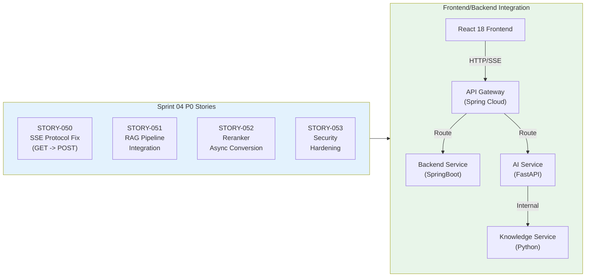
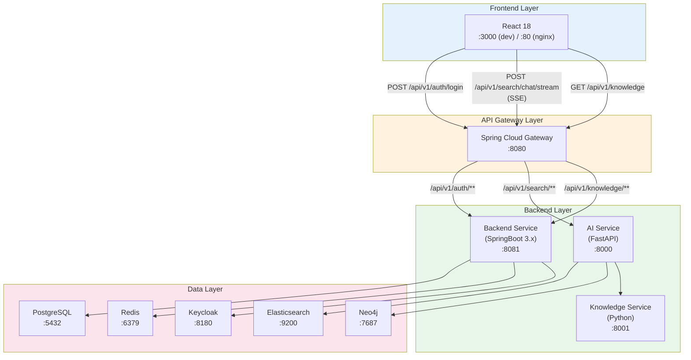

# Sprint 04 Frontend/Backend E2E Test Plan

## Frontend <-> Backend API Gateway Integration End-to-End Test Plan

**Version**: 1.0
**Created**: 2026-01-28
**Author**: QA Engineer (QA Agent)
**Sprint**: Sprint 04 Day 2
**Status**: Active

---

## Document Information

| Item | Value |
|------|-------|
| **Document** | Sprint 04 Frontend/Backend E2E Test Plan |
| **Version** | 1.0 |
| **Created** | 2026-01-28 |
| **Author** | QA Agent (Claude Opus 4.5) |
| **Status** | Active |
| **Related Stories** | STORY-050 (SSE Protocol), STORY-051 (RAG Pipeline Integration), STORY-052 (Reranker Async), STORY-053 (Security Hardening) |
| **Week 2 QA Stories** | STORY-054 (Contract Test), STORY-055 (Security Test) |
| **Total Test Scenarios** | 25 (across 5 categories) |
| **Related Docs** | [Sprint 04 E2E Test Plan](./sprint04_e2e_test_plan.md), [Sprint 02 E2E Plan](./e2e_test_plan_sprint02.md), [API Integration Design](../02_design/04_api_integration_design.md), [Security Issue Report](../02_design/review/2026-01-28_sprint04_security_issue_report.md), [Unit/Integration Test Plan](./unit_integration_test_plan.md), [Day 1 E2E Results](../results/sprint04_day1_e2e_test_results.md) |

---

## Change History

| Version | Date | Author | Description |
|---------|------|--------|-------------|
| 1.0 | 2026-01-28 | QA Agent | Initial creation - Frontend/Backend E2E Test Plan (25 scenarios across 5 categories) |

---

## Table of Contents

1. [Overview](#1-overview)
2. [Test Scope](#2-test-scope)
3. [Test Environment](#3-test-environment)
4. [Test Scenarios](#4-test-scenarios)
   - [Category A: Authentication Flow](#category-a-authentication-flow-5-scenarios)
   - [Category B: Search Flow](#category-b-search-flow-5-scenarios)
   - [Category C: SSE Streaming](#category-c-sse-streaming-5-scenarios)
   - [Category D: Security Verification](#category-d-security-verification-5-scenarios)
   - [Category E: Error Handling](#category-e-error-handling-5-scenarios)
5. [Test Execution Plan](#5-test-execution-plan)
6. [Success Criteria](#6-success-criteria)
7. [Risks and Mitigations](#7-risks-and-mitigations)
8. [Traceability Matrix](#8-traceability-matrix)
9. [Appendices](#9-appendices)

---

## 1. Overview

### 1.1 Purpose

This document defines the Frontend-to-Backend End-to-End (E2E) test plan for Sprint 04. It focuses specifically on the **integration boundary** between the React 18 Frontend and the SpringBoot/FastAPI Backend services, validating user-facing flows that traverse the full stack via the API Gateway.

While the [Sprint 04 E2E Test Plan](./sprint04_e2e_test_plan.md) covers per-story E2E tests (78 test cases), this document takes a **cross-cutting, user-journey perspective** that validates the Frontend-Backend contract as a unified system.

### 1.2 Key Differentiator

| Aspect | sprint04_e2e_test_plan.md | This Document |
|--------|--------------------------|---------------|
| **Perspective** | Per-story validation (78 TC) | User-journey validation (25 scenarios) |
| **Focus** | Individual story ACs | Frontend <-> Backend integration boundary |
| **Entry Point** | API-level (httpx/pytest) | Browser + API (Playwright + pytest) |
| **Primary Concern** | Feature correctness | Cross-service contract, UX flow |
| **Coverage** | STORY-050/051/052/053 individually | All stories as integrated system |

### 1.3 Sprint 04 Context

Sprint 04 addresses critical issues identified in the Sprint 03 completion review:



### 1.4 Day 1 Test Results Baseline

From the [Sprint 04 Day 1 E2E Test Results](../results/sprint04_day1_e2e_test_results.md):

| Area | Pass Rate | Known Issues |
|------|-----------|-------------|
| STORY-050 (SSE) | 98.6% (71/72) | Token streaming whitespace (1 FAIL) |
| STORY-051 (RAG Pipeline) | 72.4% (21/29) | ES helpers missing, async mock (environment) |
| STORY-053 (Security) | 100% (52/52) | All tests passed |
| **Overall** | **97.4% (733/756)** | 9 failures (2 code bugs, 6 env, 1 test code) |

### 1.5 Security Context

From the [Sprint 04 Security Issue Report](../02_design/review/2026-01-28_sprint04_security_issue_report.md):

| # | Vulnerability | OWASP | Severity | Status |
|---|--------------|-------|----------|--------|
| 1 | JWT Secret Hardcoding | A02:2021 | Critical | Resolved (Backend) |
| 2 | Plaintext Password Storage | A02:2021 | Critical | Resolved (Backend) |
| 3 | Default Credentials | A07:2021 | Critical | Resolved |
| 4 | No Rate Limiting | A07:2021 | High | **Unresolved** (Python service) |
| 5 | Weak Input Validation | A03:2021 | Medium | Resolved |

---

## 2. Test Scope

### 2.1 In Scope

| Area | Description | Related Stories |
|------|-------------|-----------------|
| Frontend <-> Backend API Gateway Integration | Full routing chain: Nginx -> Gateway -> Backend/AI Service | All |
| SSE Streaming (POST /api/v1/search/chat/stream) | POST-based Server-Sent Events protocol | STORY-050 |
| Authentication Flow (Keycloak -> JWT) | Login, token refresh, protected route access | STORY-053 |
| Search API Call Chain | Backend -> AI Service -> Knowledge Service | STORY-051 |
| Security Verification | Input validation, XSS defense, JWT enforcement | STORY-053 |
| Error Handling | Service failures, timeouts, network errors | Cross-cutting |

### 2.2 Out of Scope

| Item | Reason | Expected Coverage |
|------|--------|-------------------|
| Contract Tests | Separate STORY-054 (Week 2) | sprint04_e2e_test_plan.md Section 15.1 |
| OWASP ZAP Full Scan | Separate STORY-055 (Week 2) | sprint04_e2e_test_plan.md Section 15.2 |
| RAGAS Quality Evaluation | Separate STORY-058 | RAG quality test plan |
| Multi-browser Testing | Chromium-first strategy | Sprint 05 |
| Mobile Responsive | Desktop-first strategy | Sprint 05 |
| k6 Full Load Test | After functional tests pass | Sprint 04 Week 2 |

### 2.3 Service Architecture



---

## 3. Test Environment

### 3.1 Required Services (Docker Compose)

| # | Service | Container Name | Port | Purpose | Required For |
|---|---------|---------------|------|---------|-------------|
| 1 | Frontend | `kp-frontend` | 3000 (dev) / 80 (nginx) | React 18 application | Browser E2E |
| 2 | API Gateway | `kp-gateway` | 8080 | Spring Cloud Gateway, JWT filter, routing | All tests |
| 3 | Backend Service | `kp-backend` | 8081 | SpringBoot REST API, auth, CRUD | Auth, CRUD tests |
| 4 | AI Service | `kp-ai-service` | 8000 | FastAPI, LangGraph pipeline, SSE streaming | Search, SSE tests |
| 5 | Knowledge Service | `kp-knowledge-service` | 8001 | Python retriever, hybrid search | RAG pipeline tests |
| 6 | PostgreSQL | `kp-postgres` | 5432 | Primary database (users, knowledge) | Auth, data storage |
| 7 | Elasticsearch | `kp-elasticsearch` | 9200 | Vector + keyword search index | Search tests |
| 8 | Neo4j | `kp-neo4j` | 7474 / 7687 | Knowledge graph database | Graph retriever tests |
| 9 | Keycloak | `kp-keycloak` | 8180 | OAuth2/OIDC authentication server | Auth flow tests |
| 10 | Redis | `kp-redis` | 6379 | Session store, rate limit counter, cache | Auth, rate limiting |
| 11 | Nginx | `kp-nginx` | 80 | Reverse proxy, static file serving | Full chain tests |

### 3.2 Environment Variables (.env.example Reference)

```bash
# --- Authentication ---
JWT_SECRET=<min-32-char-secret-for-hs256>
KEYCLOAK_ADMIN_PASSWORD=<admin-password>

# --- Database ---
DATABASE_PASSWORD=<postgres-password>
NEO4J_AUTH=neo4j/<neo4j-password>
REDIS_PASSWORD=<redis-password>

# --- AI Service ---
DEEPSEEK_API_KEY=<deepseek-api-key>

# --- Object Storage ---
MINIO_ACCESS_KEY=<minio-access-key>
MINIO_SECRET_KEY=<minio-secret-key>
```

### 3.3 Test Data Preparation

| Data Type | Quantity | Source | Purpose | Setup Method |
|-----------|---------|--------|---------|-------------|
| Test user accounts | 3 accounts (user, admin, readonly) | PostgreSQL seed / Keycloak | Authentication tests | `scripts/seed_test_data.py` |
| Korean documents | 30+ documents | ETL pipeline (STORY-045) | Search/retrieval testing | `scripts/seed_test_documents.py` |
| Knowledge graph entities | 50+ nodes, 100+ relationships | Neo4j seed | Graph retrieval testing | `scripts/seed_neo4j.cypher` |
| Elasticsearch index | 30+ document chunks (embedded) | ES bulk indexing | Vector/keyword search | `scripts/seed_elasticsearch.py` |
| QA validation pairs | 20 question-answer pairs | Manual creation | Answer quality validation | `tests/fixtures/qa_pairs.json` |

### 3.4 Environment Setup Commands

```bash
# 1. Start full Docker Compose stack
docker compose --profile full up -d

# 2. Verify all services healthy
docker compose ps --format "table {{.Name}}\t{{.Status}}"

# 3. Wait for services to be ready (health checks)
./scripts/wait_for_services.sh

# 4. Seed test data
python scripts/seed_test_data.py
python scripts/seed_test_documents.py

# 5. Verify environment readiness
curl -s http://localhost:8080/actuator/health | python3 -m json.tool
curl -s http://localhost:8081/actuator/health | python3 -m json.tool
curl -s http://localhost:8000/health | python3 -m json.tool

# 6. Run Frontend/Backend E2E tests
pytest tests/e2e/frontend_backend/ -v --tb=short -m "sprint04_fb_e2e"
npx playwright test --project=chromium
```

### 3.5 Test Accounts

| Account Type | Email | Password | Role | Usage |
|-------------|-------|----------|------|-------|
| Normal User | test@example.com | password123 | USER | Standard E2E tests |
| Admin | admin@example.com | admin123! | ADMIN | Admin flow tests |
| Read-Only | readonly@example.com | readonly123! | VIEWER | Permission boundary tests |
| Invalid | wrong@example.com | wrongpassword | - | Negative tests |

---

## 4. Test Scenarios

### Category A: Authentication Flow (5 Scenarios)

**Scope**: Verify the complete authentication lifecycle from Frontend login form through Backend JWT validation.

---

#### A-001: Normal Login -> JWT Issuance -> API Call

| Item | Detail |
|------|--------|
| **Scenario ID** | FB-E2E-A-001 |
| **Title** | Normal login -> JWT issuance -> protected API call |
| **Priority** | P0 (Critical) |
| **Related Story** | STORY-053 (Security Hardening), STORY-024 (Direct Login) |
| **Precondition** | All services running; test user account exists in PostgreSQL |

**Test Steps**:

1. Navigate to Frontend login page (`http://localhost:3000/login`)
2. Enter valid credentials: `test@example.com` / `password123`
3. Click login button
4. Verify redirect to dashboard/home page
5. Call protected API: `GET /api/v1/knowledge` via Gateway (port 8080)
6. Verify Authorization header contains `Bearer <token>`
7. Verify API returns 200 with knowledge data

**Expected Result**:

- Login form accepts credentials and calls `POST /api/v1/auth/login`
- Response contains `accessToken`, `refreshToken`, `user` object
- Frontend stores tokens (localStorage or httpOnly cookie)
- Protected API call succeeds with JWT in Authorization header
- Response returns knowledge list (possibly empty for new environment)

**Automation**: Playwright (browser) + httpx (API verification)

---

#### A-002: Expired JWT -> 401 -> Token Refresh -> Retry

| Item | Detail |
|------|--------|
| **Scenario ID** | FB-E2E-A-002 |
| **Title** | Expired JWT triggers 401 -> automatic token refresh -> successful retry |
| **Priority** | P0 (Critical) |
| **Related Story** | STORY-053, STORY-024 |
| **Precondition** | User logged in with valid tokens; accessToken near expiry |

**Test Steps**:

1. Login and obtain accessToken and refreshToken
2. Wait for accessToken to expire (or use a crafted expired token with `exp = now - 1h`)
3. Call protected API with expired accessToken
4. Verify 401 Unauthorized response
5. Call `POST /api/v1/auth/refresh` with refreshToken
6. Verify new accessToken and refreshToken received
7. Retry original API call with new accessToken
8. Verify 200 OK response

**Expected Result**:

- Expired token correctly identified (HTTP 401)
- Refresh endpoint returns new token pair
- Retried request succeeds with new accessToken
- Frontend interceptor handles refresh transparently (if implemented)

**Automation**: pytest + httpx (token lifecycle), Playwright (browser auto-refresh)

---

#### A-003: Invalid JWT -> 401 Response

| Item | Detail |
|------|--------|
| **Scenario ID** | FB-E2E-A-003 |
| **Title** | Tampered/invalid JWT token returns 401 |
| **Priority** | P0 (Critical) |
| **Related Story** | STORY-053 |
| **Precondition** | Gateway and Backend running |

**Test Steps**:

1. Craft an invalid JWT token (modify payload without re-signing)
2. Send `GET /api/v1/knowledge` with `Authorization: Bearer <tampered-token>`
3. Verify 401 Unauthorized response
4. Verify error response body contains appropriate error code
5. Verify no sensitive data (stack trace, secret keys) leaked in error response

**Expected Result**:

- HTTP 401 Unauthorized returned
- Response body includes `detail` or `error` field
- No stack traces, internal paths, or secret values in response
- Gateway/Backend logs the invalid token attempt

**Automation**: pytest + httpx

---

#### A-004: Keycloak Down -> Login Failure Handling

| Item | Detail |
|------|--------|
| **Scenario ID** | FB-E2E-A-004 |
| **Title** | Keycloak unavailable -> graceful login failure |
| **Priority** | P1 (High) |
| **Related Story** | STORY-053, Cross-cutting |
| **Precondition** | Frontend and Gateway running; Keycloak stopped |

**Test Steps**:

1. Stop Keycloak container: `docker stop kp-keycloak`
2. Navigate to login page
3. Enter valid credentials and submit
4. Observe error handling behavior

**Expected Result**:

- Login attempt does not hang indefinitely (timeout within 10 seconds)
- User sees a meaningful error message (e.g., "Authentication service unavailable")
- Frontend does not crash or show white screen
- Gateway CircuitBreaker activates and returns fallback response
- After restarting Keycloak, login works normally again

**Cleanup**: `docker start kp-keycloak`

**Automation**: pytest + httpx (API level), Playwright (UI verification)

---

#### A-005: CORS Policy Verification

| Item | Detail |
|------|--------|
| **Scenario ID** | FB-E2E-A-005 |
| **Title** | CORS headers correctly configured for cross-origin requests |
| **Priority** | P1 (High) |
| **Related Story** | STORY-053, Gateway configuration |
| **Precondition** | Frontend on port 3000, Gateway on port 8080 |

**Test Steps**:

1. Send preflight `OPTIONS` request to `http://localhost:8080/api/v1/auth/login`
2. Include `Origin: http://localhost:3000` header
3. Verify CORS response headers
4. Send actual `POST` request from Frontend origin
5. Send request from unauthorized origin (`http://evil.com`)

**Expected Result**:

- Preflight response includes `Access-Control-Allow-Origin: http://localhost:3000` (or `*` in dev)
- `Access-Control-Allow-Methods` includes POST, GET, PUT, DELETE, OPTIONS
- `Access-Control-Allow-Headers` includes Authorization, Content-Type
- Actual cross-origin POST succeeds
- Request from `http://evil.com` is either blocked or restricted

**Automation**: pytest + httpx

---

### Category B: Search Flow (5 Scenarios)

**Scope**: Verify the search request lifecycle from Frontend input through Backend routing to AI Service and back.

---

#### B-001: Keyword Search -> Results Display

| Item | Detail |
|------|--------|
| **Scenario ID** | FB-E2E-B-001 |
| **Title** | Keyword search returns matching documents |
| **Priority** | P0 (Critical) |
| **Related Story** | STORY-051 (RAG Pipeline Integration) |
| **Precondition** | User authenticated; test documents indexed in Elasticsearch |

**Test Steps**:

1. Login and obtain valid JWT
2. Navigate to search page
3. Enter keyword query: "JWT 인증 필터"
4. Submit search via `POST /api/v1/search/hybrid` through Gateway
5. Verify search results returned
6. Check result structure (documents with title, score, snippet)

**Expected Result**:

- HTTP 200 response from Gateway
- Response contains `results` array with matching documents
- Each result has `document_id`, `title`, `score`, `content` (or `snippet`)
- Results ranked by relevance score (descending)
- Korean text correctly rendered without encoding issues

**Automation**: pytest + httpx, Playwright (UI search flow)

---

#### B-002: Semantic Search -> Related Documents

| Item | Detail |
|------|--------|
| **Scenario ID** | FB-E2E-B-002 |
| **Title** | Semantic search returns contextually related documents |
| **Priority** | P0 (Critical) |
| **Related Story** | STORY-051 |
| **Precondition** | User authenticated; documents with embeddings in Elasticsearch |

**Test Steps**:

1. Send semantic query: "프로젝트에서 코드 품질을 유지하는 방법은?"
2. Verify query goes through AI Service (LangGraph pipeline)
3. Check that returned documents are semantically relevant (not just keyword match)
4. Verify RRF fusion scores in response metadata

**Expected Result**:

- Results contain documents about code quality, testing, reviews (semantically related)
- Documents are not limited to exact keyword matches
- RRF fusion applied (results from both vector and graph search merged)
- Response time < 5 seconds for single query

**Automation**: pytest + httpx

---

#### B-003: Hybrid Search -> RRF Fusion Results

| Item | Detail |
|------|--------|
| **Scenario ID** | FB-E2E-B-003 |
| **Title** | Hybrid search applies RRF fusion across Elasticsearch and Neo4j |
| **Priority** | P0 (Critical) |
| **Related Story** | STORY-051, STORY-030 (HybridRetriever), STORY-031 (RRF Fusion) |
| **Precondition** | Documents in both Elasticsearch and Neo4j; user authenticated |

**Test Steps**:

1. Send query that matches content in both ES (vector/keyword) and Neo4j (graph)
2. Verify request routed: Gateway -> AI Service -> Knowledge Service
3. Verify response contains documents from both data sources
4. Verify RRF fusion scores computed correctly
5. Verify documents sorted by fused relevance score

**Expected Result**:

- Results include documents from Elasticsearch (vector/BM25 search)
- Results include documents from Neo4j (graph traversal)
- Duplicate documents across sources are deduplicated
- Final ranking reflects RRF fusion (k=60 parameter)
- Response metadata includes retrieval strategy and scores

**Automation**: pytest + httpx

---

#### B-004: Empty Search -> Appropriate UI Display

| Item | Detail |
|------|--------|
| **Scenario ID** | FB-E2E-B-004 |
| **Title** | Search with no results shows appropriate empty state |
| **Priority** | P1 (High) |
| **Related Story** | STORY-051 |
| **Precondition** | User authenticated; no matching documents for query |

**Test Steps**:

1. Navigate to search page
2. Enter nonsensical query: "zzzxxx9999nonexistent"
3. Submit search
4. Observe UI response

**Expected Result**:

- HTTP 200 returned (not 404 or 500)
- Response body contains empty `results` array or fallback message
- Frontend displays appropriate empty state (e.g., "No results found")
- No error dialogs or console errors
- Search input remains editable for new query

**Automation**: Playwright (UI empty state), pytest + httpx (API response)

---

#### B-005: Large Query (1000 chars) -> Normal Processing

| Item | Detail |
|------|--------|
| **Scenario ID** | FB-E2E-B-005 |
| **Title** | Large query at maximum allowed length processed normally |
| **Priority** | P1 (High) |
| **Related Story** | STORY-053 (Input Validation) |
| **Precondition** | User authenticated |

**Test Steps**:

1. Generate a valid Korean query of exactly 1000 characters
2. Submit via `POST /api/v1/search/hybrid`
3. Verify request accepted (HTTP 200)
4. Submit a query of 1001 characters
5. Verify request rejected (HTTP 400 or 422)

**Expected Result**:

- 1000-char query: accepted, processed, results returned
- 1001-char query: rejected with validation error message
- Error message indicates maximum length constraint
- No server crash or timeout for boundary values
- Frontend enforces maximum length on input field (client-side validation)

**Automation**: pytest + httpx (API boundary), Playwright (UI input constraint)

---

### Category C: SSE Streaming (5 Scenarios)

**Scope**: Verify the POST-based SSE streaming protocol between Frontend and Backend (STORY-050 migration from EventSource GET to fetch+ReadableStream POST).

---

#### C-001: POST SSE Connection -> Streaming Response

| Item | Detail |
|------|--------|
| **Scenario ID** | FB-E2E-C-001 |
| **Title** | POST SSE connection established, streaming response received |
| **Priority** | P0 (Critical) |
| **Related Story** | STORY-050 (SSE Protocol Fix) |
| **Precondition** | User authenticated; AI Service SSE endpoint active |

**Test Steps**:

1. Login and obtain JWT
2. Send `POST /api/v1/search/chat/stream` with JSON body: `{"query": "RAG 시스템 동작 원리", "top_k": 5}`
3. Include `Authorization: Bearer <token>` header
4. Verify response headers: `Content-Type: text/event-stream`, `Cache-Control: no-cache`
5. Read SSE event stream
6. Verify events contain `data:` prefix with JSON payload

**Expected Result**:

- POST request accepted (HTTP 200)
- Response content-type is `text/event-stream`
- Multiple SSE events received (not single block)
- Events follow format: `data: {"type":"token","content":"..."}\n\n`
- Stream terminates with `data: {"type":"done",...}\n\n`

**Automation**: pytest + httpx (streaming client), Playwright (browser fetch)

---

#### C-002: Token-by-Token Streaming -> Progressive UI Rendering

| Item | Detail |
|------|--------|
| **Scenario ID** | FB-E2E-C-002 |
| **Title** | Tokens stream incrementally and render progressively in UI |
| **Priority** | P0 (Critical) |
| **Related Story** | STORY-050 |
| **Precondition** | Full stack running; SSE POST endpoint active |

**Test Steps**:

1. Navigate to chat search page
2. Enter query "프로젝트 보안 감사 절차는 무엇인가요?"
3. Submit and observe UI behavior
4. Verify text appears incrementally (not all at once)
5. Verify typing/streaming indicator visible during response
6. Verify indicator disappears after `[DONE]` event

**Expected Result**:

- Chat bubble/response area shows text appearing token by token
- Streaming indicator (typing dots/animation) visible during streaming
- Indicator disappears when streaming completes
- No visible lag between tokens (sub-100ms between renders)
- Final text is complete and coherent

**Automation**: Playwright (visual observation, DOM mutation tracking)

**Note**: Day 1 test results show 1 FAIL in token streaming whitespace (`"HelloWorld"` vs `"Hello World"`). This test validates the fix.

---

#### C-003: SSE Connection Abort -> AbortController Working

| Item | Detail |
|------|--------|
| **Scenario ID** | FB-E2E-C-003 |
| **Title** | User-initiated abort (cancel button) cleanly stops SSE stream |
| **Priority** | P0 (Critical) |
| **Related Story** | STORY-050 |
| **Precondition** | SSE streaming in progress |

**Test Steps**:

1. Start SSE streaming with a query
2. While streaming is active, click cancel/stop button
3. Verify `AbortController.abort()` is invoked
4. Verify `ReadableStream` reader is cancelled
5. Verify UI shows "cancelled" state
6. Verify no further tokens render after abort
7. Submit a new query to verify system is still responsive

**Expected Result**:

- Cancel button stops streaming immediately
- No additional tokens appear after abort
- UI transitions to cancelled/idle state
- Server-side does not crash or leak resources
- Subsequent search requests work normally

**Automation**: Playwright (UI interaction + network interception)

---

#### C-004: SSE Reconnect -> Exponential Backoff

| Item | Detail |
|------|--------|
| **Scenario ID** | FB-E2E-C-004 |
| **Title** | Auto-reconnection on network interruption with exponential backoff |
| **Priority** | P1 (High) |
| **Related Story** | STORY-050 |
| **Precondition** | SSE streaming active |

**Test Steps**:

1. Start SSE streaming
2. Simulate network interruption (Playwright `context.setOffline(true)`)
3. Observe reconnection behavior
4. Verify exponential backoff delays (1s, 2s, 4s)
5. Verify maximum 3 retry attempts
6. Restore network (`context.setOffline(false)`)
7. Verify recovery

**Expected Result**:

- First retry after ~1 second
- Second retry after ~2 seconds
- Third retry after ~4 seconds
- After 3 failed retries, user sees "Connection failed" error
- No infinite retry loop
- Recovery works after network restore

**Automation**: Playwright (network simulation), pytest (mock behavior)

---

#### C-005: Korean Token Streaming -> UTF-8 Normal Processing

| Item | Detail |
|------|--------|
| **Scenario ID** | FB-E2E-C-005 |
| **Title** | Korean text streams correctly without encoding artifacts |
| **Priority** | P1 (High) |
| **Related Story** | STORY-050 |
| **Precondition** | SSE POST endpoint active; Korean documents indexed |

**Test Steps**:

1. Send Korean query: "프로젝트 보안 감사 절차는?"
2. Collect all SSE token events
3. Concatenate token content into full answer
4. Verify no encoding artifacts (replacement character U+FFFD)
5. Verify Korean characters render correctly
6. Verify no garbled/broken characters in source references

**Expected Result**:

- All Korean characters preserved through SSE pipeline
- No `\ufffd` replacement characters in output
- TextDecoder handles UTF-8 encoding correctly
- Source document titles in Korean display properly
- No encoding artifacts at token boundaries (partial multi-byte characters)

**Automation**: pytest + httpx (SSE client with UTF-8 verification)

---

### Category D: Security Verification (5 Scenarios)

**Scope**: Verify security hardening measures work end-to-end across the Frontend-Backend boundary.

---

#### D-001: XSS Payload Input -> Sanitization Confirmed

| Item | Detail |
|------|--------|
| **Scenario ID** | FB-E2E-D-001 |
| **Title** | XSS payloads in search input are sanitized |
| **Priority** | P0 (Critical) |
| **Related Story** | STORY-053 |
| **Precondition** | User authenticated; InputSanitizer active |

**Test Steps**:

1. Enter XSS payloads in search input:
   - `<script>alert('xss')</script>`
   - ``
   - `<svg onload="alert(1)">test</svg>`
2. Submit each payload as search query
3. Inspect response body for each
4. Verify sanitized output in API response
5. Verify no script execution in browser (Playwright check)

**Expected Result**:

- Script tags stripped or escaped in API response
- Event handler attributes (`onerror`, `onload`) removed
- Response does not contain executable JavaScript
- Browser does not execute any injected scripts
- Search still returns results (graceful handling, not crash)

**Automation**: pytest + httpx (API sanitization), Playwright (browser XSS check)

---

#### D-002: SQL Injection Attempt -> Blocked

| Item | Detail |
|------|--------|
| **Scenario ID** | FB-E2E-D-002 |
| **Title** | SQL injection patterns in search query are blocked |
| **Priority** | P0 (Critical) |
| **Related Story** | STORY-053 |
| **Precondition** | User authenticated |

**Test Steps**:

1. Send SQL injection payloads as search queries:
   - `'; DROP TABLE users; --`
   - `1' OR '1'='1`
   - `' UNION SELECT * FROM information_schema.tables --`
   - `1; DELETE FROM documents WHERE 1=1`
2. Verify each returns a safe response (not server error)
3. Verify no database state changes occurred
4. Verify no sensitive database information leaked in response

**Expected Result**:

- All payloads return HTTP 200 (treated as search text) or HTTP 400 (rejected)
- No HTTP 500 server errors
- No database tables dropped, modified, or exposed
- No SQL error messages in response body
- Application remains fully functional after all injection attempts

**Automation**: pytest + httpx

---

#### D-003: CSRF Protection Verification

| Item | Detail |
|------|--------|
| **Scenario ID** | FB-E2E-D-003 |
| **Title** | CSRF protection active for state-changing endpoints |
| **Priority** | P1 (High) |
| **Related Story** | STORY-053 |
| **Precondition** | Gateway and Backend running |

**Test Steps**:

1. Verify state-changing endpoints require proper authentication
2. Send `POST /api/v1/auth/login` without CSRF token (API-based auth)
3. Send `POST /api/v1/knowledge` without JWT
4. Send `DELETE /api/v1/knowledge/{id}` without JWT
5. Verify SameSite cookie attribute (if cookies used for auth)

**Expected Result**:

- All state-changing endpoints require JWT authentication
- Requests without JWT return 401
- SameSite=Strict or SameSite=Lax on auth cookies (if applicable)
- No cross-site request forgery possible for authenticated operations

**Automation**: pytest + httpx

---

#### D-004: Rate Limiting -> 429 Response

| Item | Detail |
|------|--------|
| **Scenario ID** | FB-E2E-D-004 |
| **Title** | Excessive requests trigger rate limiting (429 Too Many Requests) |
| **Priority** | P1 (High) |
| **Related Story** | STORY-053 |
| **Precondition** | Gateway rate limiter configured (Redis-based); Redis running |

**Test Steps**:

1. Configure test to send rapid requests to `POST /api/v1/auth/login`
2. Send 50 requests within 1 second
3. Monitor response codes
4. Verify rate limit headers in responses
5. Wait for rate limit window to expire
6. Verify subsequent requests succeed

**Expected Result**:

- First N requests succeed (within burst capacity, configured at 40)
- After burst capacity exceeded, HTTP 429 Too Many Requests returned
- Response includes `Retry-After` or rate limit headers
- Rate limit enforced per IP address
- After cooldown period, requests succeed again

**Automation**: pytest + httpx (rapid request loop), k6 (optional load test)

**Note**: Gateway has RequestRateLimiter at 20 req/s, burst 40. Python service rate limiting is planned for Week 2.

---

#### D-005: Unauthenticated API Call -> 401 Blocked

| Item | Detail |
|------|--------|
| **Scenario ID** | FB-E2E-D-005 |
| **Title** | All protected endpoints reject unauthenticated requests |
| **Priority** | P0 (Critical) |
| **Related Story** | STORY-053, STORY-022 (JWT Auth Filter) |
| **Precondition** | Gateway JWT filter active |

**Test Steps**:

1. Call each protected endpoint without Authorization header:
   - `GET /api/v1/knowledge`
   - `POST /api/v1/search/hybrid`
   - `POST /api/v1/search/chat/stream`
   - `GET /api/v1/users/me`
   - `GET /api/v1/bookmarks`
2. Verify all return 401 Unauthorized
3. Verify public endpoints still accessible:
   - `POST /api/v1/auth/login`
   - `POST /api/v1/auth/refresh`
   - `GET /health`
4. Verify internal endpoints blocked at Gateway:
   - `GET /internal/v1/search/hybrid` via Gateway (port 8080)

**Expected Result**:

- All protected endpoints return HTTP 401 without JWT
- Public endpoints (auth, health) accessible without JWT
- Internal API paths not exposed through Gateway (HTTP 404)
- No data leaked in 401 error responses

**Automation**: pytest + httpx

---

### Category E: Error Handling (5 Scenarios)

**Scope**: Verify graceful degradation when backend services fail or become unavailable.

---

#### E-001: Backend Down -> Frontend Error Display

| Item | Detail |
|------|--------|
| **Scenario ID** | FB-E2E-E-001 |
| **Title** | Backend service unavailable -> Frontend shows error |
| **Priority** | P0 (Critical) |
| **Related Story** | Cross-cutting |
| **Precondition** | Frontend and Gateway running; Backend stopped |

**Test Steps**:

1. Stop Backend container: `docker stop kp-backend`
2. Navigate to Frontend
3. Attempt to access a Backend-dependent feature (e.g., Knowledge list)
4. Observe error handling

**Expected Result**:

- Gateway returns fallback response (CircuitBreaker)
- Frontend displays user-friendly error message
- No white screen or unhandled exception
- Error message suggests "Service temporarily unavailable" or similar
- Frontend navigation still works (client-side routing intact)

**Cleanup**: `docker start kp-backend`

**Automation**: Playwright (UI error state), pytest (API fallback)

---

#### E-002: AI Service Timeout -> User Notification

| Item | Detail |
|------|--------|
| **Scenario ID** | FB-E2E-E-002 |
| **Title** | AI Service timeout -> user sees timeout message |
| **Priority** | P0 (Critical) |
| **Related Story** | STORY-051 |
| **Precondition** | Gateway and Frontend running; AI Service responding slowly (> 30s) |

**Test Steps**:

1. Simulate AI Service timeout (stop or slow down AI Service)
2. Submit search query from Frontend
3. Wait for timeout (Gateway timeout configured at ~30s)
4. Observe user-facing behavior

**Expected Result**:

- User does not wait indefinitely (timeout within 30 seconds)
- Error message displayed: "Response timeout" or "Search service unavailable"
- SSE stream terminates cleanly (no hanging connection)
- User can retry or navigate to other pages
- Gateway logs timeout error

**Cleanup**: Restart AI Service container

**Automation**: Playwright (timeout observation), pytest (API timeout behavior)

---

#### E-003: Elasticsearch Down -> Search Unavailable Message

| Item | Detail |
|------|--------|
| **Scenario ID** | FB-E2E-E-003 |
| **Title** | Elasticsearch unavailable -> search returns appropriate error |
| **Priority** | P1 (High) |
| **Related Story** | STORY-051 |
| **Precondition** | All services except Elasticsearch running |

**Test Steps**:

1. Stop Elasticsearch container: `docker stop kp-elasticsearch`
2. Submit search query
3. Observe response

**Expected Result**:

- Search request returns error response (HTTP 503 or equivalent)
- Error message indicates search service unavailable
- No stack trace or internal details exposed
- Other features (auth, CRUD) still work normally
- After restarting ES, search works again

**Cleanup**: `docker start kp-elasticsearch`

**Automation**: pytest + httpx

---

#### E-004: Network Error -> Retry UI

| Item | Detail |
|------|--------|
| **Scenario ID** | FB-E2E-E-004 |
| **Title** | Network error during API call -> retry option shown |
| **Priority** | P1 (High) |
| **Related Story** | Cross-cutting |
| **Precondition** | Frontend running; intermittent network issues |

**Test Steps**:

1. Navigate to search page
2. Simulate network failure (`context.setOffline(true)` in Playwright)
3. Submit search query
4. Observe error handling
5. Restore network (`context.setOffline(false)`)
6. Verify retry or manual re-submit works

**Expected Result**:

- User sees network error message (not silent failure)
- Error message suggests checking connection or retrying
- Retry button or auto-retry mechanism available
- After network restore, retry succeeds
- No data loss from the interrupted request

**Automation**: Playwright (network simulation)

---

#### E-005: Concurrent Multiple Requests -> Normal Processing

| Item | Detail |
|------|--------|
| **Scenario ID** | FB-E2E-E-005 |
| **Title** | Multiple concurrent search requests handled without interference |
| **Priority** | P1 (High) |
| **Related Story** | STORY-052 (Reranker Async), Cross-cutting |
| **Precondition** | All services running; user authenticated |

**Test Steps**:

1. Obtain valid JWT token
2. Send 5 concurrent search requests (via `asyncio.gather`):
   - Query 1: "JWT 인증 필터"
   - Query 2: "문서 업로드 절차"
   - Query 3: "RAG 시스템 동작 원리"
   - Query 4: "보안 감사 보고서"
   - Query 5: "프로젝트 관리 방법론"
3. Wait for all responses
4. Verify each response is independent and correct

**Expected Result**:

- All 5 requests complete successfully (HTTP 200)
- No request blocked by another (async reranker, STORY-052)
- Each response contains results relevant to its specific query
- No cross-contamination of results between requests
- Total completion time demonstrates parallelism (< 5x single request time)
- No server errors or resource exhaustion

**Automation**: pytest + httpx + asyncio

---

## 5. Test Execution Plan

### 5.1 Schedule

| Phase | Timeline | Tests | Description |
|-------|----------|-------|-------------|
| **Phase 1: Foundation** | Sprint 04 Week 2, Day 6 | A-001 ~ A-005 | Authentication flow verification |
| **Phase 2: Core Flows** | Sprint 04 Week 2, Day 6-7 | B-001 ~ B-005 | Search flow verification |
| **Phase 3: Streaming** | Sprint 04 Week 2, Day 7 | C-001 ~ C-005 | SSE streaming verification |
| **Phase 4: Security** | Sprint 04 Week 2, Day 8 | D-001 ~ D-005 | Security verification |
| **Phase 5: Resilience** | Sprint 04 Week 2, Day 8-9 | E-001 ~ E-005 | Error handling verification |
| **Phase 6: Regression** | Sprint 04 Week 2, Day 10 | All 25 | Full regression run |

### 5.2 Execution Priority Order

```
Execution Order (security-first approach):
1. D-005  Unauthenticated API blocking     (P0, foundational security)
2. A-001  Normal login flow                 (P0, foundational auth)
3. A-003  Invalid JWT handling              (P0, security baseline)
4. D-001  XSS sanitization                  (P0, OWASP critical)
5. D-002  SQL injection blocking            (P0, OWASP critical)
6. C-001  POST SSE connection               (P0, core feature)
7. C-002  Token streaming rendering         (P0, core UX)
8. C-003  Abort controller                  (P0, user control)
9. B-001  Keyword search                    (P0, core feature)
10. B-002 Semantic search                   (P0, core feature)
11. B-003 Hybrid search RRF                 (P0, core feature)
12. E-001 Backend down handling             (P0, reliability)
13. E-002 AI Service timeout                (P0, reliability)
14. A-002 Token refresh cycle               (P0, auth lifecycle)
15-25. Remaining P1 scenarios               (ordered by category)
```

### 5.3 Integration with STORY-054 (Contract Tests)

This Frontend/Backend E2E plan complements STORY-054 (Contract Tests) as follows:

| Aspect | This Plan (E2E) | STORY-054 (Contract) |
|--------|-----------------|---------------------|
| **Scope** | User-facing behavior | Service-to-service API schema |
| **Validation** | Functional correctness | Schema compatibility |
| **Timing** | Week 2, Day 6-10 | Week 2, Day 8-9 |
| **Dependency** | Requires full stack | Can run with stubs |
| **Overlap** | Implicitly validates contracts | Explicitly validates schemas |

### 5.4 Automation Tools

| Tool | Purpose | Tests |
|------|---------|-------|
| **Playwright** (Chromium) | Browser E2E, UI rendering, network simulation | C-002, C-003, C-004, E-001, E-004 |
| **pytest + httpx** | API E2E, token lifecycle, SSE client | A-001 ~ A-005, B-001 ~ B-005, C-001, C-005, D-001 ~ D-005 |
| **pytest-asyncio** | Concurrent request testing | E-005 |
| **k6** (optional) | Load/rate limit testing | D-004 |
| **pytest-html** | Test result reporting | All |
| **Custom SSETestClient** | POST-based SSE stream validation | C-001, C-005 |

### 5.5 CI/CD Integration Plan

```yaml
# .github/workflows/e2e-frontend-backend.yml (planned)
name: Frontend/Backend E2E Tests
on:
  workflow_dispatch:
  schedule:
    - cron: '0 6 * * 1-5'  # Weekdays 6AM UTC

jobs:
  fb-e2e-test:
    runs-on: ubuntu-latest
    steps:
      - uses: actions/checkout@v4
      - name: Start Docker Compose
        run: docker compose --profile full up -d
      - name: Wait for services
        run: ./scripts/wait_for_services.sh
      - name: Seed test data
        run: python scripts/seed_test_data.py
      - name: Run API E2E tests
        run: pytest tests/e2e/frontend_backend/ -v --tb=short --html=report.html
      - name: Run Playwright E2E tests
        run: npx playwright test --project=chromium
      - name: Upload reports
        uses: actions/upload-artifact@v4
        with:
          name: e2e-reports
          path: |
            report.html
            playwright-report/
```

---

## 6. Success Criteria

### 6.1 Overall Pass Criteria

| Criterion | Threshold | Weight | Mandatory |
|-----------|-----------|--------|:---------:|
| P0 Scenario Pass Rate | >= 100% (14/14 P0 scenarios) | 50% | YES |
| P1 Scenario Pass Rate | >= 90% (10/11 P1 scenarios) | 30% | NO |
| Overall Pass Rate | >= 90% (23/25 scenarios) | 20% | NO |
| No Critical Security Failures | 0 security P0 failures | - | YES |
| **Mandatory**: All P0 pass AND 0 critical security failures | | | |

### 6.2 Per-Category Pass Criteria

| Category | Total | P0 | Pass Threshold |
|----------|:-----:|:--:|:--------------:|
| A: Authentication | 5 | 3 | >= 3/3 P0 (100%) |
| B: Search Flow | 5 | 3 | >= 3/3 P0 (100%) |
| C: SSE Streaming | 5 | 3 | >= 3/3 P0 (100%) |
| D: Security | 5 | 3 | >= 3/3 P0 (100%) |
| E: Error Handling | 5 | 2 | >= 2/2 P0 (100%) |
| **Total** | **25** | **14** | **14/14 P0 = 100%** |

### 6.3 Performance Criteria

| Metric | Target | Measurement |
|--------|--------|-------------|
| General API Response Time | < 500ms | P95 across categories A, B, D |
| SSE Time to First Token (TTFB) | < 2s | Average across C-001 ~ C-005 |
| Full SSE Stream Completion | < 10s | P95 for typical queries |
| Login Response Time | < 1s | P95 for A-001 |
| Concurrent 5-Request Completion | < 15s total | E-005 measurement |

### 6.4 Failure Escalation

| Failure Level | Definition | Action |
|---------------|-----------|--------|
| **Level 1 - Minor** | 1-2 P1 scenarios fail | Log issue; continue testing; fix next iteration |
| **Level 2 - Moderate** | 1-2 P0 scenarios fail | Escalate to PM + TechLead; block story completion |
| **Level 3 - Critical** | Any security P0 fails (D-001, D-002, D-005) | Immediate escalation; block deployment; security review |
| **Level 4 - Blocker** | >= 3 P0 scenarios fail | Sprint review; scope reduction; PM -> stakeholders |

---

## 7. Risks and Mitigations

| # | Risk | Probability | Impact | Mitigation | Owner |
|---|------|:-----------:|:------:|-----------|-------|
| R1 | Docker Compose environment instability (11+ containers) | Medium | High | Pre-test health check script; container restart policy; isolated test network | Infra + QA |
| R2 | Test data insufficient for meaningful search results | Medium | Medium | Seed comprehensive Korean test documents; verify index completeness before test | ETL + QA |
| R3 | LLM (DeepSeek) API unavailability during SSE tests | Low | Critical | Mock LLM fallback for deterministic tests; separate real-LLM tests | RAG + QA |
| R4 | Token streaming whitespace bug (Day 1 known issue) | High | Medium | Verify fix in C-002; separate test for token concatenation | Frontend + QA |
| R5 | Elasticsearch helpers missing (Day 1 environment issue) | Medium | Medium | Ensure `elasticsearch[async]` installed; verify ES health pre-test | DevOps + QA |
| R6 | Gateway CircuitBreaker flaky under rapid container stop/start | Medium | Low | Add stabilization delay between container operations; use health-check polling | Infra + QA |
| R7 | WSL2 network layer instability | Low | Low | Increase timeouts; add retry logic; document known WSL2 issues | QA |
| R8 | Rate limiting tests depend on Redis availability | Medium | Low | Verify Redis health before D-004; skip gracefully if Redis unavailable | Infra + QA |

---

## 8. Traceability Matrix

### 8.1 Scenario to Story Mapping

| Scenario | STORY-050 | STORY-051 | STORY-052 | STORY-053 | Cross-cutting |
|----------|:---------:|:---------:|:---------:|:---------:|:------------:|
| A-001 | | | | X | |
| A-002 | | | | X | |
| A-003 | | | | X | |
| A-004 | | | | X | X |
| A-005 | | | | X | |
| B-001 | | X | | | |
| B-002 | | X | | | |
| B-003 | | X | | | |
| B-004 | | X | | | |
| B-005 | | | | X | |
| C-001 | X | | | | |
| C-002 | X | | | | |
| C-003 | X | | | | |
| C-004 | X | | | | |
| C-005 | X | | | | |
| D-001 | | | | X | |
| D-002 | | | | X | |
| D-003 | | | | X | |
| D-004 | | | | X | |
| D-005 | | | | X | |
| E-001 | | | | | X |
| E-002 | | X | | | X |
| E-003 | | X | | | X |
| E-004 | | | | | X |
| E-005 | | | X | | X |

### 8.2 Scenario to Existing Test File Mapping

| Scenario | Existing Test File | Overlap | New Coverage |
|----------|--------------------|---------|-------------|
| A-001 ~ A-005 | `test_story053_security.py` (JWT tests) | JWT validation covered | Full login UI flow, CORS, Keycloak failure |
| B-001 ~ B-005 | `test_search_service.py` (unit) | RRF fusion unit tested | End-to-end search through Gateway |
| C-001 ~ C-005 | `test_story050_sse_protocol.py` (16 TC) | SSE POST, abort covered | Browser rendering, Korean streaming, backoff |
| D-001 ~ D-005 | `test_story053_security.py` (XSS, SQL) | XSS/SQL payloads tested | Browser XSS execution check, rate limiting |
| E-001 ~ E-005 | `sprint04_e2e_test_plan.md` (cross-story) | Pipeline error handling | Frontend error display, concurrent requests |

### 8.3 Priority Distribution

| Priority | Scenarios | Count | Category Breakdown |
|----------|-----------|:-----:|-------------------|
| **P0 (Critical)** | A-001, A-002, A-003, B-001, B-002, B-003, C-001, C-002, C-003, D-001, D-002, D-005, E-001, E-002 | **14** | A:3, B:3, C:3, D:3, E:2 |
| **P1 (High)** | A-004, A-005, B-004, B-005, C-004, C-005, D-003, D-004, E-003, E-004, E-005 | **11** | A:2, B:2, C:2, D:2, E:3 |
| **Total** | | **25** | |

---

## 9. Appendices

### Appendix A: SSE Test Client Utility

```python
"""
Custom SSE Test Client for POST-based SSE stream validation.
Used by Category C test scenarios.
"""
import json
from typing import AsyncIterator, Dict, List

import httpx


class SSETestClient:
    """POST-based SSE client for Frontend/Backend E2E testing."""

    def __init__(self, base_url: str, token: str):
        self.base_url = base_url
        self.token = token

    async def stream_search(
        self,
        query: str,
        conversation_history: list = None,
        top_k: int = 5,
        timeout: float = 30.0,
    ) -> AsyncIterator[dict]:
        """Send POST SSE search and yield parsed events."""
        async with httpx.AsyncClient() as client:
            async with client.stream(
                "POST",
                f"{self.base_url}/api/v1/search/chat/stream",
                json={
                    "query": query,
                    "conversation_history": conversation_history or [],
                    "top_k": top_k,
                },
                headers={
                    "Authorization": f"Bearer {self.token}",
                    "Content-Type": "application/json",
                },
                timeout=timeout,
            ) as response:
                assert response.status_code == 200
                buffer = ""
                async for chunk in response.aiter_text():
                    buffer += chunk
                    while "\n\n" in buffer:
                        event_str, buffer = buffer.split("\n\n", 1)
                        if event_str.startswith("data: "):
                            data = json.loads(event_str[6:])
                            yield data

    async def collect_all_events(
        self, query: str, **kwargs
    ) -> List[Dict]:
        """Collect all SSE events into a list."""
        events = []
        async for event in self.stream_search(query, **kwargs):
            events.append(event)
        return events
```

### Appendix B: Test Data Fixtures

```json
// tests/fixtures/qa_pairs.json (excerpt)
{
  "qa_pairs": [
    {
      "question": "JWT 인증 필터는 어떻게 동작하나요?",
      "expected_topics": ["JWT", "인증", "필터", "Gateway"],
      "category": "security"
    },
    {
      "question": "RAG 시스템의 검색 파이프라인 구조를 설명해주세요",
      "expected_topics": ["RAG", "검색", "파이프라인", "LangGraph"],
      "category": "architecture"
    },
    {
      "question": "프로젝트 보안 감사 절차는 무엇인가요?",
      "expected_topics": ["보안", "감사", "OWASP", "취약점"],
      "category": "security"
    },
    {
      "question": "문서 업로드 절차를 알려주세요",
      "expected_topics": ["문서", "업로드", "파싱", "청킹"],
      "category": "document"
    }
  ]
}
```

### Appendix C: Test File Structure (Planned)

```
knowledge_service/src/tests/
├── e2e/
│   ├── frontend_backend/                    # This plan's test files
│   │   ├── conftest.py                      # Shared fixtures, auth helpers
│   │   ├── test_auth_flow.py                # Category A: Authentication (5 TC)
│   │   ├── test_search_flow.py              # Category B: Search (5 TC)
│   │   ├── test_sse_streaming.py            # Category C: SSE Streaming (5 TC)
│   │   ├── test_security_verification.py    # Category D: Security (5 TC)
│   │   ├── test_error_handling.py           # Category E: Error Handling (5 TC)
│   │   └── utils/
│   │       ├── sse_test_client.py           # SSE POST test client
│   │       ├── auth_helpers.py              # JWT token generation/validation
│   │       └── docker_helpers.py            # Container stop/start utilities
│   └── ...
└── ...

knowledge_service/frontend/
├── e2e/
│   ├── auth.spec.ts                         # Existing: Auth E2E (10 TC)
│   ├── search-flow.spec.ts                  # New: Search UI flow
│   ├── sse-streaming.spec.ts                # New: SSE streaming UI
│   └── error-handling.spec.ts               # New: Error state UI
└── ...
```

### Appendix D: Related Documents

| Document | Location | Description |
|----------|----------|-------------|
| Sprint 04 E2E Test Plan | `knowledge_service/docs/04_testing/sprint04_e2e_test_plan.md` | Per-story E2E plan (78 TC) |
| Sprint 02 E2E Test Plan | `knowledge_service/docs/04_testing/e2e_test_plan_sprint02.md` | Previous sprint E2E plan |
| Unit/Integration Test Plan | `knowledge_service/docs/04_testing/unit_integration_test_plan.md` | Test strategy reference |
| API Integration Design | `knowledge_service/docs/02_design/04_api_integration_design.md` | API contract reference |
| Security Issue Report | `knowledge_service/docs/02_design/review/2026-01-28_sprint04_security_issue_report.md` | OWASP findings |
| Day 1 E2E Results | `knowledge_service/docs/results/sprint04_day1_e2e_test_results.md` | Baseline results |
| Playwright E2E Plan | `knowledge_service/docs/04_testing/01_test_plans/01_E2E_playwright_test_plan.md` | Browser E2E reference |
| Existing SSE Test | `knowledge_service/src/tests/integration/test_story050_sse_protocol.py` | SSE integration tests |
| Existing Security Test | `knowledge_service/src/tests/integration/test_story053_security.py` | Security integration tests |
| STORY-050 | `backlog/stories/STORY-050-sse-protocol-fix.md` | SSE protocol fix |
| STORY-051 | `backlog/stories/STORY-051-rag-pipeline-integration.md` | RAG pipeline integration |
| STORY-052 | `backlog/stories/STORY-052-reranker-async.md` | Reranker async conversion |
| STORY-053 | `backlog/stories/STORY-053-security-hardening.md` | Security hardening |
| STORY-054 | `backlog/stories/STORY-054-contract-tests.md` | Contract tests (Week 2) |

---

**Document End**

**Created**: QA Agent (Claude Opus 4.5)
**Date**: 2026-01-28
**Sprint**: Sprint 04 Day 2
