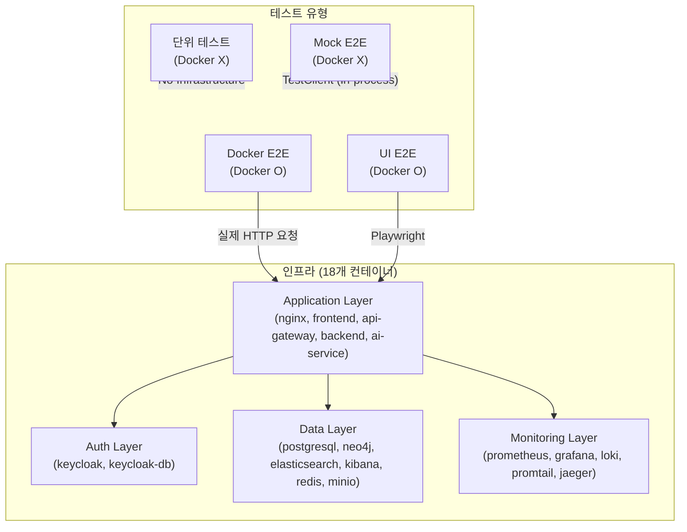
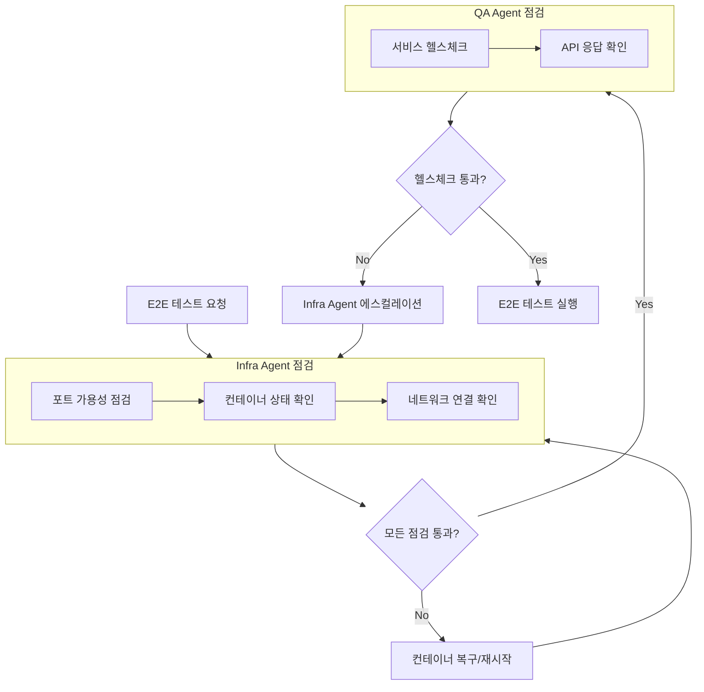
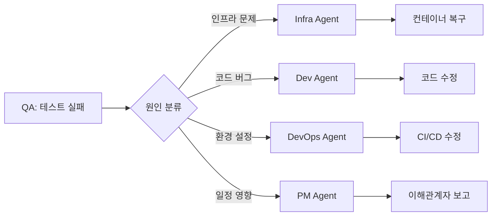

# E2E 테스트 프로세스 가이드

**프로젝트**: Hybrid RAG Knowledge Operations Platform
**버전**: 1.1
**작성일**: 2026-01-29
**작성자**: PM Agent (Claude Opus 4.5)
**상태**: Active

---

## 문서 정보

| 항목 | 내용 |
|------|------|
| **문서명** | E2E 테스트 프로세스 가이드 |
| **버전** | 1.0 |
| **작성일** | 2026-01-29 |
| **작성자** | PM Agent |
| **상태** | Active |
| **관련 문서** | [인프라 설계서](../02_design/10_infrastructure_detailed_design.md), [Frontend/Backend E2E 테스트 가이드](./frontend_backend_e2e_test_guide.md), [Sprint 04 E2E 테스트 계획](./sprint04_e2e_test_plan.md) |

---

## 변경 이력

| 버전 | 일자 | 작성자 | 변경 내용 |
|------|------|--------|----------|
| 1.1 | 2026-01-29 | PM/TechLead | **E2E 테스트 전 재빌드 필수** 섹션 추가 (2.0) |
| 1.0 | 2026-01-29 | PM Agent | 초안 작성 - E2E 테스트 프로세스 표준화 |

---

## 목차

1. [개요](#1-개요)
2. [사전 점검 (Pre-flight Check)](#2-사전-점검-pre-flight-check)
3. [E2E 테스트 실행 순서](#3-e2e-테스트-실행-순서)
4. [UI 기반 E2E 테스트](#4-ui-기반-e2e-테스트)
5. [문제 해결 (Troubleshooting)](#5-문제-해결-troubleshooting)
6. [역할별 책임](#6-역할별-책임)
7. [체크리스트](#7-체크리스트)

---

## 1. 개요

### 1.1 E2E 테스트 정의

E2E(End-to-End) 테스트는 **단위 테스트를 제외한 모든 테스트**를 포함합니다:

| 테스트 유형 | 설명 | Docker 필수 |
|------------|------|:-----------:|
| **통합 테스트** | 서비스 간 연동 검증 | O |
| **API E2E 테스트** | API Gateway 경유 전체 흐름 | O |
| **UI E2E 테스트** | 브라우저 기반 사용자 시나리오 | O |
| **Contract 테스트** | 서비스 간 API 스키마 검증 | X (Mock 가능) |
| **성능 테스트** | 부하/스트레스 테스트 | O |
| **보안 테스트** | 취약점 스캔 | O |

### 1.2 Docker 기반 필수 원칙

```
┌─────────────────────────────────────────────────────────────┐
│  E2E 테스트 = Docker Compose 환경 필수                       │
│  "No Docker, No E2E Test"                                   │
└─────────────────────────────────────────────────────────────┘
```

**이유**:
- 실제 서비스 간 네트워크 통신 검증
- 실제 데이터베이스 연동 확인
- 실제 인증 플로우 테스트
- 운영 환경과 동일한 조건 재현

### 1.3 테스트 아키텍처



---

## 2. 사전 점검 (Pre-flight Check)

> ⚠️ **중요**: E2E 테스트 전 반드시 아래 순서대로 점검을 수행해야 합니다.
> 1. 소스 코드 동기화 및 재빌드 (필수)
> 2. 인프라 점검
> 3. 서비스 헬스체크

### 2.0 소스 코드 동기화 및 재빌드 (필수) ⭐

**E2E 테스트 전 Docker 이미지 재빌드는 필수입니다.**

#### 2.0.1 최신 소스 확인

```bash
# 현재 커밋 확인
git log -1 --oneline

# Docker 이미지 빌드 시간 확인
docker images --format "table {{.Repository}}\t{{.Tag}}\t{{.CreatedAt}}" | grep knowledge-platform
```

#### 2.0.2 재빌드 명령어

```bash
cd infrastructure/docker

# 필수 서비스 재빌드 (backend, frontend, ai-service)
docker-compose build --no-cache backend frontend ai-service

# 컨테이너 재시작
docker-compose up -d backend frontend ai-service

# 헬스체크 대기 (30초)
sleep 30
docker-compose ps
```

#### 2.0.3 재빌드 체크리스트

| # | 점검 항목 | 담당 | 확인 |
|---|----------|------|:----:|
| 1 | Git 최신 커밋 pull 완료 | Infra/DevOps | ☐ |
| 2 | Backend 이미지 재빌드 | Infra | ☐ |
| 3 | Frontend 이미지 재빌드 | Infra | ☐ |
| 4 | AI-Service 이미지 재빌드 | Infra | ☐ |
| 5 | 모든 컨테이너 healthy 확인 | Infra | ☐ |

> 📌 **주의**: 재빌드 없이 E2E 테스트를 수행하면 최신 기능/버그 수정이 반영되지 않아 테스트 결과가 무의미할 수 있습니다.

---

### 2.1 인프라 점검 (Infra 담당)

E2E 테스트 실행 전 **Infra Agent**가 수행해야 하는 점검 항목입니다.

#### 2.1.1 포트 가용성 점검

```bash
#!/bin/bash
# scripts/preflight_check.sh (Infra Agent 담당)

echo "=== E2E Pre-flight Check ==="

# 필수 포트 목록
REQUIRED_PORTS=(
    "80:nginx"
    "443:nginx-ssl"
    "3001:grafana"
    "5432:postgresql"
    "5601:kibana"
    "6379:redis"
    "7474:neo4j-browser"
    "7687:neo4j-bolt"
    "8000:ai-service"
    "8080:api-gateway"
    "8081:backend"
    "9000:minio"
    "9090:prometheus"
    "9200:elasticsearch"
    "16686:jaeger"
)

echo "[1/3] Checking port availability..."
for PORT_SERVICE in "${REQUIRED_PORTS[@]}"; do
    PORT="${PORT_SERVICE%%:*}"
    SERVICE="${PORT_SERVICE##*:}"

    if lsof -i :$PORT > /dev/null 2>&1; then
        PROCESS=$(lsof -i :$PORT | grep LISTEN | head -1 | awk '{print $1}')
        if [[ "$PROCESS" == "docker"* ]] || [[ "$PROCESS" == "com.docke"* ]]; then
            echo "  [OK] Port $PORT ($SERVICE) - Docker"
        else
            echo "  [WARN] Port $PORT ($SERVICE) - Used by: $PROCESS"
        fi
    else
        echo "  [FREE] Port $PORT ($SERVICE) - Available"
    fi
done
```

#### 2.1.2 Docker 컨테이너 상태 확인

```bash
echo "[2/3] Checking Docker container status..."
cd infrastructure/docker

# 컨테이너 상태 확인
docker compose ps --format "table {{.Name}}\t{{.Status}}\t{{.Health}}"

# Exited 컨테이너 카운트
EXITED_COUNT=$(docker compose ps --filter "status=exited" -q | wc -l)
if [ "$EXITED_COUNT" -gt 0 ]; then
    echo "  [WARN] $EXITED_COUNT container(s) are in Exited state"
    docker compose ps --filter "status=exited"
fi
```

#### 2.1.3 네트워크 연결 확인

```bash
echo "[3/3] Checking network connectivity..."

# Docker 네트워크 확인
docker network ls | grep kp-

# 네트워크 내 컨테이너 연결 확인
docker network inspect kp-backend --format '{{range .Containers}}{{.Name}} {{end}}'
```

### 2.2 서비스 헬스체크

테스트 실행 전 **QA Agent**가 확인해야 하는 서비스 상태입니다.

#### 2.2.1 필수 서비스 목록

| # | 서비스 | 포트 | 헬스체크 URL | 정상 응답 |
|---|--------|------|-------------|----------|
| 1 | API Gateway | 8080 | `/actuator/health` | `{"status":"UP"}` |
| 2 | Backend | 8081 | `/actuator/health` | `{"status":"UP"}` |
| 3 | AI Service | 8000 | `/health` | `{"status":"healthy"}` |
| 4 | Keycloak | 9090 | `/health/ready` | HTTP 200 |
| 5 | PostgreSQL | 5432 | TCP 연결 | Connected |
| 6 | Redis | 6379 | `PING` | `PONG` |
| 7 | Elasticsearch | 9200 | `/_cluster/health` | `"status":"green"` or `"yellow"` |
| 8 | Neo4j | 7687 | Bolt 연결 | Connected |
| 9 | MinIO | 9000 | `/minio/health/live` | HTTP 200 |

#### 2.2.2 헬스체크 스크립트

```bash
#!/bin/bash
# scripts/healthcheck.sh (QA Agent 실행)

echo "=== Service Health Check ==="

# 1. API Gateway
echo -n "[1/9] API Gateway (8080): "
RESP=$(curl -s -o /dev/null -w "%{http_code}" http://localhost:8080/actuator/health 2>/dev/null)
[ "$RESP" == "200" ] && echo "OK" || echo "FAIL ($RESP)"

# 2. Backend
echo -n "[2/9] Backend (8081): "
RESP=$(curl -s -o /dev/null -w "%{http_code}" http://localhost:8081/actuator/health 2>/dev/null)
[ "$RESP" == "200" ] && echo "OK" || echo "FAIL ($RESP)"

# 3. AI Service
echo -n "[3/9] AI Service (8000): "
RESP=$(curl -s -o /dev/null -w "%{http_code}" http://localhost:8000/health 2>/dev/null)
[ "$RESP" == "200" ] && echo "OK" || echo "FAIL ($RESP)"

# 4. Keycloak
echo -n "[4/9] Keycloak (9090): "
RESP=$(curl -s -o /dev/null -w "%{http_code}" http://localhost:9090/health/ready 2>/dev/null)
[ "$RESP" == "200" ] && echo "OK" || echo "FAIL ($RESP)"

# 5. PostgreSQL
echo -n "[5/9] PostgreSQL (5432): "
docker exec kp-postgresql pg_isready -q && echo "OK" || echo "FAIL"

# 6. Redis
echo -n "[6/9] Redis (6379): "
RESP=$(docker exec kp-redis redis-cli ping 2>/dev/null)
[ "$RESP" == "PONG" ] && echo "OK" || echo "FAIL ($RESP)"

# 7. Elasticsearch
echo -n "[7/9] Elasticsearch (9200): "
RESP=$(curl -s http://localhost:9200/_cluster/health 2>/dev/null | grep -o '"status":"[^"]*"' | head -1)
[[ "$RESP" == *"green"* ]] || [[ "$RESP" == *"yellow"* ]] && echo "OK ($RESP)" || echo "FAIL ($RESP)"

# 8. Neo4j
echo -n "[8/9] Neo4j (7687): "
docker exec kp-neo4j cypher-shell -u neo4j -p password "RETURN 1" > /dev/null 2>&1 && echo "OK" || echo "FAIL"

# 9. MinIO
echo -n "[9/9] MinIO (9000): "
RESP=$(curl -s -o /dev/null -w "%{http_code}" http://localhost:9000/minio/health/live 2>/dev/null)
[ "$RESP" == "200" ] && echo "OK" || echo "FAIL ($RESP)"

echo ""
echo "=== Health Check Complete ==="
```

### 2.3 사전 점검 흐름도



---

## 3. E2E 테스트 실행 순서

### 3.1 실행 프로세스

| 순서 | 담당 | 작업 | 예상 시간 |
|------|------|------|----------|
| 1 | Infra | 포트 점검 스크립트 실행 | 1분 |
| 2 | Infra | 컨테이너 기동/복구 | 5-10분 |
| 3 | QA | 헬스체크 확인 | 2분 |
| 4 | QA | E2E 테스트 실행 | 10-30분 |
| 5 | QA | 결과 보고 | 5분 |

### 3.2 실행 명령어

#### 3.2.1 Mock 모드 (Docker 불필요)

```bash
# CI/CD PR 파이프라인용 - 빠른 피드백
cd knowledge_service

# 전체 실행
E2E_MODE=mock pytest src/tests/e2e/frontend_backend/ -v --tb=short

# 카테고리별 실행
E2E_MODE=mock pytest src/tests/e2e/frontend_backend/test_auth_flow.py -v
E2E_MODE=mock pytest src/tests/e2e/frontend_backend/test_search_flow.py -v

# Contract 테스트 (Mock 모드)
pytest src/tests/contract/ -v --tb=short
```

#### 3.2.2 Docker 모드 (실제 환경)

```bash
# Nightly Build / Release 전 검증용
cd knowledge_service

# 전제: Docker 서비스 전체 healthy
docker compose -f ../infrastructure/docker/docker-compose.yml ps

# 전체 실행
E2E_MODE=docker pytest src/tests/e2e/frontend_backend/ -v --tb=long

# 카테고리별 실행
E2E_MODE=docker pytest src/tests/e2e/frontend_backend/test_auth_flow.py -v
E2E_MODE=docker pytest src/tests/e2e/frontend_backend/test_search_flow.py -v
E2E_MODE=docker pytest src/tests/e2e/frontend_backend/test_sse_streaming.py -v
E2E_MODE=docker pytest src/tests/e2e/frontend_backend/test_security_verification.py -v
E2E_MODE=docker pytest src/tests/e2e/frontend_backend/test_error_handling.py -v
```

#### 3.2.3 통합 테스트

```bash
# Sprint 04 통합 테스트
cd knowledge_service

# 전체 통합 테스트
python3 -m pytest src/tests/integration/ -v --tb=short

# Story별 실행
python3 -m pytest src/tests/integration/test_story050_sse_protocol.py -v
python3 -m pytest src/tests/integration/test_story052_reranker_async.py -v
python3 -m pytest src/tests/integration/test_story053_security.py -v

# 마커별 실행
python3 -m pytest src/tests/integration/ -v -m sprint04
python3 -m pytest src/tests/integration/ -v -m security
```

### 3.3 환경변수 설정

| 변수 | 기본값 | 설명 |
|------|--------|------|
| `E2E_MODE` | `mock` | 테스트 모드 (`mock` / `docker`) |
| `E2E_GATEWAY_URL` | `http://localhost:8080` | API Gateway URL |
| `E2E_BACKEND_URL` | `http://localhost:8081` | Backend 직접 URL |
| `E2E_AI_SERVICE_URL` | `http://localhost:8000` | AI Service URL |
| `JWT_SECRET_KEY` | (내장 기본값) | JWT 서명 키 (Mock 모드) |

---

## 4. UI 기반 E2E 테스트

### 4.1 Playwright 설정

```bash
# Frontend 프로젝트에서 Playwright 설치
cd knowledge_service/frontend

# Playwright 설치
npm install -D @playwright/test
npx playwright install chromium  # 브라우저 설치
```

#### 4.1.1 playwright.config.ts

```typescript
// knowledge_service/frontend/playwright.config.ts
import { defineConfig, devices } from '@playwright/test';

export default defineConfig({
  testDir: './e2e',
  fullyParallel: true,
  forbidOnly: !!process.env.CI,
  retries: process.env.CI ? 2 : 0,
  workers: process.env.CI ? 1 : undefined,
  reporter: 'html',

  use: {
    baseURL: process.env.E2E_BASE_URL || 'http://localhost:80',
    trace: 'on-first-retry',
    screenshot: 'only-on-failure',
  },

  projects: [
    {
      name: 'chromium',
      use: { ...devices['Desktop Chrome'] },
    },
  ],

  // Docker 서비스가 준비될 때까지 대기
  webServer: {
    command: 'docker compose -f ../../infrastructure/docker/docker-compose.yml up -d',
    url: 'http://localhost:8080/actuator/health',
    reuseExistingServer: !process.env.CI,
    timeout: 120 * 1000,
  },
});
```

### 4.2 테스트 시나리오 예시

```typescript
// knowledge_service/frontend/e2e/search.spec.ts
import { test, expect } from '@playwright/test';

test.describe('검색 흐름', () => {
  test.beforeEach(async ({ page }) => {
    // 로그인
    await page.goto('/login');
    await page.fill('[data-testid="email"]', 'test@example.com');
    await page.fill('[data-testid="password"]', 'password123');
    await page.click('[data-testid="login-button"]');
    await expect(page).toHaveURL('/');
  });

  test('키워드 검색 결과 표시', async ({ page }) => {
    // 검색 수행
    await page.fill('[data-testid="search-input"]', 'RAG 시스템');
    await page.click('[data-testid="search-button"]');

    // 결과 대기 및 확인
    await expect(page.locator('[data-testid="search-results"]')).toBeVisible();
    await expect(page.locator('[data-testid="result-card"]').first()).toBeVisible();
  });

  test('SSE 스트리밍 응답 표시', async ({ page }) => {
    // 채팅 검색
    await page.fill('[data-testid="chat-input"]', 'JWT 인증 방식 설명해줘');
    await page.click('[data-testid="send-button"]');

    // 스트리밍 응답 확인
    await expect(page.locator('[data-testid="streaming-indicator"]')).toBeVisible();
    await expect(page.locator('[data-testid="chat-response"]')).toBeVisible({ timeout: 30000 });
  });
});
```

### 4.3 실행 방법

```bash
# 전체 UI E2E 테스트 실행
cd knowledge_service/frontend
npx playwright test

# 특정 테스트만 실행
npx playwright test search.spec.ts

# UI 모드로 실행 (디버깅)
npx playwright test --ui

# 특정 브라우저로 실행
npx playwright test --project=chromium

# 리포트 생성
npx playwright test --reporter=html
npx playwright show-report
```

---

## 5. 문제 해결 (Troubleshooting)

### 5.1 컨테이너 Exited 시 대응

| 증상 | 진단 명령어 | 해결 방법 |
|------|-------------|-----------|
| 컨테이너 Exited | `docker logs <container>` | 로그 확인 후 원인 파악 |
| 재시작 반복 (CrashLoop) | `docker inspect <container>` | 리소스/설정 문제 확인 |
| 의존성 실패 | `docker compose logs --tail=50` | 의존 서비스 먼저 시작 |

#### 5.1.1 컨테이너 복구 스크립트

```bash
#!/bin/bash
# scripts/recover_containers.sh (Infra Agent 담당)

echo "=== Container Recovery ==="

cd infrastructure/docker

# 1. Exited 컨테이너 목록 확인
EXITED=$(docker compose ps --filter "status=exited" --format "{{.Name}}")

if [ -z "$EXITED" ]; then
    echo "No exited containers found."
    exit 0
fi

echo "Exited containers: $EXITED"

# 2. 각 컨테이너별 복구 시도
for CONTAINER in $EXITED; do
    echo "Recovering: $CONTAINER"

    # 로그 확인
    docker logs --tail=20 $CONTAINER

    # 재시작 시도
    docker compose restart ${CONTAINER#kp-}

    sleep 5

    # 상태 확인
    STATUS=$(docker inspect --format='{{.State.Status}}' $CONTAINER)
    if [ "$STATUS" == "running" ]; then
        echo "  [OK] $CONTAINER recovered"
    else
        echo "  [FAIL] $CONTAINER still not running"
    fi
done

echo "=== Recovery Complete ==="
```

### 5.2 포트 충돌 해결

```bash
# 1. 포트 사용 프로세스 확인
lsof -i :8080

# 2. 프로세스 종료 (주의: 필요한 프로세스인지 확인)
kill -9 <PID>

# 3. Docker 컨테이너가 포트를 점유한 경우
docker compose down
docker compose up -d
```

### 5.3 인증 실패 대응

| 증상 | 원인 | 해결 방법 |
|------|------|-----------|
| 401 Unauthorized | JWT 만료 | 새 토큰 발급 |
| 403 Forbidden | 권한 부족 | 역할/권한 확인 |
| Keycloak 연결 실패 | Keycloak 미기동 | Keycloak 컨테이너 확인 |
| Login 응답 불일치 | 필드명 차이 | `accessToken` vs `access_token` 처리 |

#### 5.3.1 테스트용 토큰 발급

```bash
# Docker 모드에서 실제 토큰 발급
curl -X POST http://localhost:8081/api/v1/auth/login \
  -H "Content-Type: application/json" \
  -d '{"email":"test@example.com","password":"testpass123"}'

# 응답 예시
# {"accessToken":"eyJ...", "refreshToken":"..."}
```

### 5.4 WSL2 환경 문제

> 상세 내용은 [인프라 설계서 13.6절](../02_design/10_infrastructure_detailed_design.md#136-wsl2-개발-환경-설정) 참조

| 오류 | 원인 | 해결 방법 |
|------|------|-----------|
| `chown: Operation not permitted` | WSL2 파일시스템 제한 | `user: ""` 설정 |
| Healthcheck `Connection refused` | localhost DNS 문제 | `127.0.0.1` 사용 |
| 볼륨 마운트 실패 | 경로 권한 문제 | WSL 내부 경로 사용 |

### 5.5 일반적인 테스트 실패 원인

| 실패 유형 | 가능한 원인 | 진단 방법 |
|----------|------------|-----------|
| Connection refused | 서비스 미기동 | `docker compose ps` |
| Timeout | 서비스 과부하 | `docker stats` |
| 500 Internal Error | 서비스 오류 | 서비스 로그 확인 |
| Schema mismatch | API 변경 | Contract 테스트 실행 |
| Flaky test | 타이밍 문제 | 재시도/대기 시간 조정 |

---

## 6. 역할별 책임

### 6.1 역할 매트릭스

| 역할 | 사전 점검 | 컨테이너 관리 | E2E 실행 | 결과 분석 | 보고 |
|------|:--------:|:------------:|:--------:|:--------:|:----:|
| **Infra Agent** | O (포트/네트워크) | O | X | X | X |
| **QA Agent** | O (헬스체크) | X | O | O | O |
| **DevOps Agent** | X | O (CI/CD) | X | X | X |
| **Dev (Backend/Frontend)** | X | X | O (Mock 모드) | O (자기 영역) | X |
| **PM Agent** | X | X | X | X | O (요약) |

### 6.2 역할별 상세 책임

#### 6.2.1 Infra Agent

```
[ Infra Agent 책임 ]
==================
[O] 포트 가용성 점검 스크립트 실행
[O] Docker 컨테이너 상태 확인
[O] Exited 컨테이너 복구/재시작
[O] 네트워크 연결 문제 해결
[O] 리소스(CPU/메모리) 모니터링
[X] E2E 테스트 코드 작성
[X] 테스트 결과 분석
```

#### 6.2.2 QA Agent

```
[ QA Agent 책임 ]
================
[O] 서비스 헬스체크 확인
[O] E2E 테스트 실행 (Mock/Docker 모드)
[O] 테스트 결과 분석 및 리포트 작성
[O] 테스트 케이스 유지보수
[O] 회귀 테스트 관리
[X] 컨테이너 기동/복구 (Infra에 요청)
[X] 인프라 설정 변경
```

#### 6.2.3 Dev Agent (Backend/Frontend)

```
[ Dev Agent 책임 ]
=================
[O] 단위 테스트 작성/실행
[O] Mock 모드 E2E 테스트 실행 (자기 영역)
[O] 테스트 실패 시 코드 수정
[X] Docker 환경 설정
[X] 전체 E2E 테스트 실행 (QA에 요청)
```

### 6.3 에스컬레이션 경로



---

## 7. 체크리스트

### 7.1 E2E 테스트 전 체크리스트

#### Infra Agent

- [ ] 포트 점검 스크립트 실행 완료
- [ ] 모든 포트 가용 또는 Docker 사용 중 확인
- [ ] Docker 컨테이너 상태 확인 (Exited 없음)
- [ ] 네트워크 연결 정상 확인

#### QA Agent

- [ ] 서비스 헬스체크 통과 (9개 서비스)
- [ ] 테스트 환경변수 설정 확인
- [ ] 테스트 데이터 준비 완료

### 7.2 E2E 테스트 후 체크리스트

#### QA Agent

- [ ] 테스트 결과 수집 완료
- [ ] 실패 케이스 원인 분류 완료
- [ ] 리포트 작성 완료
- [ ] 관련 Agent에 에스컬레이션 완료

### 7.3 릴리스 전 E2E 체크리스트

- [ ] Mock 모드 E2E 전체 통과
- [ ] Docker 모드 E2E 주요 시나리오 통과
- [ ] Contract 테스트 전체 통과
- [ ] UI E2E 핵심 플로우 통과
- [ ] 보안 테스트 Critical 이슈 없음
- [ ] 성능 테스트 SLA 충족

---

## 참고 문서

| 문서 | 위치 | 용도 |
|------|------|------|
| 인프라 상세 설계서 | [infrastructure_detailed_design.md](../02_design/10_infrastructure_detailed_design.md) | 18개 컨테이너 구성, WSL2 설정 |
| Frontend/Backend E2E 가이드 | [frontend_backend_e2e_test_guide.md](./frontend_backend_e2e_test_guide.md) | Mock/Docker 모드 상세 |
| Sprint 04 E2E 테스트 계획 | [sprint04_e2e_test_plan.md](./sprint04_e2e_test_plan.md) | Story별 테스트 케이스 |
| API 통합 설계서 | [api_integration_design.md](../02_design/04_api_integration_design.md) | API 스펙 참조 |
| 단위/통합 테스트 계획 | [unit_integration_test_plan.md](./unit_integration_test_plan.md) | 테스트 전략 |

---

**문서 끝**

**작성 완료**: 2026-01-29
**검토 필요**: QA Agent, Infra Agent
**다음 단계**: Pre-flight 스크립트 구현 및 자동화
