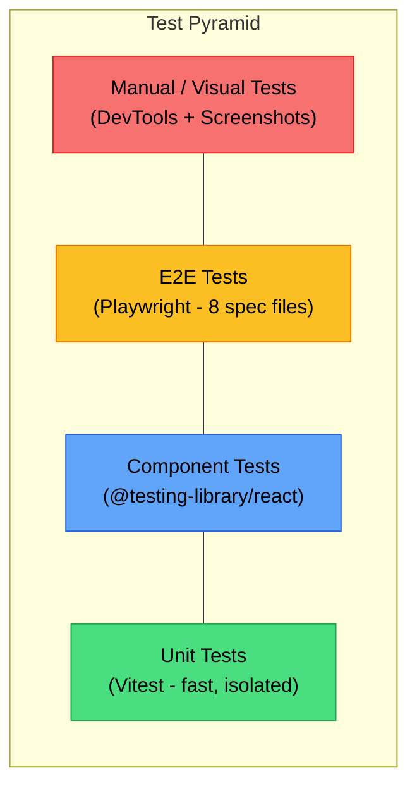
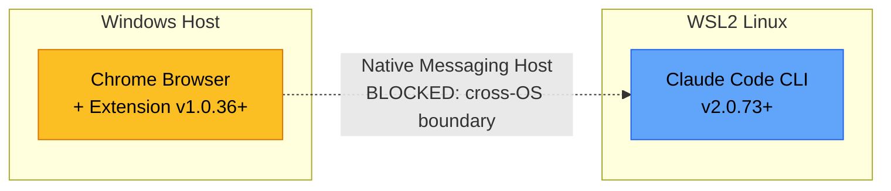
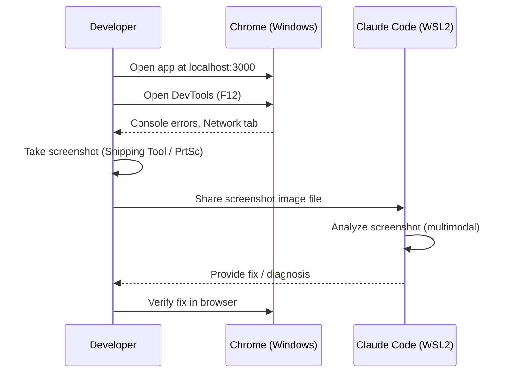

# Frontend UI Test Methodology

**Version**: 1.0
**Date**: 2026-02-08
**Author**: QA Engineer
**Project**: Hybrid RAG Knowledge Operations - Knowledge Portal (React 18)

---

## 1. Overview

This document defines the Frontend UI testing methodology for the Knowledge Portal application. It covers all available testing approaches, their applicability per environment, tool configurations, and recommended practices for maintaining high code quality and accessibility standards.

### 1.1 Technology Stack

| Layer | Technology | Version |
|-------|-----------|---------|
| UI Framework | React | 18.3.x |
| Build Tool | Vite | 5.4.x |
| Language | TypeScript | 5.6.x |
| Styling | Tailwind CSS | 3.4.x |
| Component Library | Headless UI + MUI | 2.2.x / 6.1.x |
| State Management | Redux Toolkit + React Query | 2.3.x / 5.x |
| Routing | React Router | 6.28.x |

### 1.2 Testing Stack

| Category | Tool | Version | Purpose |
|----------|------|---------|---------|
| Unit / Component | Vitest | 2.1.x | Fast unit and component tests |
| DOM Rendering | @testing-library/react | 16.x | User-centric component rendering |
| Coverage | @vitest/coverage-v8 | 2.1.x | Code coverage reports |
| E2E | Playwright | 1.58.x | Browser automation, E2E flows |
| Accessibility | jest-axe | 10.x | WCAG 2.1 AA automated audit |
| DOM Environment | jsdom | 25.x | Virtual DOM for unit tests |

---

## 2. Test Pyramid

The project follows the standard test pyramid model, ensuring the majority of tests are fast, isolated unit tests with progressively fewer but broader integration and E2E tests.



### 2.1 Distribution Target

| Layer | Proportion | Count (Current) | Coverage Target |
|-------|-----------|-----------------|----------------|
| Unit Tests | ~60% | Custom hooks, utils, services | 80%+ |
| Component Tests | ~25% | 15+ test files across features | 80%+ |
| E2E Tests | ~10% | 8 spec files (Playwright) | Critical paths |
| Manual / Visual | ~5% | DevTools + Screenshot review | Ad-hoc |

---

## 3. Chrome Claude Code (Browser Automation Debugging)

### 3.1 What Is It

Chrome Claude Code is an integration between the Claude Code CLI tool and the Chrome browser via the "Claude in Chrome" extension. It allows Claude Code to directly observe and interact with web pages in real time, enabling live debugging, DOM inspection, form automation, and visual verification -- all from the terminal.

### 3.2 How to Launch

```bash
# From Claude Code CLI
claude --chrome

# Or within an active Claude Code session
/chrome
```

Once launched, Claude Code gains read/write access to the currently active Chrome tab, including:

- **Console error reading**: Automatically detect and analyze JavaScript errors.
- **DOM state inspection**: Query elements, check attributes, verify component rendering.
- **Form auto-fill**: Programmatically fill inputs and submit forms for testing.
- **Screenshot / GIF capture**: Record visual state for regression analysis.
- **Live debugging**: Step through page behavior in real time with Claude Code assistance.

### 3.3 Requirements

| Requirement | Detail |
|-------------|--------|
| Browser | Google Chrome (NOT Brave, Arc, or other Chromium-based browsers) |
| Extension | Claude in Chrome v1.0.36 or later |
| CLI | Claude Code v2.0.73 or later |
| Plan | Anthropic direct plan (Pro, Max, Team, Enterprise) |
| OS | macOS or Linux (native) |

### 3.4 Limitations and WSL Incompatibility

**Chrome Claude Code does NOT work on WSL (Windows Subsystem for Linux).**

The reason is architectural: Chrome runs as a Windows-native process, while Claude Code runs inside the WSL Linux environment. The Chrome extension relies on **Native Messaging Host** to communicate with the Claude Code CLI. This mechanism requires both the browser and the CLI to share the same operating system namespace. In WSL, the Linux filesystem and process space are isolated from the Windows host, so the Native Messaging Host bridge cannot be established.



| Environment | Chrome Claude Code Support |
|-------------|--------------------------|
| macOS (native) | Supported |
| Linux (native) | Supported |
| WSL2 (Windows) | **NOT supported** |
| Windows (native) | NOT supported (Claude Code requires Unix shell) |
| Brave / Arc / Edge | NOT supported (Chrome only) |

### 3.5 Use Cases

| Use Case | Description |
|----------|-------------|
| Live Debugging | Real-time console error detection, DOM state analysis |
| Design Verification | Compare rendered UI against design specs |
| Web App Testing | Automated form filling, click sequences, navigation flows |
| Data Extraction | Scrape structured data from rendered pages for validation |
| Accessibility Audit | Visual ARIA attribute inspection, focus management testing |

### 3.6 Reference

Official documentation: [https://code.claude.com/docs/en/chrome](https://code.claude.com/docs/en/chrome)

---

## 4. Available UI Test Methods

### 4.1 Chrome DevTools + Screenshot-Based Debugging (Currently in Use)

This is the primary debugging method for the current WSL2 development environment.

#### Workflow



#### How to Use

1. Start the frontend development server:
   ```bash
   cd /mnt/d/Users/KTDS/Documents/06.과제/hybrid-rag-knowledge-ops/knowledge_service/frontend
   npm run dev
   ```
2. Open `http://localhost:3000` in Chrome on Windows.
3. Open DevTools with `F12` and navigate to the relevant tab:
   - **Console** tab: JavaScript errors, warnings, React error boundaries.
   - **Network** tab: API request/response inspection, status codes, payload analysis.
   - **Elements** tab: DOM structure, ARIA attributes, computed styles.
   - **Performance** tab: Render timing, layout shifts.
   - **Lighthouse** tab: Automated accessibility and performance audits.
4. Take a screenshot and share it with Claude Code for analysis.

#### Strengths

- Works in any environment including WSL2.
- No additional tooling or extension requirements.
- Supports full Chrome DevTools capabilities (Lighthouse, Performance profiler).
- Multimodal analysis by Claude Code can identify visual layout issues.

#### Weaknesses

- Manual screenshot capture and sharing is required.
- No automated, repeatable test execution.
- Cannot be integrated into CI/CD pipelines.
- Time-consuming for regression testing.

---

### 4.2 Vitest + Testing Library (Unit / Component Tests)

This is the primary automated testing layer for the project, providing fast feedback on component behavior and business logic.

#### Configuration

The test configuration is defined in `knowledge_service/frontend/vite.config.ts`:

```typescript
// vite.config.ts (test section)
test: {
    globals: true,
    environment: 'jsdom',
    setupFiles: ['./src/test/setup.ts'],
    css: true,
    include: ['src/**/*.{test,spec}.{ts,tsx}'],
}
```

The setup file at `knowledge_service/frontend/src/test/setup.ts` provides:

- `@testing-library/jest-dom/vitest` matchers (e.g., `toBeInTheDocument()`, `toHaveAttribute()`).
- `localStorage` mock.
- `matchMedia` mock.
- `IntersectionObserver` mock.
- `ResizeObserver` mock (required for Headless UI components).
- `Element.prototype.scrollIntoView` mock.

#### Running Tests

```bash
# Run all unit/component tests in watch mode
cd /mnt/d/Users/KTDS/Documents/06.과제/hybrid-rag-knowledge-ops/knowledge_service/frontend
npm test

# Run tests with coverage report
npm run test:coverage

# Run a specific test file
npx vitest run src/features/search/__tests__/ChatSearch.test.tsx

# Run tests matching a pattern
npx vitest run --reporter=verbose "accessibility"
```

#### File Location Convention

Test files are colocated with their source files using the `__tests__` directory pattern:

```
src/
  features/
    search/
      __tests__/
        ChatSearch.test.tsx
        SearchResultCard.test.tsx
        SSEClient.test.ts
        useStreamingSearch.test.ts
        useKeywordSearch.test.tsx
        accessibility.test.tsx
      components/
        ChatInput.tsx
        MessageBubble.tsx
  components/
    common/
      __tests__/
        Header.test.tsx
        Sidebar.test.tsx
        ErrorBoundary.test.tsx
        accessibility.test.tsx
    search/
      __tests__/
        SearchFilters.test.tsx
  pages/
    __tests__/
      SearchPage.test.tsx
  utils/
    __tests__/
      errorLogger.test.ts
```

#### Current Test Files (15 files)

| Directory | Test File | Target |
|-----------|-----------|--------|
| `features/dashboard/__tests__/` | `Dashboard.test.tsx` | Dashboard page |
| | `StatCard.test.tsx` | Statistics card component |
| | `QuickSearch.test.tsx` | Quick search widget |
| | `RecentSearches.test.tsx` | Recent searches list |
| | `useDashboardStats.test.ts` | Dashboard stats hook |
| | `useRecentSearches.test.ts` | Recent searches hook |
| `features/search/__tests__/` | `ChatSearch.test.tsx` | Chat-based search |
| | `SearchResultCard.test.tsx` | Search result display |
| | `StreamingIndicator.test.tsx` | SSE streaming UI |
| | `SSEClient.test.ts` | SSE client utility |
| | `useStreamingSearch.test.ts` | Streaming search hook |
| | `useKeywordSearch.test.tsx` | Keyword search hook |
| | `KeywordSearch.test.tsx` | Keyword search component |
| | `accessibility.test.tsx` | Search accessibility (axe) |
| `components/common/__tests__/` | `Header.test.tsx` | App header |
| | `Sidebar.test.tsx` | Navigation sidebar |
| | `ErrorBoundary.test.tsx` | Error boundary |
| | `accessibility.test.tsx` | Common accessibility (axe) |
| `components/search/__tests__/` | `SearchFilters.test.tsx` | Search filter panel |
| `pages/__tests__/` | `SearchPage.test.tsx` | Search page integration |
| `utils/__tests__/` | `errorLogger.test.ts` | Error logging utility |

#### Writing a Component Test (Example)

```typescript
// src/features/example/__tests__/ExampleComponent.test.tsx
import { describe, it, expect, vi } from 'vitest';
import { render, screen, fireEvent } from '@testing-library/react';
import ExampleComponent from '../ExampleComponent';

describe('ExampleComponent', () => {
  it('should render the title', () => {
    render(<ExampleComponent title="Test Title" />);
    expect(screen.getByText('Test Title')).toBeInTheDocument();
  });

  it('should call onClick when button is pressed', () => {
    const handleClick = vi.fn();
    render(<ExampleComponent title="Test" onClick={handleClick} />);

    fireEvent.click(screen.getByRole('button'));
    expect(handleClick).toHaveBeenCalledTimes(1);
  });

  it('should show loading state', () => {
    render(<ExampleComponent title="Test" isLoading={true} />);
    expect(screen.getByLabelText(/loading/i)).toBeInTheDocument();
  });
});
```

#### Coverage Target

The project targets **80%+ code coverage** across all frontend modules. Coverage is measured with `@vitest/coverage-v8`.

```bash
npm run test:coverage
```

The coverage report is generated in the `coverage/` directory and includes:

- Statement coverage
- Branch coverage
- Function coverage
- Line coverage

---

### 4.3 Playwright (E2E Tests)

Playwright provides full browser automation for end-to-end testing, simulating real user interactions across the entire application stack.

#### Configuration

The Playwright configuration is defined in `knowledge_service/frontend/playwright.config.ts`:

```typescript
// playwright.config.ts
export default defineConfig({
  testDir: './e2e',
  fullyParallel: true,
  forbidOnly: !!process.env.CI,
  retries: process.env.CI ? 2 : 0,
  workers: process.env.CI ? 1 : undefined,
  reporter: [
    ['html', { outputFolder: 'playwright-report' }],
    ['list'],
  ],
  use: {
    baseURL: 'http://localhost:3000',
    trace: 'on-first-retry',
    screenshot: 'only-on-failure',
    video: 'retain-on-failure',
  },
  projects: [
    {
      name: 'chromium',
      use: { ...devices['Desktop Chrome'] },
    },
  ],
  webServer: {
    command: 'npm run dev',
    url: 'http://localhost:3000',
    reuseExistingServer: !process.env.CI,
    timeout: 120 * 1000,
  },
});
```

Key configuration details:
- **Test directory**: `knowledge_service/frontend/e2e/`
- **Browser**: Chromium (headless by default)
- **Screenshots**: Captured only on failure
- **Video**: Retained only on failure
- **Trace**: Recorded on first retry (for debugging flaky tests)
- **Web server**: Automatically starts `npm run dev` if not running

#### Running E2E Tests

```bash
cd /mnt/d/Users/KTDS/Documents/06.과제/hybrid-rag-knowledge-ops/knowledge_service/frontend

# Run all E2E tests (headless)
npm run test:e2e

# Run with browser visible
npm run test:e2e:headed

# Run with Playwright UI mode (interactive debugging)
npm run test:e2e:ui

# View HTML report after test run
npm run test:e2e:report

# Run a specific test file
npx playwright test e2e/smoke-pages.spec.ts

# Run with debug mode (step-by-step)
npx playwright test --debug e2e/auth.spec.ts
```

#### Current E2E Test Specs (8 files)

| Spec File | Description | Test Count |
|-----------|-------------|------------|
| `auth.spec.ts` | Authentication flows (login, logout, route protection) | Multiple |
| `dashboard.spec.ts` | Dashboard page rendering and interactions | Multiple |
| `search-workflow.spec.ts` | End-to-end search workflow | Multiple |
| `search-filters.spec.ts` | Search filter interactions | Multiple |
| `chat-search.spec.ts` | Chat-based search interface | Multiple |
| `smoke-pages.spec.ts` | Smoke tests for all pages (Bookmarks, Profile, Admin, Upload) | 25+ |
| `api-integration.spec.ts` | Frontend-to-API integration verification | Multiple |
| `ui-api-verification.spec.ts` | UI and API contract verification | Multiple |

#### Helper Files

| File | Purpose |
|------|---------|
| `e2e/helpers/auth.helper.ts` | `loginAsAdmin()`, `loginAsUser()` utilities |
| `e2e/helpers/test-env.helper.ts` | Environment setup and configuration |

#### WSL2 Headless Mode

Playwright runs in **headless mode** by default, which works correctly in WSL2. For headed mode (visible browser), WSLg or an X server (such as VcXsrv) must be configured on the Windows host.

```bash
# Headless mode (default, works in WSL2)
npm run test:e2e

# Headed mode (requires display server in WSL2)
export DISPLAY=:0  # or the appropriate display
npm run test:e2e:headed
```

#### Writing an E2E Test (Example)

```typescript
// e2e/example.spec.ts
import { test, expect } from '@playwright/test';
import { loginAsAdmin } from './helpers/auth.helper';

test.describe('Example Page', () => {
  test.beforeEach(async ({ page }) => {
    await loginAsAdmin(page);
  });

  test('should display the main heading', async ({ page }) => {
    await page.goto('/example');
    await expect(
      page.getByRole('heading', { name: 'Example', level: 1 })
    ).toBeVisible();
  });

  test('should submit the form successfully', async ({ page }) => {
    await page.goto('/example');

    await page.fill('#name', 'Test User');
    await page.fill('#email', 'test@example.com');
    await page.click('button[type="submit"]');

    await expect(page.getByText('Submitted successfully')).toBeVisible();
  });
});
```

---

### 4.4 Accessibility Tests (jest-axe)

The project uses `jest-axe` (powered by axe-core) for automated WCAG 2.1 AA compliance verification within component tests.

#### Current Accessibility Test Coverage

The project has two dedicated accessibility test files:

**1. Common Components** (`src/components/common/__tests__/accessibility.test.tsx`)
- SkipLink: keyboard focus, ARIA attributes, axe violations
- VisuallyHidden: sr-only rendering, custom element support
- LiveRegion: ARIA live attributes, polite/assertive modes
- ErrorBoundary: accessible fallback UI
- Header: role="banner", aria-expanded on sidebar toggle
- Sidebar: aria-hidden when closed, nav landmark, accessible close button
- SearchFilters: role="search", labeled inputs, accessible filter chips
- Keyboard Navigation: tab order through interactive elements
- ARIA Labels: proper link naming, live region announcements

**2. Search Components** (`src/features/search/__tests__/accessibility.test.tsx`)
- ChatInput: accessible labels, keyboard submission (Enter vs Shift+Enter)
- MessageBubble: user/assistant message accessibility, streaming indicator
- MessageList: ARIA log role, aria-live="polite", suggestion buttons
- SearchResultCard: article role, relevance score labeling
- SourceCitation: keyboard navigation, accessible tooltips
- Focus Management: focus order in chat interface
- Color Contrast: axe-core automated contrast checks

#### WCAG 2.1 AA Requirements Covered

| WCAG Criterion | Level | Implementation |
|----------------|-------|----------------|
| 1.3.1 Info and Relationships | A | Semantic HTML, ARIA roles |
| 1.4.3 Contrast (Minimum) | AA | axe-core automated checks |
| 2.1.1 Keyboard | A | SkipLink, tab navigation, Enter/Escape handlers |
| 2.4.1 Bypass Blocks | A | SkipLink component |
| 2.4.4 Link Purpose | A | Descriptive aria-labels on links |
| 4.1.2 Name, Role, Value | A | ARIA attributes on all interactive elements |
| 4.1.3 Status Messages | AA | LiveRegion with aria-live |

#### Writing an Accessibility Test (Example)

```typescript
import { describe, it, expect } from 'vitest';
import { render, screen } from '@testing-library/react';
import { axe, toHaveNoViolations } from 'jest-axe';

expect.extend(toHaveNoViolations);

describe('MyComponent Accessibility', () => {
  it('should have no axe violations', async () => {
    const { container } = render(<MyComponent />);
    const results = await axe(container);
    expect(results).toHaveNoViolations();
  });

  it('should have proper ARIA labels', () => {
    render(<MyComponent />);
    expect(screen.getByRole('button', { name: /submit/i })).toBeInTheDocument();
    expect(screen.getByLabelText(/search/i)).toBeInTheDocument();
  });
});
```

---

## 5. Environment Compatibility Matrix

| Method | macOS (native) | Linux (native) | WSL2 | Windows (native) | CI/CD |
|--------|:-:|:-:|:-:|:-:|:-:|
| Chrome Claude Code | Yes | Yes | **No** | No | No |
| DevTools + Screenshot | Yes | Yes | Yes | Yes | No |
| Vitest Unit Tests | Yes | Yes | Yes | Yes | Yes |
| Vitest Component Tests | Yes | Yes | Yes | Yes | Yes |
| Playwright E2E (headless) | Yes | Yes | Yes | Yes | Yes |
| Playwright E2E (headed) | Yes | Yes | Requires WSLg/X11 | Yes | No |
| jest-axe Accessibility | Yes | Yes | Yes | Yes | Yes |
| Lighthouse (DevTools) | Yes | Yes | Yes | Yes | Via CI plugin |

### Legend

- **Yes**: Fully supported, no additional configuration needed.
- **No**: Not supported due to platform limitations.
- **Requires WSLg/X11**: Needs display server forwarding (WSLg built-in on Windows 11, or VcXsrv on Windows 10).

---

## 6. Test Execution Commands Reference

### 6.1 Quick Reference

All commands are run from the frontend directory:

```bash
cd /mnt/d/Users/KTDS/Documents/06.과제/hybrid-rag-knowledge-ops/knowledge_service/frontend
```

| Purpose | Command |
|---------|---------|
| Run unit/component tests (watch mode) | `npm test` |
| Run unit/component tests (single run) | `npx vitest run` |
| Run with coverage | `npm run test:coverage` |
| Run E2E tests (headless) | `npm run test:e2e` |
| Run E2E tests (visible browser) | `npm run test:e2e:headed` |
| Run E2E tests (interactive UI) | `npm run test:e2e:ui` |
| View E2E HTML report | `npm run test:e2e:report` |
| Run specific test file | `npx vitest run src/path/to/test.tsx` |
| Run E2E specific spec | `npx playwright test e2e/auth.spec.ts` |
| Debug E2E test | `npx playwright test --debug e2e/auth.spec.ts` |
| Type checking | `npm run typecheck` |
| Lint checking | `npm run lint` |
| Format checking | `npm run format:check` |

### 6.2 CI/CD Pipeline Integration

```bash
# Full quality gate check
npm run typecheck && npm run lint && npx vitest run && npm run test:coverage && npm run test:e2e
```

---

## 7. Test Writing Guidelines

### 7.1 Naming Conventions

- Test files: `ComponentName.test.tsx` or `hookName.test.ts`
- Test directory: `__tests__/` colocated with source
- Describe blocks: Use component/function name
- Test cases: Start with "should" + expected behavior

```typescript
describe('SearchFilters', () => {
  it('should render all filter options', () => { /* ... */ });
  it('should call onFilterChange when a filter is selected', () => { /* ... */ });
  it('should clear all filters when clear button is clicked', () => { /* ... */ });
});
```

### 7.2 Testing Priorities

When writing tests for a new component, follow this priority order:

1. **Rendering**: Does the component render without errors?
2. **User Interactions**: Do click, input, and keyboard events work correctly?
3. **State Changes**: Does the UI update in response to state changes?
4. **Edge Cases**: Empty state, loading state, error state, boundary values.
5. **Accessibility**: ARIA attributes, keyboard navigation, axe violations.

### 7.3 Mocking Strategy

| What to Mock | How | Example |
|-------------|-----|---------|
| Browser APIs | Setup file (`src/test/setup.ts`) | `localStorage`, `matchMedia`, `IntersectionObserver` |
| Auth | `vi.mock('@/auth')` | `useAuth()` returning mock user |
| Services | `vi.mock('@/services')` | `authService.logout()` |
| Redux Store | `configureStore()` with mock reducers | Test-specific store |
| API Calls | `vi.mock('axios')` or MSW | Mock responses |
| Router | `<BrowserRouter>` wrapper | Navigation context |

### 7.4 Do Not Mock (Test with Real Implementation)

- Component rendering logic
- CSS class application
- Event handler wiring
- Conditional rendering branches

---

## 8. Quality Gates

### 8.1 Metrics and Thresholds

| Metric | Threshold | Measurement Tool |
|--------|-----------|-----------------|
| Statement Coverage | >= 80% | vitest --coverage |
| Branch Coverage | >= 75% | vitest --coverage |
| Function Coverage | >= 80% | vitest --coverage |
| Line Coverage | >= 80% | vitest --coverage |
| Accessibility Violations | 0 (zero) | jest-axe |
| E2E Critical Path Pass Rate | 100% | Playwright |
| TypeScript Errors | 0 | tsc --noEmit |
| Lint Errors | 0 | eslint |

### 8.2 Pre-Commit Checks

Before committing frontend changes, the following must pass:

```bash
npm run typecheck     # TypeScript compilation
npm run lint          # ESLint rules
npx vitest run        # All unit/component tests
npm run test:coverage # Coverage threshold
```

### 8.3 Pre-Merge Checks (PR)

In addition to pre-commit checks:

```bash
npm run test:e2e      # Full E2E suite
npm run format:check  # Prettier formatting
```

---

## 9. Debugging Strategies

### 9.1 Vitest Debugging

```bash
# Run with verbose output
npx vitest run --reporter=verbose

# Run single test with debug logging
npx vitest run src/features/search/__tests__/ChatSearch.test.tsx --reporter=verbose

# Use screen.debug() in tests to inspect DOM
import { screen } from '@testing-library/react';
screen.debug();           # Print entire DOM
screen.debug(element);    # Print specific element
```

### 9.2 Playwright Debugging

```bash
# Step-by-step debugging with Playwright Inspector
npx playwright test --debug e2e/auth.spec.ts

# Run with UI mode for interactive trace viewing
npm run test:e2e:ui

# Generate trace for failed tests
npx playwright test --trace on

# View trace file
npx playwright show-trace trace.zip
```

### 9.3 Console Error Capture Pattern (E2E)

The project uses a standard pattern to capture console errors during E2E tests:

```typescript
function setupConsoleErrorCapture(page: Page): string[] {
  const consoleErrors: string[] = [];
  page.on('console', (msg) => {
    if (msg.type() === 'error') {
      consoleErrors.push(msg.text());
    }
  });
  return consoleErrors;
}
```

This is used in smoke tests and integration tests to detect runtime JavaScript errors that do not cause visible failures but indicate underlying issues.

---

## 10. Future Improvements

### 10.1 Chrome Claude Code Adoption (When WSL Support Is Added)

When Anthropic adds WSL support for the Chrome extension, the team should adopt Chrome Claude Code for:

- Automated visual regression testing during development.
- Real-time accessibility auditing in the browser.
- AI-assisted debugging of complex UI state issues.
- Automated form testing with natural language instructions.

**Action item**: Monitor the Claude Code changelog for WSL/Native Messaging Host support announcements.

### 10.2 Visual Regression Testing

Tools under consideration:

| Tool | Type | Integration |
|------|------|-------------|
| Percy | Cloud-based | GitHub PR integration, automatic baseline |
| Chromatic | Storybook-native | Component-level visual diff |
| Playwright Screenshots | Built-in | `expect(page).toHaveScreenshot()` |
| BackstopJS | Self-hosted | Docker-based visual regression |

Recommended first step: Use Playwright's built-in screenshot comparison (`toHaveScreenshot()`) as it requires no additional service and is already available in the current setup.

```typescript
// Example: Visual regression with Playwright
test('should match visual snapshot', async ({ page }) => {
  await page.goto('/dashboard');
  await expect(page).toHaveScreenshot('dashboard.png', {
    maxDiffPixelRatio: 0.01,
  });
});
```

### 10.3 Storybook Component Catalog

Adding Storybook would provide:

- Isolated component development environment.
- Visual documentation of all components and their states.
- Chromatic integration for visual regression.
- Accessibility addon for per-component WCAG auditing.

```bash
# Future setup
npx storybook@latest init
npm install @storybook/addon-a11y
```

### 10.4 API Mocking with MSW (Mock Service Worker)

For more realistic integration testing without backend dependencies:

```bash
npm install --save-dev msw
```

MSW intercepts network requests at the service worker level, allowing component tests to exercise real `fetch`/`axios` calls against mock handlers, providing higher confidence than module-level mocks.

### 10.5 Performance Testing Integration

- **Web Vitals monitoring**: Integrate `web-vitals` library for CLS, LCP, FID metrics.
- **Lighthouse CI**: Automated Lighthouse scoring in CI/CD pipeline.
- **Bundle size tracking**: Track JavaScript bundle size over time with `bundlesize` or `size-limit`.

---

## 11. Appendix

### A. Project File Paths

| Item | Path |
|------|------|
| Frontend root | `knowledge_service/frontend/` |
| Source code | `knowledge_service/frontend/src/` |
| Vite config (includes Vitest) | `knowledge_service/frontend/vite.config.ts` |
| Playwright config | `knowledge_service/frontend/playwright.config.ts` |
| Test setup | `knowledge_service/frontend/src/test/setup.ts` |
| E2E test directory | `knowledge_service/frontend/e2e/` |
| E2E auth helper | `knowledge_service/frontend/e2e/helpers/auth.helper.ts` |
| Common accessibility tests | `knowledge_service/frontend/src/components/common/__tests__/accessibility.test.tsx` |
| Search accessibility tests | `knowledge_service/frontend/src/features/search/__tests__/accessibility.test.tsx` |

### B. Related Documentation

| Document | Path |
|----------|------|
| Unit/Integration Test Plan | `knowledge_service/docs/04_testing/unit_integration_test_plan.md` |
| E2E Test Process | `knowledge_service/docs/04_testing/e2e_test_process.md` |
| UI E2E Test Plan | `knowledge_service/docs/04_testing/ui_e2e_test_plan.md` |
| Frontend E2E Results (2026-02-03) | `knowledge_service/docs/04_testing/frontend_e2e_test_results_2026-02-03.md` |
| Frontend-Backend E2E Guide | `knowledge_service/docs/04_testing/frontend_backend_e2e_test_guide.md` |
| Mock Test Audit Report | `knowledge_service/docs/04_testing/mock_test_audit_report.md` |

### C. Troubleshooting

| Issue | Cause | Solution |
|-------|-------|----------|
| `ResizeObserver is not defined` | Headless UI needs ResizeObserver | Already mocked in `src/test/setup.ts` |
| `matchMedia is not a function` | jsdom lacks matchMedia | Already mocked in `src/test/setup.ts` |
| Playwright timeout on `npm run dev` | Dev server not starting | Check port 3000 availability, increase `webServer.timeout` |
| `toHaveNoViolations` not found | Missing jest-axe matcher | Add `expect.extend(toHaveNoViolations)` at top of test file |
| E2E tests fail in WSL2 headed mode | No display server | Use headless mode or configure WSLg/VcXsrv |
| `Cannot find module '@/...'` | Path alias not resolved | Verify `resolve.alias` in `vite.config.ts` |
| Vitest globals not recognized | TypeScript config issue | Ensure `/// <reference types="vitest" />` in config |

---

*Document maintained by QA Engineer. Last updated: 2026-02-08.*
