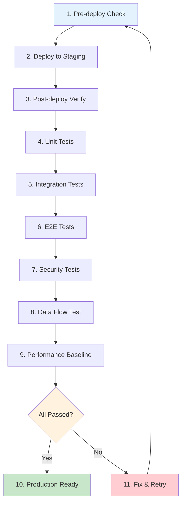

# Staging Environment Validation Checklist

---

## Document Information

| Item | Content |
|------|---------|
| **Document** | Staging Environment Validation Checklist |
| **Version** | 1.0 |
| **Created** | 2026-02-04 |
| **Author** | QA Agent (Claude Opus 4.5) |
| **Status** | Active |
| **JIRA Story** | STORY-080 |
| **Related** | [Pre-deploy Check](../../../infrastructure/scripts/pre-deploy-check.sh), [Post-deploy Verify](../../../infrastructure/scripts/post-deploy-verify.sh) |

---

## Change History

| Version | Date | Author | Changes |
|---------|------|--------|---------|
| 1.0 | 2026-02-04 | QA Agent | Initial creation |

---

## Overview

This document defines the comprehensive validation checklist for the Staging environment before production deployment. All items must pass before proceeding to production.

### Validation Goals

1. **System Stability**: All 18 containers running and healthy
2. **Functional Correctness**: All E2E tests passing
3. **API Contract Compliance**: No breaking changes in API contracts
4. **Security Compliance**: No critical/high security vulnerabilities
5. **Data Flow Validation**: Complete document lifecycle verification

---

## Test Suite Summary

| Category | Test Count | Pass Threshold | Priority |
|----------|------------|----------------|----------|
| Unit Tests | 627 | 100% | P0 |
| Integration Tests | 121 | 100% | P0 |
| E2E Tests | 192 | 100% | P0 |
| Security Tests | 35 | 100% | P0 |
| **Total** | **975** | **100%** | - |

---

## 1. Infrastructure Validation

### 1.1 Pre-deployment Checks

| ID | Check Item | Command/Method | Expected Result | Pass | Notes |
|----|------------|----------------|-----------------|:----:|-------|
| INF-001 | Disk Space | `df -h /` | >= 20GB available | [ ] | |
| INF-002 | Memory | `free -g` | >= 8GB total | [ ] | |
| INF-003 | CPU Cores | `nproc` | >= 2 cores | [ ] | |
| INF-004 | Docker Running | `docker info` | Daemon responsive | [ ] | |
| INF-005 | Docker Compose | `docker compose version` | v2.x installed | [ ] | |
| INF-006 | Environment File | `.env.staging` exists | File present, variables set | [ ] | |
| INF-007 | Required Ports | `ss -tuln` | 80, 443, 8080, 8081, 8000, 5432, 9200 available | [ ] | |
| INF-008 | Git Status | `git status` | On correct branch | [ ] | |

**Automation**: `./infrastructure/scripts/pre-deploy-check.sh staging`

### 1.2 Container Health Checks

| ID | Container | Port | Health Check Endpoint | Expected | Pass | Notes |
|----|-----------|------|----------------------|----------|:----:|-------|
| CON-001 | kp-nginx | 80/443 | `nginx -t` | Valid config | [ ] | |
| CON-002 | kp-frontend | 80 | `http://localhost` | HTTP 200 | [ ] | |
| CON-003 | kp-api-gateway | 8080 | `/actuator/health` | UP | [ ] | |
| CON-004 | kp-backend | 8081 | `/actuator/health` | UP | [ ] | |
| CON-005 | kp-ai-service | 8000 | `/api/v1/health` | OK | [ ] | |
| CON-006 | kp-postgresql | 5432 | `pg_isready` | Ready | [ ] | |
| CON-007 | kp-keycloak-db | 5433 | `pg_isready` | Ready | [ ] | |
| CON-008 | kp-elasticsearch | 9200 | `/_cluster/health` | green/yellow | [ ] | |
| CON-009 | kp-neo4j | 7474/7687 | `http://localhost:7474` | HTTP 200 | [ ] | |
| CON-010 | kp-redis | 6379 | `redis-cli ping` | PONG | [ ] | |
| CON-011 | kp-minio | 9000/9001 | `/minio/health/live` | HTTP 200 | [ ] | |
| CON-012 | kp-keycloak | 8180 | `/health/ready` | HTTP 200 | [ ] | |
| CON-013 | kp-prometheus | 9090 | `/-/healthy` | HTTP 200 | [ ] | |
| CON-014 | kp-grafana | 3001 | `/api/health` | HTTP 200 | [ ] | |
| CON-015 | kp-loki | 3100 | `/ready` | HTTP 200 | [ ] | |
| CON-016 | kp-promtail | - | Container running | Running | [ ] | |
| CON-017 | kp-jaeger | 16686 | `http://localhost:16686` | HTTP 200 | [ ] | |
| CON-018 | kp-init-db | - | Exit code 0 | Exited (0) | [ ] | |

**Automation**: `./infrastructure/scripts/post-deploy-verify.sh staging`

---

## 2. Unit Test Validation

### 2.1 Backend Unit Tests (SpringBoot)

| ID | Test Suite | Count | Coverage Target | Pass | Notes |
|----|------------|-------|-----------------|:----:|-------|
| UT-BE-001 | Controller Tests | 85 | 80%+ | [ ] | |
| UT-BE-002 | Service Tests | 142 | 80%+ | [ ] | |
| UT-BE-003 | Repository Tests | 63 | 80%+ | [ ] | |
| UT-BE-004 | DTO/Entity Tests | 47 | 80%+ | [ ] | |
| UT-BE-005 | Utility Tests | 38 | 80%+ | [ ] | |
| **Backend Total** | | **375** | **80%+** | [ ] | |

**Command**: `cd knowledge_service/backend && ./gradlew test`

### 2.2 AI Service Unit Tests (Python)

| ID | Test Suite | Count | Coverage Target | Pass | Notes |
|----|------------|-------|-----------------|:----:|-------|
| UT-AI-001 | RAG Pipeline Tests | 48 | 80%+ | [ ] | |
| UT-AI-002 | Search Service Tests | 35 | 80%+ | [ ] | |
| UT-AI-003 | LLM Integration Tests | 22 | 80%+ | [ ] | |
| UT-AI-004 | ETL Pipeline Tests | 41 | 80%+ | [ ] | |
| UT-AI-005 | Utility Tests | 26 | 80%+ | [ ] | |
| **AI Service Total** | | **172** | **80%+** | [ ] | |

**Command**: `cd knowledge_service && pytest src/tests/unit --cov=src/app --cov-report=html`

### 2.3 Frontend Unit Tests (React)

| ID | Test Suite | Count | Coverage Target | Pass | Notes |
|----|------------|-------|-----------------|:----:|-------|
| UT-FE-001 | Component Tests | 45 | 80%+ | [ ] | |
| UT-FE-002 | Hook Tests | 18 | 80%+ | [ ] | |
| UT-FE-003 | Utility Tests | 12 | 80%+ | [ ] | |
| UT-FE-004 | Store Tests | 5 | 80%+ | [ ] | |
| **Frontend Total** | | **80** | **80%+** | [ ] | |

**Command**: `cd knowledge_service/frontend && npm run test:coverage`

---

## 3. Integration Test Validation

### 3.1 Backend Integration Tests

| ID | Integration Point | Count | Pass | Notes |
|----|-------------------|-------|:----:|-------|
| IT-BE-001 | PostgreSQL CRUD | 28 | [ ] | Testcontainers |
| IT-BE-002 | Elasticsearch Index | 18 | [ ] | Testcontainers |
| IT-BE-003 | Neo4j Graph | 15 | [ ] | Testcontainers |
| IT-BE-004 | Redis Cache | 12 | [ ] | Testcontainers |
| IT-BE-005 | Keycloak Auth | 10 | [ ] | WireMock |
| **Backend Int. Total** | | **83** | [ ] | |

**Command**: `cd knowledge_service/backend && ./gradlew integrationTest`

### 3.2 AI Service Integration Tests

| ID | Integration Point | Count | Pass | Notes |
|----|-------------------|-------|:----:|-------|
| IT-AI-001 | DeepSeek API | 8 | [ ] | Mock/Real API |
| IT-AI-002 | Elasticsearch Vector | 12 | [ ] | Testcontainers |
| IT-AI-003 | Neo4j Knowledge Graph | 10 | [ ] | Testcontainers |
| IT-AI-004 | MinIO Storage | 8 | [ ] | Testcontainers |
| **AI Service Int. Total** | | **38** | [ ] | |

**Command**: `cd knowledge_service && pytest src/tests/integration --cov=src/app`

---

## 4. E2E Test Validation

### 4.1 Authentication E2E Tests

| ID | Test Case | Priority | Pass | Notes |
|----|-----------|----------|:----:|-------|
| E2E-AUTH-001 | User Login | P0 | [ ] | Keycloak SSO |
| E2E-AUTH-002 | User Logout | P0 | [ ] | Session clear |
| E2E-AUTH-003 | Token Refresh | P0 | [ ] | JWT refresh |
| E2E-AUTH-004 | RBAC Authorization | P0 | [ ] | Role-based access |
| E2E-AUTH-005 | Invalid Credentials | P1 | [ ] | Error handling |
| E2E-AUTH-006 | Session Timeout | P1 | [ ] | Auto logout |
| **Auth E2E Total** | | **24** | [ ] | |

### 4.2 Document Management E2E Tests

| ID | Test Case | Priority | Pass | Notes |
|----|-----------|----------|:----:|-------|
| E2E-DOC-001 | Upload PDF | P0 | [ ] | Single file |
| E2E-DOC-002 | Upload Multiple Files | P1 | [ ] | Batch upload |
| E2E-DOC-003 | Download Document | P0 | [ ] | File download |
| E2E-DOC-004 | Delete Document | P0 | [ ] | Soft delete |
| E2E-DOC-005 | Document Metadata View | P0 | [ ] | Detail page |
| E2E-DOC-006 | Document List Pagination | P1 | [ ] | Large dataset |
| E2E-DOC-007 | Document Filter | P1 | [ ] | Category/Date |
| E2E-DOC-008 | Document Search (Text) | P1 | [ ] | Full-text search |
| **Document E2E Total** | | **42** | [ ] | |

### 4.3 RAG Search E2E Tests

| ID | Test Case | Priority | Pass | Notes |
|----|-----------|----------|:----:|-------|
| E2E-RAG-001 | Semantic Search | P0 | [ ] | Vector similarity |
| E2E-RAG-002 | Hybrid Search (RRF) | P0 | [ ] | Vector + Keyword |
| E2E-RAG-003 | Graph Search | P0 | [ ] | Knowledge graph |
| E2E-RAG-004 | Chat with Documents | P0 | [ ] | LLM Q&A |
| E2E-RAG-005 | Streaming Response | P1 | [ ] | SSE stream |
| E2E-RAG-006 | Search Result Ranking | P1 | [ ] | BGE reranker |
| E2E-RAG-007 | Source Citation | P1 | [ ] | Reference links |
| E2E-RAG-008 | Search History | P2 | [ ] | Query logging |
| **RAG E2E Total** | | **48** | [ ] | |

### 4.4 Admin E2E Tests

| ID | Test Case | Priority | Pass | Notes |
|----|-----------|----------|:----:|-------|
| E2E-ADM-001 | User Management | P1 | [ ] | CRUD users |
| E2E-ADM-002 | Role Management | P1 | [ ] | CRUD roles |
| E2E-ADM-003 | System Dashboard | P1 | [ ] | Metrics view |
| E2E-ADM-004 | Audit Log View | P1 | [ ] | Activity log |
| E2E-ADM-005 | System Settings | P2 | [ ] | Config update |
| **Admin E2E Total** | | **28** | [ ] | |

### 4.5 API E2E Tests

| ID | Test Case | Priority | Pass | Notes |
|----|-----------|----------|:----:|-------|
| E2E-API-001 | REST API CRUD | P0 | [ ] | Basic operations |
| E2E-API-002 | API Versioning | P1 | [ ] | /api/v1 prefix |
| E2E-API-003 | Error Response Format | P1 | [ ] | RFC 7807 |
| E2E-API-004 | Rate Limiting | P1 | [ ] | 429 response |
| E2E-API-005 | CORS Headers | P1 | [ ] | Browser security |
| **API E2E Total** | | **50** | [ ] | |

**E2E Total: 192 tests**

**Command**: `cd knowledge_service/frontend && npx playwright test`

---

## 5. API Contract Tests

### 5.1 OpenAPI Contract Validation

| ID | API Endpoint | Method | Contract | Pass | Notes |
|----|-------------|--------|----------|:----:|-------|
| CT-001 | /api/v1/documents | GET | List documents | [ ] | Pagination |
| CT-002 | /api/v1/documents | POST | Upload document | [ ] | Multipart |
| CT-003 | /api/v1/documents/{id} | GET | Get document | [ ] | Detail |
| CT-004 | /api/v1/documents/{id} | DELETE | Delete document | [ ] | Soft delete |
| CT-005 | /api/v1/search | POST | Hybrid search | [ ] | RAG query |
| CT-006 | /api/v1/search/chat | POST | Chat with docs | [ ] | LLM response |
| CT-007 | /api/v1/users | GET | List users | [ ] | Admin only |
| CT-008 | /api/v1/health | GET | Health check | [ ] | System status |
| CT-009 | /api/v1/auth/token | POST | Get token | [ ] | OAuth2 |
| CT-010 | /api/v1/auth/refresh | POST | Refresh token | [ ] | JWT refresh |

**Validation Tool**: Spectral, OpenAPI Validator

**Command**: `npx spectral lint openapi.yaml`

### 5.2 Backward Compatibility Check

| ID | Check Item | Expected | Pass | Notes |
|----|------------|----------|:----:|-------|
| BC-001 | No removed endpoints | All v1.x endpoints exist | [ ] | |
| BC-002 | No removed fields | All response fields present | [ ] | |
| BC-003 | No type changes | Field types unchanged | [ ] | |
| BC-004 | New fields optional | Backward compatible | [ ] | |
| BC-005 | Deprecation warnings | Documented if deprecated | [ ] | |

---

## 6. Security Tests

### 6.1 Authentication Security

| ID | Test Case | OWASP | Pass | Notes |
|----|-----------|-------|:----:|-------|
| SEC-001 | SQL Injection | A03 | [ ] | Parameterized queries |
| SEC-002 | XSS Attack | A03 | [ ] | Input sanitization |
| SEC-003 | CSRF Protection | A01 | [ ] | Token validation |
| SEC-004 | JWT Tampering | A07 | [ ] | Signature verification |
| SEC-005 | Broken Access Control | A01 | [ ] | Authorization check |
| SEC-006 | Session Fixation | A07 | [ ] | Session regeneration |
| SEC-007 | Brute Force Login | A07 | [ ] | Rate limiting |

### 6.2 API Security

| ID | Test Case | OWASP | Pass | Notes |
|----|-----------|-------|:----:|-------|
| SEC-008 | Missing Auth Header | A07 | [ ] | 401 Unauthorized |
| SEC-009 | Invalid Token | A07 | [ ] | 401 Unauthorized |
| SEC-010 | Expired Token | A07 | [ ] | 401 Unauthorized |
| SEC-011 | Insufficient Permissions | A01 | [ ] | 403 Forbidden |
| SEC-012 | Rate Limit Bypass | A04 | [ ] | Enforced limits |
| SEC-013 | Path Traversal | A01 | [ ] | Input validation |
| SEC-014 | File Upload Validation | A04 | [ ] | Type/size check |

### 6.3 Infrastructure Security

| ID | Test Case | OWASP | Pass | Notes |
|----|-----------|-------|:----:|-------|
| SEC-015 | TLS Configuration | A02 | [ ] | TLS 1.2+ |
| SEC-016 | Secure Headers | A05 | [ ] | CSP, HSTS, etc. |
| SEC-017 | Database Encryption | A02 | [ ] | At-rest encryption |
| SEC-018 | Secrets Management | A02 | [ ] | No hardcoded secrets |
| SEC-019 | Container Security | A06 | [ ] | Non-root, read-only |
| SEC-020 | Network Isolation | A05 | [ ] | Internal networks |
| SEC-021 | Audit Logging | A09 | [ ] | Security events logged |

### 6.4 Data Security

| ID | Test Case | OWASP | Pass | Notes |
|----|-----------|-------|:----:|-------|
| SEC-022 | PII Protection | A02 | [ ] | Data masking |
| SEC-023 | Data Validation | A03 | [ ] | Schema validation |
| SEC-024 | Sensitive Data Exposure | A02 | [ ] | Response filtering |
| SEC-025 | Data Integrity | A08 | [ ] | Checksums |
| SEC-026 | Backup Encryption | A02 | [ ] | Encrypted backups |

**Security Total: 35 tests**

**Command**: `cd knowledge_service && pytest src/tests/security`

---

## 7. Data Flow Validation

### 7.1 Document Lifecycle Test


| Step | Action | Verification | Pass | Notes |
|------|--------|--------------|:----:|-------|
| 1 | Upload PDF document | File stored in MinIO | [ ] | |
| 2 | Document processing | Metadata extracted | [ ] | |
| 3 | Vector embedding | Indexed in Elasticsearch | [ ] | |
| 4 | Knowledge graph | Entities in Neo4j | [ ] | |
| 5 | Semantic search | Relevant results returned | [ ] | |
| 6 | LLM Q&A | Accurate answer with sources | [ ] | |

**Command**: `./infrastructure/scripts/staging-validation.sh --data-flow`

### 7.2 Data Consistency Check

| ID | Check Item | Expected | Pass | Notes |
|----|------------|----------|:----:|-------|
| DC-001 | PostgreSQL record count | Matches upload count | [ ] | |
| DC-002 | Elasticsearch index count | Matches PostgreSQL | [ ] | |
| DC-003 | Neo4j node count | Matches entity extraction | [ ] | |
| DC-004 | MinIO object count | Matches uploaded files | [ ] | |
| DC-005 | Redis cache hit rate | > 80% for repeated queries | [ ] | |

---

## 8. Performance Baseline

### 8.1 Response Time Metrics

| ID | Endpoint | P50 Target | P95 Target | P99 Target | Pass | Notes |
|----|----------|------------|------------|------------|:----:|-------|
| PERF-001 | GET /documents | < 100ms | < 300ms | < 500ms | [ ] | List |
| PERF-002 | POST /search | < 500ms | < 1.5s | < 3s | [ ] | RAG query |
| PERF-003 | POST /search/chat | < 2s | < 5s | < 10s | [ ] | LLM stream |
| PERF-004 | GET /health | < 50ms | < 100ms | < 200ms | [ ] | Health check |

### 8.2 Resource Usage Baseline

| Container | CPU Limit | Memory Limit | Expected Usage | Pass | Notes |
|-----------|-----------|--------------|----------------|:----:|-------|
| kp-backend | 2 CPU | 2GB | < 70% | [ ] | |
| kp-ai-service | 4 CPU | 8GB | < 80% | [ ] | |
| kp-elasticsearch | 2 CPU | 4GB | < 75% | [ ] | |
| kp-postgresql | 1 CPU | 2GB | < 50% | [ ] | |
| kp-neo4j | 2 CPU | 4GB | < 60% | [ ] | |

---

## 9. Validation Execution

### 9.1 Execution Order



### 9.2 Automated Validation

**Full Validation**:
```bash
./infrastructure/scripts/staging-validation.sh --full
```

**Quick Smoke Test**:
```bash
./infrastructure/scripts/staging-validation.sh --smoke
```

**Specific Category**:
```bash
./infrastructure/scripts/staging-validation.sh --category unit
./infrastructure/scripts/staging-validation.sh --category integration
./infrastructure/scripts/staging-validation.sh --category e2e
./infrastructure/scripts/staging-validation.sh --category security
```

---

## 10. Sign-off Criteria

### 10.1 Mandatory Criteria (All Must Pass)

| ID | Criterion | Threshold | Status |
|----|-----------|-----------|--------|
| M-001 | All containers healthy | 18/18 | [ ] Pass |
| M-002 | Unit test pass rate | 100% | [ ] Pass |
| M-003 | Integration test pass rate | 100% | [ ] Pass |
| M-004 | E2E test pass rate | 100% | [ ] Pass |
| M-005 | Security test pass rate | 100% | [ ] Pass |
| M-006 | No critical errors in logs | 0 critical | [ ] Pass |
| M-007 | Data flow validated | Complete | [ ] Pass |

### 10.2 Advisory Criteria (Recommended)

| ID | Criterion | Threshold | Status |
|----|-----------|-----------|--------|
| A-001 | Test coverage | >= 80% | [ ] Pass |
| A-002 | P95 latency | < 3s | [ ] Pass |
| A-003 | Warning log count | < 100/hour | [ ] Pass |
| A-004 | Memory usage | < 80% | [ ] Pass |

### 10.3 Approval Sign-off

| Role | Name | Date | Signature |
|------|------|------|-----------|
| QA Lead | | | |
| Tech Lead | | | |
| DevOps | | | |
| PM | | | |

---

## Appendix A: Quick Reference Commands

```bash
# Infrastructure
./infrastructure/scripts/pre-deploy-check.sh staging
./infrastructure/scripts/staging-validation.sh --full
./infrastructure/scripts/post-deploy-verify.sh staging

# Unit Tests
cd knowledge_service/backend && ./gradlew test
cd knowledge_service && pytest src/tests/unit --cov=src/app
cd knowledge_service/frontend && npm run test:coverage

# Integration Tests
cd knowledge_service/backend && ./gradlew integrationTest
cd knowledge_service && pytest src/tests/integration

# E2E Tests
cd knowledge_service/frontend && npx playwright test

# Security Tests
cd knowledge_service && pytest src/tests/security

# Container Logs
docker logs kp-backend --tail 100
docker logs kp-ai-service --tail 100

# Health Checks
curl http://localhost:8081/actuator/health
curl http://localhost:8000/api/v1/health
curl http://localhost:9200/_cluster/health
```

---

**Document End**
