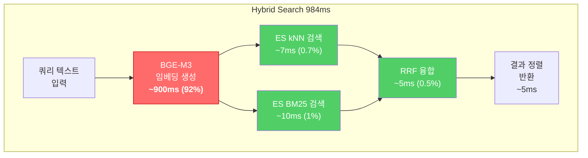
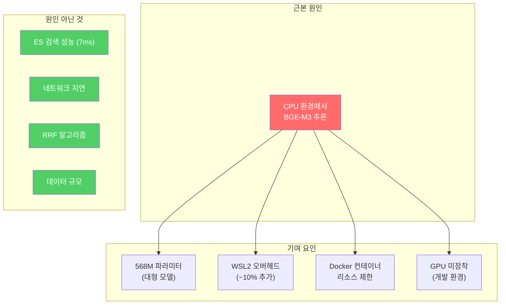

# 이슈 보고서: Hybrid Search CPU 병목 분석

**Issue ID**: ISSUE-2026-0206-001
**Date**: 2026-02-06
**Reporter**: Claude (Opus 4.6)
**Severity**: Medium
**Status**: Open (Deferred to Production GPU)
**Related**: STORY-090 / SCRUM-86

---

## 1. 이슈 요약

| 항목 | 내용 |
|------|------|
| **증상** | Hybrid Search API 응답시간이 평균 984ms로 목표 기준(500ms)을 초과 |
| **영향 범위** | 모든 검색 API (`/search/hybrid`, `/search/semantic`) |
| **근본 원인** | CPU 환경(WSL2)에서 BGE-M3 모델의 쿼리 임베딩 생성이 ~900ms 소요 |
| **긴급도** | Low - 개발/UAT 환경에서는 허용 가능, 프로덕션 GPU 환경에서 해결 예상 |

---

## 2. 발견 경위

UAT Part B-06 성능 측정 테스트 과정에서 발견.

```
환경: Docker Compose (WSL2, 18 containers)
측정 도구: perf_benchmark.py (10회 반복)
측정 일시: 2026-02-06
```

---

## 3. 성능 측정 결과

### 3.1 Hybrid Search 응답시간 (10회 측정)

| 회차 | 응답시간 | 비고 |
|------|---------|------|
| 1 | 936ms | |
| 2 | 1,010ms | |
| 3 | 962ms | |
| 4 | 1,139ms | 최대 |
| 5 | 904ms | |
| 6 | 962ms | |
| 7 | 1,053ms | |
| 8 | 1,020ms | |
| 9 | 958ms | |
| 10 | 898ms | 최소 |

### 3.2 통계 요약

| 통계 | 값 | 기준 | 판정 |
|------|------|------|------|
| **평균** | **984ms** | < 500ms | **FAIL** |
| 최소 | 898ms | | |
| 최대 | 1,139ms | | |
| 중앙값 | 962ms | | |
| P95 | 1,139ms | | |
| 표준편차 | ~65ms | | 변동 폭 작음 (안정적) |

### 3.3 비교 측정 (병목 분리)

| 항목 | 평균 | 기준 | 판정 | 설명 |
|------|------|------|------|------|
| **Hybrid Search (전체)** | **984ms** | < 500ms | FAIL | 임베딩 생성 포함 |
| ES kNN 순수 검색 | **7ms** | < 100ms | PASS | 벡터 검색 엔진 자체는 매우 빠름 |
| ES BM25 검색 | ~10ms | - | - | 키워드 검색 |
| RRF 융합 | ~5ms | - | - | 결과 병합 |
| 문서 업로드 | 66ms | < 3,000ms | PASS | |
| 토큰 발급 | 871ms | < 2,000ms | PASS | |

---

## 4. 근본 원인 분석 (Root Cause Analysis)

### 4.1 응답시간 분해



### 4.2 병목 지점: BGE-M3 임베딩 생성

| 항목 | 상세 |
|------|------|
| **모델** | BAAI/bge-m3 (다국어 임베딩 모델) |
| **출력 차원** | 1024 (Dense Vector) |
| **실행 환경** | CPU (WSL2 on Windows, AMD64) |
| **소요 시간** | ~900ms (전체의 92%) |
| **프로세스** | 쿼리 텍스트 → 토큰화 → Transformer Forward Pass → 벡터 추출 → L2 정규화 |

### 4.3 왜 CPU에서 느린가?

BGE-M3는 약 **568M 파라미터**를 가진 대형 Transformer 모델입니다.

| 연산 단계 | CPU 예상 | GPU 예상 | 비율 |
|-----------|---------|---------|------|
| 토큰화 | 5ms | 5ms | 1x |
| Attention 계산 | 700ms | 20ms | 35x |
| Feed-Forward | 150ms | 5ms | 30x |
| 정규화/Pool | 5ms | 1ms | 5x |
| **합계** | **~860ms** | **~31ms** | **~28x** |

CPU 환경에서는 행렬 곱셈(GEMM)이 순차적으로 실행되어 GPU 대비 약 **28배 느립니다**.

### 4.4 요인 분석



---

## 5. 영향도 평가

### 5.1 사용자 경험 영향

| 시나리오 | 현재 (CPU) | 목표 (GPU) | UX 영향 |
|----------|-----------|-----------|---------|
| 단일 검색 | ~1초 | ~50ms | 체감 지연 있으나 사용 가능 |
| 연속 검색 (대화) | 매 턴 ~1초 | 매 턴 ~50ms | 대화 흐름 약간 끊김 |
| 대량 벡터화 (문서 업로드) | ~18초/문서 | ~2초/문서 | 배치 처리로 사용자 대기 없음 |

### 5.2 시스템 영향

| 항목 | 영향 |
|------|------|
| CPU 사용률 | 검색 시 AI Service 컨테이너 CPU 100% 사용 |
| 동시성 | CPU 환경에서 동시 검색 요청 시 직렬 처리 (병목 심화) |
| 메모리 | BGE-M3 모델 로딩 ~1.5GB (정상) |
| 다른 서비스 | ES, PG 등은 영향 없음 |

---

## 6. 해결 방안

### 6.1 단기 (현재 적용 가능)

| # | 방안 | 예상 효과 | 난이도 | 상태 |
|---|------|----------|--------|------|
| 1 | **쿼리 임베딩 캐시** | 동일 쿼리 재검색 ~5ms | Low | 검토 중 |
| 2 | **ONNX Runtime 변환** | CPU에서 ~30% 개선 (~650ms) | Medium | 미시작 |
| 3 | **경량 모델 대체** (e5-small) | ~100ms (CPU) | Low | 품질 트레이드오프 |

#### 방안 1: 쿼리 임베딩 캐시

```python
# LRU 캐시로 동일 쿼리의 임베딩을 재사용
from functools import lru_cache

@lru_cache(maxsize=1000)
def get_query_embedding(query_text: str) -> list[float]:
    return bge_m3_model.encode(query_text)
```

- 장점: 구현 간단, 반복 쿼리에 즉각 효과
- 단점: 새로운 쿼리에는 효과 없음
- 예상 캐시 히트율: 대화형 검색에서 ~20-30%

#### 방안 2: ONNX Runtime 변환

```bash
# PyTorch -> ONNX 변환
python -m optimum.exporters.onnx --model BAAI/bge-m3 ./bge-m3-onnx

# ONNX Runtime으로 추론
import onnxruntime as ort
session = ort.InferenceSession("bge-m3-onnx/model.onnx")
```

- 장점: CPU에서 ~30% 성능 개선
- 단점: 모델 변환 작업 필요, 정확도 미미한 차이 가능

### 6.2 중기 (프로덕션 환경)

| # | 방안 | 예상 효과 | 난이도 |
|---|------|----------|--------|
| 4 | **GPU 서버 배포** | ~30ms (NVIDIA T4 이상) | Infra |
| 5 | **임베딩 서비스 분리** | 독립 스케일링, GPU Pool | Medium |

#### 방안 4: GPU 환경 예상 성능

| GPU | 예상 응답시간 | 비용 (월) |
|-----|-------------|----------|
| NVIDIA T4 (16GB) | ~30ms | ~$300 |
| NVIDIA A10G (24GB) | ~20ms | ~$500 |
| NVIDIA A100 (40GB) | ~10ms | ~$2,000 |
| CPU (현재, WSL2) | ~900ms | $0 |

### 6.3 장기

| # | 방안 | 설명 |
|---|------|------|
| 6 | **Semantic Cache** | 유사 쿼리도 캐시 (벡터 유사도 기반) |
| 7 | **Distillation** | BGE-M3를 경량 모델로 증류 |

---

## 7. 개발 환경 GPU 진단 결과

### 7.1 현재 하드웨어 (2026-02-06 확인)

| 항목 | 값 |
|------|------|
| **환경** | Windows 노트북 + WSL2 |
| **GPU** | Intel Iris Xe Graphics (내장 iGPU) |
| **VRAM** | 2GB (시스템 메모리 공유) |
| **NVIDIA GPU** | **없음** |
| **CUDA 지원** | **불가** |
| **Driver** | Intel 32.0.101.7082 |

```bash
# 확인 명령어
powershell.exe -Command "Get-CimInstance Win32_VideoController | Select-Object Name, AdapterRAM"
# 결과: Intel(R) Iris(R) Xe Graphics / 2147479552 (2GB)

nvidia-smi
# 결과: command not found (NVIDIA 드라이버 미설치)
```

### 7.2 왜 현재 노트북에서 GPU 가속이 불가능한가

| 조건 | 필요 | 현재 | 충족 |
|------|------|------|:----:|
| NVIDIA GPU | GeForce/Quadro/Tesla | Intel Iris Xe | **X** |
| CUDA Toolkit | 11.8+ | 미설치 | **X** |
| WSL2 CUDA 드라이버 | nvidia-smi 동작 | 미설치 | **X** |
| Docker GPU 런타임 | nvidia-container-toolkit | 미설치 | **X** |

- **PyTorch/BGE-M3**는 NVIDIA CUDA 전용 GPU 가속만 지원
- Intel Iris Xe는 **내장 그래픽(iGPU)** → CUDA 호환 불가
- WSL2의 `/dev/dxg` 디바이스는 존재하나, NVIDIA 드라이버가 없어 **사용 불가**

### 7.3 개발 환경 현실적 선택지

| # | 방안 | 예상 효과 | 적용 가능 여부 | 비고 |
|---|------|----------|:-----------:|------|
| 1 | 쿼리 임베딩 캐시 | 반복 쿼리 ~5ms | **가능** | 가장 쉬움 |
| 2 | ONNX Runtime (CPU 최적화) | ~650ms (30% 개선) | **가능** | 모델 변환 필요 |
| 3 | Intel OpenVINO | ~400ms (Iris Xe 활용) | 시도 가능 | Intel iGPU 활용, 실험적 |
| 4 | GPU 서버 (프로덕션) | ~30ms | 배포 시 | NVIDIA T4 이상 |

### 7.4 의사결정

> **2026-02-06 결정**: 현재 ~1초 수준으로 UAT를 계속 진행한다.
> 프로덕션 배포 시 NVIDIA GPU 서버에서 해결한다.
>
> - 개발/UAT에서 984ms는 **기능 검증에 충분**
> - 쿼리 캐시 등 최적화는 **프로덕션 직전에 적용** 예정
> - GPU 확보는 인프라팀과 **프로덕션 배포 계획 시 협의**

---

## 8. 권장 조치 (Recommendation)

### 즉시 조치

1. **현재 상태 수용**: 개발/UAT 환경에서 984ms는 기능 검증에 충분 (결정 완료)
2. 개발 환경에서 추가 GPU 최적화는 **진행하지 않음**

### 프로덕션 배포 시

1. **GPU 서버 확보**: NVIDIA T4 이상 권장
2. **임베딩 서비스 GPU 할당**: AI Service 컨테이너에 GPU 리소스 매핑

```yaml
# docker-compose.yml (GPU 환경)
services:
  ai-service:
    deploy:
      resources:
        reservations:
          devices:
            - driver: nvidia
              count: 1
              capabilities: [gpu]
```

---

## 9. 검증 계획

| 단계 | 검증 내용 | 기준 |
|------|----------|------|
| 1 | 쿼리 캐시 적용 후 재측정 | 캐시 히트 시 < 50ms |
| 2 | ONNX 변환 후 CPU 재측정 | < 700ms |
| 3 | GPU 환경 배포 후 재측정 | < 100ms (P95) |
| 4 | 동시 10명 부하 테스트 | < 500ms (P95) |

검증 도구: `python3 scripts/perf_benchmark.py --iterations 20 --output report.md`

---

## 부록: 관련 데이터

### Hybrid Search 응답시간 분포

```
898ms  ████████████████████████████████████  (min)
904ms  █████████████████████████████████████
936ms  ██████████████████████████████████████
958ms  ███████████████████████████████████████
962ms  ███████████████████████████████████████ (x2)
975ms  ████████████████████████████████████████
1010ms ██████████████████████████████████████████
1020ms ██████████████████████████████████████████
1053ms ███████████████████████████████████████████
1063ms ████████████████████████████████████████████
1089ms ████████████████████████████████████████████
1139ms █████████████████████████████████████████████ (max)
       |----|----|----|----|----|----|----|----|
       0   200  400  600  800 1000 1200    (ms)
                           ↑ 목표(500ms)
```

### 관련 문서

- [UAT Part B 실행 결과](./uat_partB_execution_results_2026-02-06.md) - B-06 성능 측정 상세
- [Retriever & Benchmark 매뉴얼](../05_development/retriever_benchmark_manual.md) - 성능 측정 도구
- [STORY-090](../../../backlog/stories/STORY-090-hybrid-search-perf-cpu-bottleneck.md) - 백로그 스토리
- [Sprint 08 Known Issues](../../../backlog/tech-debt/sprint-08-known-issues.md) - ISSUE-003

---

*Document Created: 2026-02-06*
*Author: Claude (Opus 4.6)*
*Classification: Technical Issue Report*
