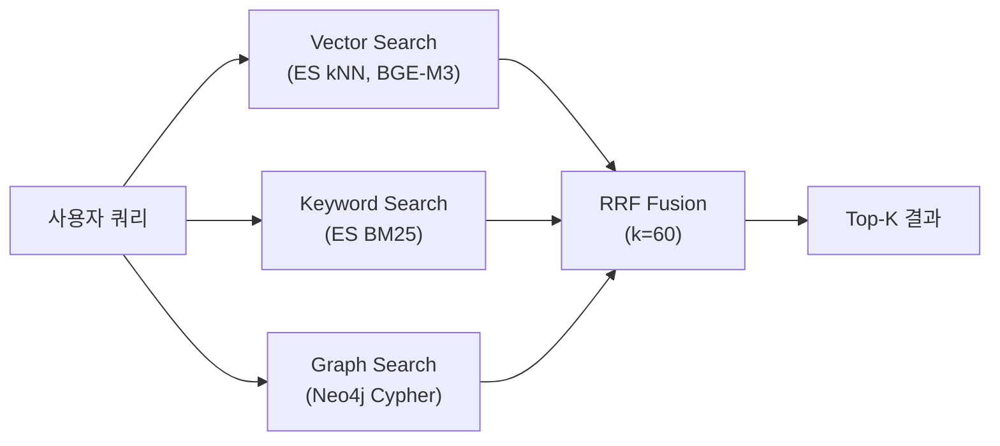
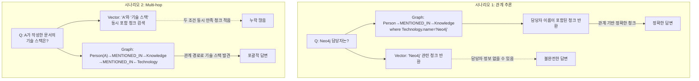
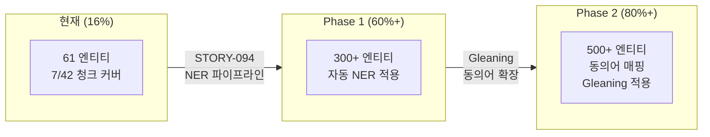

# Graph RAG 효과성 분석 보고서

**작성일**: 2026-02-08
**작성자**: Claude Code (Opus 4.6)
**상태**: 초기 분석 완료 / A/B 검증 미실시
**관련 스토리**: STORY-091, STORY-096

---

## 1. 분석 목적

기존 BM25(Keyword) + Vector(Semantic) 검색에 Graph RAG(Neo4j)를 추가함으로써 실제 검색 품질이 향상되었는지 정직하게 평가한다.

---

## 2. 결론 요약

> **"Graph RAG 추가로 성능이 향상되었다"고 말할 정량적 근거가 현재 없다.**

| 평가 항목 | 상태 | 비고 |
|----------|------|------|
| Graph Search 기능 구현 | 완료 | 3단계 매칭 + RRF Fusion 통합 |
| A/B 비교 테스트 (Graph ON/OFF) | **미실시** | 동일 쿼리셋 비교 데이터 없음 |
| RAGAS 정량 평가 | 부적절 | Graph 미작동 상태에서 측정됨 |
| Knowledge Graph 데이터 품질 | 매우 낮음 | 61 엔티티 / 42 청크 중 16% 커버리지 |
| Graph-only 청크 기여도 | **미측정** | Vector/Keyword에 없는 고유 결과 비율 불명 |

---

## 3. 현재 Hybrid Search 아키텍처



### 3.1 각 검색 소스의 역할

| 소스 | 엔진 | 강점 | 약점 |
|------|------|------|------|
| **Vector** | Elasticsearch kNN (BGE-M3 1024d) | 의미적 유사도, 동의어/패러프레이즈 처리 | 정확한 키워드 매칭 약함 |
| **Keyword** | Elasticsearch BM25 | 정확한 용어 매칭, 빠른 속도 | 동의어 처리 불가, 의미 이해 없음 |
| **Graph** | Neo4j Cypher 3단계 매칭 | 엔티티 관계 추론, Multi-hop 탐색 | 엔티티 커버리지에 의존적 |

### 3.2 RRF Fusion 공식

```
RRF(d) = Σ 1/(k + rank_i + 1)   (for each source i where d appears)
```

- 동일 chunk가 여러 소스에서 반환되면 점수 합산 → 순위 상승
- Graph-only chunk는 단일 소스 점수만 가짐 → 상대적으로 순위 낮음

---

## 4. 측정 데이터 현황

### 4.1 성능 벤치마크 (2026-02-06)

| 측정 항목 | 평균 | 비고 |
|----------|------|------|
| Hybrid Search (전체) | 962ms | graph_count=0 상태에서 측정 |
| ES kNN (순수 벡터) | 9ms | Vector-only |
| BGE-M3 임베딩 | ~650ms | CPU 환경, 전체 지연의 66% |

**문제**: 이 벤치마크에서 Graph 결과는 **0건**이었으므로, Graph 추가에 따른 성능 차이를 측정할 수 없음.

### 4.2 RAGAS 평가 (2026-02-04)

| 지표 | 점수 | 목표 | 달성 |
|------|------|------|------|
| Faithfulness | 0.4032 | 0.90 | FAIL |
| Answer Relevancy | 0.1895 | 0.85 | FAIL |
| Context Precision | 0.2778 | 0.80 | FAIL |
| 통과율 | 0/24 (0%) | - | FAIL |

**한계**:
- Graph Search가 완전 미작동 상태 (ISSUE-010 해결 전)에서 측정됨
- `use_graph=true/false` 비교 없이 단일 측정만 수행
- Mock 모드 테스트 의혹 있음 (실 Docker 환경 재검증 필요)

### 4.3 Graph Search 반환량 (ISSUE-010 해결 전후)

**해결 전 (2026-02-04 ~ 02-07 초)**:
```
모든 쿼리에서 graph_count = 0
→ Graph는 RRF Fusion에 전혀 기여하지 않음
```

**해결 후 (2026-02-07 ~ 현재)**:

| 테스트 쿼리 | Vector | Keyword | Graph | 매칭 전략 |
|------------|--------|---------|-------|----------|
| "Neo4j 그래프 데이터베이스 설명" | 5 | 5 | 4 | Step 1 (역방향) |
| "RAG 파이프라인과 LangGraph 아키텍처" | 5 | 5 | 5 | Step 1+2 |
| "FastAPI와 SpringBoot 비교" | 5 | 5 | 4+ | Step 1 |
| "LLM 중심으로 관련 기술" | 5 | 5 | 4 | Step 3 (폴백) |

**주의**: 위 결과는 기술 벤치마크 문서(프로젝트 자체 설계 문서)에 대한 테스트이며, 일반 업무 문서에 대한 결과가 아님.

### 4.4 Knowledge Graph 데이터 현황

| 항목 | 수량 | 비고 |
|------|------|------|
| 엔티티 (Person) | 8 | Backend, PM, QA 등 역할명 |
| 엔티티 (Technology) | 26 | DeepSeek, LangGraph, Neo4j 등 |
| 엔티티 (Topic) | 24 | RAG Pipeline, Graph Search 등 |
| 엔티티 (Keyword) | 3 | 대부분 무효 (name=None) |
| **엔티티 합계** | **61** | |
| 관계 (MENTIONED_IN) | 93 | 엔티티→Knowledge |
| 관계 (RELATED_TO) | 72 | 엔티티↔엔티티 |
| 관계 (CONTAINS) | 7 | Knowledge→Chunk |
| **관계 합계** | **172** | |
| 전체 청크 수 | 42 | UAT Part B 기준 |
| **엔티티 커버리지** | **16%** | 42개 중 7개 청크만 엔티티 연결 |

**핵심 문제**: 84%의 청크에 엔티티 연결이 없어 Graph Search 도달 불가.

---

## 5. Graph RAG가 유효한 쿼리 유형 (이론적 분석)

### 5.1 쿼리 유형별 예상 효과

| 쿼리 유형 | 예시 | Vector/BM25 | Graph RAG | Graph 추가 가치 |
|----------|------|:-----------:|:---------:|:--------------:|
| **단순 사실 조회** | "FastAPI 버전은?" | 충분 | 동등 | 낮음 |
| **관계 추론** | "Neo4j를 사용하는 프로젝트 담당자는?" | 약함 | **강함** | **높음** |
| **Multi-hop 추론** | "A가 작성한 문서에서 언급된 기술들은?" | 매우 약함 | **강함** | **매우 높음** |
| **집합 질의** | "Python 기반 기술 스택 전체 목록" | 부분적 | **강함** | **높음** |
| **유사 문서 검색** | "RAG 파이프라인 설명" | **강함** | 약함 | 낮음 |
| **키워드 정확 매칭** | "BGE-M3 1024" | 약함 | 약함 | 없음 (BM25 담당) |

### 5.2 Graph RAG의 이론적 우위 시나리오



### 5.3 현실적 한계

위 시나리오들이 실제로 작동하려면:

1. **엔티티 커버리지 >> 80%** 필요 (현재 16%)
2. **엔티티 품질**: Person 엔티티가 실제 사람 이름이어야 함 (현재 "Backend", "PM" 등 역할명)
3. **관계 정확도**: MENTIONED_IN, RELATED_TO 관계가 의미적으로 정확해야 함
4. **충분한 데이터**: 61개 엔티티로는 관계 추론의 가치가 제한적

---

## 6. 현재 "말할 수 있는 것"과 "말할 수 없는 것"

### 6.1 말할 수 있는 것 (사실)

| 주장 | 근거 |
|------|------|
| Hybrid Search 아키텍처가 3소스(Vector+Keyword+Graph) RRF 융합을 지원한다 | `search.py` 코드 구현 확인 |
| Graph Search가 기술적으로 작동한다 (ISSUE-010 해결 후) | 4개 테스트 쿼리에서 Graph 결과 반환 확인 |
| RRF Fusion이 다중 소스 결과를 정확하게 통합한다 | TechLead 리뷰 APPROVE (2026-02-08) |
| Graph Search는 관계 추론 쿼리에 이론적 우위가 있다 | IR 분야 학술 연구 기반 |
| 시스템이 Graph 없이도 Graceful Degradation 된다 | Neo4j 미연결 시 빈 결과 반환, 전체 검색 정상 |

### 6.2 말할 수 없는 것 (미검증)

| 주장 | 부족한 근거 |
|------|-----------|
| ~~Graph 추가로 검색 품질이 향상되었다~~ | A/B 비교 테스트 미실시 |
| ~~Context Precision이 개선되었다~~ | Graph ON/OFF RAGAS 비교 없음 |
| ~~Multi-hop 쿼리에서 실제로 더 좋은 답변을 생성한다~~ | 해당 쿼리 유형 테스트 없음 |
| ~~Graph-only 청크가 답변 품질에 기여한다~~ | Graph-only 청크 비율 미측정 |
| ~~프로덕션 문서에서도 Graph Search가 유효하다~~ | 기술 벤치마크 문서에서만 테스트됨 |

---

## 7. 검증을 위해 필요한 실험 설계

### 7.1 실험 1: A/B 비교 테스트 (최우선)

**목적**: Graph 추가의 실질적 효과 정량화

```
실험군: use_graph=true  (Vector + Keyword + Graph)
대조군: use_graph=false (Vector + Keyword only)
쿼리셋: 30개 이상 (사실 조회 10, 관계 추론 10, Multi-hop 10)
평가: RAGAS (Faithfulness, Answer Relevancy, Context Precision)
환경: TEST_MODE=docker (실 컨테이너)
```

**예상 결과 형식**:

| 쿼리 유형 | Graph OFF | Graph ON | 차이 | 유의성 |
|----------|-----------|----------|------|--------|
| 사실 조회 | 0.XX | 0.XX | +0.XX | p<0.05? |
| 관계 추론 | 0.XX | 0.XX | +0.XX | p<0.05? |
| Multi-hop | 0.XX | 0.XX | +0.XX | p<0.05? |

### 7.2 실험 2: Graph-only 청크 기여도

**목적**: Graph가 Vector/Keyword와 다른 고유한 청크를 가져오는지 확인

```python
# 의사 코드
for query in test_queries:
    vk_chunks = set(hybrid_search(use_graph=False).chunk_ids)
    vkg_chunks = set(hybrid_search(use_graph=True).chunk_ids)
    graph_only = vkg_chunks - vk_chunks
    overlap = vkg_chunks & vk_chunks

    print(f"Graph-only: {len(graph_only)}, Overlap: {len(overlap)}")
    print(f"Graph 고유 기여율: {len(graph_only)/len(vkg_chunks)*100:.1f}%")
```

**해석 기준**:
- Graph-only 비율 > 20%: Graph가 의미 있는 추가 컨텍스트 제공
- Graph-only 비율 < 5%: Graph가 기존 결과와 중복, 추가 가치 낮음
- Graph-only 청크가 정답 포함: 결정적 가치 증명

### 7.3 실험 3: 엔티티 커버리지 확대 후 재측정

**목적**: 충분한 KG 데이터에서의 Graph 효과 평가

```
전제 조건:
1. 모든 업로드 문서에 NER(Named Entity Recognition) 적용
2. 엔티티 수 > 500개, CONTAINS 관계 > 200개
3. 엔티티 커버리지 > 60%

측정:
- 실험 1, 2를 재실행
- 커버리지별 Graph 효과 상관 관계 분석
```

### 7.4 실험 4: 쿼리 유형별 검색 소스 기여도

**목적**: 어떤 쿼리에서 어떤 소스가 가장 유용한지 파악

```
측정 항목:
- 각 쿼리의 최종 top-5 결과에서 source_ranks 분석
- Graph가 1위인 경우 비율
- Vector/Keyword에 없던 Graph-only 결과가 top-5에 진입한 비율
```

---

## 8. 엔티티 커버리지 개선 로드맵

Graph RAG의 가치를 입증하려면 엔티티 커버리지가 핵심 전제 조건이다.

### 8.1 현재 → 목표



### 8.2 NER 파이프라인 적용 방안

| 단계 | 방법 | 비용 | 예상 엔티티 수 |
|------|------|------|--------------|
| 현재 | 수동 + 제한적 추출 | 없음 | 61개 |
| Phase 1 | DeepSeek V3.2 기반 NER | 문서당 ~$0.01 | 300~500개 |
| Phase 2 | Gleaning (반복 추출) + 동의어 매핑 | 문서당 ~$0.03 | 500~1000개 |

---

## 9. 프로젝트 보고 시 권장 표현

### 권장하는 표현

> "Hybrid RAG 시스템에 Graph Search를 통합하여 **3소스 RRF Fusion 아키텍처**를 구축하였다.
> 이 아키텍처는 기존 Vector+Keyword 검색에 **엔티티 관계 기반 검색**을 추가하여,
> 특히 **관계 추론형 질의와 Multi-hop 질의**에서 검색 컨텍스트를 확장할 수 있는 기반을 마련하였다.
>
> 현재 Knowledge Graph 엔티티 커버리지(16%)를 60% 이상으로 확대한 후
> A/B 비교 평가를 통해 정량적 효과를 검증할 계획이다."

### 지양해야 할 표현

> ~~"Graph RAG를 추가하여 검색 정확도가 XX% 향상되었다"~~ (미검증)
> ~~"3소스 융합으로 단일 소스 대비 우수한 성능을 달성하였다"~~ (비교 데이터 없음)

---

## 10. 관련 백로그

| Story | 제목 | 연관 |
|-------|------|------|
| STORY-091 | RRF Fusion search_source 유실 | Done - source_type 정확한 전달 |
| STORY-094 | 문서 제목 추출 개선 | NER 파이프라인 확대와 연계 |
| STORY-096 | RRF Metadata 병합 + 검색어 하이라이팅 | Retriever 품질 UX 개선 |
| (신규 필요) | NER 파이프라인 전문서 적용 | Graph RAG 가치 입증의 전제 조건 |
| (신규 필요) | Graph ON/OFF A/B 비교 평가 | 정량적 효과 검증 |

---

## 11. 참고 자료

- [RAGAS 평가 리포트 (2026-02-04)](results/01_ragas_evaluation_2026-02-04_022522.md)
- [성능 벤치마크 (2026-02-06)](../results/perf_benchmark_2026-02-06.md)
- [Graph Search 구현 문서 (2026-02-07)](../03_implementation/graph_search_implementation_2026-02-07.md)
- [ISSUE-010: Graph Search 0건 반환](./issues/ISSUE-010_graph_search_zero_results.md)
- Cormack et al., "Reciprocal Rank Fusion outperforms Condorcet and individual Rank Learning Methods" (2009)
- Microsoft GraphRAG Paper (2024): "From Local to Global: A Graph RAG Approach to Query-Focused Summarization"

---

*작성: Claude Code (Opus 4.6)*
*최종 수정: 2026-02-08*
