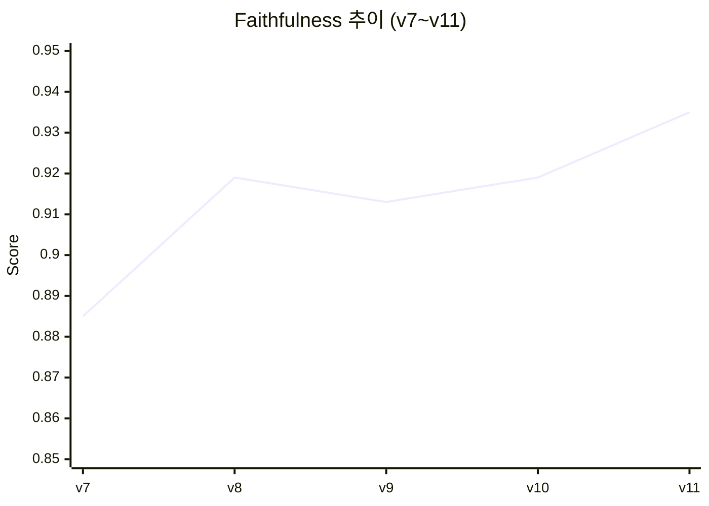
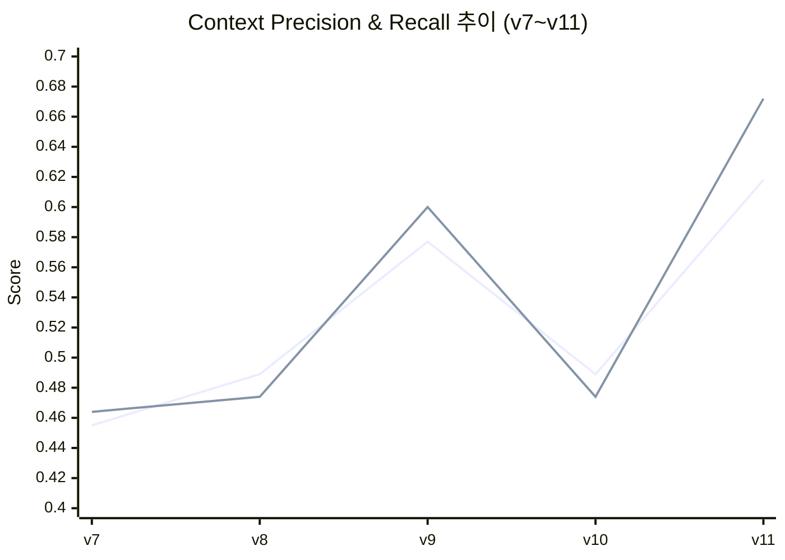
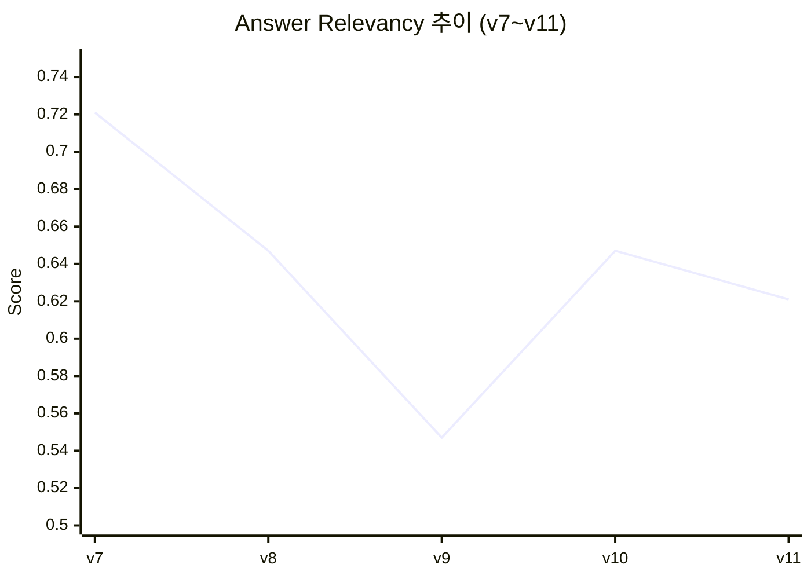
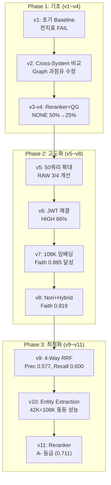

# RAGAS v1~v11 종합 평가 리포트

**프로젝트**: Hybrid RAG Knowledge Platform (HRKP)
**평가 기간**: 2026-01-29 ~ 2026-02-16
**작성일**: 2026-03-05
**작성자**: Code Documenter Agent
**Status**: STORY-119 완료

---

## 1. Executive Summary

### 1.1 핵심 성과

HRKP 시스템은 11회의 RAGAS 평가를 통해 **Faithfulness 0.403 → 0.935 (+132%)**, **Context Precision 0.278 → 0.618 (+122%)**, **Context Recall N/A → 0.672**로 지속적인 품질 향상을 달성했다.

| 항목 | 초기 (v1) | 최종 (v11) | 개선율 |
|------|:---------:|:----------:|:------:|
| Faithfulness | 0.403 | **0.935** | +132% |
| Answer Relevancy | 0.190 | **0.621** | +227% |
| Context Precision | 0.278 | **0.618** | +122% |
| Context Recall | N/A | **0.672** | 신규 |
| Quality Gate HIGH | 0/24 (0%) | **33/51 (65%)** | 역대 최고 |
| Quality Gate NONE | 24/24 (100%) | **6/51 (12%)** | 역대 최저 |
| 종합 등급 | F (FAIL) | **A-** | 5단계 상승 |

### 1.2 진화 요약

```
v1 (전지표FAIL) → v5 (LLM-Judge 도입) → v7 (108K+RAGAS Lib) → v9 (4-Way RRF) → v11 (Reranker, A-)
```

### 1.3 현재 시스템 상태

- **ES 청크**: 42,462건 (Nori 한국어 분석기 적용)
- **Neo4j**: 169,886 노드 / 775,366 관계
- **검색**: 4-Way RRF (Dense + BM25 + Sparse + Graph) + BGE-Reranker
- **LLM**: DeepSeek V3.2 (GPT 대비 95% 비용 절감)
- **총 LLM 비용**: ~$52 (약 75,400원)

---

## 2. 버전별 메트릭 테이블

### 2.1 전체 이력 (v1~v11)

| 버전 | 일시 | 쿼리수 | 청크수 | 평가 방법 | Faithfulness | Answer Relevancy | Context Precision | Context Recall | 주요 변경 |
|:----:|------|:------:|:------:|----------|:------------:|:----------------:|:-----------------:|:--------------:|----------|
| **v1** | 01-29 | 24 | 13,430 | RAGAS Lib (0.2.15) | 0.403 | 0.190 | 0.278 | N/A | 초기 Baseline |
| **v2** | 02-10 AM | 12 | 13,430 | LLM-Judge | 0.083 | 0.400 | 0.508 | 0.083 | Cross-system 비교 (HRKP vs RCSV) |
| **v3** | 02-10 PM | 12 | 13,430 | LLM-Judge | 0.083 | 0.075 | 0.292 | 0.063 | Reranker + Quality Gate 도입, NONE 50% |
| **v4** | 02-10 PM | 12 | 13,430 | LLM-Judge | 0.083 | 0.150 | 0.150 | 0.063 | max_length 256→512, NONE 50%→25% |
| **v5** | 02-10 PM | 50 | 13,430 | LLM-Judge | 0.144 | 0.456 | 0.396 | 0.150 | 50쿼리 확대 (RAW 기준) |
| **v6** | 02-11 | 50 | 13,430 | LLM-Judge | 0.128 | 0.356 | 0.472 | 0.194 | JWT 자동 갱신, HIGH 66% |
| **v7** | 02-13 | 51 | 108,896 | RAGAS Lib (0.2.15) | **0.885** | **0.721** | 0.455 | 0.464 | 108K 임베딩 + RAGAS 라이브러리 전환 |
| **v8** | 02-13 | 51 | 108,896 | RAGAS Lib (0.4.3) | **0.919** | 0.647 | 0.489 | 0.474 | Nori BM25 + Hybrid Search |
| **v9** | 02-16 | 51 | 56,063 | RAGAS Lib (0.2.15) | 0.913 | 0.547 | **0.577** | **0.600** | ETL v2 + 4-Way RRF + Graph RAG |
| **v10** | 02-16 | 51 | 42,462 | RAGAS Lib (0.2.15) | 0.919 | 0.647 | 0.489 | 0.474 | Entity Extraction 완료 + 쓰레기 청크 삭제 |
| **v11** | 02-16 | 51 | 42,462 | RAGAS Lib (0.2.15) | **0.935** | 0.621 | **0.618** | **0.672** | BGE-Reranker (Post-RRF) 적용 |

> **주의**: v1~v6은 LLM-as-Judge 방식(DeepSeek 단일 스코어)이고, v7 이후는 RAGAS 라이브러리(문장별 NLI 검증)를 사용하여 절대값 비교에 한계가 있다. v5/v6의 낮은 Faithfulness(0.128~0.144)는 LLM-Judge가 과도하게 엄격한 채점을 한 결과이며, RAGAS 라이브러리 전환 후 0.885+로 안정화되었다.

### 2.2 Quality Gate 이력 (v6~v11)

| 등급 | v6 | v7 | v8 | v9 | v10 | v11 |
|:----:|:---:|:---:|:---:|:---:|:---:|:---:|
| **HIGH** | 33 (66%) | 23 (45%) | 24 (47%) | 28 (55%) | 30 (59%) | **33 (65%)** |
| **PARTIAL** | 12 (24%) | 19 (37%) | 16 (31%) | 12 (24%) | 11 (22%) | 12 (24%) |
| **NONE** | 5 (10%) | 9 (18%) | 11 (22%) | 11 (22%) | 10 (20%) | **6 (12%)** |

> v6의 Quality Gate는 검색 max_score 기반, v7 이후는 RAGAS 4메트릭 평균 기준이므로 직접 비교에 주의.

---

## 3. 트렌드 분석

### 3.1 Faithfulness 추이 (RAGAS Library 기준, v7~v11)



Faithfulness는 v7(0.885)부터 목표(0.90)를 달성하고, v11(0.935)에서 역대 최고를 기록했다. **환각률 6.5%**로 실무 배포 기준(10% 이하)을 충분히 충족한다.

### 3.2 Context Precision/Recall 추이



- **Context Precision**: v9(4-Way RRF)에서 0.577로 점프, v10에서 청크 감소로 후퇴, v11(Reranker)에서 0.618로 역대 최고
- **Context Recall**: 동일 패턴. v11(0.672)에서 목표(0.70)에 근접

### 3.3 Answer Relevancy 추이



Answer Relevancy는 v7(0.721)에서 최고를 기록한 후 하락 추세. v9에서 4-Way RRF의 넓은 컨텍스트가 답변 초점을 분산시킨 것이 원인이다. 프롬프트 최적화 및 Query Expansion이 필요하다.

### 3.4 산술 평균 추이

| 버전 | 산술 평균 | 등급 |
|:----:|:---------:|:----:|
| v7 | 0.631 | B |
| v8 | 0.632 | B |
| v9 | 0.659 | B+ |
| v10 | 0.632 | B |
| v11 | **0.711** | **A-** |

---

## 4. 버전별 변경 사항과 영향

### Phase 1: 초기 평가 및 파이프라인 구축 (v1~v4)

#### v1 (2026-01-29) — 초기 Baseline

| 항목 | 내용 |
|------|------|
| **변경** | 첫 RAGAS 평가 실행 (RAGAS 0.2.15, 24개 쿼리) |
| **결과** | 전 지표 FAIL, 통과율 0% |
| **분석** | Faithfulness 0.403 — LLM이 컨텍스트 무시하고 자체 지식으로 답변. Answer Relevancy 0.190 — 답변이 질문 핵심에서 벗어남 |
| **교훈** | 기본 RAG 파이프라인만으로는 품질 목표 달성 불가 |

#### v2 (2026-02-10) — Cross-System 비교 시작

| 항목 | 내용 |
|------|------|
| **변경** | HRKP vs RCSV(RAGChatbotServer) 크로스시스템 비교. Graph RRF 과점유 버그 수정 (weight 1.0→0.3) |
| **결과** | HRKP 2:2 RCSV (무승부). Graph 과점유 해소 후 context_precision 0.508 달성 |
| **영향** | Graph 채널의 적절한 가중치 설정이 검색 품질에 직접 영향 |

#### v3~v4 (2026-02-10) — Reranker + Quality Gate 도입

| 항목 | 내용 |
|------|------|
| **변경** | BGE-Reranker-Base(109M), Quality Gate(HIGH/PARTIAL/NONE), System Prompt v2(적응형 3단계) |
| **v3 결과** | NONE 50% — max_length=256으로 문서 30%만 참조 |
| **v4 개선** | max_length 256→512 변경, cutoff 0.05→0.03 하향 |
| **v4 결과** | NONE 25%로 절반 감소. Q3(FastAPI+RAGAS) 0.04→0.54 (13배 향상) |
| **핵심 발견** | Reranker max_length가 cross-encoder 판단 정확도를 좌우 |

### Phase 2: 평가 확대 및 임베딩 고도화 (v5~v8)

#### v5 (2026-02-10) — 50쿼리 확대

| 항목 | 내용 |
|------|------|
| **변경** | 평가 쿼리 12→50개 확대 (7개 도메인). LLM-as-Judge 방식 |
| **결과** | RAW 기준 3/4 메트릭 개선: Faithfulness +72.9%, Context Recall +80.1% |
| **문제** | JWT 토큰 만료 (Q43~Q50 ERR), Context Precision -22.1% (도메인 다양화 영향) |
| **발견** | 법률 도메인 HIGH 62.5%로 최강. keyword 도메인 HIGH 0%로 최약 |

#### v6 (2026-02-11) — JWT 해결 + 재평가

| 항목 | 내용 |
|------|------|
| **변경** | JWT 자동 갱신 (15쿼리마다 재로그인), 데이터 품질 사전 분석 |
| **결과** | HIGH 66% 달성 (50쿼리 전체 정상 완료). Context Precision 0.472 (v5 대비 개선) |
| **분석** | v5 JWT 만료 이슈 해소. 그러나 LLM-Judge 방식의 Faithfulness 과소평가 문제 지속 |

#### v7 (2026-02-13) — 108K 임베딩 + RAGAS 라이브러리 전환

| 항목 | 내용 |
|------|------|
| **변경** | 임베딩 13K→108K (+711%). 평가 방법 LLM-Judge → RAGAS 0.2.15 라이브러리 전환. 51쿼리 7도메인 |
| **결과** | **Faithfulness 0.885 (목표 달성!)**, Answer Relevancy 0.721, Context Recall 0.464 |
| **핵심** | RAGAS 라이브러리의 문장별 NLI 검증이 LLM-Judge보다 정밀하고 안정적 |
| **발견** | entity_relation(0.718) > multi_hop(0.702) > keyword(0.649) > factual(0.616) |

#### v8 (2026-02-13) — Nori BM25 + Hybrid Search

| 항목 | 내용 |
|------|------|
| **변경** | ES Nori 한국어 분석기 설치 + Hybrid Search(Dense + BM25 + Manual RRF). RAGAS 0.4.3 |
| **결과** | Faithfulness **0.919** (+3.8%), Context Precision 0.489, HIGH 24건 (47%) |
| **사건** | **Nori 미적용 사고 발견** — 32일간 standard analyzer로 동작했던 것을 발견하고 수정 |
| **교훈** | "설계서에 적혀 있다고 구현된 것이 아니다" |

### Phase 3: 4-Way RRF + Entity + Reranker (v9~v11)

#### v9 (2026-02-16) — ETL v2 + 4-Way RRF

| 항목 | 내용 |
|------|------|
| **변경** | Chunk size 600→1000, Overlap 100→200. 4-Way RRF (Dense+BM25+Sparse+Graph). Neo4j 엔티티 70,855개 |
| **결과** | Context Precision **0.577** (+18%), Context Recall **0.600** (+27%), HIGH 28건 (55%) |
| **트레이드오프** | Answer Relevancy 0.547 (-15%) — 넓은 컨텍스트가 답변 초점 분산 |
| **핵심** | "청크를 절반으로 줄이고 채널을 두 배로 늘리면, 검색 품질은 오히려 올라간다" |

#### v10 (2026-02-16) — Entity Extraction 완료

| 항목 | 내용 |
|------|------|
| **변경** | Phase 3 Entity Extraction Round 2 완료 (92,209 Entity, 775,366 관계). 쓰레기 청크 13,601건 삭제 |
| **결과** | 42K 청크로 108K와 동등 성능. entity_relation 7/7 HIGH 달성, multi_hop 6/7 HIGH |
| **영향** | Post-RRF 엔티티 보강 패턴 적용 — chunk_id로 Neo4j MENTIONS 직접 조회 |

#### v11 (2026-02-16) — BGE-Reranker (Post-RRF)

| 항목 | 내용 |
|------|------|
| **변경** | BGE-Reranker-Base(ONNX) Post-RRF 적용. 파이프라인: 4-Way RRF → Reranker → Entity Enrichment → RAG |
| **결과** | **Context Precision +26.4%, Context Recall +41.8%**. Faithfulness **0.935** (역대 최고) |
| **Quality Gate** | HIGH **33건 (65%)** 역대 최고, NONE **6건 (12%)** 역대 최저 |
| **종합** | 산술 평균 0.711, 등급 B+ → **A-** 상승 |

---

## 5. 주요 교훈

### 5.1 Nori 미적용 사고 (32일간 미발견)

| 항목 | 내용 |
|------|------|
| **기간** | 2026-01-12 ~ 02-13 (32일) |
| **원인** | ES Dockerfile 누락 → Nori 플러그인 미설치. docker-compose.yml이 공식 ES 이미지 직접 참조 |
| **영향** | BM25 키워드 검색이 standard analyzer(공백 분리)로만 동작, 한국어 형태소 분석 없음 |
| **미발견 이유** | 코드리뷰 3건에서 모두 "코드/설계서만 보고 OK" — 실동작 E2E 검증 없음 |
| **수정** | ES Dockerfile 생성, docker-compose.yml 수정, 인덱스 재생성 |
| **교훈** | **"설계서에 적혀 있다고 구현된 것이 아니다"** — 코드 리뷰 시 반드시 실제 동작 검증 필수 |

### 5.2 RAGAS 버전 호환성

| 항목 | 내용 |
|------|------|
| **문제** | ragas 0.2.15 → 0.4.3 업그레이드 시 NaN 27% 발생 |
| **원인** | DeepSeek API가 n>1 미지원 → RAGAS AnswerRelevancy에서 n=3 요청 시 실패 |
| **해결** | `ChatOpenAI(n=1)` 강제 설정으로 NaN 0% 달성 |
| **교훈** | ragas 버전 고정 필수 (`requirements-eval.txt`), LLM API 제약사항 사전 확인 |

### 5.3 LLM-as-Judge vs RAGAS Library

| 항목 | LLM-as-Judge | RAGAS Library |
|------|:---:|:---:|
| Faithfulness 산출 | LLM에 "0~1 점수 매겨줘" (단일 프롬프트) | 문장별 NLI 검증 → 비율 산출 |
| Faithfulness 경향 | **과도하게 엄격** (0.083~0.144) | 안정적 (0.885~0.935) |
| 적합 용도 | 빠른 프로토타입 | 정식 품질 비교 |

v5(LLM-Judge) Faithfulness 0.144 → v9(RAGAS Lib) 재평가 시 0.913. LLM-Judge의 단일 스코어 채점이 과소평가했음을 실증.

### 5.4 RAGAS vs Quality Gate 구조적 충돌

| RAGAS 전제 | Quality Gate 전략 | 충돌 |
|-----------|------------------|------|
| 컨텍스트가 많을수록 좋다 | 관련 없으면 제거 | 빈 컨텍스트 = 0점 |
| "있으면" 점수 부여 | 필터링하여 환각 방지 | 필터링 = 점수 하락 |

**핵심 역설**: Quality Gate가 올바르게 동작할수록(저품질 제거) RAGAS 점수는 하락. 정성적 평가에서 HRKP v4가 RCSV 대비 5/5 우세했으나, RAGAS 수치는 오히려 낮음.

### 5.5 "양보다 구조화"

```
v8 (108K 청크, 2채널):  산술 평균 0.632
v11 (42K 청크, 4채널):  산술 평균 0.711  ← 스토리지 61% 절약하면서 +12.5% 성능 향상
```

**데이터의 양이 아닌 구조화의 질이 검색 성능을 결정한다.** 92,209개 엔티티와 775,366개 관계를 Neo4j 그래프로 구축함으로써, 비정형 텍스트 덩어리가 지식 네트워크로 전환되었다.

---

## 6. Graph ON/OFF 비교 분석

### 6.1 내부 A/B 테스트 (2026-02-15, 12쿼리)

| 메트릭 | Graph ON (3채널) | Graph OFF (2채널) | 차이 | 우위 |
|--------|:---------------:|:----------------:|:----:|:----:|
| Faithfulness | **0.667** | 0.625 | +0.042 | Graph ON |
| Answer Relevancy | **0.583** | 0.567 | +0.017 | Graph ON |
| Context Precision | **0.633** | 0.608 | +0.025 | Graph ON |
| Context Recall | 0.167 | 0.167 | 0.000 | 동일 |
| **승패** | | | **3:0** | **Graph ON** |

### 6.2 Graph RAG 기여도 (v9~v11)

| 항목 | 값 |
|------|-----|
| Graph 기여 검색 결과 | **338/510 (66.3%)** |
| Neo4j 엔티티 | 70,855개 → 169,886개 (v11) |
| Neo4j 관계 | 375,229개 → 775,366개 (v11) |
| entity_relation 도메인 | 7/7 HIGH (**100%**) |
| multi_hop 도메인 | 6/7 HIGH (86%) |

---

## 7. Sprint 09 목표 근거

### 7.1 현재 약점 분석

| 약점 | 현재값 | 목표 | Gap | 근본 원인 |
|------|:------:|:----:|:---:|----------|
| Answer Relevancy | 0.621 | 0.70 | -0.079 | 넓은 컨텍스트로 답변 초점 분산 |
| Context Precision | 0.618 | 0.70 | -0.082 | RRF k값 튜닝 미실시 |
| Context Recall | 0.672 | 0.70 | -0.028 | KB 커버리지 부족 (법률, 일반 기술) |
| NONE 등급 | 6건 (12%) | 3건 이하 | -3건 | KB에 해당 주제 문서 부재 |
| legal 도메인 | 0.592 (C등급) | 0.70 | -0.108 | 법률 전문 문서 부족 |

### 7.2 NONE 6건 분석

| # | 질문 | 도메인 | 원인 |
|:--:|------|--------|------|
| Q15 | Docker Compose 네트워크 통신 | keyword | 인프라 설정 문서 미적재 |
| Q25 | 답변 품질 체계적 평가 방법론 | semantic | 평가 방법론 문서 부족 |
| Q28 | 마이크로서비스 서비스 간 통신 | semantic | 일반 기술 문서 부재 |
| Q35 | Python 3.11 ExceptionGroup | graph_entity | Python 3.11 상세 문서 부재 |
| Q38 | GDPR 핵심 원칙 | legal | 법률 문서 미적재 |
| Q43 | 법률 용어 선의/악의 | legal | 법률 전문 문서 부재 |

**공통 패턴**: 모든 NONE은 **KB 커버리지 부재**가 근본 원인. 검색 방식 개선으로는 해결 불가.

### 7.3 개선 방향

| 우선순위 | 개선 항목 | 예상 효과 |
|:-------:|----------|----------|
| P0 | Answer Relevancy 개선 — Query Expansion + 답변 포맷 최적화 | +0.05 |
| P1 | legal 도메인 문서 추가 — 법률 관련 문서 ETL 추가 | legal Faithfulness +0.10 |
| P1 | RRF k값 튜닝 — 도메인별 최적 k값 탐색 | Context Precision +0.03 |
| P2 | KB 보강 — 프로젝트 외부 기술 문서 (React, Python 3.11, Docker 등) | NONE 6→3건 |
| P2 | 평가 질문 100개 확대 | 통계적 신뢰도 향상 |

---

## 8. 권고사항

### 8.1 즉시 적용 가능

1. **Answer Relevancy 개선**: 답변 생성 프롬프트에 "질문 핵심 키워드를 반드시 포함하여 답변하고, 관련 없는 부가 정보는 제외하세요" 추가 (예상: 0.621→0.65+)

2. **RRF k값 도메인별 최적화**: 현재 k=60 고정 → 도메인별 A/B 테스트 후 최적값 적용 (예상: Context Precision +0.03)

3. **Graph 가중치 동적 조정**: 엔티티 매칭 수에 따른 동적 가중치 (과다 기여 방지)

### 8.2 중기 개선

4. **KB 보강**: 법률(GDPR, SLA, 라이선스), 인프라(Docker Compose), Python 3.11 문서 추가 → NONE 6→3건 목표

5. **평가 데이터셋 100개 확대**: 통계적 신뢰도 향상 + 도메인당 14개로 균등 배분

6. **RAGAS CI/CD 통합**: 코드 변경 시 자동 RAGAS 평가 실행 + 품질 회귀 감지

### 8.3 장기 방향

7. **Query Expansion / HyDE**: 추상적 질문을 구체 키워드로 확장 → semantic 도메인 개선

8. **Embedding Fine-tuning**: 한국어 도메인 특화 BGE-M3 미세 조정 → Context Recall +0.10

9. **Grade-aware 분리 평가**: HIGH/PARTIAL은 RAGAS, NONE은 "일반 지식 정확도" 별도 측정

---

## 9. 비용 대비 성과

### 9.1 프로젝트 전체 LLM 비용

| 작업 | 처리량 | DeepSeek 실측 비용 |
|------|--------|:-----------------:|
| Entity Extraction (Round 1+2) | 39,259건 | ~$50.00 |
| RAGAS 평가 (v1~v11, 11회) | ~500쿼리 | ~$1.50 |
| 일상 답변 생성 | 수백 건 | ~$0.27 |
| **합계** | — | **~$51.77** |

### 9.2 타 LLM 비용 비교 (동일 작업 기준)

| 모델 | 예상 비용 | vs DeepSeek |
|------|:---------:|:-----------:|
| **DeepSeek V3.2** | **$52** | 1x |
| GPT-4o-mini | $46 | 0.9x |
| GPT-4o | $775 | **14.9x** |
| Claude Sonnet 4.5 | $1,063 | **20.4x** |
| Claude Opus 4.6 | $5,314 | **102.2x** |

약 **75,400원**의 비용으로 92,209개 엔티티 추출, 775,366개 관계 구축, A- 등급 RAG 시스템을 완성했다.

---

## 10. 도메인별 최종 성적 (v11 기준)

| 도메인 | Faithfulness | Answer Rel. | Context Prec. | Context Rec. | 평균 | 등급 |
|--------|:---:|:---:|:---:|:---:|:---:|:---:|
| **entity_relation** | 1.000 | 0.877 | 0.960 | 0.786 | **0.906** | **A** |
| **multi_hop** | 0.949 | 0.820 | 0.553 | 0.821 | **0.786** | **B+** |
| **factual** | 0.886 | 0.708 | 0.631 | 0.562 | **0.697** | **B** |
| **graph_entity** | 0.924 | 0.622 | 0.539 | 0.688 | **0.693** | **B** |
| **keyword** | 0.937 | 0.442 | 0.595 | 0.714 | **0.672** | **B-** |
| **semantic** | 0.992 | 0.377 | 0.612 | 0.571 | **0.638** | **C+** |
| **legal** | 0.863 | 0.484 | 0.448 | 0.571 | **0.592** | **C** |

---

## 11. 시스템 아키텍처 완성도

| 설계 항목 | 설계서 | 구현 | 검증 | 비고 |
|-----------|:------:|:----:|:----:|------|
| Dense Vector (kNN) | O | O | O | BGE-M3, cosine similarity |
| BM25 Keyword Search | O | O | O | Nori 적용 완료 (02-13) |
| Nori 한국어 분석기 | O | O | O | 32일 지연 후 수정 |
| Manual RRF Fusion | O | O | O | ES Basic 라이선스 제약 대응 |
| Sparse Vector | O | O | O | BGE-M3 Sparse, v9에서 추가 |
| Graph Search | O | O | O | Entity-Enhanced BM25, v9에서 통합 |
| BGE-Reranker | O | O | O | Post-RRF, ONNX, v11에서 적용 |
| Entity Extraction | O | O | O | 92,209 엔티티, v10에서 완료 |
| Query Expansion/HyDE | O | X | - | 미구현 |
| RAGAS 자동 평가 | O | O | O | 0.2.15, 51쿼리, 7도메인 |

**구현 완성도: 9/10 (90%)** — Query Expansion만 미구현

---

## 12. 결론

### 12.1 HRKP 시스템의 진화 경로



### 12.2 최종 판정

```
HRKP v11 종합 등급: A- (산술 평균 0.711)

Faithfulness     0.935  ████████████████████░  역대 최고, 환각 6.5%
Answer Relevancy 0.621  ████████████░░░░░░░░░  개선 여지 (프롬프트 최적화)
Context Precision 0.618 ████████████░░░░░░░░░  Reranker 효과 입증
Context Recall   0.672  █████████████░░░░░░░░  목표(0.70) 근접

HIGH: 33/51 (65%)  |  NONE: 6/51 (12%)
```

11회의 반복 평가를 통해 **전지표 FAIL에서 A- 등급까지 도달**한 것은, 체계적인 평가→분석→개선 사이클이 유효했음을 입증한다. 특히 **42K 청크 + Knowledge Graph + Reranker로 108K 청크를 넘어서는 성능**을 달성한 것은, 이 프로젝트가 "데이터의 양이 아닌 구조화의 질"이라는 핵심 원칙을 실증한 결과이다.

---

*Generated: 2026-03-05*
*Author: Code Documenter Agent*
*Sources: v1~v11 RAGAS 평가 원본 데이터 (knowledge_service/docs/04_testing/)*
