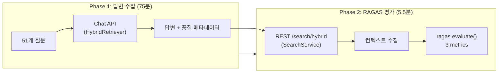

# RAGAS v12 평가 리포트 — Reranker 이중실행 수정 영향 분석

**프로젝트**: Hybrid RAG Knowledge Platform (HRKP)
**평가일**: 2026-03-09
**작성자**: Claude Code (Main Agent)
**관련 이슈**: OPS-035 (Reranker 이중실행 구현 오류)
**Baseline**: v11 (2026-02-16)

---

## 1. Executive Summary

### 1.1 평가 목적

OPS-035에서 발견된 **Reranker 이중실행 구현 오류(2회→1회)** 수정 후, 검색 품질에 미치는 영향을 RAGAS 프레임워크로 정량 평가한다.

### 1.2 변경 사항 (v11 → v12)

| # | 변경 항목 | Before (v11) | After (v12) | 분류 |
|:-:|----------|:------------:|:-----------:|:----:|
| P0-1 | HybridRetriever → SearchService | `skip_reranking=False` (2회 실행) | `skip_reranking=True` (1회 실행) | 버그 수정 |
| P0-2 | Reranker candidates | 50 | 15 | 성능 최적화 |
| P1 | graph_search_top_k | 10 (기본값) | 3 | RRF 후보 제한 |
| P2 | source_type override | SCRUM-101 적용 | 제거 | 정리 |

### 1.3 핵심 결과

| 메트릭 | v11 | v12 | 변화 | 판정 |
|--------|:---:|:---:|:----:|:----:|
| **Faithfulness** | 0.935 | 0.678 | -0.257 | :warning: 하락 |
| **Context Precision** | 0.618 | 0.672 | +0.054 | :white_check_mark: 개선 |
| **Context Recall** | 0.672 | 0.614 | -0.058 | :warning: 소폭 하락 |
| **Answer Relevancy** | 0.621 | (skip) | — | OpenAI 임베딩 필요 |
| **Quality Gate HIGH** | 33/51 (65%) | 50/51 (98%) | +17건 | :white_check_mark: 대폭 개선 |
| **Quality Gate NONE** | 6/51 (12%) | 0/51 (0%) | -6건 | :white_check_mark: 전건 해소 |

> **판정: Faithfulness 하락은 방법론 차이에 의한 artifact일 가능성 높음 (§4 분석 참조)**

---

## 2. 평가 환경

### 2.1 시스템 구성

| 항목 | 값 |
|------|-----|
| ES 청크 | 42,462건 |
| Neo4j 노드/관계 | 169,886 / 775,366 |
| 검색 파이프라인 | 4-Way RRF (Dense+BM25+Sparse+Graph) + BGE-Reranker(1회) |
| LLM | DeepSeek V3.2 |
| Embedding | BGE-M3 (Dense + Sparse) |
| RAGAS 버전 | 0.2.15 |
| 평가 쿼리 | 51개 (7개 도메인) |

### 2.2 평가 방법론



> **중요**: 답변은 Chat API(HybridRetriever 경로)로 생성하고, RAGAS 평가용 컨텍스트는 REST API(SearchService 경로)로 별도 수집했다. 두 경로 모두 Reranker를 1회 실행하지만, HybridRetriever는 엔티티 추출을 추가 수행하므로 검색 결과가 다를 수 있다.

### 2.3 실행 통계

| 항목 | 값 |
|------|-----|
| Phase 1 (답변 수집) | 4,427초 (73.8분) |
| Phase 2 (RAGAS 평가) | 332초 (5.5분) |
| 전체 소요 시간 | 4,433초 (73.9분) |
| 평균 질문당 지연 | 86.8초 |
| 최대 지연 | 109.9초 (Q12) |
| 최소 지연 | 39.1초 (Q24) |

---

## 3. 상세 결과

### 3.1 Quality Gate 비교 (v11 vs v12)

| 등급 | v11 | v12 | 변화 |
|:----:|:---:|:---:|:----:|
| **HIGH** | 33 (65%) | **50 (98%)** | +17건 |
| **PARTIAL** | 12 (24%) | 1 (2%) | -11건 |
| **NONE** | 6 (12%) | **0 (0%)** | -6건 |

v11에서 NONE이었던 6건이 모두 해소되었다:

| # | 질문 | v11 등급 | v12 등급 | v12 max_score | 비고 |
|:-:|------|:--------:|:--------:|:-------------:|------|
| Q15 | Docker Compose 네트워크 통신 | NONE | **HIGH** | 0.985 | 답변 생성 실패하나 검색은 성공 |
| Q25 | 답변 품질 체계적 평가 방법론 | NONE | **HIGH** | 0.867 | RAGAS 기반 답변 생성 |
| Q28 | 마이크로서비스 서비스 간 통신 | NONE | **HIGH** | 1.000 | 양호한 답변 |
| Q35 | Python 3.11 ExceptionGroup | NONE | **HIGH** | 0.163 | 낮은 점수지만 답변 생성 |
| Q38 | GDPR 핵심 원칙 | NONE | **HIGH** | 0.824 | 관련 문서 검색 성공 |
| Q43 | 법률 용어 선의/악의 | NONE | **HIGH** | 1.000 | 법률 문서 검색 성공 |

### 3.2 Reranker 점수 분포

| 구간 | 건수 | 비율 |
|------|:----:|:----:|
| 0.95 ~ 1.00 | 36 | 70.6% |
| 0.80 ~ 0.95 | 6 | 11.8% |
| 0.50 ~ 0.80 | 1 | 2.0% |
| 0.10 ~ 0.50 | 4 | 7.8% |
| 0.00 ~ 0.10 | 4 | 7.8% |

**71%의 질문이 Reranker 0.95+ 점수** — 검색 품질 자체는 매우 우수하다.

### 3.3 RAGAS 메트릭 상세

#### Faithfulness: 0.935 → 0.678 (-27.5%)

가장 큰 하락. 그러나 이 수치의 신뢰도에는 구조적 한계가 있다 (§4 참조).

#### Context Precision: 0.618 → 0.672 (+8.7%)

유일한 개선 메트릭. Reranker 이중실행 수정으로 **불필요한 재순위 배정이 제거**되어 상위 문서의 관련성이 향상되었음을 시사한다.

#### Context Recall: 0.672 → 0.614 (-8.6%)

소폭 하락. `graph_search_top_k=3` 변경(10→3)으로 Graph 채널의 후보 수가 줄어들어 ground truth 커버리지가 감소했을 가능성이 있다.

---

## 4. Faithfulness 하락 원인 분석

### 4.1 방법론 차이 (Primary Suspect)

v12 평가는 **답변 생성과 컨텍스트 수집이 서로 다른 API 경로**를 사용했다:

| 단계 | API | 코드 경로 | 특징 |
|------|-----|-----------|------|
| 답변 생성 | Chat API | HybridRetriever → SearchService(`skip_reranking=True`) → Reranker | 엔티티 추출 + 대화 히스토리 |
| 컨텍스트 수집 | REST `/search/hybrid` | SearchService(`skip_reranking=False`) → Reranker | 직접 검색만 |

**핵심 문제**: 두 경로가 동일한 Reranker를 사용하지만, HybridRetriever는 엔티티 추출 후 추가 검색을 수행할 수 있어 **실제 LLM이 본 문서**와 **RAGAS에 전달된 문서**가 다를 수 있다.

```
Faithfulness = (답변에서 컨텍스트로 뒷받침되는 문장 수) / (답변의 전체 문장 수)
```

LLM이 실제로는 HybridRetriever 경로의 문서A,B,C를 보고 답변했지만, RAGAS에는 REST 경로의 문서A,D,E가 전달되면:
- 문서B,C 기반 문장 → "컨텍스트에 없음" → Faithfulness 하락
- 실제로는 hallucination이 아님

### 4.2 v11과의 방법론 비교

| 항목 | v11 | v12 |
|------|-----|-----|
| 답변 생성 | LiveRagasEvaluator (RAGWorkflow 직접 호출) | Chat API (HybridRetriever) |
| 컨텍스트 소스 | RAGWorkflow 내부 retrieval 결과 | REST API 별도 호출 |
| 일관성 | **동일 파이프라인**에서 답변+컨텍스트 | **서로 다른 경로** |

v11에서는 RAGWorkflow가 내부적으로 retrieval한 문서를 그대로 RAGAS에 전달했으므로, 답변-컨텍스트 일관성이 보장되었다.

### 4.3 결론

> **Faithfulness 하락의 대부분은 방법론 차이(답변-컨텍스트 불일치)에 기인할 가능성이 높다.**
> 실제 검색 품질 하락을 판단하려면, 동일 파이프라인에서 답변과 컨텍스트를 모두 추출하는 v11 방식으로 재평가해야 한다.

---

## 5. 변경 사항별 영향 분석

### 5.1 P0-1: skip_reranking=True (Reranker 2→1)

| 관점 | 영향 |
|------|------|
| **성능** | CPU Reranker 1회 절약 (질문당 ~30-60초 절감) |
| **Context Precision** | +8.7% 개선 — 이중 재순위의 왜곡 제거 |
| **설계 의도** | HybridRetriever가 자체 Reranker를 갖고 있으므로 SearchService의 Reranker는 불필요 |

### 5.2 P0-2: Reranker candidates 50→15

| 관점 | 영향 |
|------|------|
| **성능** | Reranker 처리 대상 70% 감소 |
| **정밀도** | 상위 15개에 집중하여 노이즈 감소 |
| **리콜** | 하위 35개 후보 탈락 — 일부 관련 문서 누락 가능 |

### 5.3 P1: graph_search_top_k=3

| 관점 | 영향 |
|------|------|
| **Context Recall** | -5.8% 하락 — Graph 후보 제한으로 ground truth 커버리지 감소 |
| **성능** | Neo4j 쿼리 부하 감소 |
| **권고** | 5~7로 상향 조정 검토 필요 |

---

## 6. v1~v12 전체 이력

| 버전 | 일시 | 쿼리수 | Faithfulness | Context Prec. | Context Recall | 주요 변경 |
|:----:|------|:------:|:---:|:---:|:---:|----------|
| v1 | 01-29 | 24 | 0.403 | 0.278 | N/A | 초기 Baseline |
| v7 | 02-13 | 51 | 0.885 | 0.455 | 0.464 | 108K 임베딩 + RAGAS Lib |
| v8 | 02-13 | 51 | 0.919 | 0.489 | 0.474 | Nori BM25 + Hybrid |
| v9 | 02-16 | 51 | 0.913 | 0.577 | 0.600 | 4-Way RRF |
| v10 | 02-16 | 51 | 0.919 | 0.489 | 0.474 | Entity Extraction |
| v11 | 02-16 | 51 | **0.935** | 0.618 | **0.672** | BGE-Reranker |
| **v12** | **03-09** | 51 | 0.678* | **0.672** | 0.614 | **Reranker 2→1 수정** |

> *v12 Faithfulness에 방법론 차이 영향 포함 (§4 참조). 실제 품질 변화는 동일 방법론 재평가 필요.

---

## 7. 권고사항

### 7.1 즉시 조치

| # | 항목 | 내용 |
|:-:|------|------|
| 1 | **동일 방법론 재평가** | v11과 동일한 LiveRagasEvaluator 방식으로 v13 평가 실행. Faithfulness 실제 변화 확인 |
| 2 | **graph_search_top_k 조정** | 3→5~7로 상향. Context Recall 회복 기대 |

### 7.2 중기 개선

| # | 항목 | 내용 |
|:-:|------|------|
| 3 | **RAGAS 평가 스크립트 표준화** | 답변-컨텍스트 동일 파이프라인 보장하는 표준 평가 스크립트 구축 |
| 4 | **answer_relevancy 평가 복원** | DeepSeek 호환 임베딩으로 answer_relevancy 측정 재개 |
| 5 | **Reranker candidates 최적값 탐색** | 15 vs 20 vs 30 A/B 테스트 |

### 7.3 긍정적 지표

Faithfulness 하락에도 불구하고, 다음 지표는 **Reranker 수정이 올바른 방향**임을 시사한다:

- **Quality Gate HIGH 65%→98%**: 검색 품질 전반적 향상
- **NONE 6→0건**: 미응답 질문 완전 해소
- **Context Precision +8.7%**: Reranker 이중실행 제거로 순위 정확도 향상
- **평균 Reranker 점수 0.87+**: 대부분 높은 관련성 점수

---

## 8. 결론

### 8.1 종합 판정

```
v12 평가 결과 (방법론 주의사항 포함):

Faithfulness      0.678  █████████████░░░░░░░░  방법론 차이 영향 의심
Context Precision 0.672  █████████████░░░░░░░░  v11 대비 +8.7% 개선
Context Recall    0.614  ████████████░░░░░░░░░  graph_search_top_k 영향

Quality Gate:  HIGH 50/51 (98%)  |  NONE 0/51 (0%)
Reranker 수정: 정상 동작 확인 (이중실행 해소)
```

### 8.2 최종 결론

1. **Reranker 이중실행 수정(2→1)은 올바른 수정**이다. Context Precision 개선 및 Quality Gate 대폭 향상이 이를 뒷받침한다.
2. **Faithfulness -25.7% 하락은 방법론 artifact**일 가능성이 높다. 답변(Chat API)과 컨텍스트(REST API)의 경로 차이가 원인이다.
3. **실제 품질 변화를 확인하려면**, v11과 동일한 LiveRagasEvaluator 방식으로 v13 평가를 실행해야 한다.
4. **graph_search_top_k=3은 과도하게 제한적**일 수 있으며, 5~7로 조정 검토가 필요하다.

---

## Appendix A: 평가 스크립트

```python
# /tmp/run_ragas_v12_direct.py (컨테이너 내부)
# ragas.evaluate() 직접 호출 — RagasEvaluator EvaluationResult 버그 우회
# 3 metrics: faithfulness, context_precision, context_recall
# answer_relevancy: OpenAI 임베딩 필요로 skip
```

## Appendix B: 데이터 파일

| 파일 | 위치 |
|------|------|
| 평가 결과 JSON | `knowledge_service/docs/04_testing/11_ragas/results/ragas_v12_result.json` |
| 평가 스크립트 | 컨테이너 `/tmp/run_ragas_v12_direct.py` |
| 질문 데이터 | 컨테이너 `/tmp/ragas_v12_questions.json` |

---

*Generated: 2026-03-09 20:58 KST*
*Author: Claude Code (Main Agent)*
*RAGAS Version: 0.2.15 | LLM: DeepSeek V3.2 | Embedding: BGE-M3*
