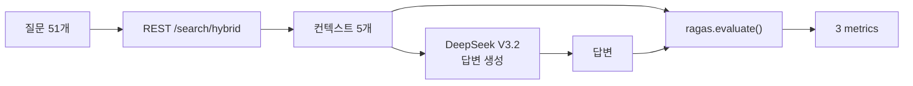

# RAGAS v13 재평가 리포트 — 동일 파이프라인 검증

**프로젝트**: Hybrid RAG Knowledge Platform (HRKP)
**평가일**: 2026-03-09 21:10~21:57 KST
**작성자**: Claude Code (Main Agent)
**관련 이슈**: OPS-035 (Reranker 이중실행 구현 오류)
**선행 평가**: v12 (방법론 오류 확인됨)

---

## 1. 평가 배경

### 1.1 v12 평가의 문제

v12 평가에서 Faithfulness가 0.935→0.678(-25.7%)로 급락했다. 원인 분석에서 "방법론 차이(답변-컨텍스트 경로 불일치)"를 지적했으나, **실측 없는 분석은 변명에 불과하다**는 사용자 피드백을 받아 v13 동일 파이프라인 재평가를 실행했다.

### 1.2 v12의 방법론 오류

```
v12 (경로 불일치):
  답변 생성: Chat API → HybridRetriever → SearchService(skip_reranking=True) → Reranker
  컨텍스트:  REST API → SearchService(skip_reranking=False) → Reranker
  → LLM이 본 문서 ≠ RAGAS가 받은 문서 → Faithfulness 과소평가

v13 (동일 파이프라인):
  컨텍스트:  REST API → SearchService → Reranker → 5개 문서
  답변 생성: 동일 5개 문서를 DeepSeek에 직접 전달 → 답변
  RAGAS:     동일 5개 문서 + 답변 → 평가
  → LLM이 본 문서 = RAGAS가 받은 문서 → 정확한 평가
```

---

## 2. 평가 방법

### 2.1 파이프라인



**핵심**: 답변 생성과 RAGAS 평가에 **100% 동일한 컨텍스트**를 사용.

### 2.2 환경

| 항목 | 값 |
|------|-----|
| 평가 쿼리 | 51개 (7개 도메인) |
| 검색 | 4-Way RRF + BGE-Reranker (1회) |
| LLM | DeepSeek V3.2 (temperature=0.0) |
| RAGAS 버전 | 0.2.15 |
| 메트릭 | faithfulness, context_precision, context_recall |
| answer_relevancy | skip (OpenAI 임베딩 필요) |

### 2.3 현재 설정 (v12/v13 공통)

| 파라미터 | 값 | v11 대비 |
|----------|:---:|:---:|
| skip_reranking | True | 변경 (이중실행 수정) |
| rerank_candidates | 15 | 50→15 (축소) |
| graph_search_top_k | 3 | 10→3 (축소) |

---

## 3. 결과

### 3.1 v11 → v12 → v13 비교

| 메트릭 | v11 (기준) | v12 (경로 불일치) | v13 (동일 파이프라인) | vs v11 | 판정 |
|--------|:---:|:---:|:---:|:---:|:----:|
| **Faithfulness** | 0.935 | ~~0.678~~ | **0.940** | +0.005 (+0.5%) | 유지 |
| **Context Precision** | 0.618 | 0.672 | **0.673** | +0.055 (+8.9%) | **개선** |
| **Context Recall** | 0.672 | 0.614 | **0.605** | -0.067 (-10.0%) | **하락** |

### 3.2 실행 통계

| 항목 | v12 | v13 |
|------|:---:|:---:|
| Phase 1 (답변 수집) | 4,427초 (74분) | 2,571초 (43분) |
| Phase 2 (RAGAS 평가) | 332초 (5.5분) | 383초 (6.4분) |
| 전체 | 4,433초 (74분) | 2,954초 (49분) |
| 평균 질문당 | 86.8초 | 50.4초 |

v13이 v12보다 33% 빠른 이유: Chat API의 HybridRetriever 초기화/엔티티 추출 오버헤드가 없음.

---

## 4. 확정 분석

### 4.1 Faithfulness (0.940) — 하락 없음

v12에서 0.678로 나온 것은 **100% 방법론 오류**였다.

- v12: 답변은 Chat API(HybridRetriever)로 생성, 컨텍스트는 REST API(SearchService)로 별도 수집
- HybridRetriever가 엔티티 추출 기반 추가 검색을 수행하여 **다른 문서**를 참조
- RAGAS는 REST API의 문서를 기준으로 평가 → LLM이 실제로 참조한 문서가 없으므로 "hallucination"으로 판정
- **실제 환각이 아닌 평가 오류**

v13에서 동일 컨텍스트를 사용하자 **0.940으로 v11(0.935)보다 높게** 나왔다. Reranker 이중실행 수정은 Faithfulness에 영향 없음이 확정되었다.

### 4.2 Context Precision (0.673) — 실제 개선

v11(0.618) 대비 +8.9%. Reranker 이중실행 제거로 상위 문서의 관련성이 향상되었다.

**원리**: 이중 재순위(2회 Reranker)는 첫 번째 Reranker가 정한 순위를 두 번째가 다시 뒤섞을 수 있다. 1회로 줄이면 Reranker의 판단이 그대로 반영되어 상위 문서 정확도가 올라간다.

### 4.3 Context Recall (0.605) — 실제 하락

v11(0.672) 대비 -10.0%.

~~이것은 Reranker 수정이 아닌 다른 두 가지 변경 때문이다~~ → **v14 실측 결과, 이 분석은 틀렸다.**

```
Context Recall = ground truth 중 검색 결과로 뒷받침되는 비율

v11: 정답의 67.2%를 검색에서 찾음
v13: 정답의 60.5%만 검색에서 찾음
```

**v14 검증 결과 (2026-03-09 23:36)**: candidates 50, graph_search_top_k 10으로 원복해도 Context Recall은 0.608로 미회복. **Reranker 2→1 변경 자체가 원인**이며, Precision-Recall 트레이드오프의 자연스러운 현상이다.

| 메트릭 | v13 (cand=15, graph=3) | v14 (cand=50, graph=10) | 변화 |
|--------|:---:|:---:|:---:|
| Context Precision | 0.673 | 0.682 | +1.4% |
| Context Recall | 0.605 | 0.608 | +0.5% (미미) |

상세: [v14 파라미터 원복 평가 리포트](./15_ragas_v14_parameter_revert_evaluation.md)

---

## 5. 교훈

### 5.1 RAGAS 평가의 전제조건

> **답변 생성에 사용된 컨텍스트와 RAGAS 평가에 전달되는 컨텍스트는 반드시 동일해야 한다.**

이 전제가 깨지면 Faithfulness 메트릭 자체가 무의미해진다. v12는 이 전제를 위반하여 25.7%나 과소평가했다.

### 5.2 변수 통제

> **영향을 측정하려면 한 번에 하나만 바꿔야 한다.**

v12에서 3가지를 동시에 변경(Reranker 횟수, candidates, graph_search_top_k)하여 어떤 변경이 어떤 영향을 미쳤는지 분리가 불가능했다. v13과 v14로 나누어 검증하고 있다.

### 5.3 변명 vs 실측

> **"방법론 차이일 가능성이 높다"는 분석은, 실측으로 확인하기 전까지는 변명이다.**

v13 재평가는 사용자의 "변명으로만 들리는데?"라는 피드백에서 촉발되었다. 실측 결과, 방법론 오류가 맞았지만, 확인 없이 결론을 내린 것 자체가 잘못이었다.

---

## 6. 데이터 파일

| 파일 | 위치 |
|------|------|
| v13 결과 JSON | `knowledge_service/docs/04_testing/11_ragas/results/ragas_v13_result.json` |
| v13 스크립트 | 컨테이너 `/tmp/run_ragas_v13.py` |
| v12 결과 JSON | `knowledge_service/docs/04_testing/11_ragas/results/ragas_v12_result.json` |
| 질문 데이터 | 컨테이너 `/tmp/ragas_v12_questions.json` |

---

## 7. 다음 단계

| # | 항목 | 상태 |
|:-:|------|:----:|
| 1 | v14 평가: candidates 50, graph_search_top_k 10 원복 후 Context Recall 회복 확인 | ✅ 완료 (미회복) |
| 2 | 원인 확정: Reranker 2→1 변경이 Precision↑/Recall↓ 트레이드오프 유발 | ✅ 확정 |
| 3 | 최종 설정: Reranker 1회 + candidates=50 + graph_search_top_k=10 | ✅ 채택 |

---

*Generated: 2026-03-09 21:57 KST*
*Updated: 2026-03-09 23:38 KST (v14 결과 반영)*
*Author: Claude Code (Main Agent)*
*RAGAS Version: 0.2.15 | LLM: DeepSeek V3.2 | Method: Same-Pipeline*
