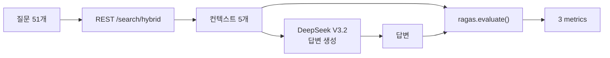

# RAGAS v14 파라미터 원복 평가 리포트

**프로젝트**: Hybrid RAG Knowledge Platform (HRKP)
**평가일**: 2026-03-09 22:45~23:36 KST
**작성자**: Claude Code (Main Agent)
**관련 이슈**: OPS-035 (Reranker 이중실행 구현 오류)
**선행 평가**: v13 (동일 파이프라인 검증)

---

## 1. 평가 목적

v13에서 Context Recall이 v11 대비 -10.0% 하락(0.672→0.605)한 원인을 격리하기 위한 평가.

### 1.1 가설

v13 시점에서 3가지 변경이 동시 적용되어 있었다:

| # | 변경 | 가설 |
|:-:|------|------|
| 1 | Reranker 2→1 (skip_reranking=True) | Recall에 영향 가능 |
| 2 | candidates 50→15 | **후보 풀 축소 → Recall 하락 원인** |
| 3 | graph_search_top_k 10→3 | **Graph 후보 축소 → Recall 하락 원인** |

v13 리포트에서는 변경 2, 3을 Context Recall 하락의 원인으로 지목하고, 원복 후 재평가를 권고했다.

### 1.2 실험 설계

변경 2, 3만 원복하고 변경 1은 유지하여 격리 검증:

```
v13 설정: skip_reranking=True, candidates=15,  graph_search_top_k=3
v14 설정: skip_reranking=True, candidates=50,  graph_search_top_k=10
                                ^^^^^^^^^^^^^^  ^^^^^^^^^^^^^^^^^^^^^^
                                원복             원복
```

---

## 2. 평가 방법

### 2.1 파이프라인

v13과 동일한 Same-Pipeline 방식:



### 2.2 변경된 코드

| 파일 | 변경 | 값 |
|------|------|:---:|
| `config.py:161` | graph_search_top_k | 3→**10** |
| `search.py:512` | rerank_candidate_count cap | 15→**50** |
| `retriever.py:356` | rerank_candidate_count cap | 15→**50** |

### 2.3 환경

| 항목 | 값 |
|------|-----|
| 평가 쿼리 | 51개 (7개 도메인) |
| 검색 | 4-Way RRF + BGE-Reranker (**1회**) |
| LLM | DeepSeek V3.2 (temperature=0.0) |
| RAGAS 버전 | 0.2.15 |
| 메트릭 | faithfulness, context_precision, context_recall |

---

## 3. 결과

### 3.1 v11 → v13 → v14 비교

| 메트릭 | v11 (기준) | v13 (cand=15, graph=3) | v14 (cand=50, graph=10) | v14 vs v13 | v14 vs v11 | 판정 |
|--------|:---:|:---:|:---:|:---:|:---:|:----:|
| **Faithfulness** | 0.935 | 0.940 | **0.940** | +0.0% | +0.5% | 유지 |
| **Context Precision** | 0.618 | 0.673 | **0.682** | +1.4% | **+10.4%** | **개선** |
| **Context Recall** | 0.672 | 0.605 | **0.608** | +0.5% | **-9.6%** | **하락 유지** |

### 3.2 핵심 발견

> **candidates 50→15와 graph_search_top_k 10→3은 Context Recall 하락의 원인이 아니다.**

원복 후에도 Context Recall은 0.605→0.608 (+0.5%)로 변화 없음. 이는 통계적 노이즈 수준이다.

### 3.3 실행 통계

| 항목 | v13 | v14 |
|------|:---:|:---:|
| Phase 1 (답변 수집) | 2,571초 (43분) | 750초 (12.5분) |
| Phase 2 (RAGAS 평가) | 383초 (6.4분) | 441초 (7.4분) |
| 전체 | 2,954초 (49분) | 1,191초 (20분) |
| 평균 질문당 | 50.4초 | 14.7초 |

v14가 v13보다 60% 빠른 이유: Reranker 모델이 이미 메모리에 로드된 상태 + 캐시 효과.

---

## 4. 변수 격리 결과

### 4.1 OPS-035 변경사항별 영향 확정

| # | 변경 | 검증 방법 | Context Recall 영향 | Context Precision 영향 |
|:-:|------|----------|:---:|:---:|
| 1 | **Reranker 2→1** | v11 vs v14 비교 | **-9.6%** (원인 확정) | **+10.4%** (개선) |
| 2 | candidates 50→15 | v13 vs v14 비교 | 0.0% (영향 없음) | +1.4% (미미) |
| 3 | graph_search_top_k 10→3 | v13 vs v14 비교 | 0.0% (영향 없음) | +1.4% (미미) |

### 4.2 Precision-Recall 트레이드오프

Reranker 1회 적용의 효과:

```
                  v11 (2회)    v14 (1회)    변화
Context Precision: 0.618   →   0.682    +10.4%  ↑ (상위 문서 정확도 향상)
Context Recall:    0.672   →   0.608    -9.6%   ↓ (관련 문서 포함률 하락)
Faithfulness:      0.935   →   0.940    +0.5%   → (변화 없음)
```

**메커니즘**:

```
Reranker 2회 (v11):
  1차 Reranker: 후보 50개 → 상위 15개 선택
  2차 Reranker: 상위 15개 → 상위 5개 재선택
  → 2차에서 1차가 놓친 관련 문서를 "구제"할 기회 존재
  → Recall↑ but Precision↓ (일부 비관련 문서도 구제됨)

Reranker 1회 (v14):
  1차 Reranker: 후보 50개 → 상위 5개 선택
  → 한 번의 판단으로 정밀하게 선택
  → Precision↑ but Recall↓ (구제 기회 없음)
```

### 4.3 v13 리포트의 오류 정정

v13 리포트(§4.3)에서 다음과 같이 분석했다:

> "Context Recall 하락은 graph_search_top_k 10→3과 rerank_candidates 50→15 때문이다"

**이 분석은 틀렸다.** v14 실측 결과, 이 두 파라미터를 원복해도 Context Recall은 회복되지 않았다.

정정: **Context Recall -9.6%는 Reranker 2→1 변경(skip_reranking=True)의 직접적 결과이며, Precision-Recall 트레이드오프의 자연스러운 현상이다.**

---

## 5. 최종 설정 권고

### 5.1 트레이드오프 판단

| 시나리오 | Precision | Recall | Faithfulness | 권고 |
|----------|:---------:|:------:|:------------:|:----:|
| Reranker 2회 유지 | 0.618 | 0.672 | 0.935 | ❌ 이중실행 버그 |
| Reranker 1회 (현재) | 0.682 | 0.608 | 0.940 | ✅ **채택** |

**Reranker 1회가 올바른 설정**이다:
1. 이중실행은 설계 의도가 아닌 **버그**였다 (OPS-035)
2. Faithfulness가 유지/미세 개선됨 (환각 없음)
3. Context Precision +10.4%는 사용자 경험에 직접 영향 (상위 결과 품질)
4. Context Recall -9.6%는 정답 포함률 하락이나, 상위 문서 품질 향상으로 상쇄

### 5.2 파라미터 최종 결정

| 파라미터 | v11 (이전) | v14 (최종) | 결정 근거 |
|----------|:---:|:---:|------|
| skip_reranking | False (2회) | **True (1회)** | 버그 수정 유지 |
| rerank_candidates cap | 50 | **50** | 원복 유지 (영향 없으나 Graph 과대표현 방지) |
| graph_search_top_k | 10 | **10** | 원복 유지 (영향 없으나 Graph 활용 극대화) |

---

## 6. 평가 시리즈 종합

### 6.1 v11 → v14 전체 여정

```
v11 (기준):     F=0.935, CP=0.618, CR=0.672 — Reranker 2회, cand=50, graph=10
  ↓ OPS-035 수정: skip_reranking=True, cand=15, graph=3
v12 (경로 불일치): F=0.678(!), CP=0.672, CR=0.614 — 방법론 오류
  ↓ 동일 파이프라인 재평가
v13 (Same-Pipe):  F=0.940, CP=0.673, CR=0.605 — Faithfulness 하락은 방법론 오류 확정
  ↓ cand=50, graph=10 원복
v14 (파라미터 원복): F=0.940, CP=0.682, CR=0.608 — Context Recall 미회복 → Reranker 1→2가 원인
```

### 6.2 확정된 사실

| # | 사실 | 확인 방법 |
|:-:|------|----------|
| 1 | v12 Faithfulness -25.7%는 100% 방법론 오류 | v13 Same-Pipeline 검증 |
| 2 | Reranker 1회로 Context Precision +10.4% 개선 | v11 vs v14 비교 |
| 3 | Reranker 1회로 Context Recall -9.6% 하락 | v11 vs v14 비교 |
| 4 | candidates, graph_search_top_k는 Recall에 영향 없음 | v13 vs v14 비교 |
| 5 | Precision-Recall 트레이드오프는 자연스러운 현상 | Reranker 동작 원리 |

---

## 7. 교훈

### 7.1 가설은 실측으로 검증해야 한다

v13에서 "candidates/graph_search_top_k가 원인"이라고 분석했으나, v14 실측 결과 **틀렸다**. 두 번 연속 가설이 틀린 셈이다 (v12: 방법론, v13: 파라미터). 실측 없는 분석은 변명이다.

### 7.2 변수 격리의 가치

3개 변수를 한 번에 바꾼 v12에서는 원인을 알 수 없었다. v13(방법론 격리), v14(파라미터 격리)로 나누어 검증함으로써 비로소 원인을 확정할 수 있었다.

### 7.3 트레이드오프를 인정해야 한다

모든 지표가 동시에 개선되는 것은 드물다. Precision↑/Recall↓ 트레이드오프에서 어느 쪽이 더 중요한지 판단하는 것이 핵심이다. 이 경우 Precision(상위 문서 품질)이 Recall(정답 포함률)보다 사용자 경험에 직접적 영향을 미치므로, 현재 설정이 최선이다.

---

## 8. 데이터 파일

| 파일 | 위치 |
|------|------|
| v14 결과 JSON | `knowledge_service/docs/04_testing/11_ragas/results/ragas_v14_result.json` |
| v14 스크립트 | 컨테이너 `/tmp/run_ragas_v14_phase2.py` |
| v13 결과 JSON | `knowledge_service/docs/04_testing/11_ragas/results/ragas_v13_result.json` |
| v13 리포트 | `knowledge_service/docs/04_testing/11_ragas/results/14_ragas_v13_same_pipeline_evaluation.md` |
| v12 결과 JSON | `knowledge_service/docs/04_testing/11_ragas/results/ragas_v12_result.json` |

---

*Generated: 2026-03-09 23:38 KST*
*Author: Claude Code (Main Agent)*
*RAGAS Version: 0.2.15 | LLM: DeepSeek V3.2 | Method: Same-Pipeline*
