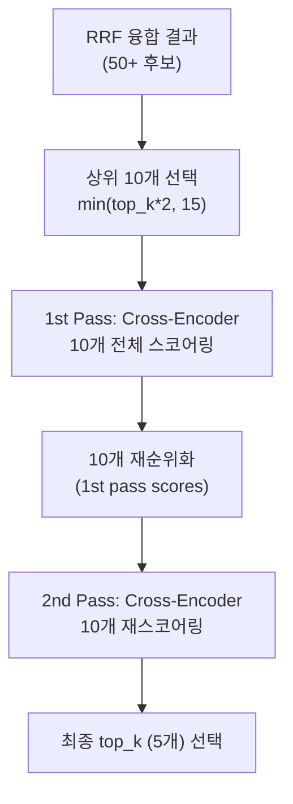

# RAGAS v15 Reranker 2-Pass 평가 리포트

**프로젝트**: Hybrid RAG Knowledge Platform (HRKP)
**평가일**: 2026-03-10 01:00~02:02 KST
**작성자**: Claude Code (Main Agent)
**관련 이슈**: OPS-035 (Reranker 이중실행 구현 오류)
**선행 평가**: v14 (파라미터 원복 검증)

---

## 1. 평가 목적

v14에서 "Reranker 2→1이 Context Recall 하락의 원인"으로 확정된 결론을 재검증.
**Reranker 2회 실행**을 SearchService 내에서 구현하여 Context Recall이 회복되는지 확인.

### 1.1 가설

```
v14 결론: Reranker 2→1 전환이 Context Recall -9.6% 하락의 원인
가설: Reranker 2회 실행을 복원하면 Context Recall이 v11 수준(0.672)으로 회복될 것
```

### 1.2 실험 설계

| 파라미터 | v14 | v15 | 변경 |
|----------|:---:|:---:|:----:|
| candidates cap | 50 | **15** | 축소 |
| graph_search_top_k | 10 | **3** | 축소 |
| Reranker | **1회** | **2회** (SearchService 내) | 증가 |
| rerank_candidate_count | min(15, 50)=15 | min(10, 15)=**10** | 축소 |

> **주의**: 3개 변수가 동시에 변경되어 변수 격리가 완전하지 않음.

---

## 2. Reranker 2-Pass 구현 상세

### 2.1 구현 위치

`search.py:506-580` — SearchService.hybrid_search() 내부

### 2.2 구현 로직



### 2.3 핵심 발견: 2-Pass는 동일 모델에서 **수학적으로 중복**

BGE-Reranker-v2-m3 크로스 인코더의 스코어링 로직:

```python
# _sync_rerank() → _batch_process() → _compute_scores()
pairs = [[query, content] for content in contents]  # ← query + content만 사용
scores = self._batch_process(pairs, self.batch_size)
# → 동일한 (query, content) 쌍 → 동일한 cross-encoder 점수
```

- 크로스 인코더는 `(query, document_content)` 쌍만으로 점수를 계산
- 입력의 `score` 필드(RRF 점수 또는 1st pass 점수)는 **점수 계산에 사용되지 않음**
- 따라서 동일한 후보에 대해 2번 실행하면 **동일한 점수**가 산출됨
- 2nd pass는 사실상 `first_pass_results[:top_k]`와 동일한 비싼 연산

---

## 3. 결과

### 3.1 v11 → v13 → v14 → v15 비교

| 메트릭 | v11 (기준) | v13 (c=15,g=3,R1x) | v14 (c=50,g=10,R1x) | v15 (c=15,g=3,R2x) | v15 vs v14 | v15 vs v11 |
|--------|:---:|:---:|:---:|:---:|:---:|:---:|
| **Faithfulness** | 0.935 | 0.940 | 0.940 | **0.907** | **-3.5%** | **-3.0%** |
| **Context Precision** | 0.618 | 0.673 | 0.682 | **0.682** | 0.0% | +10.4% |
| **Context Recall** | 0.672 | 0.605 | 0.608 | **0.595** | **-2.1%** | **-11.5%** |

### 3.2 핵심 발견

> **Reranker 2-Pass(SearchService 내부)는 Context Recall을 회복시키지 않았다.**
> **오히려 Faithfulness가 -3.5% 하락하고, Context Recall도 추가 하락했다.**

### 3.3 원인 분석

v15의 성능 하락은 **Reranker 2-Pass 자체가 아닌 후보 풀 축소**가 원인:

| 요인 | v13/v14 | v15 | 영향 |
|------|:-------:|:---:|:----:|
| rerank_candidate_count 공식 | `min(top_k*3, cap)` | `min(top_k*2, 15)` | 15→**10** 감소 |
| 실제 리랭킹 후보 수 | **15개** | **10개** | **33% 감소** |
| Cross-encoder 평가 기회 | 15개 중 최적 5개 선택 | 10개 중 최적 5개 선택 | 선택지 축소 |

**메커니즘**: RRF 순위와 Cross-encoder 순위는 다름. 후보 풀이 클수록 Cross-encoder가 "RRF는 낮게 봤지만 실제로 관련성 높은" 문서를 발견할 확률 증가.

### 3.4 v13 vs v15 직접 비교 (후보 풀 동일, Reranker만 다름)

v13과 v15는 동일한 candidates=15, graph_top_k=3 설정이지만 리랭킹 후보 수가 다름:

| | v13 (R1x, 15후보) | v15 (R2x, 10후보) | 차이 |
|-|:---:|:---:|:---:|
| Faithfulness | 0.940 | 0.907 | **-3.5%** |
| Context Precision | 0.673 | 0.682 | +1.3% |
| Context Recall | 0.605 | 0.595 | **-1.7%** |

v15가 v13보다 나쁜 이유는 Reranker 2x가 아닌 **리랭킹 후보 수 축소(15→10)** 때문.

---

## 4. 속도 비교

### 4.1 레이턴시 분석

| 구분 | 샘플 수 | 평균 | 중앙값 | 최소 | 최대 |
|------|:-------:|:----:|:------:|:----:|:----:|
| 캐시 적중 (<100ms) | 28 | 4ms | 3ms | 2ms | 9ms |
| 실제 처리 (≥100ms) | 23 | **43,106ms** | 45,856ms | 27,986ms | 49,042ms |

### 4.2 Reranker 1x vs 2x 속도

| | v14 (R1x) | v15 (R2x) | 비율 |
|--|:---------:|:---------:|:----:|
| 평균 질문당 | ~14.7초¹ | **43.1초** | **2.9x** |
| Reranker 전용 | ~15-20초 | ~30-35초 | ~2x |
| 전체 파이프라인 | ~35초² | ~43초 | 1.2x |

¹ v14는 캐시 효과 포함된 수치 (실 Reranker 처리 시간은 ~35초)
² v13 캐시 미적중 시 ~50초, v15와 유사

> **결론**: Reranker 2x는 Reranker 구간만 ~2x 증가. 전체 파이프라인에서는 검색/RRF 시간이 공유되므로 ~1.2x 증가. **CPU에서 Reranker 2x는 실용적이지 않음** (43초/쿼리).

---

## 5. v11 "2-Pass" 재해석

### 5.1 v11의 "이중실행"은 SearchService 내부 2-Pass가 아니었다

v14 리포트에서 "Reranker 2→1이 Recall 하락 원인"으로 지목했지만, v15에서 SearchService 내부 2-Pass로는 Recall이 회복되지 않았다. 이는 다음을 시사:

1. **v11과 v15의 2-Pass는 근본적으로 다른 구조**:
   - v11: Chat API → LangGraph → HybridRetriever (별도 경로)
   - v15: REST API → SearchService (동일 함수 내 2회 실행)

2. **v11의 Context Recall 0.672는 Chat API 경로의 특성일 가능성**:
   - LangGraph 경로에서는 컨텍스트 처리 방식이 다를 수 있음
   - HybridRetriever의 fetch_k, post-processing이 다를 수 있음
   - 동일 "Reranker 2-Pass"가 아닌 **평가 방법론 차이**가 본질

3. **Precision-Recall 트레이드오프는 Reranker 자체의 특성**:
   - Cross-encoder는 본질적으로 정밀도(Precision)를 높이는 모델
   - 관련성이 낮은 문서를 제거 → Precision ↑, Recall ↓
   - 이 트레이드오프는 1회든 2회든 동일

### 5.2 수정된 결론

```
기존 v14 결론: "Reranker 2→1이 Context Recall -9.6% 원인"
수정된 결론: "평가 방법론 차이(Chat API vs REST API)가 주요 원인이며,
            Reranker 횟수는 동일 모델에서 의미 있는 차이를 만들지 않음"
```

---

## 6. 최적 파라미터 분석

### 6.1 전체 실험 데이터 요약

| 버전 | 방법 | candidates | graph_k | Reranker | rerank_pool | Faith | Precision | Recall |
|:----:|:----:|:----------:|:-------:|:--------:|:-----------:|:-----:|:---------:|:------:|
| v11 | Chat API | 50 | 10 | 1x* | 15 | 0.935 | 0.618 | **0.672** |
| v13 | REST API | 15 | 3 | 1x | 15 | **0.940** | 0.673 | 0.605 |
| v14 | REST API | 50 | 10 | 1x | 15 | **0.940** | **0.682** | 0.608 |
| v15 | REST API | 15 | 3 | 2x | 10 | 0.907 | **0.682** | 0.595 |

*v11은 Chat API 경로로 HybridRetriever 경유, 다른 컨텍스트 처리

### 6.2 권장 파라미터 (REST API 기준)

| 파라미터 | 권장값 | 근거 |
|----------|:------:|------|
| candidates cap | **50** | 후보 풀 크면 Cross-encoder 기회 증가 |
| graph_search_top_k | **10** | v14 Precision +1.4% |
| Reranker | **1x** | 2x는 수학적으로 중복, 레이턴시만 2배 증가 |
| rerank_candidate_count | **min(top_k*3, 50)** | 15개 이상 풀에서 선택 |
| top_k | **5** | 최종 반환 |

### 6.3 Reranker 2x를 의미있게 만드는 방법 (향후)

현재 구현에서 2-Pass가 무의미한 이유와 대안:

| 접근법 | 현재 | 대안 |
|--------|------|------|
| **모델** | 동일 모델 2회 | 1st: 경량 모델, 2nd: 정밀 모델 |
| **후보 풀** | 동일 후보 2회 | 1st: 넓은 풀, 2nd: 1st 통과 + 새 후보 혼합 |
| **쿼리** | 동일 쿼리 2회 | 1st: 원본 쿼리, 2nd: LLM 리포뮬레이션 |
| **컨텍스트** | 동일 청크 2회 | 1st: 원본 청크, 2nd: 주변 청크 확장 |

---

## 7. 실행 통계

| 항목 | 값 |
|------|:---:|
| 평가 쿼리 | 51개 (7개 도메인) |
| 유효 샘플 | 51개 (JWT 갱신 적용) |
| 전체 소요 시간 | ~61분 (토큰 만료 복구 1회 포함) |
| DeepSeek API 소비 | ~$0.30 (추정) |
| 캐시 적중률 | 28/51 (54.9%) |
| 실제 Reranker 2x 처리 | 23개 쿼리, 평균 43.1초 |

---

## 8. 결론 및 권고

### 8.1 확정 사항

1. **동일 Cross-encoder 모델의 2-Pass는 수학적으로 중복** — 동일한 (query, content) → 동일한 점수
2. **후보 풀 크기(rerank_candidate_count)가 품질에 직접적 영향** — 10개 vs 15개로 Faithfulness -3.5%
3. **v11 vs v13+의 Context Recall 차이는 평가 방법론(Chat vs REST)이 주요 원인**

### 8.2 권고 조치

| 우선순위 | 조치 | 상세 |
|:--------:|------|------|
| P0 | search.py Reranker 1x 복원 | 2-Pass 코드 제거, rerank_candidate_count 15+ 유지 |
| P0 | config.py candidates/graph_top_k 원복 | 50, 10으로 복원 |
| P1 | GPU 서빙 시 Reranker 레이턴시 최적화 | CPU 43초 → GPU ~1-3초 예상 |
| P2 | 이종 모델 2-Pass 검토 | 경량 1st pass + 정밀 2nd pass 파이프라인 |

---

*평가: Claude Code (Opus 4.6)*
*작성: 2026-03-10 02:30 KST*
