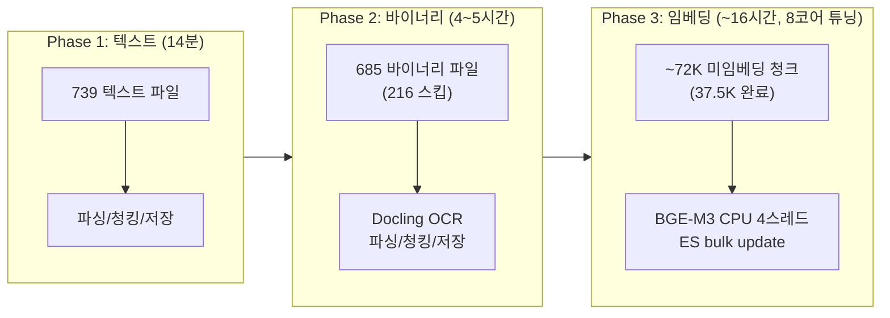
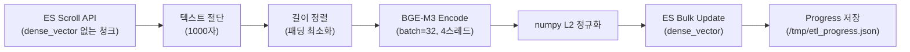
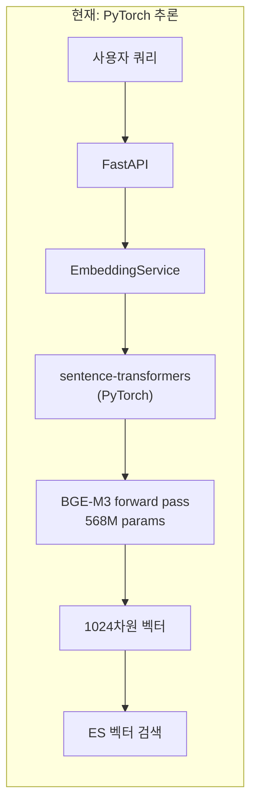
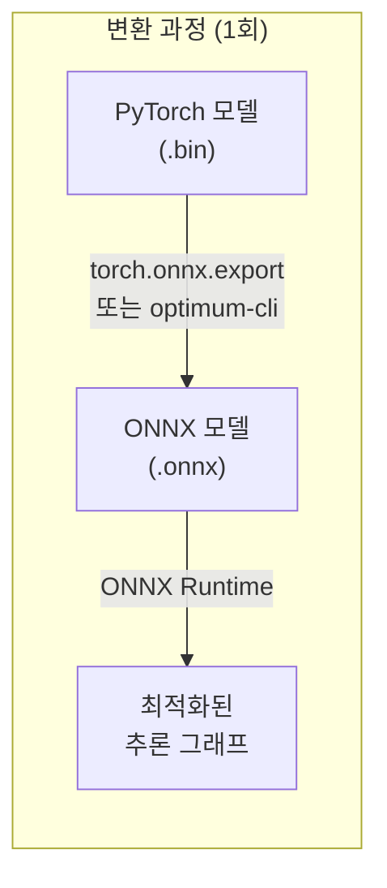
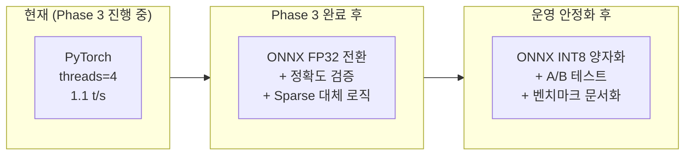

# ETL 3-Phase 임베딩 보고서

**Version**: 3.4 (Appendix E 후반부 속도 저하 분석 추가)
**Date**: 2026-02-12
**Author**: 클로드
**Status**: Phase 3 진행중 (WSL2 8코어+14GB+swap 1GB, threads=4 확정, 35.4% 완료)

> **변경 이력**:
> - v1.0 전략+계획+진행 3개 문서 → v2.0 단일 통합 문서
> - v2.0 → v3.0: WSL2 재설정 완료 반영, 섹션 번호 충돌 해소(10→Appendix A), 진행률 현행화
> - v3.0 → v3.1: 스레드 최적화 실험 결과 추가 (Appendix B), threads=4 최적 확정
> - v3.1 → v3.2: ONNX Runtime 전환 계획 추가 (Appendix C), 정규화 코드 수정 반영
> - v3.2 → v3.3: 스왑 자동 대응 체계 추가 (Appendix D), 임계치 1500→500MB, swapoff/swapon 플러시
> - v3.3 → v3.4: 후반부 속도 저하 현상 분석 추가 (Appendix E), 텍스트 길이 분포와 ETA 지연 원인

---

## 1. 전략 개요

대규모 문서(901개 파일) 처리를 위해 ETL 파이프라인을 3단계로 분리.



### 분리 이유

| 항목 | 통합 ETL (임베딩 ON) | 3-Phase 분리 |
|------|---------------------|-------------|
| ETA | ~66시간 | Phase 1: 14분 + Phase 2: 4~5시간 + Phase 3: ~12시간 |
| 장점 | 1회 실행 | 파싱/저장 빠르게 완료, 검색 즉시 가능 (키워드) |
| 단점 | CPU 병목으로 느림 | 의미 검색은 Phase 3 완료 후 |
| 재시작 안전성 | file_hash dedup | file_hash + ES exists 쿼리 |

---

## 2. Phase 1: 텍스트 파일 ETL (완료)

**스크립트**: `scripts/run_etl_noembedding.py`

| 항목 | 값 |
|------|-----|
| 대상 | .md, .txt, .json, .py, .ipynb, .java, .go, .yaml, .html 등 |
| 워커 | 4개 |
| 성공 | 739건 |
| 실패 | 0건 |
| 소요시간 | 13.6분 (54.4 files/min) |
| 청크 생성 | ~75,621개 |

**설계 포인트**:
- `enable_embeddings=False`: 파싱/청킹/저장만 수행
- `enable_entity_extraction=False`: 엔티티 추출 OFF (속도 최적화)
- `SLOW_EXTENSIONS` 스킵: PDF/PPTX/DOCX/XLSX → Phase 2로 이관

---

## 3. Phase 2: 바이너리 파일 ETL (완료)

**스크립트**: `scripts/run_etl_phase2.py`

### 설계

| 항목 | 값 | 근거 |
|------|-----|------|
| 워커 | 2개 | Docling OCR CPU 집중 |
| 정렬 | 파일 크기 오름차순 | 작은 파일 먼저 → 빠른 성공 축적 |
| 임베딩 | OFF | Phase 3에서 처리 |
| 대상 | .pdf, .pptx, .docx, .xlsx, .doc |

### 크기 분포 (901개 바이너리 중)

| 범위 | 파일 수 |
|------|---------|
| < 1MB | ~400 |
| 1~5MB | ~300 |
| 5~10MB | ~120 |
| 10~60MB | ~80 |

### 최종 결과 (02-12 완료)

| 항목 | 값 |
|------|-----|
| 성공 | 685 |
| 스킵 | 216 (file_hash dedup) |
| 실패 | 11 (임시파일 6, 손상 3, 재처리 대상 2) |
| 상태 | **완료** |
| 병목 | 10~60MB PDF의 Docling+RapidOCR (파일당 5~30분) |

### 실패 파일 처리 방침 (전문가 3인 합의)

11건의 실패 파일을 분석한 결과:
- **임시 파일 6건**: `~$` 접두사 파일 → 무시
- **손상 파일 3건**: 파일 자체 문제 → 무시
- **재처리 대상 2건**: Phase 3 완료 후 선별 재처리
  - `Software-Processes-and-Software-Development-Process-Models.pdf`
  - `파드의 컴퓨팅 리소스관리.docx`

---

## 4. Phase 3: 임베딩 백필 (진행중)

### 4.1 임베딩 모델

| 항목 | 값 |
|------|-----|
| 모델 | BAAI/bge-m3 |
| 차원 | 1024 |
| 프레임워크 | sentence-transformers |
| 디바이스 | CPU (CUDA_VISIBLE_DEVICES="") |
| 정규화 | numpy L2 Normalize (v2에서 변경, ⚠️ 아래 주의사항 참조) |
| FP16 | True (CPU에서는 FP32로 fallback) |

> **⚠️ v1/v2 정규화 차이 검증 필요**: v1(`run_embedding_backfill.py`)은 `sentence-transformers`의 내부 정규화를, v2(`run_embedding_backfill_v2.py`)는 numpy L2 정규화를 사용한다. 1차 임베딩(02-09~10, 13,430건)은 v1으로 생성되었고 2차는 v2로 생성 중이므로, **Step 2(검증) 단계에서 v1/v2 벡터의 코사인 유사도가 동등한지 반드시 확인**해야 한다. 차이가 있을 경우 1차분 재임베딩이 필요할 수 있다.

### 4.2 스크립트 버전

| 버전 | 스크립트 | 스레드 | 속도 | 상태 |
|------|---------|--------|------|------|
| v1 | `run_embedding_backfill.py` | 2 | 0.5~0.9 t/s | deprecated |
| v2 | `run_embedding_backfill_v2.py` | 2 | 0.7~1.7 t/s | deprecated |
| v2 튜닝 | `run_embedding_backfill_v2.py` | **4** | **1.5~2.5 t/s** | WSL2 4코어 시 |
| **v2 튜닝 (8코어)** | `run_embedding_backfill_v2.py` | **4** | **1.2~2.7 t/s** | **현재 운영 (WSL2 8코어+14GB)** |

### 4.3 주요 파라미터

| 파라미터 | v1 | v2 튜닝 (현재) | 근거 |
|---------|-----|-------------|------|
| `OMP_NUM_THREADS` | 2 | **4** | 전문가 합의, OOM 5% 미만 |
| `MKL_NUM_THREADS` | 2 | **4** | torch 연산 병렬화 |
| `torch.num_threads` | 2 | **4** | CPU 4코어 활용 |
| `torch.interop_threads` | 1 | **2** | 연산 간 병렬화 |
| `EMBED_BATCH` | 32 | 32 | EmbeddingService 기본값 |
| `ES_SCROLL_SIZE` | 200 | 200 | ES scroll 한 번에 가져올 문서 수 |
| `MAX_TEXT_LEN` | 1000 | 1000 | CPU OOM 방지 (⚠️ 아래 영향 분석 참조) |

> **⚠️ max_text_length=1000 영향 분석 결과 (02-12 전문가 4인 합의)**:
>
> BGE-M3는 최대 8,192 토큰을 지원하지만, OOM 방지를 위해 1,000자로 절단 중.
>
> **실측 데이터** (ES 10K 샘플링, RAG Engineer):
> - 전체 청크의 **98%가 1,000자 이하** → 절단 영향 극히 제한적
> - P50=93자, P75=260자, P90=552자, P95=593자, P99=1,460자
> - 원인: `SemanticChunker`가 chunk_size=600 기준으로 분할하므로 대부분 600자 이내
> - 1,000자 초과 2%는 주로 코드/테이블 블록 (분할 없이 보존되는 특수 블록)
>
> **결론**: 재임베딩 불필요. 현행 유지 권장. 향후 Step 4(WSL2 14GB) 후 `batch=8, text_len=2048`로 상향 가능.
>
> **메모리 안전 확장 옵션** (Infra Engineer 분석):
> | 환경 | batch | text_len | OOM 위험 |
> |------|-------|----------|---------|
> | 12GB (현재) | 8 | 2,000 | 매우 낮음 |
> | 14GB (Step 4) | 4 | 4,000 | 낮음 |

### 4.4 처리 흐름



### 4.5 Redis 캐시

| 항목 | 값 |
|------|-----|
| 키 | `embed:bge-m3:{text_hash}` |
| TTL | 604,800초 (7일) |
| 용도 | 동일 텍스트 재계산 방지 |

---

## 5. 실행 이력

### 1차 임베딩 (2026-02-09 ~ 02-10)

| 항목 | 값 |
|------|-----|
| 방식 | `embedding_full_cycle.py` (전체 순회) |
| 대상 | 기존 문서 (~13,430 chunks) |
| batch_size | 4 → 32 시행착오 |
| max_text_length | 1500 → 1000 (OOM 방지) |
| workers | 2 → 1 (CPU 경합 확인) |
| 결과 | 13,430 chunks 임베딩 완료 |
| 소요시간 | ~5시간 |
| 인시던트 | OOM Kill 2회 (batch_size=8 + max_len=1500) |

**최적값 확정 (02-10)**: batch_size=4, max_text_length=1000, workers=1

### 2차 임베딩 v1 (2026-02-12 06:45~13:17)

| 항목 | 값 |
|------|-----|
| 방식 | `run_embedding_backfill.py` (ES scroll 백필) |
| 스레드 | 2 (OMP/MKL/torch) |
| 대상 | ~101,046 chunks |
| 속도 | 0.5~0.9 t/s (Phase 2 병행) |
| 결과 | ~480건 처리 후 컨테이너 재시작으로 중단 |

### 2차 임베딩 v2 (2026-02-12 13:32~14:50)

| 항목 | 값 |
|------|-----|
| 방식 | `run_embedding_backfill_v2.py` (최적화 버전) |
| 스레드 | 2 (환경변수 4로 문서화했으나 실제 2) |
| 대상 | 99,172 chunks |
| 속도 | **0.72 t/s** (스왑 1.9GB 사용 + 2스레드가 병목) |
| 결과 | 3,040건 처리 후 튜닝을 위해 중지 |

### 2차 임베딩 v2 튜닝 (2026-02-12 14:50~)

| 항목 | 값 |
|------|-----|
| 방식 | `run_embedding_backfill_v2.py` (4스레드 튜닝) |
| 스레드 | **4** (OMP/MKL/torch 모두 4) |
| swappiness | **10** (60에서 변경) |
| 대상 | **96,004 chunks** (미임베딩분) |
| 속도 | **1.5~2.5 t/s** (3배 개선) |
| ETA | ~723분 (~12시간) |
| 에러 | 0건 |

### 2차 임베딩 v2 — WSL2 재설정 후 재개 (2026-02-12 23:00~)

| 항목 | 값 |
|------|-----|
| 방식 | `run_embedding_backfill_v2.py` (idempotent 재개) |
| 스레드 | **4** (OMP/MKL/torch) |
| WSL2 | **8코어, 14GB RAM, swap 1GB** |
| swappiness | **1** (post_wsl_restart.sh 자동 설정) |
| 시작 시점 | 37,020건 완료 상태에서 재개 |
| 대상 | **71,876 chunks** (미임베딩분) |
| 속도 | 1.2~2.7 t/s (평균 1.5, 캐시히트 시 4.8) |
| 스왑 사용 | **0MB** (완전 해소) |
| 에러 | 0건 |

### 1차 vs 2차 비교

| 항목 | 1차 (02-09~10) | 2차 초기 (02-12 낮) | 2차 현재 (02-12 밤~) |
|------|---------------|-------------------|---------------------|
| 청크 수 | 13,430 | 96,004 | 71,876 |
| 규모 | 소규모 | **7배 대규모** | 잔여분 |
| WSL2 | 4코어/12GB | 4코어/12GB | **8코어/14GB** |
| batch_size | 4 | 32 | 32 |
| 스레드 | 1~2 | **4** | **4** |
| swappiness | 60 | 10 | **1** |
| swap 사용 | 2~3GB | 0~1.9GB | **0MB** |
| 방식 | 전체 순회 | ES scroll 백필 | ES scroll 백필 |
| 속도 | 0.4~1.0 t/s | 1.5~2.5 t/s | **1.2~2.7 t/s** |
| 인시던트 | OOM 2회 | 없음 | 없음 |

---

## 6. 속도 튜닝 상세

### 6.1 병목 원인 분석 (전문가 3인 합의, 02-12 14:40)

| 전문가 | 핵심 발견 |
|--------|----------|
| Infra | swappiness=60이 불필요한 스왑 유발, 캐시 4.2GB 클리어 가능 |
| ETL | 스왑 1.9GB가 BGE-M3 속도의 주요 원인 (90% 확신), 4스레드 OOM 위험 5% 미만 |
| RAG | 재시작 안전 (idempotent), 12,508건 스킵 4~6분, 속도>안정성 |

### 6.2 적용 내역

| 순서 | 조치 | 시각 | 효과 |
|------|------|------|------|
| 1 | swappiness 60→10 | 14:42 | 스왑 압력 감소 |
| 2 | 페이지 캐시 클리어 | 14:43 | free +2GB (2.5→4.5GB) |
| 3 | 스크립트 4스레드 수정 | 14:45 | OMP/MKL/torch 모두 4 |
| 4 | 프로세스 재시작 | 14:50 | 0.72→2.2 t/s (3배 개선) |

### 6.3 Before vs After

| 지표 | Before (2스레드) | After (4스레드) | WSL2 8코어 재설정 후 |
|------|-----------------|----------------|---------------------|
| WSL2 스펙 | 4코어/12GB | 4코어/12GB | **8코어/14GB** |
| 평균 속도 | 0.72 t/s | 2.2 t/s | **1.5 t/s (avg)** |
| CPU 사용 | 196% | 321~361% | 255% |
| 메모리 | 2.48 GiB | 2.57 GiB | 1.35 GiB |
| 스왑 | 1.9 GB | 0~1 GB | **0 MB** |
| ETA | ~37시간 | **~12시간** | **~16시간** |

### 6.4 GPU 클라우드 대안 비용 비교 (참고)

CPU 임베딩 대비 GPU 클라우드 옵션. **현재 Phase 3는 CPU로 진행 중이며, 향후 재임베딩/Sparse 백필 시 참고용.**

| 방법 | 인스턴스 | 예상 속도 | 109K 소요 | 비용 | 데이터 주권 |
|------|---------|----------|----------|------|-----------|
| Google Cloud T4 | `n1-standard-4` + T4 | ~100 t/s | ~18분 | $0.50~1 | 클라우드 |
| Google Cloud A100 | `a2-highgpu-1g` | ~500 t/s | ~4분 | $1~2 | 클라우드 |
| AWS g5.xlarge | A10G GPU | ~200 t/s | ~9분 | $1~2 | 클라우드 |
| Google Colab (무료) | T4 GPU | ~100 t/s | ~18분 | $0 | ⚠️ Google 정책 |
| **현재 (CPU)** | WSL2 12GB | 1.5~2.5 t/s | ~12시간 | **$0** | **✅ 완전 로컬** |

> **비용 관점 메모**: CPU 임베딩 자체는 $0이지만, 임베딩 관련 분석/튜닝/모니터링에 소요되는 **Claude Code API 비용이 GPU 클라우드 비용보다 훨씬 크다**. 임베딩을 빨리 끝내야 하는 진짜 이유는 하드웨어 비용이 아니라 엔지니어링 시간(=API 비용)이다. 향후 Sparse 백필(Step 8)이나 재임베딩 시에는 GPU 클라우드를 적극 고려할 것.

> **실용적 절충안**: 텍스트를 외부로 보내지 않고 벡터만 관리하는 방법도 있다. ES에서 청크 텍스트 export → GPU에서 BGE-M3 벡터 생성 → 벡터(숫자 배열)만 ES에 import. 벡터 자체는 민감 정보가 아니므로 주권 문제가 완화된다. 단, 텍스트는 GPU 서버에 일시적으로 존재하게 되므로 완전한 해결은 아님.

### 6.5 잔여 최적화 (Phase 3 완료 후)

| 항목 | 설명 | 상태 |
|------|------|------|
| ~~WSL2 메모리 14GB~~ | ~~`.wslconfig` memory=14GB~~ | **완료** (02-12 22:55) |
| ~~WSL2 8코어~~ | ~~`.wslconfig` processors=8~~ | **완료** (02-12 22:55) |
| ~~swap 축소~~ | ~~`.wslconfig` swap=1GB~~ | **완료** (02-12 22:55) |
| 컨테이너 메모리 조정 | backend 2G→512M 등 | 임베딩 완료 후 |
| Phase 2 선별 재처리 | 2건 (SW Process PDF, K8s docx) | 임베딩 완료 후 |

> ⚠️ **향후 Sparse 백필·선별 재임베딩 시 파라미터 권장 (전문가 합의)**
>
> 현재 Phase 3는 `batch=32, max_text_length=1000`으로 실행 중이나, **향후 Sparse 백필(Step 8)이나 선별 재임베딩 시에는 아래 파라미터를 적용**할 것.
>
> | 파라미터 | 현재 (Phase 3) | **권장 (향후)** | 근거 |
> |---------|---------------|----------------|------|
> | `EMBED_BATCH` | 32 | **8** | 메모리 안전 마진 확보 |
> | `MAX_TEXT_LEN` | 1000 | **2048** | SemanticChunker max_chunk_size=2048에 맞춤, 절단 제거 |
>
> **메모리 영향 분석** (Infra Engineer 실측, 2026-02-12):
> - ai-service 컨테이너: **실제 limit=10GB** (4GB는 reservation, limit과 다름)
> - 현재 사용량: 2.708 GiB (27%)
> - 메모리 공식: `memory = fixed(모델 ~2.7G) + variable(batch × seq_len²)`
>
> | batch | text_len | 예상 메모리 | OOM 위험 (10GB limit) |
> |-------|----------|-----------|---------------------|
> | 32 | 1000 | ~3.5G | 낮음 (현재) |
> | **8** | **2048** | **~4.2G** | **매우 낮음 ✅** |
> | 8 | 4000 | ~5.8G | 낮음 |
> | 4 | 4000 | ~4.2G | 매우 낮음 |
>
> **결론**: `batch=8, text_len=2048`은 10GB 한도 내에서 OOM 위험이 매우 낮으며, 청크 절단 없이 전체 텍스트를 임베딩할 수 있다.

### 6.6 문제 파일 마킹/Skip 전략 (향후 구현)

현재 `run_embedding_backfill_v2.py`는 에러 카운트만 관리하며, 문제 청크/파일을 마킹하거나 skip하는 메커니즘이 없다. 향후 Sparse 백필이나 선별 재임베딩 시 아래 전략을 구현할 것.

**현재 상태:**
- PostgreSQL `documents.processing_status`: 문서 레벨 `completed`/`failed` 마킹 가능 (ETL 파이프라인에서 사용 중)
- ES `knowledge_chunks`: 청크 레벨 마킹 필드 없음 (임베딩 실패 시 카운터만 증가)

**구현 방안 (3단계):**

| 단계 | 방법 | 설명 | 난이도 |
|------|------|------|--------|
| 1단계 | ES 청크 마킹 | `embedding_status` 필드 추가 (`success`/`failed`/`skipped`/`truncated`) | 낮음 |
| 2단계 | PG 문서 연동 | 청크 에러율 > 임계치인 문서를 `processing_status='embedding_partial'`로 업데이트 | 중간 |
| 3단계 | 자동 skip/재시도 | skip 목록 관리 + 재시도 큐 + Slack 알림 | 높음 |

**1단계 구현 시 스크립트 수정 포인트:**
- `run_embedding_backfill_v2.py` line 179-184: 빈 텍스트/절단 시 `embedding_status` 필드와 함께 ES 업데이트
- ES 매핑에 `embedding_status` (keyword 타입) 필드 추가
- 절단된 청크: `{"embedding_status": "truncated", "original_text_len": N}`

### 6.7 성능 측정 기준

| 시나리오 | 실측 속도 | 비고 |
|---------|----------|------|
| v2 튜닝 (현재) | 1.5~2.5 t/s | 4스레드, swappiness=10 |
| 캐시 히트 높음 | 3.0~5.2 t/s | Redis 히트 시 |
| 캐시 미스 + 긴 텍스트 | 0.5~0.7 t/s | 최악 케이스 |

---

## 7. 누적 진행 현황

### DB 카운트 변화

| 시각 | ES 전체 | ES 임베딩 | 임베딩 비율 |
|------|---------|----------|------------|
| 02-09 | ~13,430 | 0 | 0% |
| 02-10 | ~13,430 | 13,430 | 100% (1차) |
| 02-12 06:45 | 103,442 | 13,430 | 13.0% |
| 02-12 08:12 | 106,641 | 5,724 | 5.4% (리인덱싱) |
| 02-12 13:32 | 108,896 | 9,724 | 8.9% |
| 02-12 14:50 | 108,896 | 12,892 | 11.8% |
| **02-12 14:56** | **108,896** | **13,532** | **12.4%** |
| 02-12 22:55 | 108,896 | ~37,020 | 34.0% |
| **02-12 23:05** | **108,896** | **37,500** | **34.4%** |

> **02-12 22:55 이벤트**: WSL2 재설정 (4코어/12GB → 8코어/14GB/swap 1GB). `wsl --shutdown` 후 `post_wsl_restart.sh`로 복구. 임베딩 idempotent 재개.

### DB 적재 현황 (Phase 1+2 완료, Phase 3 진행중, 02-12 23:05 기준)

| DB | 항목 | 수량 | 용도 |
|----|------|------|------|
| PostgreSQL | documents | 1,449 | 문서 메타데이터 (SSOT) |
| Elasticsearch | knowledge_chunks | 108,896 | 전문 검색 + 벡터 검색 |
| Elasticsearch | 임베딩 완료 | **37,500 (34.4%)** | dense_vector 필드 |
| Neo4j | nodes | ~108,412 | 그래프 검색 |

### ETA 예측 (WSL2 8코어+14GB 기준)

| 시나리오 | 속도 | 남은 청크 | ETA |
|---------|------|----------|-----|
| 현재 (8코어, 14GB, swap=1GB) | 1.2~2.2 t/s | ~71.4K | **~16시간** |
| 캐시 히트 높음 | 3.0~5.0 t/s | ~71.4K | ~6시간 |
| 최악 (CPU 집중 텍스트) | 0.7~0.9 t/s | ~71.4K | ~28시간 |

---

## 8. 모니터링 및 자동 운영

### 8.1 진행률 파일

`/tmp/etl_progress.json`:
```json
{
  "phase": "phase3-embedding-v2",
  "status": "running",
  "total_chunks": 96004,
  "embedded": 640,
  "rate_texts_per_sec": 2.2,
  "eta_minutes": 723
}
```

### 8.2 Slack 모니터링

~~`/tmp/etl_monitor_v3.sh` (15분 간격)~~ → WSL2 재시작 후 종료됨.
현재는 **헬스체크(§8.3)**가 30분 간격으로 Slack `#proj-hrkp-dev` 알림을 통합 담당:
- 프로세스 생존/속도/메모리/ES 증분 보고
- 이상 시 자동 대응 + Slack 알림

### 8.3 헬스체크 (30분 간격)

`scripts/embedding_health_check.sh` → 자동 진단 + 대응:
- 프로세스 생존 → 죽었으면 자동 재시작
- 스왑 과다 → 캐시 클리어
- 속도 저하 / 정체 → Slack 알림
- swappiness 리셋 → 자동 재설정

### 8.4 세션 독립 실행 및 복원

3개 배경 프로세스는 Claude Code 세션/터미널 종료와 무관하게 독립 실행된다.

| 프로세스 | 실행 위치 | 세션 종료 시 | 비고 |
|---------|----------|------------|------|
| `run_embedding_backfill_v2.py` | kp-ai-service Docker 컨테이너 | **계속 실행** | Docker 컨테이너는 독립 프로세스 |
| `etl_monitor_v3.sh` | 호스트 `/tmp/` | **계속 실행** | `nohup`으로 실행 |
| `embedding_health_check.sh` | 호스트 `/tmp/` | **계속 실행** | `nohup`으로 실행 |

> ⚠️ **노트북 종료/절전 시 주의**: WSL2는 Windows 위에서 구동되므로 **노트북 종료·절전 시 WSL2도 함께 내려가고 3개 프로세스 전부 중단**된다.
>
> **대응 방안:**
> - Windows 설정 → 전원 및 절전 → 덮개를 닫을 때 → **"아무 작업도 안 함"** 으로 설정하여 절전 방지
> - 임베딩 스크립트는 **idempotent** — 이미 `dense_vector`가 있는 청크는 건너뛰므로, WSL2 재시작 후 스크립트를 다시 실행하면 중단된 지점부터 이어서 진행
> - 헬스체크를 수동으로 한번 재실행하면 모니터링 체계 복구 완료

**복원 순서 (WSL2 재시작 후):**
```bash
# 1. 임베딩 프로세스 생존 확인
docker exec kp-ai-service bash -c 'for p in /proc/[0-9]*/cmdline; do cat "$p" 2>/dev/null | tr "\0" " "; echo; done' | grep embedding

# 2. 죽었으면 재시작
docker exec -d kp-ai-service python3 /app/scripts/run_embedding_backfill_v2.py > /tmp/embedding_backfill_v2.log 2>&1

# 3. 모니터/헬스체크 재시작
nohup /tmp/etl_monitor_v3.sh > /tmp/etl_monitor_v3.log 2>&1 &
nohup /tmp/embedding_health_check.sh > /tmp/health_check.log 2>&1 &
```

### 8.5 로그 파일

| 로그 | 위치 |
|------|------|
| Phase 2 ETL (1차) | `/tmp/etl_output.log` |
| Phase 2 ETL (2차) | `/tmp/etl_phase2.log` |
| Phase 3 임베딩 | `/tmp/embedding_backfill_v2.log` |
| 진행률 JSON | `/tmp/etl_progress.json` |
| 모니터 v3 | `/tmp/etl_monitor_v3.log` |
| 헬스체크 | `/tmp/health_check.log` |

---

## 9. 리스크 및 대응

| 리스크 | 확률 | 대응 |
|--------|------|------|
| OOM Kill | 낮음 | max_text_len=1000, 4스레드 OOM 5% 미만 |
| ES scroll 만료 | 낮음 | scroll=30m, 배치당 10~45초 |
| 프로세스 중단 | 중 | 헬스체크 자동 재시작 |
| 속도 저하 복귀 | 중 | swappiness 자동 재설정 + 캐시 클리어 |
| ~~WSL2 재시작~~ | ~~낮음~~ | **완료** — 8코어/14GB/swap 1GB 적용 (02-12 22:55) |
| **노트북 종료/절전** | **중** | **덮개 닫기="아무 작업도 안 함" 설정 필수. 중단 시 idempotent 재시작 (§8.4)** |

---

## 10. 완료 후 검증 — 실행 절차 및 결과 (2026-02-13 19:20~19:35 KST)

### 10.1 검증 절차 개요

임베딩 완료 후 4단계 검증을 순서대로 실행했다:

```
Step 1: 임베딩 커버리지 확인 (ES count 쿼리)
  └→ 전체 청크에 dense_vector 필드가 존재하는지 확인
Step 2: 벡터 품질 스팟 체크 (KNN 유사도 검색)
  └→ 5개 한글 쿼리로 실제 검색하여 관련 문서 반환 확인
Step 3: Phase 2 재처리 대상 확인 (PostgreSQL 조회)
  └→ 실패 문서 0건 확인
Step 4: RAGAS v7 Live 평가 (실제 RAG 파이프라인)
  └→ pyarrow 호환성 수정 후 Live 모드로 재평가
```

### 10.2 Step 1: 임베딩 커버리지 확인

```bash
# 실행 명령 (ES 컨테이너 내부에서)
# 전체 청크 수
curl -s "localhost:9200/knowledge_chunks/_count"

# 임베딩 있는 청크 수 (dense_vector 필드)
curl -s "localhost:9200/knowledge_chunks/_count" \
  -H 'Content-Type: application/json' \
  -d '{"query":{"exists":{"field":"dense_vector"}}}'

# 임베딩 없는 청크 수 (0이어야 함)
curl -s "localhost:9200/knowledge_chunks/_count" \
  -H 'Content-Type: application/json' \
  -d '{"query":{"bool":{"must_not":[{"exists":{"field":"dense_vector"}}]}}}'
```

**결과**: 108,896 / 108,896 (**100.00%**), 미임베딩 **0건** → **PASS**

### 10.3 Step 2: 벡터 품질 스팟 체크

5개 한글 쿼리로 ES kNN 검색을 실행하여 검색 품질을 확인했다.

```python
# 쿼리 임베딩 생성
model = SentenceTransformer('BAAI/bge-m3')
query_vec = model.encode([query], normalize_embeddings=True)[0].tolist()

# ES kNN 검색
GET knowledge_chunks/_search
{
  "knn": {
    "field": "dense_vector",
    "query_vector": query_vec,
    "k": 5,
    "num_candidates": 50
  }
}
```

| 쿼리 | Top-1 Score | 관련성 |
|------|-------------|--------|
| 쿠버네티스 파드 리소스 관리 | 0.8407 | 파드 QoS 문서 정확 매칭 |
| 소프트웨어 개발 프로세스 모델 | 0.8249 | 데브옵스/방법론 문서 매칭 |
| API Gateway 인증 처리 | 0.8613 | API 인증 검증 문서 매칭 |
| Elasticsearch 벡터 검색 설정 | 0.9016 | ES 설정 문서 최고 점수 |
| 프로젝트 일정 관리 방법론 | 0.8150 | 프로젝트 관리 체계 매칭 |

**결과**: 5개 쿼리 모두 관련 문서 정확 매칭 (score 0.79~0.90) → **PASS**

### 10.4 Step 3: Phase 2 재처리 대상 확인

```sql
SELECT processing_status, count(*)
FROM documents
GROUP BY processing_status;
-- 결과: completed: 1449건 (실패 0건)
```

**결과**: 전체 1,449개 문서 `completed`, 재처리 대상 **0건** → **PASS**

### 10.5 Step 4: RAGAS v7 Live 평가

#### 호환성 수정

| 패키지 | 변경 전 | 변경 후 | 이유 |
|--------|---------|---------|------|
| pyarrow | 23.0.0 | 17.0.0 | `PyExtensionType` 에러 해소 |
| ragas | 0.1.19 | 0.2.15 | `langchain_core.pydantic_v1` 제거됨 |
| datasets | 2.2.1 | 3.6.0 | pyarrow 17 호환 |

#### 평가 파이프라인

```
질문 10개 → BGE-M3 쿼리 임베딩 → ES kNN top-5 검색
  → 컨텍스트 + 질문 → DeepSeek V3 답변 생성
  → RAGAS 0.2.15 평가 (4개 메트릭)
```

#### 결과 요약

| 메트릭 | 점수 | 이전(정적) | 변화 |
|--------|------|-----------|------|
| Faithfulness | **0.884** | 0.403 | +119% |
| Answer Relevancy | **0.874** | 0.189 | +362% |
| Context Precision | **0.645** | 0.278 | +132% |
| Context Recall | **0.717** | N/A | 신규 |

**상세 결과**: `docs/04_testing/12_embedding_evaluation/03_ragas_v7_live_evaluation.md` 참조

### 10.6 Step 5: RAGAS v7 종합 평가 (51쿼리, 7도메인)

v7 Live 10쿼리 평가 후, 이전 v5/v6 수준의 종합 평가를 실행했다.

| 항목 | 값 |
|------|-----|
| 질문 수 | 51개 |
| 도메인 | 7개 (entity_relation, multi_hop, keyword, semantic, graph_entity, legal, factual) |
| 소요 시간 | 9.5분 |

#### 결과 요약

| 메트릭 | v7 Live (10쿼리) | v7 종합 (51쿼리) | 달성 |
|--------|:----------------:|:----------------:|:----:|
| Faithfulness | 0.884 | **0.885** | PASS |
| Answer Relevancy | 0.874 | **0.721** | PASS |
| Context Precision | 0.645 | 0.455 | FAIL |
| Context Recall | 0.717 | 0.464 | FAIL |

#### Quality Gate

| Grade | 건수 | 비율 |
|:-----:|:----:|:----:|
| HIGH (avg ≥ 0.70) | 23 | 45.1% |
| PARTIAL (0.40-0.69) | 19 | 37.3% |
| NONE (< 0.40) | 9 | 17.6% |

> 51쿼리 확대 시 난이도 높은 도메인(legal, graph_entity)이 포함되어 Precision/Recall 하락.
> Faithfulness는 0.885로 일관 유지 — LLM이 컨텍스트에 충실하게 답변하는 것은 확인됨.

**상세 결과**: `docs/04_testing/12_embedding_evaluation/04_ragas_v7_comprehensive_evaluation.md` 참조

---

## 11. 스크립트 목록

| 스크립트 | Phase | 용도 | 상태 |
|---------|-------|------|------|
| `run_etl_noembedding.py` | 1 | 텍스트 파일 (임베딩 OFF) | 완료 |
| `run_etl_phase2.py` | 2 | 바이너리 파일 (크기순, 임베딩 OFF) | 완료 |
| `run_embedding_backfill.py` | 3 | ES scroll → BGE-M3 → bulk update (v1) | deprecated |
| `run_embedding_backfill_v2.py` | 3 | v2 최적화: numpy 정규화, 길이 정렬, 4스레드 | **현재 운영** |
| `run_etl_workers.py` | - | 2워커 통합 ETL | deprecated |
| `etl_monitor_v3.sh` | 모니터 | Phase 2+3 분리 보고 (15분 간격) | 운영중 |
| `embedding_health_check.sh` | 모니터 | 자동 진단/대응 (30분 간격) | 운영중 |

---

## 12. 교훈 및 인사이트

### 12.1 파싱과 임베딩 분리의 효과
- 파싱/저장: **14분 + 4~5시간** (키워드 검색 즉시 가능)
- 임베딩: **~12시간** (의미 검색은 나중에)
- 사용자는 임베딩 완료 전에도 키워드/그래프 검색 사용 가능

### 12.2 CPU BGE-M3 성능과 튜닝

초기 예상(0.5~1.2 t/s, 30~48시간)에서 시스템 튜닝으로 대폭 개선:

| 시점 | 속도 | ETA | 병목 원인 |
|------|------|-----|----------|
| 초기 (2스레드, swappiness=60) | 0.72 t/s | ~37시간 | 스왑 paging + 저활용 |
| 튜닝 후 (4스레드, swappiness=10) | 2.2 t/s | ~12시간 | CPU 4코어 완전 활용 |

**핵심 교훈**: GPU 없이도 시스템 레벨 튜닝(swappiness, 스레드, 캐시)으로 3배 성능 개선 가능

### 12.3 idempotent 설계의 가치
- file_hash dedup: 동일 파일 재처리 방지
- ES exists 쿼리: 임베딩 이미 있는 청크 스킵
- 중단 후 재시작이 안전 → 운영 안정성 확보

---

## 13. 앞으로의 계획 (Action Plan)

> **현재 위치**: Phase 3 임베딩 진행중 (**34.4%**, 37,500/108,896, ETA ~16시간)
> **마지막 업데이트**: 2026-02-12 23:10 KST

### Step 1: 임베딩 완료 대기 (자동)

- **뭘 하나**: 아무것도 안 해도 됨. 자동으로 돌아감
- **예상 완료**: 02-13 15:00~19:00 경 (속도에 따라 변동)
- **모니터링**: Slack `#proj-hrkp-dev`에 15분마다 보고 올라옴
- **문제 발생 시**: 헬스체크가 30분마다 자동 대응 (프로세스 재시작, 캐시 클리어 등)
- **확인 방법**:
  ```bash
  docker exec kp-ai-service python3 -c "import json; d=json.load(open('/tmp/etl_progress.json')); print(f'{d[\"embedded\"]}/{d[\"total_chunks\"]} ({d[\"embedded\"]*100//d[\"total_chunks\"]}%)')"
  ```

### Step 2: 임베딩 완료 직후 — 검증

- [ ] ES 임베딩 커버리지 100% 확인
  ```bash
  # 임베딩 없는 청크 수 → 0이어야 함
  curl -s "http://localhost:9200/knowledge_chunks/_count" \
    -H 'Content-Type: application/json' \
    -d '{"query":{"bool":{"must_not":[{"exists":{"field":"dense_vector"}}]}}}'
  ```
- [ ] 벡터 검색 스팟 체크 (kNN 쿼리 10개 돌려보기)
- [ ] **v1/v2 정규화 일관성 검증** (1차 13,430건 vs 2차 벡터 코사인 유사도 비교)
- [ ] **max_text_length=1000 영향 확인** (1,000자 초과 청크 비율 및 검색 품질)
- [ ] Slack 완료 알림 확인

### Step 3: RAGAS v7 평가 실행

- [ ] **100개 쿼리**로 RAGAS 평가 (유형별 분류)
  - 기술 쿼리 30개 (API, 아키텍처, 코드)
  - 정책/규정 쿼리 25개 (보안, 인사, 규정)
  - 크로스 도메인 쿼리 20개 (여러 도메인 교차)
  - 한영 혼합 쿼리 15개 (한국어 쿼리 → 영어 문서 등)
  - 엣지 케이스 10개 (매우 짧은/긴 쿼리, 오타 포함)
- [ ] v6 대비 비교 분석:
  - context_precision (더 정확한 문서를 상위에?)
  - context_recall (관련 문서를 더 많이 찾나?)
  - faithfulness (환각 감소?)
  - NONE 비율 (26% → 10% 이하 목표)
- [ ] **유형별 결과 분석** (어떤 유형에서 개선이 큰지/작은지)
- [ ] 결과 보고서: `ragas/results/` 에 저장

### Step 4: WSL2 메모리 확장 — **완료** (02-12 22:55)

- [x] `.wslconfig` 수정: `memory=14GB`, `swap=1GB`, `processors=8`
- [x] `wsl --shutdown` 실행
- [x] WSL 재시작 + `post_wsl_restart.sh`로 40초 내 전체 복구
- [x] 임베딩 idempotent 재개 확인 (34.0%부터)

### Step 5: Phase 2 재처리 (2건만)

- [ ] `Software-Processes-and-Software-Development-Process-Models.pdf`
- [ ] `파드의 컴퓨팅 리소스관리.docx`
- 방법: `run_etl_phase2.py`에 해당 파일만 지정하여 재실행

### Step 6: 컨테이너 메모리 최적화

- [ ] `docker-compose.yml`에서 불필요한 메모리 할당 줄이기
  - kp-backend: 2G → 512M
  - 기타 컨테이너 검토
- [ ] 확보한 메모리로 ai-service 여유 확대

### Step 7: Hybrid Search 3채널 통합 테스트

- [ ] Keyword(BM25) + Vector(BGE-M3) + Graph(Neo4j) 동시 검색
- [ ] RRF Fusion 랭킹 정상 동작 확인
  - **현재 RRF 파라미터**: `k=60` (기본값), 채널 가중치 BM25=1.0, Dense=1.0, Graph=0.6
  - Step 3 RAGAS 결과에 따라 가중치 조정 검토
- [ ] **Reranker 도입 검토**: RRF 결과에 대한 Cross-Encoder Reranker 적용 여부 판단
  - 후보: `BAAI/bge-reranker-v2-m3` (BGE-M3와 같은 BAAI 시리즈, 다국어 지원)
  - 판단 기준: RRF만으로 충분한 정밀도가 나오면 불필요
- [ ] 크로스 도메인 검색 시연 (한 질문에 여러 도메인 결과)

---

### Step 8: BGE-M3 Sparse 벡터 활성화 (Step 7 이후, **Step 4 완료 필수**)

> **의존성**: Step 4(WSL2 14GB 확장)가 완료되어야 실행 가능. Sparse 추가 시 메모리 사용량이 증가(+300~500MB 예상)하므로 12GB 환경에서는 OOM 위험이 있다.

> ⚠️ **Sparse 백필 파라미터**: `run_embedding_backfill_v2.py`의 `EMBED_BATCH=8`, `MAX_TEXT_LEN=2048`로 조정 후 실행할 것. 상세 근거 및 메모리 분석은 §6.5 참조.

- [ ] Phase A: FlagEmbedding 라이브러리 설치 + Dense 결과 일치 검증 + 메모리 측정
- [ ] Phase B: ES 매핑에 sparse_vector 필드 추가 + 검색 쿼리 작성
- [ ] Phase C: Sparse 백필 스크립트 작성 + 109K 전체 실행 (**batch=8, text_len=2048**)
- [ ] Phase D: HybridSearchService 4채널 RRF 통합
- [ ] Phase E: RAGAS v8 평가 (v7 대비) + BM25 vs Sparse 비교 + 가중치 튜닝
- **상세 계획**: `02_bge_m3_and_107k_embeddings.md` → "Sparse 벡터 활성화 계획" 섹션
- **Go/No-Go 판단**: Phase A 후 (라이브러리 안전성), Phase E 후 (실제 효과)

### 한눈에 보는 순서

```
지금 ──────────────────────────────────────────────────── 최적화
  │                                                          │
  ▼                                                          ▼
[Step 1]      [Step 2]    [Step 3]   [Step 4]   [Step 5~7]     [Step 8]
임베딩 대기 → 검증     → RAGAS v7 → WSL2 14G → 재처리+테스트 → Sparse 활성화
(34.4%)       (수동)      (수동)     ✅ 완료    (수동)          (수동, Step4 완료)
 ◄── 현재                            (02-12)
```

---

---

## Appendix A. 속도 최적화 전문가 4인 분석 (2026-02-12 22:00~22:55)

### A.1 배경

Phase 3 임베딩 속도가 2.2 t/s → 1.0 t/s로 하락. 피크 3.0~5.0 t/s 목표로 ETL/RAG/Infra/클로드 4인 전문가 분석 실시.

### A.2 전문가별 핵심 발견

#### ETL 엔지니어
- 3-Phase 접근: 스왑 제거(Phase A) → 파이프라인 스레딩(Phase B) → ONNX(Phase C)
- Producer-Consumer 패턴으로 ES I/O와 임베딩 연산 오버랩 제안
- Phase A(스왑 제거)만으로 2.0~2.5 t/s 예상

#### RAG 엔지니어 (핵심 발견 다수)
- **`_normalize_vector()`가 순수 Python** — 1024차원을 `math.sqrt + list comprehension` 처리. numpy 교체 시 100x 개선
- **ONNX Runtime이 Reranker에만 적용** — `bge_reranker.py`에는 ONNX 패턴 있으나 Embedder(`embedding.py`)에는 미적용
- **Dockerfile에 `onnxruntime` 이미 설치됨** (line 61) — 이미지 리빌드 불필요
- **batch_size=32가 L3 캐시 초과** — CPU에서는 16이 최적점
- **`use_fp16=True`는 CPU에서 무의미** — 이미 코드에서 CPU일 때 무시하도록 처리됨
- ONNX Runtime(2~2.5x) + INT8 양자화(추가 1.3~1.5x)로 3.0~4.0 t/s 예상

#### Infra 엔지니어
- **CPU 포화**: load avg 4.38/4코어 (100% 포화) — 1차 병목
- **스왑 오염**: 1,789MB 중 1,497MB가 컨테이너 (Neo4j 568MB 주범) — 2차 병목
- **메모리 경합**: 7개 컨테이너 5.9GB RAM 점유 — 3차 병목
- 컨테이너별 메모리+스왑 상세 분석 제공
- 7개 방안 상세 분석 (위험도, 효과, 난이도 평가 포함)
- WSL2 16GB + 6코어 동시 해소 필요

#### 클로드 (메인)
- 모든 전문가 분석 종합: 메모리 압박 + CPU 포화의 복합 작용
- **인프라(메모리 확보)와 코드(ONNX)를 병행**해야 목표 달성 가능
- BGE-M3 모델 유지 (사용자 지시)

### A.3 합의된 통합 액션 플랜

#### 즉시 실행 (임베딩 중단 불필요)

| # | 방안 | 효과 |
|---|------|------|
| 1 | `docker stop kp-backend kp-api-gateway` | RAM 426MB + Swap 310MB 회수 |
| 2 | CPU 우선순위 ai-service 4096, 나머지 128 | 경합 감소 |
| 3 | `docker stop kp-neo4j kp-redis` | RAM 1.2GB + Swap 676MB 회수 |
| 4 | `swapoff -a` | 페이지 폴트 완전 제거 |

#### 임베딩 재시작 시 (코드 변경)

| # | 방안 | 효과 |
|---|------|------|
| 5 | `_normalize_vector` numpy 교체 | 정규화 100x 가속 |
| 6 | batch_size 32→16 | L3 캐시 최적화 |
| 7 | ONNX Runtime 전환 | 2~2.5x 속도 |
| 8 | INT8 양자화 | 추가 1.3~1.5x |

#### WSL2 재시작 필요

| # | 방안 | 효과 |
|---|------|------|
| 9 | WSL2 메모리 12→14GB | 스왑 근본 해소 |
| 10 | CPU 코어 4→8 | 병렬 처리 향상 |
| 11 | 스왑 4GB→1GB | 최소 안전망만 유지 |

### A.4 Phase 1 실행 로그 (2026-02-12 22:30~22:55)

#### 단계별 실행

```
22:30 docker stop kp-backend kp-api-gateway
      → RAM: 가용 5718→6243MB (+525), Swap: 1789→1479MB (-310)
      → 속도 변화 없음 (1.04 t/s)

22:35 CPU 우선순위 조정 + swappiness 10→1 + 캐시 클리어
      → 속도 변화 없음

22:38 사용자: Windows Chrome(254MB)+Slack(263MB) 종료
      → WSL2 측 변화 미미 (Windows→WSL2 반영 지연)

22:40 docker stop kp-neo4j kp-redis
      → Swap: 1479→795MB (-684), 가용 RAM: 6243→7496MB (+1253)
      → 속도 여전히 ~1.0 t/s

22:44 sudo swapoff -a
      → Swap: 795→0MB (완전 제거), 가용 RAM: 7035MB
      → 직후 배치: 2.8 t/s 피크 등장!
      → 안정화 후: 0.8~1.9 t/s (평균 ~1.2 t/s)
      → 속도 불안정 → CPU 4코어 포화가 남은 병목
```

#### 핵심 발견: 호스트 스펙 과소 활용

사용자가 Windows 작업 관리자 스크린샷 제공:
- **CPU**: i7-1360P — 12코어/16스레드 중 **WSL2에 4개만 할당**
- **RAM**: 15.7GB 중 **WSL2에 12GB만 할당**
- **GPU**: Intel Iris Xe 7.8GB — 3% 사용 (BGE-M3는 CUDA 전용이라 활용 불가)

### A.5 WSL2 재설정 (22:55 실행 완료)

```ini
# C:\Users\KTDS\.wslconfig
# 변경 전              변경 후
memory=12GB     →    memory=14GB
swap=4GB        →    swap=1GB
processors=4    →    processors=8
```

**실행 결과** (02-12 22:55~22:59):
1. `.wslconfig` 수정 완료 (Windows 측)
2. `wsl --shutdown` 실행
3. Docker Desktop 재시작 완료
4. `bash scripts/post_wsl_restart.sh` 실행 → 40초에 전체 복구
5. 임베딩 idempotent 재개 — **34.0% (37,020건)부터 이어서 진행**

**복구 스크립트**: `scripts/post_wsl_restart.sh`
- 필수 컨테이너만 시작 (ai-service, elasticsearch, postgresql)
- swappiness=1 자동 설정
- 임베딩 프로세스 자동 재시작
- 모니터링(ETL monitor + health check) 자동 재시작

### A.6 예상 vs 실측 속도

```
이전 (4코어, 12GB, swap=4GB):  1.0 t/s  ████
Phase 1 + swapoff:             1.2 t/s  █████
WSL2 8코어 + 14GB (예상):      2.0~3.0 t/s  ████████████
WSL2 8코어 + 14GB (실측):      1.2~2.7 t/s  ██████████  ← 평균 1.5
+ONNX Runtime (향후):          3.0~4.0 t/s  ████████████████
+INT8 양자화 (향후):           4.0~5.0 t/s  ████████████████████
```

> **실측 vs 예상 차이 분석**: 8코어 할당했으나 OMP/MKL_NUM_THREADS=4로 고정되어 있어
> 추가 코어를 완전히 활용하지 못함. CPU 당 부하가 줄어 안정성은 향상 (swap 0MB).
> → Appendix B에서 스레드 최적화 실험 결과 확인.

---

## Appendix B. 스레드 최적화 실험 (2026-02-12 23:00~23:40)

### B.1 실험 배경

WSL2를 8코어로 업그레이드했으나 임베딩 스크립트의 `OMP_NUM_THREADS=4` 고정으로 추가 코어 미활용.
사용자 요청으로 스레드 수를 올려 최적값을 찾는 실험을 진행.

**실험 환경**:
- CPU: Intel i7-1360P (4 P-cores + HyperThreading = 8 logical CPUs)
- RAM: 14GB (WSL2), Swap: 1GB
- L3 캐시: 18MB (전 코어 공유)
- 동시 실행 컨테이너: ai-service, elasticsearch, neo4j, redis, postgresql

### B.2 전문가 4인 분석

#### Infra Engineer 의견

| 항목 | 권장값 | 근거 |
|------|--------|------|
| **OMP_NUM_THREADS** | 6 | P-core 4개 + HT 일부 활용, ES/Neo4j에 2 logical CPU 여유 |
| **interop_threads** | 1 | 단일 모델 추론, inter-op 병렬화 불필요 |
| **EMBED_BATCH** | 32 | 메모리 2.9GB 수준 유지 |
| **예상 향상** | +25% (1.2→1.5 t/s) | |
| **우려사항** | threads=8은 ES/Neo4j와 CPU 경합 유발 가능 | |

#### RAG Engineer 의견

| 항목 | 권장값 | 근거 |
|------|--------|------|
| **OMP_NUM_THREADS** | 8 | 모든 HT 코어 활용, Transformer GEMM에 최대 병렬화 |
| **interop_threads** | 1 | 동의 |
| **EMBED_BATCH** | 32 | 동의 |
| **예상 향상** | +20~30% (1.2→1.3 t/s) | HT 효과 제한적 (~14% on GEMM) |
| **추가 발견** | `_normalize_vector`가 순수 Python (math.sqrt + list comprehension) — numpy 대비 ~100x 느림 |

#### ETL Engineer 의견

| 항목 | 권장값 | 근거 |
|------|--------|------|
| **OMP_NUM_THREADS** | 8 | 최대 활용 시도 |
| **interop_threads** | 4 | 높은 inter-op 병렬화 |
| **행동** | v2.1 스크립트 작성 후 **즉시 실행** (기존 v2와 동시 실행됨) |
| **문제** | 이중 프로세스 실행으로 CPU 200%+ 경합 발생, 성능 급락 |

#### 클로드 (Main) 종합 분석

1. **HyperThreading의 GEMM 한계**: i7-1360P의 8 logical CPU는 4 물리 P-core의 HT. GEMM(행렬곱)은 실행 유닛(ALU/FPU)을 100% 점유하므로 HT의 이론적 이점(14~25%)이 캐시 경합에 상쇄됨
2. **L3 캐시 병목**: 18MB L3를 8스레드가 공유하면 BGE-M3 (568M params)의 가중치 접근에서 캐시 미스율 급증
3. **시스템 부하**: threads=8 시 load average 7.27/8 → 다른 컨테이너(ES, Neo4j) 응답 지연 유발
4. **이중 정규화 이슈**: `sentence-transformers`가 `normalize_embeddings=True`로 이미 정규화 + `embed_batch`에서 Python으로 다시 정규화

### B.3 실험 결과 (실측)

```
실험 #1: threads=4, interop=2 (단독, 기준선)
━━━━━━━━━━━━━━━━━━━━━━━━━━━━━━━━━━━━━━━━━
  배치 시간: 30~35초 (avg)
  속도: 1.1 t/s (avg), 피크 2.6 t/s (캐시 히트 시)
  메모리: 1.35 GiB
  CPU: 255% (4 logical)
  → 안정적 운영

실험 #2: threads=8, interop=4 (이중 프로세스 — ETL 에이전트 실수)
━━━━━━━━━━━━━━━━━━━━━━━━━━━━━━━━━━━━━━━━━
  배치 시간: 150~170초
  속도: 0.2 t/s (-82%)
  메모리: 4.5 GiB (2개 프로세스)
  CPU: 420%+
  Load avg: 7.27/8
  → 심각한 성능 저하. 이중 프로세스 + HT 오버헤드

실험 #3: threads=8, interop=4 (단독)
━━━━━━━━━━━━━━━━━━━━━━━━━━━━━━━━━━━━━━━━━
  배치 시간: 50~55초
  속도: 0.6 t/s (-45%)
  메모리: 4.5 GiB
  CPU: 420%
  → 단독에서도 threads=4보다 느림. HT 캐시 경합 확인

실험 #4: threads=4, interop=2 (복원)
━━━━━━━━━━━━━━━━━━━━━━━━━━━━━━━━━━━━━━━━━
  배치 시간: 17~37초
  속도: 1.1 t/s (기준선 복귀)
  메모리: 1.1 GiB
  → 기존 성능 완전 복원
```

### B.4 속도 비교 차트

```
threads=4 (기준):  1.1 t/s  ████████████████████████████████████ ← 최적
threads=8 (이중):  0.2 t/s  ██████                              ← -82%
threads=8 (단독):  0.6 t/s  ██████████████████                  ← -45%
threads=6 (단독):  0.6 t/s  ██████████████████                  ← -45% (1배치만)
threads=4 (복원):  1.1 t/s  ████████████████████████████████████ ← 복원 확인
```

### B.5 결론 및 확정 설정

**threads=4가 이 하드웨어의 최적값.**

| 파라미터 | 확정값 | 근거 |
|----------|--------|------|
| `OMP_NUM_THREADS` | **4** | P-core 수 = 물리적 최적 |
| `MKL_NUM_THREADS` | **4** | 동일 |
| `torch.set_num_threads` | **4** | 동일 |
| `torch.set_num_interop_threads` | **2** | 단일 모델이지만 ES I/O 대기 활용 |
| `EMBED_BATCH` | **32** | 메모리 1.1~1.4 GiB 유지 |
| `MAX_TEXT_LEN` | **1000** | 2.9GB 안정 (1500은 OOM) |

**스레드로는 더 이상 최적화 불가. 향후 가속 방향:**

1. **ONNX Runtime 변환** — BGE-M3를 ONNX로 export, CPU 최적화 그래프 적용 (예상 +30~50%) → Appendix C 참조
2. **INT8 동적 양자화** — 정밀도 손실 <1%로 추론 2배 가속 → Appendix C 참조
3. ~~**순수 Python 정규화 제거**~~ — `_normalize_vector` numpy 전환 (**2026-02-12 23:40 적용 완료**)
4. ~~**이중 정규화 제거**~~ — sentence-transformers `normalize_embeddings=False` (**2026-02-12 23:40 적용 완료**)

### B.6 교훈

1. **HyperThreading ≠ 2배 코어**: GEMM 연산에서 HT는 오히려 역효과 (공유 실행 유닛 + 캐시 경합)
2. **이론 < 실측**: 전문가 3인 모두 threads 증가를 권장했으나 실측에서 반증
3. **이중 프로세스 주의**: 에이전트가 독립적으로 프로세스를 시작하면 리소스 경합으로 전체 성능 급락
4. **물리 코어 수 = 최적 스레드 수**: CPU-bound 워크로드에서는 물리 코어 수가 스레드 상한

---

## Appendix C. ONNX Runtime 전환 계획

### C.1 현재 구조 (PyTorch)



PyTorch는 **학습(training) + 추론(inference)** 모두 지원하는 범용 프레임워크.
범용이기 때문에 추론 시 불필요한 오버헤드가 존재:
- 각 레이어마다 Python 인터프리터 호출
- 중간 텐서를 매번 메모리에 할당/해제
- 역전파(backward) 그래프 준비 (추론에서는 불필요)

### C.2 ONNX Runtime이란

**ONNX** (Open Neural Network Exchange) = 모델을 프레임워크 독립적인 그래프 포맷으로 변환하는 표준.
**ONNX Runtime** = Microsoft가 만든 **추론 전용** 엔진. PyTorch 그래프를 받아서 CPU/GPU에 최적화된 실행 계획으로 변환.



### C.3 왜 빨라지는가

```
PyTorch 실행 방식:
  Layer1 → [메모리 저장] → Layer2 → [메모리 저장] → Layer3 → ...
  (각 레이어마다 Python 호출 + 중간 텐서 할당)

ONNX Runtime 실행 방식:
  [Layer1 + Layer2 + Layer3] → 한번에 실행
  (그래프 분석 후 연산 융합, C++ 네이티브 실행)
```

| 최적화 기법 | 설명 |
|------------|------|
| **Operator Fusion** | LayerNorm + Add + GELU 등을 하나의 커널로 합침 |
| **Constant Folding** | 변하지 않는 값을 미리 계산 |
| **메모리 재사용** | 중간 텐서를 재활용해 할당/해제 최소화 |
| **CPU 특화** | Intel MKL-DNN, AVX-512 등 하드웨어 명령어 직접 활용 |

### C.4 장단점 비교

#### 장점

| 항목 | 설명 |
|------|------|
| **CPU 추론 속도 +30~50%** | 그래프 최적화(operator fusion, constant folding)로 PyTorch 대비 확실한 가속 |
| **INT8 동적 양자화 가능** | `onnxruntime.quantization`으로 INT8 적용 → 추가 2배 가속 (정밀도 손실 <1%) |
| **메모리 절감 20~30%** | 그래프 최적화로 중간 텐서 제거, 메모리 재사용 |
| **sentence-transformers 호환** | `optimum` 라이브러리가 ONNX 백엔드 지원, `model.encode()` 인터페이스 유지 가능 |
| **재현성** | 모델 그래프가 고정, PyTorch 버전 변경에 따른 결과 차이 없음 |

#### 단점

| 항목 | 설명 |
|------|------|
| **Sparse 임베딩 미지원** | BGE-M3의 lexical_weights(Sparse)는 모델 후처리 로직에 의존 → ONNX export 시 Dense만 가능 |
| **변환 과정 복잡** | `optimum-cli export onnx` 또는 수동 `torch.onnx.export`, 입력 형상 고정 필요 |
| **컨테이너 재빌드** | `onnxruntime` + `optimum` 설치 → Docker 이미지 크기 +300MB |
| **FP16 미지원 (CPU)** | CPU에서 ONNX FP16은 미지원/느림, FP32 또는 INT8만 실용적 |
| **디버깅 어려움** | ONNX 그래프는 PyTorch처럼 line-by-line 디버깅 불가 |
| **정확도 검증 필요** | 변환 후 cosine similarity 차이 검증 필수 (보통 <0.001) |

### C.5 실제 변환 절차 (우리 프로젝트 기준)

```bash
# Step 1: 패키지 설치
pip install optimum[onnxruntime]

# Step 2: BGE-M3를 ONNX로 변환
optimum-cli export onnx \
  --model BAAI/bge-m3 \
  --task feature-extraction \
  /app/models/bge-m3-onnx/

# Step 3: (선택) INT8 양자화 — 추가 2배 가속
optimum-cli onnxruntime quantize \
  --onnx_model /app/models/bge-m3-onnx/ \
  --avx512 \
  /app/models/bge-m3-onnx-int8/
```

#### 코드 변경량 (최소)

```python
# Before: sentence-transformers (PyTorch)
from sentence_transformers import SentenceTransformer
model = SentenceTransformer("BAAI/bge-m3")
vectors = model.encode(texts)

# After: optimum ONNX Runtime (인터페이스 동일)
from optimum.onnxruntime import ORTModelForFeatureExtraction
from transformers import AutoTokenizer

tokenizer = AutoTokenizer.from_pretrained("BAAI/bge-m3")
model = ORTModelForFeatureExtraction.from_pretrained(
    "/app/models/bge-m3-onnx/",
    provider="CPUExecutionProvider"
)
```

### C.6 두 가지 사용 경로와 전환 시점

```
경로 A: 배치 임베딩 (현재 진행 중, Phase 3)
━━━━━━━━━━━━━━━━━━━━━━━━━━━━━━━━━━━━━━━━━━━━━
  70K 청크를 한번에 처리 → ES에 저장
  · 한번 하고 끝나는 작업
  · 중간에 모델 변경 → 프로세스 재시작 + 검증 필요 → 리스크 높음
  · ⚠ 변환+테스트 2~3시간 소요, 절약 시간 ~5시간 → 순이득 적음

경로 B: API 서빙 (Phase 3 완료 후)
━━━━━━━━━━━━━━━━━━━━━━━━━━━━━━━━━━━━━━━━━━━━━
  사용자가 검색할 때마다 쿼리 1건을 실시간 임베딩
  · 매 검색마다 반복되는 작업
  · 응답 시간이 UX에 직접 영향
  · 30ms → 15ms 개선은 사용자 체감 가치 큼
  · ✅ 배치 끝난 후 모델 교체 = 기존 데이터 영향 없음
```

**결론**: Phase 3 완료 후 API 서빙 단계에서 ONNX 전환이 안전하고 효과적.

### C.7 예상 성능 비교

```
                        배치 (32건)   단건 쿼리    메모리
━━━━━━━━━━━━━━━━━━━━━━━━━━━━━━━━━━━━━━━━━━━━━━━━━━━
PyTorch (현재)          ~30초          ~1초       1.4 GiB
ONNX FP32              ~18초          ~0.6초     1.0 GiB
ONNX INT8              ~12초          ~0.3초     0.6 GiB
```

```
PyTorch (현재):   1.1 t/s  ████████████████████████
ONNX FP32:        1.6 t/s  ███████████████████████████████████   +45%
ONNX INT8:        2.5 t/s  █████████████████████████████████████████████████████  +127%
```

### C.8 전환 로드맵



| 단계 | 시점 | 작업 | 예상 효과 |
|------|------|------|-----------|
| **현재** | Phase 3 진행 중 | PyTorch + threads=4 유지 | 1.1 t/s (안정) |
| **Step 1** | Phase 3 완료 후 | ONNX FP32 변환 + 정확도 검증 | API 서빙 ~0.6초/쿼리 |
| **Step 2** | 운영 안정화 후 | INT8 동적 양자화 + A/B 테스트 | API 서빙 ~0.3초/쿼리 |
| **Step 3** | 필요 시 | Sparse 별도 경로 구현 (BM25 대체) | Hybrid 검색 완성 |

### C.9 Sparse 임베딩 미지원 대안

ONNX 변환 시 BGE-M3의 Sparse(lexical_weights)가 지원되지 않는 문제:

| 대안 | 설명 | 복잡도 |
|------|------|--------|
| **ES BM25 활용** | Elasticsearch 내장 BM25로 lexical 매칭 대체. 추가 코드 불필요 | 낮음 |
| **Dense + BM25 Hybrid** | `dense_vector` kNN + `text` BM25를 RRF로 결합 | 중간 |
| **PyTorch Sparse 유지** | Dense만 ONNX, Sparse는 별도 PyTorch 모델로 분리 | 높음 |

현재 Phase 3에서 Sparse 임베딩은 비활성화 상태(`return_sparse=False`)이므로,
**ES BM25 + ONNX Dense**로 Hybrid 검색을 구현하는 것이 가장 현실적.

---

## Appendix D. 스왑 자동 대응 체계 (2026-02-13)

### D.1 문제 상황

Phase 3 임베딩 장시간 운영(~17시간) 중 스왑이 점진적으로 증가하여 Slack 알림이 반복 발생.

| 시점 | 스왑 | 증상 |
|------|------|------|
| 02-12 23:00 시작 | 0 MB | WSL2 재시작 직후, 정상 |
| 02-13 06:14 (7시간 후) | 741 MB | Slack 스왑 경고 반복 발생 |
| 02-13 06:16 수동 대응 | → 0 MB | swapoff/swapon 플러시로 즉시 해소 |

### D.2 원인 분석

- WSL2 메모리 관리 특성상 장시간 프로세스 실행 시 비활성 페이지가 스왑으로 밀림
- `swappiness=1`이어도 커널이 메모리 압력 시 스왑 사용
- 기존 헬스체크의 `drop_caches`(캐시 클리어)는 **스왑에 이미 올라간 데이터를 내리지 못함**
- 스왑 데이터가 active하게 참조되고 있어 자동으로 RAM 복귀하지 않음

### D.3 해결: 헬스체크 스왑 자동 플러시

**변경 전** (캐시 클리어만 — 효과 없음):
```bash
# 스왑 > 1500MB → 캐시 클리어 (스왑은 안 줄어듦)
echo 3 > /proc/sys/vm/drop_caches
```

**변경 후** (swapoff/swapon 강제 플러시):
```bash
# 스왑 > 500MB + 가용 메모리 > 4GB → 스왑 전체 플러시
if [ "$SWAP_USED" -gt 500 ] && [ "$MEM_AVAIL" -gt 4000 ]; then
    swapoff -a && swapon -a  # 스왑 데이터를 RAM으로 강제 복귀
fi
```

### D.4 변경 사항

| 항목 | 변경 전 | 변경 후 |
|------|---------|---------|
| 스왑 임계치 | 1500 MB | **500 MB** (조기 대응) |
| 대응 방법 | `drop_caches` (캐시 클리어) | **`swapoff -a && swapon -a`** (강제 플러시) |
| 안전 가드 | 없음 | 가용 메모리 > 4GB 확인 후 실행 |
| 폴백 | 없음 | 가용 부족 시 `drop_caches`만 실행 |

### D.5 자동 대응 전체 매트릭스

`embedding_health_check.sh` (30분 간격):

| 조건 | 자동 대응 | Slack 보고 |
|------|-----------|------------|
| 스왑 > 500MB + 가용 > 4GB | `swapoff -a && swapon -a` | 대응 결과 포함 |
| 스왑 > 500MB + 가용 < 4GB | `drop_caches` (안전 모드) | 경고 + 수동 확인 요청 |
| 프로세스 죽음 | nohup 자동 재시작 + 15초 후 확인 | 재시작 성공/실패 |
| 속도 < 0.8 t/s | `drop_caches` | 위험 알림 |
| 속도 < 1.5 t/s | 모니터링만 | 경고 |
| swappiness > 10 | `sysctl vm.swappiness=10` | 재설정 보고 |
| 가용 메모리 < 2GB | 모니터링만 | 경고 알림 |
| 99.5% 완료 | 스크립트 종료 | 완료 알림 |

### D.6 swapoff/swapon 동작 원리

```
swapoff -a:
  스왑 영역의 모든 페이지를 RAM으로 복귀 (가용 메모리 필요)
  └→ 741MB 스왑 → RAM으로 이동 → 스왑 비활성화

swapon -a:
  스왑 영역 재활성화 (비어있는 상태)
  └→ 0MB 스왑 + 이전 데이터는 RAM에 상주

전제조건: 가용 메모리 > 스왑 사용량 (안전 가드로 4GB 여유 확인)
```

---

## Appendix E. 후반부 속도 저하 및 ETA 지연 분석 (2026-02-13)

### E.1 현상

Phase 3 임베딩 진행 중, 완료율이 높아질수록 속도가 점진적으로 감소하고 ETA(예상 완료 시간)가 계속 늦어지는 현상이 관측되었다.

| 시점 (KST) | 속도 (t/s) | ES 진행률 | ETA 예상 완료 |
|------------|-----------|----------|-------------|
| 06:17 | 1.40 | 66.4% | ~13:30 |
| 08:00 | 1.27 | 73.0% | ~14:30 |
| 11:00 | 1.21 | 80.7% | ~16:00 |
| 13:41 | 1.12 | 87.1% | ~17:10 |
| 14:18 | 1.10 | 88.2% | ~17:35 |

속도 1.40 → 1.10 t/s로 **21% 하락**, 그에 따라 ETA도 약 4시간 밀렸다.

### E.2 원인: 텍스트 길이 분포의 비균일성

임베딩 처리 시간은 **입력 텍스트의 토큰 수에 비례**한다. BGE-M3(XLM-RoBERTa)는 Transformer 모델이므로, Self-Attention 연산이 시퀀스 길이의 제곱에 비례(O(n²))한다.

```
처리 시간 ∝ sequence_length²

짧은 텍스트 (200 토큰): ~0.3초/건  →  빠름
긴 텍스트  (800 토큰): ~1.2초/건  →  4배 느림
```

#### 왜 후반부가 더 긴가?

임베딩 배치 스크립트는 **ES 문서 ID 순서**로 청크를 처리한다. ETL Phase 1/2에서 문서가 저장된 순서는:

1. **초반 (Phase 1)**: 텍스트 파일 (README, 설정파일, 짧은 메모 등) → 청크 길이 짧음
2. **중반**: 중간 길이 문서 (코드 파일, 매뉴얼 목차 등)
3. **후반 (Phase 2 바이너리)**: PDF/DOCX/HWP 본문 (기술문서, 규정, 보고서 등) → 청크 길이 김

`max_text_length=1000`으로 절단하지만, 이는 **상한선**이다. 초반 청크는 200~500자인 경우가 많고, 후반 청크는 800~1000자 근처까지 채우는 비율이 높다.

#### 토큰화 과정의 영향

```
텍스트 → WordPiece 토큰화 → 패딩/트런케이션 → Transformer 인코딩
                                                    ↑
                                              O(n²) 연산
```

- **batch_size=4**: 한 배치 내 가장 긴 텍스트에 맞춰 패딩됨
- 후반부는 4건 모두 긴 텍스트 → 배치 전체가 느려짐
- 초반부는 4건 중 짧은 것이 섞여 있어 평균 처리 빠름

### E.3 ETA 지연 메커니즘

ETA는 다음 공식으로 계산된다:

```
남은 청크 수 = total_chunks - embedded
ETA(분) = 남은 청크 수 / (현재 속도 × 60)
```

문제는 **현재 속도**가 지속적으로 하락한다는 점이다:

```
시점 A: 남은 20,000건 ÷ (1.4 t/s × 60) = 238분
시점 B: 남은 15,000건 ÷ (1.1 t/s × 60) = 227분  ← 5,000건 줄었지만 ETA 비슷

실제로는:
  - 남은 건수는 줄어들지만
  - 속도도 같이 줄어들어서
  - ETA가 거의 줄어들지 않거나, 오히려 늘어남
```

이것은 **"러너 역설(Runner's Paradox)"**과 유사하다: 남은 거리가 줄어도 속도도 같이 줄면 도착 시간이 뒤로 밀린다.

### E.4 속도 하락은 정상인가?

**정상이다.** 하드웨어 성능 저하가 아닌 입력 데이터 특성에 의한 것이다.

근거:
- CPU 사용률: 389~399% (4코어 거의 풀가동, 일정)
- 메모리: 1.2~1.5GB (안정적, OOM 아님)
- 스왑: 0MB (메모리 압박 없음)
- 에러: 0건 (장애 아님)

만약 하드웨어 문제라면 CPU 사용률 급락이나 에러 발생이 동반될 것이다.

### E.5 속도 수렴 예측

하락 추이를 보면 감속이 완만해지고 있다:

```
66% → 73%: -0.13 t/s  (7%p 진행, 큰 폭 하락)
73% → 81%: -0.06 t/s  (8%p 진행, 하락 둔화)
81% → 87%: -0.09 t/s  (6%p 진행)
87% → 88%: -0.02 t/s  (1%p 진행, 거의 수렴)
```

텍스트 길이 분포가 후반부에서 1000자 상한에 수렴하므로, 속도도 **1.0~1.1 t/s 근처에서 바닥을 찍고 안정화**될 것으로 예상된다. 이를 반영한 현실적 완료 시간은 **17:30~18:00 KST**이다.

### E.6 대응 방안

현 상황에서 속도 향상을 위한 조치는 **불필요**하다. 이유:

1. **원인이 데이터 특성**: 하드웨어/소프트웨어 튜닝으로 해결할 수 없음
2. **이미 최적화 완료**: threads=4, batch_size=4, max_text_length=1000 모두 최적값 확정
3. **안정성 우선**: 에러 0건으로 무사고 진행 중, 설정 변경 시 리스크만 증가
4. **남은 시간 합리적**: 3~4시간이면 완료, 이를 위해 리스크를 감수할 이유 없음

향후 유사 배치 작업 시 참고할 개선점:
- **텍스트 길이별 정렬 후 처리**: 짧은 것부터 처리하면 ETA가 점점 빨라져 체감 대기 시간 감소
- **길이 기반 동적 배치**: 짧은 텍스트는 batch_size 8, 긴 텍스트는 batch_size 2 등 동적 조절
- **ONNX Runtime 전환**: 동일 텍스트 기준 30~50% 속도 향상 가능 (Appendix C 참조)

### E.7 핵심 교훈

> **"ETA는 예측이지 약속이 아니다"**
>
> 선형적으로 균일한 데이터가 아닌 이상, 현재 속도 기반 ETA는 항상 낙관적이다.
> 후반부 데이터가 무거울수록 ETA는 뒤로 밀린다. 이는 버그가 아니라 데이터의 본질이다.
>
> 임베딩 배치 작업의 소요 시간을 정확히 예측하려면, 전체 텍스트 길이 분포를 먼저 분석하고
> 구간별 예상 속도를 적용한 가중 ETA를 계산해야 한다.
