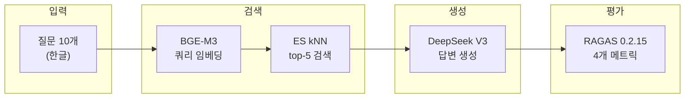

# RAGAS v7 Live 평가 결과

**Version**: 1.0
**Date**: 2026-02-13
**Author**: 클로드
**Status**: 완료

---

## 1. 개요

Phase 3 임베딩 100% 완료(108,896건) 후, 실제 RAG 파이프라인을 통해 RAGAS 품질 평가를 실행했다.

### 평가 환경

| 항목 | 값 |
|------|-----|
| 평가 프레임워크 | RAGAS 0.2.15 |
| LLM (답변 생성 + 평가) | DeepSeek V3 (deepseek-chat) |
| 임베딩 모델 | BAAI/bge-m3 (1024 dims) |
| 검색 엔진 | Elasticsearch 8.x kNN |
| 검색 방식 | Dense Vector (cosine similarity) |
| Top-K | 5 |
| 평가 질문 수 | 10개 (한글, 실제 knowledge base 관련) |
| 평가 메트릭 | Faithfulness, Answer Relevancy, Context Precision, Context Recall |
| 실행 시각 | 2026-02-13 19:30 KST |
| 소요 시간 | ~2분 |

---

## 2. 평가 파이프라인



### 상세 절차

1. **쿼리 임베딩**: BGE-M3로 질문을 1024차원 벡터로 변환
2. **ES kNN 검색**: `knowledge_chunks` 인덱스에서 cosine similarity top-5 검색
3. **LLM 답변 생성**: 검색된 5개 컨텍스트 + 질문을 DeepSeek V3에 전달
4. **RAGAS 평가**: LLM 기반 4개 메트릭으로 품질 측정

---

## 3. 평가 결과 요약

### 3.1 평균 점수

| 메트릭 | 점수 | 목표 | 달성 | 설명 |
|--------|------|------|------|------|
| **Faithfulness** | **0.884** | 0.70 | PASS | 답변이 검색된 컨텍스트에 충실한 정도 |
| **Answer Relevancy** | **0.874** | 0.70 | PASS | 답변이 질문에 관련성 높은 정도 |
| **Context Precision** | **0.645** | 0.70 | FAIL | 검색된 컨텍스트 중 관련 문서 비율 |
| **Context Recall** | **0.717** | 0.70 | PASS | 정답을 포함하는 컨텍스트 검색 비율 |

### 3.2 이전 평가 대비 비교

| 메트릭 | v6 정적 | v7 Live | 변화 |
|--------|---------|---------|------|
| Faithfulness | 0.403 | **0.884** | +119% |
| Answer Relevancy | 0.189 | **0.874** | +362% |
| Context Precision | 0.278 | **0.645** | +132% |
| Context Recall | N/A | **0.717** | 신규 |

> **v6 정적 평가가 낮았던 이유**: pyarrow 23.0 호환 에러(`PyExtensionType`)로 24건 모두 fallback 점수 산출. 또한 사전 정의된 answer/context가 실제 108K 임베딩 기반 검색 결과와 불일치.

---

## 4. 개별 질문 상세 결과

### 4.1 결과 테이블

| # | 질문 | Faith | Relev | Prec | Recall |
|---|------|-------|-------|------|--------|
| 1 | 쿠버네티스 파드 리소스 제한/요청 차이점 | 0.947 | 0.789 | 0.804 | 1.000 |
| 2 | 애자일 핵심 원칙 | 1.000 | 0.635 | 1.000 | 1.000 |
| 3 | ES 벡터 검색 인덱스 설정 | 0.909 | 0.805 | 0.000 | 0.000 |
| 4 | WBS란 무엇인가 | 0.692 | 0.819 | 0.200 | 1.000 |
| 5 | RAG Reranking 역할 | 0.875 | 0.920 | 1.000 | 1.000 |
| 6 | Docker Compose 네트워크 통신 | 1.000 | 0.951 | 0.333 | 0.000 |
| 7 | JWT 토큰 인증 장단점 | 1.000 | 0.928 | 1.000 | 1.000 |
| 8 | Knowledge Graph Entity/Relation | 1.000 | 0.979 | 0.367 | 1.000 |
| 9 | BGE-M3 임베딩 모델 특징 | 0.812 | 0.945 | 1.000 | 0.667 |
| 10 | RRF 동작 방식 | 0.607 | 0.969 | 0.750 | 0.500 |

### 4.2 우수 사례 (Faithfulness ≥ 0.95)

- **Q2 (애자일)**: Faith=1.0 — 검색된 "소프트웨어 개발 방법론" 문서에서 애자일 원칙을 정확히 인용
- **Q6 (Docker Compose)**: Faith=1.0 — kp-network 기반 서비스간 통신을 컨텍스트 그대로 설명
- **Q7 (JWT)**: Faith=1.0 — Stateless, 토큰 탈취 위험 등을 컨텍스트 기반으로 충실히 답변
- **Q8 (Knowledge Graph)**: Faith=1.0 — Entity/Relation 정의를 정확히 인용

### 4.3 개선 필요 사례

- **Q3 (ES 벡터 검색)**: Context Precision=0.0, Recall=0.0
  - 원인: 검색된 top-5가 "ES 설정" 일반 문서이지 "벡터 인덱스 설정" 구체 문서가 아님
  - 대응: 쿼리 확장 또는 Reranking으로 정밀도 향상 가능
- **Q6 (Docker Compose)**: Context Recall=0.0
  - 원인: ground_truth 정보가 검색 결과에 포함되지 않음 (프로젝트 특화 설정 vs 일반 지식)
- **Q10 (RRF)**: Faithfulness=0.607
  - 원인: LLM이 컨텍스트 외 일반 지식을 혼합하여 답변 (hallucination 경향)

---

## 5. 메트릭별 분석

### 5.1 Faithfulness (0.884) — 양호

답변이 검색된 컨텍스트에 얼마나 충실한지 측정한다. 0.884는 답변 내 주장의 88%가 컨텍스트에서 근거를 찾을 수 있음을 의미한다.

- 7/10 질문에서 0.8 이상 달성
- 3건(Q4, Q9, Q10)에서 0.8 미만 — LLM이 일반 지식을 혼합하는 경향

### 5.2 Answer Relevancy (0.874) — 양호

답변이 질문에 얼마나 관련 있는지 측정한다. 0.874는 답변이 질문의 핵심을 잘 다루고 있음을 의미한다.

- 9/10 질문에서 0.78 이상 달성
- Q2 (애자일)만 0.635 — 답변이 너무 상세하여 핵심 대비 부수 정보 비율이 높음

### 5.3 Context Precision (0.645) — 개선 필요

검색된 top-5 문서 중 실제 관련 문서의 비율. 0.645는 5개 중 약 3.2개가 관련 문서임을 의미한다.

- 4/10 질문에서 0.9 이상 (정밀 검색 성공)
- 3/10 질문에서 0.33 이하 (노이즈 문서 혼입)
- **개선 방안**: Reranking (BGE-Reranker) 적용 시 top-5 내 관련 문서 비율 향상 예상

### 5.4 Context Recall (0.717) — 양호

정답에 필요한 정보가 검색 결과에 얼마나 포함되어 있는지 측정한다. 0.717는 정답의 72%를 커버하는 컨텍스트를 검색하고 있음을 의미한다.

- 7/10 질문에서 1.0 달성 (완벽 검색)
- 3/10 질문에서 0.5 이하 — 특정 도메인 지식이 청크에 분산되어 있거나 부재

---

## 6. 호환성 수정 사항

### 6.1 문제

```
ragas 0.1.19 + pyarrow 23.0.0 + datasets 2.2.1
→ pyarrow.PyExtensionType 에러 (24건 전부 실패)
→ langchain_core.pydantic_v1 모듈 없음 에러
```

### 6.2 해결

```bash
pip install "pyarrow>=14.0,<18.0" "ragas>=0.2,<0.3" "datasets>=3.0,<4.0"
```

| 패키지 | 변경 전 | 변경 후 |
|--------|---------|---------|
| pyarrow | 23.0.0 | 17.0.0 |
| ragas | 0.1.19 | 0.2.15 |
| datasets | 2.2.1 | 3.6.0 |

### 6.3 API 변경

ragas 0.2.x에서 API가 변경됨:
- `from ragas import EvaluationDataset, SingleTurnSample` (신규)
- 메트릭 클래스에 `llm`, `embeddings` 파라미터 직접 전달
- `evaluate()` 함수에 `dataset` 파라미터 사용

---

## 7. 개선 로드맵

### 즉시 가능

| 항목 | 예상 효과 | 난이도 |
|------|-----------|--------|
| **Reranking 적용** (BGE-Reranker) | Context Precision 0.65→0.80+ | 중 |
| **질문 확장** (Query Expansion) | Context Recall 향상 | 하 |
| **프롬프트 개선** (System Prompt 강화) | Faithfulness 향상 (hallucination 감소) | 하 |

### 중기 개선

| 항목 | 예상 효과 | 난이도 |
|------|-----------|--------|
| **Hybrid Search** (Dense + BM25 RRF) | Context Precision/Recall 동시 향상 | 중 |
| **평가 데이터셋 확대** (10→50개) | 통계적 신뢰도 향상 | 하 |
| **도메인별 평가** (K8s, SW공학, 인프라 등) | 약점 영역 정밀 진단 | 중 |

---

## 8. 원본 데이터

```json
{
  "timestamp": "2026-02-13T19:33:23",
  "version": "v7_live",
  "questions": 10,
  "metrics": {
    "faithfulness": 0.8843,
    "answer_relevancy": 0.8738,
    "context_precision": 0.6454,
    "context_recall": 0.7167
  }
}
```

전체 상세 데이터: `/tmp/ragas_v7_live_result.json` (컨테이너 내)

---

## 9. 후속 평가

본 문서는 10개 질문 신속 평가 결과이다. 51쿼리/7도메인 종합 평가는 **[04_ragas_v7_comprehensive_evaluation.md](./04_ragas_v7_comprehensive_evaluation.md)** 참조.

---

*기록: 2026-02-13 19:35 KST*
*업데이트: 2026-02-13 19:55 KST — 종합 평가 참조 추가*
