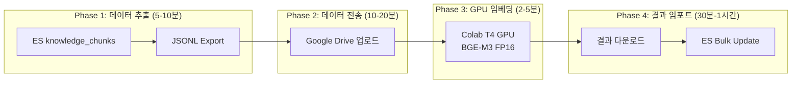

# Google Cloud GPU 임베딩 가속 가이드

**Version**: 2.0 | **Created**: 2026-02-14 | **Updated**: 2026-02-14 12:15 KST

---

## 1. 개요

### 목적
CPU 기반 BGE-M3 임베딩 처리(~1.3 s/chunk)를 Google Colab T4 GPU로 가속하여
ETL v2 재처리 시간을 대폭 단축합니다.

### 스탠드업 결정 (2026-02-14)

| 항목 | 결정 | 근거 |
|------|------|------|
| **GPU 환경** | Colab Free T4 (1순위) | $0, 인프라 설정 불필요 |
| **백업 옵션** | GCE Spot T4 ($0.22/hr) | Colab GPU 할당 실패 시 |
| **A100/Colab Pro** | 불필요 | 5,801 chunks에 과잉/비효율 |

### 성능 비교

| 환경 | 속도 (s/chunk) | 5,801 chunks | 83,600 chunks (향후) | 비용 |
|------|---------------|-------------|---------------------|------|
| CPU (현재, 8코어 6스레드) | ~1.3 | ~2.8시간 | ~50시간 | $0 |
| **Colab T4 GPU (채택)** | **~0.005-0.01** | **2-5분** | **42분-1.4시간** | **$0** |
| GCE T4 VM | ~0.005-0.01 | 2-5분 | 42분-1.4시간 | ~$3-5 |

---

## 2. 사전 준비 (완료)

### 2.1 gcloud CLI 설치

```bash
# 설치 위치
/tmp/google-cloud-sdk/bin/gcloud

# 버전 확인
/tmp/google-cloud-sdk/bin/gcloud version
# Google Cloud SDK 556.0.0

# PATH 추가 (세션별)
export PATH="/tmp/google-cloud-sdk/bin:$PATH"
```

### 2.2 gcloud 인증

```bash
# WSL2에서 인증 (브라우저 자동 열림)
gcloud auth login
# 로그인 완료: k82022603@gmail.com

# Google Drive API 접근이 필요한 경우 (업로드/다운로드 자동화)
gcloud auth login --enable-gdrive-access

# 인증 상태 확인
gcloud auth list
```

**WSL2 참고사항**:
- `gio: Operation not supported` 경고는 정상 (WSL2에서 브라우저 자동 열기 불가)
- URL을 복사하여 Windows 브라우저에서 수동으로 열면 인증 완료됨
- `--no-launch-browser` 옵션 사용 시 인증 코드를 터미널에 입력해야 함

### 2.3 프로젝트 설정

```bash
# 프로젝트 설정
gcloud config set project planar-courage-455910-n9

# 설정 확인
gcloud config list
# account = k82022603@gmail.com
# project = planar-courage-455910-n9
```

---

## 3. 전체 워크플로우 (4단계)



**총 소요: 약 2-3시간** (CPU 50시간 대비 20x+ 단축)

---

## 4. Phase 1: 데이터 추출

### 4.1 자동 추출 (ES에서 직접)

ES `knowledge_chunks` 인덱스에서 sparse vector가 없는 청크를 추출:

```bash
# 컨테이너 내부에서 실행
docker exec kp-ai-service python3 << 'PYEOF'
import json, urllib.request

chunks = []
query = {
    "size": 500,
    "query": {"bool": {"must_not": [{"exists": {"field": "sparse_vector"}}]}},
    "_source": ["chunk_id", "document_id", "text"]
}

req = urllib.request.Request(
    "http://kp-elasticsearch:9200/knowledge_chunks/_search?scroll=1m",
    data=json.dumps(query).encode(),
    headers={"Content-Type": "application/json"}
)
resp = urllib.request.urlopen(req)
data = json.loads(resp.read())

for hit in data["hits"]["hits"]:
    src = hit["_source"]
    chunks.append({"chunk_id": src["chunk_id"], "document_id": src["document_id"], "text": src["text"]})

scroll_id = data.get("_scroll_id")
while scroll_id and len(data["hits"]["hits"]) > 0:
    req2 = urllib.request.Request(
        "http://kp-elasticsearch:9200/_search/scroll",
        data=json.dumps({"scroll": "1m", "scroll_id": scroll_id}).encode(),
        headers={"Content-Type": "application/json"}
    )
    data = json.loads(urllib.request.urlopen(req2).read())
    for hit in data["hits"]["hits"]:
        src = hit["_source"]
        chunks.append({"chunk_id": src["chunk_id"], "document_id": src["document_id"], "text": src["text"]})
    if not data["hits"]["hits"]:
        break

with open("/tmp/chunks_need_sparse.jsonl", "w") as f:
    for c in chunks:
        f.write(json.dumps(c, ensure_ascii=False) + "\n")

print(f"Exported {len(chunks)} chunks ({len(json.dumps(chunks))//1024} KB)")
PYEOF

# 호스트로 복사
docker cp kp-ai-service:/tmp/chunks_need_sparse.jsonl ./scripts/
```

### 4.2 생성된 파일

| 파일 | 크기 | 내용 |
|------|------|------|
| `chunks_need_sparse.jsonl` | 494KB | sparse 누락 465개 청크 |
| `all_chunks.jsonl` | 5.5MB | 전체 5,801개 청크 |

**JSONL 형식**:
```json
{"chunk_id": "uuid", "document_id": "uuid", "text": "청크 텍스트..."}
```

---

## 5. Phase 2: Google Drive 업로드

### 5.1 수동 업로드 (권장)

Windows 탐색기에서 직접 업로드:

```
파일 위치: D:\Users\KTDS\Documents\06.과제\hybrid-rag-knowledge-ops\knowledge_service\scripts\
```

Google Drive 대상 폴더:
- URL: https://drive.google.com/drive/folders/1KAucEE4tP_uWcdH7NuodHjtMysiLrUuO
- 폴더명: 사용자 지정 폴더

**업로드할 파일**:
1. `gpu_embedding_colab.ipynb` - Colab 노트북
2. `chunks_need_sparse.jsonl` - 임베딩 대상 데이터
3. `all_chunks.jsonl` - 전체 청크 (선택)

### 5.2 gcloud CLI 업로드 (Drive 스코프 필요)

```bash
# Drive API 스코프로 재인증
gcloud auth login --enable-gdrive-access

# Google Drive API로 업로드
TOKEN=$(gcloud auth print-access-token)
FOLDER_ID="1KAucEE4tP_uWcdH7NuodHjtMysiLrUuO"

curl -X POST \
  "https://www.googleapis.com/upload/drive/v3/files?uploadType=multipart" \
  -H "Authorization: Bearer $TOKEN" \
  -F "metadata={\"name\":\"chunks_need_sparse.jsonl\",\"parents\":[\"$FOLDER_ID\"]};type=application/json" \
  -F "file=@scripts/chunks_need_sparse.jsonl"
```

---

## 6. Phase 3: Colab GPU 임베딩

### 6.1 Colab 노트북 사용법

1. Google Drive에서 `gpu_embedding_colab.ipynb` 클릭
2. **Colab으로 열기** 선택
3. 런타임 → 런타임 유형 변경 → **T4 GPU** 선택
4. Cell 3에서 `DRIVE_FOLDER` 경로를 실제 폴더로 수정
5. 전체 셀 실행 (Ctrl+F9)

### 6.2 GPU 파라미터 (스탠드업 확정)

| 파라미터 | 값 | 근거 |
|----------|-----|------|
| batch_size | **64** | T4 VRAM ~4GB 사용, 안전 여유 |
| max_length | **1000** | 기존 데이터 일관성 유지 |
| use_fp16 | **True** | VRAM 50% 절감, 정확도 손실 없음 |
| return_sparse | **True** | GPU 오버헤드 10-15%로 미미 |
| return_colbert_vecs | **False** | 불필요 |

### 6.3 핵심 임베딩 코드

```python
from FlagEmbedding import BGEM3FlagModel

model = BGEM3FlagModel('BAAI/bge-m3', use_fp16=True)

result = model.encode(
    texts,
    batch_size=64,
    max_length=1000,
    return_dense=True,
    return_sparse=True,
    return_colbert_vecs=False
)

# result['dense_vecs']: numpy array (N, 1024)
# result['lexical_weights']: list of dicts {token_id: weight}
```

### 6.4 결과 파일 형식

```json
{"chunk_id": "uuid", "document_id": "uuid", "dense_vector": [0.01, ...], "sparse_vector": {"12345": 0.89, ...}}
```

- `dense_vector`: 1024차원 float 배열
- `sparse_vector`: {token_id(str): weight(float)} 딕셔너리
- 프로젝트 `ChunkEmbedding` 클래스와 **완전 호환**

---

## 7. Phase 4: 결과 임포트

### 7.1 결과 파일 다운로드

Google Drive에서 `chunks_need_sparse_embeddings.jsonl` 다운로드 후:

```bash
# 로컬 → 컨테이너
docker cp chunks_need_sparse_embeddings.jsonl kp-ai-service:/tmp/
```

### 7.2 ES 벌크 임포트

```bash
# 임포트 실행
docker exec kp-ai-service python3 /app/scripts/import_embeddings.py /tmp/chunks_need_sparse_embeddings.jsonl
```

`import_embeddings.py` 동작:
- JSONL 파일에서 chunk_id별 dense_vector, sparse_vector 읽기
- ES `knowledge_chunks` 인덱스에 벌크 업데이트 (200건/배치)
- 실패 건 재시도
- 완료 후 자동 검증 (dense/sparse 커버리지 출력)

### 7.3 검증

```bash
# ES에서 sparse 커버리지 확인
docker exec kp-ai-service bash -c 'curl -s "http://kp-elasticsearch:9200/knowledge_chunks/_search" \
  -H "Content-Type: application/json" \
  -d "{\"size\":0,\"aggs\":{\"has_sparse\":{\"filter\":{\"exists\":{\"field\":\"sparse_vector\"}}}}}"'
# 기대: has_sparse.doc_count == total chunks (5,801)
```

---

## 8. 비용 분석

| 옵션 | GPU | 비용 | 5,801 chunks | 83,600 chunks |
|------|-----|------|-------------|--------------|
| **Colab Free (채택)** | T4 | **$0** | **2-5분** | **42분-1.4시간** |
| Colab Pro | T4 | $10/월 | 2-5분 | 42분-1.4시간 |
| GCE Spot T4 | T4 | $0.22/hr | 2-5분 | ~$0.50 |
| GCE On-demand T4 | T4 | $0.95/hr | ~$0.10 | ~$1.50 |
| GCE A100 | A100 | $3.67/hr | 1분 | ~$1.00 |

---

## 9. 리스크 및 대응

| 리스크 | 확률 | 영향 | 대응 |
|--------|------|------|------|
| Colab GPU 할당 실패 | 중 | 중 | GCE Spot T4 전환 |
| Colab 런타임 중단 | 저 | 저 | 2-5분 작업이므로 재실행 |
| 데이터 외부 전송 보안 | 저 | 중 | 완료 후 Drive 데이터 즉시 삭제 |
| FP16 정확도 손실 | 극저 | 저 | BGE-M3 공식 지원 모드 |
| ES bulk import 실패 | 저 | 중 | chunk_id 기반 멱등성 보장 |

---

## 10. 프로젝트 파일 목록

| 파일 | 위치 | 용도 |
|------|------|------|
| `gpu_embedding_colab.ipynb` | `scripts/` | Colab GPU 임베딩 노트북 |
| `chunks_need_sparse.jsonl` | `scripts/` | sparse 누락 465개 청크 데이터 |
| `all_chunks.jsonl` | `scripts/` | 전체 5,801개 청크 데이터 |
| `import_embeddings.py` | `scripts/` | 결과 ES 벌크 임포트 스크립트 |
| `export_chunks_for_gpu.py` | `scripts/` | 청크 추출 스크립트 (가이드 내 포함) |

---

## 11. 실행 기록 (2026-02-14)

### 11.1 Colab 실행 시 발생한 이슈 및 해결

| 이슈 | 원인 | 해결 |
|------|------|------|
| `torch.cuda.get_device_properties(0).total_mem` AttributeError | PyTorch 2.9에서 속성명 변경 (`total_memory`) | 무시 가능 (GPU 확인은 성공) |
| `FlagEmbedding` ImportError (`is_torch_fx_available`) | FlagEmbedding과 transformers 버전 충돌 | `!pip install -q FlagEmbedding==1.3.4 transformers==4.44.2` |
| Drive 폴더 경로 불일치 | 한글+특수문자 포함 경로 | `os.walk`로 JSONL 파일 위치 검색하여 확인 |

### 11.2 실제 Google Drive 폴더 구조

```
내 드라이브/
└── 업무&과제/
    └── hybrid-rag-knowledge-ops/
        ├── knowledge_data/
        │   └── documents/          # 소스 문서 (PDF, docx 등)
        └── knowledge_service/
            └── scripts/            # JSONL + Colab 노트북
                ├── chunks_need_sparse.jsonl
                ├── all_chunks.jsonl
                ├── gpu_embedding_colab.ipynb
                └── chunks_need_sparse_embeddings.jsonl  (결과)
```

**Colab Cell 3 경로 설정**:
```python
DRIVE_FOLDER = '/content/drive/MyDrive/업무&과제/hybrid-rag-knowledge-ops/knowledge_service/scripts'
```

### 11.3 Colab 실행 결과

| 항목 | 값 |
|------|-----|
| GPU | Tesla T4 |
| PyTorch | 2.9.0+cu128 |
| FlagEmbedding | 1.3.4 |
| 처리 청크 수 | 465개 |
| Dense vector | 1024차원, norm ~1.0 |
| Sparse vector | 평균 ~130 keys |
| 결과 파일 | chunks_need_sparse_embeddings.jsonl (11MB) |

### 11.4 ES 벌크 임포트 결과

```
Total records: 465
Updated: 465, Failed: 0
Completed in 3.0s (157 docs/s)

Verification:
  Total chunks: 5,801
  Has dense: 5,801 (100.0%)
  Has sparse: 5,801 (100.0%)  ← 이전 5,336(97.9%) → 5,801(100%) 복구
```

### 11.5 전체 타임라인

| 시간 (KST) | 작업 |
|------------|------|
| 09:00 | gcloud SDK 설치 (v556.0.0) |
| 09:06 | GPU 임베딩 가이드 v1.0 작성 |
| 09:24 | 스탠드업 미팅 시작 (PM, RAG, ETL, Infra, TL) |
| 09:34 | 스탠드업 종료 - Colab Free T4 확정 |
| 09:35 | gcloud 인증 성공 (k82022603@gmail.com) |
| 12:09 | JSONL 청크 추출 완료 (465개 + 5,801개) |
| 12:11 | Colab 노트북 + import 스크립트 생성 |
| 12:15 | 가이드 v2.0 업데이트 |
| ~13:00 | 사용자 Google Drive 업로드 + Colab 실행 |
| 13:25 | Colab GPU 임베딩 완료 (465개, T4 GPU) |
| 13:26 | ES 벌크 임포트 완료 (3초, 465/465 성공) |

---

## 12. 현재 상태

| 항목 | 상태 | 비고 |
|------|------|------|
| gcloud CLI 설치 | ✅ 완료 | v556.0.0 |
| gcloud 인증 | ✅ 완료 | k82022603@gmail.com |
| 프로젝트 설정 | ✅ 완료 | planar-courage-455910-n9 |
| JSONL 청크 추출 | ✅ 완료 | 465개 sparse 누락 + 5,801개 전체 |
| Colab 노트북 | ✅ 완료 | gpu_embedding_colab.ipynb |
| import 스크립트 | ✅ 완료 | import_embeddings.py |
| Google Drive 업로드 | ✅ 완료 | 사용자 수동 업로드 |
| **Colab GPU 임베딩** | ✅ **완료** | **465 chunks, T4 GPU, Dense+Sparse** |
| **ES 벌크 임포트** | ✅ **완료** | **465/465 성공, Sparse 100% 달성** |
| 나머지 ~1,550파일 ETL | ⏳ 대기 | 로컬 CPU ETL 재시작 필요 |

---

## 13. 다음 단계

### 즉시 (P0)
1. ~~v2.1 sparse 누락 465개 Colab GPU 재임베딩~~ ✅ 완료
2. 로컬 ETL 재시작 (FlagEmbedding 정상화 상태, ~1,550파일 처리)
3. 데이터 품질 CRITICAL 이슈 해결 (Neo4j HAS_ENTITY, PG 메타데이터)

### 금일 내 (P1)
4. 데이터 품질 HIGH/MEDIUM 이슈 해결
5. Frontend UI 빌드 완료

### 향후 (P2)
6. ETL 완료 후 전체 청크에 대해 Colab GPU 일괄 재임베딩 (선택)
7. 증분 임베딩 파이프라인 설계

---

## 14. 핵심 개념 설명

### GPU 임베딩이란?

현재 시스템은 문서를 처리할 때 다음 단계를 거칩니다:

```
[소스 문서] → [파싱] → [청킹] → [임베딩] → [저장]
  PDF/docx    텍스트추출   문단분할   벡터변환    PG/ES/Neo4j
```

**임베딩**: 텍스트를 숫자 벡터(1024개의 숫자)로 변환하는 작업
- **Dense vector**: 의미 검색용 (1024차원 실수 배열)
- **Sparse vector**: 키워드 검색용 (토큰ID:가중치 딕셔너리)

이 변환 작업이 CPU에서는 느리고(~1.3초/청크), GPU에서는 빠릅니다(~0.01초/청크).

### 왜 Colab을 쓰는가?

| 항목 | 설명 |
|------|------|
| **문제** | 로컬 PC에 GPU가 없어서 임베딩이 느림 |
| **해결** | Google Colab의 무료 T4 GPU를 빌려서 임베딩만 처리 |
| **방법** | 청크 텍스트를 JSONL로 추출 → Drive 업로드 → Colab에서 GPU 임베딩 → 결과 다운로드 → ES에 저장 |
| **제한** | 파싱/청킹/엔티티추출은 GPU 가속 불가, 로컬에서만 가능 |

### 전체 데이터 현황

| 구분 | 파일 수 | 청크 수 | 상태 |
|------|--------|--------|------|
| ETL 완료 (v2.0) | 114개 | 5,336 | Dense ✅ Sparse ✅ |
| ETL 완료 (v2.1) | 8개 | 465 | Dense ✅ Sparse ✅ (GPU 복구) |
| **미처리** | **~1,550개** | **미정** | **파싱부터 필요** |
| **합계** | **~1,672개** | - | - |

---

## 변경 이력

| 날짜 | 버전 | 변경 내용 |
|------|------|----------|
| 2026-02-14 09:06 | 1.0 | 초기 문서 작성 |
| 2026-02-14 12:15 | 2.0 | 스탠드업 결정 반영 - Colab Free T4 확정, 4단계 워크플로우 |
| 2026-02-14 13:30 | 2.1 | Colab 실행 완료 - 이슈/해결 기록, ES 임포트 결과, 핵심 개념 설명 추가 |
