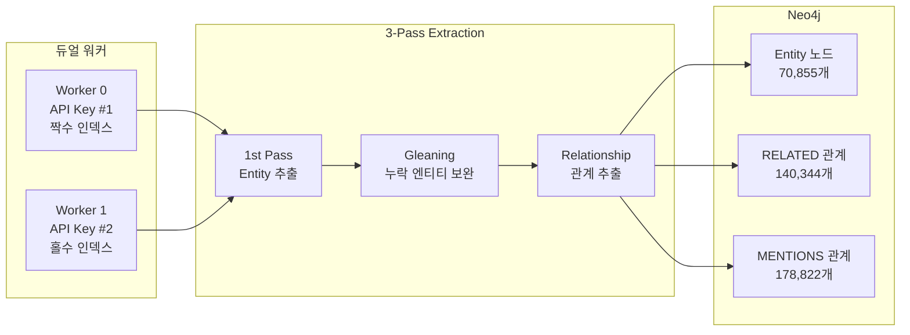

# Entity Extraction 결과 보고서

**날짜**: 2026-02-15
**Sprint**: Sprint 12
**Phase**: ETL Phase 3 - Gleaning Entity Extraction

---

## 1. 실행 요약

| 항목 | 값 |
|------|-----|
| 대상 청크 | 16,185건 (token_count >= 100) |
| 처리 완료 | 16,185건 (100%) |
| 소요 시간 | ~8시간 (14:00~22:25 KST) |
| 워커 | 2개 (듀얼 API 키 파티셔닝) |
| Concurrency | 10 per worker |
| LLM | DeepSeek V3.2 (deepseek-chat) |
| Gleaning | 1회 (2-pass extraction) |
| 에러 | 23건 (0.14%) |

---

## 2. 추출 결과

### 2.1 전체 통계

| 항목 | 값 |
|------|-----|
| 고유 엔티티 | **70,855개** |
| 총 노드 (Neo4j) | **128,355개** |
| 총 관계 (Neo4j) | **375,229개** |
| MENTIONS 관계 | 178,822개 |
| RELATED 관계 | 140,344개 |
| PART_OF 관계 | 56,063개 |
| 고립 엔티티 | 0개 (100% 연결) |

### 2.2 엔티티 타입 분포

| 타입 | 수량 | 비율 |
|------|-----:|-----:|
| Concept | 38,376 | 54.2% |
| Technology | 11,197 | 15.8% |
| Person | 4,403 | 6.2% |
| Entity (미분류) | 4,342 | 6.1% |
| Project | 4,339 | 6.1% |
| Organization | 3,316 | 4.7% |
| Technology+Concept | 2,543 | 3.6% |
| 기타 복합 라벨 | 2,339 | 3.3% |
| **합계** | **70,855** | **100%** |

### 2.3 관계 타입 분포

| 관계 타입 | 수량 | 설명 |
|-----------|-----:|------|
| MENTIONS | 178,822 | Chunk → Entity 참조 |
| RELATED | 140,344 | Entity ↔ Entity 의미적 관계 |
| PART_OF | 56,063 | Chunk → Document 소속 |

RELATED 관계는 `type` 속성에 세부 관계 유형 보유 (CREATED, USES, MANAGES 등)

### 2.4 Chunk-Entity 커버리지

| 항목 | 값 |
|------|-----|
| 엔티티 보유 청크 | 16,180 / 56,063 (28.9%) |
| 엔티티 미보유 청크 | 39,883 (tc < 100 대상 미처리) |

> 전체 56,063 청크 중 tc>=100인 16,185건만 처리. 미보유 39,883건은 토큰 수 부족으로 처리 대상 제외.

### 2.5 가장 많이 언급된 엔티티 (TOP 10)

| 순위 | 엔티티 | 타입 | 언급 수 |
|------|--------|------|--------:|
| 1 | Holmes | Person | 1,859 |
| 2 | Watson | Person | 1,235 |
| 3 | Claude Code | Technology | 853 |
| 4 | Claude | Technology | 813 |
| 5 | Anthropic | Organization | 775 |
| 6 | LLM | Technology | 720 |
| 7 | AI | Technology | 642 |
| 8 | OpenAI | Organization | 525 |
| 9 | API | Technology | 504 |
| 10 | 개발자 | Person | 428 |

> Holmes/Watson은 셜록홈즈 소설 데이터에서 추출. AI/Tech 관련 엔티티가 상위권.

### 2.6 가장 많은 연결을 가진 엔티티 (TOP 5)

| 엔티티 | 연결 수 |
|--------|--------:|
| Holmes | 4,403 |
| Claude Code | 2,614 |
| Claude | 2,197 |
| Watson | 2,152 |
| AI | 2,026 |

---

## 3. 품질 평가

### 3.1 강점
- **100% 완료**: 16,185건 전량 처리, 에러율 0.14%
- **풍부한 관계**: 엔티티당 평균 ~2.0개 RELATED 관계
- **0 고립 엔티티**: 모든 엔티티가 최소 1개 이상 연결
- **의미 있는 관계 설명**: RELATED 관계에 자연어 description 속성 보유

### 3.2 개선 포인트
- **미분류 엔티티 6.1%**: Entity 라벨만 있고 세부 타입 없는 4,342건
- **복합 라벨**: 일부 엔티티가 Person+Organization 등 다중 라벨 보유 (정제 필요)
- **한글/영문 혼재**: 동일 개념의 한글/영문 중복 가능성 (예: AI/인공지능)

### 3.3 Neo4j 리소스

| 항목 | 값 |
|------|-----|
| 메모리 | 1.64GB / 2GB (82.1%) |
| 노드 수 | 128,355 |
| 관계 수 | 375,229 |

---

## 4. 성능 분석

### 4.1 속도

| 구간 | 속도 | 비고 |
|------|------|------|
| 단일 키 (concurrency=5) | ~8.3 chunks/min | 기본 |
| 단일 키 (concurrency=10) | ~14.3 chunks/min | 최적 |
| 단일 키 (concurrency=20) | ~14.3 chunks/min | Rate Limit |
| **듀얼 키 (concurrency=10×2)** | **~40 chunks/min** | **3.1x 향상** |

### 4.2 API 비용 (실측)

#### Phase 1 실제 사용량 (DeepSeek 대시보드 2026-02-15)

| 항목 | 값 |
|------|-----|
| 총 토큰 | 69,601,398 |
| Cache Hit (Input) | 6,710,848 ($0.028/M) |
| Cache Miss (Input) | 39,140,808 ($0.28/M) |
| Output | 23,749,742 ($0.42/M) |
| **Phase 1 실비용** | **$21.12** |

#### Phase 2 추정 (23,074건, token 50-99)

| 항목 | 값 |
|------|-----|
| 추정 토큰 | ~99M tokens (청크가 작으므로 Phase 1 대비 ~1.4x) |
| 추정 비용 | **~$23-28** |
| **합산 (Phase 1+2)** | **~$44-50** (약 72,500원) |

### 4.3 타 LLM 대비 비용 비교

동일 작업(39,259건 Entity Extraction + Gleaning)을 타 LLM으로 수행 시 예상 비용:

| 모델 | 모델 급 | Input 단가 | Output 단가 | 예상 비용 | vs DeepSeek |
|------|---------|-----------|------------|----------|-------------|
| **DeepSeek V3.2** | GPT-4o급 | $0.28/M | $0.42/M | **~$50** | 기준 |
| GPT-4o-mini | 경량 | $0.15/M | $0.60/M | ~$51 | 1.0x |
| Claude Haiku 4.5 | 경량 | $0.80/M | $4/M | ~$319 | 6.4x |
| GPT-4o | 풀사이즈 | $2.50/M | $10/M | ~$852 | 17x |
| Claude Sonnet 4.5 | 풀사이즈 | $3/M | $15/M | ~$1,196 | 24x |
| GPT-4 Turbo | 풀사이즈 | $10/M | $30/M | ~$2,835 | 57x |
| Claude Opus 4.6 | 최상위 | $15/M | $75/M | ~$5,977 | 120x |

#### 비용 효율 분석

- **DeepSeek V3.2는 GPT-4o급 성능을 GPT-4o-mini 가격에 제공**
- GPT-4o-mini ($51)는 가격은 유사하나, 경량 모델이라 Entity Extraction + Gleaning 같은 복잡 추론 작업에서 **품질 저하** 예상:
  - 한국어 엔티티 인식 약함
  - Gleaning(2nd pass) 추론 능력 부족
  - 복합 관계(RELATED) 추출 정밀도 저하
- Claude Sonnet 사용 시 **~$1,196 (약 173만원)**, GPT-4o 사용 시 **~$852 (약 123만원)**
- **결론**: 대량 반복 작업(Entity Extraction)에 DeepSeek V3.2는 비용 대비 품질 최적 선택

---

## 5. 아키텍처

---

---

## 6. Phase 3 재실행 (2026-02-16)

### 6.1 재실행 배경

Phase 1 실행에서 `MIN_TOKENS=100` 설정으로 인해 **전체 청크의 28.9%만 처리**되었음이 Graph Panel 장애 조사 중 발견됨.

- **증상**: Chat Search에서 sourceType=graph인 출처를 클릭해도 그래프 패널이 열리지 않음
- **원인**: 해당 청크에 MENTIONS 관계 없음 → 엔티티 데이터 누락
- **영향**: 56,063개 중 39,883개(71.1%) 청크에 MENTIONS 관계 없음

### 6.2 token_count 분포 상세

| 범위 | 청크 수 | 비율 | Phase 1 처리 | Phase 2 처리 |
|------|--------:|-----:|:----------:|:----------:|
| < 50 | 16,766 | 29.9% | - | - (쓰레기 데이터) |
| 50-99 | 23,112 | 41.2% | - | **대상** |
| 100-149 | 14,701 | 26.2% | **완료** | - |
| >= 150 | 1,484 | 2.6% | **완료** | - |
| **합계** | **56,063** | **100%** | 16,185 | 23,074 |

### 6.3 재실행 구성

| 항목 | Phase 1 (2026-02-15) | Phase 2 (2026-02-16) |
|------|---------------------|---------------------|
| MIN_TOKENS | 100 | **50** |
| 워커 수 | 2 | **3** |
| API Key | 2개 | **3개** |
| Concurrency | 10/worker | 3/worker |
| 파티셔닝 | 0/2, 1/2 | **0/3, 1/3, 2/3** |
| 대상 | 16,185건 | **23,074건** |
| 예상 소요 | ~8시간 | **~43시간** |

### 6.4 예상 최종 결과 (Phase 1 + Phase 2 합산)

| 항목 | Phase 1 결과 | Phase 2 예상 | 합산 예상 |
|------|-------------|-------------|----------|
| 처리 청크 | 16,185 | ~23,074 | **~39,259** |
| 커버리지 | 28.9% | +41.2% | **~70.0%** |
| 엔티티 (추정) | 70,855 | ~90,000 | **~160,000** |
| MENTIONS (추정) | 178,822 | ~230,000 | **~400,000+** |

> token_count < 50인 16,766건(29.9%)은 쓰레기 데이터로 제외. 실질 커버리지는 **~100%** (의미 있는 청크 기준).

### 6.5 교훈

1. **"100% 완료" 보고 시 전체 대비 커버리지 검증 필수**: Phase 1에서 "16,185/16,185 = 100%" 보고했으나, 이는 token_count >= 100 범위만의 100%였고 전체 기준 28.9%에 불과
2. **MIN_TOKENS 설정의 중요성**: 너무 높은 임계값은 다수 청크를 제외시킴. 50 이상이면 의미 있는 텍스트 포함
3. **데이터 품질이 검색 품질을 결정**: MENTIONS 누락 → Graph 패널 미작동 → 사용자 경험 저하

---

*기록자: Claude Code (Opus 4.6)*
*최초 기록: 2026-02-15 23:09 KST*
*업데이트: 2026-02-16 12:15 KST (Phase 3 재실행 추가)*
*업데이트: 2026-02-16 14:00 KST (실측 비용 + 타 LLM 비교 추가)*
