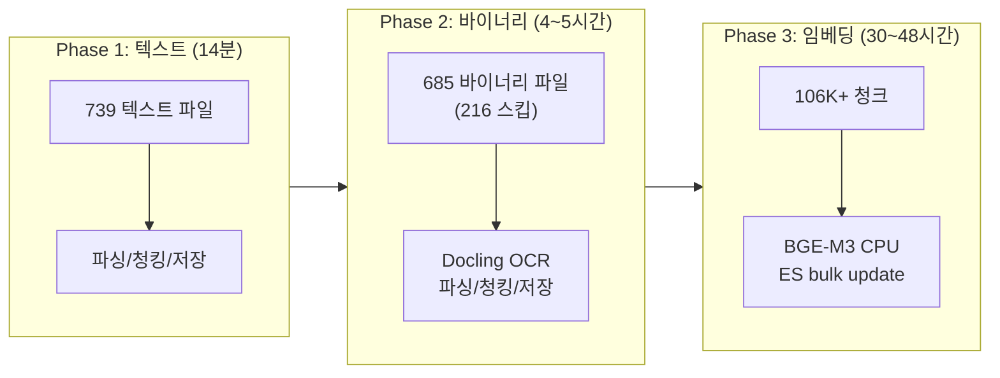

# ETL 3-Phase 전략 보고서

**Version**: 1.0
**Date**: 2026-02-12
**Author**: 클로드

---

## 1. 전략 개요

대규모 문서(901개 파일) 처리를 위해 ETL 파이프라인을 3단계로 분리.

---

## 2. Phase 1: 텍스트 파일 ETL

### 스크립트
`scripts/run_etl_noembedding.py`

### 결과

| 항목 | 값 |
|------|-----|
| 대상 | .md, .txt, .json, .py, .ipynb, .java, .go, .yaml, .html 등 |
| 워커 | 4개 |
| 성공 | 739건 |
| 실패 | 0건 |
| 소요시간 | 13.6분 |
| 처리속도 | 54.4 files/min |
| 청크 생성 | ~75,621개 |

### 설계 포인트
- `enable_embeddings=False`: 파싱/청킹/저장만 수행
- `enable_entity_extraction=False`: 엔티티 추출 OFF (속도 최적화)
- `SLOW_EXTENSIONS` 스킵: PDF/PPTX/DOCX/XLSX → Phase 2로 이관

---

## 3. Phase 2: 바이너리 파일 ETL

### 스크립트
`scripts/run_etl_phase2.py`

### 설계

| 항목 | 값 | 근거 |
|------|-----|------|
| 워커 | 2개 | Docling OCR CPU 집중 |
| 정렬 | 파일 크기 오름차순 | 작은 파일 먼저 → 빠른 성공 축적 |
| 임베딩 | OFF | Phase 3에서 처리 |
| 대상 | .pdf, .pptx, .docx, .xlsx, .doc |

### 크기 분포 (901개 바이너리 중)

| 범위 | 파일 수 |
|------|---------|
| < 1MB | ~400 |
| 1~5MB | ~300 |
| 5~10MB | ~120 |
| 10~60MB | ~80 |

### 현재 진행

| 항목 | 값 |
|------|-----|
| 성공 | 652+ |
| 스킵 | 216 (file_hash dedup) |
| 실패 | 0 |
| 남은 파일 | ~33 (대형 PDF) |
| 병목 | 10~60MB PDF의 Docling+RapidOCR (파일당 5~30분) |

---

## 4. Phase 3: 임베딩 백필

### 스크립트
`scripts/run_embedding_backfill.py`

### 별도 문서
- `ragas/embedding/01_embedding_backfill_plan.md` - 상세 계획
- `ragas/embedding/02_embedding_progress_report.md` - 진행 보고

---

## 5. DB 적재 현황 (Phase 1+2 결과)

| DB | 항목 | 수량 | 용도 |
|----|------|------|------|
| PostgreSQL | documents | 1,401 | 문서 메타데이터 (SSOT) |
| Elasticsearch | knowledge_chunks | 106,641 | 전문 검색 + 벡터 검색 |
| Neo4j | nodes | 100,829 | 그래프 검색 |

---

## 6. 스크립트 목록

| 스크립트 | Phase | 용도 |
|---------|-------|------|
| `run_etl_noembedding.py` | 1 | 텍스트 파일 (임베딩 OFF) |
| `run_etl_phase2.py` | 2 | 바이너리 파일 (크기순, 임베딩 OFF) |
| `run_embedding_backfill.py` | 3 | ES scroll → BGE-M3 → bulk update |
| `run_etl_workers.py` | - | 2워커 통합 ETL (deprecated) |
| `embedding_monitor.sh` | 모니터 | 임베딩 진행률 Slack 보고 |

---

## 7. 교훈 및 인사이트

### 7.1 파싱과 임베딩 분리의 효과
- 파싱/저장: **14분 + 4~5시간** (키워드 검색 즉시 가능)
- 임베딩: **30~48시간** (의미 검색은 나중에)
- 사용자는 임베딩 완료 전에도 키워드/그래프 검색 사용 가능

### 7.2 CPU BGE-M3 한계
- 0.5~1.2 texts/s가 현실적 최대
- 100K 청크 임베딩에 30~48시간
- GPU 또는 임베딩 API 사용 시 수시간으로 단축 가능

### 7.3 idempotent 설계의 가치
- file_hash dedup: 동일 파일 재처리 방지
- ES exists 쿼리: 임베딩 이미 있는 청크 스킵
- 중단 후 재시작이 안전 → 운영 안정성 확보
