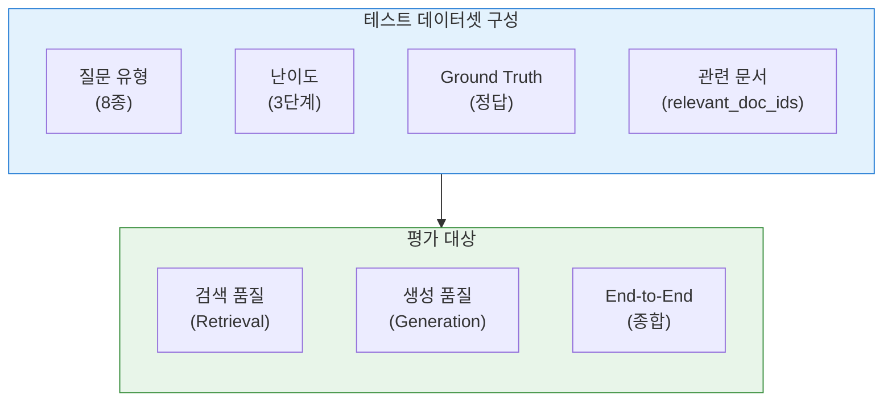
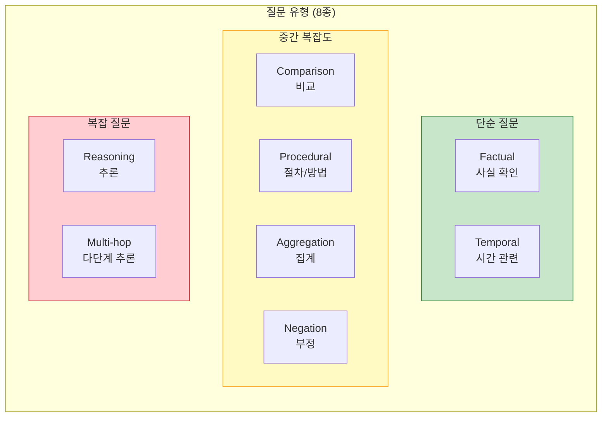
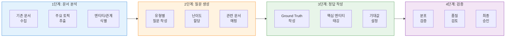

# RAG 테스트 데이터셋 설계서

| 항목 | 내용 |
|------|------|
| **문서명** | RAG 테스트 데이터셋 설계서 |
| **버전** | 1.0 |
| **작성일** | 2026-01-22 |
| **작성자** | MLRag Agent |
| **관련 문서** | [rag_performance_test_design.md](../02_design/rag_performance_test_design.md), [hybrid_rag_platform_detailed_design.md](../02_design/hybrid_rag_platform_detailed_design.md) |
| **상태** | Draft |

---

## 변경 이력

| 버전 | 일자 | 작성자 | 변경 내용 |
|------|------|--------|----------|
| 1.0 | 2026-01-22 | MLRag Agent | 초안 작성 - 설계서 리뷰 P1 지적사항 대응 |

---

## 목차

1. [개요](#1-개요)
2. [테스트셋 구조](#2-테스트셋-구조)
3. [질문 유형 분류](#3-질문-유형-분류)
4. [난이도 체계](#4-난이도-체계)
5. [평가 메트릭](#5-평가-메트릭)
6. [테스트셋 분포 기준](#6-테스트셋-분포-기준)
7. [샘플 테스트 케이스](#7-샘플-테스트-케이스)
8. [데이터셋 생성 가이드](#8-데이터셋-생성-가이드)
9. [품질 검증 기준](#9-품질-검증-기준)

---

## 1. 개요

### 1.1 목적

본 문서는 Hybrid RAG Knowledge Platform의 품질 평가를 위한 **테스트 데이터셋 100개**를 체계적으로 설계하고 관리하기 위한 계획을 정의합니다.

### 1.2 배경

- **MLRag 설계서 리뷰 지적사항 (P1)**: "실제 테스트셋" 부재
- **RAGAS 평가 체계**: 정의는 완료되었으나 실제 평가용 데이터 필요
- **권장사항**: 최소 100개 테스트 케이스 생성 필요

### 1.3 범위



---

## 2. 테스트셋 구조

### 2.1 JSON 스키마 정의

```json
{
  "$schema": "http://json-schema.org/draft-07/schema#",
  "type": "object",
  "required": ["id", "question", "question_type", "difficulty", "relevant_doc_ids"],
  "properties": {
    "id": {
      "type": "string",
      "pattern": "^TEST-[0-9]{3}$",
      "description": "테스트 케이스 고유 ID (TEST-001 ~ TEST-100)"
    },
    "question": {
      "type": "string",
      "minLength": 10,
      "description": "평가용 질문 (한국어)"
    },
    "question_type": {
      "type": "string",
      "enum": ["factual", "comparison", "reasoning", "multi_hop", "procedural", "aggregation", "temporal", "negation"],
      "description": "질문 유형 분류"
    },
    "difficulty": {
      "type": "string",
      "enum": ["easy", "medium", "hard"],
      "description": "난이도"
    },
    "ground_truth": {
      "type": "string",
      "description": "정답 (선택적, 있으면 Answer Correctness 평가 가능)"
    },
    "relevant_doc_ids": {
      "type": "array",
      "items": {"type": "string"},
      "minItems": 1,
      "description": "관련 문서 ID 목록 (검색 품질 평가용)"
    },
    "expected_entities": {
      "type": "array",
      "items": {"type": "string"},
      "description": "답변에 포함되어야 할 핵심 엔티티"
    },
    "domain": {
      "type": "string",
      "enum": ["technical", "business", "project", "hr", "general"],
      "description": "질문 도메인"
    },
    "tags": {
      "type": "array",
      "items": {"type": "string"},
      "description": "검색/필터용 태그"
    },
    "expected_min_precision": {
      "type": "number",
      "minimum": 0,
      "maximum": 1,
      "default": 0.5,
      "description": "최소 기대 Precision@5"
    },
    "expected_min_faithfulness": {
      "type": "number",
      "minimum": 0,
      "maximum": 1,
      "default": 0.8,
      "description": "최소 기대 Faithfulness"
    },
    "notes": {
      "type": "string",
      "description": "추가 메모 (평가 시 참고사항)"
    }
  }
}
```

### 2.2 데이터 필드 설명

| 필드 | 필수 | 설명 | 용도 |
|------|------|------|------|
| `id` | O | 고유 식별자 | 결과 추적 |
| `question` | O | 평가용 질문 | RAG 입력 |
| `question_type` | O | 질문 유형 | 유형별 분석 |
| `difficulty` | O | 난이도 | 난이도별 분석 |
| `ground_truth` | - | 정답 | Answer Correctness |
| `relevant_doc_ids` | O | 관련 문서 ID | Precision/Recall 계산 |
| `expected_entities` | - | 핵심 엔티티 | 엔티티 검출 평가 |
| `domain` | - | 도메인 | 도메인별 분석 |
| `tags` | - | 태그 | 필터링 |
| `expected_min_precision` | - | 최소 정밀도 | 합격 기준 |
| `expected_min_faithfulness` | - | 최소 충실도 | 합격 기준 |

---

## 3. 질문 유형 분류

### 3.1 8가지 질문 유형



### 3.2 유형별 정의 및 예시

| 유형 | 코드 | 정의 | 예시 질문 |
|------|------|------|----------|
| **사실 확인** | `factual` | 단일 문서에서 직접 추출 가능한 사실 | "프로젝트 A의 시작일은?" |
| **비교** | `comparison` | 두 개 이상 대상의 특성 비교 | "시스템 A와 B의 성능 차이는?" |
| **추론** | `reasoning` | 제시된 정보로부터 결론 도출 | "왜 이 설계를 선택했는가?" |
| **다단계 추론** | `multi_hop` | 여러 문서를 연결하여 답변 | "팀 A 리더가 담당하는 프로젝트 예산은?" |
| **절차/방법** | `procedural` | 수행 단계나 방법 설명 | "배포 절차를 설명해주세요" |
| **집계** | `aggregation` | 여러 정보를 종합/집계 | "진행 중인 프로젝트 총 몇 개인가?" |
| **시간 관련** | `temporal` | 시점, 기간, 순서 관련 | "2025년에 시작된 프로젝트는?" |
| **부정** | `negation` | 없는 것, 지원하지 않는 것 | "지원되지 않는 기능은?" |

### 3.3 유형별 평가 기준

| 유형 | 검색 난이도 | 생성 난이도 | 주요 평가 지표 |
|------|------------|------------|--------------|
| `factual` | 낮음 | 낮음 | Precision, Faithfulness |
| `comparison` | 중간 | 중간 | Context Recall, Answer Relevance |
| `reasoning` | 중간 | 높음 | Faithfulness, Answer Correctness |
| `multi_hop` | 높음 | 높음 | Context Recall, Faithfulness |
| `procedural` | 중간 | 중간 | Completeness, Faithfulness |
| `aggregation` | 높음 | 중간 | Context Recall, Correctness |
| `temporal` | 중간 | 낮음 | Precision, Correctness |
| `negation` | 중간 | 중간 | Faithfulness (환각 방지) |

---

## 4. 난이도 체계

### 4.1 3단계 난이도

| 난이도 | 코드 | 정의 | 비율 |
|--------|------|------|------|
| **쉬움** | `easy` | 단일 문서, 명시적 정보 | 30% |
| **보통** | `medium` | 2-3개 문서, 간접 정보 | 50% |
| **어려움** | `hard` | 4개+ 문서, 추론 필요 | 20% |

### 4.2 난이도 판정 기준

```python
def determine_difficulty(test_case: dict) -> str:
    """난이도 자동 판정"""
    factors = {
        "doc_count": len(test_case.get("relevant_doc_ids", [])),
        "is_multi_hop": test_case.get("question_type") == "multi_hop",
        "requires_reasoning": test_case.get("question_type") in ["reasoning", "aggregation"],
        "has_temporal_constraint": test_case.get("question_type") == "temporal",
    }

    # Easy: 단일 문서, 사실 확인
    if factors["doc_count"] <= 1 and not factors["is_multi_hop"]:
        return "easy"

    # Hard: 4개+ 문서 또는 다단계 추론
    if factors["doc_count"] >= 4 or factors["is_multi_hop"]:
        return "hard"

    # Medium: 그 외
    return "medium"
```

### 4.3 난이도별 기대 성능

| 난이도 | Precision@5 | Faithfulness | Answer Relevance | 응답 시간 |
|--------|-------------|--------------|------------------|----------|
| `easy` | >= 0.8 | >= 0.9 | >= 0.85 | < 3s |
| `medium` | >= 0.6 | >= 0.85 | >= 0.8 | < 5s |
| `hard` | >= 0.4 | >= 0.8 | >= 0.75 | < 8s |

---

## 5. 평가 메트릭

### 5.1 검색 품질 메트릭

| 메트릭 | 설명 | 계산식 | 목표값 |
|--------|------|--------|--------|
| **Precision@K** | Top-K 중 관련 문서 비율 | 관련문서@K / K | >= 0.6 |
| **Recall@K** | 전체 관련 문서 중 검색된 비율 | 관련문서@K / 전체관련문서 | >= 0.7 |
| **MRR** | 첫 관련 문서 순위의 역수 평균 | avg(1/rank) | >= 0.7 |
| **NDCG@K** | 순위를 고려한 검색 품질 | DCG/IDCG | >= 0.65 |
| **Hit Rate@K** | 최소 1개 관련 문서 검색 비율 | hits / queries | >= 0.9 |

### 5.2 생성 품질 메트릭 (RAGAS)

| 메트릭 | 설명 | 측정 방법 | 목표값 |
|--------|------|----------|--------|
| **Faithfulness** | 답변이 컨텍스트에 기반하는 정도 | LLM 판정 | >= 0.85 |
| **Answer Relevance** | 답변이 질문에 관련된 정도 | 역질문 생성 유사도 | >= 0.8 |
| **Context Relevance** | 검색된 컨텍스트가 질문에 관련된 정도 | LLM 판정 | >= 0.7 |
| **Answer Correctness** | 답변이 Ground Truth와 일치하는 정도 | Semantic + Factual F1 | >= 0.7 |

### 5.3 종합 메트릭

```python
def calculate_ragas_score(
    faithfulness: float,
    answer_relevance: float,
    context_relevance: float,
    answer_correctness: float = None
) -> float:
    """
    RAGAS 종합 점수 계산

    Ground Truth 유무에 따라 가중치 조정
    """
    if answer_correctness is not None:
        # Ground Truth 있는 경우
        return (
            0.25 * faithfulness +
            0.25 * answer_relevance +
            0.25 * context_relevance +
            0.25 * answer_correctness
        )
    else:
        # Ground Truth 없는 경우
        return (
            0.4 * faithfulness +
            0.3 * answer_relevance +
            0.3 * context_relevance
        )
```

---

## 6. 테스트셋 분포 기준

### 6.1 질문 유형별 분포 (100개 기준)

| 유형 | 개수 | 비율 | 사유 |
|------|------|------|------|
| `factual` | 25 | 25% | 기본 검색 품질 검증 |
| `comparison` | 12 | 12% | 비교 분석 능력 검증 |
| `reasoning` | 15 | 15% | 추론 능력 검증 |
| `multi_hop` | 15 | 15% | 복합 검색 검증 |
| `procedural` | 10 | 10% | 절차 설명 검증 |
| `aggregation` | 10 | 10% | 집계 능력 검증 |
| `temporal` | 8 | 8% | 시간 기반 검색 검증 |
| `negation` | 5 | 5% | 환각 방지 검증 |
| **합계** | **100** | **100%** | |

### 6.2 난이도별 분포 (100개 기준)

| 난이도 | 개수 | 비율 |
|--------|------|------|
| `easy` | 30 | 30% |
| `medium` | 50 | 50% |
| `hard` | 20 | 20% |

### 6.3 분포 검증 규칙

```python
def validate_distribution(test_cases: List[dict]) -> dict:
    """테스트셋 분포 검증"""
    from collections import Counter

    total = len(test_cases)
    type_counts = Counter(tc["question_type"] for tc in test_cases)
    diff_counts = Counter(tc["difficulty"] for tc in test_cases)

    # 유형별 최소 비율 검증 (각 유형 최소 5%)
    type_valid = all(count >= total * 0.05 for count in type_counts.values())

    # 난이도 비율 검증
    diff_valid = (
        diff_counts["easy"] >= total * 0.25 and
        diff_counts["medium"] >= total * 0.40 and
        diff_counts["hard"] >= total * 0.15
    )

    # Ground Truth 비율 검증 (최소 50%)
    gt_count = sum(1 for tc in test_cases if tc.get("ground_truth"))
    gt_valid = gt_count >= total * 0.5

    return {
        "total": total,
        "type_distribution": dict(type_counts),
        "difficulty_distribution": dict(diff_counts),
        "ground_truth_count": gt_count,
        "type_valid": type_valid,
        "difficulty_valid": diff_valid,
        "ground_truth_valid": gt_valid,
        "overall_valid": type_valid and diff_valid and gt_valid
    }
```

---

## 7. 샘플 테스트 케이스

### 7.1 유형별 샘플 케이스 (10개)

```json
[
  {
    "id": "TEST-001",
    "question": "프로젝트 A의 React 아키텍처는 어떤 패턴을 사용하나요?",
    "question_type": "factual",
    "difficulty": "easy",
    "ground_truth": "프로젝트 A는 Atomic Design 패턴을 기반으로 React 컴포넌트를 구조화합니다. atoms, molecules, organisms, templates, pages의 5단계 계층 구조를 사용합니다.",
    "relevant_doc_ids": ["doc-001", "doc-002"],
    "expected_entities": ["Atomic Design", "React", "컴포넌트"],
    "domain": "technical",
    "tags": ["frontend", "architecture", "react"],
    "expected_min_precision": 0.8,
    "expected_min_faithfulness": 0.9,
    "notes": "단일 문서에서 직접 추출 가능한 사실 확인 질문"
  },
  {
    "id": "TEST-002",
    "question": "백엔드 서비스 A와 서비스 B의 데이터베이스 연결 방식 차이점은 무엇인가요?",
    "question_type": "comparison",
    "difficulty": "medium",
    "ground_truth": "서비스 A는 Connection Pool 방식으로 PostgreSQL에 연결하며 최대 20개 커넥션을 유지합니다. 반면 서비스 B는 ORM을 통한 Lazy Connection 방식을 사용하여 필요시에만 연결을 생성합니다.",
    "relevant_doc_ids": ["doc-010", "doc-011", "doc-015"],
    "expected_entities": ["Connection Pool", "PostgreSQL", "ORM", "Lazy Connection"],
    "domain": "technical",
    "tags": ["backend", "database", "comparison"],
    "expected_min_precision": 0.6,
    "expected_min_faithfulness": 0.85
  },
  {
    "id": "TEST-003",
    "question": "시스템 장애 시 Circuit Breaker가 작동하는 이유와 복구 절차를 설명해주세요.",
    "question_type": "reasoning",
    "difficulty": "medium",
    "ground_truth": "Circuit Breaker는 연속 실패 횟수가 임계값(기본 5회)을 초과하면 OPEN 상태로 전환되어 추가 요청을 차단합니다. 이는 장애 전파를 방지하기 위함입니다. 복구 절차: 1) 설정된 타임아웃(30초) 후 HALF-OPEN 상태 전환 2) 테스트 요청 허용 3) 성공 시 CLOSED 상태로 복구",
    "relevant_doc_ids": ["doc-020", "doc-021", "doc-022"],
    "expected_entities": ["Circuit Breaker", "OPEN", "HALF-OPEN", "CLOSED", "임계값"],
    "domain": "technical",
    "tags": ["resilience", "fault-tolerance", "backend"],
    "expected_min_precision": 0.6,
    "expected_min_faithfulness": 0.85,
    "notes": "인과관계 추론이 필요한 질문"
  },
  {
    "id": "TEST-004",
    "question": "개발팀 A의 리더가 담당하는 프로젝트의 예산 규모는 얼마인가요?",
    "question_type": "multi_hop",
    "difficulty": "hard",
    "ground_truth": "개발팀 A의 리더는 김철수이며, 김철수가 담당하는 Knowledge Platform 프로젝트의 예산은 5억원입니다.",
    "relevant_doc_ids": ["doc-030", "doc-031", "doc-032", "doc-033"],
    "expected_entities": ["김철수", "Knowledge Platform", "5억원"],
    "domain": "project",
    "tags": ["organization", "project", "budget"],
    "expected_min_precision": 0.4,
    "expected_min_faithfulness": 0.8,
    "notes": "3단계 추론 필요: 팀 리더 -> 담당 프로젝트 -> 예산"
  },
  {
    "id": "TEST-005",
    "question": "신규 서비스 배포 절차를 단계별로 설명해주세요.",
    "question_type": "procedural",
    "difficulty": "medium",
    "ground_truth": "1) 개발 브랜치에서 코드 완성 및 단위 테스트 통과 2) PR 생성 및 코드 리뷰 완료 3) develop 브랜치 머지 후 통합 테스트 4) main 브랜치 머지 및 태깅 5) CI/CD 파이프라인 자동 실행 6) 스테이징 환경 배포 및 QA 검증 7) 프로덕션 배포 승인 후 롤아웃",
    "relevant_doc_ids": ["doc-040", "doc-041"],
    "expected_entities": ["PR", "코드 리뷰", "CI/CD", "스테이징", "프로덕션"],
    "domain": "technical",
    "tags": ["devops", "deployment", "procedure"],
    "expected_min_precision": 0.7,
    "expected_min_faithfulness": 0.9
  },
  {
    "id": "TEST-006",
    "question": "현재 진행 중인 프로젝트는 총 몇 개이며, 총 예산 합계는 얼마인가요?",
    "question_type": "aggregation",
    "difficulty": "hard",
    "ground_truth": "현재 진행 중인 프로젝트는 총 7개이며, 총 예산 합계는 32억원입니다.",
    "relevant_doc_ids": ["doc-050", "doc-051", "doc-052", "doc-053", "doc-054"],
    "expected_entities": ["7개", "32억원"],
    "domain": "project",
    "tags": ["project", "budget", "aggregation"],
    "expected_min_precision": 0.5,
    "expected_min_faithfulness": 0.85,
    "notes": "여러 문서에서 정보를 집계해야 함"
  },
  {
    "id": "TEST-007",
    "question": "2025년 4분기에 시작된 프로젝트들의 이름과 담당자는?",
    "question_type": "temporal",
    "difficulty": "medium",
    "ground_truth": "2025년 4분기에 시작된 프로젝트: 1) AI 검색 고도화 프로젝트 (담당: 이영희) 2) 모바일 앱 리뉴얼 (담당: 박민수) 3) 보안 강화 프로젝트 (담당: 최보안)",
    "relevant_doc_ids": ["doc-060", "doc-061", "doc-062"],
    "expected_entities": ["2025년 4분기", "AI 검색 고도화", "이영희", "모바일 앱 리뉴얼", "박민수"],
    "domain": "project",
    "tags": ["project", "timeline", "temporal"],
    "expected_min_precision": 0.6,
    "expected_min_faithfulness": 0.9
  },
  {
    "id": "TEST-008",
    "question": "현재 시스템에서 지원하지 않는 인증 방식은 무엇인가요?",
    "question_type": "negation",
    "difficulty": "medium",
    "ground_truth": "현재 시스템은 OAuth 2.0, SAML 2.0, LDAP 인증을 지원합니다. 지원하지 않는 방식은 Kerberos 인증, 생체 인증(지문/얼굴), FIDO2 무비밀번호 인증입니다.",
    "relevant_doc_ids": ["doc-070", "doc-071"],
    "expected_entities": ["Kerberos", "생체 인증", "FIDO2"],
    "domain": "technical",
    "tags": ["security", "authentication", "negation"],
    "expected_min_precision": 0.7,
    "expected_min_faithfulness": 0.9,
    "notes": "환각 방지 검증 - 지원하지 않는 것을 정확히 식별"
  },
  {
    "id": "TEST-009",
    "question": "GraphRAG와 일반 RAG의 주요 차이점은 무엇인가요?",
    "question_type": "comparison",
    "difficulty": "easy",
    "ground_truth": "일반 RAG는 벡터 유사도 기반 검색으로 독립적인 청크를 검색합니다. GraphRAG는 지식 그래프 기반으로 엔티티 간 관계를 활용하여 연결된 정보를 검색합니다. GraphRAG의 장점은 다중 홉 질문 처리와 컨텍스트 연결성이며, 단점은 그래프 구축 비용입니다.",
    "relevant_doc_ids": ["doc-080", "doc-081"],
    "expected_entities": ["벡터 유사도", "지식 그래프", "엔티티", "다중 홉"],
    "domain": "technical",
    "tags": ["rag", "graph", "comparison"],
    "expected_min_precision": 0.8,
    "expected_min_faithfulness": 0.9
  },
  {
    "id": "TEST-010",
    "question": "API 게이트웨이에서 Rate Limiting이 적용되는 조건과 제한 해제 절차는?",
    "question_type": "reasoning",
    "difficulty": "hard",
    "ground_truth": "Rate Limiting 적용 조건: 1) 동일 IP에서 분당 100회 이상 요청 2) 동일 API 키로 초당 10회 이상 요청 3) 특정 엔드포인트에 비정상 트래픽 감지. 제한 해제 절차: 1) 자동 해제 - 제한 시간(기본 1분) 경과 후 점진적 해제 2) 수동 해제 - 관리자 콘솔에서 화이트리스트 등록 또는 임시 제한 해제",
    "relevant_doc_ids": ["doc-090", "doc-091", "doc-092", "doc-093"],
    "expected_entities": ["Rate Limiting", "IP", "API 키", "화이트리스트"],
    "domain": "technical",
    "tags": ["api", "security", "rate-limiting"],
    "expected_min_precision": 0.5,
    "expected_min_faithfulness": 0.8,
    "notes": "조건과 절차 모두 정확히 설명해야 함"
  }
]
```

### 7.2 유형별 예시 질문 추가

| 유형 | 예시 질문 |
|------|----------|
| `factual` | "Elasticsearch 인덱스 설정에서 replica 수는?" |
| `factual` | "API 응답 시간 SLA 기준은?" |
| `comparison` | "PostgreSQL과 Neo4j의 쿼리 성능 차이는?" |
| `reasoning` | "왜 DeepSeek 모델을 선택했는가?" |
| `multi_hop` | "HR 팀이 사용하는 시스템의 개발팀장은 누구인가?" |
| `procedural` | "장애 발생 시 에스컬레이션 절차는?" |
| `aggregation` | "각 팀별 인원 수와 총 인원은?" |
| `temporal` | "지난 3개월간 배포된 주요 기능은?" |
| `negation` | "REST API에서 지원하지 않는 HTTP 메서드는?" |

---

## 8. 데이터셋 생성 가이드

### 8.1 생성 프로세스



### 8.2 질문 작성 가이드라인

| 규칙 | 설명 | 좋은 예 | 나쁜 예 |
|------|------|--------|--------|
| **명확성** | 모호함 없이 명확하게 | "프로젝트 A의 시작일은?" | "프로젝트가 언제 시작했나?" |
| **단일 답변** | 하나의 명확한 답변 가능 | "기본 타임아웃 값은?" | "타임아웃에 대해 설명해줘" |
| **검증 가능** | 문서에서 확인 가능 | "API v2.0의 변경 사항은?" | "API가 좋은가?" |
| **한국어** | 자연스러운 한국어 사용 | "성능 개선 방법은?" | "performance improve how?" |

### 8.3 Ground Truth 작성 가이드라인

```markdown
## Ground Truth 작성 규칙

1. **완전성**: 질문에 대한 완전한 답변 포함
2. **정확성**: 문서 내용과 정확히 일치
3. **간결성**: 불필요한 정보 제외
4. **구조화**: 목록, 단계 등 구조적 표현 사용

## 예시

질문: "신규 서비스 배포 절차는?"

나쁜 Ground Truth:
"배포합니다"

좋은 Ground Truth:
"1) PR 생성 및 코드 리뷰 2) develop 머지 후 통합 테스트 3) main 머지 및 태깅 4) 스테이징 배포 5) 프로덕션 배포"
```

---

## 9. 품질 검증 기준

### 9.1 테스트셋 품질 체크리스트

| 항목 | 기준 | 검증 방법 |
|------|------|----------|
| **총 개수** | 100개 | 자동 카운트 |
| **유형 분포** | 각 유형 최소 5% | 분포 검증 스크립트 |
| **난이도 분포** | Easy 25%+, Medium 40%+, Hard 15%+ | 분포 검증 스크립트 |
| **Ground Truth** | 최소 50% 케이스 | 필드 존재 검증 |
| **관련 문서** | 모든 케이스에 1개 이상 | 필수 필드 검증 |
| **중복 검사** | 동일/유사 질문 없음 | 유사도 검사 |
| **문법 검사** | 한국어 문법 오류 없음 | 수동 검토 |

### 9.2 자동 검증 스크립트

```python
import json
from typing import List, Dict
from collections import Counter

def validate_test_dataset(test_cases: List[Dict]) -> Dict:
    """테스트 데이터셋 종합 검증"""

    results = {
        "total_count": len(test_cases),
        "errors": [],
        "warnings": [],
        "statistics": {}
    }

    # 1. 개수 검증
    if len(test_cases) < 100:
        results["errors"].append(f"테스트 케이스 부족: {len(test_cases)}/100")

    # 2. 필수 필드 검증
    required_fields = ["id", "question", "question_type", "difficulty", "relevant_doc_ids"]
    for tc in test_cases:
        missing = [f for f in required_fields if f not in tc or not tc[f]]
        if missing:
            results["errors"].append(f"{tc.get('id', 'unknown')}: 필수 필드 누락 - {missing}")

    # 3. 유형 분포 검증
    type_counts = Counter(tc.get("question_type") for tc in test_cases)
    results["statistics"]["type_distribution"] = dict(type_counts)

    for qtype, count in type_counts.items():
        if count < len(test_cases) * 0.05:
            results["warnings"].append(f"질문 유형 '{qtype}' 비율 낮음: {count}/{len(test_cases)}")

    # 4. 난이도 분포 검증
    diff_counts = Counter(tc.get("difficulty") for tc in test_cases)
    results["statistics"]["difficulty_distribution"] = dict(diff_counts)

    if diff_counts.get("easy", 0) < len(test_cases) * 0.25:
        results["warnings"].append("Easy 난이도 비율 25% 미만")
    if diff_counts.get("medium", 0) < len(test_cases) * 0.40:
        results["warnings"].append("Medium 난이도 비율 40% 미만")
    if diff_counts.get("hard", 0) < len(test_cases) * 0.15:
        results["warnings"].append("Hard 난이도 비율 15% 미만")

    # 5. Ground Truth 비율 검증
    gt_count = sum(1 for tc in test_cases if tc.get("ground_truth"))
    results["statistics"]["ground_truth_count"] = gt_count
    results["statistics"]["ground_truth_ratio"] = gt_count / len(test_cases)

    if gt_count < len(test_cases) * 0.5:
        results["warnings"].append(f"Ground Truth 비율 50% 미만: {gt_count}/{len(test_cases)}")

    # 6. ID 중복 검사
    ids = [tc.get("id") for tc in test_cases]
    duplicates = [id for id, count in Counter(ids).items() if count > 1]
    if duplicates:
        results["errors"].append(f"중복 ID 발견: {duplicates}")

    # 7. 종합 판정
    results["valid"] = len(results["errors"]) == 0

    return results


# 사용 예시
if __name__ == "__main__":
    with open("test_dataset.json", "r", encoding="utf-8") as f:
        dataset = json.load(f)

    validation = validate_test_dataset(dataset)
    print(json.dumps(validation, indent=2, ensure_ascii=False))
```

### 9.3 품질 리포트 템플릿

```markdown
# RAG 테스트 데이터셋 품질 리포트

| 항목 | 값 |
|------|-----|
| 검증 일시 | YYYY-MM-DD HH:MM |
| 총 케이스 수 | 100 |
| 검증 결과 | PASS / FAIL |

## 분포 현황

### 질문 유형 분포
| 유형 | 개수 | 비율 | 목표 | 상태 |
|------|------|------|------|------|
| factual | 25 | 25% | 25% | OK |
| ... | ... | ... | ... | ... |

### 난이도 분포
| 난이도 | 개수 | 비율 | 목표 | 상태 |
|--------|------|------|------|------|
| easy | 30 | 30% | 25%+ | OK |
| medium | 50 | 50% | 40%+ | OK |
| hard | 20 | 20% | 15%+ | OK |

## 오류 목록
- (없음)

## 경고 목록
- (없음)

## 권고사항
- (해당 시 기재)
```

---

## 부록

### A. 파일 위치

| 파일 | 경로 | 설명 |
|------|------|------|
| 테스트 데이터셋 | `knowledge_service/src/tests/data/rag_test_dataset.json` | 100개 테스트 케이스 |
| 검증 스크립트 | `knowledge_service/src/tests/scripts/validate_dataset.py` | 품질 검증 |
| 평가 실행기 | `knowledge_service/src/tests/scripts/run_rag_evaluation.py` | RAGAS 평가 실행 |

### B. 관련 문서

| 문서 | 위치 |
|------|------|
| RAG 성능 테스트 설계서 | [rag_performance_test_design.md](../02_design/rag_performance_test_design.md) |
| Hybrid RAG 상세 설계서 | [hybrid_rag_platform_detailed_design.md](../02_design/hybrid_rag_platform_detailed_design.md) |
| 단위/통합 테스트 계획서 | [unit_integration_test_plan.md](./unit_integration_test_plan.md) |

### C. 다음 단계

1. **즉시 (1주)**: 테스트 케이스 100개 생성 및 JSON 파일 작성
2. **단기 (2주)**: 검증 스크립트 구현 및 데이터셋 품질 검증
3. **중기 (3주)**: RAGAS 평가 파이프라인 구축 및 베이스라인 측정
4. **장기 (4주+)**: CI/CD 통합 및 회귀 테스트 자동화

---

**문서 끝**

**작성**: MLRag Agent
**최종 수정**: 2026-01-22
