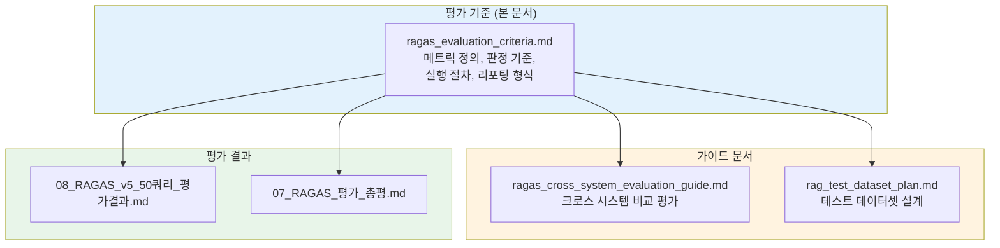
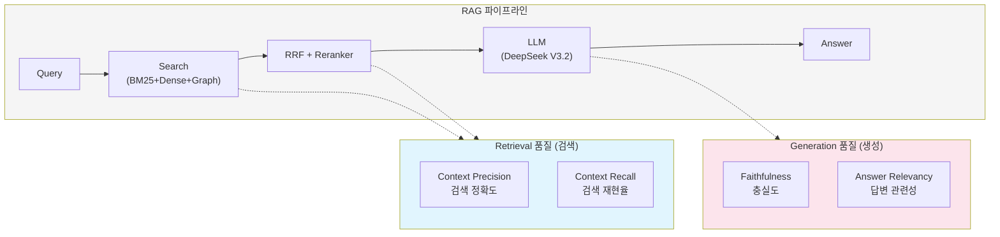
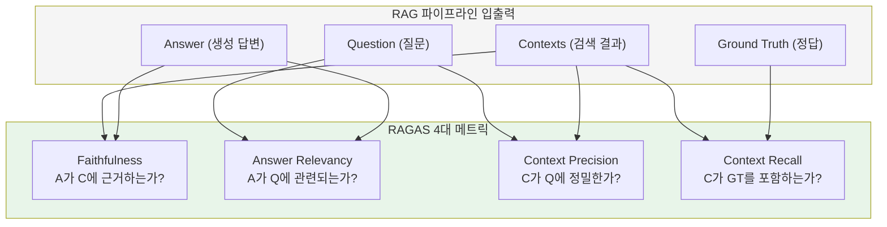
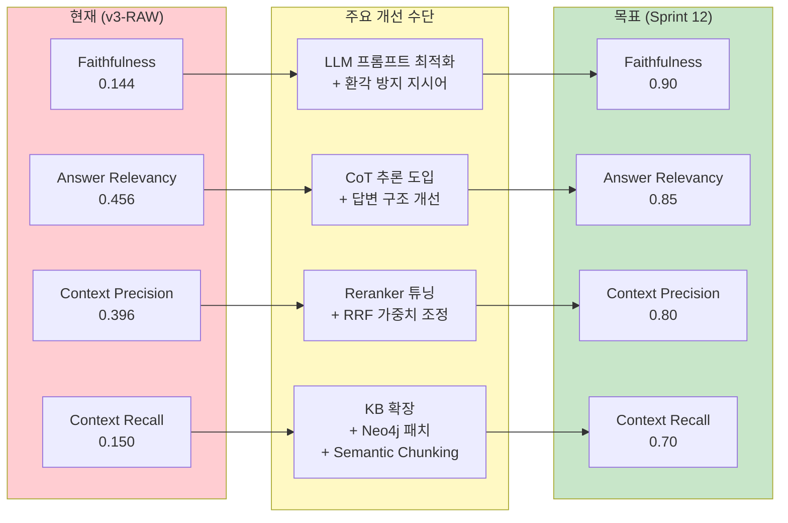
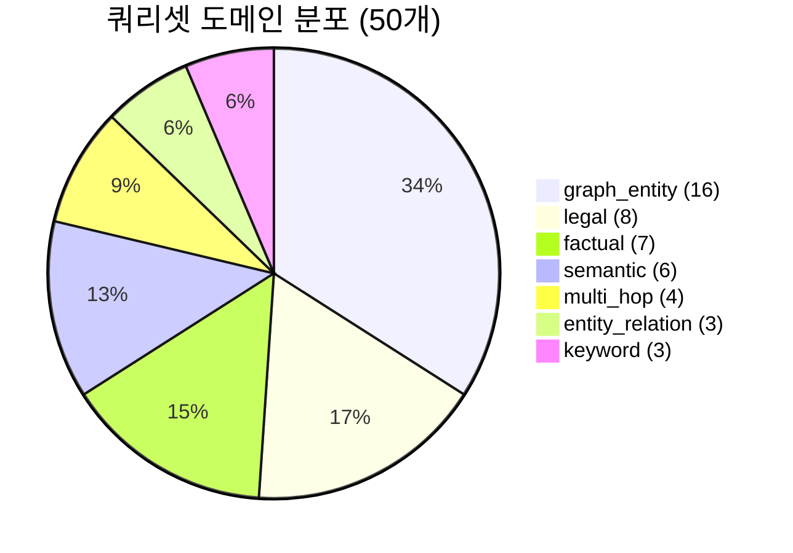
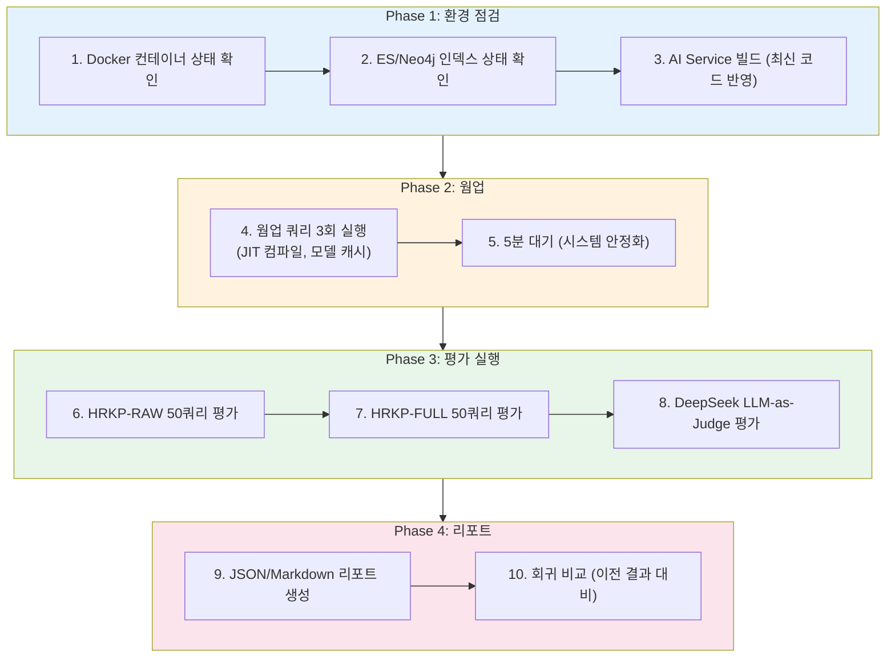

# RAGAS 평가 기준서

**Version**: 1.0 | **Updated**: 2026-02-11 | **Author**: MLRag
**Status**: Confirmed | **SCRUM-98**

---

## 1. 개요

### 1.1 목적

본 문서는 HRKP(Hybrid RAG Knowledge Platform)의 RAG 파이프라인 품질을 RAGAS 프레임워크로 측정하기 위한 **공식 평가 기준**을 정의한다. 모든 RAGAS 평가는 이 문서의 기준에 따라 실행되어야 하며, 결과 해석 및 리포팅도 본 문서의 형식을 따른다.

### 1.2 적용 범위

| 항목 | 내용 |
|------|------|
| **평가 대상** | HRKP AI Service RAG 파이프라인 (v3+) |
| **평가 도구** | RAGAS Framework + LLM-as-Judge (DeepSeek V3.2) |
| **평가 메트릭** | Faithfulness, Answer Relevancy, Context Precision, Context Recall |
| **테스트 쿼리셋** | 50개 (7개 도메인) |
| **실행 환경** | Docker 컨테이너 (kp-ai-service), TEST_MODE=docker |

### 1.3 문서 관계



---

## 2. RAGAS 메트릭 정의

### 2.1 4대 메트릭 개요

RAGAS(Retrieval-Augmented Generation Assessment)는 RAG 파이프라인의 품질을 **검색(Retrieval)**과 **생성(Generation)** 두 축으로 측정한다.



### 2.2 Faithfulness (충실도)

| 항목 | 내용 |
|------|------|
| **정의** | LLM이 생성한 답변이 검색된 컨텍스트에 **근거하는 비율**. 컨텍스트에 없는 정보를 생성(환각)하면 점수가 하락한다. |
| **측정 공식** | `Faithfulness = (컨텍스트에서 지지되는 클레임 수) / (전체 클레임 수)` |
| **점수 범위** | 0.0 ~ 1.0 (1.0 = 완벽한 충실도) |
| **필요 데이터** | question, answer, contexts |
| **영향 요인** | LLM 능력, 프롬프트 설계, 컨텍스트 활용 지시어 |
| **해석** | 높을수록 환각이 적고, 검색 결과에 충실한 답변 |

**측정 프로세스**:
1. LLM-as-Judge가 답변에서 개별 클레임(주장)을 추출
2. 각 클레임이 제공된 컨텍스트에서 지지되는지 판정
3. 지지되는 클레임 비율을 계산

### 2.3 Answer Relevancy (답변 관련성)

| 항목 | 내용 |
|------|------|
| **정의** | LLM이 생성한 답변이 사용자 **질문에 관련된 정도**. 질문과 무관한 내용이 포함되면 점수가 하락한다. |
| **측정 공식** | `Answer Relevancy = mean(cosine_similarity(question, generated_questions))` |
| **점수 범위** | 0.0 ~ 1.0 (1.0 = 완벽한 관련성) |
| **필요 데이터** | question, answer |
| **영향 요인** | LLM 능력, 프롬프트 설계, 답변 구조 |
| **해석** | 높을수록 질문 의도에 맞는 답변 |

**측정 프로세스**:
1. LLM-as-Judge가 답변을 기반으로 역방향 질문을 N개 생성
2. 원래 질문과 생성된 질문들 간 코사인 유사도 계산
3. 유사도 평균이 Answer Relevancy 점수

### 2.4 Context Precision (컨텍스트 정밀도)

| 항목 | 내용 |
|------|------|
| **정의** | 검색된 컨텍스트 중 **질문 답변에 실제로 관련 있는** 컨텍스트의 비율. 불필요한 컨텍스트가 많으면 점수가 하락한다. |
| **측정 공식** | `Context Precision = mean(precision@k for k in 1..K)` |
| **점수 범위** | 0.0 ~ 1.0 (1.0 = 모든 검색 결과가 관련) |
| **필요 데이터** | question, contexts |
| **영향 요인** | 파싱 품질(Docling), 청킹 전략, 임베딩 모델, 검색 알고리즘, Reranker |
| **해석** | 높을수록 노이즈 없는 정밀한 검색 |

**측정 프로세스**:
1. LLM-as-Judge가 각 컨텍스트의 질문 관련성을 판정
2. 순위별 precision을 계산 (상위 결과일수록 가중치 높음)
3. 평균 precision이 Context Precision 점수

### 2.5 Context Recall (컨텍스트 재현율)

| 항목 | 내용 |
|------|------|
| **정의** | 정답(ground truth)에 필요한 정보가 검색된 컨텍스트에 **얼마나 포함되어 있는지** 비율. 필요한 정보가 검색되지 않으면 점수가 하락한다. |
| **측정 공식** | `Context Recall = (ground truth에서 컨텍스트로 귀속되는 문장 수) / (ground truth 전체 문장 수)` |
| **점수 범위** | 0.0 ~ 1.0 (1.0 = 필요 정보 전부 검색) |
| **필요 데이터** | question, contexts, **ground_truth** (필수) |
| **영향 요인** | KB 커버리지, 파싱 품질, 청킹 전략, 임베딩 모델, 검색 채널 수 |
| **해석** | 높을수록 지식베이스의 검색 커버리지가 넓음 |

**측정 프로세스**:
1. LLM-as-Judge가 ground truth의 각 문장을 분석
2. 각 문장이 검색된 컨텍스트에서 지지되는지 판정
3. 지지되는 문장 비율이 Context Recall 점수

### 2.6 메트릭 간 관계



---

## 3. 현재 성능 및 목표

### 3.1 현재 Baseline (v5 50쿼리, 2026-02-10)

| 메트릭 | v3-RAW (현재) | 목표 (Sprint 12) | Gap | Gap 분석 |
|--------|:------------:|:----------------:|:---:|----------|
| **Faithfulness** | 0.144 | 0.90 | -0.756 | LLM 프롬프트 개선 + KB 확장 필요. DeepSeek V3.2의 컨텍스트 활용 지시어 강화 |
| **Answer Relevancy** | 0.456 | 0.85 | -0.394 | 질문-답변 정합성 향상 필요. CoT(Chain-of-Thought) 추론 도입 검토 |
| **Context Precision** | 0.396 | 0.80 | -0.404 | Reranker 정밀도 향상 + RRF 가중치 튜닝. 도메인 확대(12->50쿼리)로 하락한 부분 회복 필요 |
| **Context Recall** | 0.150 | 0.70 | -0.550 | KB 커버리지 확대 가장 시급. Neo4j chunk_id NULL 패치, 기술 문서 추가 인덱싱 |

### 3.2 이력별 추이

| 메트릭 | v2 (12쿼리) | v3-RAW (50쿼리) | v2->v3 변화 | 해석 |
|--------|:----------:|:---------------:|:----------:|------|
| Faithfulness | 0.083 | 0.144 | +72.9% | 프롬프트 개선 효과 |
| Answer Relevancy | 0.400 | 0.456 | +14.0% | 소폭 개선 |
| Context Precision | 0.508 | 0.396 | -22.1% | 도메인 다양화로 하락 |
| Context Recall | 0.083 | 0.150 | +80.1% | 50쿼리 확대로 일부 개선 |

### 3.3 Gap 분석 다이어그램



---

## 4. Grade 판정 기준 (Quality Gate)

### 4.1 3등급 체계

HRKP v3+는 검색 결과의 품질을 3단계로 판정하여 LLM에 전달하는 컨텍스트를 큐레이션한다.

| Grade | 기준 | 동작 | LLM 프롬프트 |
|:-----:|------|------|-------------|
| **HIGH** | `max_score >= 0.3` AND `sources >= 2` | 전체 컨텍스트 전달 + 출처 인용 지시 | "검색된 문서를 기반으로 출처를 명시하여 답변하세요" |
| **PARTIAL** | `max_score >= 0.1` OR `필터링된 소스 존재` | 관련 컨텍스트만 전달 + 적극 활용 지시 | "부분적 정보를 적극 활용하여 답변하세요" |
| **NONE** | `모든 소스 score < 0.03` | 빈 컨텍스트 전달 + 일반 지식 답변 허용 | "검색 결과가 없습니다. 일반 지식으로 답변하세요" |

### 4.2 Grade별 RAGAS 측정 특성

| Grade | RAGAS 측정 가능성 | 주의사항 |
|:-----:|:----------------:|---------|
| **HIGH** | 정상 측정 가능 | 4대 메트릭 모두 유효 |
| **PARTIAL** | 부분 측정 가능 | 컨텍스트 수 적어 precision/recall 편차 큼 |
| **NONE** | 측정 한계 존재 | 빈 컨텍스트 -> 4대 메트릭 모두 0점. 실제 답변 품질과 괴리 발생 |

### 4.3 RAGAS vs Quality Gate 철학 충돌

RAGAS는 "컨텍스트가 많을수록 좋다"를 전제하지만, Quality Gate는 "관련 없으면 제거"하는 전략이다. 이 충돌로 인해 Quality Gate가 올바르게 동작할수록 RAGAS 점수가 하락하는 역설이 발생한다.

| | RAGAS 전제 | Quality Gate 전략 |
|---|-----------|------------------|
| 컨텍스트 | 많을수록 좋다 | 관련 없으면 제거 |
| 빈 컨텍스트 | 0점 | 일반 지식으로 유용한 답변 |
| 저품질 컨텍스트 | "있으면" 점수 부여 | 필터링하여 환각 방지 |

**대응 전략**: Grade-aware 분리 평가

- HIGH/PARTIAL 쿼리: RAGAS 4대 메트릭으로 정량 평가
- NONE 쿼리: 일반 지식 정확도(Human Evaluation)로 정성 평가
- 전체: Grade 분포(HIGH/PARTIAL/NONE 비율)를 보조 지표로 활용

---

## 5. 테스트 쿼리셋 구성 기준

### 5.1 쿼리셋 개요

| 항목 | 기준 |
|------|------|
| **총 쿼리 수** | 50개 |
| **도메인 수** | 7개 |
| **설계 원칙** | 도메인 다양성 + Graph 트리거 + 난이도 분포 |
| **Ground Truth** | 도메인 전문가 작성, 완전한 문장 형태 |
| **버전 관리** | 변경 시 버전 태그, 이전 결과와 비교 불가 명시 |

### 5.2 도메인별 분포

| # | 도메인 | 쿼리 수 | 쿼리 범위 | 설명 |
|:-:|--------|:-------:|:---------:|------|
| 1 | entity_relation | 3 | Q1~Q3 | 기술 엔티티 간 관계 비교 (Neo4j vs ES, LangGraph vs LangChain 등) |
| 2 | multi_hop | 4 | Q4~Q6, Q37 | 다단계 추론 필요 (BGE-M3 역할, K8s 배포, Agentic AI 등) |
| 3 | keyword | 3 | Q7~Q9 | 키워드 기반 직접 검색 (Docker Compose, RRF, RAGAS 등) |
| 4 | semantic | 6 | Q10~Q12, Q47~Q50 | 의미 기반 검색 (문서 처리, 검색 최적화, 프롬프트 엔지니어링 등) |
| 5 | graph_entity | 16 | Q13~Q28, Q44 | Neo4j Graph 트리거 쿼리 (Technology/Topic 노드 기반) |
| 6 | legal | 8 | Q29~Q36 | 법률 도메인 (헌법, 민법, 형법, 상법, 소송법 등) |
| 7 | factual | 7 | Q38~Q43, Q45~Q46 | AI/LLM 심화 + 프로젝트 특화 (Reranking, Agentic Mesh 등) |

### 5.3 도메인 분포 근거



- **graph_entity 32%**: HRKP 고유 강점인 Neo4j Graph Search 효과를 집중 검증
- **legal 16%**: 구조화된 법률 문서 검색 성능 검증 (v5에서 최고 성능 도메인)
- **factual 14%**: AI/ML 도메인 지식 커버리지 확인
- **semantic 12%**: 의미 기반 검색의 정확도 검증
- **multi_hop 8%**: 복합 추론 능력 확인
- **entity_relation/keyword 6%**: 기본 검색 능력 확인

### 5.4 Graph 트리거 설계 원칙

Neo4j에 인덱싱된 엔티티를 기반으로 Graph Search가 자동 활성화되는 쿼리를 설계한다.

| 엔티티 유형 | 노드 수 | 쿼리 포함 예시 |
|------------|:-------:|--------------|
| **Technology** | 26 | Spring Cloud Gateway, Redis, DeepSeek, Vault, GitHub Actions, React 18, Python 3.11 |
| **Topic** | 24 | Strangler Fig, Gleaning, Vector Search, SSOT, Hybrid Search, Dual-Write |

### 5.5 쿼리셋 변경 관리

| 규칙 | 내용 |
|------|------|
| **버전 태그** | 쿼리셋 변경 시 v5, v6... 버전 부여 |
| **비교 제한** | 쿼리셋 버전이 다르면 결과 직접 비교 불가 |
| **변경 기록** | 추가/삭제/수정된 쿼리 목록과 사유 기록 |
| **최소 유지** | 50개 이상 유지 (통계적 유의미성) |

---

## 6. 평가 실행 절차

### 6.1 사전 준비

```
평가 실행 전 체크리스트
━━━━━━━━━━━━━━━━━━━━━━

인프라 확인:
[ ] Elasticsearch green status (curl kp-elasticsearch:9200/_cluster/health)
[ ] Neo4j 정상 기동 (bolt://kp-neo4j:7687)
[ ] AI Service 정상 기동 (docker ps | grep kp-ai-service)
[ ] WSL 가용 메모리 >= 3GB (free -h)

데이터 확인:
[ ] knowledge_chunks 인덱스 문서 수 확인 (13,430+)
[ ] 테스트 쿼리셋 50개 준비 완료
[ ] ground_truth 검증 완료

환경 확인:
[ ] TEST_MODE=docker 설정
[ ] DeepSeek API 키 유효
[ ] 임베딩 배치 프로세스 중지 (리소스 경합 방지)
[ ] JWT 토큰 갱신 로직 확인 (20쿼리마다 재로그인)
```

### 6.2 실행 순서



### 6.3 실행 명령

```bash
# 1. AI Service 컨테이너 최신 빌드
docker-compose build ai-service
docker-compose up -d ai-service

# 2. 컨테이너 상태 확인
docker exec kp-ai-service curl -s http://localhost:8000/health

# 3. 평가 스크립트 실행
docker exec kp-ai-service python3 /app/rcsv_comparison_eval_v3.py

# 4. 결과 확인
ls -la knowledge_service/docs/results/ragas/
```

### 6.4 실행 시 주의사항

| 규칙 | 이유 |
|------|------|
| 임베딩 배치 프로세스 중지 후 평가 실행 | CPU/메모리 경합으로 레이턴시 측정 왜곡 |
| 순차 평가 (HRKP-RAW -> HRKP-FULL -> RCSV) | ES 부하 간섭, 메모리 경합 방지 |
| 평가 간 5분 cooldown | ES 캐시 초기화, 시스템 안정화 |
| 웜업 쿼리 3회 실행 후 본 평가 | JIT 컴파일, 모델 캐시 로드 |
| JWT 토큰 20쿼리마다 갱신 | 30분 만료로 Q43+ ERR 방지 |

---

## 7. 결과 해석 기준

### 7.1 점수 등급 기준

| 등급 | 범위 | 판정 | 조치 |
|:----:|:----:|:----:|------|
| **Excellent** | >= 0.80 | 목표 달성 | 유지 및 모니터링 |
| **Good** | 0.60 ~ 0.79 | 양호 | 점진적 개선 |
| **Fair** | 0.40 ~ 0.59 | 보통 | 개선 계획 수립 필요 |
| **Poor** | 0.20 ~ 0.39 | 미흡 | 즉시 개선 필요 |
| **Critical** | < 0.20 | 심각 | 아키텍처 수준 재검토 |

### 7.2 점수 차이 해석 기준

평가 간 또는 시스템 간 점수 차이를 해석할 때:

| 차이 범위 | 해석 | 조치 |
|:---------:|------|------|
| < 0.05 | 통계적으로 무의미 | 동등 판정, 추가 분석 불필요 |
| 0.05 ~ 0.10 | 의미 있는 차이 | 근본 원인 분석 권장 |
| 0.10 ~ 0.20 | 명확한 우열 | 열위 시스템 개선 계획 수립 |
| > 0.20 | 결정적 차이 | 아키텍처 수준 개선 필요 |

### 7.3 회귀 판정 기준

파이프라인 변경 후 평가 결과가 이전 대비 하락하면 회귀(regression)로 판정한다.

| 회귀 수준 | 기준 | 조치 |
|:---------:|------|------|
| **경미** | 단일 메트릭 5% 이내 하락 | 모니터링, 다음 평가에서 재확인 |
| **유의** | 단일 메트릭 5~10% 하락 | 원인 분석 후 1 Sprint 내 복구 |
| **심각** | 단일 메트릭 10% 초과 하락 또는 2개+ 메트릭 동시 하락 | 변경 롤백 검토, 즉시 원인 분석 |

### 7.4 근본 원인 추적 매트릭스

점수가 낮은 메트릭에 대해 아래 표를 참고하여 원인을 역추적한다.

| 낮은 메트릭 | 1차 원인 후보 | 2차 원인 후보 | 검증 방법 |
|------------|-------------|-------------|----------|
| Faithfulness 낮음 | LLM 프롬프트 | LLM 모델 능력 | 프롬프트 변경 A/B 테스트 |
| Answer Relevancy 낮음 | LLM 프롬프트 | 컨텍스트 품질 | 동일 컨텍스트로 프롬프트만 변경 |
| Context Precision 낮음 | Reranker 설정 | 검색 알고리즘(RRF 가중치) | Reranker ON/OFF A/B 테스트 |
| Context Recall 낮음 | KB 커버리지 부족 | 청킹 전략/임베딩 모델 | KB 문서 추가 후 재평가 |

---

## 8. 리포팅 형식

### 8.1 평가 결과 리포트 템플릿

모든 RAGAS 평가 결과는 아래 형식으로 작성한다.

```markdown
# RAGAS 평가 결과 리포트

**평가 일시**: YYYY-MM-DD HH:MM KST
**평가 버전**: vN (쿼리셋 버전)
**쿼리 수**: N개 (M개 도메인)
**실행 환경**: Docker 컨테이너 (kp-ai-service)
**평가 방법**: LLM-as-Judge (DeepSeek V3.2)

## 1. 메트릭 요약

| 메트릭 | 점수 | 목표 | Gap | 등급 | 이전 대비 |
|--------|:----:|:----:|:---:|:----:|:---------:|
| Faithfulness | 0.xxx | 0.90 | -0.xxx | Fair/Poor/... | +x.x% / -x.x% |
| Answer Relevancy | 0.xxx | 0.85 | -0.xxx | ... | ... |
| Context Precision | 0.xxx | 0.80 | -0.xxx | ... | ... |
| Context Recall | 0.xxx | 0.70 | -0.xxx | ... | ... |

## 2. Quality Gate 분포

| Grade | 건수 | 비율 |
|:-----:|:----:|:----:|
| HIGH | N | xx% |
| PARTIAL | N | xx% |
| NONE | N | xx% |

## 3. 도메인별 분석

(도메인별 HIGH 비율, 평균 점수)

## 4. 회귀 분석

(이전 평가 대비 변화율, 회귀 여부)

## 5. 개선 방향

(낮은 메트릭 원인 분석 + 개선 계획)
```

### 8.2 결과 파일 위치 및 명명 규칙

| 파일 유형 | 경로 | 명명 규칙 |
|----------|------|----------|
| JSON 원본 | `docs/results/ragas/` | `hrkp_eval_YYYY-MM-DD_vN.json` |
| Markdown 리포트 | `docs/results/ragas/` | `hrkp_eval_report_YYYY-MM-DD_vN.md` |
| 비교 리포트 | `docs/results/ragas/` | `comparison_YYYY-MM-DD_vN.md` |
| 총평 | `docs/04_testing/ragas/results/` | `07_RAGAS_평가_총평.md` (누적 업데이트) |

### 8.3 필수 기록 항목

모든 평가에서 반드시 기록해야 하는 항목:

| 항목 | 설명 | 예시 |
|------|------|------|
| 평가 일시 | KST 기준 시작~종료 | 2026-02-10 15:06~16:30 |
| 쿼리셋 버전 | 쿼리 수 + 도메인 수 | v5, 50쿼리, 7도메인 |
| 파이프라인 버전 | v2/v3/v4... | v3-RAW (Reranker + QG) |
| 지식베이스 규모 | 인덱스 문서 수 | 13,430 청크 |
| LLM-as-Judge | 평가에 사용된 LLM | DeepSeek V3.2 |
| 실행 환경 | Docker/로컬, 리소스 | kp-ai-service, 8GB RAM |
| 소요 시간 | 전체 평가 시간 | 84분 |
| 알려진 이슈 | JWT 만료, 에러 등 | Q43~Q50 JWT 만료(8건) |

---

## 9. 반복 평가 및 거버넌스

### 9.1 평가 실행 트리거

| 트리거 | 필수 여부 | 설명 |
|--------|:--------:|------|
| 파이프라인 아키텍처 변경 | 필수 | Reranker 추가/변경, Quality Gate 변경, 검색 채널 변경 |
| LLM 모델 교체 | 필수 | DeepSeek -> 다른 모델 전환 시 |
| 프롬프트 변경 | 필수 | System Prompt, Few-shot 변경 시 |
| 임베딩 모델 변경 | 필수 | BGE-M3 -> 다른 모델 전환 시 |
| KB 대규모 확장 | 권장 | 문서 1,000건 이상 추가 시 |
| Sprint 종료 시점 | 권장 | 정기 품질 모니터링 |
| 청킹 전략 변경 | 필수 | 청크 크기, 오버랩, 분할 방식 변경 시 |

### 9.2 결과 보존 정책

| 항목 | 기준 |
|------|------|
| **보존 기간** | 영구 (모든 평가 결과 아카이브) |
| **보존 위치** | `docs/results/ragas/` 하위 |
| **필수 보존** | JSON 원본 + Markdown 리포트 |
| **버전 관리** | Git 커밋으로 이력 관리 |

### 9.3 평가 품질 보증

| 항목 | 기준 |
|------|------|
| 최소 쿼리 수 | 50개 이상 (통계적 유의미성) |
| 도메인 다양성 | 5개 이상 도메인 포함 |
| Ground Truth 품질 | 완전한 문장 형태, 핵심 정보 70% 이상 포함 |
| 재현성 | 동일 조건에서 재실행 시 동일 결과 (LLM 변동 +-5% 이내) |
| 다회 평가 | 중요 판단 시 최소 3회 평가 평균 사용 |

---

## 10. 용어 정의

| 용어 | 정의 |
|------|------|
| **RAGAS** | Retrieval-Augmented Generation Assessment. RAG 시스템 품질 평가 프레임워크 |
| **LLM-as-Judge** | LLM을 평가자로 사용하여 메트릭을 측정하는 방식 |
| **Quality Gate** | 검색 결과 점수 기반 3등급(HIGH/PARTIAL/NONE) 품질 판정 체계 |
| **RRF** | Reciprocal Rank Fusion. 다채널 검색 결과를 통합하는 알고리즘 |
| **Ground Truth** | 질문에 대한 정답. Context Recall 측정에 필수 |
| **KB** | Knowledge Base. HRKP에 인덱싱된 전체 문서/청크 |
| **Cross-encoder** | 쿼리-문서 쌍을 함께 인코딩하여 관련성을 판단하는 Reranker 모델 |
| **v3-RAW** | Quality Gate 미적용 상태의 검색 결과로 평가 (왜곡 없는 baseline) |
| **v3-FULL** | Quality Gate + Reranker + 적응형 프롬프트 전체 적용 상태의 평가 |

---

## 11. 참고 문서

| 문서 | 경로 | 설명 |
|------|------|------|
| 크로스 시스템 평가 가이드 | `docs/04_testing/ragas_cross_system_evaluation_guide.md` | HRKP vs RCSV 비교 평가 방법 |
| v5 50쿼리 평가 결과 | `docs/04_testing/ragas/results/08_RAGAS_v5_50쿼리_평가결과.md` | 최신 평가 결과 상세 |
| RAGAS 평가 총평 | `docs/04_testing/ragas/results/07_RAGAS_평가_총평.md` | 7회 평가 이력 종합 분석 |
| 테스트 데이터셋 설계서 | `docs/04_testing/rag_test_dataset_plan.md` | 100개 쿼리셋 설계 계획 |
| RAGAS 공식 문서 | https://docs.ragas.io/ | RAGAS 프레임워크 공식 레퍼런스 |

---

*Created: 2026-02-11 | Author: MLRag | SCRUM-98*
