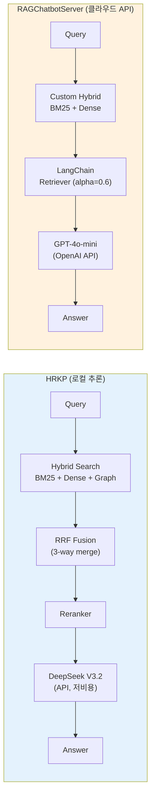
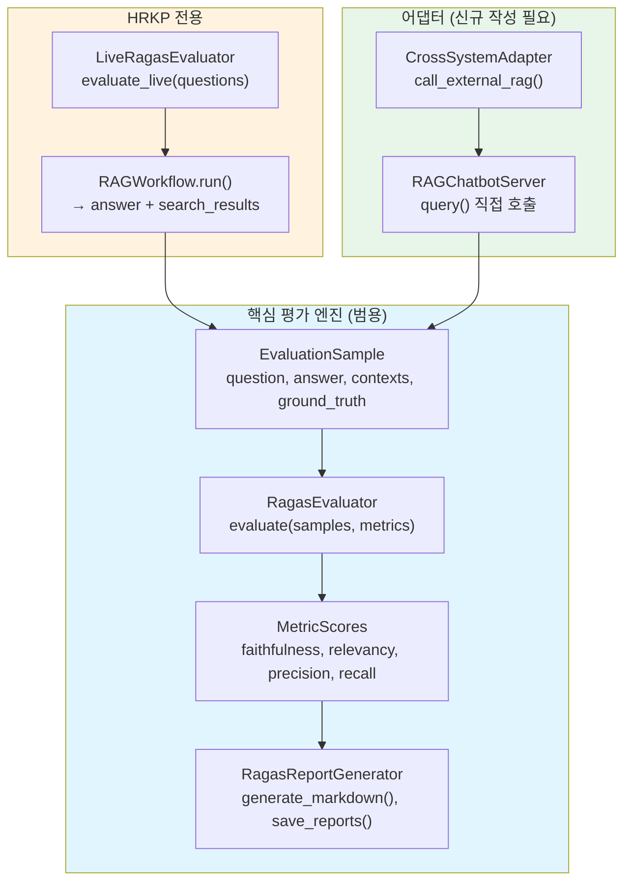
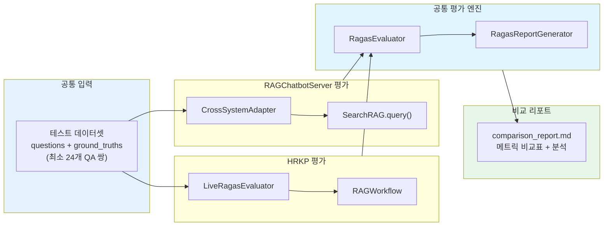
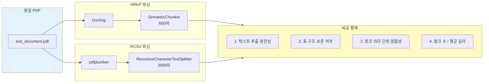
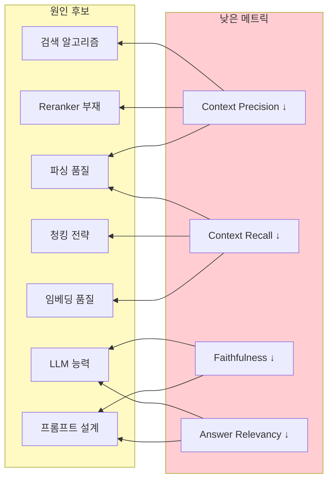

# RAGAS 크로스 시스템 평가 가이드

**HRKP vs RAGChatbotServer 성능 비교 평가 프레임워크**

**Version**: 1.2 | **Updated**: 2026-02-10 | **Author**: MLRag

---

## 1. 개요

### 1.1 목적

HRKP(Hybrid RAG Knowledge Platform)에 구현된 RAGAS 평가 프레임워크를 활용하여, 외부 RAG 시스템(RAGChatbotServer)과 **동일한 기준**으로 성능을 비교 측정한다.

### 1.2 대상 시스템

| 항목 | HRKP | RAGChatbotServer |
|------|------|------------------|
| **프레임워크** | FastAPI + LangGraph | FastAPI + LangChain |
| **LLM** | DeepSeek V3.2 (로컬) | OpenAI GPT-4o-mini (클라우드) |
| **임베딩** | BGE-M3 ONNX (로컬) | OpenAI text-embedding-3-small |
| **벡터 DB** | Elasticsearch 8.x | ES / OpenSearch / PGVector (선택) |
| **검색 방식** | Hybrid (BM25 + Dense + Graph) | Hybrid (BM25 + Dense) |
| **비용 모델** | 로컬 추론 (GPU/CPU) | API 과금 ($0.15/1M tokens) |

### 1.3 평가 메트릭 (RAGAS 4종)

| 메트릭 | 설명 | 목표 | 필요 데이터 |
|--------|------|------|------------|
| **Faithfulness** | 답변이 컨텍스트에 충실한지 (환각 방지) | >= 0.9 | question, answer, **contexts** |
| **Answer Relevancy** | 답변이 질문과 관련 있는지 | >= 0.85 | question, answer |
| **Context Precision** | 검색된 컨텍스트가 정확한지 | >= 0.8 | question, **contexts** |
| **Context Recall** | 필요한 정보가 검색되었는지 | >= 0.7 | question, **contexts**, ground_truth |

### 1.4 평가 환경 (확정)

| 항목 | HRKP | RAGChatbotServer |
|------|------|------------------|
| **벡터 DB** | Elasticsearch 8.x | **Elasticsearch 8.x** (동일) |
| **검색 모드** | Hybrid (BM25 + Dense + Graph) | custom-hybrid (BM25 + Dense) |
| **Docker 구성** | kp-elasticsearch (기존) | docker-compose-es.yml |

> **참고**: RAGChatbotServer는 ES/OpenSearch/PGVector 중 선택 가능하나, HRKP와 동일한 **Elasticsearch** 기반으로 평가하여 벡터 DB 변수를 제거한다.

---

## 1.5 예상 성능 비교표

### 1.5.1 시스템 아키텍처 비교



### 1.5.2 전체 파이프라인 상세 비교

#### A. 문서 파싱 (Document Parsing) - RAG 품질의 근본

| 항목 | HRKP (Docling) | RCSV (pdfplumber) | 예상 영향 |
|------|----------------|-------------------|----------|
| **파싱 엔진** | Docling (IBM, AI 기반) | pdfplumber / pypdf / unstructured | Docling이 구조 인식 정확도 우수 |
| **표(Table) 처리** | 구조 보존 (TableCell 모델, 행/열/헤더 분리) | 텍스트 평탄화 (구조 소실) | 표 데이터 질의 시 HRKP 정확도 높음 |
| **섹션 구조** | Section 계층 보존 → 청킹 경계로 활용 | 페이지 단위 평탄 텍스트 | HRKP 청크가 의미 단위로 깨끗 |
| **OCR 지원** | 내장 (스캔 문서 처리) | 미지원 (기본) | 스캔 PDF 처리 시 HRKP만 가능 |
| **이미지 처리** | 추출 + ImageRef 참조 보존 | 무시 (텍스트만) | 이미지 캡션 정보 HRKP만 보존 |
| **지원 형식** | PDF, DOCX, PPTX | PDF only | HRKP 다형식 지원 |

> **영향 체인**: `파싱 품질 → 청킹 품질 → 임베딩 품질 → 검색 품질 → 답변 품질`
>
> Docling의 구조 보존은 Context Precision(+0.05~0.10)과 Context Recall(+0.03~0.07)에 직접적 영향을 미치며, 이는 HRKP 검색 품질 우위의 근본 원인 중 하나이다.

#### B. 청킹 전략

| 항목 | HRKP | RCSV | 예상 영향 |
|------|------|------|----------|
| **청킹 방식** | SemanticChunker (문장/섹션 경계) | RecursiveCharacterTextSplitter (문자 수) | HRKP가 의미 단위 보존, RCSV는 문맥 중간 절단 가능 |
| **청크 크기** | 600자 (100 overlap) | 2000자 (300 overlap) | HRKP 세밀한 검색, RCSV 풍부한 맥락 |
| **특수 블록** | 테이블/코드 블록 보존 | 문자 수 기반 분할 (블록 절단 가능) | HRKP가 구조화 데이터 검색에 유리 |
| **한국어 지원** | 한국어 문장 종결어미 패턴 인식 | 범용 분리자 (언어 무관) | 한국어 문서에서 HRKP 유리 |

#### C. 검색 파이프라인

| 항목 | HRKP | RAGChatbotServer | 예상 영향 |
|------|------|------------------|----------|
| **검색 채널** | 3채널 (Dense + BM25 + Graph) | 2채널 (Dense + BM25) | HRKP의 Graph 검색이 multi-hop 질의에서 우위 |
| **결과 융합** | RRF (Reciprocal Rank Fusion) | LangChain alpha=0.6 가중합 | RRF가 이론적으로 더 robust한 fusion |
| **Reranker** | 있음 (검색 후 재정렬) | 없음 | HRKP의 Context Precision 우위 예상 |
| **임베딩 모델** | BGE-M3 (1024d, 다국어) | OpenAI text-embedding-3-small (1536d) | OpenAI 임베딩 품질 약간 우위 가능 |
| **임베딩 위치** | 로컬 ONNX (CPU) | OpenAI API (클라우드) | RCSV 임베딩 latency 낮음 (API 최적화) |
| **메타데이터** | 구조화 (PostgreSQL SSOT) | LLM 생성 (level1/2/3, summary) | RCSV의 LLM 메타데이터가 BM25에 유리 |
| **Knowledge Graph** | Neo4j (엔티티/관계) | 없음 | HRKP 고유 강점 (관계 추론) |

### 1.5.3 RAGAS 메트릭 예상 점수

> 아래 예상치는 시스템 아키텍처 분석, 코드 리뷰, 기존 벤치마크 자료를 기반으로 추론한 값입니다. **실측 후 업데이트 예정.**

| 메트릭 | HRKP 예상 | RCSV 예상 | 예상 우위 | 근거 |
|--------|:---------:|:---------:|:---------:|------|
| **Faithfulness** | 0.75~0.85 | **0.80~0.90** | RCSV | GPT-4o-mini의 instruction following이 DeepSeek 대비 우수, 환각 제어 강점 |
| **Answer Relevancy** | 0.70~0.80 | **0.75~0.85** | RCSV | GPT-4o-mini의 자연어 생성 품질이 높고, 질문-답변 정합성 우수 |
| **Context Precision** | **0.75~0.85** | 0.60~0.70 | HRKP | Docling 구조 보존 + SemanticChunker + RRF + Reranker 4중 효과 |
| **Context Recall** | **0.70~0.80** | 0.55~0.65 | HRKP | Docling 표/이미지 추출 + Graph 검색 + 3채널 커버리지 |
| **종합 평균** | **0.73~0.83** | **0.68~0.78** | HRKP | 파싱+검색 품질 우위가 생성 품질 열위를 보완 |

### 1.5.4 성능(Latency) 예상 비교

| 항목 | HRKP 예상 | RCSV 예상 | 근거 |
|------|:---------:|:---------:|------|
| **임베딩 (쿼리)** | 50~200ms (로컬 CPU) | 30~80ms (OpenAI API) | API 호출이 최적화된 서버에서 처리 |
| **ES 검색** | 50~150ms | 50~150ms | 동일 ES, 유사 검색 방식 |
| **Graph 검색** | 100~300ms | N/A | HRKP에만 있음 (추가 latency) |
| **RRF 융합** | 10~30ms | N/A | HRKP에만 있음 |
| **Reranker** | 100~500ms | N/A | HRKP에만 있음 |
| **LLM 생성** | 1~3s (DeepSeek API) | 0.5~2s (GPT-4o-mini) | GPT-4o-mini가 약간 빠름 |
| **E2E P50** | **1.5~3s** | **0.8~2s** | RCSV가 파이프라인 단순하여 빠름 |
| **E2E P95** | **3~5s** | **1.5~3s** | HRKP Graph+Reranker 추가 비용 |

### 1.5.5 비용 비교 (1,000 쿼리 기준)

| 항목 | HRKP | RCSV | 비고 |
|------|-----:|-----:|------|
| **LLM 추론** | $0.05 | $0.15 | DeepSeek $0.14/1M vs GPT-4o-mini $0.15/1M input |
| **임베딩** | $0.00 | $0.002 | 로컬 BGE-M3 vs OpenAI $0.02/1M tokens |
| **인프라 (Docker)** | $0.00* | $0.00* | 둘 다 로컬 Docker (*전기 제외) |
| **총 비용/1K 쿼리** | **~$0.05** | **~$0.15** | HRKP 약 3배 저렴 |

> *DeepSeek V3.2 비용: input $0.14/1M, output $0.28/1M (GPT-4o-mini 대비 95% 절감)*

### 1.5.6 강점/약점 예상 요약

| 시스템 | 강점 | 약점 |
|--------|------|------|
| **HRKP** | Docling 구조 파싱 + SemanticChunker + 3채널 Hybrid + Graph + RRF + Reranker로 검색 품질 우수, 비용 효율적 | 파이프라인 복잡도로 latency 높음, 로컬 임베딩 CPU 병목 |
| **RCSV** | GPT-4o-mini 생성 품질, 단순한 파이프라인으로 빠른 응답, OpenAI 임베딩 품질 | pdfplumber 구조 소실 + 문자 수 청킹으로 의미 절단, Graph/Reranker 없음, API 비용 |

### 1.5.7 메트릭별 예상 승패 매트릭스

```
                    HRKP 우위          RCSV 우위
                    ◄────────────────►
Faithfulness       ■■■■■■■■■■■■████████████  ← RCSV (LLM 품질)
Answer Relevancy   ■■■■■■■■■■■████████████  ← RCSV (LLM 품질)
Context Precision  █████████████████■■■■■■  ← HRKP (Docling+Reranker+RRF)
Context Recall     ████████████████■■■■■■■  ← HRKP (Docling+Graph+3채널)
─────────────────────────────────────────
Parsing Quality    ██████████████████■■■■■  ← HRKP (Docling vs pdfplumber)
Chunking Quality   ████████████████■■■■■■■  ← HRKP (Semantic vs Character)
E2E Latency        ■■■■■■■■■████████████   ← RCSV (단순 파이프라인)
Cost/Query         ██████████████████■■■■   ← HRKP (로컬 추론)

■ = 열위  █ = 우위
```

> **핵심 인사이트**: HRKP는 **파싱+검색(Parsing+Retrieval)** 품질에서, RCSV는 **생성(Generation)** 품질에서 각각 강점을 가질 것으로 예상. Docling에 의한 구조 보존 → SemanticChunker → 깨끗한 청크 → 정밀한 검색이라는 파이프라인 전체의 품질 체인이 HRKP의 검색 우위를 형성한다.

---

## 2. 호환성 분석

### 2.1 HRKP 평가 프레임워크 구조



### 2.2 컴포넌트별 범용성

| 컴포넌트 | 파일 | 범용성 | 외부 시스템 사용 |
|----------|------|--------|-----------------|
| `EvaluationSample` | `evaluation/models.py` | **범용** | 즉시 사용 가능 |
| `MetricScores` | `evaluation/models.py` | **범용** | 즉시 사용 가능 |
| `EvaluationResponse` | `evaluation/models.py` | **범용** | 즉시 사용 가능 |
| `RagasEvaluator` | `evaluation/ragas_evaluator.py` | **범용** | `List[EvaluationSample]`만 제공하면 됨 |
| `RagasReportGenerator` | `evaluation/report_generator.py` | **범용** | `project_name` 파라미터만 변경 |
| `LiveRagasEvaluator` | `evaluation/live_evaluator.py` | **HRKP 전용** | `RAGWorkflow` 하드 의존 → 사용 불가 |

### 2.3 핵심 블로커: RAGChatbotServer API의 contexts 미반환

**RAGChatbotServer `/ai/chat` API 응답:**

```json
{
  "response": "답변 텍스트",
  "processing_time": 2.345,
  "reference_chunk_count": 5,
  "search_mode": "custom-hybrid",
  "vector_store_type": "pgvector",
  "session_id": "abc-123"
}
```

**문제**: `reference_chunk_count`(숫자)만 반환하고, 실제 검색된 **컨텍스트 텍스트**를 반환하지 않음.

**메트릭별 영향:**

| 메트릭 | contexts 필요 | API로 가능 | 내부 호출로 가능 |
|--------|:------------:|:----------:|:---------------:|
| Answer Relevancy | X | **가능** | **가능** |
| Faithfulness | **O** | **불가** | **가능** |
| Context Precision | **O** | **불가** | **가능** |
| Context Recall | **O** | **불가** | **가능** |

### 2.4 RAGChatbotServer 내부 `query()` 메서드 분석

`rag_system.py`의 `SearchRAG.query()` 반환값:

```python
{
    "answer": str,              # LLM 생성 답변
    "sources": List[Document],  # Document 객체 리스트
    "search_mode": str,
    "processing_time": float,
    # ... 기타 필드
}

# Document 객체 구조
# sources[i].page_content → 검색된 원문 텍스트 (contexts로 사용 가능!)
# sources[i].metadata → {"source": "파일명", "page": 1, ...}
```

**결론**: API를 우회하고 `query()` 메서드를 직접 호출하면 `sources[i].page_content`에서 contexts를 추출하여 4/4 메트릭 모두 평가 가능.

---

## 3. 해결 방안

### 3.1 방안 비교

| 방안 | 구현 난이도 | 메트릭 커버리지 | 권장도 |
|------|:-----------:|:--------------:|:------:|
| **A: API 수정** | 중 | 4/4 | 낮음 (원본 코드 수정) |
| **B: 내부 호출 어댑터** | **낮** | **4/4** | **높음 (권장)** |
| **C: 제한 평가** | 최저 | 1/4 | 낮음 |

### 3.2 방안 B: CrossSystemAdapter (권장)

RAGChatbotServer의 `rag_system.py`를 직접 import하여 `query()`를 호출하는 어댑터를 작성한다.

```python
"""
크로스 시스템 RAG 평가 어댑터

RAGChatbotServer의 rag_system.py를 직접 호출하여
EvaluationSample을 생성합니다.
"""
import sys
import time
from typing import Any, Dict, List, Optional, Tuple

from app.evaluation.models import EvaluationResponse, EvaluationSample
from app.evaluation.ragas_evaluator import RagasEvaluator
from app.evaluation.report_generator import RagasReportGenerator


class CrossSystemAdapter:
    """외부 RAG 시스템을 HRKP RAGAS 프레임워크로 평가하는 어댑터"""

    def __init__(
        self,
        system_name: str,
        rag_module_path: str,
        targets: Optional[Dict[str, float]] = None,
    ):
        self.system_name = system_name
        self.rag_module_path = rag_module_path
        self.targets = targets or {
            "faithfulness": 0.9,
            "answer_relevancy": 0.85,
            "context_precision": 0.8,
            "context_recall": 0.7,
        }
        self._rag_system = None
        self._evaluator = RagasEvaluator(targets=self.targets)
        self._reporter = RagasReportGenerator(project_name=system_name)

    def _load_rag_system(self):
        """외부 RAG 시스템 동적 로드"""
        if self._rag_system is None:
            sys.path.insert(0, self.rag_module_path)
            from rag_system import SearchRAG
            self._rag_system = SearchRAG()
        return self._rag_system

    def query_external(
        self, question: str, chat_history: list = None
    ) -> Dict[str, Any]:
        """외부 RAG 시스템에 질의"""
        rag = self._load_rag_system()
        start = time.monotonic()
        result = rag.query(question, chat_history or [])
        elapsed_ms = (time.monotonic() - start) * 1000

        # contexts 추출: sources[i].page_content
        contexts = [
            doc.page_content
            for doc in result.get("sources", [])
            if hasattr(doc, "page_content")
        ]

        return {
            "question": question,
            "answer": result.get("answer", ""),
            "contexts": contexts,
            "latency_ms": elapsed_ms,
            "source_count": len(contexts),
            "search_mode": result.get("search_mode", "unknown"),
        }

    def build_samples(
        self,
        questions: List[str],
        ground_truths: Optional[List[str]] = None,
    ) -> Tuple[List[EvaluationSample], List[Dict]]:
        """질문 리스트로 EvaluationSample 생성"""
        samples = []
        raw_responses = []

        for idx, q in enumerate(questions):
            resp = self.query_external(q)
            raw_responses.append(resp)

            sample = EvaluationSample(
                question=q,
                answer=resp["answer"],
                contexts=resp["contexts"],
                ground_truth=ground_truths[idx] if ground_truths else None,
                metadata={
                    "system": self.system_name,
                    "latency_ms": resp["latency_ms"],
                    "source_count": resp["source_count"],
                },
            )
            samples.append(sample)

        return samples, raw_responses

    async def evaluate(
        self,
        questions: List[str],
        ground_truths: Optional[List[str]] = None,
        metrics: Optional[List[str]] = None,
    ) -> Tuple[EvaluationResponse, List[Dict]]:
        """전체 평가 수행"""
        metrics = metrics or [
            "faithfulness", "answer_relevancy",
            "context_precision", "context_recall",
        ]

        samples, raw = self.build_samples(questions, ground_truths)
        response = await self._evaluator.evaluate(samples, metrics)
        return response, raw

    def generate_report(
        self, response: EvaluationResponse, output_dir: str
    ) -> Dict[str, str]:
        """Markdown + JSON 리포트 생성"""
        return self._reporter.save_reports(response, output_dir)
```

### 3.3 방안 A: RAGChatbotServer API 수정 (대안)

`RAGChatbotServer/app.py`의 `/ai/chat` 엔드포인트에 contexts 반환 추가:

```python
# app.py 수정 위치: /ai/chat 엔드포인트의 응답 구성 부분
# 기존:
return JSONResponse(content={
    "response": answer,
    "reference_chunk_count": len(sources),
    ...
})

# 수정 (contexts 필드 추가):
return JSONResponse(content={
    "response": answer,
    "contexts": [doc.page_content for doc in sources],  # 추가
    "reference_chunk_count": len(sources),
    ...
})
```

---

## 4. 비교 평가 실행 계획

### 4.1 평가 아키텍처



### 4.2 테스트 데이터셋 구성

**기존 데이터셋 활용**: `src/tests/evaluation/test_dataset.json` (24개 QA 쌍)

단, 두 시스템에서 **동일한 지식 베이스**를 사용해야 공정한 비교가 가능:

| 전략 | 설명 | 공정성 |
|------|------|--------|
| **A: 동일 문서 적재** | 동일한 PDF를 양쪽 시스템에 적재 | 높음 |
| **B: 도메인 무관 QA** | 기술 상식 QA로 LLM 자체 능력 측정 | 중간 |
| **C: 각자 지식 베이스** | 각 시스템 고유 데이터로 평가 | 낮음 (비교 불가) |

**권장**: **전략 A** - 동일한 테스트 문서 세트를 양쪽에 적재 후 평가

### 4.3 실행 단계

```
Phase 1: 환경 준비
├── 1.1 RAGChatbotServer 기동 확인 (Docker Compose)
├── 1.2 테스트 문서 세트 선정 (5~10개 PDF)
├── 1.3 양쪽 시스템에 문서 적재
└── 1.4 CrossSystemAdapter 구현

Phase 2: 개별 평가
├── 2.1 HRKP Live 평가 (LiveRagasEvaluator)
├── 2.2 RAGChatbotServer 평가 (CrossSystemAdapter)
└── 2.3 개별 리포트 생성

Phase 3: 비교 분석
├── 3.1 메트릭별 비교표 생성
├── 3.2 Latency 비교 (P50/P95/P99)
├── 3.3 비용 분석 (로컬 vs API)
└── 3.4 종합 비교 리포트 작성
```

### 4.4 비교 리포트 형식

```markdown
# RAG 시스템 비교 평가 리포트

## 1. 평가 요약

| 메트릭 | HRKP | RAGChatbotServer | 차이 | 우위 |
|--------|------|------------------|------|------|
| Faithfulness | 0.xx | 0.xx | +0.xx | HRKP/RCSV |
| Answer Relevancy | 0.xx | 0.xx | +0.xx | - |
| Context Precision | 0.xx | 0.xx | +0.xx | - |
| Context Recall | 0.xx | 0.xx | +0.xx | - |
| **평균** | 0.xx | 0.xx | - | - |

## 2. 성능 비교

| 항목 | HRKP | RAGChatbotServer |
|------|------|------------------|
| P50 Latency | xx ms | xx ms |
| P95 Latency | xx ms | xx ms |
| 추정 비용/1000쿼리 | $0.xx | $0.xx |

## 3. 강점/약점 분석
(시스템별 강점, 약점, 개선 방향)

## 4. 결론 및 권장 사항
```

---

## 5. 알려진 제약사항

### 5.1 RAGChatbotServer 버그

| ID | 설명 | 영향 |
|----|------|------|
| C-1 | `PGVectorRAG.__init__` 이중 초기화 → NameError | PGVector 모드 사용 불가 |
| C-2 | Health check가 RAG 쿼리 실행 | 성능 측정 시 노이즈 |
| C-3 | 인증 미구현 | 보안 평가 불가 |

### 5.2 공정성 고려사항

| 요소 | 설명 | 대응 |
|------|------|------|
| **LLM 차이** | DeepSeek vs GPT-4o-mini (모델 능력 차이) | 동일 메트릭으로 객관 비교 |
| **임베딩 차이** | BGE-M3 vs OpenAI embedding | 검색 품질에 영향 |
| **인프라 차이** | 로컬 CPU vs 클라우드 API | Latency에 직접 영향 |
| **지식 베이스** | 적재 문서가 다를 수 있음 | 동일 문서 적재 필수 |

---

## 7. 평가 전 준비사항 (Pre-Evaluation Checklist)

> 스탠드업 미팅(2026-02-10) 전팀 논의 결과를 반영한 실전 준비 항목

### 7.1 인프라 환경 준비

#### ES 인스턴스 공유 방안 (인덱스 분리)

WSL2 메모리 한계(11GB)에서 HRKP + RCSV를 동시 운영하려면 ES 인스턴스를 공유하고 **인덱스만 분리**한다.

```
┌─────────────────────────────────────────┐
│         Elasticsearch 8.x (공유)         │
│                                         │
│  ┌──────────────────┐ ┌──────────────┐  │
│  │ knowledge_chunks │ │ rcsv_chunks  │  │
│  │ (HRKP 인덱스)    │ │ (RCSV 인덱스) │  │
│  │ dense_vector     │ │ embedding    │  │
│  │ 1024d BGE-M3     │ │ 1536d OpenAI │  │
│  └──────────────────┘ └──────────────┘  │
└─────────────────────────────────────────┘
```

| 방안 | 메모리 | 장점 | 단점 |
|------|:------:|------|------|
| ES 공유 (인덱스 분리) | +0GB | 메모리 절약, 동일 ES 버전 보장 | 부하 공유 시 성능 간섭 가능 |
| ES 별도 인스턴스 | +2GB | 완전 격리 | WSL 11GB 한계 초과 위험 |

**권장**: ES 공유 + 인덱스 분리. 단, **평가는 순차 실행**(HRKP 먼저, RCSV 다음)으로 ES 부하 간섭을 방지한다.

#### 리소스 사전 확인

```bash
# 평가 전 메모리 상태 확인
free -h
# HRKP 컨테이너 리소스 확인
docker stats --no-stream kp-ai-service kp-elasticsearch kp-neo4j kp-postgres
```

| 컴포넌트 | 예상 메모리 | 비고 |
|----------|:----------:|------|
| Elasticsearch | ~3GB | HRKP + RCSV 인덱스 공유 |
| Neo4j | ~1.5GB | HRKP 전용 |
| PostgreSQL | ~0.5GB | HRKP SSOT |
| AI Service | ~2GB | BGE-M3 모델 로드 |
| RCSV 앱 | ~0.5GB | Python 프로세스 |
| **합계** | **~7.5GB** | WSL 11GB 내 가능 |

#### Docker 네트워크 통일 (Latency 공정성)

```yaml
# RCSV를 HRKP 네트워크에 연결하여 동일 네트워크 조건 확보
# docker-compose-es.yml 수정 또는 docker run 시:
docker run --network=hybrid-rag-knowledge-ops_default \
  -e ELASTICSEARCH_URL=http://elasticsearch:9200 \
  ragchatbot-server
```

> **DevOps 의견**: HRKP와 RCSV 모두 Docker 내부 네트워크에서 실행해야 네트워크 지연 변수가 제거된다. 외부 API(OpenAI) 호출 latency는 별도 기록한다.

### 7.2 테스트 데이터 준비

#### 테스트 데이터셋 구성 원칙

| 원칙 | 설명 | 근거 |
|------|------|------|
| **동일 문서 적재** | 양쪽 시스템에 완전히 동일한 PDF 세트 적재 | QA: 테스트 공정성의 기본 |
| **최소 24개 QA** | 메트릭별 통계적 유의미성 확보 | RAGAS 권장 최소 샘플 |
| **다양한 문서 유형** | 법률/기술/일반 문서 혼합 | Data: 문서 유형별 파싱 차이 반영 |
| **표/구조 포함** | 최소 30%는 표/목록/계층 구조 포함 문서 | TechLead: Docling 파싱 우위 검증용 |

#### 테스트 문서 세트 선정 기준

```
테스트 문서 세트 (5~10개 PDF)
├── 법률 문서 (2~3개)     ← 복잡한 조항 구조, 긴 텍스트
├── 기술 문서 (2~3개)     ← 표, 코드 블록, 다이어그램
├── 일반 업무 문서 (1~2개) ← 보고서 형식, 목차/섹션
└── 혼합 문서 (1~2개)     ← 표+텍스트+이미지 혼합
```

#### ground_truth 품질 관리

| 항목 | 기준 | 비고 |
|------|------|------|
| 작성자 | 도메인 전문가 또는 문서 원작자 | 자동 생성 금지 |
| 형식 | 완전한 문장 형태 (키워드만 X) | Context Recall 측정 정확도 |
| 검증 | 최소 2인 교차 검증 | 편향 방지 |
| 커버리지 | 문서 내 핵심 정보 70% 이상 포함 | 누락 시 Recall 측정 왜곡 |

> **QA 의견**: ground_truth 품질이 낮으면 Context Recall 측정이 무의미해진다. 특히 표 데이터에 대한 ground_truth는 "테이블 X의 Y 컬럼 값은 Z" 형태로 구체적이어야 한다.

### 7.3 파싱 품질 사전 검증 (A/B 테스트)

#### 파싱 비교 체크리스트

RAGAS 평가 전에 **동일 문서에 대한 파싱 결과를 먼저 비교**하여 입력 품질 차이를 확인한다.



#### 비교 항목 상세

| # | 비교 항목 | 확인 방법 | 예상 결과 |
|---|----------|----------|----------|
| 1 | **텍스트 추출 완전성** | 원문 대비 추출률 (%) | HRKP >= RCSV (OCR 효과) |
| 2 | **표 구조 보존** | 표 데이터 질의 후 정답 포함 여부 | HRKP >> RCSV (TableCell 보존) |
| 3 | **청크 의미 단위** | 문장 중간 절단 비율 (%) | HRKP < RCSV (시맨틱 분할) |
| 4 | **청크 통계** | 청크 수, 평균 길이, 표준편차 | HRKP: 많고 균일 / RCSV: 적고 불균일 |
| 5 | **섹션 경계 준수** | 섹션 제목이 청크에 포함된 비율 | HRKP > RCSV |
| 6 | **특수 문자/서식** | 수식, 기호, 머리글/바닥글 처리 | Docling 우위 예상 |

> **TechLead 의견**: 이 A/B 파싱 비교를 먼저 수행하면 RAGAS 점수 차이의 **근본 원인을 추적**하기 쉽다. "Context Precision이 낮은 이유가 검색 알고리즘인지, 파싱 품질인지" 구분 가능.

### 7.4 평가 전 최종 체크리스트

```
평가 실행 전 확인 (모두 ✅ 시 시작)
━━━━━━━━━━━━━━━━━━━━━━━━━━━━━━━━━━━

인프라:
□ Elasticsearch 정상 기동 (green status)
□ HRKP 임베딩 배치 100% 완료
□ RCSV Docker 컨테이너 정상 기동
□ RCSV → ES 연결 확인 (인덱스 생성됨)
□ Docker 네트워크 동일 확인 (ping 테스트)
□ WSL 가용 메모리 >= 3GB

데이터:
□ 동일 PDF 세트 양쪽 적재 완료
□ 테스트 데이터셋 24개 QA 준비 완료
□ ground_truth 교차 검증 완료
□ 표/구조 포함 문서 30% 이상 확인

파싱 검증:
□ A/B 파싱 비교 완료 (최소 3개 문서)
□ 파싱 결과 차이 기록 완료

코드:
□ CrossSystemAdapter 단위 테스트 통과
□ RCSV query() → EvaluationSample 변환 검증
□ PGVectorRAG __init__ 버그 패치 확인 (ES 모드면 무관)

환경:
□ OpenAI API 키 유효 (RCSV용)
□ DeepSeek API 키 유효 (HRKP용)
□ 임베딩 배치 프로세스 중지 (리소스 경합 방지)
```

---

## 8. 평가 후 조치사항 (Post-Evaluation Actions)

### 8.1 결과 분석 프레임워크

#### Retrieval vs Generation 분리 분석

> **MLRag 의견**: "검색 잘하는 AI vs 답변 잘하는 AI" - 메트릭을 두 그룹으로 분리 분석한다.

```
┌─────────────────────────────────────────────────┐
│              RAGAS 메트릭 분류                     │
│                                                   │
│  ┌─────────────────────┐ ┌──────────────────────┐ │
│  │  Retrieval 품질      │ │  Generation 품질      │ │
│  │  (검색 파이프라인)    │ │  (LLM 답변 품질)      │ │
│  │                     │ │                      │ │
│  │  • Context Precision │ │  • Faithfulness      │ │
│  │  • Context Recall    │ │  • Answer Relevancy  │ │
│  │                     │ │                      │ │
│  │  영향 요인:          │ │  영향 요인:           │ │
│  │  - 파싱 품질(Docling) │ │  - LLM 능력          │ │
│  │  - 청킹 전략         │ │  - 프롬프트 설계      │ │
│  │  - 임베딩 모델       │ │  - 컨텍스트 활용도    │ │
│  │  - 검색 알고리즘     │ │                      │ │
│  │  - Reranker         │ │                      │ │
│  └─────────────────────┘ └──────────────────────┘ │
└─────────────────────────────────────────────────┘
```

| 분석 시나리오 | 의미 | 개선 방향 |
|--------------|------|----------|
| HRKP Retrieval ↑ + Generation ↓ | 검색은 잘하나 LLM 답변 품질 부족 | LLM 교체 또는 프롬프트 최적화 |
| HRKP Retrieval ↓ + Generation ↑ | LLM은 좋으나 검색이 부실 | 임베딩/검색 파이프라인 개선 |
| 양쪽 모두 Retrieval ↑ | 검색 파이프라인이 핵심 차별화 | 파싱+청킹+검색 파이프라인 투자 |
| 양쪽 모두 Generation ↑ | LLM이 핵심 차별화 | LLM 선택이 중요 (비용 vs 품질) |

#### 메트릭별 근본 원인 추적 (Root Cause Trace)

점수가 낮은 메트릭에 대해 아래 체인을 역추적한다:



### 8.2 시각화 및 보고

#### Radar Chart 비교 (평가 후 생성)

> **Frontend 의견**: 4개 RAGAS 메트릭을 Radar Chart로 시각화하면 시스템 특성이 한눈에 보인다.

```
비교 리포트에 포함할 시각화:

1. Radar Chart (4축)
   - Faithfulness / Answer Relevancy / Context Precision / Context Recall
   - HRKP(파란색) vs RCSV(주황색) 오버레이

2. Bar Chart (메트릭별 점수)
   - 나란히 비교 (side-by-side bar)
   - 목표선(target threshold) 표시

3. Latency Distribution (Box Plot)
   - P50 / P75 / P95 / P99 분포
   - 외부 API 호출 시간 분리 표기

4. Cost-Quality 산점도
   - X축: 비용/1000쿼리, Y축: 종합 RAGAS 점수
   - 효율성 프론티어 표시
```

#### 리포트 산출물 목록

| 산출물 | 형식 | 경로 | 내용 |
|--------|------|------|------|
| HRKP 평가 결과 | MD + JSON | `docs/results/ragas/hrkp_eval_YYYY-MM-DD.md` | 개별 메트릭 + 샘플별 점수 |
| RCSV 평가 결과 | MD + JSON | `docs/results/ragas/rcsv_eval_YYYY-MM-DD.md` | 개별 메트릭 + 샘플별 점수 |
| **비교 리포트** | MD | `docs/results/ragas/comparison_YYYY-MM-DD.md` | 메트릭 비교표 + 분석 + 시각화 |
| 파싱 A/B 비교 | MD | `docs/results/ragas/parsing_ab_test_YYYY-MM-DD.md` | 파싱 품질 차이 기록 |
| 원본 데이터 | JSON | `docs/results/ragas/raw/` | 전체 샘플별 raw 데이터 |

### 8.3 개선 방향 수립

평가 결과에 따라 아래 개선 매트릭스를 작성한다:

| 메트릭 결과 | HRKP 개선 방향 | RCSV 참고 사항 |
|------------|---------------|---------------|
| Faithfulness < 0.9 | 프롬프트 최적화 (환각 방지 지시어 강화) | GPT-4o-mini 프롬프트 패턴 벤치마크 |
| Answer Relevancy < 0.85 | 답변 생성 프롬프트 개선, CoT 적용 검토 | RCSV 프롬프트 구조 분석 |
| Context Precision < 0.8 | Reranker 모델 업그레이드, RRF 가중치 조정 | Reranker 도입 효과 시뮬레이션 |
| Context Recall < 0.7 | Graph 검색 커버리지 확대, 청크 오버랩 조정 | 청킹 크기 최적화 실험 |

#### 후속 실험 매트릭스

```
개선 실험 우선순위 (평가 후 결정)
━━━━━━━━━━━━━━━━━━━━━━━━━━━━━━━

[Retrieval 개선]
□ 청크 크기 최적화 (400/600/800/1000자 실험)
□ Reranker 모델 변경 (cross-encoder 성능 비교)
□ Graph 검색 가중치 조정 (RRF 파라미터 튜닝)
□ 임베딩 모델 비교 (BGE-M3 vs multilingual-e5-large)

[Generation 개선]
□ 프롬프트 엔지니어링 (CoT, Few-shot 적용)
□ LLM 교체 실험 (DeepSeek V3.2 vs Qwen2.5)
□ Temperature/Top-p 파라미터 튜닝
□ Context window 최적화 (전달 청크 수 조정)
```

### 8.4 반복 평가 및 회귀 테스트

| 항목 | 기준 |
|------|------|
| **반복 평가 주기** | 주요 파이프라인 변경 시 (검색 알고리즘, LLM 교체, 청킹 변경 등) |
| **회귀 테스트** | 모든 메트릭이 이전 평가 대비 5% 이상 하락하지 않을 것 |
| **데이터셋 버전 관리** | 테스트 데이터셋 변경 시 버전 태그 + 이전 결과와의 비교 불가 명시 |
| **결과 아카이브** | 모든 평가 결과를 `docs/results/ragas/` 하위에 날짜별 보관 |

---

## 9. 운영 가이드라인 및 기타 사항

### 9.1 평가 실행 시 주의사항

#### 리소스 경합 방지

| 규칙 | 이유 |
|------|------|
| 임베딩 배치 프로세스 중지 후 평가 실행 | CPU/메모리 경합으로 Latency 측정 왜곡 |
| HRKP → RCSV 순차 평가 (병렬 금지) | ES 부하 간섭, 메모리 경합 방지 |
| 평가 간 5분 cooldown | ES 캐시 초기화, 시스템 안정화 |
| 웜업 쿼리 3회 실행 후 본 평가 | JIT 컴파일, 모델 캐시 로드 |

#### Latency 측정 규칙

```
Latency 분해 기록 (필수)
━━━━━━━━━━━━━━━━━━━━━━━

1. E2E Latency (전체)
   ├── 2. 임베딩 시간 (쿼리 임베딩)
   ├── 3. ES 검색 시간
   ├── 4. Graph 검색 시간 (HRKP only)
   ├── 5. RRF/Reranker 시간 (HRKP only)
   └── 6. LLM 생성 시간

※ 외부 API 호출 시간(OpenAI)은 네트워크 상태 영향 → 별도 표기
※ P50/P95/P99 모두 기록 (평균만 사용 금지)
```

### 9.2 결과 해석 가이드

#### 점수 차이 해석 기준

| 차이 범위 | 해석 | 조치 |
|:---------:|------|------|
| **< 0.05** | 통계적으로 무의미 | 동등 판정, 추가 분석 불필요 |
| **0.05~0.10** | 의미 있는 차이 | 근본 원인 분석 권장 |
| **0.10~0.20** | 명확한 우열 | 열위 시스템 개선 계획 수립 |
| **> 0.20** | 결정적 차이 | 아키텍처 수준 개선 필요 |

#### 예상과 실측 비교

평가 완료 후 반드시 **1.5.3 예상 점수 vs 실측 점수**를 비교하여 예측 정확도를 검증한다:

```markdown
| 메트릭 | HRKP 예상 | HRKP 실측 | 오차 | RCSV 예상 | RCSV 실측 | 오차 |
|--------|:---------:|:---------:|:----:|:---------:|:---------:|:----:|
| Faithfulness | 0.75~0.85 | 0.xx | ±0.xx | 0.80~0.90 | 0.xx | ±0.xx |
| ... | ... | ... | ... | ... | ... | ... |
```

> 예측 오차가 ±0.15 이상인 메트릭은 **예측 근거를 재검토**하고, 발견된 인사이트를 본 문서에 업데이트한다.

### 9.3 공정성 보장 추가 조치

| 항목 | 조치 | 담당 |
|------|------|------|
| **문서 적재 순서** | 양쪽 동시 적재 또는 랜덤 순서 | Data |
| **평가 순서 교차** | Round 1: HRKP→RCSV, Round 2: RCSV→HRKP | QA |
| **질의 순서 셔플** | 매 평가 시 질문 순서 랜덤화 | 자동화 (코드) |
| **외부 API 안정성** | OpenAI API 장애 시 재시도 3회 + 지수 백오프 | CrossSystemAdapter |
| **시간대 통일** | 동일 시간대에 양쪽 평가 (API 응답 시간 변동 최소화) | DevOps |

### 9.4 청킹 전략 심층 비교 분석

> **Data 의견**: 청킹 전략의 차이가 검색 품질에 미치는 영향을 별도로 분석해야 한다.

#### 청크 크기와 검색 품질의 트레이드오프

```
정밀도 (Precision)          커버리지 (Recall)
    ↑                           ↑
    │  ●HRKP(600자)             │          ●RCSV(2000자)
    │   \                       │         /
    │    \                      │        /
    │     \                     │       /
    │      \                    │      /
    │       ●                   │     ●
    │        RCSV(2000자)       │      HRKP(600자)
    └──────────────→            └──────────────→
       청크 크기                    청크 크기
```

| 특성 | 작은 청크 (HRKP 600자) | 큰 청크 (RCSV 2000자) |
|------|:---------------------:|:--------------------:|
| **Context Precision** | 높음 (노이즈 적음) | 낮음 (불필요 정보 포함) |
| **Context Recall** | 중간 (정보 분산) | 높을 수 있음 (한 청크에 많은 정보) |
| **LLM 처리** | 핵심만 전달 → 정확한 답변 | 긴 컨텍스트 → 핵심 파악 어려울 수 있음 |
| **임베딩 품질** | 의미 집중 → 유사도 정확 | 여러 주제 혼합 → 유사도 분산 |

#### 추가 분석 권장 실험

평가 결과에 따라 선택적으로 수행:

1. **동일 시스템에서 청크 크기만 변경** (600 vs 2000) → 청킹 효과 분리 측정
2. **동일 청크 크기(1000자)로 양쪽 평가** → 검색 알고리즘 순수 비교
3. **RCSV에 SemanticChunker 적용** → 파싱은 pdfplumber, 청킹만 개선 시 효과

### 9.5 비용 효율성 분석 기준

비용 비교 시 아래 항목을 모두 포함한다:

| 비용 항목 | HRKP | RCSV | 측정 방법 |
|----------|------|------|----------|
| LLM 추론 비용 | DeepSeek API 과금 | OpenAI API 과금 | 실제 토큰 수 × 단가 |
| 임베딩 비용 | $0 (로컬) | OpenAI 임베딩 API | 실제 호출 수 × 단가 |
| 인프라 비용 | Docker CPU/메모리 | Docker CPU/메모리 | 동일 (상쇄) |
| **품질 대비 비용** | 종합점수/비용 | 종합점수/비용 | **핵심 지표** |

> **최종 판단 기준**: 단순 점수 비교가 아니라 **"동일 비용 대비 품질"** 또는 **"동일 품질 달성에 필요한 비용"**으로 판단한다.

### 9.6 FAQ

| 질문 | 답변 |
|------|------|
| RCSV에서 PGVector 모드로도 평가해야 하나? | 아니오. ES 기반으로 통일하여 벡터 DB 변수를 제거합니다. PGVector는 `__init__` 버그(C-1)가 있어 별도 패치 필요. |
| ground_truth 없이 평가 가능한가? | 3/4 메트릭은 가능합니다. Context Recall만 ground_truth 필요. |
| 평가에 얼마나 시간이 걸리나? | 24개 QA 기준 HRKP ~5분, RCSV ~3분 예상 (LLM 호출 포함). |
| OpenAI API 키가 없으면? | RCSV 임베딩에 필수입니다. RCSV 측 평가가 불가능합니다. |
| 평가 중 ES가 OOM 되면? | ES heap size를 1GB로 제한 (`ES_JAVA_OPTS=-Xms1g -Xmx1g`)하고, 순차 평가를 엄수합니다. |
| 메트릭 점수가 예상과 크게 다르면? | 9.2절의 예상 vs 실측 비교를 수행하고, 7.3절의 파싱 A/B 테스트 결과와 교차 분석합니다. |

---

## 6. 참고 자료

- [RAGAS 평가 파이프라인 가이드](../05_development/ragas_evaluation_guide.md)
- [EPIC-005: RAG Quality & Performance](../../backlog/epics/EPIC-005-rag-quality-performance.md)
- [STORY-105: RAGAS 평가 기준 문서 확정](../../backlog/stories/STORY-105-ragas-evaluation-criteria.md)
- [STORY-111: HRKP vs RAGChatbotServer 비교 평가](../../backlog/stories/STORY-111-cross-system-ragas-evaluation.md)
- [RAGChatbotServer 분석 (README.md)](../../../RAGChatbotServer/README.md)
- [RAGAS 공식 문서](https://docs.ragas.io/)

---

## 부록 A: HRKP 평가 프레임워크 소스 참조

### A.1 EvaluationSample 모델

```
파일: knowledge_service/src/app/evaluation/models.py:13-32
```

```python
class EvaluationSample(BaseModel):
    question: str      # 필수 - 사용자 질문
    answer: str        # 필수 - RAG 생성 답변
    contexts: List[str]  # 필수 - 검색된 컨텍스트 텍스트 리스트
    ground_truth: Optional[str] = None  # 선택 - Context Recall 측정 시 필요
    metadata: Dict[str, Any] = {}       # 선택 - 추가 메타데이터
```

### A.2 RagasEvaluator 인터페이스

```
파일: knowledge_service/src/app/evaluation/ragas_evaluator.py:44-67
```

```python
class RagasEvaluator:
    def __init__(
        self,
        llm_model: Optional[str] = None,      # 기본: DeepSeek Chat
        embedding_model: Optional[str] = None, # 기본: BGE-M3
        targets: Optional[Dict[str, float]] = None,
    ): ...

    async def evaluate(
        self,
        samples: List[EvaluationSample],  # 범용 입력
        metrics: List[str],               # ["faithfulness", "answer_relevancy", ...]
    ) -> EvaluationResponse: ...
```

### A.3 LiveRagasEvaluator (HRKP 전용)

```
파일: knowledge_service/src/app/evaluation/live_evaluator.py:25-153
```

- `RAGWorkflow.run()` → `rag_response.search_results[].content` 로 contexts 추출
- **외부 시스템에서는 사용 불가** (HRKP RAGWorkflow 하드 의존)

### A.4 기존 평가 결과 (HRKP, 2026-02-04)

```
파일: knowledge_service/docs/results/ragas/ragas_evaluation_2026-02-04_022522.md
```

| 메트릭 | 점수 | 목표 | 달성 |
|--------|------|------|------|
| Faithfulness | 0.4032 | 0.90 | FAIL |
| Answer Relevancy | 0.1895 | 0.85 | FAIL |
| Context Precision | 0.2778 | 0.80 | FAIL |
| Context Recall | N/A | 0.70 | N/A |

> **참고**: 위 점수는 Mock 모드(word overlap 기반)로 실행된 초기 결과입니다. 실제 LLM 기반 평가 시 점수가 달라질 수 있습니다.

---

*Generated by MLRag - 2026-02-10*
