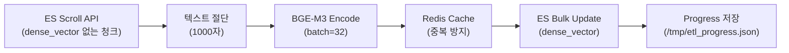

# 임베딩 백필 계획서

**Version**: 1.0
**Date**: 2026-02-12
**Author**: 클로드 (ETL Engineer)
**Status**: 진행중

---

## 1. 개요

### 1.1 배경

ETL 파이프라인을 3-Phase로 분리하여 실행:
- **Phase 1**: 텍스트 파일 파싱/청킹/저장 (임베딩 OFF)
- **Phase 2**: 바이너리 파일 파싱/청킹/저장 (임베딩 OFF)
- **Phase 3**: 임베딩 백필 (ES dense_vector 후처리)

### 1.2 분리 이유

| 항목 | 통합 ETL (임베딩 ON) | 3-Phase 분리 |
|------|---------------------|-------------|
| ETA | ~66시간 | Phase 1: 14분 + Phase 2: 4~5시간 + Phase 3: 30~48시간 |
| 장점 | 1회 실행 | 파싱/저장 빠르게 완료, 검색 즉시 가능 (키워드) |
| 단점 | CPU 병목으로 느림 | 의미 검색은 Phase 3 완료 후 |
| 재시작 안전성 | file_hash dedup | file_hash + ES exists 쿼리 |

---

## 2. 임베딩 모델 정보

| 항목 | 값 |
|------|-----|
| 모델 | BAAI/bge-m3 |
| 차원 | 1024 |
| 프레임워크 | sentence-transformers |
| 디바이스 | CPU (CUDA_VISIBLE_DEVICES="") |
| 정규화 | L2 Normalize (cosine similarity) |
| FP16 | True (CPU에서는 FP32로 fallback) |

---

## 3. Phase 3 임베딩 백필 설정

### 3.1 스크립트

`knowledge_service/scripts/run_embedding_backfill.py`

### 3.2 주요 파라미터

| 파라미터 | 값 | 근거 |
|---------|-----|------|
| `EMBED_BATCH` | 32 | EmbeddingService 기본값, CPU에서 안정적 |
| `ES_SCROLL_SIZE` | 200 | ES scroll 한 번에 가져올 문서 수 |
| `MAX_TEXT_LEN` | 1000 | CPU OOM 방지 (1500은 7.3GB+OOM 유발) |

### 3.3 처리 흐름



### 3.4 Redis 캐시

| 항목 | 값 |
|------|-----|
| 키 | `embed:bge-m3:{text_hash}` |
| TTL | 604,800초 (7일) |
| 용도 | 동일 텍스트 재계산 방지 |

---

## 4. 성능 측정 기준

### 4.1 속도 (texts/s)

| 시나리오 | 예상 속도 | 비고 |
|---------|----------|------|
| Phase 2 병행 | 0.4~0.6 t/s | CPU 경합 |
| 단독 실행 | 0.7~1.0 t/s | Phase 2 완료 후 |
| 캐시 적중 높음 | 1.0~1.3 t/s | Redis 히트율 증가 시 |

### 4.2 리소스

| 항목 | Phase 2 병행 | 단독 |
|------|------------|------|
| CPU | 330~380% | 100~150% |
| Memory | 5.5~6.9 GiB | 2.5~3.5 GiB |

---

## 5. 모니터링

### 5.1 진행률 파일

`/tmp/etl_progress.json`:
```json
{
  "phase": "phase3-embedding",
  "status": "running",
  "total_chunks": 101046,
  "embedded": 1600,
  "rate_texts_per_sec": 0.7,
  "eta_minutes": 2940
}
```

### 5.2 Slack 모니터링

15분 간격으로 `#proj-hrkp-dev` 채널에 자동 보고:
- Phase 2 + Phase 3 통합 현황
- ES 임베딩 카운트 / 증분 / ETA
- CPU/MEM 리소스

### 5.3 로그 파일

| 로그 | 위치 |
|------|------|
| Phase 2 ETL | `/tmp/etl_output.log` |
| Phase 3 임베딩 | `/tmp/embedding_output.log` |
| 진행률 JSON | `/tmp/etl_progress.json` |

---

## 6. 완료 후 검증 계획

### 6.1 임베딩 커버리지 확인

```bash
# 전체 청크 수
curl -s "http://localhost:9200/knowledge_chunks/_count"

# 임베딩 있는 청크 수
curl -s "http://localhost:9200/knowledge_chunks/_count" \
  -H 'Content-Type: application/json' \
  -d '{"query":{"exists":{"field":"dense_vector"}}}'

# 임베딩 없는 청크 수 (0이어야 함)
curl -s "http://localhost:9200/knowledge_chunks/_count" \
  -H 'Content-Type: application/json' \
  -d '{"query":{"bool":{"must_not":[{"exists":{"field":"dense_vector"}}]}}}'
```

### 6.2 벡터 품질 스팟 체크

```python
# 유사도 검색 테스트
GET knowledge_chunks/_search
{
  "knn": {
    "field": "dense_vector",
    "query_vector": [...],  # 테스트 쿼리 벡터
    "k": 5,
    "num_candidates": 50
  }
}
```

### 6.3 RAGAS 재평가

임베딩 완료 후 RAGAS v7 평가 실행:
- 기존 v6 대비 context_precision, context_recall 비교
- 106K+ 청크 의미 검색의 효과 측정
