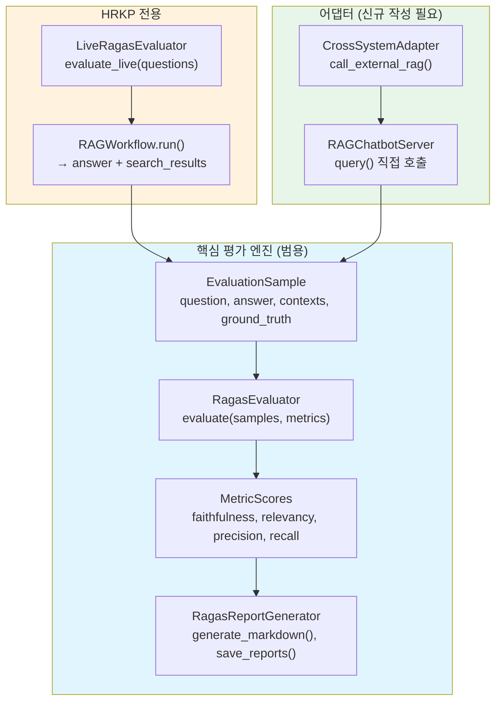
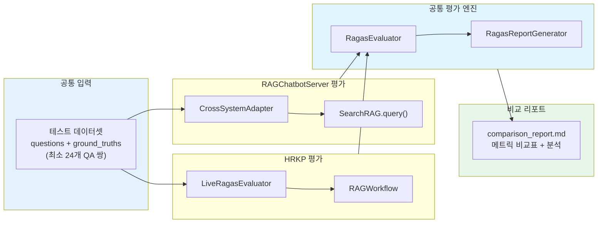

# RAGAS 크로스 시스템 평가 가이드

**HRKP vs RAGChatbotServer 성능 비교 평가 프레임워크**

**Version**: 1.0 | **Updated**: 2026-02-10 | **Author**: MLRag

---

## 1. 개요

### 1.1 목적

HRKP(Hybrid RAG Knowledge Platform)에 구현된 RAGAS 평가 프레임워크를 활용하여, 외부 RAG 시스템(RAGChatbotServer)과 **동일한 기준**으로 성능을 비교 측정한다.

### 1.2 대상 시스템

| 항목 | HRKP | RAGChatbotServer |
|------|------|------------------|
| **프레임워크** | FastAPI + LangGraph | FastAPI + LangChain |
| **LLM** | DeepSeek V3.2 (로컬) | OpenAI GPT-4o-mini (클라우드) |
| **임베딩** | BGE-M3 ONNX (로컬) | OpenAI text-embedding-3-small |
| **벡터 DB** | Elasticsearch 8.x | ES / OpenSearch / PGVector (선택) |
| **검색 방식** | Hybrid (BM25 + Dense + Graph) | Hybrid (BM25 + Dense) |
| **비용 모델** | 로컬 추론 (GPU/CPU) | API 과금 ($0.15/1M tokens) |

### 1.3 평가 메트릭 (RAGAS 4종)

| 메트릭 | 설명 | 목표 | 필요 데이터 |
|--------|------|------|------------|
| **Faithfulness** | 답변이 컨텍스트에 충실한지 (환각 방지) | >= 0.9 | question, answer, **contexts** |
| **Answer Relevancy** | 답변이 질문과 관련 있는지 | >= 0.85 | question, answer |
| **Context Precision** | 검색된 컨텍스트가 정확한지 | >= 0.8 | question, **contexts** |
| **Context Recall** | 필요한 정보가 검색되었는지 | >= 0.7 | question, **contexts**, ground_truth |

---

## 2. 호환성 분석

### 2.1 HRKP 평가 프레임워크 구조



### 2.2 컴포넌트별 범용성

| 컴포넌트 | 파일 | 범용성 | 외부 시스템 사용 |
|----------|------|--------|-----------------|
| `EvaluationSample` | `evaluation/models.py` | **범용** | 즉시 사용 가능 |
| `MetricScores` | `evaluation/models.py` | **범용** | 즉시 사용 가능 |
| `EvaluationResponse` | `evaluation/models.py` | **범용** | 즉시 사용 가능 |
| `RagasEvaluator` | `evaluation/ragas_evaluator.py` | **범용** | `List[EvaluationSample]`만 제공하면 됨 |
| `RagasReportGenerator` | `evaluation/report_generator.py` | **범용** | `project_name` 파라미터만 변경 |
| `LiveRagasEvaluator` | `evaluation/live_evaluator.py` | **HRKP 전용** | `RAGWorkflow` 하드 의존 → 사용 불가 |

### 2.3 핵심 블로커: RAGChatbotServer API의 contexts 미반환

**RAGChatbotServer `/ai/chat` API 응답:**

```json
{
  "response": "답변 텍스트",
  "processing_time": 2.345,
  "reference_chunk_count": 5,
  "search_mode": "custom-hybrid",
  "vector_store_type": "pgvector",
  "session_id": "abc-123"
}
```

**문제**: `reference_chunk_count`(숫자)만 반환하고, 실제 검색된 **컨텍스트 텍스트**를 반환하지 않음.

**메트릭별 영향:**

| 메트릭 | contexts 필요 | API로 가능 | 내부 호출로 가능 |
|--------|:------------:|:----------:|:---------------:|
| Answer Relevancy | X | **가능** | **가능** |
| Faithfulness | **O** | **불가** | **가능** |
| Context Precision | **O** | **불가** | **가능** |
| Context Recall | **O** | **불가** | **가능** |

### 2.4 RAGChatbotServer 내부 `query()` 메서드 분석

`rag_system.py`의 `SearchRAG.query()` 반환값:

```python
{
    "answer": str,              # LLM 생성 답변
    "sources": List[Document],  # Document 객체 리스트
    "search_mode": str,
    "processing_time": float,
    # ... 기타 필드
}

# Document 객체 구조
# sources[i].page_content → 검색된 원문 텍스트 (contexts로 사용 가능!)
# sources[i].metadata → {"source": "파일명", "page": 1, ...}
```

**결론**: API를 우회하고 `query()` 메서드를 직접 호출하면 `sources[i].page_content`에서 contexts를 추출하여 4/4 메트릭 모두 평가 가능.

---

## 3. 해결 방안

### 3.1 방안 비교

| 방안 | 구현 난이도 | 메트릭 커버리지 | 권장도 |
|------|:-----------:|:--------------:|:------:|
| **A: API 수정** | 중 | 4/4 | 낮음 (원본 코드 수정) |
| **B: 내부 호출 어댑터** | **낮** | **4/4** | **높음 (권장)** |
| **C: 제한 평가** | 최저 | 1/4 | 낮음 |

### 3.2 방안 B: CrossSystemAdapter (권장)

RAGChatbotServer의 `rag_system.py`를 직접 import하여 `query()`를 호출하는 어댑터를 작성한다.

```python
"""
크로스 시스템 RAG 평가 어댑터

RAGChatbotServer의 rag_system.py를 직접 호출하여
EvaluationSample을 생성합니다.
"""
import sys
import time
from typing import Any, Dict, List, Optional, Tuple

from app.evaluation.models import EvaluationResponse, EvaluationSample
from app.evaluation.ragas_evaluator import RagasEvaluator
from app.evaluation.report_generator import RagasReportGenerator


class CrossSystemAdapter:
    """외부 RAG 시스템을 HRKP RAGAS 프레임워크로 평가하는 어댑터"""

    def __init__(
        self,
        system_name: str,
        rag_module_path: str,
        targets: Optional[Dict[str, float]] = None,
    ):
        self.system_name = system_name
        self.rag_module_path = rag_module_path
        self.targets = targets or {
            "faithfulness": 0.9,
            "answer_relevancy": 0.85,
            "context_precision": 0.8,
            "context_recall": 0.7,
        }
        self._rag_system = None
        self._evaluator = RagasEvaluator(targets=self.targets)
        self._reporter = RagasReportGenerator(project_name=system_name)

    def _load_rag_system(self):
        """외부 RAG 시스템 동적 로드"""
        if self._rag_system is None:
            sys.path.insert(0, self.rag_module_path)
            from rag_system import SearchRAG
            self._rag_system = SearchRAG()
        return self._rag_system

    def query_external(
        self, question: str, chat_history: list = None
    ) -> Dict[str, Any]:
        """외부 RAG 시스템에 질의"""
        rag = self._load_rag_system()
        start = time.monotonic()
        result = rag.query(question, chat_history or [])
        elapsed_ms = (time.monotonic() - start) * 1000

        # contexts 추출: sources[i].page_content
        contexts = [
            doc.page_content
            for doc in result.get("sources", [])
            if hasattr(doc, "page_content")
        ]

        return {
            "question": question,
            "answer": result.get("answer", ""),
            "contexts": contexts,
            "latency_ms": elapsed_ms,
            "source_count": len(contexts),
            "search_mode": result.get("search_mode", "unknown"),
        }

    def build_samples(
        self,
        questions: List[str],
        ground_truths: Optional[List[str]] = None,
    ) -> Tuple[List[EvaluationSample], List[Dict]]:
        """질문 리스트로 EvaluationSample 생성"""
        samples = []
        raw_responses = []

        for idx, q in enumerate(questions):
            resp = self.query_external(q)
            raw_responses.append(resp)

            sample = EvaluationSample(
                question=q,
                answer=resp["answer"],
                contexts=resp["contexts"],
                ground_truth=ground_truths[idx] if ground_truths else None,
                metadata={
                    "system": self.system_name,
                    "latency_ms": resp["latency_ms"],
                    "source_count": resp["source_count"],
                },
            )
            samples.append(sample)

        return samples, raw_responses

    async def evaluate(
        self,
        questions: List[str],
        ground_truths: Optional[List[str]] = None,
        metrics: Optional[List[str]] = None,
    ) -> Tuple[EvaluationResponse, List[Dict]]:
        """전체 평가 수행"""
        metrics = metrics or [
            "faithfulness", "answer_relevancy",
            "context_precision", "context_recall",
        ]

        samples, raw = self.build_samples(questions, ground_truths)
        response = await self._evaluator.evaluate(samples, metrics)
        return response, raw

    def generate_report(
        self, response: EvaluationResponse, output_dir: str
    ) -> Dict[str, str]:
        """Markdown + JSON 리포트 생성"""
        return self._reporter.save_reports(response, output_dir)
```

### 3.3 방안 A: RAGChatbotServer API 수정 (대안)

`RAGChatbotServer/app.py`의 `/ai/chat` 엔드포인트에 contexts 반환 추가:

```python
# app.py 수정 위치: /ai/chat 엔드포인트의 응답 구성 부분
# 기존:
return JSONResponse(content={
    "response": answer,
    "reference_chunk_count": len(sources),
    ...
})

# 수정 (contexts 필드 추가):
return JSONResponse(content={
    "response": answer,
    "contexts": [doc.page_content for doc in sources],  # 추가
    "reference_chunk_count": len(sources),
    ...
})
```

---

## 4. 비교 평가 실행 계획

### 4.1 평가 아키텍처



### 4.2 테스트 데이터셋 구성

**기존 데이터셋 활용**: `src/tests/evaluation/test_dataset.json` (24개 QA 쌍)

단, 두 시스템에서 **동일한 지식 베이스**를 사용해야 공정한 비교가 가능:

| 전략 | 설명 | 공정성 |
|------|------|--------|
| **A: 동일 문서 적재** | 동일한 PDF를 양쪽 시스템에 적재 | 높음 |
| **B: 도메인 무관 QA** | 기술 상식 QA로 LLM 자체 능력 측정 | 중간 |
| **C: 각자 지식 베이스** | 각 시스템 고유 데이터로 평가 | 낮음 (비교 불가) |

**권장**: **전략 A** - 동일한 테스트 문서 세트를 양쪽에 적재 후 평가

### 4.3 실행 단계

```
Phase 1: 환경 준비
├── 1.1 RAGChatbotServer 기동 확인 (Docker Compose)
├── 1.2 테스트 문서 세트 선정 (5~10개 PDF)
├── 1.3 양쪽 시스템에 문서 적재
└── 1.4 CrossSystemAdapter 구현

Phase 2: 개별 평가
├── 2.1 HRKP Live 평가 (LiveRagasEvaluator)
├── 2.2 RAGChatbotServer 평가 (CrossSystemAdapter)
└── 2.3 개별 리포트 생성

Phase 3: 비교 분석
├── 3.1 메트릭별 비교표 생성
├── 3.2 Latency 비교 (P50/P95/P99)
├── 3.3 비용 분석 (로컬 vs API)
└── 3.4 종합 비교 리포트 작성
```

### 4.4 비교 리포트 형식

```markdown
# RAG 시스템 비교 평가 리포트

## 1. 평가 요약

| 메트릭 | HRKP | RAGChatbotServer | 차이 | 우위 |
|--------|------|------------------|------|------|
| Faithfulness | 0.xx | 0.xx | +0.xx | HRKP/RCSV |
| Answer Relevancy | 0.xx | 0.xx | +0.xx | - |
| Context Precision | 0.xx | 0.xx | +0.xx | - |
| Context Recall | 0.xx | 0.xx | +0.xx | - |
| **평균** | 0.xx | 0.xx | - | - |

## 2. 성능 비교

| 항목 | HRKP | RAGChatbotServer |
|------|------|------------------|
| P50 Latency | xx ms | xx ms |
| P95 Latency | xx ms | xx ms |
| 추정 비용/1000쿼리 | $0.xx | $0.xx |

## 3. 강점/약점 분석
(시스템별 강점, 약점, 개선 방향)

## 4. 결론 및 권장 사항
```

---

## 5. 알려진 제약사항

### 5.1 RAGChatbotServer 버그

| ID | 설명 | 영향 |
|----|------|------|
| C-1 | `PGVectorRAG.__init__` 이중 초기화 → NameError | PGVector 모드 사용 불가 |
| C-2 | Health check가 RAG 쿼리 실행 | 성능 측정 시 노이즈 |
| C-3 | 인증 미구현 | 보안 평가 불가 |

### 5.2 공정성 고려사항

| 요소 | 설명 | 대응 |
|------|------|------|
| **LLM 차이** | DeepSeek vs GPT-4o-mini (모델 능력 차이) | 동일 메트릭으로 객관 비교 |
| **임베딩 차이** | BGE-M3 vs OpenAI embedding | 검색 품질에 영향 |
| **인프라 차이** | 로컬 CPU vs 클라우드 API | Latency에 직접 영향 |
| **지식 베이스** | 적재 문서가 다를 수 있음 | 동일 문서 적재 필수 |

---

## 6. 참고 자료

- [RAGAS 평가 파이프라인 가이드](../05_development/ragas_evaluation_guide.md)
- [EPIC-005: RAG Quality & Performance](../../backlog/epics/EPIC-005-rag-quality-performance.md)
- [STORY-105: RAGAS 평가 기준 문서 확정](../../backlog/stories/STORY-105-ragas-evaluation-criteria.md)
- [STORY-111: HRKP vs RAGChatbotServer 비교 평가](../../backlog/stories/STORY-111-cross-system-ragas-evaluation.md)
- [RAGChatbotServer 분석 (README.md)](../../../RAGChatbotServer/README.md)
- [RAGAS 공식 문서](https://docs.ragas.io/)

---

## 부록 A: HRKP 평가 프레임워크 소스 참조

### A.1 EvaluationSample 모델

```
파일: knowledge_service/src/app/evaluation/models.py:13-32
```

```python
class EvaluationSample(BaseModel):
    question: str      # 필수 - 사용자 질문
    answer: str        # 필수 - RAG 생성 답변
    contexts: List[str]  # 필수 - 검색된 컨텍스트 텍스트 리스트
    ground_truth: Optional[str] = None  # 선택 - Context Recall 측정 시 필요
    metadata: Dict[str, Any] = {}       # 선택 - 추가 메타데이터
```

### A.2 RagasEvaluator 인터페이스

```
파일: knowledge_service/src/app/evaluation/ragas_evaluator.py:44-67
```

```python
class RagasEvaluator:
    def __init__(
        self,
        llm_model: Optional[str] = None,      # 기본: DeepSeek Chat
        embedding_model: Optional[str] = None, # 기본: BGE-M3
        targets: Optional[Dict[str, float]] = None,
    ): ...

    async def evaluate(
        self,
        samples: List[EvaluationSample],  # 범용 입력
        metrics: List[str],               # ["faithfulness", "answer_relevancy", ...]
    ) -> EvaluationResponse: ...
```

### A.3 LiveRagasEvaluator (HRKP 전용)

```
파일: knowledge_service/src/app/evaluation/live_evaluator.py:25-153
```

- `RAGWorkflow.run()` → `rag_response.search_results[].content` 로 contexts 추출
- **외부 시스템에서는 사용 불가** (HRKP RAGWorkflow 하드 의존)

### A.4 기존 평가 결과 (HRKP, 2026-02-04)

```
파일: knowledge_service/docs/results/ragas/ragas_evaluation_2026-02-04_022522.md
```

| 메트릭 | 점수 | 목표 | 달성 |
|--------|------|------|------|
| Faithfulness | 0.4032 | 0.90 | FAIL |
| Answer Relevancy | 0.1895 | 0.85 | FAIL |
| Context Precision | 0.2778 | 0.80 | FAIL |
| Context Recall | N/A | 0.70 | N/A |

> **참고**: 위 점수는 Mock 모드(word overlap 기반)로 실행된 초기 결과입니다. 실제 LLM 기반 평가 시 점수가 달라질 수 있습니다.

---

*Generated by MLRag - 2026-02-10*
