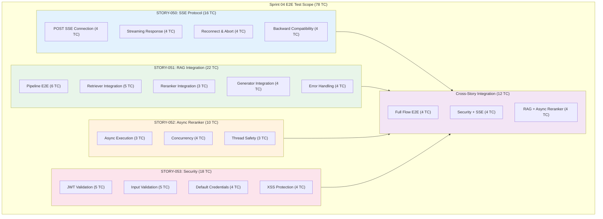

# Sprint 04 E2E Test Plan

## P0 Critical 4건 완료 후 E2E 검증 + Week 2 QA Stories 준비

**Version**: 1.0
**Created**: 2026-01-28
**Author**: QA Engineer (QA Agent)
**Sprint**: Sprint 04 Day 1
**Status**: Active

---

## Document Information

| Item | Value |
|------|-------|
| **Document** | Sprint 04 E2E Test Plan |
| **Version** | 1.0 |
| **Created** | 2026-01-28 |
| **Author** | QA Agent (Claude Opus 4.5) |
| **Status** | Active |
| **Related Stories** | STORY-050 (SCRUM-40), STORY-051 (SCRUM-41), STORY-052 (SCRUM-42), STORY-053 (SCRUM-43) |
| **Week 2 QA Stories** | STORY-054 (SCRUM-44), STORY-055 (SCRUM-45) |
| **Total Test Cases** | 78 (E2E) + Week 2 planned |
| **Related Docs** | [Sprint 04 Plan](../../../backlog/sprints/sprint-04.md), [E2E Test Plan Sprint 02](./e2e_test_plan_sprint02.md), [Sprint 03 Wave 3 Test Plan](./sprint03_wave3_test_plan.md), [API Integration Design](../02_design/api_integration_design.md), [Unit/Integration Test Plan](./unit_integration_test_plan.md) |

---

## Change History

| Version | Date | Author | Description |
|---------|------|--------|-------------|
| 1.0 | 2026-01-28 | QA Agent | Initial creation - Sprint 04 E2E Test Plan (78 TC for P0 4 stories) |

---

## Table of Contents

1. [Overview](#1-overview)
2. [Test Scope Summary](#2-test-scope-summary)
3. [STORY-050: SSE Protocol Fix E2E Tests](#3-story-050-sse-protocol-fix-e2e-tests)
4. [STORY-051: RAG Pipeline Integration E2E Tests](#4-story-051-rag-pipeline-integration-e2e-tests)
5. [STORY-052: Reranker Async Conversion E2E Tests](#5-story-052-reranker-async-conversion-e2e-tests)
6. [STORY-053: Security Hardening E2E Tests](#6-story-053-security-hardening-e2e-tests)
7. [Cross-Story Integration E2E Tests](#7-cross-story-integration-e2e-tests)
8. [Test Scenario Matrix](#8-test-scenario-matrix)
9. [Baseline Measurement Items](#9-baseline-measurement-items)
10. [Pass/Fail Criteria](#10-passfail-criteria)
11. [Test Environment](#11-test-environment)
12. [Test Tools and Frameworks](#12-test-tools-and-frameworks)
13. [Risks and Mitigations](#13-risks-and-mitigations)
14. [Execution Schedule](#14-execution-schedule)
15. [Week 2 QA Stories Preview](#15-week-2-qa-stories-preview)
16. [Quality Gates](#16-quality-gates)

---

## 1. Overview

### 1.1 Purpose

This document defines the End-to-End (E2E) test plan for Sprint 04 P0 Critical 4 stories. These stories address issues identified during the Sprint 03 completion review:

- **STORY-050**: SSE protocol fix (EventSource GET -> fetch+ReadableStream POST)
- **STORY-051**: RAG pipeline integration (ai_service <-> knowledge_service actual connection)
- **STORY-052**: Reranker async conversion (asyncio.to_thread wrapping)
- **STORY-053**: Security hardening (JWT Secret, input validation, default credentials removal)

The E2E tests will be executed **after** all P0 stories are completed (expected end of Week 1). This plan also previews Week 2 QA stories (STORY-054, STORY-055) for forward planning.

### 1.2 Sprint 04 P0 Stories

| # | Story | Jira | Description | Points | Assignee | Dependency |
|---|-------|------|-------------|--------|----------|------------|
| 1 | STORY-050 | SCRUM-40 | SSE Protocol Fix (POST SSE) | 5 | Frontend | STORY-043 (SSE base) |
| 2 | STORY-051 | SCRUM-41 | RAG Pipeline Integration | 8 | RAG | STORY-030, 033 |
| 3 | STORY-052 | SCRUM-42 | Reranker Async Conversion | 2 | RAG | STORY-032 (BGE Reranker) |
| 4 | STORY-053 | SCRUM-43 | Security Hardening | 3 | Backend | STORY-022, 024 |

### 1.3 Test Architecture



### 1.4 Prerequisite Stories (Completed in Sprint 03)

| Story | Description | Status | Dependency Relation |
|-------|-------------|--------|---------------------|
| STORY-030 | HybridRetriever (43/43 tests) | Done | STORY-051 integrates with this |
| STORY-031 | RRF Fusion (55/55 tests) | Done | STORY-051 uses RRF scores |
| STORY-032 | BGE Reranker (65 tests) | Done | STORY-052 wraps this async |
| STORY-033 | LangGraph Workflow | Done | STORY-051 connects real retriever |
| STORY-043 | SSE Streaming Response | Done | STORY-050 replaces protocol |
| STORY-022 | JWT Auth Filter | Done | STORY-053 hardens this |
| STORY-024 | Direct Login API | Done | STORY-053 removes defaults |
| STORY-044 | Backend Search Service | Done | STORY-051 routes through this |

---

## 2. Test Scope Summary

### 2.1 In Scope

| Category | Story | Test Count | Priority | Tool |
|----------|-------|-----------|----------|------|
| POST SSE Connection | STORY-050 | 4 | P0 | Playwright + fetch mock |
| SSE Streaming Response | STORY-050 | 4 | P0 | Playwright |
| SSE Reconnect & Abort | STORY-050 | 4 | P0/P1 | Playwright |
| SSE Backward Compatibility | STORY-050 | 4 | P1 | Playwright |
| RAG Pipeline E2E | STORY-051 | 6 | P0 | pytest + httpx |
| Retriever Integration | STORY-051 | 5 | P0 | pytest + httpx |
| Reranker Integration | STORY-051 | 3 | P0 | pytest + httpx |
| Generator Integration | STORY-051 | 4 | P0/P1 | pytest + httpx |
| Pipeline Error Handling | STORY-051 | 4 | P1 | pytest + httpx |
| Async Execution | STORY-052 | 3 | P0 | pytest + asyncio |
| Concurrency | STORY-052 | 4 | P0/P1 | pytest + asyncio + k6 |
| Thread Safety | STORY-052 | 3 | P1 | pytest + asyncio |
| JWT Validation | STORY-053 | 5 | P0 | pytest + httpx |
| Input Validation | STORY-053 | 5 | P0 | pytest + httpx |
| Default Credentials | STORY-053 | 4 | P0 | pytest + httpx |
| XSS Protection | STORY-053 | 4 | P0 | pytest + httpx |
| Full Flow Integration | Cross | 4 | P0 | Playwright + pytest |
| Security + SSE | Cross | 4 | P0 | Playwright + pytest |
| RAG + Async Reranker | Cross | 4 | P1 | pytest + asyncio |
| **Total** | | **78** | | |

### 2.2 Out of Scope

| Item | Reason | Expected Sprint/Story |
|------|--------|----------------------|
| Contract Tests | Separate STORY-054 (Week 2) | Sprint 04 Week 2 |
| Full Security Scan (OWASP ZAP) | Separate STORY-055 (Week 2) | Sprint 04 Week 2 |
| RAGAS Quality Evaluation | Separate STORY-058 (Week 2) | Sprint 04 Week 2 |
| Multi-browser Testing | Chromium-first strategy | Sprint 05 |
| Mobile Responsive Testing | Desktop-first | Sprint 05 |
| k6 Full Load Test | After functional tests pass | Sprint 04 Week 2 |
| Frontend Test Coverage (60%) | Separate STORY-059 | Sprint 04/05 |

---

## 3. STORY-050: SSE Protocol Fix E2E Tests

### 3.1 POST SSE Connection Tests

**Scope**: Verify that SSE streaming now works over POST with `fetch+ReadableStream` instead of `EventSource(GET)`.

| Test ID | Test Name | Priority | Precondition | Test Steps | Expected Result | Automatable |
|---------|-----------|----------|--------------|------------|-----------------|-------------|
| S04-050-E2E-001 | POST SSE connection establishes successfully | P0 | Backend SSE endpoint supports POST; Frontend deployed with SSEPostClient | 1. Navigate to search page 2. Enter query "RAG 시스템 동작 원리" 3. Submit search 4. Capture network request | Network tab shows POST request to `/api/v1/search/chat/stream` with Content-Type `application/json`; Response status 200 with `text/event-stream` content type | Yes |
| S04-050-E2E-002 | POST body contains query and conversation_history | P0 | SSEPostClient configured | 1. Enter query "JWT 인증 필터 구현" 2. Add prior conversation (multi-turn) 3. Submit search 4. Inspect request body | POST body contains `{"query":"JWT 인증 필터 구현","conversation_history":[...],"top_k":5}`; No query parameters in URL | Yes |
| S04-050-E2E-003 | JWT token sent in Authorization header (not URL) | P0 | User authenticated; SSEPostClient configured | 1. Login with valid credentials 2. Submit search 3. Inspect request headers | Request header contains `Authorization: Bearer <token>`; URL does not contain token parameter; No sensitive data in URL | Yes |
| S04-050-E2E-004 | Large conversation_history (20+ messages) transmitted safely | P1 | User has 20+ turn conversation | 1. Conduct 20+ turns of conversation 2. Submit new query 3. Inspect request body | POST body contains full 20+ conversation_history array; No URL length limit violation; Response received normally | Yes |

---

### 3.2 SSE Streaming Response Tests

**Scope**: Verify that the POST-based SSE streaming correctly delivers token-by-token responses to the UI.

| Test ID | Test Name | Priority | Precondition | Test Steps | Expected Result | Automatable |
|---------|-----------|----------|--------------|------------|-----------------|-------------|
| S04-050-E2E-005 | Token-by-token streaming renders in UI | P0 | Full stack running; SSE POST active | 1. Submit search query 2. Observe UI during response 3. Measure time between first and last token | Tokens appear incrementally in chat bubble; Not a single block render; Typing indicator visible during streaming | Yes |
| S04-050-E2E-006 | SSE events parsed correctly (data, event type, done) | P0 | SSE POST active | 1. Submit search query 2. Intercept SSE event stream 3. Parse events | Events follow format: `data: {"type":"token","content":"..."}\n\n`; Final event: `data: {"type":"done","sources":[...]}\n\n`; All events properly parsed | Yes |
| S04-050-E2E-007 | Sources displayed after streaming completes | P0 | SSE POST active; Generator returns sources | 1. Submit search query 2. Wait for streaming to complete ([DONE] event) 3. Check sources section | Source documents displayed below answer; Each source shows title and link; Sources match retrieved documents | Yes |
| S04-050-E2E-008 | Korean text streaming renders correctly | P1 | SSE POST active; Korean query | 1. Submit Korean query "프로젝트 보안 감사 절차는?" 2. Observe streaming response | Korean characters render correctly without garbled text; TextDecoder handles UTF-8 properly; No encoding artifacts | Yes |

---

### 3.3 SSE Reconnect and Abort Tests

**Scope**: Verify error handling, reconnection logic, and user-initiated cancellation.

| Test ID | Test Name | Priority | Precondition | Test Steps | Expected Result | Automatable |
|---------|-----------|----------|--------------|------------|-----------------|-------------|
| S04-050-E2E-009 | Connection abort via user cancel button | P0 | SSE streaming active | 1. Submit search query 2. While streaming, click cancel/stop button 3. Observe network and UI | AbortController.abort() called; ReadableStream reader cancelled; UI shows "cancelled" state; No further tokens rendered | Yes |
| S04-050-E2E-010 | Auto-reconnect on network interruption | P0 | SSE streaming active | 1. Submit search query 2. Simulate network interruption (offline) 3. Restore network 4. Observe behavior | Reconnection attempted (up to 3 retries) with exponential backoff; Error message shown to user during disconnection; Recovery on network restore | Yes |
| S04-050-E2E-011 | Max retry exceeded shows error to user | P1 | SSE streaming active; network permanently down | 1. Submit search query 2. Simulate persistent network failure 3. Wait for 3 retry attempts | After 3 retries exhausted, user sees "Connection failed" error message; No infinite retry loop; UI in stable error state | Yes |
| S04-050-E2E-012 | New search cancels previous streaming | P1 | SSE streaming active | 1. Submit search query "A" 2. While streaming, submit new search "B" 3. Observe | Previous stream (A) aborted cleanly; New stream (B) starts; No interleaved tokens from A and B; Only B's response displayed | Yes |

---

### 3.4 SSE Backward Compatibility Tests

**Scope**: Verify that the protocol change does not break existing search functionality.

| Test ID | Test Name | Priority | Precondition | Test Steps | Expected Result | Automatable |
|---------|-----------|----------|--------------|------------|-----------------|-------------|
| S04-050-E2E-013 | useSearchChat hook API unchanged | P1 | SSEPostClient replaces SSEClient internally | 1. Verify useSearchChat hook signature 2. Check that all existing callers work without changes | Hook accepts same parameters (query, onToken, onComplete, onError); Return values (send, cancel, isStreaming) unchanged; No consumer code changes required | Yes |
| S04-050-E2E-014 | EventSource code fully removed | P1 | STORY-050 completed | 1. Search codebase for EventSource usage in search features 2. Check import statements | No remaining `new EventSource()` calls in search flow; SSEClient (GET-based) removed or deprecated; Only SSEPostClient (POST-based) active | Yes |
| S04-050-E2E-015 | StreamingIndicator component still works | P1 | POST SSE active | 1. Submit search query 2. Observe streaming indicator UI | Typing dots / streaming animation displayed during response; Indicator disappears after [DONE]; Same visual behavior as before protocol change | Yes |
| S04-050-E2E-016 | Error boundary catches SSE failures | P1 | ErrorBoundary wraps search component | 1. Simulate SSE endpoint returning 500 2. Observe UI | ErrorBoundary catches the error; User sees friendly error message; App does not crash; Retry option available | Yes |

---

## 4. STORY-051: RAG Pipeline Integration E2E Tests

### 4.1 Full Pipeline E2E Tests

**Scope**: Verify that the complete RAG pipeline works end-to-end with actual services connected.

| Test ID | Test Name | Priority | Precondition | Test Steps | Expected Result | Automatable |
|---------|-----------|----------|--------------|------------|-----------------|-------------|
| S04-051-E2E-001 | Full pipeline: Query -> Planner -> Retriever -> Reranker -> Generator -> Answer | P0 | All services running; Pipeline bootstrapped; Test documents in ES/Neo4j | 1. Send POST to `/api/v1/search` with query "문서 업로드 절차" 2. Wait for response 3. Validate response structure | Response contains: `answer` (non-empty string), `sources` (array with doc references), `metadata.steps` includes all 4 nodes; Response time < 10s | Yes |
| S04-051-E2E-002 | Pipeline with SSE streaming output | P0 | Full pipeline + SSE POST endpoint | 1. Send POST to `/api/v1/search/chat/stream` with query 2. Collect SSE events 3. Verify event sequence | Events received in order: planner status -> retriever status -> reranker status -> token events -> done event; Final answer matches non-streaming response | Yes |
| S04-051-E2E-003 | Pipeline returns relevant answer from indexed documents | P0 | Test documents about "RAG 시스템" indexed in ES | 1. Send query "RAG 시스템은 어떻게 동작하나요?" 2. Check answer content 3. Verify sources | Answer references concepts from indexed RAG documents; Sources list includes relevant document titles; Answer is in Korean | Yes |
| S04-051-E2E-004 | Pipeline with empty result (no matching documents) | P0 | Query has no matching documents in index | 1. Send query "존재하지 않는 아주 특수한 주제 XYZ123" 2. Check response | Response contains fallback answer (e.g., "관련 정보를 찾을 수 없습니다"); Sources is empty array; No error status; Graceful handling | Yes |
| S04-051-E2E-005 | Pipeline processes Korean query correctly | P1 | Korean documents indexed | 1. Send query "보안 감사 보고서 작성 방법" 2. Check answer language and content | Answer in Korean; No encoding issues; Query refinement by Planner preserves Korean characters | Yes |
| S04-051-E2E-006 | Pipeline single LangGraph path (no legacy RAGPipeline) | P1 | Legacy RAGPipeline route disabled | 1. Send search request 2. Check execution logs 3. Verify only LangGraph nodes executed | Only LangGraph workflow nodes appear in logs/steps; No legacy RAGPipeline code path executed; SearchService routes through LangGraph exclusively | Yes |

---

### 4.2 Retriever Integration Tests

**Scope**: Verify that RetrieverNode connects to real HybridRetriever (ES + Neo4j).

| Test ID | Test Name | Priority | Precondition | Test Steps | Expected Result | Automatable |
|---------|-----------|----------|--------------|------------|-----------------|-------------|
| S04-051-E2E-007 | RetrieverNode calls HybridRetriever.retrieve() with actual ES | P0 | HybridRetriever bootstrapped; ES has indexed documents | 1. Trigger pipeline with keyword query 2. Check ES query logs 3. Verify documents returned | ES receives actual search query; Documents returned are real (not mock); Document content matches indexed data | Yes |
| S04-051-E2E-008 | RetrieverNode calls HybridRetriever with Neo4j graph traversal | P0 | Neo4j has knowledge graph data | 1. Trigger pipeline with entity-rich query 2. Check Neo4j query logs 3. Verify graph results | Neo4j Cypher query executed; Graph relationships traversed; Results merged with ES results via RRF | Yes |
| S04-051-E2E-009 | RRF Fusion merges ES and Neo4j results | P0 | Both ES and Neo4j return results | 1. Send query that matches both sources 2. Verify merged document list | Document list contains results from both ES and Neo4j; RRF scores computed; Documents sorted by fused relevance score | Yes |
| S04-051-E2E-010 | Retriever respects strategy weights from Planner | P1 | Planner selects "keyword" strategy | 1. Send specific keyword query (e.g., exact error code) 2. Check retrieval weights used | For "keyword" strategy: ES weight=0.3, Neo4j weight=0.7; For "semantic" strategy: ES weight=0.8, Neo4j weight=0.2; Weights match Planner output | Yes |
| S04-051-E2E-011 | Retriever handles ES connection failure gracefully | P1 | ES temporarily unavailable | 1. Stop ES container 2. Send search query 3. Check error response | Graceful error message returned; No server crash; Error logged with context; User sees "서비스 일시 오류" message | Yes |

---

### 4.3 Reranker Integration Tests

**Scope**: Verify that Reranker node correctly processes retrieved documents.

| Test ID | Test Name | Priority | Precondition | Test Steps | Expected Result | Automatable |
|---------|-----------|----------|--------------|------------|-----------------|-------------|
| S04-051-E2E-012 | Reranker reorders documents by relevance | P0 | Retriever returns 10+ documents | 1. Send query 2. Capture pre-rerank document order 3. Capture post-rerank order | Document order changes after reranking; Top documents are more relevant to query; Reranker scores populated | Yes |
| S04-051-E2E-013 | Reranker preserves document metadata | P0 | Documents have metadata (title, source, chunk_id) | 1. Send query 2. Check reranked documents | All metadata fields preserved after reranking; No data loss during rerank process; doc_title, chunk_id intact | Yes |
| S04-051-E2E-014 | Reranker handles fewer documents than top_k | P1 | Retriever returns only 2 documents (top_k=5) | 1. Send query with limited results 2. Check reranked output | Reranker processes 2 documents without error; No padding with empty documents; Output contains exactly 2 reranked docs | Yes |

---

### 4.4 Generator Integration Tests

**Scope**: Verify that Generator produces answers from reranked documents using actual LLM.

| Test ID | Test Name | Priority | Precondition | Test Steps | Expected Result | Automatable |
|---------|-----------|----------|--------------|------------|-----------------|-------------|
| S04-051-E2E-015 | Generator produces answer from reranked context | P0 | Real LLM (DeepSeek) configured; Reranked docs available | 1. Send query 2. Check generator output | `answer` is non-empty; Answer content relates to query; Answer references information from provided context documents | Yes |
| S04-051-E2E-016 | Generator extracts sources correctly | P0 | Reranked documents have metadata | 1. Send query 2. Check sources in response | `sources` array contains entries with `title` and `chunk_id`; Sources match the documents used for generation; No duplicate sources | Yes |
| S04-051-E2E-017 | Generator handles empty context gracefully | P1 | No documents retrieved | 1. Send query with no matching documents 2. Check answer | Answer contains fallback message; No hallucinated content; Sources is empty | Yes |
| S04-051-E2E-018 | Generator response time within SLA | P1 | LLM service responsive | 1. Send 10 queries sequentially 2. Measure generation time for each | P95 generation time < 5 seconds; Average generation time < 3 seconds; No timeouts | Yes |

---

### 4.5 Pipeline Error Handling Tests

**Scope**: Verify graceful degradation when individual pipeline components fail.

| Test ID | Test Name | Priority | Precondition | Test Steps | Expected Result | Automatable |
|---------|-----------|----------|--------------|------------|-----------------|-------------|
| S04-051-E2E-019 | Knowledge Service connection failure | P1 | knowledge_service unreachable | 1. Stop knowledge_service 2. Send search query 3. Check response | Error response with appropriate message; HTTP 503 or equivalent; Error logged; No stack trace exposed to user | Yes |
| S04-051-E2E-020 | LLM Service timeout | P1 | LLM service slow (> 30s) | 1. Configure LLM timeout to 5s 2. Mock LLM to respond after 10s 3. Send query | Timeout error after configured duration; User sees "응답 시간 초과" message; Pipeline state includes error context | Yes |
| S04-051-E2E-021 | Partial pipeline failure recovery | P1 | Validator fails first attempt | 1. Send query 2. Validator triggers re-retrieval 3. Second attempt succeeds | Retry loop executes (retriever -> reranker -> generator -> validator); Final answer passes validation; Steps log shows retry path | Yes |
| S04-051-E2E-022 | Max retry exhaustion | P1 | Validator always fails | 1. Send query with intentionally poor context 2. Wait for max retries (3) | Pipeline terminates after 3 retries; Answer delivered with quality warning; No infinite loop; Response time bounded | Yes |

---

## 5. STORY-052: Reranker Async Conversion E2E Tests

### 5.1 Async Execution Tests

**Scope**: Verify that Reranker runs asynchronously without blocking the event loop.

| Test ID | Test Name | Priority | Precondition | Test Steps | Expected Result | Automatable |
|---------|-----------|----------|--------------|------------|-----------------|-------------|
| S04-052-E2E-001 | Async rerank completes without blocking | P0 | Reranker wrapped with asyncio.to_thread | 1. Send search query through async endpoint 2. Monitor event loop blocking 3. Check response | Reranker executes in separate thread; Event loop remains responsive; Results identical to sync version | Yes |
| S04-052-E2E-002 | Async rerank results match sync baseline | P0 | Both sync and async paths available for comparison | 1. Send same query through async reranker 2. Compare results with known sync baseline | Document order identical; Reranker scores identical (float comparison within 1e-6); No data corruption from threading | Yes |
| S04-052-E2E-003 | Async rerank within LangGraph workflow | P0 | LangGraph compiled with async RerankerNode | 1. Execute full pipeline with async reranker 2. Verify reranker step in workflow | Reranker node executes as async; `steps` log includes "reranker"; No async/await compatibility issues with LangGraph | Yes |

---

### 5.2 Concurrency Tests

**Scope**: Verify that multiple concurrent requests are handled correctly with async reranker.

| Test ID | Test Name | Priority | Precondition | Test Steps | Expected Result | Automatable |
|---------|-----------|----------|--------------|------------|-----------------|-------------|
| S04-052-E2E-004 | 2 concurrent search requests both complete | P0 | Async reranker active | 1. Launch 2 concurrent search requests (asyncio.gather) 2. Wait for both 3. Verify results | Both requests complete successfully; Each has independent correct results; Total time < 2x single request time (parallelism benefit) | Yes |
| S04-052-E2E-005 | 5 concurrent requests without errors | P1 | Async reranker active | 1. Launch 5 concurrent requests 2. Collect all responses 3. Check for errors | All 5 complete without errors; No shared state corruption; Each response has correct sources | Yes |
| S04-052-E2E-006 | Second request not blocked by first request's reranker | P0 | Async reranker active | 1. Send request A (heavy reranking with 20 docs) 2. Immediately send request B (lightweight query) 3. Measure B's response time | Request B's retriever/planner stages execute while A's reranker is running; B not blocked waiting for A; Event loop responsive | Yes |
| S04-052-E2E-007 | Concurrent requests with different strategies | P1 | Async reranker active | 1. Send keyword query and semantic query simultaneously 2. Verify each uses correct strategy | Keyword query uses keyword weights; Semantic query uses semantic weights; No cross-contamination between requests | Yes |

---

### 5.3 Thread Safety Tests

**Scope**: Verify that the BGE Reranker model is thread-safe under concurrent access.

| Test ID | Test Name | Priority | Precondition | Test Steps | Expected Result | Automatable |
|---------|-----------|----------|--------------|------------|-----------------|-------------|
| S04-052-E2E-008 | Model inference under concurrent thread access | P1 | BGE Reranker model loaded; asyncio.to_thread active | 1. Launch 3 concurrent rerank operations on same model instance 2. Check for crashes or incorrect scores | No segmentation faults; No thread-related crashes; All 3 produce valid scores; Scores are deterministic | Yes |
| S04-052-E2E-009 | Memory stability under repeated async reranking | P1 | Async reranker active | 1. Execute 50 sequential rerank operations 2. Monitor memory usage 3. Check for leaks | Memory usage stays stable (within 10% of baseline); No monotonic memory growth; GC reclaims after operations | Yes |
| S04-052-E2E-010 | ThreadPoolExecutor max_workers respected | P1 | ThreadPoolExecutor configured (e.g., max_workers=4) | 1. Launch 8 concurrent rerank operations 2. Monitor active threads | Maximum 4 concurrent threads; Remaining 4 requests queued; All 8 eventually complete | Yes |

---

## 6. STORY-053: Security Hardening E2E Tests

### 6.1 JWT Validation Tests

**Scope**: Verify JWT Secret hardcoding removal and proper validation.

| Test ID | Test Name | Priority | Precondition | Test Steps | Expected Result | Automatable |
|---------|-----------|----------|--------------|------------|-----------------|-------------|
| S04-053-E2E-001 | Application fails to start without JWT_SECRET env var | P0 | JWT_SECRET environment variable NOT set | 1. Attempt to start backend application without JWT_SECRET 2. Check startup logs | Application fails to start; Error message: "JWT_SECRET 환경변수가 설정되지 않았습니다"; No default fallback used | Yes |
| S04-053-E2E-002 | Application rejects short JWT_SECRET (< 32 chars) | P0 | JWT_SECRET set to "short-key" (< 32 chars) | 1. Set JWT_SECRET="short-key" 2. Attempt to start application | Application fails to start; Error message: "JWT_SECRET은 최소 32자 이상이어야 합니다" | Yes |
| S04-053-E2E-003 | No JWT token returns 401 | P0 | Application running with valid JWT_SECRET | 1. Send GET/POST to `/api/v1/search` without Authorization header 2. Check response | HTTP 401 Unauthorized; Response body contains error code; No data leaked in error response | Yes |
| S04-053-E2E-004 | Expired JWT token returns 401 | P0 | Application running | 1. Generate JWT token with past expiry (exp = now - 1h) 2. Send request with expired token | HTTP 401; Response includes "token expired" indication; Different from missing token error code | Yes |
| S04-053-E2E-005 | Tampered JWT token returns 401 | P0 | Application running | 1. Generate valid JWT token 2. Modify payload (change user_id) without re-signing 3. Send request | HTTP 401; Signature validation fails; "invalid token" error response | Yes |

---

### 6.2 Input Validation Tests

**Scope**: Verify query input length and content validation on SSE endpoints.

| Test ID | Test Name | Priority | Precondition | Test Steps | Expected Result | Automatable |
|---------|-----------|----------|--------------|------------|-----------------|-------------|
| S04-053-E2E-006 | Query exceeding 1000 chars returns 400 | P0 | Application running; authenticated | 1. Generate query string of 1001 characters 2. Send to search endpoint 3. Check response | HTTP 400 Bad Request; Error message: "쿼리는 1000자 이내"; Request rejected before processing | Yes |
| S04-053-E2E-007 | Query at exactly 1000 chars accepted | P0 | Application running; authenticated | 1. Generate query string of exactly 1000 characters 2. Send to search endpoint | HTTP 200; Request accepted and processed normally; Boundary case handled correctly | Yes |
| S04-053-E2E-008 | Empty query returns 400 | P0 | Application running; authenticated | 1. Send search request with empty query "" 2. Check response | HTTP 400; Error message indicates query is required; No server error | Yes |
| S04-053-E2E-009 | Query with special characters processed safely | P1 | Application running; authenticated | 1. Send query with special chars: `"query": "test <>&'\""` 2. Check response | Request processed without error; Special characters handled; No injection vulnerability | Yes |
| S04-053-E2E-010 | SSE endpoint validates input on POST body | P0 | POST SSE endpoint (STORY-050) active | 1. Send POST to SSE endpoint with invalid top_k (negative number) 2. Check response | HTTP 400; Validation error for top_k; Request rejected | Yes |

---

### 6.3 Default Credentials Tests

**Scope**: Verify that default/hardcoded credentials are removed from the system.

| Test ID | Test Name | Priority | Precondition | Test Steps | Expected Result | Automatable |
|---------|-----------|----------|--------------|------------|-----------------|-------------|
| S04-053-E2E-011 | Keycloak admin default password rejected | P0 | Keycloak running with hardened config | 1. Attempt login to Keycloak admin console with admin/admin 2. Check result | Login fails; Default credentials not accepted; Keycloak requires environment-variable-set password | Yes |
| S04-053-E2E-012 | PostgreSQL default password rejected | P0 | PostgreSQL running with hardened config | 1. Attempt connection with postgres/postgres or default passwords 2. Check result | Connection fails; Default password not accepted; Only env-var-configured password works | Yes |
| S04-053-E2E-013 | application.yml contains no hardcoded secrets | P0 | Source code available | 1. Scan application.yml for hardcoded passwords/secrets 2. Check for default values in @Value annotations | No plaintext secrets in config files; All secrets reference env vars (${JWT_SECRET}, ${DB_PASSWORD}); No default fallback values for secrets | Yes |
| S04-053-E2E-014 | .env.example documents all required secrets | P1 | .env.example file exists | 1. Check .env.example for completeness 2. Compare with actual env vars used in code | All required secrets listed; Each has description; No actual values (only placeholders); Includes JWT_SECRET, DB passwords, Keycloak admin | Yes |

---

### 6.4 XSS Protection Tests

**Scope**: Verify that XSS attack vectors are sanitized or rejected.

| Test ID | Test Name | Priority | Precondition | Test Steps | Expected Result | Automatable |
|---------|-----------|----------|--------------|------------|-----------------|-------------|
| S04-053-E2E-015 | Script tag in query sanitized | P0 | Input sanitization active | 1. Send query `<script>alert('xss')</script>` 2. Check how query is processed 3. Check response | Script tag stripped or escaped; No script execution; Sanitized query processed or 400 returned | Yes |
| S04-053-E2E-016 | Event handler XSS in query sanitized | P0 | Input sanitization active | 1. Send query `` 2. Check response | HTML tags stripped; Event handler not preserved; Safe text processed | Yes |
| S04-053-E2E-017 | SVG-based XSS in query sanitized | P1 | Input sanitization active | 1. Send query `<svg onload="alert(1)">test</svg>` 2. Check response | SVG tag stripped; onload handler removed; Only "test" text preserved or query rejected | Yes |
| S04-053-E2E-018 | Response does not reflect unsanitized input | P0 | Input sanitization active | 1. Send query with XSS payload 2. Check if response contains the original XSS payload | Response body does not contain unescaped `<script>`, `onerror`, `onload` etc.; If query echoed back, it is escaped/sanitized | Yes |

---

## 7. Cross-Story Integration E2E Tests

### 7.1 Full Flow E2E Tests

**Scope**: Verify the complete user journey: Frontend -> Backend -> AI Service -> Knowledge Service -> Response.

| Test ID | Test Name | Priority | Precondition | Test Steps | Expected Result | Automatable |
|---------|-----------|----------|--------------|------------|-----------------|-------------|
| S04-CROSS-E2E-001 | Complete search flow: Login -> Search -> Stream -> Sources | P0 | All services running; P0 stories completed | 1. Open app in browser 2. Login with valid credentials 3. Navigate to search page 4. Enter query "문서 관리 프로세스" 5. Observe streaming response 6. Click on a source | Login succeeds; Search page loads; POST SSE stream starts; Tokens appear incrementally; Sources displayed after completion; Source link navigates correctly | Yes |
| S04-CROSS-E2E-001b | Multi-turn conversation flow | P0 | All services running | 1. Submit first query "RAG란 무엇인가?" 2. Read response 3. Submit follow-up "구체적인 구현 방법은?" 4. Check conversation_history | Second request includes first Q&A in conversation_history; Follow-up answer builds on previous context; Multi-turn coherence maintained | Yes |
| S04-CROSS-E2E-002 | Search with no results shows appropriate message | P0 | All services running | 1. Login 2. Search for nonsensical query "zzzxxx9999" 3. Observe response | Streaming completes; Fallback message shown; No error state; Sources section empty; UI remains usable | Yes |
| S04-CROSS-E2E-003 | Rapid sequential searches handled correctly | P1 | All services running | 1. Submit query A 2. Immediately submit query B 3. Check response | Query A's stream aborted; Only query B's response displayed; No interleaved content; Clean state transition | Yes |

---

### 7.2 Security + SSE Integration Tests

**Scope**: Verify that security measures work correctly with the new POST SSE protocol.

| Test ID | Test Name | Priority | Precondition | Test Steps | Expected Result | Automatable |
|---------|-----------|----------|--------------|------------|-----------------|-------------|
| S04-CROSS-E2E-004 | POST SSE requires JWT authentication | P0 | Auth required; POST SSE active | 1. Send POST to SSE endpoint without Authorization header 2. Check response | HTTP 401; SSE stream not started; No data leaked | Yes |
| S04-CROSS-E2E-005 | POST SSE with XSS payload in body rejected | P0 | Input validation + POST SSE active | 1. Send POST to SSE endpoint with XSS in query field 2. Check response | Input sanitized or rejected; XSS payload not reflected in SSE events; Safe handling | Yes |
| S04-CROSS-E2E-006 | POST SSE with oversized query rejected | P0 | Input validation + POST SSE active | 1. Send POST to SSE endpoint with 1001-char query in body 2. Check response | HTTP 400; SSE stream not started; Input validation applied to POST body | Yes |
| S04-CROSS-E2E-007 | JWT token refresh during long SSE stream | P1 | Long-running SSE stream; Token expires mid-stream | 1. Start SSE stream with token expiring in 30s 2. Stream takes 60s 3. Check behavior | Token refresh handled gracefully; Either: (a) stream continues with refreshed token, or (b) client reconnects with new token; No data loss | Yes |

---

### 7.3 RAG + Async Reranker Integration Tests

**Scope**: Verify that the async reranker works correctly within the integrated RAG pipeline.

| Test ID | Test Name | Priority | Precondition | Test Steps | Expected Result | Automatable |
|---------|-----------|----------|--------------|------------|-----------------|-------------|
| S04-CROSS-E2E-008 | Integrated pipeline uses async reranker | P1 | STORY-051 + STORY-052 both completed | 1. Send search query through full pipeline 2. Check reranker execution mode 3. Verify results | Reranker executes via asyncio.to_thread; Pipeline completes normally; Results quality unchanged | Yes |
| S04-CROSS-E2E-009 | Concurrent pipeline with async reranker | P1 | Full pipeline with async reranker | 1. Send 3 concurrent search queries 2. Wait for all responses 3. Verify each | All 3 queries processed; No blocking between requests; Each response has correct independent results; Total time demonstrates parallelism | Yes |
| S04-CROSS-E2E-010 | Pipeline performance baseline with async reranker | P1 | Full pipeline operational | 1. Execute 20 search queries sequentially 2. Record response times 3. Calculate P95 | P95 latency < 10s (full pipeline including LLM); Median < 7s; No timeouts; Async reranker does not add significant overhead | Yes |
| S04-CROSS-E2E-011 | SSE streaming with async reranker shows proper progress | P1 | POST SSE + async pipeline | 1. Submit search via SSE POST 2. Observe intermediate events | SSE events show pipeline progress (planner -> retriever -> reranker -> generator); Reranker step completes without blocking SSE event delivery | Yes |

---

## 8. Test Scenario Matrix

### 8.1 Story vs. Test Priority Matrix

| Test Category | P0 (Must) | P1 (Should) | P2 (Could) | Total |
|---------------|:---------:|:-----------:|:----------:|:-----:|
| STORY-050 SSE Protocol | 8 | 8 | 0 | **16** |
| STORY-051 RAG Pipeline | 12 | 10 | 0 | **22** |
| STORY-052 Async Reranker | 4 | 6 | 0 | **10** |
| STORY-053 Security | 14 | 4 | 0 | **18** |
| Cross-Story Integration | 6 | 6 | 0 | **12** |
| **Total** | **44** | **34** | **0** | **78** |

### 8.2 Test Type Distribution

| Test Type | Count | Tool | Environment |
|-----------|:-----:|------|-------------|
| Browser E2E (Playwright) | 20 | Playwright (Chromium) | Full stack Docker |
| API E2E (HTTP) | 38 | pytest + httpx | Full stack Docker |
| Concurrency E2E | 10 | pytest + asyncio / k6 | Full stack Docker |
| Security E2E | 10 | pytest + httpx | Full stack Docker |
| **Total** | **78** | | |

### 8.3 Acceptance Criteria Traceability

| Story | AC# | AC Description (Summary) | Test IDs |
|-------|:---:|--------------------------|----------|
| STORY-050 | AC1 | POST body SSE connection | E2E-001, E2E-002 |
| STORY-050 | AC2 | useSearchChat hook compatibility | E2E-013, E2E-015 |
| STORY-050 | AC3 | Auto-reconnect (max 3) | E2E-010, E2E-011 |
| STORY-050 | AC4 | Token streaming + [DONE] | E2E-005, E2E-006, E2E-007 |
| STORY-050 | AC5 | EventSource code removed | E2E-014 |
| STORY-051 | AC1 | RetrieverNode -> HybridRetriever | E2E-007, E2E-008, E2E-009 |
| STORY-051 | AC2 | SearchService -> LangGraph workflow | E2E-001, E2E-006 |
| STORY-051 | AC3 | Full E2E path | CROSS-E2E-001, CROSS-E2E-001b |
| STORY-051 | AC4 | Single LangGraph path | E2E-006 |
| STORY-051 | AC5 | DI bootstrap | E2E-007 |
| STORY-052 | AC1 | Event loop not blocked | E2E-001, E2E-006 |
| STORY-052 | AC2 | Concurrent requests not blocked | E2E-004, E2E-005, E2E-006 |
| STORY-052 | AC3 | Result equivalence | E2E-002 |
| STORY-052 | AC4 | Thread safety | E2E-008 |
| STORY-053 | AC1 | JWT_SECRET required | E2E-001, E2E-002 |
| STORY-053 | AC2 | Query length > 1000 -> 400 | E2E-006 |
| STORY-053 | AC3 | XSS pattern sanitized | E2E-015, E2E-016, E2E-017 |
| STORY-053 | AC4 | Default password rejected | E2E-011, E2E-012 |
| STORY-053 | AC5 | No hardcoded secrets | E2E-013 |

---

## 9. Baseline Measurement Items

### 9.1 Performance Baselines

These baselines will be measured during the first E2E test execution and used as reference points for future sprints.

| Metric | Measurement Method | Target | Sprint 03 Baseline | Sprint 04 Target |
|--------|-------------------|--------|--------------------|-----------------:|
| **Full Pipeline P95 Latency** | 20 sequential queries, P95 | < 10s | Not measured (mock) | < 10s |
| **Full Pipeline Median Latency** | 20 sequential queries, median | < 7s | Not measured (mock) | < 7s |
| **SSE Time to First Token (TTFB)** | Time from POST to first SSE token event | < 2s | Not measured | < 2s |
| **SSE Time to Full Response** | Time from POST to [DONE] event | < 10s | Not measured | < 10s |
| **Reranker P95 Latency (async)** | 20 rerank operations, P95 | < 3s | Not measured (sync) | < 3s |
| **Concurrent 5-request Completion** | 5 requests via asyncio.gather, total time | < 15s | Not possible (blocking) | < 15s |
| **Memory Usage (10 queries)** | Peak memory after 10 sequential queries | < 500MB | Not measured | < 500MB |

### 9.2 Reliability Baselines

| Metric | Measurement Method | Target |
|--------|-------------------|--------|
| **E2E Test Pass Rate** | P0 tests passed / P0 total | >= 95% |
| **SSE Connection Success Rate** | Successful SSE connections / total attempts (100 runs) | >= 99% |
| **Pipeline Error Rate** | Failed pipeline executions / total (100 runs) | < 2% |
| **Reconnection Success Rate** | Successful reconnects after simulated failure / attempts | >= 90% |

### 9.3 Security Baselines

| Metric | Measurement Method | Target |
|--------|-------------------|--------|
| **XSS Attack Vector Blocked** | All OWASP XSS vectors tested / blocked | 100% |
| **Auth Bypass Attempts Blocked** | All auth bypass scenarios / blocked | 100% |
| **Input Validation Coverage** | Validated endpoints / total endpoints | 100% |
| **Hardcoded Secrets Found** | Scan results for plaintext secrets | 0 |

---

## 10. Pass/Fail Criteria

### 10.1 Overall Sprint 04 E2E Pass Criteria

| Criterion | Threshold | Weight | Mandatory |
|-----------|-----------|--------|:---------:|
| P0 Test Pass Rate | >= 95% (42/44 P0 tests pass) | 40% | YES |
| P1 Test Pass Rate | >= 85% (29/34 P1 tests pass) | 25% | NO |
| Overall Test Pass Rate | >= 90% (70/78 tests pass) | 20% | NO |
| No Critical Security Failures | 0 security P0 failures | 15% | YES |
| **Mandatory criteria**: P0 >= 95% AND 0 critical security failures | | | |

### 10.2 Per-Story Pass/Fail Criteria

| Story | P0 Tests | Pass Threshold | Critical Failures Allowed |
|-------|:--------:|:--------------:|:-------------------------:|
| STORY-050 (SSE Protocol) | 8 | >= 7/8 (87.5%) | 0 on connection/streaming |
| STORY-051 (RAG Pipeline) | 12 | >= 11/12 (91.7%) | 0 on full pipeline flow |
| STORY-052 (Async Reranker) | 4 | >= 4/4 (100%) | 0 on blocking verification |
| STORY-053 (Security) | 14 | >= 13/14 (92.9%) | 0 on JWT/XSS/credentials |

### 10.3 Failure Escalation Process

| Failure Level | Definition | Action |
|---------------|-----------|--------|
| **Level 1 - Minor** | 1-2 P1 tests fail | Log issue; continue testing; fix in next iteration |
| **Level 2 - Moderate** | 1-2 P0 tests fail | Escalate to PM + TechLead; block story completion; immediate fix required |
| **Level 3 - Critical** | Any security P0 test fails | Escalate to PM + TechLead immediately; block deployment; security review required |
| **Level 4 - Blocker** | >= 3 P0 tests fail or full pipeline broken | Sprint review meeting; potential scope reduction; PM escalation to stakeholders |

---

## 11. Test Environment

### 11.1 Required Services

| Service | Container | Purpose | Required for |
|---------|-----------|---------|-------------|
| Frontend | `kp-frontend` | React 18 app | Browser E2E |
| Backend/Gateway | `kp-backend`, `kp-gateway` | SpringBoot API + Gateway | All tests |
| AI Service | `kp-ai-service` | FastAPI + LangGraph | RAG pipeline tests |
| Knowledge Service | `kp-knowledge-service` | Python retriever | RAG pipeline tests |
| PostgreSQL | `kp-postgres` | Primary database | Auth, data storage |
| Elasticsearch | `kp-elasticsearch` | Vector + keyword search | Retriever tests |
| Neo4j | `kp-neo4j` | Graph database | Graph retriever tests |
| Keycloak | `kp-keycloak` | Authentication | Auth E2E tests |

### 11.2 Test Data Requirements

| Data Type | Quantity | Source | Purpose |
|-----------|---------|--------|---------|
| Test documents (Korean) | 30+ documents | ETL pipeline (STORY-045) | Search/retrieval testing |
| User accounts | 3 (admin, user, readonly) | Keycloak seed | Auth testing |
| Knowledge graph entities | 50+ nodes, 100+ relationships | Neo4j seed | Graph retrieval testing |
| QA pairs for validation | 20 pairs | Manual creation | Answer quality validation |

### 11.3 Environment Setup

```bash
# Full stack startup
docker compose --profile full up -d

# Verify all services healthy
docker compose ps --format "table {{.Name}}\t{{.Status}}"

# Seed test data
python scripts/seed_test_data.py

# Run E2E tests
pytest tests/e2e/ -v --tb=short -m "sprint04"
```

---

## 12. Test Tools and Frameworks

### 12.1 Tool Selection

| Category | Tool | Version | Purpose |
|----------|------|---------|---------|
| Browser E2E | Playwright | Latest | Frontend E2E tests |
| API Testing | pytest + httpx | pytest 8.x, httpx 0.27+ | API E2E tests |
| Async Testing | pytest-asyncio | 0.23+ | Async concurrency tests |
| Performance | k6 | Latest | Load and concurrency tests |
| Security | Custom + OWASP ZAP (optional) | - | Security payload tests |
| SSE Testing | Custom SSE client (Python) | - | SSE event stream validation |
| Coverage | pytest-cov | - | Code coverage measurement |
| Reporting | pytest-html | - | Test result reports |

### 12.2 Custom SSE Test Client (for API E2E)

```python
# Test utility for validating POST-based SSE streams
import httpx
import asyncio
from typing import AsyncIterator

class SSETestClient:
    """POST-based SSE client for E2E testing"""

    def __init__(self, base_url: str, token: str):
        self.base_url = base_url
        self.token = token

    async def stream_search(
        self, query: str, conversation_history: list = None, top_k: int = 5
    ) -> AsyncIterator[dict]:
        """Send POST SSE search and yield parsed events"""
        async with httpx.AsyncClient() as client:
            async with client.stream(
                "POST",
                f"{self.base_url}/api/v1/search/chat/stream",
                json={
                    "query": query,
                    "conversation_history": conversation_history or [],
                    "top_k": top_k,
                },
                headers={
                    "Authorization": f"Bearer {self.token}",
                    "Content-Type": "application/json",
                },
                timeout=30.0,
            ) as response:
                assert response.status_code == 200
                buffer = ""
                async for chunk in response.aiter_text():
                    buffer += chunk
                    while "\n\n" in buffer:
                        event_str, buffer = buffer.split("\n\n", 1)
                        if event_str.startswith("data: "):
                            data = json.loads(event_str[6:])
                            yield data
```

### 12.3 Test Directory Structure

```
tests/
├── e2e/
│   ├── conftest.py                          # Shared fixtures, auth helpers
│   ├── test_sse_protocol_e2e.py             # STORY-050 E2E tests (16 TC)
│   ├── test_rag_pipeline_e2e.py             # STORY-051 E2E tests (22 TC)
│   ├── test_async_reranker_e2e.py           # STORY-052 E2E tests (10 TC)
│   ├── test_security_e2e.py                 # STORY-053 E2E tests (18 TC)
│   ├── test_cross_story_e2e.py              # Cross-story integration (12 TC)
│   └── utils/
│       ├── sse_test_client.py               # SSE POST test client
│       ├── auth_helpers.py                  # JWT token generation
│       └── test_data_helpers.py             # Test data setup/teardown
├── contract/                                 # STORY-054 (Week 2)
│   ├── test_backend_ai_contract.py
│   ├── test_ai_knowledge_contract.py
│   └── test_sse_event_contract.py
├── security/                                 # STORY-055 (Week 2)
│   ├── test_xss_injection.py
│   ├── test_sql_injection.py
│   └── test_auth_token.py
└── evaluation/                               # STORY-058 (Week 2)
    └── ragas_benchmark.py
```

---

## 13. Risks and Mitigations

| # | Risk | Probability | Impact | Mitigation | Owner |
|---|------|:-----------:|:------:|-----------|-------|
| R1 | P0 stories not all completed by Week 1 end | Medium | High | Start E2E test prep in parallel; execute tests as stories complete; partial test execution possible | PM + QA |
| R2 | Docker environment instability (18 containers) | Medium | High | Pre-test environment validation script; container health checks before test run | Infra + QA |
| R3 | LLM (DeepSeek) service unavailability during tests | Low | Critical | Mock LLM fallback for deterministic tests; separate tests requiring real LLM | RAG + QA |
| R4 | Test data insufficient for meaningful E2E | Medium | Medium | Prepare test data seed script before Week 1 end; verify data quality | ETL + QA |
| R5 | SSE protocol change causes unexpected browser incompatibility | Low | Medium | Test with Chromium first; document any browser-specific issues | Frontend + QA |
| R6 | Async reranker introduces race conditions | Low | High | Extensive concurrency tests; memory/thread monitoring during test execution | RAG + QA |
| R7 | Elasticsearch or Neo4j performance under test load | Medium | Medium | Limit concurrent test load; monitor resource usage; pre-warm indices | Infra + QA |
| R8 | Environment dependency issues (langchain_openai, etc.) | High | Medium | Ensure all dependencies installed in test environment; use requirements-test.txt | DevOps + QA |

---

## 14. Execution Schedule

### 14.1 Week 1 (Preparation)

| Day | Activity | Status |
|-----|----------|--------|
| Day 1 (Today) | E2E Test Plan creation; test structure design; framework verification | In Progress |
| Day 2-4 | Monitor P0 story progress; prepare test data; write test fixtures/helpers | Planned |
| Day 5 | P0 stories complete check; begin E2E test execution if ready | Planned |

### 14.2 Week 2 (Execution + QA Stories)

| Day | Activity | Status |
|-----|----------|--------|
| Day 6 | E2E test execution: STORY-050 (SSE), STORY-053 (Security) | Planned |
| Day 7 | E2E test execution: STORY-051 (RAG Pipeline), STORY-052 (Async) | Planned |
| Day 8 | Cross-story integration tests; baseline measurement | Planned |
| Day 8-9 | STORY-054: Contract Test implementation | Planned |
| Day 9-10 | STORY-055: Security Test implementation | Planned |
| Day 10 | Final report; sprint review prep | Planned |

### 14.3 Test Execution Priority Order

```
Execution Order:
1. STORY-053 Security P0 (14 tests)     -- Security-first approach
2. STORY-050 SSE Protocol P0 (8 tests)  -- Foundation for UI tests
3. STORY-051 RAG Pipeline P0 (12 tests) -- Core functionality
4. STORY-052 Async Reranker P0 (4 tests)-- Performance verification
5. Cross-Story Integration P0 (6 tests) -- Full flow validation
6. All P1 tests (34 tests)              -- Comprehensive coverage
7. Baseline measurements                 -- Performance recording
```

---

## 15. Week 2 QA Stories Preview

### 15.1 STORY-054: Contract Tests (SCRUM-44, 5pts)

**Scope**: Service-to-service API contract verification.

| Contract | Consumer | Provider | Key Validations |
|----------|----------|----------|-----------------|
| Search API | Backend | AI Service | Request/response schema, status codes |
| Retriever API | AI Service | Knowledge Service | Query format, document response format |
| SSE Events | Frontend | Backend | Event types (token, sources, done), field structure |

**Approach**: JSON Schema validation or Pact-based consumer-driven contract tests.

**Note**: Implementation begins Week 2 Day 6. Test plan will be detailed in a separate document.

### 15.2 STORY-055: Security Tests (SCRUM-45, 3pts)

**Scope**: Comprehensive security vulnerability testing.

| Test Category | Attack Vectors | Target |
|---------------|---------------|--------|
| XSS | Reflected, Stored, DOM-based, SVG | Search input, API responses |
| SQL Injection | Classic, Union, Blind, Time-based | Search query, filter parameters |
| NoSQL Injection | Elasticsearch query injection | Search endpoint |
| Auth Bypass | Missing token, expired, tampered, wrong signature | All protected endpoints |
| CORS | Unauthorized origin | All API endpoints |

**Approach**: Custom pytest-based security test suite with OWASP attack vector payloads.

**Note**: Implementation begins Week 2 Day 7. Test plan will be detailed in a separate document.

---

## 16. Quality Gates

### 16.1 Sprint 04 E2E Quality Gates

| Gate | Metric | Threshold | Tool | Mandatory |
|------|--------|-----------|------|:---------:|
| QG-1 | P0 E2E Pass Rate | >= 95% | pytest | YES |
| QG-2 | Security P0 Pass Rate | 100% | pytest | YES |
| QG-3 | Full Pipeline E2E | Pass | pytest + httpx | YES |
| QG-4 | SSE POST Streaming | Pass | Playwright | YES |
| QG-5 | Concurrent Request Handling | No blocking | pytest-asyncio | YES |
| QG-6 | P95 Pipeline Latency | < 10s | k6 / pytest | NO |
| QG-7 | Overall Test Pass Rate | >= 90% | pytest | NO |
| QG-8 | Test Coverage (E2E scope) | All ACs covered | Manual | YES |

### 16.2 RAG Quality Gates (for STORY-058, measured separately)

| Gate | Metric | Threshold | Tool | Status |
|------|--------|-----------|------|--------|
| QG-R1 | Faithfulness | >= 0.7 | RAGAS | Week 2 |
| QG-R2 | Answer Relevancy | >= 0.7 | RAGAS | Week 2 |
| QG-R3 | Context Precision | >= 0.7 | RAGAS | Week 2 |

### 16.3 Sprint Completion Criteria

The Sprint 04 E2E testing is considered **COMPLETE** when:

1. All P0 E2E tests executed (44 tests)
2. P0 pass rate >= 95%
3. Zero critical security failures
4. Full pipeline E2E demonstrated (query -> answer with sources)
5. SSE POST streaming verified in browser
6. Baseline measurements recorded
7. Test results documented and shared with PM
8. Week 2 QA stories (STORY-054, STORY-055) implementation started

---

## Appendix A: Test ID Reference

| Prefix | Story | Example |
|--------|-------|---------|
| `S04-050-E2E-` | STORY-050 SSE Protocol | S04-050-E2E-001 through 016 |
| `S04-051-E2E-` | STORY-051 RAG Pipeline | S04-051-E2E-001 through 022 |
| `S04-052-E2E-` | STORY-052 Async Reranker | S04-052-E2E-001 through 010 |
| `S04-053-E2E-` | STORY-053 Security | S04-053-E2E-001 through 018 |
| `S04-CROSS-E2E-` | Cross-Story Integration | S04-CROSS-E2E-001 through 011 |

---

## Appendix B: Related Documents

| Document | Location | Purpose |
|----------|----------|---------|
| Sprint 04 Plan | `backlog/sprints/sprint-04.md` | Sprint scope and schedule |
| Sprint 02 E2E Test Plan | `knowledge_service/docs/04_testing/e2e_test_plan_sprint02.md` | Previous E2E plan (reference) |
| Sprint 03 Wave 3 Test Plan | `knowledge_service/docs/04_testing/sprint03_wave3_test_plan.md` | SSE and LangGraph test patterns |
| Unit/Integration Test Plan | `knowledge_service/docs/04_testing/unit_integration_test_plan.md` | Test strategy reference |
| API Integration Design | `knowledge_service/docs/02_design/api_integration_design.md` | API contract reference |
| Sprint 03 QA Report | `knowledge_service/docs/04_testing/sprint03_day2_qa_report.md` | Known environment issues |
| STORY-050 | `backlog/stories/STORY-050-sse-protocol-fix.md` | SSE protocol fix details |
| STORY-051 | `backlog/stories/STORY-051-rag-pipeline-integration.md` | RAG pipeline integration details |
| STORY-052 | `backlog/stories/STORY-052-reranker-async.md` | Reranker async conversion details |
| STORY-053 | `backlog/stories/STORY-053-security-hardening.md` | Security hardening details |
| STORY-054 | `backlog/stories/STORY-054-contract-tests.md` | Contract tests (Week 2) |
| STORY-055 | `backlog/stories/STORY-055-security-tests.md` | Security tests (Week 2) |
