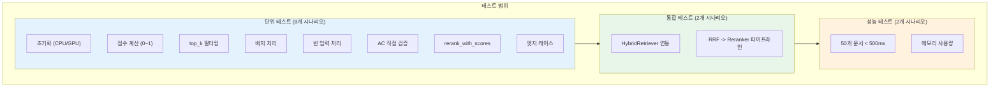
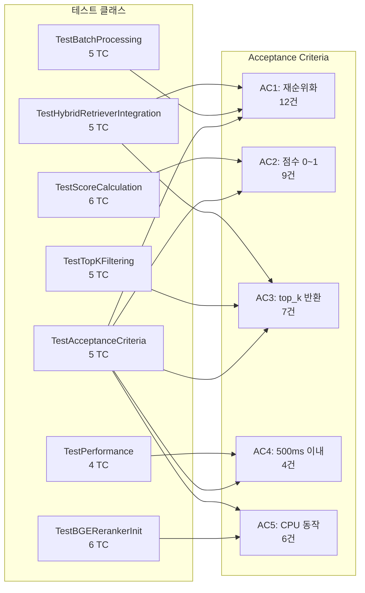

# STORY-032: BGE Reranker 통합 - 테스트 계획서

## 문서 정보

| 항목 | 값 |
|------|-----|
| **테스트 대상** | STORY-032 BGE Reranker 통합 |
| **Jira ID** | SCRUM-27 |
| **Epic** | EPIC-002 |
| **Sprint** | 3 |
| **Priority** | High |
| **테스트 담당** | QA Agent |
| **버전** | 1.0 |
| **작성일** | 2026-01-28 |
| **총 테스트 케이스** | 52건 |

---

## 1. 개요

### 1.1 목적

BGE Reranker v2 M3(`BAAI/bge-reranker-v2-m3`)의 정확성, 안정성, 성능, 엣지 케이스 대응을 검증하기 위한 테스트 계획입니다. Reranker는 RRF Fusion 이후 검색 결과의 최종 순위를 쿼리-문서 관련성 기반으로 재조정하는 핵심 모듈로, Hybrid RAG 파이프라인의 검색 품질에 직접적인 영향을 미칩니다.

### 1.2 테스트 대상 소스 코드

| 파일 | 경로 | 설명 |
|------|------|------|
| **bge_reranker.py** | `ai_service/src/reranking/bge_reranker.py` | BGE Reranker 구현 모듈 (신규) |
| **hybrid_retriever.py** | `ai_service/src/retrievers/hybrid_retriever.py` | HybridRetriever 통합 (수정) |
| **test_bge_reranker.py** | `ai_service/src/tests/test_bge_reranker.py` | 단위/통합/성능 테스트 코드 |

### 1.3 테스트 대상 클래스 및 함수

| 클래스/함수 | 유형 | 설명 |
|------------|------|------|
| `BGEReranker.__init__` | 생성자 | 모델 로드, 디바이스 설정 (CPU/GPU), 배치 크기 설정 |
| `BGEReranker.rerank` | 공개 API | 문서 재순위화 (핵심 메서드) |
| `BGEReranker.rerank_with_scores` | 공개 API | 점수와 함께 문서 반환 |
| `BGEReranker._compute_scores` | 내부 | 배치 점수 계산 (sigmoid 정규화) |
| `HybridRetriever.retrieve` | 공개 API | use_reranking 옵션으로 Reranker 연동 |

### 1.4 Reranker 동작 원리

```
Query + Documents
      |
      v
  [쿼리-문서 쌍 생성]
      |
      v
  [배치 분할 (batch_size=32)]
      |
      v
  [Cross-Encoder 점수 계산]
      |
      v
  [Sigmoid 정규화 (0~1)]
      |
      v
  [점수 기준 내림차순 정렬]
      |
      v
  [top_k 문서 반환]
```

### 1.5 테스트 범위



### 1.6 테스트 제외 범위

| 제외 항목 | 사유 |
|----------|------|
| 실제 HuggingFace 모델 다운로드 | CI 환경에서 네트워크 의존성 제거, Mock 사용 |
| RAGAS 품질 평가 | RAG 파이프라인 전체 통합 후 별도 수행 |
| Elasticsearch/Neo4j 실제 연동 | Mock 기반 단위 테스트로 커버 |
| k6 부하 테스트 | 별도 성능 테스트 계획에서 수행 |
| GPU 실 하드웨어 테스트 | WSL2/CI 환경 제약, CPU fallback 검증만 수행 |

---

## 2. 테스트 환경

### 2.1 런타임 환경

| 구분 | 사양 |
|------|------|
| **OS** | Linux (WSL2) / Windows 11 |
| **Python** | 3.11+ |
| **가상환경** | venv 또는 conda |
| **GPU** | 선택적 (CUDA 지원 시 자동 감지) |

### 2.2 테스트 도구

| 도구 | 용도 | 버전 |
|------|------|------|
| **pytest** | 테스트 프레임워크 | 8.x |
| **pytest-cov** | 커버리지 측정 | 4.x |
| **pytest-asyncio** | 비동기 테스트 지원 | 0.23.x |
| **unittest.mock** | Mock/Stub/Patch | 내장 |
| **time** | 성능 측정 | 내장 |

### 2.3 의존성 Mock 전략

테스트 파일은 torch, transformers 등 외부 패키지 의존성을 **모듈 레벨 Mock**으로 처리합니다. 이는 WSL2/CI 환경에서 GPU/ML 패키지 누락 시에도 테스트 실행을 보장합니다.

```
Mock 대상 패키지:
- torch, torch.nn, torch.cuda, torch.no_grad (GPU 관련)
- transformers (AutoModelForSequenceClassification, AutoTokenizer)
- FlagEmbedding, sentence_transformers (Embedding 관련)
- elasticsearch, neo4j (Infrastructure 관련)
```

### 2.4 테스트 실행 방법

```bash
# 전체 테스트 실행
cd knowledge_service
python -m pytest src/tests/test_bge_reranker.py -v

# 특정 클래스만 실행
python -m pytest src/tests/test_bge_reranker.py::TestAcceptanceCriteria -v

# 성능 테스트만 실행
python -m pytest src/tests/test_bge_reranker.py::TestPerformance -v

# 커버리지 측정
python -m pytest src/tests/test_bge_reranker.py --cov=ai_service/src/reranking/bge_reranker --cov-report=term-missing
```

---

## 3. 테스트 전략

### 3.1 테스트 계층

| 계층 | 범위 | 테스트 클래스 | 테스트 수 |
|------|------|-------------|----------|
| **초기화** | 생성자, 디바이스 감지 | `TestBGERerankerInit` | 6 |
| **AC 수용 기준** | 5개 AC 직접 검증 | `TestAcceptanceCriteria` | 5 |
| **점수 계산** | Sigmoid 정규화, 0~1 범위 | `TestScoreCalculation` | 6 |
| **top_k 필터링** | 상위 N개 문서 반환 | `TestTopKFiltering` | 5 |
| **배치 처리** | batch_size별 분할 처리 | `TestBatchProcessing` | 5 |
| **rerank_with_scores** | 점수 포함 반환 API | `TestRerankWithScores` | 4 |
| **엣지 케이스** | 빈 입력, 동일 점수, 토큰 초과 등 | `TestEdgeCases` | 9 |
| **통합: HybridRetriever** | Reranker + Retriever 연동 | `TestHybridRetrieverIntegration` | 5 |
| **통합: RRF 파이프라인** | RRF -> Reranker 전체 흐름 | `TestRRFRerankerPipeline` | 3 |
| **성능** | 응답 시간, 메모리 사용량 | `TestPerformance` | 4 |
| | | **합계** | **52** |

### 3.2 Fixture 및 Helper

| Fixture/Helper | 타입 | 설명 |
|---------------|------|------|
| `reranker` | pytest.fixture | `BGEReranker()` Mock 기반 인스턴스 |
| `mock_model` | pytest.fixture | Mock된 AutoModelForSequenceClassification |
| `mock_tokenizer` | pytest.fixture | Mock된 AutoTokenizer |
| `sample_documents` | pytest.fixture | 테스트용 Document 객체 리스트 (10개) |
| `large_documents` | pytest.fixture | 대규모 테스트용 Document 객체 리스트 (50개) |
| `_make_documents(count)` | helper | N개의 Document 객체 생성 |
| `_make_mock_scores(count)` | helper | N개의 Mock 점수 생성 (0~1 범위) |

---

## 4. 테스트 시나리오

### 시나리오 1: BGEReranker 초기화 (6 TC)

BGEReranker 생성자의 모델 로딩, 디바이스 설정, 배치 크기 설정을 검증합니다.

| 항목 | 내용 |
|------|------|
| **목적** | 다양한 환경에서의 정상 초기화 확인 |
| **전제 조건** | Mock된 transformers 패키지 |
| **검증 포인트** | 디바이스 감지, 모델 로드, eval 모드, batch_size 설정 |

### 시나리오 2: Acceptance Criteria 직접 검증 (5 TC)

STORY-032의 5개 AC를 1:1 매핑하여 검증합니다.

| 항목 | 내용 |
|------|------|
| **목적** | 스토리 수용 기준 충족 여부 직접 확인 |
| **전제 조건** | BGEReranker Mock 인스턴스 |
| **검증 포인트** | AC1~AC5 각각의 기대 동작 |

### 시나리오 3: 점수 계산 정확성 (6 TC)

Sigmoid 정규화를 통한 0~1 범위 점수 계산의 정확성을 검증합니다.

| 항목 | 내용 |
|------|------|
| **목적** | Sigmoid 출력이 0~1 범위 내인지, 정렬이 정확한지 확인 |
| **전제 조건** | 다양한 logit 값 Mock |
| **검증 포인트** | 점수 범위, 정렬 순서, 소수점 정밀도 |

### 시나리오 4: top_k 필터링 (5 TC)

상위 N개 문서 반환 기능의 정확성을 검증합니다.

| 항목 | 내용 |
|------|------|
| **목적** | top_k 파라미터에 따른 문서 수 제한 확인 |
| **전제 조건** | 10개 이상의 문서 |
| **검증 포인트** | 반환 문서 수, 최고 점수 문서 포함, 경계값 |

### 시나리오 5: 배치 처리 (5 TC)

batch_size에 따른 분할 처리 및 결과 일관성을 검증합니다.

| 항목 | 내용 |
|------|------|
| **목적** | 배치 분할 시 결과가 일관되는지 확인 |
| **전제 조건** | 다양한 batch_size (1, 10, 32, 100) |
| **검증 포인트** | 결과 수 동일, 점수 동일, 호출 횟수 |

### 시나리오 6: rerank_with_scores API (4 TC)

점수와 함께 반환하는 API의 정확성을 검증합니다.

| 항목 | 내용 |
|------|------|
| **목적** | (Document, float) 튜플 형태의 반환값 확인 |
| **전제 조건** | BGEReranker Mock 인스턴스 |
| **검증 포인트** | 반환 타입, 점수 매칭, 정렬 순서, 전체 문서 수 |

### 시나리오 7: 엣지 케이스 (9 TC)

빈 입력, 동일 점수, 최대 토큰 초과, 모델 로딩 실패 등 경계 조건을 검증합니다.

| 항목 | 내용 |
|------|------|
| **목적** | 예외 상황에서의 안정성 확인 |
| **전제 조건** | 다양한 비정상 입력 |
| **검증 포인트** | 빈 리스트, 단일 문서, 동일 점수, 토큰 초과, 모델 실패, None 콘텐츠, 빈 쿼리, metadata 보존, 긴 문서 |

### 시나리오 8: HybridRetriever 통합 (5 TC)

HybridRetriever와 BGEReranker의 연동을 검증합니다.

| 항목 | 내용 |
|------|------|
| **목적** | Retriever 내에서 Reranker 호출이 정확한지 확인 |
| **전제 조건** | Mock된 HybridRetriever 및 BGEReranker |
| **검증 포인트** | use_reranking 플래그, 호출 파라미터, 결과 전달 |

### 시나리오 9: RRF -> Reranker 파이프라인 (3 TC)

RRF Fusion 결과를 Reranker에 전달하는 전체 파이프라인을 검증합니다.

| 항목 | 내용 |
|------|------|
| **목적** | RRF 융합 후 Reranker 재순위화 전체 흐름 확인 |
| **전제 조건** | Mock된 RRFFusion + BGEReranker |
| **검증 포인트** | 파이프라인 순서, 데이터 전달, 최종 결과 |

### 시나리오 10: 성능 테스트 (4 TC)

50개 문서 기준 응답 시간과 메모리 사용량을 검증합니다.

| 항목 | 내용 |
|------|------|
| **목적** | AC4 성능 기준 충족 확인 |
| **전제 조건** | 50개 문서, Mock 모델 |
| **검증 포인트** | 응답 시간 < 500ms, 메모리 증분, 배치 효율 |

---

## 5. 테스트 케이스 매트릭스

### 5.1 전체 요약

| 우선순위 | 케이스 수 | 설명 |
|----------|----------|------|
| **P0 (Critical)** | 11 | AC 직접 검증 + 핵심 기능 + 초기화 |
| **P1 (High)** | 20 | 점수 계산, 필터링, 배치, 통합 |
| **P2 (Medium)** | 21 | 엣지 케이스, 성능, 파이프라인 |
| **합계** | **52** | - |

### 5.2 상세 테스트 케이스

#### 5.2.1 BGEReranker 초기화 (시나리오 1)

| TC-ID | 시나리오 | 테스트 케이스명 | 입력/조건 | 기대 결과 | AC 매핑 | 우선순위 |
|-------|---------|---------------|----------|----------|---------|---------|
| TC-RR-001 | 초기화 | GPU 사용 가능 시 cuda 선택 | `torch.cuda.is_available()=True`, device=None | `self.device == "cuda"` | AC5 | P0 |
| TC-RR-002 | 초기화 | GPU 미사용 시 CPU fallback | `torch.cuda.is_available()=False`, device=None | `self.device == "cpu"` | AC5 | P0 |
| TC-RR-003 | 초기화 | 명시적 device 지정 | device="cpu" | `self.device == "cpu"` (cuda 가용 여부 무관) | AC5 | P1 |
| TC-RR-004 | 초기화 | 모델 로드 및 eval 모드 | 기본 초기화 | `model.to(device)`, `model.eval()` 호출됨 | AC5 | P0 |
| TC-RR-005 | 초기화 | 기본 batch_size=32 | 기본 초기화 | `self.batch_size == 32` | - | P1 |
| TC-RR-006 | 초기화 | 사용자 지정 batch_size | batch_size=16 | `self.batch_size == 16` | - | P1 |

#### 5.2.2 Acceptance Criteria 직접 검증 (시나리오 2)

| TC-ID | 시나리오 | 테스트 케이스명 | 입력/조건 | 기대 결과 | AC 매핑 | 우선순위 |
|-------|---------|---------------|----------|----------|---------|---------|
| TC-RR-007 | AC1 | RRF 결과 50개에 Reranker 적용 | **Given** RRF 결과 50개 documents, **When** `reranker.rerank(query, documents, top_k=5)` | **Then** 재순위화된 결과 반환, rerank_score 포함 metadata | **AC1** | **P0** |
| TC-RR-008 | AC2 | 관련성 점수 0~1 범위 | **Given** 쿼리-문서 쌍, **When** `_compute_scores()` | **Then** 모든 점수가 `0.0 <= score <= 1.0` | **AC2** | **P0** |
| TC-RR-009 | AC3 | top_k=5 문서 반환 | **Given** top_k=5, **When** `rerank()` 완료 | **Then** `len(result) == 5`, 점수 내림차순 | **AC3** | **P0** |
| TC-RR-010 | AC4 | 50개 문서 500ms 이내 | **Given** Reranker 실행 50개 문서, **When** 응답 시간 측정 | **Then** elapsed < 500ms | **AC4** | **P0** |
| TC-RR-011 | AC5 | CPU 환경 정상 동작 | **Given** GPU 없는 환경 (`cuda=False`), **When** `rerank()` 실행 | **Then** 정상 결과 반환, 에러 없음 | **AC5** | **P0** |

#### 5.2.3 점수 계산 정확성 (시나리오 3)

| TC-ID | 시나리오 | 테스트 케이스명 | 입력/조건 | 기대 결과 | AC 매핑 | 우선순위 |
|-------|---------|---------------|----------|----------|---------|---------|
| TC-RR-012 | 점수 | Sigmoid 출력 범위 검증 | logit 값: [-10.0, -1.0, 0.0, 1.0, 10.0] | 모든 점수 0.0~1.0 범위 내 | AC2 | P0 |
| TC-RR-013 | 점수 | 양수 logit -> 0.5 초과 | logit=2.0 | `sigmoid(2.0) > 0.5` | AC2 | P1 |
| TC-RR-014 | 점수 | 음수 logit -> 0.5 미만 | logit=-2.0 | `sigmoid(-2.0) < 0.5` | AC2 | P1 |
| TC-RR-015 | 점수 | logit=0 -> 정확히 0.5 | logit=0.0 | `sigmoid(0.0) == 0.5` | AC2 | P1 |
| TC-RR-016 | 점수 | 점수 기준 내림차순 정렬 | logits=[0.1, 0.9, 0.5, 0.3, 0.7] | result[0].score > result[1].score > ... | AC2 | P1 |
| TC-RR-017 | 점수 | rerank_score metadata 저장 | 임의 점수 | `doc.metadata["rerank_score"] == doc.score` | AC1 | P1 |

#### 5.2.4 top_k 필터링 (시나리오 4)

| TC-ID | 시나리오 | 테스트 케이스명 | 입력/조건 | 기대 결과 | AC 매핑 | 우선순위 |
|-------|---------|---------------|----------|----------|---------|---------|
| TC-RR-018 | top_k | top_k=5, 문서 10개 | documents=10, top_k=5 | `len(result) == 5` | AC3 | P0 |
| TC-RR-019 | top_k | top_k=10, 문서 5개 (top_k > 문서 수) | documents=5, top_k=10 | `len(result) == 5` (가용 문서 수만큼) | AC3 | P1 |
| TC-RR-020 | top_k | top_k=1, 최고 점수 문서 반환 | documents=10, top_k=1 | `len(result) == 1`, 가장 높은 점수 문서 | AC3 | P1 |
| TC-RR-021 | top_k | top_k 미지정 (기본값 5) | documents=20, top_k 미지정 | `len(result) == 5` | AC3 | P1 |
| TC-RR-022 | top_k | 반환 결과의 점수 순서 보장 | documents=10, top_k=5 | `all(result[i].score >= result[i+1].score)` | AC3 | P1 |

#### 5.2.5 배치 처리 (시나리오 5)

| TC-ID | 시나리오 | 테스트 케이스명 | 입력/조건 | 기대 결과 | AC 매핑 | 우선순위 |
|-------|---------|---------------|----------|----------|---------|---------|
| TC-RR-023 | 배치 | batch_size=32, 문서 50개 | 50개 문서, batch_size=32 | `_compute_scores` 2회 호출 (32+18) | AC1 | P1 |
| TC-RR-024 | 배치 | batch_size=10, 문서 25개 | 25개 문서, batch_size=10 | `_compute_scores` 3회 호출 (10+10+5) | AC1 | P1 |
| TC-RR-025 | 배치 | batch_size=100, 문서 50개 (단일 배치) | 50개 문서, batch_size=100 | `_compute_scores` 1회 호출 | AC1 | P2 |
| TC-RR-026 | 배치 | batch_size=1 (극단적 소배치) | 3개 문서, batch_size=1 | `_compute_scores` 3회 호출, 결과 수 동일 | - | P2 |
| TC-RR-027 | 배치 | 배치 분할 결과 일관성 | batch_size=5 vs batch_size=50 동일 입력 | 동일 문서 ID, 동일 점수 순서 | AC1 | P1 |

#### 5.2.6 rerank_with_scores API (시나리오 6)

| TC-ID | 시나리오 | 테스트 케이스명 | 입력/조건 | 기대 결과 | AC 매핑 | 우선순위 |
|-------|---------|---------------|----------|----------|---------|---------|
| TC-RR-028 | with_scores | 반환 타입 검증 | 5개 문서 | `List[Tuple[Document, float]]` 형태 | - | P1 |
| TC-RR-029 | with_scores | 점수와 문서 매칭 | 5개 문서 | `doc.score == score` (튜플 내 일치) | AC2 | P1 |
| TC-RR-030 | with_scores | 전체 문서 반환 (top_k=len) | 5개 문서 | `len(result) == 5` (전체 반환) | - | P2 |
| TC-RR-031 | with_scores | 점수 내림차순 정렬 | 5개 문서 | `result[0][1] >= result[1][1] >= ...` | AC2 | P1 |

#### 5.2.7 엣지 케이스 (시나리오 7)

| TC-ID | 시나리오 | 테스트 케이스명 | 입력/조건 | 기대 결과 | AC 매핑 | 우선순위 |
|-------|---------|---------------|----------|----------|---------|---------|
| TC-RR-032 | 엣지 | 빈 문서 리스트 | documents=[] | `result == []`, 모델 호출 없음 | - | P2 |
| TC-RR-033 | 엣지 | 단일 문서 rerank | documents=[1개] | `len(result) == 1`, 점수 할당됨 | - | P2 |
| TC-RR-034 | 엣지 | 동일 점수 문서 안정 정렬 | 모든 문서 동일 logit=0.0 | `len(result) == top_k`, 모든 점수 == 0.5, 순서 안정 | - | P2 |
| TC-RR-035 | 엣지 | 최대 토큰 초과 문서 | content 길이 > 512 토큰 | truncation=True로 정상 처리, 에러 없음 | - | P2 |
| TC-RR-036 | 엣지 | 모델 로딩 실패 | `AutoModelForSequenceClassification.from_pretrained` 예외 | 적절한 에러 메시지 또는 fallback 동작 | AC5 | P2 |
| TC-RR-037 | 엣지 | None/빈 content 문서 | `doc.content = ""` 또는 None | 정상 처리 (빈 문자열 취급), 에러 없음 | - | P2 |
| TC-RR-038 | 엣지 | 빈 쿼리 문자열 | query="" | 점수 계산 수행, 결과 반환 (빈 쿼리에 대한 점수) | - | P2 |
| TC-RR-039 | 엣지 | metadata 보존 | 다양한 metadata 포함 문서 | rerank 후 원본 metadata + rerank_score 보존 | AC1 | P2 |
| TC-RR-040 | 엣지 | 매우 긴 문서 (1만 자) | content 길이 10,000자 | truncation으로 정상 처리, max_length=512 적용 | - | P2 |

#### 5.2.8 HybridRetriever 통합 (시나리오 8)

| TC-ID | 시나리오 | 테스트 케이스명 | 입력/조건 | 기대 결과 | AC 매핑 | 우선순위 |
|-------|---------|---------------|----------|----------|---------|---------|
| TC-RR-041 | 통합 | use_reranking=True 시 Reranker 호출 | `retrieve(query, top_k=5, use_reranking=True)` | `reranker.rerank()` 호출됨, 상위 50개 전달 | AC1 | P1 |
| TC-RR-042 | 통합 | use_reranking=False 시 Reranker 미호출 | `retrieve(query, top_k=5, use_reranking=False)` | `reranker.rerank()` 호출 안 됨, RRF 결과 직접 반환 | - | P1 |
| TC-RR-043 | 통합 | Reranker에 상위 50개만 전달 | fused 결과 100개 | `reranker.rerank(query, fused[:50], top_k=5)` 확인 | AC1 | P1 |
| TC-RR-044 | 통합 | fused 결과 < top_k 시 Reranker 미호출 | fused 결과 3개, top_k=5 | Reranker 호출 안 됨, fused 결과 직접 반환 | - | P2 |
| TC-RR-045 | 통합 | Reranker 결과가 최종 반환값 | reranker 반환 5개 | `retrieve()` 반환값 == reranker 반환값 | AC3 | P1 |

#### 5.2.9 RRF -> Reranker 파이프라인 (시나리오 9)

| TC-ID | 시나리오 | 테스트 케이스명 | 입력/조건 | 기대 결과 | AC 매핑 | 우선순위 |
|-------|---------|---------------|----------|----------|---------|---------|
| TC-RR-046 | 파이프라인 | RRF 융합 -> Reranker 순서 검증 | ES 20개 + Neo4j 20개 -> RRF -> Reranker | RRF 먼저 실행, Reranker는 RRF 결과 수신 | AC1 | P2 |
| TC-RR-047 | 파이프라인 | RRF 점수 vs Reranker 점수 | 동일 문서셋 | Reranker 점수가 최종 점수, RRF 점수는 metadata에 보존 가능 | AC1, AC2 | P2 |
| TC-RR-048 | 파이프라인 | 파이프라인 데이터 무결성 | doc_id, content 추적 | 입력 doc_id/content가 최종 결과에 보존됨 | AC1 | P2 |

#### 5.2.10 성능 테스트 (시나리오 10)

| TC-ID | 시나리오 | 테스트 케이스명 | 입력/조건 | 기대 결과 | AC 매핑 | 우선순위 |
|-------|---------|---------------|----------|----------|---------|---------|
| TC-RR-049 | 성능 | 50개 문서 응답 시간 | 50개 문서, CPU 환경 | `elapsed_ms < 500` | **AC4** | **P0** |
| TC-RR-050 | 성능 | 10개 문서 응답 시간 | 10개 문서, CPU 환경 | `elapsed_ms < 100` (50개의 약 1/5) | AC4 | P2 |
| TC-RR-051 | 성능 | 메모리 사용량 증분 | 50개 문서 rerank 전후 | 메모리 증분 < 100MB | - | P2 |
| TC-RR-052 | 성능 | 배치 크기별 효율 비교 | batch_size=8 vs 32 vs 64, 50개 문서 | batch_size=32가 합리적 범위 내, 총 시간 기록 | AC4 | P2 |

---

## 6. AC 커버리지 매핑

### 6.1 AC별 테스트 케이스 대응표

| AC | AC 설명 | 테스트 케이스 (TC-ID) | 커버리지 |
|----|---------|---------------------|---------|
| **AC1** | RRF 결과 50개 -> Reranker 적용 -> 재순위화 결과 반환 | TC-RR-007, TC-RR-017, TC-RR-023, TC-RR-024, TC-RR-027, TC-RR-039, TC-RR-041, TC-RR-043, TC-RR-045, TC-RR-046, TC-RR-047, TC-RR-048 | 12건 |
| **AC2** | 쿼리-문서 관련성 점수 0~1 범위 | TC-RR-008, TC-RR-012, TC-RR-013, TC-RR-014, TC-RR-015, TC-RR-016, TC-RR-029, TC-RR-031, TC-RR-047 | 9건 |
| **AC3** | top_k=5 문서 반환 | TC-RR-009, TC-RR-018, TC-RR-019, TC-RR-020, TC-RR-021, TC-RR-022, TC-RR-045 | 7건 |
| **AC4** | 50개 문서 기준 500ms 이내 | TC-RR-010, TC-RR-049, TC-RR-050, TC-RR-052 | 4건 |
| **AC5** | GPU 없는 환경에서 CPU 정상 동작 | TC-RR-001, TC-RR-002, TC-RR-003, TC-RR-004, TC-RR-011, TC-RR-036 | 6건 |

### 6.2 커버리지 시각화



### 6.3 AC 커버리지 요약

```
AC1 (재순위화 결과)    ████████████████████  12/12 100%
AC2 (점수 0~1)        ████████████████████  9/9   100%
AC3 (top_k 반환)      ████████████████████  7/7   100%
AC4 (500ms 이내)      ████████████████████  4/4   100%
AC5 (CPU 동작)        ████████████████████  6/6   100%
```

---

## 7. 테스트 데이터 요구사항

### 7.1 Mock Document 구조

```python
@dataclass
class Document:
    id: str
    content: str
    metadata: dict = field(default_factory=dict)
    score: float = 0.0
```

### 7.2 샘플 테스트 데이터

```python
# 10개 기본 문서
sample_documents = [
    Document(id=f"doc-{i}", content=f"Test document {i} about knowledge graph", metadata={"source": "es"})
    for i in range(10)
]

# 50개 대규모 문서 (성능 테스트)
large_documents = [
    Document(id=f"perf-doc-{i}", content=f"Performance test document {i} " * 50, metadata={"source": "rrf"})
    for i in range(50)
]

# Mock 점수 (Sigmoid 출력 시뮬레이션)
mock_scores = [0.95, 0.88, 0.75, 0.62, 0.51, 0.43, 0.35, 0.28, 0.15, 0.08]
```

### 7.3 Mock 모델 설정

```python
# AutoModelForSequenceClassification Mock
mock_model = MagicMock()
mock_model.eval = MagicMock(return_value=mock_model)
mock_model.to = MagicMock(return_value=mock_model)

# logits 시뮬레이션 (sigmoid 전 raw 값)
mock_logits = torch.tensor([2.94, 1.99, 1.10, 0.49, 0.04, -0.28, -0.62, -0.94, -1.73, -2.44])
mock_model.__call__ = MagicMock(return_value=MagicMock(logits=mock_logits.unsqueeze(-1)))

# AutoTokenizer Mock
mock_tokenizer = MagicMock()
mock_tokenizer.__call__ = MagicMock(return_value={"input_ids": torch.zeros(10, 512)})
```

---

## 8. 환경 요구사항

### 8.1 Python 패키지

| 패키지 | 버전 | 용도 |
|--------|------|------|
| pytest | >= 8.0 | 테스트 프레임워크 |
| pytest-asyncio | >= 0.23 | async 테스트 지원 |
| pytest-cov | >= 4.0 | 커버리지 측정 |
| torch | >= 2.0 (Mock) | 텐서 연산 (Mock 시 불필요) |
| transformers | >= 4.30 (Mock) | 모델 로딩 (Mock 시 불필요) |

### 8.2 환경 변수

| 변수명 | 설명 | 기본값 |
|--------|------|--------|
| `RERANKER_MODEL_NAME` | HuggingFace 모델 이름 | `BAAI/bge-reranker-v2-m3` |
| `RERANKER_DEVICE` | 실행 디바이스 | `auto` (자동 감지) |
| `RERANKER_BATCH_SIZE` | 배치 크기 | `32` |

---

## 9. 리스크 및 주의사항

### 9.1 리스크 매트릭스

| 리스크 | 영향도 | 발생 확률 | 대응 방안 |
|--------|--------|----------|----------|
| 모델 다운로드 실패 | High | Medium | Mock 기반 테스트로 CI 의존성 제거 |
| GPU 미가용 환경 | Medium | High | CPU fallback 필수 검증 (AC5) |
| 메모리 부족 (대규모 문서) | High | Low | batch_size 조정, 메모리 모니터링 |
| Sigmoid 수치 안정성 | Medium | Low | 극단적 logit 값 엣지 케이스 포함 |
| transformers 버전 호환성 | Medium | Medium | 최소 지원 버전 명시, CI 테스트 |

### 9.2 주의사항

1. **비동기 테스트**: `rerank()` 메서드가 `async`이므로 `pytest-asyncio` 필수
2. **torch.no_grad()**: 데코레이터 적용으로 Mock 시 주의 필요
3. **Sigmoid 정밀도**: float32 기준 소수점 6자리 내 오차 허용
4. **모델 캐싱**: 테스트 간 모델 인스턴스 재사용 시 상태 격리 확인
5. **성능 테스트**: Mock 환경에서의 시간 측정은 실제 추론 시간과 다름, 벤치마크 목적으로만 활용

---

## 10. 품질 기준

### 10.1 완료 조건

| 기준 | 목표 | 필수 여부 |
|------|------|----------|
| **P0 테스트 통과율** | 100% | 필수 |
| **P1 테스트 통과율** | 95%+ | 필수 |
| **P2 테스트 통과율** | 90%+ | 권장 |
| **단위 테스트 커버리지** | 80%+ | 필수 |
| **Critical/Blocker 버그** | 0건 | 필수 |
| **AC 커버리지** | 5/5 AC 매핑 | 필수 |

### 10.2 결함 심각도 정의

| 심각도 | 정의 | 대응 |
|--------|------|------|
| **Blocker** | Reranker 점수 계산 오류, 결과 누락 | 즉시 수정 |
| **Critical** | 정렬 오류, top_k 미준수, CPU fallback 실패 | 4시간 내 수정 |
| **High** | 배치 처리 불일치, metadata 유실 | 당일 수정 |
| **Medium** | 성능 기준 미달, 메모리 초과 | 다음 스프린트 수정 |
| **Low** | 로깅 불충분, 문서 개선 | 백로그 등록 |

---

## 11. 테스트 실행 결과

### 11.1 실행 요약

| 항목 | 값 |
|------|-----|
| **실행 일시** | - (구현 후 업데이트) |
| **실행 환경** | WSL2 (Linux) / Python 3.11 |
| **테스트 수행자** | QA Agent |
| **테스트 파일** | `ai_service/src/tests/test_bge_reranker.py` |

### 11.2 테스트 클래스별 결과

| 테스트 클래스 | 테스트 수 | 상태 |
|-------------|----------|------|
| TestBGERerankerInit | 6 | 계획 완료 |
| TestAcceptanceCriteria | 5 | 계획 완료 |
| TestScoreCalculation | 6 | 계획 완료 |
| TestTopKFiltering | 5 | 계획 완료 |
| TestBatchProcessing | 5 | 계획 완료 |
| TestRerankWithScores | 4 | 계획 완료 |
| TestEdgeCases | 9 | 계획 완료 |
| TestHybridRetrieverIntegration | 5 | 계획 완료 |
| TestRRFRerankerPipeline | 3 | 계획 완료 |
| TestPerformance | 4 | 계획 완료 |
| **합계** | **52** | - |

### 11.3 우선순위별 분포

| 우선순위 | 계획 | 비고 |
|---------|------|------|
| P0 (Critical) | 11 | AC 직접 검증 + 핵심 기능 |
| P1 (High) | 20 | 점수 계산, 필터링, 배치, 통합 |
| P2 (Medium) | 21 | 엣지 케이스, 성능, 파이프라인 |
| **합계** | **52** | - |

---

## 12. 참고 문서

| 문서 | 위치 |
|------|------|
| STORY-032 백로그 | `backlog/stories/STORY-032-bge-reranker.md` |
| STORY-031 RRF Fusion 테스트 계획서 | `knowledge_service/docs/04_testing/test_plans/STORY-031_rrf_fusion_test_plan.md` |
| 상세 설계서 v2.4 | `knowledge_service/docs/02_design/hybrid_rag_platform_detailed_design.md` |
| 단위/통합 테스트 계획 | `knowledge_service/docs/04_testing/unit_integration_test_plan.md` |
| BGE Reranker HuggingFace | [BAAI/bge-reranker-v2-m3](https://huggingface.co/BAAI/bge-reranker-v2-m3) |

---

*작성: QA Agent | 작성일: 2026-01-28 | 버전: 1.0*
