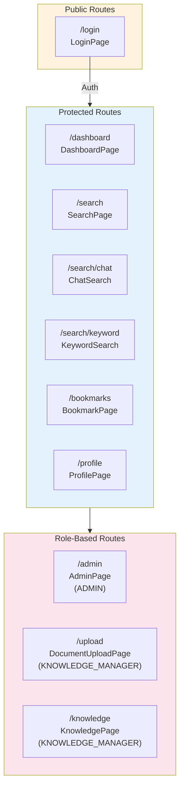

# UI E2E 테스트 계획서

**Version**: 1.0
**Created**: 2026-01-29
**Author**: QA Engineer (QA Agent)
**Status**: Active

---

## Table of Contents

1. [개요](#1-개요)
2. [테스트 범위](#2-테스트-범위)
3. [테스트 환경](#3-테스트-환경)
4. [테스트 시나리오](#4-테스트-시나리오)
   - [4.1 인증 플로우](#41-인증-플로우-tc-ui-auth)
   - [4.2 대시보드](#42-대시보드-tc-ui-dash)
   - [4.3 검색 기능](#43-검색-기능-tc-ui-search)
   - [4.4 대화형 검색 (Chat)](#44-대화형-검색-chat-tc-ui-chat)
   - [4.5 페이지 네비게이션](#45-페이지-네비게이션-tc-ui-nav)
   - [4.6 접근성 (Accessibility)](#46-접근성-accessibility-tc-ui-a11y)
5. [Playwright 설정](#5-playwright-설정)
6. [실행 방법](#6-실행-방법)
7. [CI/CD 통합](#7-cicd-통합)
8. [Quality Gates](#8-quality-gates)
9. [위험 평가 및 완화](#9-위험-평가-및-완화)
10. [Traceability Matrix](#10-traceability-matrix)
11. [Appendix](#11-appendix)

---

## 1. 개요

### 1.1 목적

본 문서는 Knowledge Portal Frontend의 사용자 관점 End-to-End (E2E) 테스트 계획을 정의합니다. Playwright를 사용하여 실제 브라우저 환경에서 사용자 시나리오를 검증하고, UI 컴포넌트의 통합 동작을 확인합니다.

### 1.2 테스트 도구

| 도구 | 버전 | 용도 |
|------|------|------|
| **Playwright** | 1.58.0+ | E2E Test Framework |
| **Chromium** | Latest | Primary Test Browser |
| **axe-core** | 4.x | Accessibility Testing |
| **Docker** | 24.x | Container-based Execution |

### 1.3 관련 문서

| 문서 | 경로 | 설명 |
|------|------|------|
| Playwright E2E Test Plan | `test_plans/E2E_playwright_test_plan.md` | 인증 중심 E2E 계획 |
| Frontend/Backend E2E Plan | `sprint04_frontend_backend_e2e_test_plan.md` | API 통합 E2E 계획 (25 시나리오) |
| Unit/Integration Test Plan | `unit_integration_test_plan.md` | 테스트 전략 참조 |
| Frontend Architecture | `../02_design/frontend_architecture.md` | 프론트엔드 아키텍처 |

### 1.4 기존 테스트 현황

현재 구현된 Playwright E2E 테스트:

```
knowledge_service/frontend/e2e/
├── auth.spec.ts              # 인증 테스트 (10 TC)
└── smoke-pages.spec.ts       # 페이지 스모크 테스트 (30+ TC)
```

**기존 테스트 커버리지**:
- Authentication: Login, Logout, Protected Routes
- Smoke Tests: BookmarkPage, ProfilePage, AdminPage, DocumentUploadPage
- Navigation: Sidebar navigation to new pages
- Route Protection: Unauthenticated access, Role-based access

---

## 2. 테스트 범위

### 2.1 In Scope

| 기능 영역 | 테스트 범위 | 우선순위 |
|----------|------------|----------|
| **인증 플로우** | 로그인, 로그아웃, 토큰 저장, 세션 관리 | P0 |
| **대시보드** | 통계 카드 표시, 최근 검색, Quick Search | P0 |
| **검색 기능** | 키워드 검색, 필터, 페이지네이션, 결과 표시 | P0 |
| **대화형 검색** | 질문 입력, 스트리밍 응답, 출처 표시, 취소 | P0 |
| **페이지 네비게이션** | 라우팅, 리다이렉트, 탭 전환 | P1 |
| **접근성** | WCAG 2.1 AA 준수, 키보드 네비게이션, 스크린 리더 | P1 |

### 2.2 Out of Scope (Phase 1)

| 항목 | 제외 사유 | 예정 Phase |
|------|----------|-----------|
| Multi-browser | Chromium 우선 전략 | Phase 2 |
| Mobile Responsive | Desktop 우선 전략 | Phase 2 |
| Visual Regression | Snapshot 기반 테스트 | Phase 3 |
| Performance Testing | k6 별도 테스트 | Phase 2 |
| Knowledge Management | 문서 업로드/편집 | Phase 2 |

### 2.3 테스트 대상 페이지



---

## 3. 테스트 환경

### 3.1 Prerequisites

| 구성 요소 | 버전 | 설명 |
|----------|------|------|
| Node.js | >= 18.0.0 | JavaScript Runtime |
| npm | >= 9.0.0 | Package Manager |
| Playwright | 1.58.0+ | E2E Test Framework |
| Chromium | Latest | Test Browser |

### 3.2 System Dependencies (WSL2/Linux)

```bash
# 필수 라이브러리 설치
sudo apt-get update
sudo apt-get install -y \
    libnss3 \
    libnspr4 \
    libasound2t64 \
    libatk1.0-0 \
    libatk-bridge2.0-0 \
    libatspi2.0-0 \
    libcairo2 \
    libcups2 \
    libdbus-1-3 \
    libdrm2 \
    libgbm1 \
    libglib2.0-0 \
    libpango-1.0-0 \
    libx11-6 \
    libxcb1 \
    libxcomposite1 \
    libxdamage1 \
    libxext6 \
    libxfixes3 \
    libxkbcommon0 \
    libxrandr2
```

### 3.3 Test Accounts

| 계정 유형 | Email | Password | Role | Usage |
|----------|-------|----------|------|-------|
| Admin | admin@example.com | admin123! | ADMIN | 관리자 기능 테스트 |
| Manager | manager@example.com | manager123! | KNOWLEDGE_MANAGER | 문서 관리 테스트 |
| Normal User | test@example.com / user@example.com | password123 / user123! | USER | 일반 기능 테스트 |
| Invalid | wrong@example.com | wrongpassword | - | 네거티브 테스트 |

### 3.4 Backend Services (Docker Compose)

| # | Service | Port | Required For |
|---|---------|------|-------------|
| 1 | Frontend (Vite dev server) | 3000 | 모든 UI 테스트 |
| 2 | API Gateway | 8080 | API 연동 테스트 |
| 3 | Backend Service | 8081 | 인증, CRUD 테스트 |
| 4 | AI Service | 8000 | 검색, SSE 스트리밍 |
| 5 | Keycloak | 8180 | SSO 인증 테스트 |
| 6 | PostgreSQL | 5432 | 데이터 저장 |
| 7 | Elasticsearch | 9200 | 검색 테스트 |

---

## 4. 테스트 시나리오

### 4.1 인증 플로우 (TC-UI-AUTH)

#### TC-UI-AUTH-001: 로그인 폼 표시

| 항목 | 내용 |
|------|------|
| **ID** | TC-UI-AUTH-001 |
| **Name** | 로그인 페이지 폼 요소 표시 |
| **Priority** | P0 (Critical) |
| **Precondition** | 비로그인 상태 |

| Step | Action | Expected |
|------|--------|----------|
| 1 | `/login` 페이지 접속 | 로그인 페이지 로드 완료 |
| 2 | 페이지 요소 확인 | 제목 "Knowledge Portal" 표시 |
| 3 | 폼 요소 확인 | 이메일 입력 필드, 비밀번호 입력 필드, 로그인 버튼 표시 |
| 4 | 추가 요소 확인 | Remember Me 체크박스, SSO 로그인 버튼 표시 |

**Automation**:
```typescript
test('should display login form', async ({ page }) => {
  await page.goto('/login');
  await expect(page.locator('h1')).toContainText('Knowledge Portal');
  await expect(page.locator('input[type="email"]')).toBeVisible();
  await expect(page.locator('input[type="password"]')).toBeVisible();
  await expect(page.locator('button[type="submit"]')).toBeVisible();
});
```

---

#### TC-UI-AUTH-002: 빈 필드 유효성 검증

| 항목 | 내용 |
|------|------|
| **ID** | TC-UI-AUTH-002 |
| **Name** | 빈 필드 제출 시 유효성 검증 |
| **Priority** | P0 (Critical) |
| **Precondition** | 로그인 페이지 접근 |

| Step | Action | Expected |
|------|--------|----------|
| 1 | 필드 비운 상태로 로그인 버튼 클릭 | HTML5 유효성 검증 실패 |
| 2 | 이메일 필드 검증 확인 | `validity.valid === false` |
| 3 | 에러 메시지 확인 | 필수 입력 메시지 표시 |

---

#### TC-UI-AUTH-003: 잘못된 자격 증명 에러

| 항목 | 내용 |
|------|------|
| **ID** | TC-UI-AUTH-003 |
| **Name** | 잘못된 자격 증명으로 로그인 시도 |
| **Priority** | P0 (Critical) |
| **Precondition** | 로그인 페이지 접근, 백엔드 서비스 실행 중 |

| Step | Action | Expected |
|------|--------|----------|
| 1 | 잘못된 이메일 입력 | `wrong@example.com` |
| 2 | 잘못된 비밀번호 입력 | `wrongpassword` |
| 3 | 로그인 버튼 클릭 | API 호출 실행 |
| 4 | 에러 메시지 확인 | `[role="alert"]` 요소에 에러 메시지 표시 |
| 5 | 페이지 상태 확인 | 로그인 페이지 유지, 필드 초기화 안 됨 |

---

#### TC-UI-AUTH-004: 정상 로그인 -> 대시보드 리다이렉트

| 항목 | 내용 |
|------|------|
| **ID** | TC-UI-AUTH-004 |
| **Name** | 정상 자격 증명으로 로그인 후 대시보드 이동 |
| **Priority** | P0 (Critical) |
| **Precondition** | 로그인 페이지 접근, 테스트 계정 존재 |

| Step | Action | Expected |
|------|--------|----------|
| 1 | 유효한 이메일 입력 | `test@example.com` |
| 2 | 유효한 비밀번호 입력 | `password123` |
| 3 | 로그인 버튼 클릭 | 로그인 API 호출 |
| 4 | 리다이렉트 확인 | URL이 `/login`에서 벗어남 |
| 5 | 대시보드 확인 | `/dashboard` 페이지 표시 |

**Automation**:
```typescript
test('should login and redirect to dashboard', async ({ page }) => {
  await page.goto('/login');
  await page.locator('input[type="email"]').fill('test@example.com');
  await page.locator('input[type="password"]').fill('password123');
  await page.locator('button[type="submit"]').click();
  await page.waitForURL((url) => !url.pathname.includes('/login'), { timeout: 10000 });
  expect(page.url()).not.toContain('/login');
});
```

---

#### TC-UI-AUTH-005: 로그아웃 -> 로그인 페이지 리다이렉트

| 항목 | 내용 |
|------|------|
| **ID** | TC-UI-AUTH-005 |
| **Name** | 로그아웃 후 로그인 페이지로 이동 |
| **Priority** | P0 (Critical) |
| **Precondition** | 로그인 상태 |

| Step | Action | Expected |
|------|--------|----------|
| 1 | 로그인 수행 | 대시보드 도착 |
| 2 | 로그아웃 버튼 찾기 | Header 또는 Sidebar에서 로그아웃 버튼 |
| 3 | 로그아웃 버튼 클릭 | 세션 종료, 토큰 제거 |
| 4 | 리다이렉트 확인 | `/login` 페이지로 이동 |

---

#### TC-UI-AUTH-006: 보호된 경로 접근 시 로그인 리다이렉트

| 항목 | 내용 |
|------|------|
| **ID** | TC-UI-AUTH-006 |
| **Name** | 비인증 상태에서 보호된 경로 접근 |
| **Priority** | P0 (Critical) |
| **Precondition** | 비로그인 상태 |

| Step | Action | Expected |
|------|--------|----------|
| 1 | `/dashboard` 직접 접근 | 로그인 페이지로 리다이렉트 |
| 2 | `/search` 직접 접근 | 로그인 페이지로 리다이렉트 |
| 3 | `/admin` 직접 접근 | 로그인 페이지로 리다이렉트 |

---

### 4.2 대시보드 (TC-UI-DASH)

#### TC-UI-DASH-001: 환영 메시지 표시

| 항목 | 내용 |
|------|------|
| **ID** | TC-UI-DASH-001 |
| **Name** | 로그인 후 사용자 이름과 환영 메시지 표시 |
| **Priority** | P0 (Critical) |
| **Related Story** | STORY-041 AC1 |
| **Precondition** | 로그인 완료 상태 |

| Step | Action | Expected |
|------|--------|----------|
| 1 | 대시보드 페이지 접근 | `/dashboard` 로드 |
| 2 | 환영 메시지 확인 | `[data-testid="welcome-section"]` 표시 |
| 3 | 인사말 확인 | "Good morning/afternoon/evening" 텍스트 |
| 4 | 사용자 이름 확인 | 로그인한 사용자 이름 표시 |

**Automation**:
```typescript
test('should display welcome message with user name', async ({ page }) => {
  await loginAsUser(page);
  await page.goto('/dashboard');
  await expect(page.locator('[data-testid="welcome-section"]')).toBeVisible();
  await expect(page.locator('[data-testid="welcome-section"]')).toContainText(/Good (morning|afternoon|evening)/);
});
```

---

#### TC-UI-DASH-002: 통계 카드 표시

| 항목 | 내용 |
|------|------|
| **ID** | TC-UI-DASH-002 |
| **Name** | 4개의 통계 카드 표시 |
| **Priority** | P0 (Critical) |
| **Related Story** | STORY-041 AC2 |
| **Precondition** | 대시보드 접근 |

| Step | Action | Expected |
|------|--------|----------|
| 1 | 대시보드 페이지 접근 | 페이지 로드 완료 |
| 2 | 통계 섹션 확인 | `[data-testid="stats-section"]` 표시 |
| 3 | 카드 1 확인 | "Total Documents" 카드 |
| 4 | 카드 2 확인 | "Search Queries" 카드 |
| 5 | 카드 3 확인 | "Active Users" 카드 |
| 6 | 카드 4 확인 | "Avg Response Time" 카드 |

---

#### TC-UI-DASH-003: Quick Search 입력 및 검색 페이지 이동

| 항목 | 내용 |
|------|------|
| **ID** | TC-UI-DASH-003 |
| **Name** | Quick Search로 검색 페이지 이동 |
| **Priority** | P1 (High) |
| **Related Story** | STORY-041 AC4 |
| **Precondition** | 대시보드 접근 |

| Step | Action | Expected |
|------|--------|----------|
| 1 | Quick Search 입력 필드 찾기 | 검색 입력 필드 표시 |
| 2 | 검색어 입력 | "JWT 인증" |
| 3 | Enter 키 입력 | 검색 실행 |
| 4 | 페이지 이동 확인 | `/search` 페이지로 이동 |

---

#### TC-UI-DASH-004: 최근 검색 목록 표시

| 항목 | 내용 |
|------|------|
| **ID** | TC-UI-DASH-004 |
| **Name** | 최근 5개 검색 기록 표시 |
| **Priority** | P1 (High) |
| **Related Story** | STORY-041 AC3 |
| **Precondition** | 대시보드 접근, 검색 기록 존재 |

| Step | Action | Expected |
|------|--------|----------|
| 1 | "Recent Searches" 섹션 확인 | 섹션 제목 표시 |
| 2 | 검색 기록 목록 확인 | 최대 5개 항목 표시 |
| 3 | 항목 삭제 버튼 확인 | 각 항목에 삭제 버튼 존재 |
| 4 | "Clear All" 버튼 확인 | 전체 삭제 버튼 존재 |

---

### 4.3 검색 기능 (TC-UI-SEARCH)

#### TC-UI-SEARCH-001: 검색 페이지 탭 전환

| 항목 | 내용 |
|------|------|
| **ID** | TC-UI-SEARCH-001 |
| **Name** | Chat Search / Keyword Search 탭 전환 |
| **Priority** | P0 (Critical) |
| **Precondition** | 검색 페이지 접근 |

| Step | Action | Expected |
|------|--------|----------|
| 1 | `/search` 페이지 접근 | SearchPage 로드 |
| 2 | 기본 탭 확인 | Chat Search 탭 활성화 |
| 3 | Keyword Search 탭 클릭 | 탭 전환, KeywordSearch 컴포넌트 표시 |
| 4 | Chat Search 탭 클릭 | 탭 전환, ChatSearch 컴포넌트 표시 |

**Automation**:
```typescript
test('should switch between search tabs', async ({ page }) => {
  await loginAsUser(page);
  await page.goto('/search');
  await expect(page.locator('[data-testid="search-page"]')).toBeVisible();

  // Switch to Keyword Search
  await page.getByRole('tab', { name: /Keyword/i }).click();
  await expect(page.locator('[data-testid="keyword-search"]')).toBeVisible();

  // Switch back to Chat Search
  await page.getByRole('tab', { name: /Chat/i }).click();
  await expect(page.locator('[data-testid="chat-search"]')).toBeVisible();
});
```

---

#### TC-UI-SEARCH-002: 키워드 검색 입력 및 결과

| 항목 | 내용 |
|------|------|
| **ID** | TC-UI-SEARCH-002 |
| **Name** | 키워드 입력 후 검색 결과 표시 |
| **Priority** | P0 (Critical) |
| **Related Story** | STORY-042 |
| **Precondition** | Keyword Search 탭 활성화, 백엔드 서비스 실행 |

| Step | Action | Expected |
|------|--------|----------|
| 1 | Keyword Search 탭 선택 | KeywordSearch 컴포넌트 표시 |
| 2 | 검색어 입력 | "JWT 인증 필터" |
| 3 | Search 버튼 클릭 | 로딩 인디케이터 표시 |
| 4 | 결과 대기 | 결과 카드 목록 표시 |
| 5 | 결과 확인 | 문서 제목, 스코어, 스니펫 표시 |

---

#### TC-UI-SEARCH-003: 검색 필터 적용

| 항목 | 내용 |
|------|------|
| **ID** | TC-UI-SEARCH-003 |
| **Name** | 검색 필터 패널 열기 및 필터 적용 |
| **Priority** | P1 (High) |
| **Related Story** | STORY-042 |
| **Precondition** | Keyword Search 탭 활성화 |

| Step | Action | Expected |
|------|--------|----------|
| 1 | Filters 버튼 클릭 | 필터 패널 열림 |
| 2 | 문서 유형 필터 선택 | dropdown/checkbox 동작 |
| 3 | 날짜 범위 필터 선택 | 날짜 선택 동작 |
| 4 | 검색 실행 | 필터 적용된 결과 반환 |
| 5 | 활성 필터 뱃지 확인 | 적용된 필터 수 표시 |

---

#### TC-UI-SEARCH-004: 검색 결과 페이지네이션

| 항목 | 내용 |
|------|------|
| **ID** | TC-UI-SEARCH-004 |
| **Name** | 검색 결과 페이지 이동 |
| **Priority** | P1 (High) |
| **Precondition** | 검색 결과가 10개 이상 |

| Step | Action | Expected |
|------|--------|----------|
| 1 | 검색 실행 | 결과 목록 표시 |
| 2 | 페이지네이션 확인 | "Page X of Y" 표시 |
| 3 | Next 버튼 클릭 | 다음 페이지 결과 로드 |
| 4 | Previous 버튼 클릭 | 이전 페이지 결과 로드 |

---

#### TC-UI-SEARCH-005: 검색 결과 없음 상태

| 항목 | 내용 |
|------|------|
| **ID** | TC-UI-SEARCH-005 |
| **Name** | 결과 없는 검색에 대한 빈 상태 표시 |
| **Priority** | P1 (High) |
| **Precondition** | Keyword Search 탭 활성화 |

| Step | Action | Expected |
|------|--------|----------|
| 1 | 존재하지 않는 검색어 입력 | "zzzxxx999nonexistent" |
| 2 | 검색 실행 | API 호출 완료 |
| 3 | 빈 상태 확인 | "No results found" 메시지 표시 |
| 4 | 안내 텍스트 확인 | "Try different keywords" 안내 |

---

### 4.4 대화형 검색 Chat (TC-UI-CHAT)

#### TC-UI-CHAT-001: 질문 입력 및 전송

| 항목 | 내용 |
|------|------|
| **ID** | TC-UI-CHAT-001 |
| **Name** | 채팅 입력 및 메시지 전송 |
| **Priority** | P0 (Critical) |
| **Related Story** | STORY-042, STORY-043 |
| **Precondition** | Chat Search 페이지 접근 |

| Step | Action | Expected |
|------|--------|----------|
| 1 | Chat Search 컴포넌트 확인 | `[data-testid="chat-search"]` 표시 |
| 2 | 입력 필드 찾기 | 텍스트 입력 영역 표시 |
| 3 | 질문 입력 | "RAG 시스템 동작 원리를 설명해주세요" |
| 4 | 전송 버튼 클릭 또는 Enter | 메시지 전송 |
| 5 | 사용자 메시지 확인 | 채팅 창에 사용자 질문 표시 |

---

#### TC-UI-CHAT-002: 스트리밍 응답 표시

| 항목 | 내용 |
|------|------|
| **ID** | TC-UI-CHAT-002 |
| **Name** | 토큰별 스트리밍 응답 표시 |
| **Priority** | P0 (Critical) |
| **Related Story** | STORY-043 AC1, AC2 |
| **Precondition** | 질문 전송 완료, AI Service 실행 중 |

| Step | Action | Expected |
|------|--------|----------|
| 1 | 질문 전송 | SSE 연결 시작 |
| 2 | 스트리밍 인디케이터 확인 | 로딩/타이핑 애니메이션 표시 |
| 3 | 토큰 수신 확인 | 텍스트가 점진적으로 나타남 |
| 4 | 응답 완료 확인 | 스트리밍 인디케이터 사라짐 |

**Automation**:
```typescript
test('should display streaming response', async ({ page }) => {
  await loginAsUser(page);
  await page.goto('/search');

  await page.locator('textarea, input[type="text"]').fill('RAG 시스템 설명');
  await page.locator('button[type="submit"]').click();

  // Wait for streaming indicator
  await expect(page.locator('[data-testid="streaming-indicator"]')).toBeVisible();

  // Wait for response to complete
  await page.waitForSelector('[data-testid="streaming-indicator"]', { state: 'hidden', timeout: 30000 });
});
```

---

#### TC-UI-CHAT-003: 응답 취소

| 항목 | 내용 |
|------|------|
| **ID** | TC-UI-CHAT-003 |
| **Name** | 스트리밍 중 취소 버튼 동작 |
| **Priority** | P0 (Critical) |
| **Related Story** | STORY-043 AC5 |
| **Precondition** | 스트리밍 진행 중 |

| Step | Action | Expected |
|------|--------|----------|
| 1 | 질문 전송 | 스트리밍 시작 |
| 2 | Cancel 버튼 찾기 | `[data-testid="cancel-stream-button"]` |
| 3 | Cancel 버튼 클릭 | 스트리밍 중단 |
| 4 | 상태 확인 | 스트리밍 인디케이터 사라짐 |
| 5 | 추가 토큰 확인 | 더 이상 토큰 추가 안 됨 |

---

#### TC-UI-CHAT-004: 출처 문서 표시

| 항목 | 내용 |
|------|------|
| **ID** | TC-UI-CHAT-004 |
| **Name** | AI 응답에 출처 문서 링크 표시 |
| **Priority** | P0 (Critical) |
| **Related Story** | STORY-043 AC3 |
| **Precondition** | 응답 완료 |

| Step | Action | Expected |
|------|--------|----------|
| 1 | 응답 완료 대기 | 전체 응답 수신 |
| 2 | 출처 섹션 확인 | "Sources" 또는 "참조" 섹션 표시 |
| 3 | 문서 링크 확인 | 클릭 가능한 문서 참조 |
| 4 | 링크 클릭 | 해당 문서로 이동 또는 상세 표시 |

---

#### TC-UI-CHAT-005: 에러 상태 표시 및 Dismiss

| 항목 | 내용 |
|------|------|
| **ID** | TC-UI-CHAT-005 |
| **Name** | 연결 에러 발생 시 에러 배너 표시 |
| **Priority** | P1 (High) |
| **Precondition** | AI Service 다운 또는 네트워크 에러 |

| Step | Action | Expected |
|------|--------|----------|
| 1 | 질문 전송 (서비스 다운 상태) | 에러 발생 |
| 2 | 에러 배너 확인 | `[role="alert"]` 에러 메시지 표시 |
| 3 | Dismiss 버튼 클릭 | 에러 배너 사라짐 |
| 4 | 재시도 가능 확인 | 입력 필드 활성화 상태 |

---

#### TC-UI-CHAT-006: 대화 히스토리 Clear

| 항목 | 내용 |
|------|------|
| **ID** | TC-UI-CHAT-006 |
| **Name** | 대화 기록 전체 삭제 |
| **Priority** | P1 (High) |
| **Precondition** | 대화 기록 존재 |

| Step | Action | Expected |
|------|--------|----------|
| 1 | 여러 메시지 교환 | 대화 기록 쌓임 |
| 2 | Clear 버튼 찾기 | 전체 삭제 버튼 표시 |
| 3 | Clear 버튼 클릭 | 모든 메시지 삭제 |
| 4 | 빈 상태 확인 | 초기 빈 채팅 화면 |

---

### 4.5 페이지 네비게이션 (TC-UI-NAV)

#### TC-UI-NAV-001: Sidebar 메뉴 네비게이션

| 항목 | 내용 |
|------|------|
| **ID** | TC-UI-NAV-001 |
| **Name** | Sidebar 메뉴를 통한 페이지 이동 |
| **Priority** | P1 (High) |
| **Related Story** | STORY-041 AC5 |
| **Precondition** | 로그인 상태 |

| Step | Action | Expected |
|------|--------|----------|
| 1 | Dashboard 메뉴 클릭 | `/dashboard`로 이동 |
| 2 | Search 메뉴 클릭 | `/search`로 이동 |
| 3 | Bookmarks 메뉴 클릭 | `/bookmarks`로 이동 |
| 4 | Profile 메뉴 클릭 | `/profile`로 이동 |

---

#### TC-UI-NAV-002: Role-Based 메뉴 표시

| 항목 | 내용 |
|------|------|
| **ID** | TC-UI-NAV-002 |
| **Name** | 역할에 따른 메뉴 항목 표시 |
| **Priority** | P1 (High) |
| **Precondition** | 다양한 역할로 로그인 |

| Step | Action | Expected |
|------|--------|----------|
| 1 | USER 역할로 로그인 | 기본 메뉴만 표시 |
| 2 | Admin 메뉴 확인 | Admin 메뉴 숨겨짐 |
| 3 | ADMIN 역할로 로그인 | Admin 메뉴 표시됨 |
| 4 | KNOWLEDGE_MANAGER로 로그인 | Upload, Knowledge 메뉴 표시됨 |

---

#### TC-UI-NAV-003: Header 사용자 정보 표시

| 항목 | 내용 |
|------|------|
| **ID** | TC-UI-NAV-003 |
| **Name** | Header에 로그인 사용자 정보 표시 |
| **Priority** | P1 (High) |
| **Precondition** | 로그인 상태 |

| Step | Action | Expected |
|------|--------|----------|
| 1 | Header 영역 확인 | 사용자 아바타 또는 이름 표시 |
| 2 | 드롭다운 메뉴 클릭 | Profile, Settings, Logout 옵션 |
| 3 | Profile 클릭 | `/profile` 페이지 이동 |
| 4 | Logout 클릭 | 로그아웃 수행 |

---

### 4.6 접근성 Accessibility (TC-UI-A11Y)

#### TC-UI-A11Y-001: 폼 라벨 및 ARIA

| 항목 | 내용 |
|------|------|
| **ID** | TC-UI-A11Y-001 |
| **Name** | 폼 요소에 적절한 라벨 연결 |
| **Priority** | P1 (High) |
| **Precondition** | 로그인 페이지 접근 |

| Step | Action | Expected |
|------|--------|----------|
| 1 | 이메일 필드 라벨 확인 | `<label>` 또는 `aria-label` 존재 |
| 2 | 비밀번호 필드 라벨 확인 | `<label>` 또는 `aria-label` 존재 |
| 3 | 버튼 접근성 확인 | 버튼에 의미있는 텍스트 |

---

#### TC-UI-A11Y-002: 키보드 네비게이션

| 항목 | 내용 |
|------|------|
| **ID** | TC-UI-A11Y-002 |
| **Name** | Tab 키로 모든 인터랙티브 요소 접근 |
| **Priority** | P1 (High) |
| **Precondition** | 로그인 페이지 접근 |

| Step | Action | Expected |
|------|--------|----------|
| 1 | 페이지 로드 후 Tab 키 입력 | 첫 번째 포커스 가능 요소로 이동 |
| 2 | 연속 Tab 입력 | 모든 인터랙티브 요소 순회 |
| 3 | Enter 키로 버튼 활성화 | 버튼 클릭 동작 수행 |
| 4 | Shift+Tab으로 역방향 이동 | 이전 요소로 포커스 이동 |

**Automation**:
```typescript
test('should be keyboard navigable', async ({ page }) => {
  await page.goto('/login');
  await page.click('body');
  await page.keyboard.press('Tab');

  const activeElement = await page.evaluate(() =>
    document.activeElement?.tagName?.toLowerCase()
  );
  expect(['input', 'button', 'a']).toContain(activeElement);
});
```

---

#### TC-UI-A11Y-003: 스크린 리더 Live Region

| 항목 | 내용 |
|------|------|
| **ID** | TC-UI-A11Y-003 |
| **Name** | 동적 콘텐츠 변경 시 스크린 리더 알림 |
| **Priority** | P1 (High) |
| **Related Component** | LiveRegion |
| **Precondition** | Chat Search 페이지 |

| Step | Action | Expected |
|------|--------|----------|
| 1 | 질문 전송 | 상태 변경 |
| 2 | Live Region 확인 | `aria-live="polite"` 영역에 상태 메시지 |
| 3 | 에러 발생 | `aria-live="assertive"` 영역에 에러 메시지 |

---

#### TC-UI-A11Y-004: 색상 대비 및 포커스 인디케이터

| 항목 | 내용 |
|------|------|
| **ID** | TC-UI-A11Y-004 |
| **Name** | WCAG AA 색상 대비 및 가시적 포커스 |
| **Priority** | P1 (High) |
| **Precondition** | 각 페이지 접근 |

| Step | Action | Expected |
|------|--------|----------|
| 1 | 텍스트 대비 확인 | 4.5:1 이상 대비율 |
| 2 | 포커스 상태 확인 | 포커스 링 또는 아웃라인 가시성 |
| 3 | 다크 모드 전환 | 다크 모드에서도 대비율 유지 |

---

## 5. Playwright 설정

### 5.1 현재 설정 (playwright.config.ts)

```typescript
import { defineConfig, devices } from '@playwright/test';

export default defineConfig({
  testDir: './e2e',
  fullyParallel: true,
  forbidOnly: !!process.env.CI,
  retries: process.env.CI ? 2 : 0,
  workers: process.env.CI ? 1 : undefined,
  reporter: [
    ['html', { outputFolder: 'playwright-report' }],
    ['list'],
  ],
  use: {
    baseURL: 'http://localhost:3000',
    trace: 'on-first-retry',
    screenshot: 'only-on-failure',
    video: 'retain-on-failure',
  },
  projects: [
    {
      name: 'chromium',
      use: { ...devices['Desktop Chrome'] },
    },
  ],
  webServer: {
    command: 'npm run dev',
    url: 'http://localhost:3000',
    reuseExistingServer: !process.env.CI,
    timeout: 120 * 1000,
  },
});
```

### 5.2 권장 추가 설정 (Phase 2+)

```typescript
// playwright.config.ts (확장)
export default defineConfig({
  // ... 기존 설정 ...

  projects: [
    {
      name: 'chromium',
      use: { ...devices['Desktop Chrome'] },
    },
    // Phase 2: Multi-browser
    {
      name: 'firefox',
      use: { ...devices['Desktop Firefox'] },
    },
    {
      name: 'webkit',
      use: { ...devices['Desktop Safari'] },
    },
    // Phase 2: Mobile
    {
      name: 'mobile-chrome',
      use: { ...devices['Pixel 5'] },
    },
  ],

  // Accessibility testing
  expect: {
    toHaveScreenshot: { maxDiffPixels: 100 },
  },
});
```

---

## 6. 실행 방법

### 6.1 설치

```bash
cd knowledge_service/frontend

# 의존성 설치
npm install

# Playwright 브라우저 설치
npx playwright install chromium --with-deps
```

### 6.2 테스트 실행 명령어

```bash
# 모든 E2E 테스트 실행
npm run test:e2e

# 브라우저 창 표시하며 실행 (디버깅)
npm run test:e2e:headed

# Playwright UI 모드 (인터랙티브 디버깅)
npm run test:e2e:ui

# 특정 테스트 파일만 실행
npx playwright test auth.spec.ts

# 특정 테스트 이름으로 필터링
npx playwright test -g "login"

# HTML 리포트 보기
npm run test:e2e:report
npx playwright show-report
```

### 6.3 package.json scripts

```json
{
  "scripts": {
    "test:e2e": "playwright test",
    "test:e2e:ui": "playwright test --ui",
    "test:e2e:headed": "playwright test --headed",
    "test:e2e:report": "playwright show-report"
  }
}
```

---

## 7. CI/CD 통합

### 7.1 GitHub Actions Workflow

```yaml
# .github/workflows/ui-e2e-test.yml
name: UI E2E Tests

on:
  push:
    branches: [main, develop]
    paths:
      - 'knowledge_service/frontend/**'
  pull_request:
    branches: [main, develop]
    paths:
      - 'knowledge_service/frontend/**'
  workflow_dispatch:

jobs:
  ui-e2e-test:
    runs-on: ubuntu-latest
    timeout-minutes: 30

    steps:
      - uses: actions/checkout@v4

      - name: Setup Node.js
        uses: actions/setup-node@v4
        with:
          node-version: '18'
          cache: 'npm'
          cache-dependency-path: 'knowledge_service/frontend/package-lock.json'

      - name: Install dependencies
        run: npm ci
        working-directory: knowledge_service/frontend

      - name: Install Playwright browsers
        run: npx playwright install chromium --with-deps
        working-directory: knowledge_service/frontend

      - name: Start Docker services (optional)
        run: |
          docker compose --profile frontend up -d
          ./scripts/wait_for_services.sh
        if: ${{ github.event.inputs.with_backend == 'true' }}

      - name: Run E2E tests
        run: npm run test:e2e
        working-directory: knowledge_service/frontend
        env:
          CI: true

      - name: Upload Playwright report
        uses: actions/upload-artifact@v4
        if: always()
        with:
          name: playwright-report
          path: knowledge_service/frontend/playwright-report/
          retention-days: 7

      - name: Upload test screenshots
        uses: actions/upload-artifact@v4
        if: failure()
        with:
          name: test-screenshots
          path: knowledge_service/frontend/test-results/
          retention-days: 7
```

### 7.2 실행 일정

| 실행 시점 | 테스트 범위 | 환경 |
|----------|-----------|------|
| Pre-commit | Smoke Test (auth.spec.ts) | Local |
| PR | Full Suite | CI (GitHub Actions) |
| Nightly | Full Suite + Visual Regression | CI |
| Release | Full Suite + Multi-browser | CI + Manual |

---

## 8. Quality Gates

### 8.1 Pass Criteria

| Metric | Threshold | Mandatory |
|--------|-----------|:---------:|
| P0 Test Pass Rate | 100% | YES |
| P1 Test Pass Rate | >= 90% | NO |
| Overall Pass Rate | >= 95% | NO |
| No Flaky Tests | 0 flaky in last 5 runs | YES |

### 8.2 Exit Criteria

- 모든 Critical (P0) 테스트 통과
- High (P1) 테스트 90% 이상 통과
- 테스트 리포트 생성 및 공유
- 스크린샷/비디오 실패 증거 수집

### 8.3 Test Count Summary

| Category | P0 | P1 | Total |
|----------|:--:|:--:|:-----:|
| Authentication (AUTH) | 4 | 2 | 6 |
| Dashboard (DASH) | 2 | 2 | 4 |
| Search (SEARCH) | 2 | 3 | 5 |
| Chat (CHAT) | 4 | 2 | 6 |
| Navigation (NAV) | 0 | 3 | 3 |
| Accessibility (A11Y) | 0 | 4 | 4 |
| **Total** | **12** | **16** | **28** |

---

## 9. 위험 평가 및 완화

| # | Risk | Probability | Impact | Mitigation |
|---|------|:-----------:|:------:|-----------|
| R1 | Backend Service Unavailable | Medium | High | Mock API responses for UI-only tests |
| R2 | WSL2 Chromium Compatibility | Low | Medium | Document system dependencies |
| R3 | SSE Streaming Timeout | Medium | Medium | Increase timeout for chat tests |
| R4 | Test Data Inconsistency | Medium | Low | Use seeded test accounts |
| R5 | Flaky Tests in CI | Medium | Medium | Add retries, use stable selectors |
| R6 | Dark Mode Testing Gap | Low | Low | Include dark mode variants in Phase 2 |

---

## 10. Traceability Matrix

### 10.1 Test Case to Story Mapping

| Test Case | STORY-041 | STORY-042 | STORY-043 | STORY-053 |
|-----------|:---------:|:---------:|:---------:|:---------:|
| TC-UI-AUTH-001 ~ 006 | | | | X |
| TC-UI-DASH-001 | X | | | |
| TC-UI-DASH-002 | X | | | |
| TC-UI-DASH-003 | X | | | |
| TC-UI-DASH-004 | X | | | |
| TC-UI-SEARCH-001 ~ 005 | | X | | |
| TC-UI-CHAT-001 | | X | X | |
| TC-UI-CHAT-002 | | | X | |
| TC-UI-CHAT-003 | | | X | |
| TC-UI-CHAT-004 | | | X | |
| TC-UI-CHAT-005 ~ 006 | | | X | |
| TC-UI-NAV-001 | X | | | |
| TC-UI-NAV-002 ~ 003 | | | | X |
| TC-UI-A11Y-001 ~ 004 | | | | |

### 10.2 Test File Structure (Target)

```
knowledge_service/frontend/
├── e2e/
│   ├── auth.spec.ts           # TC-UI-AUTH (existing)
│   ├── smoke-pages.spec.ts    # Smoke tests (existing)
│   ├── dashboard.spec.ts      # TC-UI-DASH (new)
│   ├── search.spec.ts         # TC-UI-SEARCH (new)
│   ├── chat-search.spec.ts    # TC-UI-CHAT (new)
│   ├── navigation.spec.ts     # TC-UI-NAV (new)
│   ├── accessibility.spec.ts  # TC-UI-A11Y (new)
│   └── helpers/
│       ├── auth.ts            # Login helper functions
│       └── fixtures.ts        # Test data fixtures
├── playwright.config.ts
├── playwright-report/         # Generated reports
└── test-results/              # Screenshots, videos
```

---

## 11. Appendix

### 11.1 Test Account Credentials

**Development Mode Only**:

| Role | Email | Password |
|------|-------|----------|
| Admin | admin@example.com | admin123! |
| Manager | manager@example.com | manager123! |
| User | user@example.com | user123! |
| User (alt) | test@example.com | password123 |

### 11.2 Common Test Helpers

```typescript
// e2e/helpers/auth.ts
import { Page } from '@playwright/test';

export async function loginAsAdmin(page: Page) {
  await page.goto('/login');
  await page.locator('input[type="email"]').fill('admin@example.com');
  await page.locator('input[type="password"]').fill('admin123!');
  await page.locator('button[type="submit"]').click();
  await page.waitForURL((url) => !url.pathname.includes('/login'), { timeout: 10000 });
}

export async function loginAsUser(page: Page) {
  await page.goto('/login');
  await page.locator('input[type="email"]').fill('test@example.com');
  await page.locator('input[type="password"]').fill('password123');
  await page.locator('button[type="submit"]').click();
  await page.waitForURL((url) => !url.pathname.includes('/login'), { timeout: 10000 });
}

export async function logout(page: Page) {
  const logoutBtn = page.locator('button:has-text("Logout"), button:has-text("로그아웃")');
  if (await logoutBtn.isVisible()) {
    await logoutBtn.click();
    await page.waitForURL('**/login', { timeout: 5000 });
  }
}
```

### 11.3 data-testid 목록

| Component | data-testid |
|-----------|-------------|
| SearchPage | `search-page` |
| KeywordSearch | `keyword-search` |
| ChatSearch | `chat-search` |
| DashboardPage | `dashboard-page` |
| WelcomeSection | `welcome-section` |
| StatsSection | `stats-section` |
| BookmarkPage | `bookmark-page` |
| ProfilePage | `profile-page` |
| AdminPage | `admin-page` |
| UploadPage | `upload-page` |
| CancelStreamButton | `cancel-stream-button` |
| KeywordSearchInput | `keyword-search-input` |
| KeywordSearchSubmit | `keyword-search-submit` |

### 11.4 Related Documents

| Document | Path |
|----------|------|
| Playwright Official Docs | https://playwright.dev |
| WCAG 2.1 Guidelines | https://www.w3.org/WAI/WCAG21/quickref/ |
| axe-core Rules | https://dequeuniversity.com/rules/axe/ |
| Frontend Architecture | `../02_design/frontend_architecture.md` |
| API Integration Design | `../02_design/api_integration_design.md` |

---

**Document Control**

| Version | Date | Author | Description |
|---------|------|--------|-------------|
| 1.0 | 2026-01-29 | QA Engineer | Initial creation - 28 test scenarios across 6 categories |

---

**End of Document**
