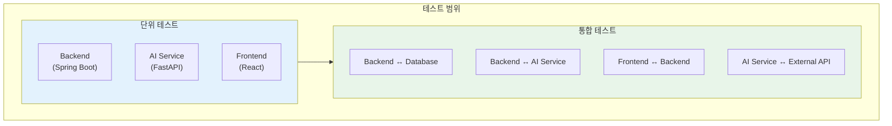
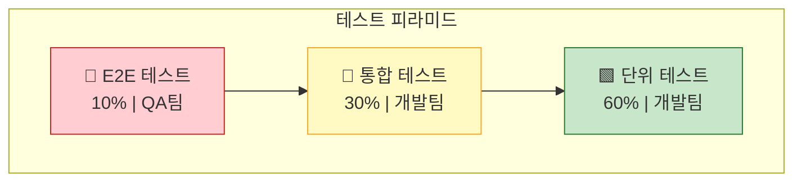
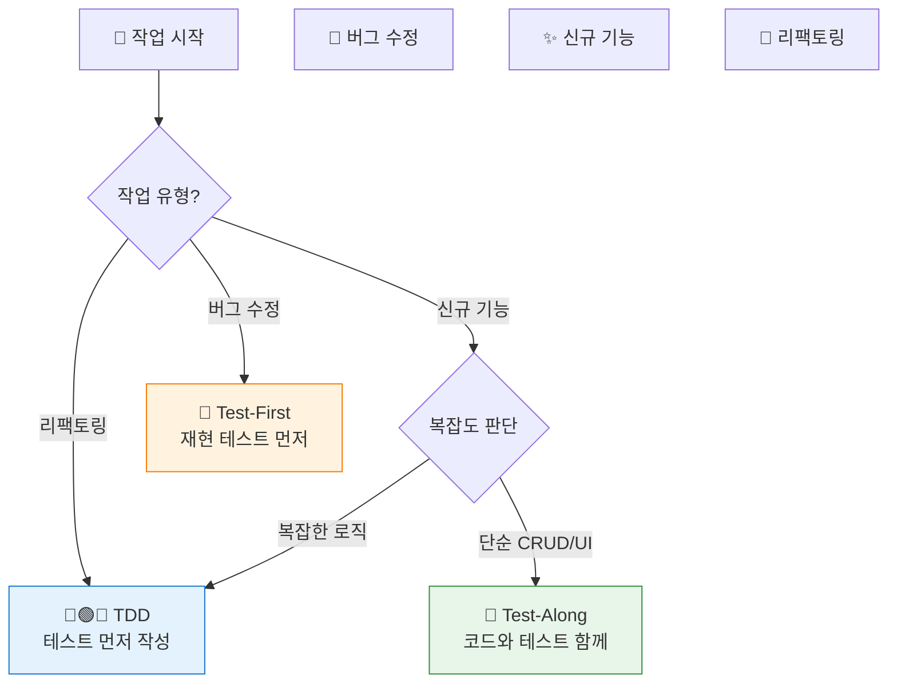
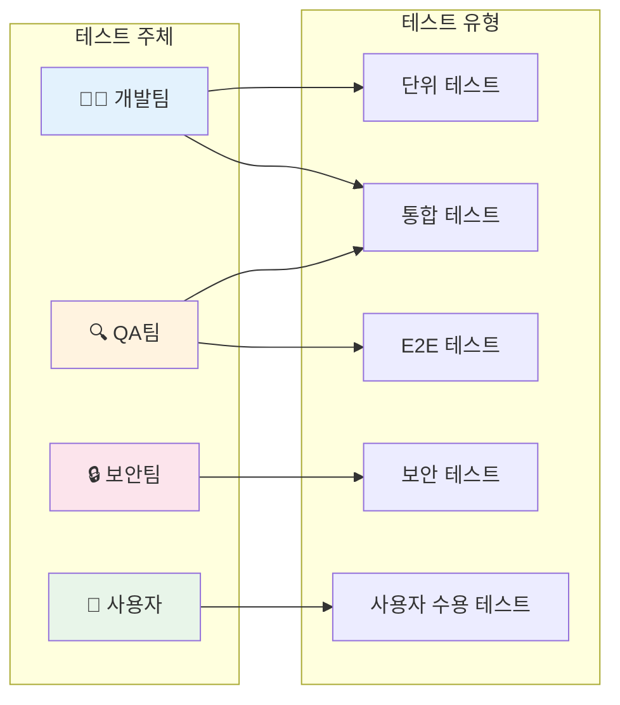
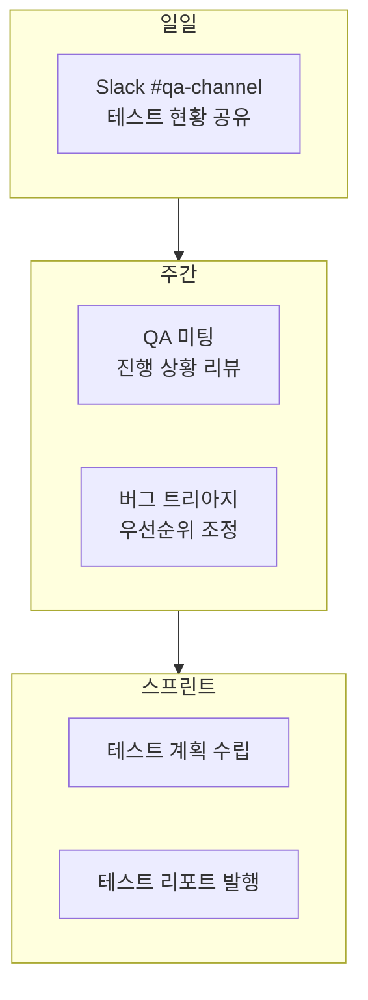
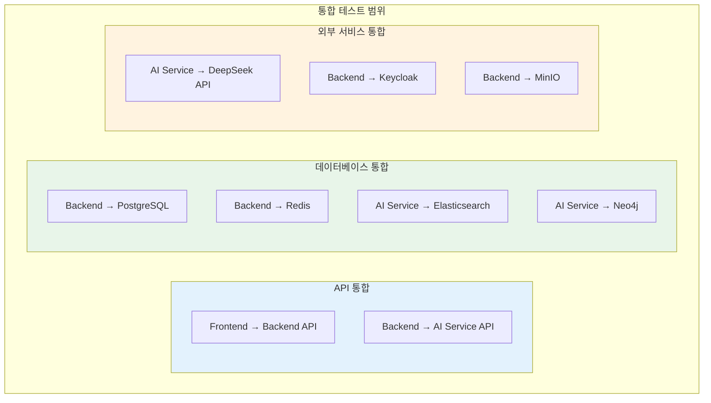
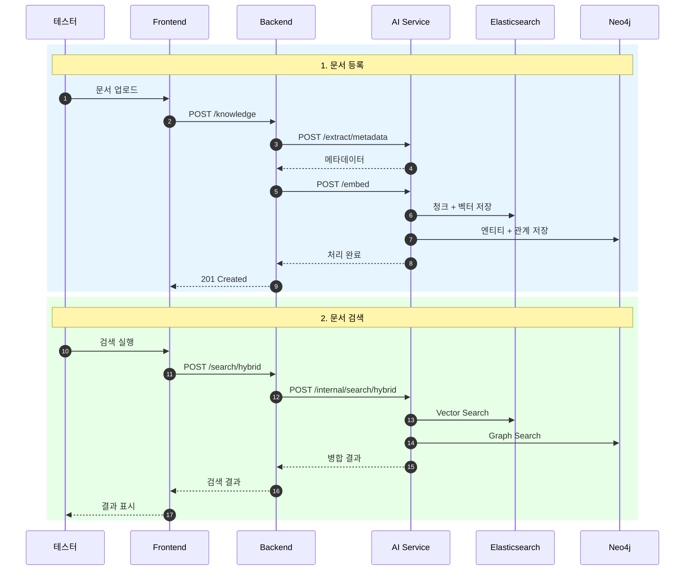
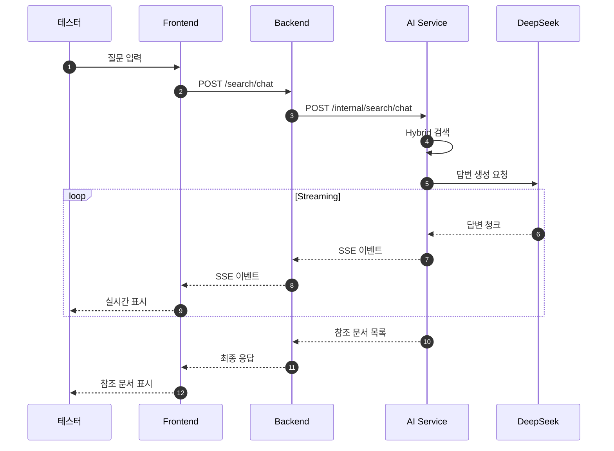
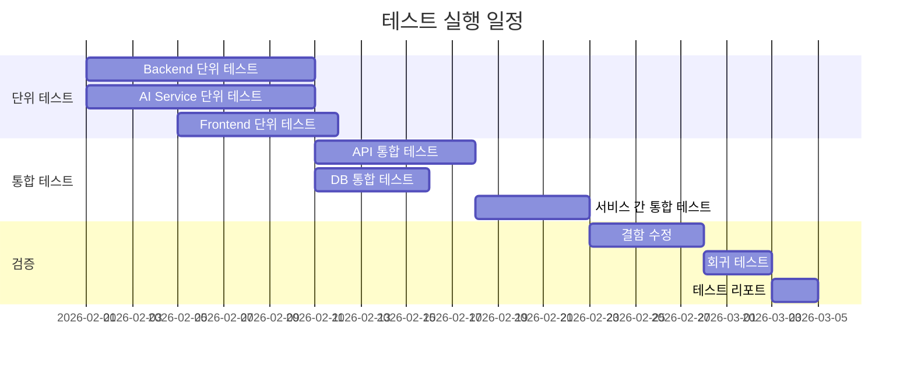

# 단위 테스트 및 통합 테스트 계획서

---

## 문서 정보

| 항목 | 내용 |
|------|------|
| **문서명** | 단위 테스트 및 통합 테스트 계획서 |
| **버전** | 1.0 |
| **작성일** | 2026-01-17 |
| **작성자** | Claude Code (Opus 4.5) |
| **상태** | Draft |
| **관련 문서** | [백엔드 설계서](../02_design/backend_detailed_design.md), [API 통합 설계서](../02_design/api_integration_design.md), [RAG 성능 테스트 설계서](../02_design/rag_performance_test_design.md) |

---

## 변경 이력

| 버전 | 일자 | 작성자 | 변경 내용 |
|------|------|--------|----------|
| 1.0 | 2026-01-17 | Claude Code | 초안 작성 |

---

## 목차

1. [개요](#1-개요)
2. [테스트 전략](#2-테스트-전략)
3. [테스트 주체 및 역할](#3-테스트-주체-및-역할)
4. [단위 테스트 계획](#4-단위-테스트-계획)
5. [통합 테스트 계획](#5-통합-테스트-계획)
6. [테스트 환경](#6-테스트-환경)
7. [테스트 도구](#7-테스트-도구)
8. [테스트 일정](#8-테스트-일정)
9. [품질 기준 및 완료 조건](#9-품질-기준-및-완료-조건)
10. [리스크 및 대응 방안](#10-리스크-및-대응-방안)

---

## 1. 개요

### 1.1 목적

본 문서는 Hybrid RAG Knowledge Platform의 **단위 테스트(Unit Test)** 및 **통합 테스트(Integration Test)** 수행을 위한 계획을 정의합니다.

### 1.2 범위



### 1.3 테스트 유형 정의

| 테스트 유형 | 정의 | 범위 |
|------------|------|------|
| **단위 테스트** | 개별 함수/메서드/컴포넌트의 독립적 동작 검증 | 클래스, 함수, React 컴포넌트 |
| **통합 테스트** | 여러 모듈 간의 상호작용 검증 | API 엔드포인트, DB 연동, 서비스 간 통신 |

### 1.4 테스트 제외 범위

| 제외 항목 | 사유 | 대체 방안 |
|----------|------|----------|
| E2E 테스트 | 별도 문서로 관리 | QA팀 E2E 테스트 계획서 |
| 성능 테스트 | 별도 문서로 관리 | [RAG 성능 테스트 설계서](../02_design/rag_performance_test_design.md) |
| 보안 테스트 | 별도 수행 | 보안팀 취약점 점검 |
| UAT | 사용자 주도 | 사용자 수용 테스트 계획서 |

---

## 2. 테스트 전략

### 2.1 테스트 피라미드



### 2.2 테스트 우선순위

| 우선순위 | 대상 | 이유 |
|---------|------|------|
| **P0 (Critical)** | 인증/인가, 검색 API, 문서 CRUD | 핵심 비즈니스 기능 |
| **P1 (High)** | AI Service 연동, 데이터 동기화 | 시스템 안정성 |
| **P2 (Medium)** | 북마크, 내보내기, 관리자 기능 | 부가 기능 |
| **P3 (Low)** | UI 컴포넌트, 유틸리티 함수 | 낮은 복잡도 |

### 2.3 테스트 접근 방식 (혼합 전략)

개발 상황에 따라 **TDD**, **Test-Along**, **Test-First** 세 가지 접근 방식을 선택적으로 적용합니다.

#### 2.3.1 접근 방식 선택 기준



#### 2.3.2 세 가지 접근 방식 정의

| 접근 방식 | 정의 | 워크플로우 |
|----------|------|-----------|
| **TDD** | 테스트를 먼저 작성하고 코드를 구현 | 🔴 실패 테스트 → 🟢 최소 구현 → 🔵 리팩토링 |
| **Test-Along** | 코드와 테스트를 함께 작성 (같은 커밋) | 코드 작성 → 테스트 작성 → 커밋 |
| **Test-First** | 버그 재현 테스트를 먼저 작성 | 🧪 재현 테스트 → 🔴 실패 확인 → 🛠️ 수정 → 🟢 통과 |

---

### 2.4 TDD 적용 기준 (상세)

#### 2.4.1 TDD 필수 적용 대상

> **Claude Code 개발자 에이전트 지침**: 아래 조건에 해당하면 **반드시 TDD**로 개발합니다.

| 카테고리 | 구체적 대상 | 이유 | 예시 |
|---------|-----------|------|------|
| **복잡한 알고리즘** | 계산 로직, 변환 로직, 정렬/필터링 | 엣지 케이스 많음, 요구사항 명확화 필요 | RRF 융합 알고리즘, 유사도 계산, 페이징 로직 |
| **비즈니스 규칙** | 권한 검증, 상태 전이, 유효성 검사 | 규칙이 복잡하고 예외 케이스 존재 | RBAC 권한 검사, 문서 상태 변경 규칙 |
| **에러 처리** | 예외 처리, Fallback, 재시도 로직 | 장애 시나리오 검증 필수 | Circuit Breaker, API 에러 핸들링 |
| **데이터 변환** | DTO 매핑, 포맷 변환, 직렬화 | 필드 누락, 타입 오류 방지 | Entity → DTO 변환, JSON 파싱 |
| **외부 연동 로직** | API 응답 처리, 프로토콜 구현 | 외부 시스템 변경에 대한 안전망 | DeepSeek API 응답 파싱, SSE 스트리밍 |

**TDD 필수 적용 코드 패턴:**

```
# 아래 키워드가 포함된 클래스/함수는 TDD 필수
- *Algorithm, *Calculator, *Processor
- *Validator, *Checker, *Verifier
- *Converter, *Mapper, *Transformer
- *Handler (ErrorHandler, ExceptionHandler)
- *Strategy, *Policy, *Rule
```

#### 2.4.2 TDD 워크플로우 (Claude Code 실행 절차)

```
1️⃣ [RED] 실패하는 테스트 작성
   ├─ 테스트 파일 생성 (예: KnowledgeServiceTest.java)
   ├─ 테스트 메서드 작성 (기대 동작 정의)
   └─ 테스트 실행 → 컴파일 에러 또는 실패 확인

2️⃣ [GREEN] 테스트를 통과하는 최소한의 코드 작성
   ├─ 프로덕션 코드 작성 (최소 구현)
   ├─ 테스트 실행 → 통과 확인
   └─ 추가 테스트 케이스 작성 → 반복

3️⃣ [REFACTOR] 코드 정리
   ├─ 중복 제거, 네이밍 개선
   ├─ 테스트 실행 → 여전히 통과 확인
   └─ 커밋
```

**TDD 사이클 예시 (Backend):**

```java
// 1️⃣ RED: 테스트 먼저 작성
@Test
@DisplayName("RRF 알고리즘 - 두 결과 목록 융합")
void rrfFusion_ShouldMergeResults() {
    // Given
    List<SearchResult> vectorResults = List.of(
        new SearchResult("doc1", 0.9),
        new SearchResult("doc2", 0.8)
    );
    List<SearchResult> graphResults = List.of(
        new SearchResult("doc2", 0.95),
        new SearchResult("doc3", 0.85)
    );

    // When
    List<SearchResult> fused = rrfAlgorithm.fuse(vectorResults, graphResults, 60);

    // Then
    assertThat(fused).hasSize(3);
    assertThat(fused.get(0).getId()).isEqualTo("doc2"); // 양쪽에 있으므로 1위
}

// 2️⃣ GREEN: 최소 구현
public class RRFAlgorithm {
    public List<SearchResult> fuse(List<SearchResult> list1, List<SearchResult> list2, int k) {
        Map<String, Double> scores = new HashMap<>();

        for (int i = 0; i < list1.size(); i++) {
            String id = list1.get(i).getId();
            scores.merge(id, 1.0 / (k + i + 1), Double::sum);
        }
        for (int i = 0; i < list2.size(); i++) {
            String id = list2.get(i).getId();
            scores.merge(id, 1.0 / (k + i + 1), Double::sum);
        }

        return scores.entrySet().stream()
            .sorted(Map.Entry.<String, Double>comparingByValue().reversed())
            .map(e -> new SearchResult(e.getKey(), e.getValue()))
            .toList();
    }
}

// 3️⃣ REFACTOR: 필요시 개선 후 테스트 재실행
```

---

### 2.5 Test-Along 적용 기준

#### 2.5.1 Test-Along 적용 대상

> **Claude Code 개발자 에이전트 지침**: 아래 조건에 해당하면 **Test-Along**으로 개발합니다.

| 카테고리 | 구체적 대상 | 이유 | 예시 |
|---------|-----------|------|------|
| **단순 CRUD** | 기본적인 생성/조회/수정/삭제 | 로직이 단순하고 예측 가능 | Repository 기본 메서드, 단순 Service |
| **UI 컴포넌트** | 표시 전용 컴포넌트, 레이아웃 | 시각적 확인 필요, 빠른 피드백 | Button, Card, List 컴포넌트 |
| **설정/구성** | Config 클래스, 상수 정의 | 테스트보다 검증이 빠름 | WebClientConfig, CorsConfig |
| **위임 메서드** | 단순 호출 전달 | 실제 로직이 없음 | Controller → Service 단순 위임 |

**Test-Along 적용 코드 패턴:**

```
# 아래 패턴은 Test-Along 허용
- 단순 getter/setter
- @Entity 클래스 (JPA)
- @Configuration 클래스
- 단순 Controller (Service 위임만)
- 상수 정의 클래스
```

#### 2.5.2 Test-Along 워크플로우

```
1️⃣ 프로덕션 코드 작성
   └─ 기능 구현

2️⃣ 테스트 코드 작성 (같은 작업 세션 내)
   ├─ 주요 경로 테스트
   └─ 경계값 테스트

3️⃣ 테스트 실행 → 통과 확인

4️⃣ 함께 커밋
   └─ "feat: 북마크 추가 기능 구현 및 테스트"
```

---

### 2.6 Test-First 적용 기준 (버그 수정)

#### 2.6.1 Test-First 필수 적용

> **Claude Code 개발자 에이전트 지침**: **버그 수정 시 반드시 Test-First**를 적용합니다.

| 단계 | 설명 | 목적 |
|------|------|------|
| 1. 재현 테스트 작성 | 버그를 재현하는 테스트 케이스 작성 | 버그 범위 명확화 |
| 2. 실패 확인 | 테스트 실행 → 실패 확인 | 버그 존재 증명 |
| 3. 버그 수정 | 코드 수정 | 문제 해결 |
| 4. 통과 확인 | 테스트 실행 → 통과 확인 | 수정 완료 증명 |
| 5. 회귀 테스트 | 기존 테스트 전체 실행 | 부작용 없음 확인 |

#### 2.6.2 Test-First 워크플로우 (버그 수정)

```
🐛 버그 리포트: "검색 결과에 삭제된 문서가 포함됨"

1️⃣ 재현 테스트 작성
@Test
@DisplayName("BUG-123: 삭제된 문서는 검색 결과에서 제외")
void search_ShouldExcludeDeletedDocuments() {
    // Given: 삭제된 문서 존재
    Knowledge deleted = createKnowledge(Status.DELETED);

    // When: 검색 실행
    List<SearchResult> results = searchService.search("test query");

    // Then: 삭제된 문서 미포함
    assertThat(results)
        .extracting(SearchResult::getId)
        .doesNotContain(deleted.getId());
}

2️⃣ 테스트 실행 → 실패 확인
   > FAILED: 삭제된 문서가 결과에 포함됨

3️⃣ 버그 수정
   - SearchService.java 수정
   - status != DELETED 필터 추가

4️⃣ 테스트 실행 → 통과 확인
   > PASSED

5️⃣ 전체 테스트 실행 (회귀 테스트)
   > All tests passed
```

---

### 2.7 접근 방식 선택 체크리스트

> **Claude Code 개발자 에이전트**: 작업 시작 전 아래 체크리스트로 접근 방식을 결정합니다.

```
┌─────────────────────────────────────────────────────────────────┐
│                    테스트 접근 방식 선택 가이드                    │
├─────────────────────────────────────────────────────────────────┤
│                                                                 │
│  Q1. 버그 수정인가?                                              │
│      ├─ YES → 🧪 Test-First (재현 테스트 먼저)                   │
│      └─ NO  → Q2로                                              │
│                                                                 │
│  Q2. 아래 중 하나라도 해당하는가?                                 │
│      • 복잡한 알고리즘/계산 로직                                  │
│      • 비즈니스 규칙/검증 로직                                    │
│      • 에러 처리/예외 핸들링                                      │
│      • 데이터 변환/매핑 로직                                      │
│      • 상태 전이/워크플로우                                       │
│      • 리팩토링                                                  │
│      ├─ YES → 🔴🟢🔵 TDD                                        │
│      └─ NO  → Q3로                                              │
│                                                                 │
│  Q3. 단순 CRUD / UI 컴포넌트 / 설정 클래스인가?                   │
│      ├─ YES → 📝 Test-Along                                     │
│      └─ NO  → 🔴🟢🔵 TDD (기본값)                                │
│                                                                 │
└─────────────────────────────────────────────────────────────────┘
```

### 2.8 테스트 접근 방식 요약표

| 상황 | 접근 방식 | 테스트 작성 시점 | 명령어 (Claude Code) |
|------|----------|----------------|---------------------|
| 복잡한 비즈니스 로직 | **TDD** | 코드 **전** | `/workflows:tdd-cycle` |
| 알고리즘 구현 | **TDD** | 코드 **전** | `/workflows:tdd-cycle` |
| 에러 핸들링 | **TDD** | 코드 **전** | `/workflows:tdd-cycle` |
| 리팩토링 | **TDD** | 코드 **전** | 기존 테스트 확인 후 진행 |
| 단순 CRUD | **Test-Along** | 코드와 **함께** | - |
| UI 컴포넌트 | **Test-Along** | 코드와 **함께** | - |
| 설정/구성 | **Test-Along** | 코드와 **함께** | - |
| 버그 수정 | **Test-First** | 코드 **전** (재현) | - |

---

## 3. 테스트 주체 및 역할

### 3.1 테스트 주체 정의



### 3.2 역할별 책임 (RACI)

| 활동 | 개발팀 | QA팀 | PL/PM | 비고 |
|------|:------:|:----:|:-----:|------|
| 단위 테스트 작성 | **R** | I | A | 섹션 2.3~2.8 기준에 따라 접근 방식 선택 |
| 단위 테스트 실행 | **R** | I | I | CI/CD 자동 실행 |
| 통합 테스트 작성 | **R** | C | A | 개발팀 주도, QA 검토 |
| 통합 테스트 실행 | **R** | **R** | I | 개발팀 + QA팀 공동 |
| 테스트 케이스 검토 | C | **R** | A | QA팀이 검토 주도 |
| 결함 등록 | **R** | **R** | I | 발견자가 등록 |
| 결함 수정 (Test-First) | **R** | I | A | **재현 테스트 먼저 작성 필수** |
| 결함 검증 | I | **R** | I | QA팀 재테스트 |
| 테스트 리포트 작성 | C | **R** | A | QA팀 작성 |

> **R**: Responsible (실행), **A**: Accountable (승인), **C**: Consulted (협의), **I**: Informed (통보)

### 3.3 테스트 주체별 상세 역할

#### 3.3.1 개발팀 (Development Team) - 인간 개발자

| 담당자 | 역할 | 책임 범위 |
|--------|------|----------|
| **Backend 개발자** | 단위/통합 테스트 작성 | Spring Boot 서비스, Repository, Controller |
| **AI 개발자** | 단위/통합 테스트 작성 | FastAPI 엔드포인트, LangGraph 워크플로우 |
| **Frontend 개발자** | 단위/통합 테스트 작성 | React 컴포넌트, 훅, 상태 관리 |

**개발팀 테스트 책임:**
- 섹션 2.7 체크리스트에 따라 테스트 접근 방식 선택
- 코드 커밋 전 단위 테스트 통과 필수
- PR 생성 시 테스트 커버리지 리포트 첨부
- 통합 테스트 시나리오 작성 및 구현
- 버그 수정 시 **Test-First** 적용 (재현 테스트 먼저)

#### 3.3.2 개발자 에이전트 (Claude Code) - AI 개발자

> **Claude Code**가 개발 작업 수행 시 아래 규칙을 따릅니다.

**Claude Code 단위 테스트 작성 규칙:**

```
┌─────────────────────────────────────────────────────────────────┐
│              Claude Code 단위 테스트 작성 프로토콜               │
├─────────────────────────────────────────────────────────────────┤
│                                                                 │
│  1️⃣ 작업 시작 시: 섹션 2.7 체크리스트로 접근 방식 결정          │
│                                                                 │
│  2️⃣ TDD 대상인 경우:                                           │
│     ├─ /workflows:tdd-cycle 사용 또는 수동 TDD 사이클           │
│     ├─ 🔴 테스트 먼저 작성                                      │
│     ├─ 테스트 실행하여 실패 확인                                 │
│     ├─ 🟢 최소한의 코드로 통과                                   │
│     ├─ 🔵 리팩토링                                              │
│     └─ 테스트 재실행하여 통과 확인                               │
│                                                                 │
│  3️⃣ Test-Along 대상인 경우:                                    │
│     ├─ 기능 코드 작성                                           │
│     ├─ 테스트 코드 작성 (같은 세션)                              │
│     ├─ 테스트 실행하여 통과 확인                                 │
│     └─ 함께 커밋                                                │
│                                                                 │
│  4️⃣ 버그 수정인 경우 (Test-First 필수):                         │
│     ├─ 🧪 재현 테스트 먼저 작성                                  │
│     ├─ 테스트 실행하여 실패 확인 (버그 증명)                     │
│     ├─ 🛠️ 버그 수정                                             │
│     ├─ 테스트 실행하여 통과 확인                                 │
│     └─ 전체 테스트 실행 (회귀 확인)                              │
│                                                                 │
│  5️⃣ 커밋 전 필수 확인:                                         │
│     ├─ 모든 테스트 통과                                         │
│     └─ 새 코드에 대한 테스트 존재                                │
│                                                                 │
└─────────────────────────────────────────────────────────────────┘
```

**Claude Code TDD 대상 판별 키워드:**

| TDD 필수 (키워드 포함 시) | Test-Along 허용 |
|-------------------------|-----------------|
| `*Algorithm`, `*Calculator` | `*Entity`, `*DTO` |
| `*Validator`, `*Checker` | `*Config`, `*Properties` |
| `*Converter`, `*Mapper` | `*Controller` (단순 위임) |
| `*Handler`, `*Processor` | `*Repository` (기본 CRUD) |
| `*Strategy`, `*Policy` | `*Constant`, `*Enum` |
| `*Service` (복잡한 로직) | UI 컴포넌트 (표시 전용) |

**Claude Code 테스트 실행 명령어:**

```bash
# Backend (Spring Boot)
./gradlew test                           # 전체 테스트
./gradlew test --tests "ClassName"       # 특정 클래스
./gradlew test --tests "*Test.methodName" # 특정 메서드

# AI Service (FastAPI)
pytest                                   # 전체 테스트
pytest tests/test_file.py               # 특정 파일
pytest -k "test_method_name"            # 특정 메서드

# Frontend (React)
npm run test                            # 전체 테스트
npm run test -- SearchBar.test.tsx      # 특정 파일
```

#### 3.3.2 QA팀 (Quality Assurance Team)

| 담당자 | 역할 | 책임 범위 |
|--------|------|----------|
| **QA 엔지니어** | 통합 테스트 검증 | API 테스트, 시나리오 검증 |
| **QA 리드** | 테스트 계획 수립 | 전체 테스트 전략, 품질 기준 |

**QA팀 테스트 책임:**
- 테스트 케이스 검토 및 보완
- 통합 테스트 결과 검증
- 테스트 리포트 작성 및 배포
- 품질 메트릭 관리

### 3.4 테스트 커뮤니케이션



---

## 4. 단위 테스트 계획

### 4.1 Backend 단위 테스트 (Spring Boot)

#### 4.1.1 테스트 대상

| 레이어 | 테스트 대상 | 테스트 방법 | 모킹 대상 |
|--------|-----------|------------|----------|
| **Controller** | REST API 엔드포인트 | `@WebMvcTest` | Service |
| **Service** | 비즈니스 로직 | `@ExtendWith(MockitoExtension)` | Repository, WebClient |
| **Repository** | 데이터 접근 | `@DataJpaTest` | 없음 (H2 사용) |
| **DTO/Entity** | 유효성 검증 | 직접 테스트 | 없음 |

#### 4.1.2 테스트 케이스 목록 (Backend)

| ID | 모듈 | 테스트 케이스 | 우선순위 | 담당 |
|----|------|-------------|---------|------|
| UT-BE-001 | AuthService | 토큰 검증 성공/실패 | P0 | Backend 개발자 |
| UT-BE-002 | AuthService | Refresh Token 갱신 | P0 | Backend 개발자 |
| UT-BE-003 | KnowledgeService | 지식 생성 | P0 | Backend 개발자 |
| UT-BE-004 | KnowledgeService | 지식 조회 (존재/미존재) | P0 | Backend 개발자 |
| UT-BE-005 | KnowledgeService | 지식 수정 권한 검증 | P0 | Backend 개발자 |
| UT-BE-006 | KnowledgeService | 지식 삭제 (소프트 삭제) | P1 | Backend 개발자 |
| UT-BE-007 | SearchService | 검색 요청 변환 | P0 | Backend 개발자 |
| UT-BE-008 | SearchService | 검색 결과 매핑 | P0 | Backend 개발자 |
| UT-BE-009 | AIServiceClient | Circuit Breaker 동작 | P1 | Backend 개발자 |
| UT-BE-010 | AIServiceClient | Fallback 응답 | P1 | Backend 개발자 |
| UT-BE-011 | AIServiceClient | Retry 로직 | P1 | Backend 개발자 |
| UT-BE-012 | BookmarkService | 북마크 추가/삭제 | P2 | Backend 개발자 |
| UT-BE-013 | ExportService | Excel 변환 | P2 | Backend 개발자 |
| UT-BE-014 | ExportService | PDF 변환 | P2 | Backend 개발자 |
| UT-BE-015 | UserService | 사용자 정보 조회 | P1 | Backend 개발자 |

#### 4.1.3 테스트 코드 예시 (Backend)

```java
// KnowledgeServiceTest.java
@ExtendWith(MockitoExtension.class)
class KnowledgeServiceTest {

    @Mock
    private KnowledgeRepository knowledgeRepository;

    @Mock
    private AIServiceClient aiServiceClient;

    @InjectMocks
    private KnowledgeServiceImpl knowledgeService;

    @Test
    @DisplayName("지식 생성 - 성공")
    void createKnowledge_Success() {
        // Given
        KnowledgeCreateRequest request = KnowledgeCreateRequest.builder()
            .title("테스트 문서")
            .content("테스트 내용")
            .documentType(DocumentType.TECHNICAL)
            .build();

        Knowledge savedKnowledge = Knowledge.builder()
            .id(UUID.randomUUID())
            .title(request.getTitle())
            .build();

        when(knowledgeRepository.save(any())).thenReturn(savedKnowledge);

        // When
        KnowledgeResponse response = knowledgeService.create(request, mockUser);

        // Then
        assertThat(response).isNotNull();
        assertThat(response.getTitle()).isEqualTo("테스트 문서");
        verify(knowledgeRepository, times(1)).save(any());
    }

    @Test
    @DisplayName("지식 조회 - 존재하지 않는 경우")
    void getKnowledge_NotFound() {
        // Given
        UUID knowledgeId = UUID.randomUUID();
        when(knowledgeRepository.findById(knowledgeId)).thenReturn(Optional.empty());

        // When & Then
        assertThatThrownBy(() -> knowledgeService.getById(knowledgeId))
            .isInstanceOf(KnowledgeNotFoundException.class)
            .hasMessageContaining("지식을 찾을 수 없습니다");
    }
}
```

### 4.2 AI Service 단위 테스트 (FastAPI)

#### 4.2.1 테스트 대상

| 모듈 | 테스트 대상 | 테스트 방법 | 모킹 대상 |
|------|-----------|------------|----------|
| **API Routes** | 엔드포인트 응답 | `TestClient` | Service |
| **Services** | 비즈니스 로직 | `pytest` + `unittest.mock` | External API, DB |
| **LangGraph** | 워크플로우 노드 | 개별 노드 테스트 | LLM Client |
| **Utils** | 유틸리티 함수 | `pytest` | 없음 |

#### 4.2.2 테스트 케이스 목록 (AI Service)

| ID | 모듈 | 테스트 케이스 | 우선순위 | 담당 |
|----|------|-------------|---------|------|
| UT-AI-001 | SearchService | Hybrid 검색 결과 병합 | P0 | AI 개발자 |
| UT-AI-002 | SearchService | RRF 알고리즘 | P0 | AI 개발자 |
| UT-AI-003 | EmbeddingService | 임베딩 생성 | P0 | AI 개발자 |
| UT-AI-004 | EmbeddingService | 배치 임베딩 | P1 | AI 개발자 |
| UT-AI-005 | EntityExtractor | 엔티티 추출 | P1 | AI 개발자 |
| UT-AI-006 | EntityExtractor | 관계 추출 | P1 | AI 개발자 |
| UT-AI-007 | MetadataExtractor | 유효 기간 추출 | P1 | AI 개발자 |
| UT-AI-008 | MetadataExtractor | 문서 유형 분류 | P1 | AI 개발자 |
| UT-AI-009 | ChunkingService | 텍스트 청킹 | P1 | AI 개발자 |
| UT-AI-010 | LangGraph | 검색 노드 실행 | P0 | AI 개발자 |
| UT-AI-011 | LangGraph | 답변 생성 노드 | P0 | AI 개발자 |
| UT-AI-012 | LLMClient | API 호출 및 응답 파싱 | P0 | AI 개발자 |
| UT-AI-013 | LLMClient | Rate Limit 처리 | P1 | AI 개발자 |
| UT-AI-014 | LLMClient | Fallback 모델 전환 | P1 | AI 개발자 |

#### 4.2.3 테스트 코드 예시 (AI Service)

```python
# tests/test_search_service.py
import pytest
from unittest.mock import Mock, patch
from app.services.search_service import SearchService, rrf_fusion

class TestSearchService:

    @pytest.fixture
    def search_service(self):
        return SearchService(
            es_client=Mock(),
            neo4j_client=Mock(),
            embedding_service=Mock()
        )

    def test_rrf_fusion_algorithm(self):
        """RRF 알고리즘 테스트"""
        # Given
        vector_results = [
            {"id": "doc1", "score": 0.9},
            {"id": "doc2", "score": 0.8},
            {"id": "doc3", "score": 0.7},
        ]
        graph_results = [
            {"id": "doc2", "score": 0.95},
            {"id": "doc4", "score": 0.85},
            {"id": "doc1", "score": 0.75},
        ]

        # When
        fused_results = rrf_fusion(vector_results, graph_results, k=60)

        # Then
        assert len(fused_results) == 4
        assert fused_results[0]["id"] in ["doc1", "doc2"]  # 두 결과 모두에 있는 문서가 상위

    @pytest.mark.asyncio
    async def test_hybrid_search_success(self, search_service):
        """Hybrid 검색 성공 테스트"""
        # Given
        search_service.es_client.search = Mock(return_value=[{"id": "doc1"}])
        search_service.neo4j_client.search = Mock(return_value=[{"id": "doc2"}])

        # When
        results = await search_service.hybrid_search(
            query="테스트 검색",
            top_k=10
        )

        # Then
        assert results is not None
        search_service.es_client.search.assert_called_once()
        search_service.neo4j_client.search.assert_called_once()

    @pytest.mark.asyncio
    async def test_hybrid_search_es_failure_fallback(self, search_service):
        """Elasticsearch 장애 시 Graph 결과만 반환"""
        # Given
        search_service.es_client.search = Mock(side_effect=Exception("ES Error"))
        search_service.neo4j_client.search = Mock(return_value=[{"id": "doc1"}])

        # When
        results = await search_service.hybrid_search(query="테스트")

        # Then
        assert len(results) == 1
        assert results[0]["id"] == "doc1"
```

### 4.3 Frontend 단위 테스트 (React)

#### 4.3.1 테스트 대상

| 유형 | 테스트 대상 | 테스트 방법 | 모킹 대상 |
|------|-----------|------------|----------|
| **컴포넌트** | UI 렌더링, 이벤트 | React Testing Library | API 호출 |
| **훅** | 커스텀 훅 로직 | `@testing-library/react-hooks` | API, Context |
| **유틸** | 유틸리티 함수 | Vitest | 없음 |
| **상태 관리** | Redux Slice | Redux mock store | 없음 |

#### 4.3.2 테스트 케이스 목록 (Frontend)

| ID | 모듈 | 테스트 케이스 | 우선순위 | 담당 |
|----|------|-------------|---------|------|
| UT-FE-001 | LoginForm | 로그인 폼 렌더링 | P0 | Frontend 개발자 |
| UT-FE-002 | LoginForm | 유효성 검증 메시지 | P0 | Frontend 개발자 |
| UT-FE-003 | SearchBar | 검색어 입력 및 제출 | P0 | Frontend 개발자 |
| UT-FE-004 | SearchResultList | 결과 목록 렌더링 | P0 | Frontend 개발자 |
| UT-FE-005 | ChatMessage | 채팅 메시지 표시 | P0 | Frontend 개발자 |
| UT-FE-006 | KnowledgeCard | 지식 카드 렌더링 | P1 | Frontend 개발자 |
| UT-FE-007 | useAuth | 인증 상태 관리 | P0 | Frontend 개발자 |
| UT-FE-008 | useSearch | 검색 훅 동작 | P0 | Frontend 개발자 |
| UT-FE-009 | authSlice | 로그인/로그아웃 액션 | P0 | Frontend 개발자 |
| UT-FE-010 | BookmarkButton | 북마크 토글 | P2 | Frontend 개발자 |

#### 4.3.3 테스트 코드 예시 (Frontend)

```typescript
// SearchBar.test.tsx
import { render, screen, fireEvent, waitFor } from '@testing-library/react';
import userEvent from '@testing-library/user-event';
import { SearchBar } from './SearchBar';

describe('SearchBar', () => {
  const mockOnSearch = vi.fn();

  beforeEach(() => {
    mockOnSearch.mockClear();
  });

  it('검색어 입력 및 제출', async () => {
    // Given
    render(<SearchBar onSearch={mockOnSearch} />);
    const input = screen.getByPlaceholderText('검색어를 입력하세요');
    const button = screen.getByRole('button', { name: '검색' });

    // When
    await userEvent.type(input, 'RAG 시스템');
    await userEvent.click(button);

    // Then
    expect(mockOnSearch).toHaveBeenCalledWith('RAG 시스템');
  });

  it('빈 검색어 제출 시 에러 메시지 표시', async () => {
    // Given
    render(<SearchBar onSearch={mockOnSearch} />);
    const button = screen.getByRole('button', { name: '검색' });

    // When
    await userEvent.click(button);

    // Then
    expect(screen.getByText('검색어를 입력해주세요')).toBeInTheDocument();
    expect(mockOnSearch).not.toHaveBeenCalled();
  });

  it('Enter 키로 검색 제출', async () => {
    // Given
    render(<SearchBar onSearch={mockOnSearch} />);
    const input = screen.getByPlaceholderText('검색어를 입력하세요');

    // When
    await userEvent.type(input, 'GraphRAG{enter}');

    // Then
    expect(mockOnSearch).toHaveBeenCalledWith('GraphRAG');
  });
});
```

---

## 5. 통합 테스트 계획

### 5.1 통합 테스트 범위



### 5.2 API 통합 테스트

#### 5.2.1 Backend API 통합 테스트

| ID | API | 테스트 시나리오 | 검증 항목 | 담당 |
|----|-----|---------------|----------|------|
| IT-API-001 | POST /auth/login | 로그인 성공 | JWT 발급, 토큰 구조 | 개발팀 |
| IT-API-002 | POST /auth/login | 로그인 실패 (잘못된 비밀번호) | 401 응답, 에러 메시지 | 개발팀 |
| IT-API-003 | POST /auth/refresh | 토큰 갱신 | 새 Access Token | 개발팀 |
| IT-API-004 | GET /knowledge | 목록 조회 | 페이징, 필터링 | 개발팀 |
| IT-API-005 | POST /knowledge | 지식 등록 | 201 응답, 생성된 ID | 개발팀 |
| IT-API-006 | GET /knowledge/{id} | 상세 조회 | 전체 필드 반환 | 개발팀 |
| IT-API-007 | PUT /knowledge/{id} | 지식 수정 | 수정된 내용 반영 | 개발팀 |
| IT-API-008 | DELETE /knowledge/{id} | 지식 삭제 | Soft Delete 확인 | 개발팀 |
| IT-API-009 | POST /search/hybrid | Hybrid 검색 | 검색 결과, relevance | 개발팀/QA |
| IT-API-010 | POST /search/chat | 채팅 검색 | 스트리밍 응답, 참조 문서 | 개발팀/QA |
| IT-API-011 | GET /bookmarks | 북마크 목록 | 사용자별 북마크 | 개발팀 |
| IT-API-012 | POST /export/excel | Excel 내보내기 | 파일 다운로드 | 개발팀 |

#### 5.2.2 Backend ↔ AI Service 통합 테스트

| ID | 호출 경로 | 테스트 시나리오 | 검증 항목 | 담당 |
|----|----------|---------------|----------|------|
| IT-INT-001 | Backend → AI /search/hybrid | 검색 요청 전달 | 요청 형식, 응답 매핑 | 개발팀 |
| IT-INT-002 | Backend → AI /search/chat | 채팅 스트리밍 | SSE 연결, 청크 수신 | 개발팀 |
| IT-INT-003 | Backend → AI /extract/metadata | 메타데이터 추출 | 응답 필드 완전성 | 개발팀 |
| IT-INT-004 | Backend → AI /embed | 임베딩 요청 | 벡터 차원, 형식 | 개발팀 |
| IT-INT-005 | Backend → AI (Circuit Breaker) | AI 서비스 장애 시 | Fallback 동작 | 개발팀 |
| IT-INT-006 | Backend → AI (Retry) | 일시적 오류 시 | 재시도 횟수, 간격 | 개발팀 |

### 5.3 데이터베이스 통합 테스트

#### 5.3.1 PostgreSQL 통합 테스트

| ID | 테스트 대상 | 테스트 시나리오 | 검증 항목 | 담당 |
|----|-----------|---------------|----------|------|
| IT-DB-001 | Knowledge CRUD | 생성 → 조회 → 수정 → 삭제 | 데이터 일관성 | 개발팀 |
| IT-DB-002 | User CRUD | 사용자 관리 | 중복 검사, 외래키 | 개발팀 |
| IT-DB-003 | Transaction | 복합 작업 롤백 | 원자성 보장 | 개발팀 |
| IT-DB-004 | Pagination | 대량 데이터 페이징 | 성능, 정확성 | 개발팀 |

#### 5.3.2 Elasticsearch 통합 테스트

| ID | 테스트 대상 | 테스트 시나리오 | 검증 항목 | 담당 |
|----|-----------|---------------|----------|------|
| IT-ES-001 | 인덱싱 | 문서 인덱싱 | 인덱스 생성, 매핑 | AI 개발자 |
| IT-ES-002 | Vector Search | kNN 검색 | 유사도 순위, 점수 | AI 개발자 |
| IT-ES-003 | Full-text Search | 텍스트 검색 | 한글 토크나이징 | AI 개발자 |
| IT-ES-004 | Aggregation | 집계 쿼리 | 카테고리별 통계 | AI 개발자 |

#### 5.3.3 Neo4j 통합 테스트

| ID | 테스트 대상 | 테스트 시나리오 | 검증 항목 | 담당 |
|----|-----------|---------------|----------|------|
| IT-NEO-001 | 노드 생성 | 엔티티 저장 | 노드 속성, 레이블 | AI 개발자 |
| IT-NEO-002 | 관계 생성 | 엔티티 간 관계 | 방향, 속성 | AI 개발자 |
| IT-NEO-003 | 그래프 탐색 | N-hop 탐색 | 경로 정확성 | AI 개발자 |
| IT-NEO-004 | Cypher 쿼리 | 복합 쿼리 | 결과 정확성 | AI 개발자 |

### 5.4 통합 테스트 시나리오 (End-to-End Flow)

#### 5.4.1 시나리오 1: 문서 등록 → 검색



**검증 항목:**
- [ ] 문서 메타데이터가 올바르게 추출되는가?
- [ ] 임베딩이 Elasticsearch에 저장되는가?
- [ ] 엔티티가 Neo4j에 저장되는가?
- [ ] 등록한 문서가 검색 결과에 나타나는가?
- [ ] 검색 관련도 점수가 적절한가?

#### 5.4.2 시나리오 2: 채팅 검색 (RAG)



**검증 항목:**
- [ ] 스트리밍 응답이 실시간으로 표시되는가?
- [ ] 답변이 검색된 문서를 기반으로 하는가?
- [ ] 참조 문서 목록이 정확한가?
- [ ] 응답 시간이 SLA 내인가? (< 3초 TTFB)

### 5.5 통합 테스트 코드 예시

#### 5.5.1 Backend API 통합 테스트 (Spring Boot)

```java
// KnowledgeApiIntegrationTest.java
@SpringBootTest(webEnvironment = WebEnvironment.RANDOM_PORT)
@AutoConfigureTestDatabase(replace = Replace.NONE)
@Testcontainers
class KnowledgeApiIntegrationTest {

    @Container
    static PostgreSQLContainer<?> postgres = new PostgreSQLContainer<>("postgres:16");

    @Autowired
    private TestRestTemplate restTemplate;

    @Autowired
    private KnowledgeRepository knowledgeRepository;

    private String accessToken;

    @BeforeEach
    void setUp() {
        // 테스트 사용자 로그인
        accessToken = loginAndGetToken("test@example.com", "password");
    }

    @Test
    @DisplayName("지식 CRUD 통합 테스트")
    void knowledgeCrudIntegration() {
        // 1. 생성
        KnowledgeCreateRequest createRequest = new KnowledgeCreateRequest(
            "테스트 문서", "내용", DocumentType.TECHNICAL
        );

        ResponseEntity<KnowledgeResponse> createResponse = restTemplate.exchange(
            "/api/v1/knowledge",
            HttpMethod.POST,
            new HttpEntity<>(createRequest, authHeaders()),
            KnowledgeResponse.class
        );

        assertThat(createResponse.getStatusCode()).isEqualTo(HttpStatus.CREATED);
        UUID knowledgeId = createResponse.getBody().getId();

        // 2. 조회
        ResponseEntity<KnowledgeResponse> getResponse = restTemplate.exchange(
            "/api/v1/knowledge/" + knowledgeId,
            HttpMethod.GET,
            new HttpEntity<>(authHeaders()),
            KnowledgeResponse.class
        );

        assertThat(getResponse.getBody().getTitle()).isEqualTo("테스트 문서");

        // 3. 수정
        KnowledgeUpdateRequest updateRequest = new KnowledgeUpdateRequest("수정된 제목", null, null);

        ResponseEntity<KnowledgeResponse> updateResponse = restTemplate.exchange(
            "/api/v1/knowledge/" + knowledgeId,
            HttpMethod.PUT,
            new HttpEntity<>(updateRequest, authHeaders()),
            KnowledgeResponse.class
        );

        assertThat(updateResponse.getBody().getTitle()).isEqualTo("수정된 제목");

        // 4. 삭제
        restTemplate.exchange(
            "/api/v1/knowledge/" + knowledgeId,
            HttpMethod.DELETE,
            new HttpEntity<>(authHeaders()),
            Void.class
        );

        // 5. 삭제 확인
        ResponseEntity<KnowledgeResponse> deletedResponse = restTemplate.exchange(
            "/api/v1/knowledge/" + knowledgeId,
            HttpMethod.GET,
            new HttpEntity<>(authHeaders()),
            KnowledgeResponse.class
        );

        assertThat(deletedResponse.getStatusCode()).isEqualTo(HttpStatus.NOT_FOUND);
    }

    private HttpHeaders authHeaders() {
        HttpHeaders headers = new HttpHeaders();
        headers.setBearerAuth(accessToken);
        return headers;
    }
}
```

#### 5.5.2 AI Service 통합 테스트 (pytest)

```python
# tests/integration/test_search_integration.py
import pytest
from httpx import AsyncClient
from testcontainers.elasticsearch import ElasticsearchContainer
from testcontainers.neo4j import Neo4jContainer

@pytest.fixture(scope="module")
def elasticsearch():
    with ElasticsearchContainer("elasticsearch:8.11.0") as es:
        yield es

@pytest.fixture(scope="module")
def neo4j():
    with Neo4jContainer("neo4j:5.15.0") as neo:
        yield neo

@pytest.mark.asyncio
async def test_hybrid_search_integration(elasticsearch, neo4j, test_app):
    """Hybrid 검색 통합 테스트"""
    async with AsyncClient(app=test_app, base_url="http://test") as client:
        # 1. 테스트 문서 인덱싱
        index_response = await client.post(
            "/internal/v1/index",
            json={
                "document_id": "test-doc-001",
                "content": "RAG 시스템은 검색과 생성을 결합합니다.",
                "metadata": {"document_type": "technical"}
            }
        )
        assert index_response.status_code == 200

        # 2. 검색 실행
        search_response = await client.post(
            "/internal/v1/search/hybrid",
            json={
                "query": "RAG 시스템이란?",
                "top_k": 5
            }
        )

        assert search_response.status_code == 200
        results = search_response.json()

        # 3. 검증
        assert len(results["results"]) > 0
        assert results["results"][0]["document_id"] == "test-doc-001"
        assert results["results"][0]["score"] > 0.5
```

---

## 6. 테스트 환경

### 6.1 환경 구성

| 환경 | 용도 | 구성 |
|------|------|------|
| **Local** | 개발자 단위 테스트 | Docker Compose (minimal) |
| **CI** | 자동화 테스트 | GitHub Actions + Testcontainers |
| **Staging** | 통합 테스트 | 운영 유사 환경 |

### 6.2 테스트 데이터베이스

```yaml
# docker-compose.test.yml
version: '3.8'

services:
  postgres-test:
    image: postgres:16
    environment:
      POSTGRES_DB: knowledge_test
      POSTGRES_USER: test
      POSTGRES_PASSWORD: test
    ports:
      - "5433:5432"

  elasticsearch-test:
    image: elasticsearch:8.11.0
    environment:
      - discovery.type=single-node
      - xpack.security.enabled=false
    ports:
      - "9201:9200"

  neo4j-test:
    image: neo4j:5.15.0
    environment:
      NEO4J_AUTH: none
    ports:
      - "7475:7474"
      - "7688:7687"

  redis-test:
    image: redis:7-alpine
    ports:
      - "6380:6379"
```

### 6.3 테스트 데이터 관리

| 항목 | 방법 | 위치 |
|------|------|------|
| **Fixture** | JSON/SQL 파일 | `src/test/resources/fixtures/` |
| **Factory** | 테스트 데이터 생성 | `src/test/java/factory/` |
| **Seed** | 초기 데이터 로딩 | `scripts/seed-test-data.sql` |

---

## 7. 테스트 도구

### 7.1 도구 목록

| 영역 | 도구 | 버전 | 용도 |
|------|------|------|------|
| **Backend** | JUnit 5 | 5.10+ | 단위/통합 테스트 |
| | Mockito | 5.x | 모킹 |
| | AssertJ | 3.x | 검증 |
| | Testcontainers | 1.19+ | 컨테이너 기반 테스트 |
| | REST Assured | 5.x | API 테스트 |
| **AI Service** | pytest | 8.x | 단위/통합 테스트 |
| | pytest-asyncio | 0.23+ | 비동기 테스트 |
| | httpx | 0.27+ | 비동기 HTTP 클라이언트 |
| | testcontainers-python | 4.x | 컨테이너 기반 테스트 |
| **Frontend** | Vitest | 1.x | 단위 테스트 |
| | React Testing Library | 14.x | 컴포넌트 테스트 |
| | MSW | 2.x | API 모킹 |
| **공통** | GitHub Actions | - | CI/CD |
| | SonarQube | 10.x | 코드 품질/커버리지 |

### 7.2 CI/CD 파이프라인

```yaml
# .github/workflows/test.yml
name: Test Pipeline

on:
  push:
    branches: [main, develop]
  pull_request:
    branches: [main, develop]

jobs:
  backend-test:
    runs-on: ubuntu-latest
    steps:
      - uses: actions/checkout@v4

      - name: Set up JDK 17
        uses: actions/setup-java@v4
        with:
          java-version: '17'
          distribution: 'temurin'

      - name: Run tests
        run: ./gradlew test

      - name: Upload coverage
        uses: codecov/codecov-action@v3

  ai-service-test:
    runs-on: ubuntu-latest
    steps:
      - uses: actions/checkout@v4

      - name: Set up Python
        uses: actions/setup-python@v5
        with:
          python-version: '3.11'

      - name: Install dependencies
        run: |
          pip install -r requirements.txt
          pip install -r requirements-test.txt

      - name: Run tests
        run: pytest --cov=app --cov-report=xml

  frontend-test:
    runs-on: ubuntu-latest
    steps:
      - uses: actions/checkout@v4

      - name: Set up Node
        uses: actions/setup-node@v4
        with:
          node-version: '20'

      - name: Install dependencies
        run: npm ci

      - name: Run tests
        run: npm run test:coverage
```

---

## 8. 테스트 일정

### 8.1 단계별 일정



### 8.2 마일스톤

| 마일스톤 | 목표 일자 | 완료 조건 |
|----------|----------|----------|
| **M1: 단위 테스트 완료** | 2026-02-15 | 커버리지 80% 이상 |
| **M2: 통합 테스트 완료** | 2026-02-25 | 모든 P0/P1 케이스 통과 |
| **M3: 테스트 사이클 완료** | 2026-03-01 | 결함 수정 및 회귀 테스트 완료 |

---

## 9. 품질 기준 및 완료 조건

### 9.1 커버리지 목표

| 영역 | 라인 커버리지 | 브랜치 커버리지 |
|------|-------------|---------------|
| **Backend** | ≥ 80% | ≥ 70% |
| **AI Service** | ≥ 75% | ≥ 65% |
| **Frontend** | ≥ 70% | ≥ 60% |

### 9.2 테스트 완료 조건

| 조건 | 기준 |
|------|------|
| **단위 테스트** | 모든 테스트 통과, 커버리지 목표 달성 |
| **통합 테스트** | P0/P1 케이스 100% 통과, P2 케이스 95% 통과 |
| **결함** | Critical/High 결함 0건, Medium 결함 잔존 허용 (계획된 수정 일정) |
| **성능** | 응답 시간 SLA 충족 |

### 9.3 결함 심각도 정의

| 심각도 | 정의 | 대응 |
|--------|------|------|
| **Critical** | 시스템 중단, 데이터 손실 | 즉시 수정 |
| **High** | 핵심 기능 불가 | 릴리스 전 수정 |
| **Medium** | 기능 제한, 우회 가능 | 다음 스프린트 수정 |
| **Low** | UI/UX 개선 | 백로그 등록 |

### 9.4 테스트 리포트 양식

```markdown
# 테스트 리포트

## 요약
- 테스트 기간: YYYY-MM-DD ~ YYYY-MM-DD
- 테스트 수행자: [이름]

## 결과 요약
| 항목 | 계획 | 실행 | 통과 | 실패 | 통과율 |
|------|------|------|------|------|--------|
| 단위 테스트 | 100 | 100 | 98 | 2 | 98% |
| 통합 테스트 | 50 | 50 | 48 | 2 | 96% |

## 커버리지
| 영역 | 목표 | 달성 | 상태 |
|------|------|------|------|
| Backend | 80% | 82% | ✅ |
| AI Service | 75% | 78% | ✅ |
| Frontend | 70% | 71% | ✅ |

## 미해결 결함
| ID | 심각도 | 설명 | 담당자 | 예상 수정일 |
|----|--------|------|--------|------------|
| BUG-001 | Medium | ... | ... | ... |

## 리스크
- ...

## 권고 사항
- ...
```

---

## 10. 리스크 및 대응 방안

### 10.1 리스크 목록

| ID | 리스크 | 확률 | 영향 | 대응 방안 |
|----|--------|------|------|----------|
| R1 | AI Service Mock 불완전 | 중 | 높음 | Testcontainers 활용, 실제 서비스 일부 사용 |
| R2 | 테스트 데이터 불충분 | 중 | 중 | 데이터 생성 자동화, 운영 데이터 익명화 |
| R3 | 외부 API 의존성 | 높음 | 중 | WireMock으로 모킹, Rate Limit 고려 |
| R4 | 테스트 환경 불안정 | 낮음 | 높음 | Docker Compose 기반 환경 표준화 |
| R5 | 일정 지연 | 중 | 중 | P0/P1 우선 테스트, 병렬 실행 |

### 10.2 외부 API 모킹 전략

```java
// WireMock을 사용한 DeepSeek API 모킹
@WireMockTest
class LLMClientIntegrationTest {

    @BeforeEach
    void setUp(WireMockRuntimeInfo wmRuntimeInfo) {
        stubFor(post(urlEqualTo("/v1/chat/completions"))
            .willReturn(aResponse()
                .withHeader("Content-Type", "application/json")
                .withBody("""
                    {
                        "choices": [{
                            "message": {
                                "content": "테스트 응답입니다."
                            }
                        }],
                        "usage": {
                            "prompt_tokens": 100,
                            "completion_tokens": 50
                        }
                    }
                    """)));
    }
}
```

---

## 부록

### A. 테스트 케이스 템플릿

```markdown
## 테스트 케이스: [TC-ID]

### 기본 정보
- **테스트명**: [테스트 이름]
- **우선순위**: P0 / P1 / P2 / P3
- **테스트 유형**: 단위 / 통합
- **담당자**: [이름]

### 사전 조건
- [조건 1]
- [조건 2]

### 테스트 단계
1. [단계 1]
2. [단계 2]
3. [단계 3]

### 기대 결과
- [결과 1]
- [결과 2]

### 실제 결과
- [ ] 통과
- [ ] 실패 (사유: )

### 비고
- [추가 정보]
```

### B. 참고 문서

| 문서 | 위치 |
|------|------|
| 백엔드 상세 설계서 | [backend_detailed_design.md](../02_design/backend_detailed_design.md) |
| API 통합 설계서 | [api_integration_design.md](../02_design/api_integration_design.md) |
| RAG 성능 테스트 설계서 | [rag_performance_test_design.md](../02_design/rag_performance_test_design.md) |
| 에러 코드 표준 | [error_code_standards.md](../02_design/error_code_standards.md) |

---

**문서 끝**

**작성**: Claude Code (Opus 4.5)
**최종 수정**: 2026-01-17
