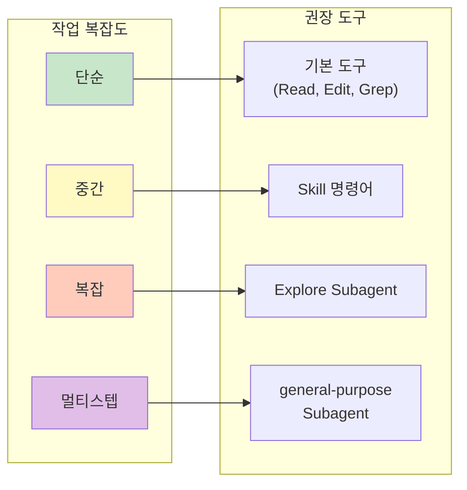
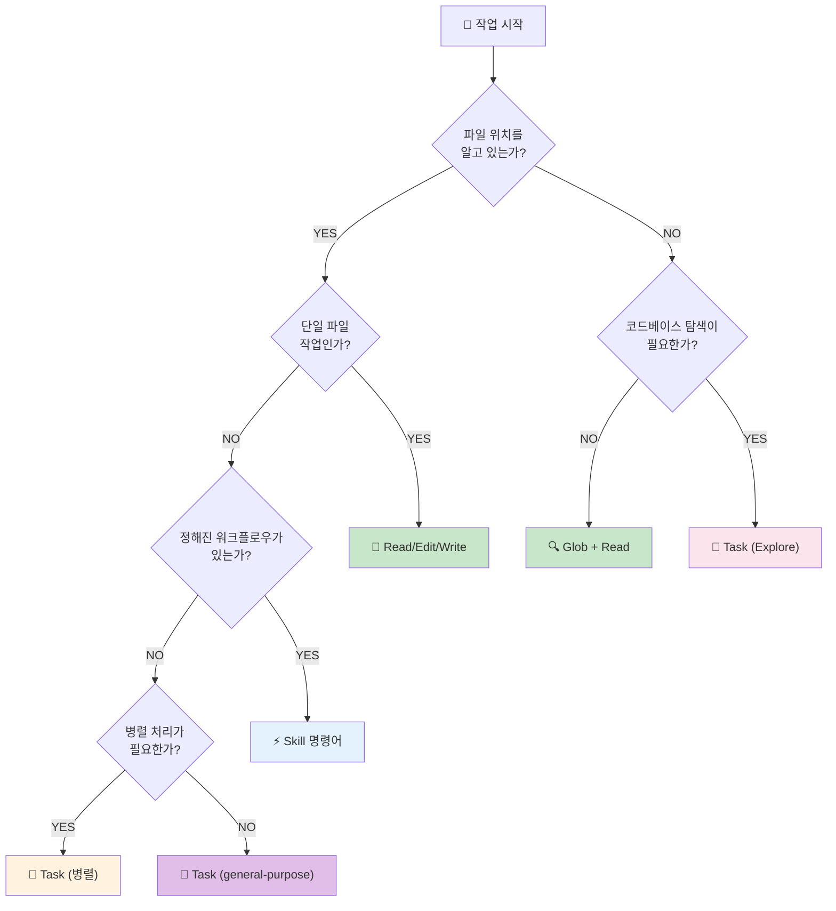
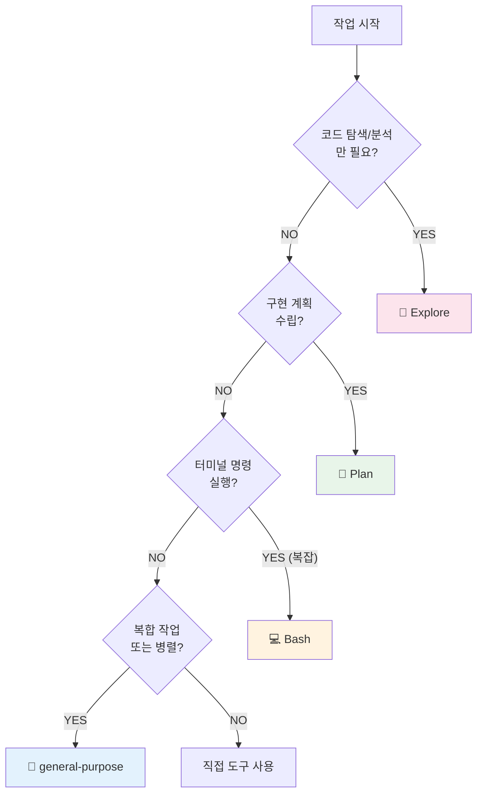
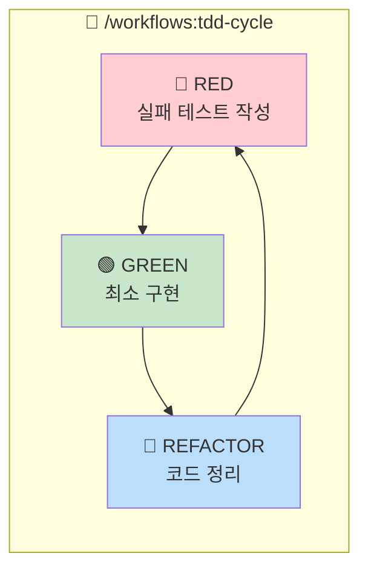
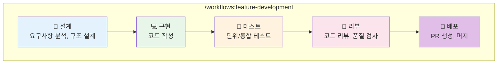
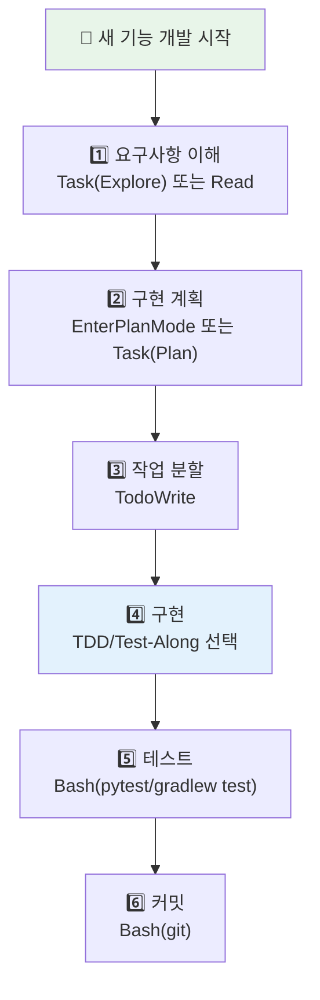
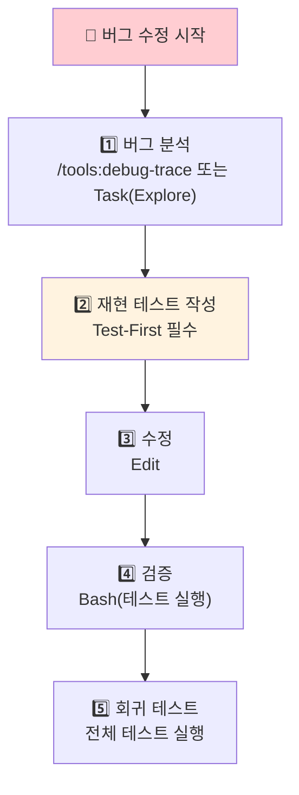
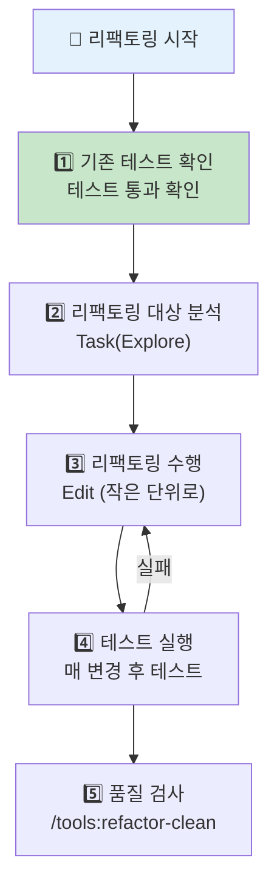

# 개발자 에이전트 도구 가이드

---

## 문서 정보

| 항목 | 내용 |
|------|------|
| **문서명** | 개발자 에이전트 도구 가이드 |
| **버전** | 1.0 |
| **작성일** | 2026-01-17 |
| **작성자** | Claude Code (Opus 4.5) |
| **대상** | Claude Code 기반 개발자 에이전트 |
| **목적** | AI 에이전트가 상황에 맞는 도구를 선택하여 효율적으로 작업 수행 |

---

## 변경 이력

| 버전 | 일자 | 작성자 | 변경 내용 |
|------|------|--------|----------|
| 1.0 | 2026-01-17 | Claude Code | 초안 작성 |

---

## 목차

1. [개요](#1-개요)
2. [도구 분류 체계](#2-도구-분류-체계)
3. [상황별 도구 선택 가이드](#3-상황별-도구-선택-가이드)
4. [Subagent 상세 가이드](#4-subagent-상세-가이드)
5. [Skill 명령어 레퍼런스](#5-skill-명령어-레퍼런스)
6. [Workflow 명령어 레퍼런스](#6-workflow-명령어-레퍼런스)
7. [기본 도구 활용](#7-기본-도구-활용)
8. [작업 패턴별 권장 접근법](#8-작업-패턴별-권장-접근법)
9. [베스트 프랙티스](#9-베스트-프랙티스)

---

## 1. 개요

### 1.1 목적

본 문서는 Claude Code 기반 개발자 에이전트가 다양한 개발 작업을 수행할 때 **적절한 도구를 선택**하고 **효율적으로 활용**할 수 있도록 안내합니다.

### 1.2 도구 계층 구조

```mermaid
flowchart TB
    subgraph Tools["🛠️ Claude Code 도구 계층"]
        subgraph Basic["기본 도구 (Built-in)"]
            Read["📖 Read"]
            Write["✍️ Write"]
            Edit["📝 Edit"]
            Bash["💻 Bash"]
            Glob["🔍 Glob"]
            Grep["🔎 Grep"]
            WebFetch["🌐 WebFetch"]
            WebSearch["🔍 WebSearch"]
        end

        subgraph Advanced["고급 도구"]
            Task["🤖 Task (Subagent)"]
            Skill["⚡ Skill"]
            TodoWrite["📋 TodoWrite"]
            AskUser["❓ AskUserQuestion"]
        end

        subgraph Specialized["특수 도구"]
            EnterPlan["📐 EnterPlanMode"]
            Notebook["📓 NotebookEdit"]
            Diagnostics["🔧 mcp__ide__getDiagnostics"]
        end
    end

    Basic --> Advanced
    Advanced --> Specialized

    style Basic fill:#e8f5e9
    style Advanced fill:#e3f2fd
    style Specialized fill:#fff3e0
```



### 1.3 도구 선택 원칙

```
┌─────────────────────────────────────────────────────────────────┐
│                    도구 선택 기본 원칙                           │
├─────────────────────────────────────────────────────────────────┤
│                                                                 │
│  1️⃣ 단순 작업 → 기본 도구 사용                                  │
│     • 파일 읽기: Read (cat/head/tail 사용 금지)                 │
│     • 파일 수정: Edit (sed/awk 사용 금지)                       │
│     • 파일 검색: Glob (find 사용 금지)                          │
│     • 내용 검색: Grep (grep/rg 사용 금지)                       │
│                                                                 │
│  2️⃣ 복잡한 탐색 → Explore Subagent                             │
│     • 코드베이스 구조 파악                                       │
│     • 다중 파일 검색/분석                                        │
│     • 아키텍처 이해                                              │
│                                                                 │
│  3️⃣ 정해진 워크플로우 → Skill/Workflow 명령어                   │
│     • TDD 개발: /workflows:tdd-cycle                           │
│     • 보안 스캔: /tools:security-scan                          │
│     • 일일 마무리: /daily:daily-close                          │
│                                                                 │
│  4️⃣ 병렬 작업 필요 → Task (general-purpose)                    │
│     • 독립적인 여러 작업 동시 수행                               │
│     • 긴 작업 백그라운드 실행                                    │
│                                                                 │
└─────────────────────────────────────────────────────────────────┘
```

---

## 2. 도구 분류 체계

### 2.1 도구 유형별 분류

| 유형 | 도구 | 용도 | 호출 방법 |
|------|------|------|----------|
| **기본 도구** | Read, Write, Edit, Glob, Grep, Bash | 파일 조작, 검색, 명령 실행 | 직접 호출 |
| **Subagent** | Task | 복잡한 멀티스텝 작업 위임 | `Task(subagent_type=...)` |
| **Skill** | /tools:*, /daily:* | 정의된 도구 명령어 실행 | `Skill(skill="...")` |
| **Workflow** | /workflows:* | 복합 워크플로우 실행 | `Skill(skill="...")` |
| **관리 도구** | TodoWrite, AskUserQuestion | 작업 관리, 사용자 소통 | 직접 호출 |

### 2.2 작업 복잡도별 도구 매핑



---

## 3. 상황별 도구 선택 가이드

### 3.1 도구 선택 플로우차트



### 3.2 상황별 권장 도구 테이블

| 상황 | 권장 도구 | 명령어/호출 방법 | 비고 |
|------|----------|-----------------|------|
| **파일 읽기** | Read | `Read(file_path="...")` | cat/head/tail 사용 금지 |
| **파일 수정** | Edit | `Edit(file_path, old_string, new_string)` | sed/awk 사용 금지 |
| **파일 생성** | Write | `Write(file_path, content)` | 기존 파일은 Read 먼저 |
| **파일 검색** | Glob | `Glob(pattern="**/*.py")` | find 사용 금지 |
| **내용 검색** | Grep | `Grep(pattern="keyword")` | grep/rg 직접 사용 금지 |
| **Git 작업** | Bash | `Bash(command="git ...")` | |
| **빌드/테스트** | Bash | `Bash(command="./gradlew test")` | |
| **코드 탐색** | Task (Explore) | `Task(subagent_type="Explore")` | 구조 파악, 다중 검색 |
| **구현 계획** | Task (Plan) | `Task(subagent_type="Plan")` | 또는 EnterPlanMode |
| **TDD 개발** | Skill | `Skill(skill="workflows:tdd-cycle")` | |
| **보안 스캔** | Skill | `Skill(skill="tools:security-scan")` | |
| **디버깅** | Skill | `Skill(skill="tools:debug-trace")` | |
| **코드 리뷰** | Skill | `Skill(skill="workflows:full-review")` | |
| **일일 마무리** | Skill | `Skill(skill="daily:daily-close")` | |

### 3.3 금지된 패턴

```
┌─────────────────────────────────────────────────────────────────┐
│                    ❌ 사용 금지 패턴                             │
├─────────────────────────────────────────────────────────────────┤
│                                                                 │
│  파일 읽기:                                                      │
│    ❌ Bash(command="cat file.py")                               │
│    ❌ Bash(command="head -n 100 file.py")                       │
│    ✅ Read(file_path="file.py")                                 │
│                                                                 │
│  파일 검색:                                                      │
│    ❌ Bash(command="find . -name '*.py'")                       │
│    ❌ Bash(command="ls -la src/")                               │
│    ✅ Glob(pattern="**/*.py")                                   │
│                                                                 │
│  내용 검색:                                                      │
│    ❌ Bash(command="grep -r 'pattern' .")                       │
│    ❌ Bash(command="rg 'pattern'")                              │
│    ✅ Grep(pattern="pattern")                                   │
│                                                                 │
│  파일 수정:                                                      │
│    ❌ Bash(command="sed -i 's/old/new/g' file")                 │
│    ❌ Bash(command="echo 'content' > file")                     │
│    ✅ Edit(file_path, old_string, new_string)                   │
│                                                                 │
└─────────────────────────────────────────────────────────────────┘
```

---

## 4. Subagent 상세 가이드

### 4.1 Subagent 유형 개요

| Subagent 유형 | 용도 | 사용 가능 도구 | 적합한 상황 |
|--------------|------|---------------|------------|
| **Explore** | 코드베이스 탐색 | Read, Glob, Grep, WebFetch, WebSearch | 구조 파악, 다중 검색, 아키텍처 이해 |
| **Plan** | 구현 계획 수립 | Read, Glob, Grep (수정 불가) | 복잡한 기능 설계, 아키텍처 결정 |
| **Bash** | 명령 실행 | Bash only | Git, 빌드, 배포 명령 |
| **general-purpose** | 범용 멀티스텝 | 모든 도구 | 복잡한 작업, 병렬 처리 |

### 4.2 Explore Subagent

**언제 사용하는가:**
- 코드베이스 구조를 파악해야 할 때
- 특정 기능이 어디에 구현되어 있는지 찾을 때
- 여러 파일에 걸친 패턴을 분석할 때
- "~가 어디서 처리되나요?" 유형의 질문

**호출 예시:**

```
Task(
    subagent_type="Explore",
    description="에러 핸들링 구조 파악",
    prompt="프로젝트에서 에러 핸들링이 어떻게 구현되어 있는지 분석해줘.
            GlobalExceptionHandler, 커스텀 예외 클래스, 에러 응답 포맷을 찾아줘."
)
```

**탐색 깊이 지정:**
- `quick`: 기본 검색 (빠른 확인)
- `medium`: 중간 수준 탐색 (일반적 사용)
- `very thorough`: 포괄적 분석 (복잡한 구조)

### 4.3 Plan Subagent

**언제 사용하는가:**
- 복잡한 기능 구현 전 설계가 필요할 때
- 여러 파일을 수정해야 하는 작업
- 아키텍처 결정이 필요한 작업
- 사용자 승인이 필요한 큰 변경

**호출 예시:**

```
Task(
    subagent_type="Plan",
    description="검색 기능 구현 계획",
    prompt="하이브리드 검색 기능 구현 계획을 세워줘.
            Vector 검색과 Graph 검색을 결합하는 방식으로.
            수정해야 할 파일들과 구현 순서를 제안해줘."
)
```

### 4.4 Bash Subagent

**언제 사용하는가:**
- 여러 Git 명령을 순차 실행해야 할 때
- 복잡한 빌드/배포 스크립트 실행
- 터미널 명령 조합이 필요할 때

**호출 예시:**

```
Task(
    subagent_type="Bash",
    description="테스트 및 빌드 실행",
    prompt="전체 테스트를 실행하고, 통과하면 빌드를 수행해줘.
            실패 시 에러 로그를 분석해줘."
)
```

### 4.5 general-purpose Subagent

**언제 사용하는가:**
- 여러 단계의 복합 작업
- 검색 → 분석 → 수정이 연속으로 필요한 작업
- 병렬로 여러 작업을 수행해야 할 때
- 백그라운드에서 긴 작업 실행

**호출 예시:**

```
# 병렬 실행
Task(
    subagent_type="general-purpose",
    description="Backend 테스트 분석",
    prompt="Backend 테스트 커버리지를 분석하고 미흡한 부분을 보고해줘.",
    run_in_background=true
)

Task(
    subagent_type="general-purpose",
    description="Frontend 테스트 분석",
    prompt="Frontend 테스트 커버리지를 분석하고 미흡한 부분을 보고해줘.",
    run_in_background=true
)
```

### 4.6 Subagent 선택 플로우차트



---

## 5. Skill 명령어 레퍼런스

### 5.1 Tools 카테고리

개별 도구 성격의 명령어입니다.

| 명령어 | 설명 | 사용 시점 |
|--------|------|----------|
| `/tools:debug-trace` | 디버깅 추적 및 근본 원인 분석 | 버그 원인 파악 필요 시 |
| `/tools:deps-audit` | 의존성 보안 감사 및 업데이트 권장 | 보안 점검, 업데이트 검토 |
| `/tools:security-scan` | OWASP Top 10 보안 취약점 스캔 | 코드 리뷰, 보안 점검 |
| `/tools:doc-generate` | API 및 코드 문서 자동 생성 | 문서화 필요 시 |
| `/tools:context-save` | 프로젝트 컨텍스트 저장 | 세션 종료 전 |
| `/tools:context-restore` | 저장된 컨텍스트 복원 | 세션 시작 시 |
| `/tools:refactor-clean` | 리팩토링 및 클린 코드 적용 | 코드 정리 필요 시 |
| `/tools:tech-debt` | 기술 부채 분석 및 개선 계획 | 품질 점검 |
| `/tools:pr-enhance` | PR 품질 개선 및 리뷰 준비 | PR 생성 전 |
| `/tools:error-analysis` | 에러 분석 및 해결책 제시 | 에러 발생 시 |
| `/tools:ai-review` | AI/ML 코드 리뷰 (LLM, Vector DB, RAG) | AI 코드 검토 |
| `/tools:code-explain` | 코드 설명 및 문서화 생성 | 코드 이해 필요 시 |
| `/tools:issue` | GitHub 이슈 분석 및 수정 | 이슈 해결 시 |

### 5.2 Daily 카테고리

일일 작업 관리 명령어입니다.

| 명령어 | 설명 | 사용 시점 |
|--------|------|----------|
| `/daily:daily-log` | 오늘의 작업일지 작성/업데이트 | 작업 중, 작업 후 |
| `/daily:daily-close` | 하루 마무리 자동화 (일지+문서+커밋/푸시) | 하루 작업 종료 시 |
| `/daily:sync-docs` | README, CLAUDE, PLAN 문서 현행화 | 문서 동기화 필요 시 |
| `/daily:vibe-log` | 바이브 코딩 일지 (인사이트/아이디어 기록) | 아이디어 발생 시 |

### 5.3 Skill 호출 방법

```
# 기본 호출
Skill(skill="tools:security-scan")

# 인자와 함께 호출
Skill(skill="tools:issue", args="123")

# 전체 이름으로 호출
Skill(skill="daily:daily-close")
```

---

## 6. Workflow 명령어 레퍼런스

### 6.1 Workflow 목록

복합적인 작업 흐름을 자동화하는 명령어입니다.

| 명령어 | 설명 | 포함 단계 | 사용 시점 |
|--------|------|----------|----------|
| `/workflows:feature-development` | 기능 개발 전체 사이클 | 설계 → 구현 → 테스트 → 배포 | 새 기능 개발 시 |
| `/workflows:security-hardening` | 보안 강화 워크플로우 | 스캔 → 분석 → 수정 → 검증 | 보안 강화 작업 |
| `/workflows:smart-fix` | 지능형 문제 해결 | 분석 → 에이전트 선택 → 수정 | 복잡한 버그 수정 |
| `/workflows:tdd-cycle` | TDD 자동화 (Red-Green-Refactor) | 테스트 → 구현 → 리팩토링 | TDD 개발 시 |
| `/workflows:incident-response` | 장애 대응 프로세스 | 탐지 → 분석 → 대응 → 복구 | 장애 발생 시 |
| `/workflows:full-review` | 종합 코드 리뷰 | 정적분석 → 보안 → 품질 → 리포트 | PR 리뷰 시 |

### 6.2 TDD Workflow 상세



**사용 시점:**
- 복잡한 알고리즘 구현
- 비즈니스 규칙 구현
- 에러 핸들링 로직
- 참고: [테스트 계획서 섹션 2.4](../04_testing/01_unit_integration_test_plan.md#24-tdd-적용-기준-상세)

### 6.3 Feature Development Workflow 상세



---

## 7. 기본 도구 활용

### 7.1 파일 작업 도구

#### Read
```
# 기본 사용
Read(file_path="/path/to/file.py")

# 부분 읽기 (대용량 파일)
Read(file_path="/path/to/file.py", offset=100, limit=50)
```

#### Write
```
# 새 파일 생성 (기존 파일이면 Read 먼저 필수)
Write(file_path="/path/to/new_file.py", content="...")
```

#### Edit
```
# 특정 부분 수정
Edit(
    file_path="/path/to/file.py",
    old_string="def old_function():",
    new_string="def new_function():"
)

# 전체 치환
Edit(
    file_path="/path/to/file.py",
    old_string="old_value",
    new_string="new_value",
    replace_all=true
)
```

### 7.2 검색 도구

#### Glob
```
# 파일 패턴 검색
Glob(pattern="**/*.py")                    # 모든 Python 파일
Glob(pattern="src/**/*.java")              # src 하위 Java 파일
Glob(pattern="**/test_*.py")               # 테스트 파일
```

#### Grep
```
# 내용 검색
Grep(pattern="class.*Service")             # 정규식 검색
Grep(pattern="TODO", type="py")            # Python 파일만
Grep(pattern="error", output_mode="content", -C=3)  # 컨텍스트 포함
```

### 7.3 실행 도구

#### Bash
```
# Git 명령
Bash(command="git status")
Bash(command="git add . && git commit -m 'message'")

# 빌드/테스트
Bash(command="./gradlew test")
Bash(command="pytest tests/")
Bash(command="npm run build")

# 백그라운드 실행
Bash(command="./gradlew test", run_in_background=true)
```

### 7.4 관리 도구

#### TodoWrite
```
# 작업 목록 관리
TodoWrite(todos=[
    {"content": "API 엔드포인트 구현", "status": "in_progress", "activeForm": "API 엔드포인트 구현 중"},
    {"content": "테스트 작성", "status": "pending", "activeForm": "테스트 작성 중"},
])
```

#### AskUserQuestion
```
# 사용자에게 질문
AskUserQuestion(questions=[
    {
        "question": "어떤 데이터베이스를 사용할까요?",
        "header": "DB 선택",
        "options": [
            {"label": "PostgreSQL (권장)", "description": "ACID, JSON 지원"},
            {"label": "MySQL", "description": "널리 사용됨"}
        ],
        "multiSelect": false
    }
])
```

---

## 8. 작업 패턴별 권장 접근법

### 8.1 새 기능 개발



**권장 명령어:** `/workflows:feature-development`

### 8.2 버그 수정



**권장 명령어:** `/workflows:smart-fix`

### 8.3 코드 리팩토링



### 8.4 코드 리뷰/PR 준비

```
1️⃣ 보안 스캔:       /tools:security-scan
2️⃣ 기술 부채 분석:  /tools:tech-debt
3️⃣ 종합 리뷰:       /workflows:full-review
4️⃣ PR 품질 개선:    /tools:pr-enhance
5️⃣ PR 생성:         Bash(gh pr create ...)
```

### 8.5 일일 마무리

```
# 전체 자동화 (권장)
/daily:daily-close

# 또는 개별 실행
1️⃣ 작업일지: /daily:daily-log
2️⃣ 문서 동기화: /daily:sync-docs
3️⃣ 커밋/푸시: Bash(git add . && git commit && git push)
```

---

## 9. 베스트 프랙티스

### 9.1 효율적인 도구 사용

```
┌─────────────────────────────────────────────────────────────────┐
│                    ✅ 베스트 프랙티스                            │
├─────────────────────────────────────────────────────────────────┤
│                                                                 │
│  📋 작업 관리                                                    │
│    • 복잡한 작업은 TodoWrite로 분할                              │
│    • 작업 상태를 실시간 업데이트                                  │
│    • 완료 즉시 completed로 변경                                  │
│                                                                 │
│  🔍 탐색 작업                                                    │
│    • 단순 검색: Glob, Grep 직접 사용                             │
│    • 복잡한 탐색: Task(Explore) 사용                             │
│    • 여러 파일 동시 읽기: 병렬 Read 호출                         │
│                                                                 │
│  ⚡ 병렬 처리                                                    │
│    • 독립적인 작업은 병렬로 Task 호출                            │
│    • 긴 작업은 run_in_background=true                           │
│    • 의존성 있는 작업은 순차 실행                                 │
│                                                                 │
│  🧪 테스트                                                       │
│    • 섹션 2.7 체크리스트로 접근 방식 결정                         │
│    • 복잡한 로직: TDD (/workflows:tdd-cycle)                     │
│    • 버그 수정: Test-First 필수                                  │
│                                                                 │
│  📝 커밋                                                         │
│    • 코드와 테스트 함께 커밋                                      │
│    • 커밋 메시지 형식 준수 ([TYPE] 설명)                         │
│    • 커밋 전 모든 테스트 통과 확인                                │
│                                                                 │
└─────────────────────────────────────────────────────────────────┘
```

### 9.2 피해야 할 패턴

```
┌─────────────────────────────────────────────────────────────────┐
│                    ❌ 피해야 할 패턴                             │
├─────────────────────────────────────────────────────────────────┤
│                                                                 │
│  • Bash로 cat, head, tail, find, grep 실행                      │
│  • 파일 읽기 전 Edit/Write 시도                                  │
│  • 테스트 없이 복잡한 로직 구현                                   │
│  • 한 번에 너무 많은 변경                                        │
│  • 테스트 실패 상태로 커밋                                        │
│  • 작업 완료 후 TodoWrite 업데이트 누락                          │
│  • 의존성 있는 작업을 병렬로 실행                                 │
│                                                                 │
└─────────────────────────────────────────────────────────────────┘
```

### 9.3 체크리스트

#### 작업 시작 전
- [ ] 요구사항 명확히 이해했는가?
- [ ] TodoWrite로 작업 분할했는가?
- [ ] 테스트 접근 방식 결정했는가? (TDD/Test-Along/Test-First)

#### 구현 중
- [ ] 적절한 도구를 사용하고 있는가?
- [ ] 테스트와 함께 개발하고 있는가?
- [ ] 작은 단위로 변경하고 있는가?

#### 완료 전
- [ ] 모든 테스트 통과하는가?
- [ ] 커밋 메시지 형식 맞는가?
- [ ] TodoWrite 상태 업데이트했는가?

---

## 관련 문서

- [CLAUDE.md](../../../CLAUDE.md) - 프로젝트 개발 규칙
- [.claude/commands/README.md](../../../.claude/commands/README.md) - 전체 명령어 목록
- [단위/통합 테스트 계획서](../04_testing/01_unit_integration_test_plan.md) - 테스트 접근 방식 상세
- [백엔드 설계서](../02_design/06_backend_detailed_design.md) - Spring Boot 구조
- [API 통합 설계서](../02_design/04_api_integration_design.md) - API 스펙
