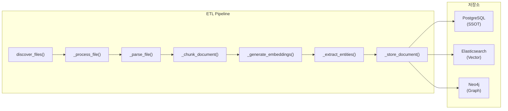
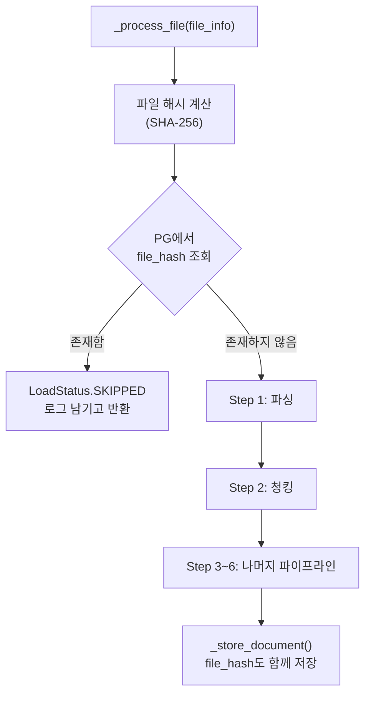

# InitialDataLoader 중복 방지(Dedup) 아키텍처 리뷰

**리뷰 유형**: 아키텍처 / 코드 리뷰  
**리뷰어**: TechLead  
**작성일**: 2026-02-08  
**대상 파일**: `knowledge_service/src/app/services/initial_data_loader.py`  
**우선순위**: **P1** (다음 스프린트 필수 반영)  
**심각도**: High - 데이터 무결성에 직접적 영향

---

## 1. 현재 상태 분석 (As-Is)

### 1.1 아키텍처 개요

`InitialDataLoader`는 프로젝트 문서를 Knowledge Graph(Neo4j) 및 Vector Store(Elasticsearch)에 적재하는 ETL 파이프라인입니다.



### 1.2 문제점: 중복 검사 부재

현재 `load_all()` 호출 시 다음 흐름으로 동작합니다.

```
load_all() → _load_source() → _discover_files() → _process_file() (순차 반복)
```

**핵심 문제**: `_process_file()` 내부에 어떠한 중복 검사 로직도 존재하지 않습니다.

```python
# initial_data_loader.py Line 632-757
async def _process_file(self, file_info: FileInfo) -> LoadResult:
    # ❌ 중복 검사 없음 - 바로 파싱 시작
    result = LoadResult(...)
    
    for attempt in range(self.max_retries):
        # Step 1: 파싱 ← 여기서 이미 리소스 소비 시작
        parsed_doc = self._parse_file(file_info)
        # Step 2~6: 청킹, 임베딩, 엔티티 추출, 저장
        ...
```

`_store_to_postgresql()` 메서드(Line 1061-1118)는 `ON CONFLICT (id) DO UPDATE` UPSERT를 사용하지만, `id`는 매 호출마다 `uuid4()`로 새로 생성되므로(Line 708) UPSERT가 중복 방지로 작동하지 않습니다.

```python
# Line 708 - 매번 새 UUID 생성
document_id = str(uuid4())  # ❌ 항상 새로운 ID
```

### 1.3 Neo4j의 MERGE는 부분적으로만 보호

Neo4j 저장 로직(Line 1240-1252)에서 `MERGE (d:Document {id: $doc_id})`를 사용하지만, `doc_id`가 매번 새로 생성되므로 동일 파일에 대해 여러 Document 노드가 생성됩니다.

---

## 2. 문제 영향도 (Impact Analysis)

### 2.1 직접적 영향

| 저장소 | 영향 | 심각도 |
|--------|------|--------|
| **PostgreSQL** | 동일 파일에 대한 documents 레코드 다중 생성. `id`가 매번 새 UUID이므로 UPSERT 무력화 | **High** |
| **Elasticsearch** | 동일 내용의 청크가 중복 인덱싱. 검색 결과에 동일 문서 중복 노출, 관련도 점수 왜곡 | **High** |
| **Neo4j** | Document/Chunk 노드 중복 생성. 그래프 탐색 시 중복 경로 발생, 성능 저하 | **Medium** |

### 2.2 간접적 영향

| 영역 | 영향 |
|------|------|
| **RAG 검색 품질** | 동일 문서의 청크가 여러 번 검색 결과에 포함되어 답변 품질 저하 |
| **비용** | 불필요한 LLM 호출 (메타데이터 추출, 엔티티 추출) 반복 |
| **임베딩 리소스** | BGE-M3 임베딩 생성이 중복 실행 (GPU/CPU 자원 낭비) |
| **데이터 정합성** | PG-ES-Neo4j 간 document_id가 매번 달라져 STORY-099에서 확보한 ID 정합성 훼손 |

### 2.3 발생 시나리오

```
시나리오 1: 서비스 재시작 후 초기 데이터 로드
  → load_all() 재호출 → 기존 데이터 위에 중복 적재

시나리오 2: 데이터 소스 디렉토리에 파일 추가 후 전체 로드
  → 신규 + 기존 파일 모두 처리 → 기존 파일 중복

시나리오 3: ETL 중 부분 실패 후 재실행
  → 성공했던 파일도 다시 처리 → 해당 파일만 중복
```

---

## 3. 중복 검사 전략 비교

### 3.1 전략 개요

| 전략 | 키 | 정확도 | 성능 | 구현 난이도 |
|------|-----|--------|------|------------|
| **A. title 매칭** | `documents.title` | 낮음 | 빠름 | 쉬움 |
| **B. file_hash 매칭** | `documents.file_hash` (SHA-256) | 높음 | 중간 | 중간 |
| **C. file_path 매칭** | `documents.file_path` | 중간 | 빠름 | 쉬움 |
| **D. file_path + file_hash 복합** | 경로 + 해시 | 매우 높음 | 중간 | 중간 |

### 3.2 전략별 상세 분석

#### A. title 매칭 (현재 임시 해결책)

```sql
SELECT id FROM documents WHERE title = $1;
```

- **장점**: 구현이 간단하고, 기존 인덱스(`idx_documents_title_trgm`) 활용 가능
- **단점**:
  - 동일 제목의 다른 문서를 오탐(false positive)
  - 파일명이 변경되면 중복 검출 실패(false negative)
  - 문서 내용이 변경되어도 같은 제목이면 건너뜀

**결론**: 임시 해결책으로만 사용. 프로덕션에서는 부적합.

#### B. file_hash 매칭 (권장)

```sql
SELECT id FROM documents WHERE file_hash = $1;
```

- **장점**:
  - 파일 내용 기반 정확한 중복 판별
  - DB 스키마에 `file_hash VARCHAR(128)` 컬럼 이미 존재
  - `idx_documents_file_hash` 인덱스 이미 생성됨
  - 파일명/경로 변경과 무관하게 동작
- **단점**:
  - 해시 계산 비용 (대용량 파일)
  - 문서 내용이 1바이트라도 변경되면 다른 해시 (업데이트 시 고려 필요)
- **해시 계산 최적화**: `document_parser.py`에 `get_document_hash()` 메서드가 이미 존재 (MD5, 첫/끝 1MB). 단, 스키마는 SHA-256을 명시하므로 알고리즘 통일 필요.

**결론**: 가장 적합한 전략. 인프라(컬럼, 인덱스)가 이미 준비되어 있음.

#### C. file_path 매칭

```sql
SELECT id FROM documents WHERE file_path = $1;
```

- **장점**: 해시 계산 불필요, 빠름
- **단점**:
  - 파일 경로가 변경되면 중복 검출 실패
  - 동일 내용의 파일이 다른 경로에 있으면 중복 적재
  - Docker 볼륨 마운트 경로 변경 시 전체 재적재 발생

**결론**: 보조 전략으로 활용 가능. 단독 사용은 불안정.

#### D. file_path + file_hash 복합 (최적)

```sql
SELECT id, file_hash FROM documents 
WHERE file_path = $1 OR file_hash = $2;
```

- **장점**: 경로 변경 + 내용 동일 케이스 모두 커버
- **단점**: 쿼리 복잡도 소폭 증가
- **시나리오 분기**:
  - 경로 일치 + 해시 일치 → 완전 동일, SKIP
  - 경로 일치 + 해시 불일치 → 파일 내용 변경, UPDATE
  - 경로 불일치 + 해시 일치 → 파일 이동/복사, SKIP (또는 경로 UPDATE)
  - 둘 다 불일치 → 새 파일, INSERT

**결론**: 향후 업데이트 감지까지 필요하면 D 전략 채택. 초기 구현은 B로 충분.

---

## 4. 권장 솔루션 (Proposed Solution)

### 4.1 체크 시점: `_process_file()` 진입 직후, Step 1 파싱 이전

중복 검사는 가장 이른 시점에 수행하여 불필요한 리소스 소비를 방지합니다.



### 4.2 구현 코드 예시

```python
import hashlib
from pathlib import Path
from typing import Optional


def _compute_file_hash(self, file_path: Path) -> str:
    """파일 SHA-256 해시 계산
    
    Args:
        file_path: 파일 경로
        
    Returns:
        SHA-256 해시 문자열 (64자 hex)
    """
    sha256 = hashlib.sha256()
    with open(file_path, "rb") as f:
        for block in iter(lambda: f.read(8192), b""):
            sha256.update(block)
    return sha256.hexdigest()


async def _check_duplicate(self, file_hash: str, file_path: str) -> Optional[str]:
    """PG에서 중복 문서 확인
    
    Args:
        file_hash: 파일 SHA-256 해시
        file_path: 파일 경로
        
    Returns:
        기존 document_id (중복 시) 또는 None (신규 시)
    """
    try:
        from app.services.document_repository import get_document_repository
        repo = await get_document_repository()
        
        if repo._pool is None:
            logger.warning("PG pool not available, skipping dedup check")
            return None
        
        async with repo._pool.acquire() as conn:
            row = await conn.fetchrow(
                """
                SELECT id, file_path, processing_status
                FROM documents
                WHERE file_hash = $1
                  AND processing_status = 'completed'
                LIMIT 1
                """,
                file_hash,
            )
            
            if row:
                logger.info(
                    "Duplicate detected: file_hash=%s, existing_doc=%s, "
                    "existing_path=%s, new_path=%s",
                    file_hash[:16],
                    str(row["id"])[:8],
                    row["file_path"],
                    file_path,
                )
                return str(row["id"])
            
            return None
            
    except Exception as e:
        logger.warning("Dedup check failed (proceeding without): %s", e)
        return None
```

### 4.3 `_process_file()` 수정 위치

```python
async def _process_file(self, file_info: FileInfo) -> LoadResult:
    result = LoadResult(
        file_path=str(file_info.file_path),
        file_name=file_info.file_name,
        status=LoadStatus.IN_PROGRESS,
    )
    start_time = time.monotonic()

    # ===== 중복 검사 (Step 0) =====
    file_hash = self._compute_file_hash(file_info.file_path)
    existing_doc_id = await self._check_duplicate(
        file_hash=file_hash,
        file_path=str(file_info.file_path),
    )
    
    if existing_doc_id:
        result.status = LoadStatus.SKIPPED
        result.document_id = existing_doc_id
        result.error_message = f"Duplicate: file_hash matches doc {existing_doc_id[:8]}"
        result.processing_time_ms = (time.monotonic() - start_time) * 1000
        logger.info(
            "Skipping duplicate file: %s (existing doc_id=%s)",
            file_info.file_name,
            existing_doc_id[:8],
        )
        return result
    # ===== 중복 검사 끝 =====

    for attempt in range(self.max_retries):
        try:
            # Step 1: 파싱 (기존 코드 유지)
            parsed_doc = self._parse_file(file_info)
            ...
```

### 4.4 `_store_to_postgresql()` 수정: file_hash 저장

```python
async def _store_to_postgresql(
    self,
    document_id: str,
    file_info: FileInfo,
    chunks: List[Any],
    metadata: Dict[str, Any],
    file_hash: Optional[str] = None,  # 추가
) -> Optional[str]:
    try:
        from app.services.document_repository import get_document_repository
        repo = await get_document_repository()
        
        async with repo._pool.acquire() as conn:
            await conn.execute(
                """
                INSERT INTO documents (
                    id, title, document_type, file_path, file_name,
                    file_size, file_type, file_hash, processing_status,
                    chunk_count, raw_metadata, created_at, updated_at
                )
                VALUES ($1, $2, $3, $4, $5, $6, $7, $8, $9, $10, $11::jsonb, $12, $13)
                ON CONFLICT (id) DO UPDATE SET
                    processing_status = EXCLUDED.processing_status,
                    file_hash = EXCLUDED.file_hash,
                    chunk_count = EXCLUDED.chunk_count,
                    raw_metadata = EXCLUDED.raw_metadata,
                    updated_at = EXCLUDED.updated_at
                """,
                document_id,
                metadata.get("title", file_info.file_name),
                metadata.get("doc_type", "unknown"),
                str(file_info.file_path),
                file_info.file_name,
                file_info.file_size,
                file_info.extension.lstrip(".") if file_info.extension else "unknown",
                file_hash,                          # SHA-256 해시
                "completed",
                len(chunks),
                metadata_json or "{}",
                _naive_utcnow(),
                _naive_utcnow(),
            )
        
        return document_id
    except Exception as e:
        logger.warning("PostgreSQL storage failed: %s", e)
        return None
```

---

## 5. 트레이드오프 분석

### 5.1 성능

| 항목 | 추가 비용 | 절감 효과 |
|------|----------|----------|
| SHA-256 해시 계산 | 파일당 ~1-5ms (일반 문서) | 중복 파일의 파싱/청킹/임베딩/저장 전체 회피 (파일당 ~5-30초) |
| PG 쿼리 (dedup check) | ~1ms (인덱스 사용) | LLM 호출 비용 절감 (엔티티 추출, 메타데이터 추출) |
| **총 오버헤드** | **파일당 ~2-6ms** | **중복 파일당 ~5-30초 + LLM API 비용** |

비용 대비 효과가 매우 높습니다. 100개 파일 중 50개가 중복이라면, 추가 오버헤드 ~300ms로 ~250-1500초의 처리 시간을 절감합니다.

### 5.2 안정성

| 리스크 | 완화 방안 |
|--------|----------|
| PG 연결 실패 시 dedup 불가 | `_check_duplicate()`에서 예외 발생 시 `None` 반환 (=중복 검사 스킵, 기존 동작 유지) |
| 해시 충돌 (SHA-256) | 이론적 확률 2^-128, 실무에서 무시 가능 |
| 파일 내용 변경 시 재적재 불가 | `file_hash`가 다르므로 자연스럽게 새 문서로 처리됨 |
| PG에 기존 데이터 file_hash 없음 | 기존 레코드의 `file_hash`가 NULL이면 매칭 불가 → 마이그레이션 스크립트 필요 |

### 5.3 기존 데이터 마이그레이션

기존에 `file_hash` 없이 적재된 문서에 대해 백필(backfill) 필요:

```sql
-- 현재 file_hash가 NULL인 문서 수 확인
SELECT COUNT(*) FROM documents WHERE file_hash IS NULL;

-- 백필은 Python 스크립트로 수행 (파일 접근 필요)
-- 또는 file_path 기반 임시 dedup 후 점진적 해시 계산
```

---

## 6. 해시 알고리즘 통일

### 현재 상태

| 위치 | 알고리즘 | 범위 |
|------|---------|------|
| DB 스키마 (`schema.sql` L157) | SHA-256 명시 (`file_hash VARCHAR(128)`) | 전체 파일 |
| `document_parser.py` L166-193 | MD5 (첫/끝 1MB만) | 부분 파일 |
| 임베딩 캐시 (`embedding.py` L135) | SHA-256 (텍스트 해시, 16자 truncate) | 텍스트 내용 |

### 권장 통일안

- **전체 파일 해시**: SHA-256 (DB 스키마와 일치, 보안적으로 안전)
- **캐시 키**: 기존 유지 (목적이 다름)
- `document_parser.py`의 `get_document_hash()`는 MD5에서 SHA-256으로 변경 권장

---

## 7. 구현 우선순위 및 작업 분할

### Phase 1: 기본 dedup (P1 - 다음 스프린트)

| 작업 | 담당 | 예상 시간 |
|------|------|----------|
| `_compute_file_hash()` 메서드 추가 | RAG Engineer | 0.5h |
| `_check_duplicate()` 메서드 추가 | RAG Engineer | 1h |
| `_process_file()`에 Step 0 삽입 | RAG Engineer | 0.5h |
| `_store_to_postgresql()`에 `file_hash` 파라미터 추가 | RAG Engineer | 1h |
| 유닛 테스트 작성 | QA Engineer | 2h |
| 통합 테스트 (Docker 환경) | QA Engineer | 1h |
| **합계** | | **6h** |

### Phase 2: 업데이트 감지 (P2 - 후속 스프린트)

| 작업 | 설명 |
|------|------|
| file_path + file_hash 복합 전략 | 파일 내용 변경 시 기존 문서 업데이트 |
| 기존 데이터 백필 스크립트 | NULL file_hash 레코드에 해시 채우기 |
| ES/Neo4j 중복 데이터 정리 | 이미 쌓인 중복 데이터 cleanup |

### Phase 3: 관측성 (P3)

| 작업 | 설명 |
|------|------|
| Prometheus 메트릭 | `etl_duplicates_skipped_total` 카운터 |
| Grafana 대시보드 | 중복 건너뛰기 비율 시각화 |

---

## 8. 리뷰 결론

### 판정: 수정 요청 (Changes Requested)

현재 `InitialDataLoader`는 중복 방지 메커니즘이 전혀 없어, 반복 실행 시 PG/ES/Neo4j 세 저장소 모두에 중복 데이터가 누적됩니다. DB 스키마에 `file_hash` 컬럼과 인덱스가 이미 설계되어 있으나, 애플리케이션 레이어에서 활용하지 않고 있습니다.

### 리뷰 체크리스트

- [x] VIP 3단계 분리 준수 확인
- [x] 서비스 분리 패턴 확인
- [ ] **중복 방지 로직 부재** (이 문서의 주제)
- [x] 재시도 로직 존재 (`max_retries`)
- [x] 에러 격리 패턴 존재 (`continue_on_error`)
- [ ] **file_hash 미활용** (스키마에만 존재)
- [x] 비동기 처리 패턴 적용

### 핵심 수정 사항

1. **`_process_file()`에 Step 0 중복 검사 추가** - SHA-256 file_hash 기반
2. **`_store_to_postgresql()`에 file_hash 저장 로직 추가** - 스키마 컬럼 활용
3. **해시 알고리즘 SHA-256으로 통일** - document_parser.py 포함

---

## 부록: 관련 파일 목록

| 파일 | 역할 |
|------|------|
| `knowledge_service/src/app/services/initial_data_loader.py` | ETL 파이프라인 (수정 대상) |
| `knowledge_service/src/app/services/document_repository.py` | PG 저장소 (쿼리 추가) |
| `knowledge_service/src/app/services/document_parser.py` | 파서 (해시 알고리즘 통일) |
| `knowledge_service/src/app/models/document.py` | 도메인 모델 |
| `infrastructure/database/postgres/schema.sql` L140-191 | documents 테이블 스키마 |

---

*TechLead Review - 2026-02-08*
