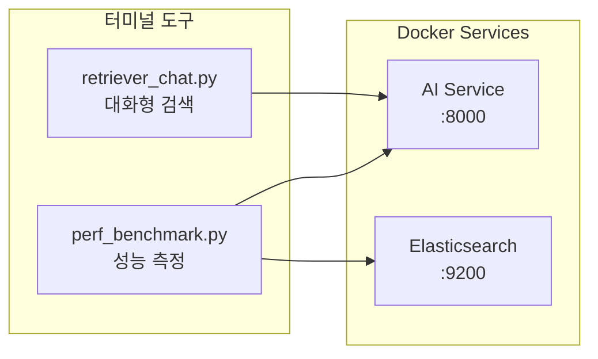
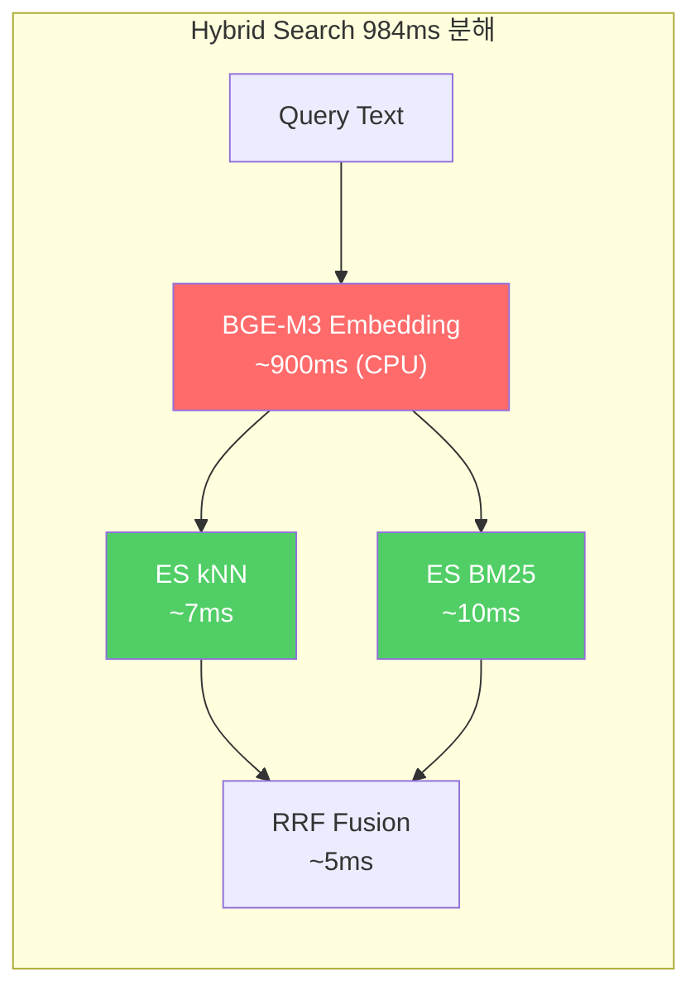
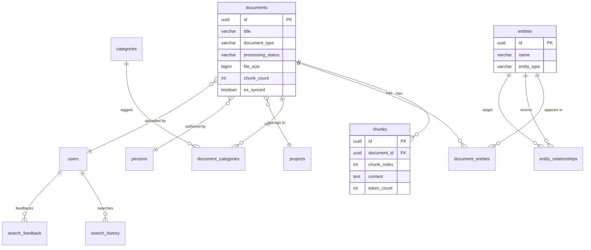

# Retriever & Benchmark 도구 사용 매뉴얼

**Version**: 2.0.0
**Date**: 2026-02-06
**Author**: Claude (Opus 4.6)

---

## Table of Contents

1. [개요](#1-개요)
2. [사전 준비](#2-사전-준비)
3. [Retriever Chat - 대화형 검색 도구](#3-retriever-chat---대화형-검색-도구)
4. [Performance Benchmark - 성능 측정 도구](#4-performance-benchmark---성능-측정-도구)
5. [실행 예시](#5-실행-예시)
6. [Kibana - Elasticsearch 데이터 조회](#6-kibana---elasticsearch-데이터-조회)
7. [Neo4j Browser - Graph 데이터 조회](#7-neo4j-browser---graph-데이터-조회)
8. [PostgreSQL - 관계형 데이터 조회](#8-postgresql---관계형-데이터-조회)
9. [FAQ](#9-faq)

---

## 1. 개요

두 가지 터미널 도구를 제공합니다:

| 도구 | 파일 | 용도 |
|------|------|------|
| **Retriever Chat** | `scripts/retriever_chat.py` | 터미널에서 대화형으로 Hybrid Search 테스트 |
| **Performance Benchmark** | `scripts/perf_benchmark.py` | 검색/업로드/인증 성능 자동 측정 + 리포트 |



---

## 2. 사전 준비

### 2.1 Docker 서비스 실행 확인

```bash
# AI Service 상태 확인
docker ps | grep ai-service

# 정상 출력 예시:
# kp-ai-service   ... Up 2 hours (healthy)   0.0.0.0:8000->8000/tcp
```

### 2.2 필요한 서비스

| 서비스 | 포트 | 필수 여부 |
|--------|------|----------|
| AI Service | 8000 | 필수 |
| Elasticsearch | 9200 | Benchmark의 ES kNN 측정 시 필수 |

### 2.3 Python 의존성

두 도구 모두 **Python 표준 라이브러리만** 사용하므로 별도 설치가 필요 없습니다.
(Benchmark의 업로드 테스트에서 `python-pptx`가 있으면 활용하지만, 없어도 동작합니다.)

---

## 3. Retriever Chat - 대화형 검색 도구

### 3.1 기본 실행

```bash
cd knowledge_service

# 기본 실행 (Hybrid Search, top_k=5)
python scripts/retriever_chat.py
```

### 3.2 실행 옵션

```bash
# 검색 타입 지정
python scripts/retriever_chat.py --type hybrid     # 하이브리드 (기본)
python scripts/retriever_chat.py --type semantic    # 벡터(시맨틱) 검색
python scripts/retriever_chat.py --type keyword     # 키워드(BM25) 검색

# 결과 개수 지정
python scripts/retriever_chat.py --top_k 10         # 상위 10개

# 원격 서버 접속
python scripts/retriever_chat.py --url http://192.168.1.100:8000

# 인증 정보 지정
python scripts/retriever_chat.py --email admin@example.com --password admin1234
```

### 3.3 대화 명령어

실행 후 프롬프트에서 사용할 수 있는 명령어:

| 명령어 | 설명 | 예시 |
|--------|------|------|
| `/type <t>` | 검색 타입 변경 | `/type keyword` |
| `/topk <n>` | 결과 개수 변경 | `/topk 10` |
| `/filter <k=v>` | 필터 추가 | `/filter document_type=pptx` |
| `/clear` | 필터 초기화 | `/clear` |
| `/stats` | 현재 설정 표시 | `/stats` |
| `/help` | 도움말 표시 | `/help` |
| `/quit` | 종료 | `/quit` (또는 Ctrl+C) |

### 3.4 검색 결과 해석

```
  [HYBRID]  5건  (984ms)
  ────────────────────────────────────────────────

  #1  0.0328  [vector]  test_msa_architecture.pptx  (pptx)
     Ranks: vector: #1, keyword: #1
     MSA(Microservice Architecture) 전환 전략 ...
```

| 필드 | 설명 |
|------|------|
| `[HYBRID]` | 사용된 검색 타입 |
| `5건` | 반환된 결과 수 |
| `(984ms)` | 응답 시간 |
| `#1` | 순위 |
| `0.0328` | RRF 융합 점수 (높을수록 관련성 높음) |
| `[vector]` | 검색 소스 (vector/keyword) |
| `Ranks` | 각 검색 엔진에서의 순위 |

### 3.5 점수 해석 가이드

| 점수 범위 | 색상 | 의미 |
|-----------|------|------|
| >= 0.03 | 초록 | 높은 관련성 - 정확한 매칭 |
| 0.015 ~ 0.03 | 노랑 | 보통 관련성 |
| < 0.015 | 빨강 | 낮은 관련성 - 관련 없을 수 있음 |

---

## 4. Performance Benchmark - 성능 측정 도구

### 4.1 기본 실행

```bash
cd knowledge_service

# 전체 벤치마크 (4개 항목 모두 측정)
python scripts/perf_benchmark.py
```

### 4.2 실행 옵션

```bash
# 특정 항목만 측정
python scripts/perf_benchmark.py --only search    # Hybrid Search만
python scripts/perf_benchmark.py --only upload     # 업로드만
python scripts/perf_benchmark.py --only esknn      # ES kNN 순수 검색만
python scripts/perf_benchmark.py --only token      # 토큰 인증만

# 반복 횟수 변경
python scripts/perf_benchmark.py --iterations 20   # 20회 반복

# 결과를 마크다운 파일로 저장
python scripts/perf_benchmark.py --output docs/results/perf_report.md

# 원격 서버 지정
python scripts/perf_benchmark.py --url http://host:8000 --es-url http://host:9200
```

### 4.3 측정 항목

| # | 항목 | 기본 반복 | 기준 | 설명 |
|---|------|----------|------|------|
| 1 | Hybrid Search | 10회 | < 500ms | API 검색 전체 (임베딩 생성 + ES 검색 + RRF 융합) |
| 2 | Document Upload | 5회 | < 3,000ms | PPTX 파일 업로드 (파싱 제외) |
| 3 | ES kNN (pure) | 10회 | < 100ms | ES에 직접 벡터 검색 (임베딩 생성 제외) |
| 4 | Token Auth | 5회 | < 2,000ms | JWT 토큰 발급 |

### 4.4 출력 리포트 예시

실행하면 콘솔에 실시간 결과가 표시되고, `--output`으로 마크다운 리포트를 저장할 수 있습니다.

```
  [1/4] Hybrid Search Benchmark (10 iterations)
     1/10    936ms  ==================
     2/10   1010ms  ====================
    ...

    Hybrid Search: avg=984ms min=898 max=1139 med=962 p95=1139 threshold=<500ms [FAIL]
```

### 4.5 성능 기준 해석



| 상황 | Hybrid Search 예상 | 설명 |
|------|-------------------|------|
| CPU (WSL2) | ~1,000ms | BGE-M3 임베딩 생성이 CPU에서 느림 |
| GPU (CUDA) | ~50ms 미만 | GPU 가속 시 임베딩 생성 대폭 단축 |
| 쿼리 캐시 적용 | ~20ms | 동일 쿼리 재검색 시 임베딩 캐시 활용 |

---

## 5. 실행 예시

### 5.1 Retriever Chat 세션 예시

```
$ python scripts/retriever_chat.py

  Connecting to AI Service...
  Connected! (health: 15ms)
  Authenticated! (token: 871ms)

  ============================================================
    Hybrid RAG Retriever - Interactive Chat
  ============================================================

  [hybrid|k=5] > MSA 마이크로서비스 전환

  [HYBRID]  5건  (936ms)
  ────────────────────────────────────────────────

  #1  0.0328  [vector]  test_msa_architecture.pptx  (pptx)
     Ranks: vector: #1, keyword: #1
     MSA(Microservice Architecture) 전환 전략 ...

  #2  0.0161  [vector]  test_rag_pipeline.pptx  (pptx)
     ...

  [hybrid|k=5] > /type keyword
  Search type -> keyword

  [keyword|k=5] > Elasticsearch 검색
  ...

  [keyword|k=5] > /quit
  Goodbye!
```

### 5.2 Performance Benchmark 세션 예시

```
$ python scripts/perf_benchmark.py --iterations 5 --output /tmp/perf.md

  Hybrid RAG Performance Benchmark
  ========================================

  Connecting...
  Connected & Authenticated (823ms)

  [1/4] Hybrid Search Benchmark (5 iterations)
     1/ 5    936ms  ==================
     2/ 5   1010ms  ====================
     3/ 5    962ms  ===================
     4/ 5    904ms  ==================
     5/ 5    958ms  ===================

    Hybrid Search: avg=954ms min=904 max=1010 med=958 p95=1010 threshold=<500ms [FAIL]

  [2/4] Document Upload Benchmark (5 iterations)
    ...

  Report saved to: /tmp/perf.md
  Benchmark complete!
```

---

## 6. Kibana - Elasticsearch 데이터 조회

### 6.1 접속 방법

| 항목 | 값 |
|------|------|
| **URL** | http://localhost:5601 |
| **인증** | 불필요 (개발 환경) |
| **컨테이너명** | `kp-kibana` |

브라우저에서 `http://localhost:5601`을 열면 Kibana 대시보드에 접속됩니다.

### 6.2 Index Pattern 설정 (최초 1회)

Kibana에서 데이터를 조회하려면 먼저 Index Pattern을 생성해야 합니다.

1. 좌측 메뉴 > **Stack Management** > **Index Patterns** (또는 **Data Views**)
2. **Create index pattern** 클릭
3. Name: `knowledge_chunks*` 입력
4. Timestamp field: `created_at` 선택 (또는 **I don't want to use the time filter**)
5. **Create index pattern** 클릭

### 6.3 Discover에서 데이터 조회

1. 좌측 메뉴 > **Discover** 클릭
2. 좌측 상단에서 Index Pattern `knowledge_chunks*` 선택
3. 시간 범위를 **Last 7 days** 이상으로 설정 (우측 상단 달력 아이콘)

### 6.4 Dev Tools 콘솔 (핵심 기능)

좌측 메뉴 > **Dev Tools** > **Console**에서 ES 쿼리를 직접 실행할 수 있습니다.

#### 인덱스 현황 확인

```
# 인덱스 목록 및 문서 수
GET _cat/indices?v&h=index,docs.count,store.size

# knowledge_chunks 매핑(스키마) 확인
GET knowledge_chunks/_mapping
```

#### 전체 문서 조회

```
# 전체 청크 수 확인
GET knowledge_chunks/_count

# 최근 10개 청크 조회
GET knowledge_chunks/_search
{
  "size": 10,
  "sort": [{"created_at": "desc"}],
  "_source": ["text", "heading", "document_id", "metadata.title", "token_count"]
}
```

#### 문서별 청크 통계 (Aggregation)

```
# 문서별 청크 수 + 평균 토큰 수
GET knowledge_chunks/_search
{
  "size": 0,
  "aggs": {
    "by_document": {
      "terms": {
        "field": "document_id.keyword",
        "size": 20
      },
      "aggs": {
        "avg_tokens": { "avg": { "field": "token_count" } },
        "total_tokens": { "sum": { "field": "token_count" } },
        "doc_title": {
          "terms": { "field": "metadata.title.keyword", "size": 1 }
        }
      }
    }
  }
}
```

#### 문서 타입별 통계

```
GET knowledge_chunks/_search
{
  "size": 0,
  "aggs": {
    "by_type": {
      "terms": { "field": "metadata.document_type.keyword", "size": 10 }
    }
  }
}
```

#### 키워드 검색 (BM25)

```
# text 필드에서 키워드 검색
GET knowledge_chunks/_search
{
  "size": 5,
  "query": {
    "match": {
      "text": "마이크로서비스 아키텍처 전환"
    }
  },
  "highlight": {
    "fields": { "text": {} }
  },
  "_source": ["text", "metadata.title", "token_count"]
}
```

#### 벡터 검색 (kNN) - 임베딩 벡터가 필요

```
# 주의: 실제 1024차원 벡터를 넣어야 합니다.
# 아래는 테스트용 더미 벡터입니다 (관련성 없는 결과 반환).
GET knowledge_chunks/_search
{
  "size": 5,
  "knn": {
    "field": "dense_vector",
    "query_vector": [0.01, 0.02, ...],
    "k": 5,
    "num_candidates": 50
  },
  "_source": ["text", "metadata.title"]
}
```

> **Tip**: 실제 벡터 검색은 `retriever_chat.py`를 사용하세요. AI Service가 쿼리 텍스트를 자동으로 벡터로 변환합니다.

#### 특정 문서의 청크만 조회

```
# document_id로 필터링
GET knowledge_chunks/_search
{
  "size": 50,
  "query": {
    "term": { "document_id.keyword": "여기에_document_id_입력" }
  },
  "sort": [{"chunk_index": "asc"}],
  "_source": ["text", "heading", "chunk_index", "token_count"]
}
```

#### 벡터 필드 존재 여부 확인 (임베딩 검증)

```
# dense_vector 필드가 있는 문서 수
GET knowledge_chunks/_count
{
  "query": {
    "exists": { "field": "dense_vector" }
  }
}
```

### 6.5 knowledge_chunks 필드 매핑

| 필드명 | 타입 | 설명 |
|--------|------|------|
| `text` | text | 청크 본문 텍스트 |
| `dense_vector` | dense_vector (1024d, cosine) | BGE-M3 임베딩 벡터 |
| `document_id` | text/keyword | 소속 문서 ID |
| `chunk_id` | text | 청크 고유 ID |
| `chunk_index` | long | 문서 내 청크 순번 |
| `heading` | text | 청크 제목/헤딩 |
| `token_count` | long | 토큰 수 |
| `total_chunks` | long | 해당 문서의 전체 청크 수 |
| `metadata.title` | text/keyword | 문서 제목 |
| `metadata.document_type` | text/keyword | 문서 타입 (pptx, pdf 등) |
| `metadata.project_name` | text/keyword | 프로젝트명 |
| `metadata.language` | text/keyword | 언어 |
| `metadata.keywords` | text/keyword | 키워드 목록 |
| `metadata.ingestion_timestamp` | date | 색인 시각 |
| `created_at` | date | 생성 시각 |
| `updated_at` | date | 수정 시각 |

---

## 7. Neo4j Browser - Graph 데이터 조회

### 7.1 접속 방법

| 항목 | 값 |
|------|------|
| **URL** | http://localhost:7474 |
| **Username** | `neo4j` |
| **Password** | `neo4j_dev_2026!` |
| **Database** | `neo4j` (기본) |
| **Bolt Port** | 7687 |
| **컨테이너명** | `kp-neo4j` |

1. 브라우저에서 `http://localhost:7474` 접속
2. Connect URL: `neo4j://localhost:7687` (기본값 유지)
3. Username: `neo4j`, Password: `neo4j_dev_2026!` 입력
4. **Connect** 클릭

### 7.2 기본 Cypher 쿼리

상단 입력창에 Cypher 쿼리를 입력하고 **실행 (Ctrl+Enter)** 합니다.

#### 전체 노드/관계 통계

```cypher
// 노드 라벨별 수량
MATCH (n)
RETURN labels(n)[0] AS label, count(*) AS count
ORDER BY count DESC
```

```cypher
// 관계 타입별 수량
MATCH ()-[r]->()
RETURN type(r) AS relationship, count(*) AS count
ORDER BY count DESC
```

```cypher
// 전체 DB 통계 (노드 + 관계 + 라벨 수)
CALL apoc.meta.stats() YIELD nodeCount, relCount, labelCount
RETURN nodeCount, relCount, labelCount
```

#### 전체 그래프 시각화 (소규모 데이터)

```cypher
// 최대 100개 노드와 관계를 그래프로 표시
MATCH (n)-[r]->(m)
RETURN n, r, m
LIMIT 100
```

> **Tip**: Neo4j Browser는 결과를 자동으로 그래프 시각화합니다. **Graph** 탭을 클릭하세요.

#### Chunk 노드 조회

```cypher
// 모든 Chunk 노드 목록
MATCH (c:Chunk)
RETURN c.chunk_id AS id, c.text AS text, c.document_id AS doc_id
LIMIT 20
```

```cypher
// 특정 문서의 청크 조회
MATCH (c:Chunk)
WHERE c.document_id = '여기에_document_id_입력'
RETURN c.chunk_id, c.text, c.chunk_index
ORDER BY c.chunk_index
```

#### Document 노드 조회

```cypher
// Document 노드가 있는 경우
MATCH (d:Document)
RETURN d.title, d.document_type, d.document_id
LIMIT 20
```

#### Entity 노드 및 관계 조회

```cypher
// 엔티티 노드 조회
MATCH (e:Entity)
RETURN e.name, e.type, e.description
LIMIT 20
```

```cypher
// 엔티티 간 관계 탐색 (그래프 시각화)
MATCH (e1:Entity)-[r]->(e2:Entity)
RETURN e1, r, e2
LIMIT 50
```

```cypher
// 특정 엔티티와 연결된 모든 노드 탐색
MATCH (e:Entity {name: '검색할_엔티티명'})-[r]-(connected)
RETURN e, r, connected
```

#### 스키마 확인

```cypher
// DB 스키마 (노드 라벨, 관계 타입, 속성) 시각화
CALL db.schema.visualization()
```

```cypher
// 모든 라벨 목록
CALL db.labels() YIELD label RETURN label
```

```cypher
// 모든 관계 타입 목록
CALL db.relationshipTypes() YIELD relationshipType RETURN relationshipType
```

```cypher
// 특정 라벨의 속성(컬럼) 목록
MATCH (n:Chunk)
UNWIND keys(n) AS key
RETURN DISTINCT key
ORDER BY key
```

### 7.3 현재 데이터 현황

> **참고**: Neo4j MERGE ON CREATE 구문 에러(Known Issue)로 인해 엔티티/관계 추출이 실패하여 현재 Chunk 노드만 존재합니다.

| 노드 라벨 | 수량 | 설명 |
|-----------|------|------|
| Chunk | 6 | 초기 데이터 로드 시 생성된 청크 |
| Document | 0 | (미생성 - Known Issue) |
| Entity | 0 | (미생성 - Known Issue) |

### 7.4 터미널에서 Cypher 쿼리 실행

Neo4j Browser 외에 터미널에서도 쿼리를 실행할 수 있습니다.

```bash
# cypher-shell 사용 (컨테이너 내부)
docker exec kp-neo4j cypher-shell \
  -u neo4j -p "neo4j_dev_2026!" \
  "MATCH (n) RETURN labels(n)[0] AS label, count(*) AS cnt;"

# 특정 쿼리 실행
docker exec kp-neo4j cypher-shell \
  -u neo4j -p "neo4j_dev_2026!" \
  "MATCH (c:Chunk) RETURN c.chunk_id, left(c.text, 80) AS preview LIMIT 5;"
```

---

## 8. PostgreSQL - 관계형 데이터 조회

### 8.1 접속 방법

| 항목 | 값 |
|------|------|
| **Host** | `localhost` |
| **Port** | `5432` |
| **Database** | `knowledge` |
| **Username** | `knowledge` |
| **Password** | `knowledge_dev_2026!` |
| **컨테이너명** | `kp-postgresql` |

#### 방법 1: 터미널 (docker exec)

```bash
# 대화형 psql 접속
docker exec -it kp-postgresql psql -U knowledge -d knowledge

# 단일 쿼리 실행
docker exec kp-postgresql psql -U knowledge -d knowledge -c "SELECT count(*) FROM documents;"
```

#### 방법 2: 외부 클라이언트 (DBeaver, DataGrip 등)

| 설정 | 값 |
|------|------|
| Host | `localhost` |
| Port | `5432` |
| Database | `knowledge` |
| User | `knowledge` |
| Password | `knowledge_dev_2026!` |
| Driver | PostgreSQL |

> **주의**: docker-compose.yml에서 포트 매핑 확인 필요. 현재 `5432:5432`로 외부 노출됨.

#### 방법 3: 대화형 psql 접속 후 사용

```bash
docker exec -it kp-postgresql psql -U knowledge -d knowledge
```

접속 후 psql 프롬프트에서:

```sql
-- 도움말
\?          -- psql 명령어 도움말
\dt         -- 테이블 목록
\d 테이블명  -- 테이블 스키마 조회
\q          -- 종료
```

### 8.2 데이터베이스 구조 확인

#### 테이블 목록

```sql
-- 전체 테이블 목록 (17개)
\dt

-- 또는 SQL로:
SELECT table_schema, table_name
FROM information_schema.tables
WHERE table_schema IN ('public', 'audit')
ORDER BY table_schema, table_name;
```

#### 주요 테이블 스키마 확인

```sql
-- documents 테이블 구조
\d documents

-- chunks 테이블 구조
\d chunks

-- entities 테이블 구조
\d entities
```

### 8.3 주요 테이블 데이터 조회

#### 테이블별 레코드 수 (전체 현황)

```sql
SELECT 'documents' AS table_name, count(*) AS rows FROM documents
UNION ALL SELECT 'chunks', count(*) FROM chunks
UNION ALL SELECT 'entities', count(*) FROM entities
UNION ALL SELECT 'entity_relationships', count(*) FROM entity_relationships
UNION ALL SELECT 'search_history', count(*) FROM search_history
UNION ALL SELECT 'users', count(*) FROM users
UNION ALL SELECT 'projects', count(*) FROM projects
UNION ALL SELECT 'categories', count(*) FROM categories
UNION ALL SELECT 'audit_logs', count(*) FROM audit_logs
ORDER BY rows DESC;
```

#### documents 테이블 (문서 관리)

```sql
-- 전체 문서 목록
SELECT
    id,
    title,
    document_type,
    processing_status,
    file_size,
    chunk_count,
    entity_count,
    es_synced,
    neo4j_synced,
    created_at::date
FROM documents
ORDER BY created_at DESC;

-- 처리 상태별 통계
SELECT processing_status, count(*) AS cnt
FROM documents
GROUP BY processing_status;

-- 문서 타입별 통계
SELECT document_type, count(*) AS cnt, sum(file_size) AS total_size
FROM documents
GROUP BY document_type
ORDER BY cnt DESC;
```

#### chunks 테이블 (청크 데이터)

```sql
-- 청크 목록 (문서별)
SELECT
    c.id,
    c.document_id,
    d.title AS doc_title,
    c.chunk_index,
    c.token_count,
    left(c.content, 100) AS preview
FROM chunks c
JOIN documents d ON c.document_id = d.id
ORDER BY d.title, c.chunk_index;

-- 문서별 청크 수 및 평균 토큰 수
SELECT
    d.title,
    count(c.id) AS chunk_count,
    avg(c.token_count)::int AS avg_tokens,
    sum(c.token_count) AS total_tokens
FROM documents d
LEFT JOIN chunks c ON d.id = c.document_id
GROUP BY d.title
ORDER BY chunk_count DESC;
```

#### entities 테이블 (엔티티)

```sql
-- 엔티티 목록
SELECT id, name, entity_type, description, created_at::date
FROM entities
ORDER BY created_at DESC
LIMIT 20;

-- 엔티티 타입별 통계
SELECT entity_type, count(*) AS cnt
FROM entities
GROUP BY entity_type
ORDER BY cnt DESC;
```

#### entity_relationships 테이블 (엔티티 관계)

```sql
-- 엔티티 간 관계 조회
SELECT
    e1.name AS source,
    er.relationship_type,
    e2.name AS target,
    er.confidence
FROM entity_relationships er
JOIN entities e1 ON er.source_entity_id = e1.id
JOIN entities e2 ON er.target_entity_id = e2.id
ORDER BY er.confidence DESC
LIMIT 20;
```

#### search_history 테이블 (검색 이력)

```sql
-- 최근 검색 이력
SELECT
    query_text,
    search_type,
    result_count,
    latency_ms,
    created_at
FROM search_history
ORDER BY created_at DESC
LIMIT 20;

-- 검색 타입별 평균 응답시간
SELECT
    search_type,
    count(*) AS searches,
    avg(latency_ms)::int AS avg_ms,
    max(latency_ms) AS max_ms
FROM search_history
GROUP BY search_type;
```

#### users 테이블 (사용자)

```sql
-- 사용자 목록
SELECT id, email, name, role, is_active, created_at::date
FROM users
ORDER BY created_at DESC;
```

#### audit 스키마 (감사 로그)

```sql
-- 최근 활동 로그
SELECT
    action,
    entity_type,
    entity_id,
    user_id,
    details,
    created_at
FROM audit.activity_log
ORDER BY created_at DESC
LIMIT 20;
```

### 8.4 유용한 분석 쿼리

#### 문서-청크-ES 동기화 상태 크로스 체크

```sql
-- 문서별 PG 청크 수 vs ES 동기화 상태
SELECT
    d.title,
    d.processing_status,
    d.chunk_count AS expected_chunks,
    count(c.id) AS actual_chunks,
    d.es_synced,
    d.neo4j_synced
FROM documents d
LEFT JOIN chunks c ON d.id = c.document_id
GROUP BY d.id, d.title, d.processing_status, d.chunk_count, d.es_synced, d.neo4j_synced
ORDER BY d.created_at DESC;
```

#### 저장소 간 데이터 비교 (PG vs ES)

```bash
# PG 문서 수
docker exec kp-postgresql psql -U knowledge -d knowledge \
  -c "SELECT count(*) AS pg_docs FROM documents;"

# ES 청크 수
curl -s "http://localhost:9200/knowledge_chunks/_count" | python3 -m json.tool

# AI Service 문서 수 (인증 필요)
AI_TOKEN=$(curl -s -X POST http://localhost:8000/api/v1/auth/login \
  -H "Content-Type: application/json" \
  -d '{"email":"admin@example.com","password":"admin1234"}' | python3 -c "import json,sys;print(json.load(sys.stdin)['accessToken'])")

curl -s http://localhost:8000/api/v1/documents \
  -H "Authorization: Bearer $AI_TOKEN" | python3 -c "import json,sys;d=json.load(sys.stdin);print(f'AI Service docs: {d[\"total\"]}')"
```

### 8.5 현재 데이터 현황

| 테이블 | 레코드 수 | 비고 |
|--------|----------|------|
| documents | 2 | PG에 직접 업로드된 문서 (AI Service 경유분은 미동기화) |
| chunks | 0 | PG에는 청크 미저장 (ES에만 33건 존재) |
| entities | 0 | Neo4j 구문 에러로 미생성 |
| users | 1 | admin 계정 |
| projects | 0 | - |
| search_history | 0 | - |

### 8.6 주요 테이블 관계도 (ERD)



---

## 9. FAQ

### Q: "AI Service에 연결할 수 없습니다" 에러가 나요

Docker 서비스가 실행 중인지 확인하세요:
```bash
docker ps | grep ai-service
# 실행 안 되어 있으면:
cd infrastructure/docker && docker-compose up -d ai-service
```

### Q: "인증 실패" 에러가 나요

기본 계정 정보를 확인하세요:
- Email: `admin@example.com`
- Password: `admin1234`

다른 계정이면 `--email` / `--password` 옵션으로 지정하세요.

### Q: Hybrid Search가 500ms를 초과하는데 문제인가요?

현재 **CPU 환경**(WSL2)에서는 정상입니다. BGE-M3 모델의 쿼리 임베딩 생성이 CPU에서 ~900ms 소요됩니다.
GPU 환경에서는 50ms 미만으로 단축됩니다. ES kNN 자체는 7ms로 매우 빠릅니다.

### Q: 색상이 안 보여요

환경변수 `NO_COLOR=1`이 설정되어 있으면 색상이 비활성화됩니다.
또는 터미널이 ANSI 색상을 지원하지 않을 수 있습니다.

### Q: Windows CMD에서 실행할 수 있나요?

WSL2 터미널 또는 PowerShell에서 실행하세요. CMD는 ANSI 색상을 지원하지 않을 수 있습니다.

---

*Related Documents:*
- [UAT 종합 테스트 시나리오](../04_testing/uat_comprehensive_test_2026-02-06.md)
- [UAT Part B 실행 결과](../04_testing/uat_partB_execution_results_2026-02-06.md)
