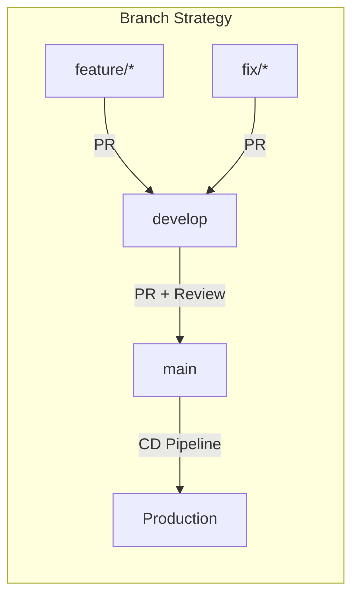

# Branch Protection 설정 가이드

**Version**: 1.1 | **Updated**: 2026-01-26 | **Author**: DevOps Engineer
**STORY**: STORY-023 CI/CD Pipeline 기초 검증 및 Branch Protection

---

## 1. 개요

이 문서는 GitHub Branch Protection Rules를 설정하여 코드 품질과 배포 안정성을 보장하기 위한 가이드입니다. `main` 브랜치와 `develop` 브랜치에 대한 보호 규칙을 정의합니다.

### 1.1 목적

- **main 브랜치**: 프로덕션 배포 대상. 직접 push 차단, CI 통과 및 리뷰 승인 필수
- **develop 브랜치**: 개발 통합 브랜치. PR 필수, 빌드 통과 필수

### 1.2 브랜치 전략



---

## 2. main 브랜치 보호 규칙

### 2.1 필수 설정

| 설정 | 값 | 설명 |
|------|-----|------|
| **Require a pull request before merging** | ON | Direct push 차단 |
| **Required approving reviews** | 1명 이상 | 최소 1명의 리뷰어 승인 필요 |
| **Dismiss stale pull request approvals** | ON | 새 커밋 push 시 기존 승인 무효화 |
| **Require review from Code Owners** | OFF (선택) | CODEOWNERS 파일 기반 리뷰 |
| **Require status checks to pass** | ON | CI Pipeline 통과 필수 |
| **Required status checks** | `CI Summary` | ci.yml의 ci-summary job |
| **Require branches to be up to date** | ON | 머지 전 최신 base 브랜치와 동기화 |
| **Require conversation resolution** | ON | 모든 리뷰 대화 해결 필수 |
| **Include administrators** | ON | 관리자도 규칙 적용 |
| **Allow force pushes** | OFF | Force push 차단 |
| **Allow deletions** | OFF | 브랜치 삭제 차단 |

### 2.2 필수 Status Check 목록

`ci.yml` 워크플로우의 `ci-summary` job이 Branch Protection의 Required Status Check으로 설정됩니다.

```
Required Status Checks:
  - "CI Summary"           # ci.yml > ci-summary job
```

`ci-summary` job은 내부적으로 다음 모든 job의 결과를 검증합니다:

| Job | 검증 내용 | 실패 시 동작 |
|-----|----------|-------------|
| `backend-test` | Backend 빌드/테스트 | ci-summary 실패 |
| `gateway-test` | Gateway 빌드/테스트 | ci-summary 실패 |
| `frontend-test` | Frontend 빌드/테스트 | ci-summary 실패 |
| `ai-service-test` | AI Service 빌드/테스트 | ci-summary 실패 |
| `security-scan` | Trivy 보안 스캔 | 경고만 (실패 안함) |
| `docker-build-test` | Docker 이미지 빌드 검증 | 경고만 (실패 안함) |

> **참고**: 변경 감지(path filter)로 인해 변경되지 않은 서비스의 Job은 `skipped` 상태가 됩니다. `ci-summary`는 `skipped`를 정상으로 처리합니다.

### 2.3 선택 Status Check (권장)

추가로 아래 워크플로우를 Required Check에 포함할 수 있습니다:

```
Optional Status Checks (권장):
  - "PR Build Summary"        # pr-build.yml > pr-summary job
  - "Quality Summary"         # code-quality.yml > quality-summary job
  - "Validate Docker Compose" # docker-compose-validate.yml (인프라 변경 시)
  - "E2E Test Summary"        # e2e-test.yml > e2e-summary job (프론트엔드 변경 시)
```

---

## 3. develop 브랜치 보호 규칙

### 3.1 필수 설정

| 설정 | 값 | 설명 |
|------|-----|------|
| **Require a pull request before merging** | ON | Direct push 차단 |
| **Required approving reviews** | 0명 (선택) | 리뷰 없이도 머지 가능 |
| **Require status checks to pass** | ON | 빌드 통과 필수 |
| **Required status checks** | `PR Build Summary` | pr-build.yml의 pr-summary job |
| **Require branches to be up to date** | OFF | 빠른 통합을 위해 비활성화 |
| **Allow force pushes** | OFF | Force push 차단 |
| **Allow deletions** | OFF | 브랜치 삭제 차단 |

### 3.2 필수 Status Check 목록

```
Required Status Checks:
  - "PR Build Summary"     # pr-build.yml > pr-summary job
```

---

## 4. 1인 개발 환경 설정

> **주의**: 1인 프로젝트에서 "Required approvals: 1"로 설정하면 본인이 올린 PR을 본인이 승인할 수 없어 **머지가 불가능**합니다.

### 4.1 권장 설정 (1인 개발)

| 설정 | 값 | 설명 |
|------|-----|------|
| **Require a pull request before merging** | OFF 또는 approvals=0 | PR 없이 push 가능 |
| **Require status checks to pass** | ON | CI 통과는 필수 유지 |
| ├─ Require branches to be up to date | ON | 최신 base와 동기화 |
| ├─ Required status checks | `CI Summary` | ci.yml의 ci-summary job |
| **Do not allow force pushes** | ON | Force push 차단 |
| **Do not allow deletions** | ON | 브랜치 삭제 차단 |
| **Include administrators** | OFF | 관리자(본인)는 긴급 시 우회 가능 |

### 4.2 gh CLI 설정 (1인 개발)

```bash
gh api \
  --method PUT \
  -H "Accept: application/vnd.github+json" \
  -H "X-GitHub-Api-Version: 2022-11-28" \
  /repos/{owner}/{repo}/branches/main/protection \
  --input - << 'EOF'
{
  "required_status_checks": {
    "strict": true,
    "contexts": [
      "CI Summary"
    ]
  },
  "enforce_admins": false,
  "required_pull_request_reviews": null,
  "restrictions": null,
  "required_conversation_resolution": false,
  "allow_force_pushes": false,
  "allow_deletions": false
}
EOF
```

### 4.3 팀 규모 전환 시

1인 → 팀 개발 전환 시 아래 항목을 활성화합니다:

1. `required_pull_request_reviews` 활성화 (approvals: 1)
2. `enforce_admins` → `true`
3. `required_conversation_resolution` → `true`
4. CODEOWNERS 파일 생성 (섹션 7 참조)

---

## 5. GitHub UI로 설정하기

### 5.1 설정 경로

```
Repository > Settings > Branches > Branch protection rules > Add rule
```

### 5.2 main 브랜치 설정 단계

1. **Branch name pattern**: `main`
2. 아래 항목을 체크합니다:
   - [x] Require a pull request before merging
     - [x] Require approvals: **1**
     - [x] Dismiss stale pull request approvals when new commits are pushed
     - [x] Require conversation resolution before merging
   - [x] Require status checks to pass before merging
     - [x] Require branches to be up to date before merging
     - Status checks 검색창에서 `CI Summary` 선택
   - [x] Include administrators
   - [x] Do not allow bypassing the above settings

3. **Create** 버튼 클릭

### 5.3 develop 브랜치 설정 단계

1. **Branch name pattern**: `develop`
2. 아래 항목을 체크합니다:
   - [x] Require a pull request before merging
     - Require approvals: **0** (또는 비활성화)
   - [x] Require status checks to pass before merging
     - Status checks 검색창에서 `PR Build Summary` 선택

3. **Create** 버튼 클릭

---

## 6. gh CLI로 설정하기

### 6.1 사전 준비

```bash
# gh CLI 설치 확인
gh --version

# 인증 (repo 권한 필요)
gh auth login

# 리포지토리 확인
gh repo view --json nameWithOwner
```

### 6.2 main 브랜치 보호 규칙 설정

```bash
# main 브랜치 보호 규칙 설정
gh api \
  --method PUT \
  -H "Accept: application/vnd.github+json" \
  -H "X-GitHub-Api-Version: 2022-11-28" \
  /repos/{owner}/{repo}/branches/main/protection \
  --input - << 'EOF'
{
  "required_status_checks": {
    "strict": true,
    "contexts": [
      "CI Summary"
    ]
  },
  "enforce_admins": true,
  "required_pull_request_reviews": {
    "dismissal_restrictions": {},
    "dismiss_stale_reviews": true,
    "require_code_owner_reviews": false,
    "required_approving_review_count": 1,
    "require_last_push_approval": false
  },
  "restrictions": null,
  "required_conversation_resolution": true,
  "allow_force_pushes": false,
  "allow_deletions": false,
  "block_creations": false,
  "required_linear_history": false
}
EOF
```

### 6.3 develop 브랜치 보호 규칙 설정

```bash
# develop 브랜치 보호 규칙 설정
gh api \
  --method PUT \
  -H "Accept: application/vnd.github+json" \
  -H "X-GitHub-Api-Version: 2022-11-28" \
  /repos/{owner}/{repo}/branches/develop/protection \
  --input - << 'EOF'
{
  "required_status_checks": {
    "strict": false,
    "contexts": [
      "PR Build Summary"
    ]
  },
  "enforce_admins": false,
  "required_pull_request_reviews": {
    "dismissal_restrictions": {},
    "dismiss_stale_reviews": false,
    "require_code_owner_reviews": false,
    "required_approving_review_count": 0
  },
  "restrictions": null,
  "required_conversation_resolution": false,
  "allow_force_pushes": false,
  "allow_deletions": false
}
EOF
```

### 6.4 보호 규칙 확인

```bash
# main 브랜치 보호 규칙 확인
gh api \
  -H "Accept: application/vnd.github+json" \
  /repos/{owner}/{repo}/branches/main/protection

# develop 브랜치 보호 규칙 확인
gh api \
  -H "Accept: application/vnd.github+json" \
  /repos/{owner}/{repo}/branches/develop/protection
```

### 6.5 보호 규칙 삭제 (비상 시)

```bash
# 보호 규칙 삭제 (주의: 되돌릴 수 없음)
gh api \
  --method DELETE \
  -H "Accept: application/vnd.github+json" \
  /repos/{owner}/{repo}/branches/main/protection
```

---

## 7. CODEOWNERS 설정 (선택)

### 7.1 CODEOWNERS 파일

프로젝트 루트에 `.github/CODEOWNERS` 파일을 생성하여 자동 리뷰어를 지정할 수 있습니다.

```
# .github/CODEOWNERS (예시)

# Default owner
*                             @tech-lead

# Backend
knowledge_service/backend/    @backend-developer
knowledge_service/gateway/    @backend-developer

# Frontend
knowledge_service/frontend/   @frontend-developer

# AI Service
knowledge_service/src/        @rag-engineer

# Infrastructure
infrastructure/               @infra-engineer @devops-engineer

# CI/CD
.github/                      @devops-engineer
```

---

## 8. 운영 가이드

### 8.1 긴급 배포 시 (Bypass)

비상 상황에서 Branch Protection을 우회해야 하는 경우:

1. Repository Admin이 임시로 "Include administrators" 해제
2. 직접 push 또는 리뷰 없이 머지
3. 작업 완료 후 즉시 "Include administrators" 다시 활성화
4. Slack alerts 채널에 우회 사유 기록

### 8.2 Status Check 실패 시

| 상황 | 대응 |
|------|------|
| CI Summary 실패 | 실패한 Job 로그 확인 후 코드 수정 |
| Flaky Test | 재실행 (Re-run failed jobs) |
| 인프라 문제 | Actions runner 상태 확인 |
| Timeout | 타임아웃 값 조정 (workflow timeout-minutes) |

### 8.3 모니터링

```bash
# 최근 워크플로우 실행 결과 확인
gh run list --limit 10

# 특정 워크플로우 실행 상세
gh run view {run-id}

# 실패한 실행만 조회
gh run list --status failure --limit 5
```

---

## 9. 참고 문서

- [CI/CD Pipeline 검증 보고서](./cicd_pipeline_report.md) - 워크플로우 정합성 분석
- [인프라 설계서](../02_design/10_infrastructure_detailed_design.md) - Docker Compose 기반 아키텍처
- [Observability 설계서](../02_design/14_observability_detailed_design.md) - Prometheus/Grafana/Jaeger
- [GitHub Branch Protection API](https://docs.github.com/en/rest/branches/branch-protection)
- [GitHub Actions Status Checks](https://docs.github.com/en/pull-requests/collaborating-with-pull-requests/collaborating-on-repositories-with-code-owners)
