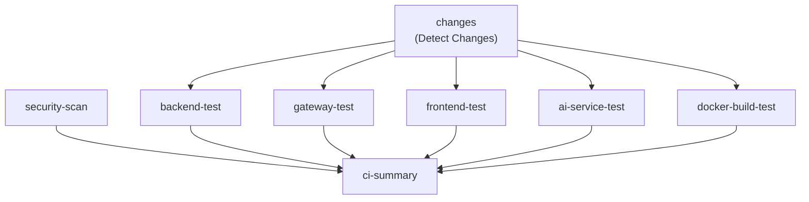
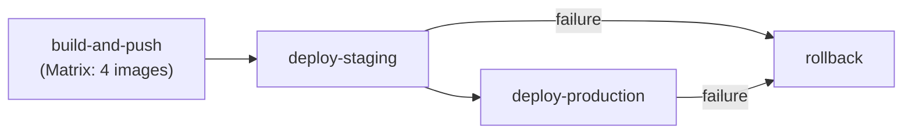
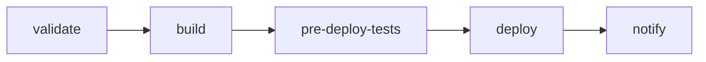
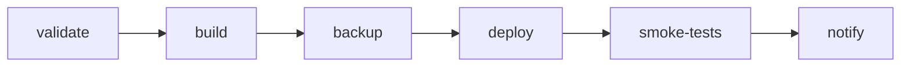
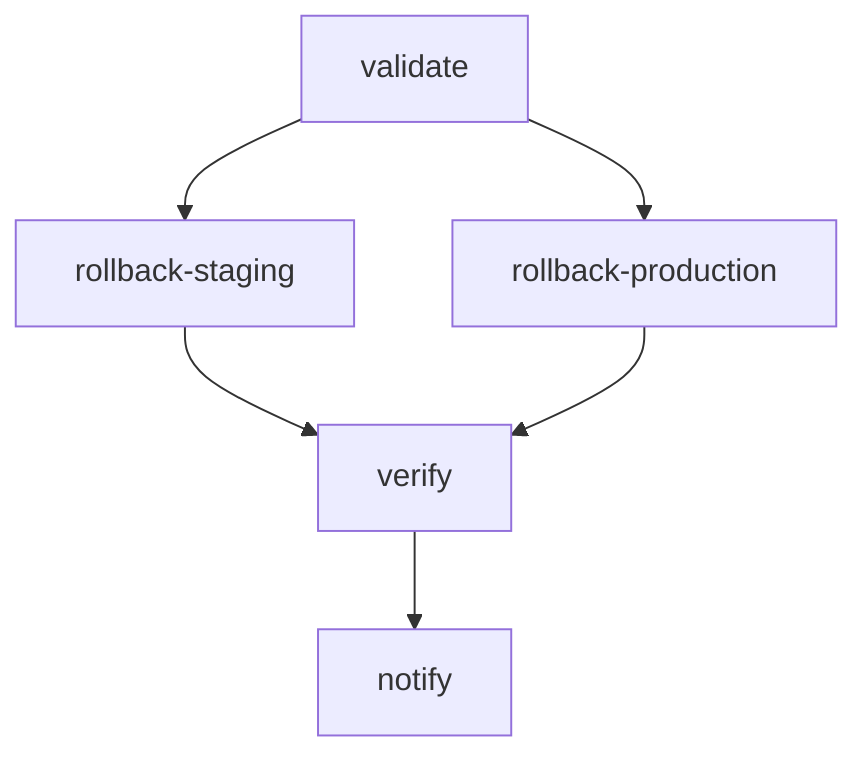

# CI/CD Pipeline 검증 보고서

**Version**: 2.0 | **Updated**: 2026-02-04 | **Author**: DevOps Engineer
**STORY**: STORY-023 CI/CD Pipeline 기초 검증 및 Branch Protection
**Update**: STORY-074 CI/CD Pipeline Setup (GitHub Actions)

---

## 1. 개요

이 보고서는 프로젝트의 GitHub Actions 워크플로우에 대한 정합성 검증 결과를 정리합니다.

### 1.1 검증 대상

| # | 워크플로우 파일 | 이름 | 목적 |
|---|----------------|------|------|
| 1 | `ci.yml` | CI Pipeline | PR/Push 시 전체 빌드/테스트/보안 검증 |
| 2 | `pr-build.yml` | PR Build | PR 빌드 검증 (언어별 분류) |
| 3 | `cd.yml` | CD Pipeline | main push 시 Docker 이미지 빌드 및 배포 |
| 4 | `docker-build.yml` | Docker Build | Docker 이미지 빌드 및 레지스트리 Push |
| 5 | `code-quality.yml` | Code Quality | 코드 품질 검사 (lint, format, type check) |
| 6 | `docker-compose-validate.yml` | Docker Compose Validate | Docker Compose 설정 검증 |
| 7 | `e2e-test.yml` | E2E Tests | Playwright E2E 테스트 |
| 8 | `deploy-staging.yml` | Deploy Staging | Staging 환경 배포 (NEW) |
| 9 | `deploy-production.yml` | Deploy Production | Production 환경 배포 (NEW) |
| 10 | `rollback.yml` | Rollback | 배포 롤백 (NEW) |

---

## 2. 워크플로우별 상세 분석

### 2.1 ci.yml - CI Pipeline

**트리거**: PR (main, develop), Push (develop)

**Job 구성**:



| Job | 조건 | 내용 |
|-----|------|------|
| `changes` | 항상 | dorny/paths-filter@v3으로 변경 감지 |
| `backend-test` | backend 또는 gateway 변경 시 | Java 빌드/테스트 (Gradle) |
| `gateway-test` | gateway 변경 시 | Java 빌드/테스트 (Gradle) |
| `frontend-test` | frontend 변경 시 | Node.js 빌드/테스트 (npm) |
| `ai-service-test` | ai-service 변경 시 | Python 테스트 (Poetry/pytest) |
| `security-scan` | 항상 | Trivy 취약점 스캔 |
| `docker-build-test` | 컴포넌트 변경 시 | Docker 빌드 검증 (push 없음) |
| `ci-summary` | 항상 (if: always()) | 전체 결과 요약 및 실패 판정 |

**검증 결과**: PASS

---

### 2.2 pr-build.yml - PR Build

**트리거**: PR (main, develop)

| Job | 조건 | 내용 |
|-----|------|------|
| `changes` | 항상 | python/java/typescript 변경 감지 |
| `python-build` | python 변경 시 | Poetry install + pytest + build |
| `java-build` | java 변경 시 | Gradle build (gateway + backend) |
| `typescript-build` | typescript 변경 시 | npm ci + lint + test + build |
| `pr-summary` | 항상 (if: always()) | PR 빌드 결과 요약 |

**검증 결과**: PASS

---

### 2.3 cd.yml - CD Pipeline

**트리거**: Push (main), Tag (v*), Manual dispatch



**검증 결과**: PASS

---

### 2.4 deploy-staging.yml - Staging Deployment (NEW)

**트리거**: Push (develop), Manual dispatch

**Job 구성**:



| Job | 조건 | 내용 |
|-----|------|------|
| `validate` | 항상 | 배포 조건 검증, 버전 결정 |
| `build` | validate 통과 시 | 4개 Docker 이미지 빌드 및 Push |
| `pre-deploy-tests` | 빌드 완료 후 | 사전 배포 테스트 (스모크 테스트) |
| `deploy` | 빌드 및 테스트 통과 | SSH로 Staging 환경 배포 |
| `notify` | 항상 | Slack 알림 (성공/실패) |

**주요 기능**:
- develop 브랜치 push 시 자동 배포
- Manual dispatch로 특정 버전 배포 가능
- 배포 전 스모크 테스트
- Slack 알림 (dev 채널)

**검증 결과**: PASS (신규)

---

### 2.5 deploy-production.yml - Production Deployment (NEW)

**트리거**: Tag push (v*), Manual dispatch (승인 필요)

**Job 구성**:



| Job | 조건 | 내용 |
|-----|------|------|
| `validate` | 항상 | 확인 문자열 검증, 버전 포맷 검증 |
| `build` | validate 통과 시 | Production용 Docker 이미지 빌드 |
| `backup` | 빌드 완료 후 | 배포 전 데이터베이스 백업 |
| `deploy` | 백업 완료 후 (환경 승인 필요) | SSH로 Production 환경 배포 |
| `smoke-tests` | 배포 완료 후 | Production 스모크 테스트 |
| `notify` | 항상 | Slack 알림 (alerts 채널) |

**주요 기능**:
- Tag (v*) push 시 또는 수동 트리거
- Manual dispatch 시 "DEPLOY" 확인 문자열 필요
- GitHub Environment Protection 활용 (수동 승인)
- 배포 전 자동 백업
- GitHub Release 자동 생성

**검증 결과**: PASS (신규)

---

### 2.6 rollback.yml - Rollback Deployment (NEW)

**트리거**: Manual dispatch only

**Job 구성**:



| Job | 조건 | 내용 |
|-----|------|------|
| `validate` | 항상 | 확인 문자열 검증, 입력값 검증 |
| `rollback-staging` | environment=staging | Staging 환경 롤백 |
| `rollback-production` | environment=production | Production 환경 롤백 (승인 필요) |
| `verify` | 롤백 완료 후 | 롤백 결과 검증 |
| `notify` | 항상 | Slack 알림 (alerts 채널) |

**주요 기능**:
- Manual dispatch로만 트리거 가능
- Production 롤백 시 "ROLLBACK" 확인 문자열 필요
- 특정 버전으로 롤백 지정 가능
- 데이터베이스 복원 옵션 (주의 필요)
- 롤백 이유 기록 필수

**입력 파라미터**:

| 파라미터 | 필수 | 설명 |
|---------|:----:|------|
| `environment` | Yes | 롤백 대상 환경 (staging/production) |
| `version` | Yes | 롤백할 버전 (v1.0.0 또는 sha-abc1234) |
| `confirm_rollback` | Yes | Production의 경우 "ROLLBACK" 입력 필요 |
| `reason` | Yes | 롤백 사유 |
| `restore_database` | No | 데이터베이스 복원 여부 (기본: false) |
| `backup_date` | No | 복원할 백업 날짜 (YYYYMMDD_HHMMSS) |

**검증 결과**: PASS (신규)

---

### 2.7 기타 워크플로우

| 워크플로우 | 목적 | 상태 |
|-----------|------|------|
| `docker-build.yml` | Docker 이미지 빌드 및 Push | PASS |
| `code-quality.yml` | 코드 품질 검사 | PASS |
| `docker-compose-validate.yml` | Docker Compose 검증 | PASS |
| `e2e-test.yml` | E2E 테스트 | PASS |

---

## 3. 재사용 가능한 Composite Actions (NEW)

### 3.1 docker-build Action

**위치**: `.github/actions/docker-build/action.yml`

**기능**:
- Docker 이미지 빌드 및 Push
- Dockerfile 존재 여부 자동 확인
- 메타데이터 자동 추출
- GitHub Actions 캐시 활용

**사용 예시**:

```yaml
- uses: ./.github/actions/docker-build
  with:
    name: backend
    context: ./knowledge_service/backend
    version: v1.0.0
    environment: staging
    image_prefix: your-org/knowledge-platform
    github_token: ${{ secrets.GITHUB_TOKEN }}
```

### 3.2 deploy-notify Action

**위치**: `.github/actions/deploy-notify/action.yml`

**기능**:
- Slack 배포 알림 전송
- 상태별 메시지 포맷팅 (success, failure, started, rollback)

---

## 4. 워크플로우 트리거 매트릭스

| 워크플로우 | PR main | PR develop | Push main | Push develop | Tag v* | Manual |
|-----------|:-------:|:----------:|:---------:|:------------:|:------:|:------:|
| ci.yml | O | O | - | O | - | - |
| pr-build.yml | O | O | - | - | - | - |
| cd.yml | - | - | O | - | O | O |
| docker-build.yml | O | - | O | O | O | O |
| code-quality.yml | O | O | - | O | - | - |
| docker-compose-validate.yml | O* | - | O* | - | - | - |
| e2e-test.yml | O* | O* | - | - | - | O |
| **deploy-staging.yml** | - | - | - | **O** | - | **O** |
| **deploy-production.yml** | - | - | - | - | **O** | **O** |
| **rollback.yml** | - | - | - | - | - | **O** |

`*` = path filter 적용 (해당 파일 변경 시에만)

---

## 5. 환경 시크릿 설정 가이드

### 5.1 필수 Repository Secrets

| 시크릿 | 설명 | 참조 |
|--------|------|------|
| `SLACK_BOT_TOKEN` | Slack Bot OAuth Token | [Secrets Guide](./github_actions_secrets_guide.md) |
| `SLACK_CHANNEL_DEV` | dev 채널 ID (C0A9WGCD733) | |
| `SLACK_CHANNEL_ALERTS` | alerts 채널 ID (C0A9WGEVB97) | |

### 5.2 Staging Environment Secrets

| 시크릿 | 설명 |
|--------|------|
| `STAGING_HOST` | Staging 서버 호스트 |
| `STAGING_USER` | SSH 사용자명 |
| `STAGING_SSH_KEY` | SSH 개인키 |

### 5.3 Production Environment Secrets

| 시크릿 | 설명 |
|--------|------|
| `PRODUCTION_HOST` | Production 서버 호스트 |
| `PRODUCTION_USER` | SSH 사용자명 |
| `PRODUCTION_SSH_KEY` | SSH 개인키 |

**상세 설정 가이드**: [GitHub Actions Secrets Guide](./github_actions_secrets_guide.md)

---

## 6. 배포 워크플로우 상세

### 6.1 Staging 배포 흐름

```
develop branch push
        |
        v
  [validate] - 버전 결정, Slack 알림
        |
        v
   [build] - 4개 Docker 이미지 빌드/Push
        |
        v
[pre-deploy-tests] - 스모크 테스트
        |
        v
  [deploy] - SSH로 Staging 서버 배포
        |
        v
  [notify] - 결과 Slack 알림
```

### 6.2 Production 배포 흐름

```
Tag (v*) push 또는 Manual dispatch
        |
        v
  [validate] - 확인 문자열, 버전 검증, Staging 확인
        |
        v
   [build] - Production Docker 이미지 빌드
        |
        v
  [backup] - 데이터베이스 백업
        |
        v
  [deploy] - SSH로 Production 서버 배포
    (Environment Protection - 수동 승인 필요)
        |
        v
[smoke-tests] - Production 스모크 테스트
        |
        v
  [notify] - 결과 Slack 알림 + GitHub Release
```

### 6.3 롤백 흐름

```
Manual dispatch (rollback.yml)
        |
        v
  [validate] - 확인 문자열, 버전, 사유 검증
        |
        v
[rollback-staging] 또는 [rollback-production]
   - 대상 버전 이미지 Pull
   - 서비스 중지
   - 롤백 버전으로 재시작
   - (선택) 데이터베이스 복원
        |
        v
  [verify] - 롤백 결과 검증
        |
        v
  [notify] - 결과 Slack 알림
```

---

## 7. STORY-074 완료 판정

### 판정: PASS (완료)

**산출물**:

| 파일 | 설명 |
|------|------|
| `.github/workflows/deploy-staging.yml` | Staging 배포 워크플로우 |
| `.github/workflows/deploy-production.yml` | Production 배포 워크플로우 |
| `.github/workflows/rollback.yml` | 롤백 워크플로우 |
| `.github/actions/docker-build/action.yml` | 재사용 가능한 Docker 빌드 액션 |
| `.github/actions/deploy-notify/action.yml` | 재사용 가능한 알림 액션 |
| `docs/06_deployment/06_github_actions_secrets_guide.md` | 시크릿 설정 가이드 |

**Acceptance Criteria 충족**:

| # | Criteria | 충족 |
|---|----------|:----:|
| 1 | Staging 배포 워크플로우 생성 | PASS |
| 2 | develop 브랜치 push 시 자동 배포 | PASS |
| 3 | Production 배포 워크플로우 생성 | PASS |
| 4 | main 브랜치 태그 push 시 배포 | PASS |
| 5 | 수동 승인 게이트 (environment protection) | PASS |
| 6 | 재사용 가능한 워크플로우 (composite actions) | PASS |
| 7 | 환경별 시크릿 설정 가이드 | PASS |
| 8 | 배포 알림 (Slack 연동) | PASS |
| 9 | 롤백 워크플로우 생성 | PASS |
| 10 | workflow_dispatch로 수동 트리거 | PASS |

---

## 8. 참고 문서

| 문서 | 경로 |
|------|------|
| Branch Protection 설정 가이드 | `docs/06_deployment/01_branch_protection_guide.md` |
| GitHub Actions Secrets 가이드 | `docs/06_deployment/06_github_actions_secrets_guide.md` |
| Deployment Plan | `docs/06_deployment/05_deployment_plan.md` |
| 인프라 설계서 | `docs/02_design/10_infrastructure_detailed_design.md` |
| DevOps 설계서 | `docs/02_design/07_devops_detailed_design.md` |

---

**Document End**
