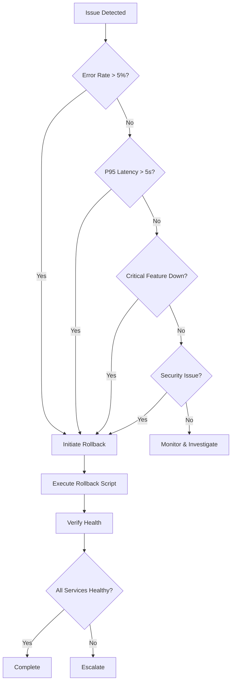

# Rollback Procedure Guide

**Version**: 1.0
**Date**: 2026-02-04
**Author**: DevOps Agent (Claude Code)
**Status**: Active

---

## Document Information

| Item | Value |
|------|-------|
| **Document Name** | Rollback Procedure Guide |
| **Version** | 1.0 |
| **Created Date** | 2026-02-04 |
| **Author** | DevOps Agent |
| **Status** | Active |
| **Related Documents** | [Deployment Plan](./deployment_plan.md), [CI/CD Report](./cicd_pipeline_report.md) |

---

## Table of Contents

1. [Overview](#1-overview)
2. [Rollback Decision Criteria](#2-rollback-decision-criteria)
3. [Rollback Types](#3-rollback-types)
4. [Rollback Procedures](#4-rollback-procedures)
5. [Database Rollback](#5-database-rollback)
6. [Auto-Rollback Configuration](#6-auto-rollback-configuration)
7. [Test Scenarios](#7-test-scenarios)
8. [Verification Checklist](#8-verification-checklist)
9. [Troubleshooting](#9-troubleshooting)

---

## 1. Overview

### 1.1 Purpose

This document provides comprehensive rollback procedures for the Hybrid RAG Knowledge Platform. Rollback capability ensures service continuity when deployments cause unexpected issues.

### 1.2 Scope

| Component | Rollback Support |
|-----------|-----------------|
| Application Services | Full |
| Database (PostgreSQL) | Full |
| Search Engine (Elasticsearch) | Snapshot-based |
| Graph Database (Neo4j) | Export-based |
| Object Storage (MinIO) | Full |

### 1.3 Available Tools

| Tool | Location | Purpose |
|------|----------|---------|
| `rollback.sh` | `infrastructure/scripts/rollback.sh` | Main rollback script |
| `rollback.yml` | `.github/workflows/rollback.yml` | GitHub Actions workflow |
| `backup.sh` | `infrastructure/scripts/backup.sh` | Pre-rollback backup |
| `restore.sh` | `infrastructure/scripts/restore.sh` | Data restoration |

---

## 2. Rollback Decision Criteria

### 2.1 When to Rollback

Rollback should be initiated when ANY of the following conditions are met:

| Criteria | Threshold | Priority |
|----------|-----------|----------|
| **Error Rate** | > 5% | Critical |
| **P95 Latency** | > 5 seconds | High |
| **Health Check Failures** | 3+ consecutive | Critical |
| **Critical Feature Failure** | Any | Critical |
| **Data Corruption** | Any | Critical |
| **Security Breach** | Any | Critical |

### 2.2 Decision Flowchart



### 2.3 RACI Matrix for Rollback Decision

| Activity | PM | TechLead | DevOps | QA |
|----------|:--:|:--------:|:------:|:--:|
| Detect Issue | I | I | R | A |
| Decide to Rollback | A | R | C | I |
| Execute Rollback | I | I | R | I |
| Verify Success | I | C | R | A |
| Post-mortem | A | R | R | C |

- R: Responsible, A: Accountable, C: Consulted, I: Informed

---

## 3. Rollback Types

### 3.1 Application Rollback (Most Common)

Rolls back container images to a previous version without touching database data.

**Use When**:
- New code has bugs
- Performance regression
- Feature not working as expected

**Impact**: Low (no data loss)
**Duration**: 5-10 minutes

### 3.2 Database Rollback

Restores database to a previous backup state.

**Use When**:
- Data corruption
- Schema migration failure
- Data integrity issues

**Impact**: High (potential data loss)
**Duration**: 10-60 minutes

### 3.3 Full Rollback

Combines application and database rollback.

**Use When**:
- Complete system failure
- Major security breach
- Catastrophic data corruption

**Impact**: Very High
**Duration**: 30-90 minutes

---

## 4. Rollback Procedures

### 4.1 Quick Reference

```bash
# Application rollback (most common)
./infrastructure/scripts/rollback.sh app v1.2.0 "Bug in new version"

# Database rollback
./infrastructure/scripts/rollback.sh db 2026-02-03 postgresql

# Verify rollback
./infrastructure/scripts/rollback.sh verify
```

### 4.2 Application Rollback - Detailed Steps

#### Step 1: Assess the Situation

```bash
# Check current status
docker compose ps

# Check recent logs
docker compose logs --tail=100 kp-backend kp-ai-service

# Check error rate in Grafana
# URL: http://localhost:3001
```

#### Step 2: Notify Team

```bash
# Send Slack notification
./scripts/send_slack.sh alerts DevOps "ROLLBACK INITIATED: Rolling back to v1.2.0 due to high error rate"
```

#### Step 3: Execute Rollback

**Option A: Using rollback script (Recommended)**

```bash
cd /opt/knowledge-platform  # or project root
./infrastructure/scripts/rollback.sh app v1.2.0 "Reason for rollback"
```

**Option B: Manual Docker Compose**

```bash
cd infrastructure/docker

# Stop current services
docker compose stop kp-backend kp-ai-service kp-api-gateway kp-frontend

# Set target version
export VERSION=v1.2.0

# Pull and start
docker compose pull
docker compose up -d --remove-orphans
```

**Option C: GitHub Actions (Production)**

1. Go to Actions > Rollback Deployment
2. Click "Run workflow"
3. Fill in:
   - Environment: `production`
   - Version: `v1.2.0`
   - Confirm: `ROLLBACK`
   - Reason: `Bug in new version`

#### Step 4: Verify Rollback

```bash
# Run verification
./infrastructure/scripts/rollback.sh verify

# Expected output:
# Container Status: All running
# Health Check Results: All HEALTHY
```

#### Step 5: Post-Rollback Actions

1. Update Slack with success/failure
2. Create incident report
3. Schedule post-mortem
4. Document lessons learned

### 4.3 Production Rollback Timeline

| Time | Action | Owner |
|------|--------|-------|
| T+0 | Issue detected | On-call |
| T+2m | Team notified | On-call |
| T+5m | Rollback decision made | TechLead |
| T+7m | Rollback script started | DevOps |
| T+12m | Services restarted | DevOps |
| T+15m | Health checks passed | DevOps |
| T+20m | Verification complete | QA |
| T+25m | All-clear notification | PM |

---

## 5. Database Rollback

### 5.1 Important Warnings

```
+----------------------------------------------------------+
|  WARNING: Database rollback causes DATA LOSS!             |
|                                                           |
|  All data created after the backup will be permanently    |
|  deleted. This action CANNOT be undone.                   |
|                                                           |
|  ALWAYS create a pre-rollback backup before proceeding!   |
+----------------------------------------------------------+
```

### 5.2 PostgreSQL Rollback

```bash
# List available backups
ls -la /opt/knowledge-platform/backups/

# Rollback PostgreSQL only
./infrastructure/scripts/rollback.sh db 2026-02-03 postgresql

# Interactive restore with confirmation
./infrastructure/scripts/restore.sh postgresql ./backups/2026-02-03/postgresql_20260203_020000.sql.gz
```

### 5.3 Elasticsearch Rollback

```bash
# List available snapshots
curl -X GET "localhost:9200/_snapshot/backup_repo/_all?pretty"

# Rollback Elasticsearch
./infrastructure/scripts/rollback.sh db 2026-02-03 elasticsearch

# Or use restore script
./infrastructure/scripts/restore.sh elasticsearch snapshot_20260203_020000
```

### 5.4 Neo4j Rollback

```bash
# Rollback Neo4j
./infrastructure/scripts/rollback.sh db 2026-02-03 neo4j

# Or use restore script
./infrastructure/scripts/restore.sh neo4j ./backups/2026-02-03/neo4j_20260203_020000.tar.gz
```

### 5.5 Full Database Rollback

```bash
# Rollback all databases to same backup point
./infrastructure/scripts/rollback.sh db 2026-02-03 all
```

---

## 6. Auto-Rollback Configuration

### 6.1 Overview

Auto-rollback automatically reverts to the previous version when health checks fail or error rates exceed thresholds.

### 6.2 Configuration

| Variable | Default | Description |
|----------|---------|-------------|
| `AUTO_ROLLBACK_ERROR_THRESHOLD` | 5 | Error rate % to trigger |
| `AUTO_ROLLBACK_HEALTH_FAILURES` | 3 | Consecutive failures to trigger |
| `HEALTH_CHECK_INTERVAL` | 10 | Seconds between checks |
| `HEALTH_CHECK_RETRIES` | 30 | Max retries before timeout |

### 6.3 Enabling Auto-Rollback After Deployment

```bash
# Start monitoring after deployment
./infrastructure/scripts/rollback.sh monitor v1.2.0 300

# This will:
# 1. Monitor for 5 minutes (300 seconds)
# 2. Check health every 10 seconds
# 3. Auto-rollback to v1.2.0 if:
#    - 3+ consecutive health check failures
#    - Error rate exceeds 5%
```

### 6.4 Auto-Rollback in CI/CD Pipeline

```yaml
# .github/workflows/deploy.yml (excerpt)
- name: Deploy New Version
  run: |
    export VERSION=${{ github.sha }}
    docker compose up -d --remove-orphans

- name: Monitor and Auto-Rollback
  run: |
    PREV_VERSION=$(cat /opt/knowledge-platform/.previous_version)
    ./infrastructure/scripts/rollback.sh monitor "$PREV_VERSION" 300
  continue-on-error: false
```

### 6.5 Prometheus Alert Rules for Auto-Rollback

```yaml
# infrastructure/docker/prometheus/rules/alerts.yml
groups:
  - name: auto-rollback-triggers
    rules:
      - alert: HighErrorRateRollbackTrigger
        expr: |
          sum(rate(http_server_requests_seconds_count{status=~"5.."}[5m]))
          / sum(rate(http_server_requests_seconds_count[5m])) > 0.05
        for: 2m
        labels:
          severity: critical
          action: rollback
        annotations:
          summary: "Error rate exceeds 5% - consider rollback"
          runbook: "Execute: ./rollback.sh app <prev_version>"

      - alert: ServiceUnhealthyRollbackTrigger
        expr: |
          up{job=~"kp-backend|kp-ai-service|kp-gateway"} == 0
        for: 1m
        labels:
          severity: critical
          action: rollback
        annotations:
          summary: "Service {{ $labels.job }} is down"
```

---

## 7. Test Scenarios

### 7.1 Test Environment Setup

```bash
# Create a test environment
export TEST_ENV=true
export BACKUP_DIR=/tmp/test-backups
```

### 7.2 Test Case 1: Application Rollback

**Objective**: Verify application rollback works correctly

**Preconditions**:
- Two versions deployed at different times
- All services healthy

**Steps**:
1. Record current version: `./rollback.sh verify`
2. Deploy new version (intentionally broken)
3. Verify services become unhealthy
4. Execute rollback: `./rollback.sh app v1.2.0 "Test rollback"`
5. Verify services are healthy again

**Expected Results**:
- Rollback completes within 5 minutes
- All health checks pass
- Application returns correct version
- Rollback recorded in history

**Test Script**:
```bash
#!/bin/bash
# test_app_rollback.sh

echo "=== Test Case 1: Application Rollback ==="

# Record baseline
BASELINE_VERSION=$(docker inspect kp-backend --format='{{.Config.Image}}' | cut -d: -f2)
echo "Baseline version: $BASELINE_VERSION"

# Execute rollback to a previous version
./infrastructure/scripts/rollback.sh app "v0.9.0" "Test rollback"

# Verify
NEW_VERSION=$(docker inspect kp-backend --format='{{.Config.Image}}' | cut -d: -f2)

if [[ "$NEW_VERSION" == "v0.9.0" ]]; then
    echo "PASS: Version changed to v0.9.0"
else
    echo "FAIL: Version is $NEW_VERSION, expected v0.9.0"
    exit 1
fi

# Restore baseline
./infrastructure/scripts/rollback.sh app "$BASELINE_VERSION" "Restore after test"

echo "=== Test Case 1: PASSED ==="
```

### 7.3 Test Case 2: Database Rollback

**Objective**: Verify PostgreSQL rollback preserves data integrity

**Preconditions**:
- Recent backup available
- Test data inserted after backup

**Steps**:
1. Create test data in database
2. Note the data state
3. Execute database rollback
4. Verify data matches backup state

**Test Script**:
```bash
#!/bin/bash
# test_db_rollback.sh

echo "=== Test Case 2: Database Rollback ==="

# Create backup
./infrastructure/scripts/backup.sh --postgresql
BACKUP_DATE=$(date +%Y-%m-%d)

# Insert test data
docker exec -i kp-postgresql psql -U knowledge -d knowledge << EOF
INSERT INTO documents (title, content) VALUES ('Test Doc', 'Test Content');
EOF

# Count rows
BEFORE_COUNT=$(docker exec kp-postgresql psql -U knowledge -d knowledge -t -c "SELECT COUNT(*) FROM documents;")
echo "Documents before rollback: $BEFORE_COUNT"

# Rollback
./infrastructure/scripts/rollback.sh db "$BACKUP_DATE" postgresql

# Count rows after
AFTER_COUNT=$(docker exec kp-postgresql psql -U knowledge -d knowledge -t -c "SELECT COUNT(*) FROM documents;")
echo "Documents after rollback: $AFTER_COUNT"

if [[ $AFTER_COUNT -lt $BEFORE_COUNT ]]; then
    echo "PASS: Test data was removed by rollback"
else
    echo "FAIL: Rollback did not restore previous state"
    exit 1
fi

echo "=== Test Case 2: PASSED ==="
```

### 7.4 Test Case 3: Auto-Rollback Trigger

**Objective**: Verify auto-rollback triggers on health failure

**Preconditions**:
- Monitoring script running
- Service can be intentionally stopped

**Steps**:
1. Start monitoring with short interval
2. Stop a critical service
3. Verify auto-rollback triggers
4. Verify service recovers

**Test Script**:
```bash
#!/bin/bash
# test_auto_rollback.sh

echo "=== Test Case 3: Auto-Rollback Trigger ==="

PREV_VERSION="v1.2.0"

# Start monitoring in background
./infrastructure/scripts/rollback.sh monitor "$PREV_VERSION" 120 &
MONITOR_PID=$!

sleep 10

# Intentionally break a service
docker stop kp-backend

# Wait for auto-rollback to trigger
sleep 60

# Check if service is back
if docker ps | grep -q kp-backend; then
    echo "PASS: Auto-rollback restored the service"
else
    echo "FAIL: Service not recovered"
    kill $MONITOR_PID 2>/dev/null
    docker start kp-backend
    exit 1
fi

kill $MONITOR_PID 2>/dev/null

echo "=== Test Case 3: PASSED ==="
```

### 7.5 Test Summary Matrix

| Test Case | Priority | Frequency | Automated |
|-----------|----------|-----------|-----------|
| Application Rollback | High | Weekly | Yes |
| Database Rollback | High | Monthly | Partial |
| Auto-Rollback | Medium | Monthly | Yes |
| Full System Rollback | Low | Quarterly | No |
| Production Drill | Medium | Quarterly | No |

---

## 8. Verification Checklist

### 8.1 Post-Rollback Verification

After any rollback, verify the following:

#### Application Verification

- [ ] All containers running: `docker compose ps`
- [ ] Backend health check: `curl localhost:8081/actuator/health`
- [ ] AI Service health check: `curl localhost:8000/api/v1/health`
- [ ] Gateway health check: `curl localhost:8080/actuator/health`
- [ ] Frontend accessible: `curl localhost:80`

#### Data Verification

- [ ] PostgreSQL queries work: `docker exec kp-postgresql psql -U knowledge -c "SELECT 1;"`
- [ ] Elasticsearch responding: `curl localhost:9200/_cluster/health`
- [ ] Neo4j accessible: Check browser at http://localhost:7474
- [ ] Redis responding: `docker exec kp-redis redis-cli ping`

#### Functionality Verification

- [ ] User login works
- [ ] Search returns results
- [ ] Document upload works
- [ ] RAG query returns response

#### Metrics Verification

- [ ] Error rate below 1%
- [ ] P95 latency below 3s
- [ ] No critical alerts in Grafana
- [ ] Logs show no errors

### 8.2 Quick Verification Script

```bash
#!/bin/bash
# verify_rollback.sh

echo "=== Rollback Verification ==="

# Container Status
echo -e "\n[1/4] Container Status:"
docker compose -f infrastructure/docker/docker-compose.yml ps | grep -E "kp-|NAME"

# Health Checks
echo -e "\n[2/4] Health Checks:"
endpoints=(
    "Backend|http://localhost:8081/actuator/health"
    "AI-Service|http://localhost:8000/api/v1/health"
    "Gateway|http://localhost:8080/actuator/health"
    "Frontend|http://localhost:80/"
)

for ep in "${endpoints[@]}"; do
    name=$(echo "$ep" | cut -d'|' -f1)
    url=$(echo "$ep" | cut -d'|' -f2)
    status=$(curl -s -o /dev/null -w "%{http_code}" "$url" 2>/dev/null || echo "FAIL")
    if [[ "$status" == "200" ]] || [[ "$status" == "204" ]]; then
        echo "  $name: HEALTHY ($status)"
    else
        echo "  $name: UNHEALTHY ($status)"
    fi
done

# Database Checks
echo -e "\n[3/4] Database Checks:"
if docker exec kp-postgresql pg_isready -U knowledge >/dev/null 2>&1; then
    echo "  PostgreSQL: READY"
else
    echo "  PostgreSQL: NOT READY"
fi

if curl -s localhost:9200/_cluster/health | grep -q '"status":"green"\|"status":"yellow"'; then
    echo "  Elasticsearch: HEALTHY"
else
    echo "  Elasticsearch: UNHEALTHY"
fi

if docker exec kp-redis redis-cli ping 2>/dev/null | grep -q "PONG"; then
    echo "  Redis: READY"
else
    echo "  Redis: NOT READY"
fi

# Version Check
echo -e "\n[4/4] Current Versions:"
for container in kp-backend kp-ai-service kp-api-gateway kp-frontend; do
    if docker ps --format '{{.Names}}' | grep -q "^${container}$"; then
        version=$(docker inspect --format='{{.Config.Image}}' "$container" | sed 's/.*://')
        echo "  $container: $version"
    else
        echo "  $container: NOT RUNNING"
    fi
done

echo -e "\n=== Verification Complete ==="
```

---

## 9. Troubleshooting

### 9.1 Common Issues

#### Issue: Rollback script not finding containers

**Symptom**:
```
ERROR: Container 'kp-backend' is not running
```

**Solution**:
```bash
# Check Docker Compose project name
docker compose ls

# Start containers first
docker compose -f infrastructure/docker/docker-compose.yml up -d
```

#### Issue: Image version not found

**Symptom**:
```
WARN: Image not found for backend:v1.2.0
```

**Solution**:
```bash
# Check available tags
docker images | grep knowledge-platform

# Pull from registry
docker pull ghcr.io/knowledge-platform/backend:v1.2.0
```

#### Issue: Database backup not found

**Symptom**:
```
ERROR: Backup not found for date: 2026-02-03
```

**Solution**:
```bash
# List available backups
ls -la /opt/knowledge-platform/backups/

# Check backup script
./infrastructure/scripts/backup.sh --help
```

### 9.2 Emergency Procedures

#### Complete System Failure

If all services are down and rollback script fails:

```bash
# 1. Stop all containers
docker compose -f infrastructure/docker/docker-compose.yml down

# 2. Remove all containers (keeps volumes)
docker compose -f infrastructure/docker/docker-compose.yml rm -f

# 3. Reset to known good version
export VERSION=v1.0.0  # Last known stable
docker compose -f infrastructure/docker/docker-compose.yml pull
docker compose -f infrastructure/docker/docker-compose.yml up -d

# 4. Check status
docker compose ps
```

#### Database Connection Failure

```bash
# 1. Check PostgreSQL logs
docker logs kp-postgresql --tail=100

# 2. Restart PostgreSQL
docker restart kp-postgresql

# 3. Verify connection
docker exec kp-postgresql pg_isready -U knowledge

# 4. If still failing, restore from backup
./infrastructure/scripts/restore.sh postgresql /path/to/backup.sql.gz
```

### 9.3 Escalation Path

| Level | Contact | When |
|-------|---------|------|
| L1 | On-call DevOps | Initial response |
| L2 | TechLead | 15 min without resolution |
| L3 | Full team | 30 min without resolution |
| L4 | Management | Production down > 1 hour |

### 9.4 Contact Information

| Role | Channel |
|------|---------|
| DevOps Team | #proj-hrkp-alerts |
| TechLead | Direct message |
| PM | #proj-hrkp-dev |

---

## Appendix

### A. Quick Reference Card

```
+----------------------------------------------------------+
|           ROLLBACK QUICK REFERENCE                        |
+----------------------------------------------------------+
| APP ROLLBACK:                                             |
|   ./infrastructure/scripts/rollback.sh app v1.2.0        |
|                                                           |
| DB ROLLBACK:                                              |
|   ./infrastructure/scripts/rollback.sh db 2026-02-03     |
|                                                           |
| VERIFY:                                                   |
|   ./infrastructure/scripts/rollback.sh verify            |
|                                                           |
| GITHUB ACTIONS:                                           |
|   Actions > Rollback Deployment > Run workflow           |
+----------------------------------------------------------+
| THRESHOLDS:                                               |
|   Error Rate: > 5%                                        |
|   P95 Latency: > 5 seconds                               |
|   Health Failures: 3+ consecutive                         |
+----------------------------------------------------------+
```

### B. Rollback History Template

```markdown
## Rollback Record

**Date**: YYYY-MM-DD HH:MM
**Environment**: staging / production
**From Version**: vX.Y.Z
**To Version**: vA.B.C
**Duration**: XX minutes
**Initiated By**: Name

### Reason
Brief description of why rollback was needed.

### Impact
- Users affected: XXX
- Duration of incident: XX minutes
- Data loss: None / Partial / Full

### Actions Taken
1. Action 1
2. Action 2
3. Action 3

### Root Cause
Analysis of what caused the issue.

### Lessons Learned
- Lesson 1
- Lesson 2

### Follow-up Actions
- [ ] Action item 1
- [ ] Action item 2
```

---

**Document End**

**Created**: 2026-02-04
**Review Required**: TechLead, PM
**Next Review**: 2026-03-04
