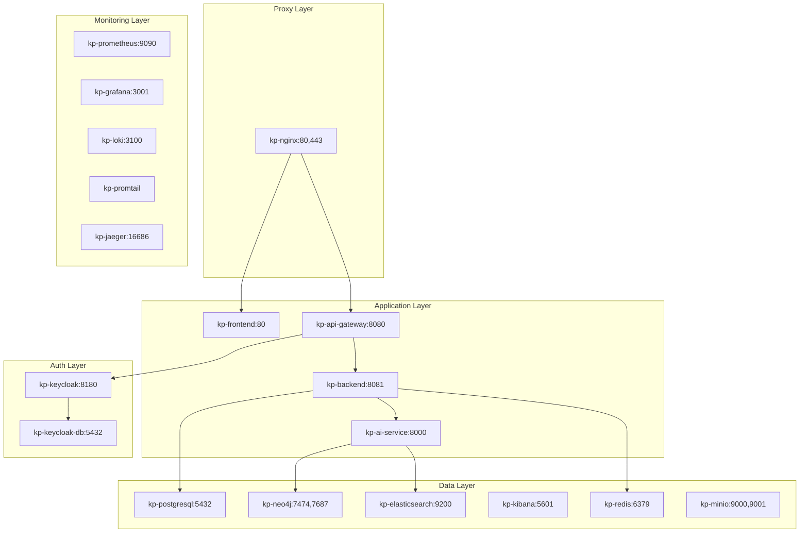
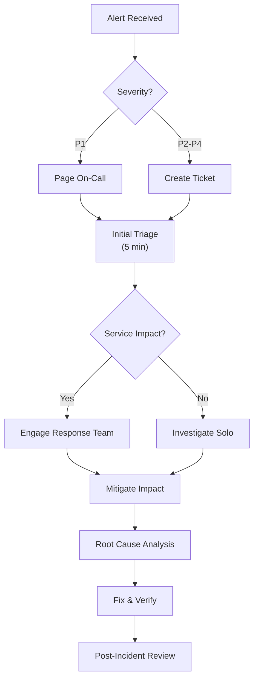

# Hybrid RAG Knowledge Platform - Operations Runbook

**Version**: 1.0
**Date**: 2026-02-04
**Author**: TechLead Agent (Claude Code)
**Status**: Approved

---

## Document Information

| Item | Value |
|------|-------|
| **Document Name** | Operations Runbook |
| **Version** | 1.0 |
| **Created Date** | 2026-02-04 |
| **Author** | TechLead Agent |
| **Status** | Approved |
| **Review Cycle** | Quarterly |
| **Related Documents** | [Deployment Plan](./deployment_plan.md), [Rollback Procedure](./rollback_procedure.md), [Troubleshooting Guide](./troubleshooting_guide.md) |

---

## Table of Contents

1. [Overview](#1-overview)
2. [System Architecture](#2-system-architecture)
3. [Daily Operations](#3-daily-operations)
4. [Incident Response](#4-incident-response)
5. [Backup and Recovery](#5-backup-and-recovery)
6. [Scaling Procedures](#6-scaling-procedures)
7. [Maintenance Procedures](#7-maintenance-procedures)
8. [Emergency Contacts](#8-emergency-contacts)
9. [Appendices](#appendices)

---

## 1. Overview

### 1.1 Purpose

This runbook provides operational procedures for the Hybrid RAG Knowledge Platform, covering:
- Daily operational tasks
- Incident response procedures
- Backup and recovery procedures
- Scaling procedures
- Maintenance windows

### 1.2 Scope

| Component | Included |
|-----------|:--------:|
| Application Layer (Frontend, Gateway, Backend, AI Service) | Yes |
| Data Layer (PostgreSQL, Neo4j, Elasticsearch, Redis, MinIO) | Yes |
| Authentication (Keycloak) | Yes |
| Monitoring (Prometheus, Grafana, Loki, Jaeger) | Yes |
| Infrastructure (Docker, Nginx) | Yes |

### 1.3 SLA Targets

| Metric | Target | Warning | Critical |
|--------|--------|---------|----------|
| **Availability** | 99.9% | < 99.5% | < 99.0% |
| **Response Time (P95)** | < 3s | > 3s | > 5s |
| **Error Rate** | < 1% | > 2% | > 5% |
| **Search Latency** | < 2s | > 2s | > 5s |
| **RAG Response** | < 10s | > 15s | > 30s |

---

## 2. System Architecture

### 2.1 Container Overview (18 Containers)



### 2.2 Port Reference

| Container | Internal Port | External Port | Protocol |
|-----------|---------------|---------------|----------|
| kp-nginx | 80, 443 | 80, 443 | HTTP/HTTPS |
| kp-frontend | 80 | - | HTTP |
| kp-api-gateway | 8080 | 8080 | HTTP |
| kp-backend | 8081 | 8081 | HTTP |
| kp-ai-service | 8000 | 8000 | HTTP |
| kp-keycloak | 8180 | 8180 | HTTP |
| kp-postgresql | 5432 | 5432 | TCP |
| kp-neo4j | 7474, 7687 | 7474, 7687 | HTTP/Bolt |
| kp-elasticsearch | 9200 | 9200 | HTTP |
| kp-kibana | 5601 | 5601 | HTTP |
| kp-redis | 6379 | 6379 | TCP |
| kp-minio | 9000, 9001 | 9000, 9001 | HTTP |
| kp-prometheus | 9090 | 9090 | HTTP |
| kp-grafana | 3001 | 3001 | HTTP |
| kp-jaeger | 16686 | 16686 | HTTP |
| kp-loki | 3100 | - | HTTP |

---

## 3. Daily Operations

### 3.1 Daily Checklist

```markdown
## Daily Operations Checklist

Date: ___________
Operator: ___________

### Morning Check (09:00)

- [ ] All 18 containers running
- [ ] Grafana dashboard shows no alerts
- [ ] Error rate < 1%
- [ ] CPU usage < 70%
- [ ] Memory usage < 75%
- [ ] Disk usage < 80%
- [ ] No security alerts
- [ ] Backup completed successfully (overnight)

### Afternoon Check (14:00)

- [ ] Response time P95 < 3s
- [ ] Search latency < 2s
- [ ] No degraded services
- [ ] Log volume normal

### Evening Check (18:00)

- [ ] Daily metrics reviewed
- [ ] Issues documented
- [ ] Handover notes prepared (if applicable)
```

### 3.2 Health Check Commands

```bash
#!/bin/bash
# daily-health-check.sh

echo "=== Daily Health Check $(date) ==="

# 1. Container Status
echo -e "\n[1] Container Status"
docker compose ps --format "table {{.Name}}\t{{.Status}}\t{{.Health}}"

# 2. System Resources
echo -e "\n[2] System Resources"
docker stats --no-stream --format "table {{.Name}}\t{{.CPUPerc}}\t{{.MemUsage}}\t{{.MemPerc}}"

# 3. Disk Usage
echo -e "\n[3] Disk Usage"
df -h | grep -E "^/dev|Filesystem"

# 4. API Health Checks
echo -e "\n[4] API Health"
endpoints=(
    "Backend|http://localhost:8081/actuator/health"
    "AI-Service|http://localhost:8000/api/v1/health"
    "Gateway|http://localhost:8080/actuator/health"
    "Keycloak|http://localhost:8180/health"
)

for ep in "${endpoints[@]}"; do
    name=$(echo "$ep" | cut -d'|' -f1)
    url=$(echo "$ep" | cut -d'|' -f2)
    status=$(curl -s -o /dev/null -w "%{http_code}" "$url" 2>/dev/null || echo "FAIL")
    if [[ "$status" == "200" ]]; then
        echo "  $name: HEALTHY"
    else
        echo "  $name: UNHEALTHY ($status)"
    fi
done

# 5. Database Health
echo -e "\n[5] Database Health"
docker exec kp-postgresql pg_isready -U knowledge && echo "  PostgreSQL: READY"
docker exec kp-redis redis-cli ping | grep -q PONG && echo "  Redis: READY"
curl -s localhost:9200/_cluster/health | grep -qE '"status":"(green|yellow)"' && echo "  Elasticsearch: READY"

# 6. Error Count (last 24h)
echo -e "\n[6] Error Count (last 24h)"
docker logs kp-backend --since 24h 2>&1 | grep -c "ERROR" | xargs echo "  Backend errors:"
docker logs kp-ai-service --since 24h 2>&1 | grep -c "ERROR" | xargs echo "  AI Service errors:"

echo -e "\n=== Health Check Complete ==="
```

### 3.3 Log Monitoring

#### Key Log Locations

| Service | Log Command | Key Patterns |
|---------|-------------|--------------|
| Backend | `docker logs kp-backend` | `ERROR`, `Exception`, `OutOfMemory` |
| AI Service | `docker logs kp-ai-service` | `ERROR`, `DeepSeekError`, `TimeoutError` |
| Gateway | `docker logs kp-api-gateway` | `ERROR`, `CircuitBreaker`, `RateLimit` |
| Nginx | `docker logs kp-nginx` | `error`, `502`, `504` |
| PostgreSQL | `docker logs kp-postgresql` | `FATAL`, `ERROR`, `deadlock` |
| Elasticsearch | `docker logs kp-elasticsearch` | `WARN`, `OutOfMemory`, `CircuitBreaker` |

#### Log Analysis Commands

```bash
# Recent errors (last hour)
docker logs kp-backend --since 1h 2>&1 | grep -i error

# Error count by type
docker logs kp-backend --since 24h 2>&1 | grep ERROR | cut -d']' -f2 | sort | uniq -c | sort -rn

# Access log analysis (Nginx)
docker exec kp-nginx cat /var/log/nginx/access.log | awk '{print $9}' | sort | uniq -c | sort -rn

# Slow queries (AI Service)
docker logs kp-ai-service --since 24h 2>&1 | grep "processing_time" | awk -F'processing_time=' '{print $2}' | sort -rn | head -10
```

### 3.4 Performance Monitoring

#### Grafana Dashboards

| Dashboard | URL | Key Metrics |
|-----------|-----|-------------|
| System Overview | `/grafana/d/system` | CPU, Memory, Disk, Network |
| Application Metrics | `/grafana/d/app` | Request rate, Latency, Errors |
| RAG Pipeline | `/grafana/d/rag` | Embedding time, Search latency |
| Database Metrics | `/grafana/d/db` | Connections, Query time |

#### Key Metrics to Monitor

```yaml
# Critical Metrics
http_server_requests_seconds_count: Request count
http_server_requests_seconds_sum: Total request time
http_server_requests_seconds_bucket: Latency distribution

# System Metrics
process_cpu_usage: CPU utilization
jvm_memory_used_bytes: Memory usage
hikari_connections_active: Active DB connections

# Business Metrics
rag_search_duration_seconds: Search performance
rag_embedding_duration_seconds: Embedding performance
documents_processed_total: Document processing count
```

---

## 4. Incident Response

### 4.1 Severity Levels

| Level | Description | Response Time | Notification |
|-------|-------------|---------------|--------------|
| **P1 - Critical** | Service down, data loss | 15 min | Page + Slack |
| **P2 - High** | Major feature broken | 1 hour | Slack |
| **P3 - Medium** | Degraded performance | 4 hours | Slack |
| **P4 - Low** | Minor issue | 24 hours | Ticket |

### 4.2 Incident Response Flowchart



### 4.3 Common Incident Procedures

#### 4.3.1 Service Down

```bash
# 1. Check container status
docker compose ps

# 2. Restart failed container
docker compose restart <container-name>

# 3. Check logs
docker logs <container-name> --tail=100

# 4. Verify health
curl localhost:8081/actuator/health
```

#### 4.3.2 High CPU Usage

```bash
# 1. Identify culprit
docker stats --no-stream

# 2. Check process inside container
docker exec kp-backend top -b -n1 | head -20

# 3. Check for memory leak
docker exec kp-backend jcmd 1 VM.native_memory summary

# 4. Restart if necessary
docker compose restart backend
```

#### 4.3.3 Database Connection Issues

```bash
# 1. Check PostgreSQL
docker exec kp-postgresql pg_isready -U knowledge

# 2. Check connection count
docker exec kp-postgresql psql -U knowledge -c "SELECT count(*) FROM pg_stat_activity;"

# 3. Kill idle connections
docker exec kp-postgresql psql -U knowledge -c "SELECT pg_terminate_backend(pid) FROM pg_stat_activity WHERE state = 'idle' AND query_start < NOW() - INTERVAL '1 hour';"

# 4. Restart if needed
docker compose restart postgresql
```

#### 4.3.4 Elasticsearch Issues

```bash
# 1. Check cluster health
curl localhost:9200/_cluster/health?pretty

# 2. Check node status
curl localhost:9200/_cat/nodes?v

# 3. Check disk usage
curl localhost:9200/_cat/allocation?v

# 4. If disk full, delete old indices
curl -X DELETE "localhost:9200/logs-*-$(date -d '30 days ago' +%Y.%m)*"
```

### 4.4 Incident Communication Template

```markdown
## Incident Report

**Incident ID**: INC-YYYY-MMDD-XXX
**Status**: Investigating / Mitigated / Resolved
**Severity**: P1 / P2 / P3 / P4

### Timeline
| Time | Event |
|------|-------|
| HH:MM | Alert received |
| HH:MM | Investigation started |
| HH:MM | Root cause identified |
| HH:MM | Mitigation applied |
| HH:MM | Service restored |

### Impact
- Affected users: XXX
- Duration: XX minutes
- Data loss: None / Partial / Full

### Root Cause
[Brief description]

### Resolution
[Actions taken]

### Follow-up Actions
- [ ] Action 1
- [ ] Action 2
```

---

## 5. Backup and Recovery

### 5.1 Backup Schedule

| Data | Schedule | Retention | Location |
|------|----------|-----------|----------|
| PostgreSQL | Daily 02:00 | 30 days | `/backup/postgresql/` |
| Elasticsearch | Daily 03:00 | 14 days | Repository snapshot |
| Neo4j | Daily 04:00 | 14 days | `/backup/neo4j/` |
| MinIO | Daily 05:00 | 7 days | External S3 |
| Configuration | On change | Forever | Git |

### 5.2 Backup Procedures

#### 5.2.1 PostgreSQL Backup

```bash
#!/bin/bash
# backup-postgresql.sh

BACKUP_DIR="/backup/postgresql"
DATE=$(date +%Y%m%d_%H%M%S)
BACKUP_FILE="${BACKUP_DIR}/knowledge_${DATE}.sql.gz"

# Create backup
docker exec kp-postgresql pg_dump -U knowledge -d knowledge | gzip > "$BACKUP_FILE"

# Verify backup
if gunzip -t "$BACKUP_FILE" 2>/dev/null; then
    echo "Backup successful: $BACKUP_FILE"
    # Clean old backups (keep 30 days)
    find "$BACKUP_DIR" -name "*.sql.gz" -mtime +30 -delete
else
    echo "Backup FAILED!"
    exit 1
fi
```

#### 5.2.2 Elasticsearch Backup

```bash
#!/bin/bash
# backup-elasticsearch.sh

DATE=$(date +%Y%m%d_%H%M%S)

# Create snapshot
curl -X PUT "localhost:9200/_snapshot/backup_repo/snapshot_${DATE}?wait_for_completion=true" -H 'Content-Type: application/json' -d'
{
  "indices": "documents,knowledge_graph,embeddings",
  "ignore_unavailable": true,
  "include_global_state": false
}'

# Verify
curl -X GET "localhost:9200/_snapshot/backup_repo/snapshot_${DATE}/_status"

# Clean old snapshots (keep 14 days)
for snapshot in $(curl -s "localhost:9200/_snapshot/backup_repo/_all" | jq -r '.snapshots[].snapshot' | head -n -14); do
    curl -X DELETE "localhost:9200/_snapshot/backup_repo/$snapshot"
done
```

#### 5.2.3 Neo4j Backup

```bash
#!/bin/bash
# backup-neo4j.sh

BACKUP_DIR="/backup/neo4j"
DATE=$(date +%Y%m%d_%H%M%S)

# Stop writes
docker exec kp-neo4j cypher-shell -u neo4j "CALL dbms.setConfigValue('dbms.read_only', 'true');"

# Create dump
docker exec kp-neo4j neo4j-admin database dump neo4j --to-path=/backup
docker cp kp-neo4j:/backup/neo4j.dump "${BACKUP_DIR}/neo4j_${DATE}.dump"

# Re-enable writes
docker exec kp-neo4j cypher-shell -u neo4j "CALL dbms.setConfigValue('dbms.read_only', 'false');"

# Clean old (keep 14 days)
find "$BACKUP_DIR" -name "*.dump" -mtime +14 -delete
```

### 5.3 Recovery Procedures

#### 5.3.1 PostgreSQL Recovery

```bash
#!/bin/bash
# restore-postgresql.sh

BACKUP_FILE=$1

if [ -z "$BACKUP_FILE" ]; then
    echo "Usage: $0 <backup_file.sql.gz>"
    exit 1
fi

echo "WARNING: This will overwrite the current database!"
read -p "Continue? (yes/no): " confirm
if [ "$confirm" != "yes" ]; then
    exit 0
fi

# Stop dependent services
docker compose stop backend ai-service api-gateway

# Restore
gunzip -c "$BACKUP_FILE" | docker exec -i kp-postgresql psql -U knowledge -d knowledge

# Restart services
docker compose start backend ai-service api-gateway

echo "Restore complete. Verify data integrity."
```

#### 5.3.2 Point-in-Time Recovery

For PostgreSQL point-in-time recovery (PITR):

```bash
# 1. Stop PostgreSQL
docker compose stop postgresql

# 2. Restore base backup
gunzip -c /backup/postgresql/knowledge_YYYYMMDD.sql.gz | docker exec -i kp-postgresql psql -U knowledge

# 3. Apply WAL logs (if configured)
docker exec kp-postgresql pg_restore --target-time="2026-02-04 14:30:00" /backup/wal/

# 4. Restart
docker compose start postgresql
```

### 5.4 Backup Verification

```bash
#!/bin/bash
# verify-backups.sh

echo "=== Backup Verification ==="

# PostgreSQL
echo -e "\n[1] PostgreSQL Backups"
ls -lh /backup/postgresql/ | tail -5
LATEST_PG=$(ls -t /backup/postgresql/*.sql.gz | head -1)
echo "Testing: $LATEST_PG"
gunzip -t "$LATEST_PG" && echo "  Status: OK" || echo "  Status: FAILED"

# Elasticsearch
echo -e "\n[2] Elasticsearch Snapshots"
curl -s "localhost:9200/_snapshot/backup_repo/_all" | jq '.snapshots[-1]'

# Neo4j
echo -e "\n[3] Neo4j Backups"
ls -lh /backup/neo4j/ | tail -5

echo -e "\n=== Verification Complete ==="
```

---

## 6. Scaling Procedures

### 6.1 Vertical Scaling (Current Architecture)

Since we use Docker Compose (single host), scaling is primarily vertical:

#### 6.1.1 Increase Container Resources

```yaml
# docker-compose.override.yml
services:
  backend:
    deploy:
      resources:
        limits:
          cpus: '4'
          memory: 8G
        reservations:
          cpus: '2'
          memory: 4G

  ai-service:
    deploy:
      resources:
        limits:
          cpus: '8'
          memory: 16G
        reservations:
          cpus: '4'
          memory: 8G

  elasticsearch:
    environment:
      - ES_JAVA_OPTS=-Xms8g -Xmx8g
```

#### 6.1.2 PostgreSQL Connection Pool

```yaml
# Increase connection pool
environment:
  - SPRING_DATASOURCE_HIKARI_MAXIMUM_POOL_SIZE=50
  - SPRING_DATASOURCE_HIKARI_MINIMUM_IDLE=10
```

#### 6.1.3 Redis Memory

```yaml
services:
  redis:
    command: redis-server --maxmemory 4gb --maxmemory-policy allkeys-lru
```

### 6.2 Horizontal Scaling Preparation

For future Kubernetes migration:

```yaml
# Stateless services ready for horizontal scaling:
# - kp-frontend (static files)
# - kp-api-gateway (routing only)
# - kp-backend (session-less with JWT)
# - kp-ai-service (stateless processing)

# Stateful services requiring special handling:
# - kp-postgresql (use managed DB or replication)
# - kp-elasticsearch (cluster mode)
# - kp-neo4j (cluster mode)
# - kp-redis (cluster mode)
```

### 6.3 Load Testing Before Scaling

```bash
# Run load test to identify bottlenecks
k6 run --vus 100 --duration 5m scripts/load-test.js

# Monitor during test
watch -n1 'docker stats --no-stream'
```

---

## 7. Maintenance Procedures

### 7.1 Scheduled Maintenance Window

| Day | Time (KST) | Activities |
|-----|------------|------------|
| Sunday | 02:00-06:00 | Major updates, migrations |
| Wednesday | 02:00-04:00 | Security patches |
| Daily | 02:00-06:00 | Automated backups |

### 7.2 Maintenance Notification Template

```markdown
## Scheduled Maintenance Notice

**Date**: YYYY-MM-DD
**Time**: HH:MM - HH:MM (KST)
**Duration**: X hours
**Impact**: [Brief impact description]

### Affected Services
- [ ] Service 1
- [ ] Service 2

### What to Expect
[User-facing impact description]

### Questions?
Contact: #proj-hrkp-dev
```

### 7.3 Common Maintenance Tasks

#### 7.3.1 Update Application

```bash
#!/bin/bash
# maintenance/update-app.sh

echo "=== Application Update Procedure ==="

# 1. Notify
./scripts/send_slack.sh dev Maintenance "Starting scheduled maintenance"

# 2. Backup
./scripts/backup.sh --all

# 3. Pull latest
git pull origin main
docker compose pull

# 4. Rolling update
for service in backend ai-service api-gateway frontend; do
    echo "Updating $service..."
    docker compose up -d --no-deps --build $service
    sleep 30
    curl -sf localhost:8081/actuator/health || exit 1
done

# 5. Verify
./scripts/health-check.sh

# 6. Notify
./scripts/send_slack.sh dev Maintenance "Maintenance completed successfully"
```

#### 7.3.2 Database Maintenance

```bash
#!/bin/bash
# maintenance/db-maintenance.sh

echo "=== Database Maintenance ==="

# PostgreSQL: VACUUM and ANALYZE
echo "[1] PostgreSQL maintenance..."
docker exec kp-postgresql psql -U knowledge -c "VACUUM ANALYZE;"

# PostgreSQL: Reindex
docker exec kp-postgresql psql -U knowledge -c "REINDEX DATABASE knowledge;"

# Elasticsearch: Optimize indices
echo "[2] Elasticsearch maintenance..."
curl -X POST "localhost:9200/_forcemerge?max_num_segments=1"

# Redis: Memory defrag
echo "[3] Redis maintenance..."
docker exec kp-redis redis-cli MEMORY DOCTOR

echo "=== Maintenance Complete ==="
```

#### 7.3.3 Log Rotation

```bash
#!/bin/bash
# maintenance/rotate-logs.sh

# Rotate Docker logs
docker run --rm -v /var/lib/docker/containers:/containers alpine sh -c '
    find /containers -name "*-json.log" -size +100M -exec truncate -s 0 {} \;
'

# Archive application logs
tar -czf /backup/logs/app-logs-$(date +%Y%m%d).tar.gz /var/log/knowledge-platform/

# Clean old archives (keep 30 days)
find /backup/logs -name "*.tar.gz" -mtime +30 -delete
```

### 7.4 Security Updates

```bash
#!/bin/bash
# maintenance/security-update.sh

echo "=== Security Update Procedure ==="

# 1. Update base images
docker compose pull

# 2. Rebuild with latest security patches
docker compose build --no-cache

# 3. Rolling restart
docker compose up -d

# 4. Verify
docker compose ps

# 5. Scan for vulnerabilities
docker scan kp-backend:latest
docker scan kp-ai-service:latest
```

---

## 8. Emergency Contacts

### 8.1 On-Call Schedule

| Role | Primary | Secondary | Escalation |
|------|---------|-----------|------------|
| DevOps | DevOps Agent | Infra Agent | TechLead |
| Backend | Backend Agent | RAG Agent | TechLead |
| Frontend | Frontend Agent | QA Agent | TechLead |
| Database | DB Agent | ETL Agent | TechLead |

### 8.2 Communication Channels

| Channel | Purpose | SLA |
|---------|---------|-----|
| `#proj-hrkp-alerts` | Critical alerts, P1/P2 | Immediate |
| `#proj-hrkp-dev` | Development, P3/P4 | 4 hours |
| `#proj-hrkp-standup` | Daily updates | Daily |

### 8.3 External Contacts

| Service | Contact | When to Contact |
|---------|---------|-----------------|
| DeepSeek API | support@deepseek.com | API issues, quota |
| Domain Registrar | - | DNS issues |
| SSL Provider | - | Certificate issues |

### 8.4 Escalation Matrix

```
Issue Detected
      |
      v
+---> On-Call (15 min) ---> TechLead (30 min) ---> PM (1 hour) ---> Management
      |                         |                      |
      +--- Mitigate ---+        +--- Coordinate ---+   +--- Communicate ---+
```

---

## Appendices

### A. Quick Reference Commands

```bash
# Container management
docker compose ps                           # List all containers
docker compose restart <service>            # Restart service
docker compose logs -f <service>            # Follow logs
docker compose exec <service> /bin/sh       # Shell into container

# Health checks
curl localhost:8081/actuator/health         # Backend health
curl localhost:8000/api/v1/health           # AI Service health
curl localhost:9200/_cluster/health         # ES health

# Database
docker exec kp-postgresql psql -U knowledge # PostgreSQL shell
docker exec kp-redis redis-cli              # Redis shell
curl localhost:9200/_cat/indices            # ES indices

# Monitoring
open http://localhost:3001                  # Grafana
open http://localhost:9090                  # Prometheus
open http://localhost:16686                 # Jaeger
```

### B. Useful Scripts

| Script | Location | Purpose |
|--------|----------|---------|
| `health-check.sh` | `scripts/` | System health check |
| `backup.sh` | `scripts/` | Full backup |
| `restore.sh` | `scripts/` | Data restoration |
| `rollback.sh` | `scripts/` | Version rollback |
| `send_slack.sh` | `scripts/` | Slack notification |

### C. Monitoring Alert Rules

| Alert | Condition | Severity |
|-------|-----------|----------|
| HighErrorRate | error_rate > 5% for 5m | Critical |
| HighLatency | p95_latency > 5s for 5m | Warning |
| ContainerDown | container_up == 0 for 1m | Critical |
| LowDiskSpace | disk_free < 15% | Warning |
| HighMemory | memory_usage > 85% | Warning |
| DatabaseDown | db_up == 0 for 1m | Critical |

### D. Runbook Review Checklist

- [ ] All procedures tested in staging
- [ ] Contact information up to date
- [ ] Escalation paths verified
- [ ] Backup/restore tested
- [ ] Monitoring dashboards accessible
- [ ] Documentation reviewed

---

**Document End**

**Created**: 2026-02-04
**Last Review**: 2026-02-04
**Next Review**: 2026-05-04 (Quarterly)
**Approved By**: TechLead Agent
