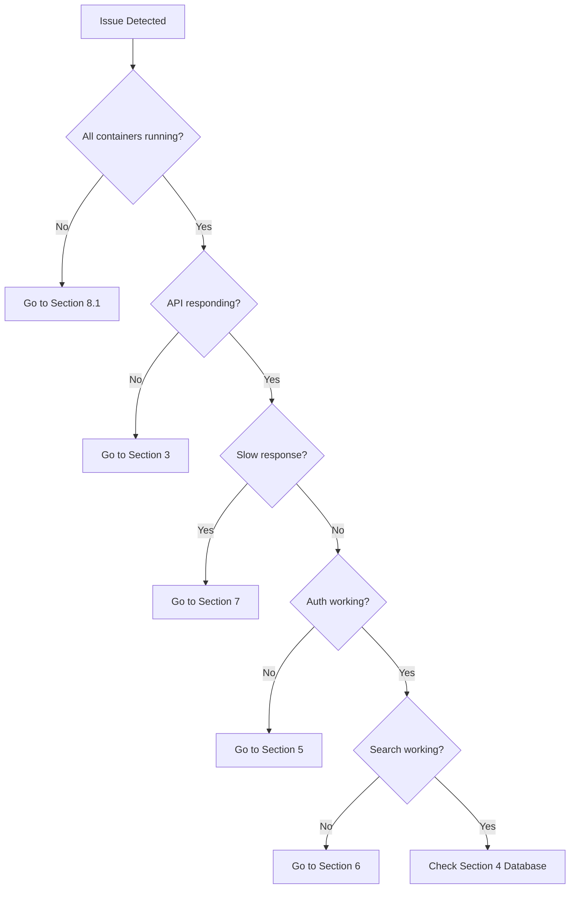

# Hybrid RAG Knowledge Platform - Troubleshooting Guide

**Version**: 1.0
**Date**: 2026-02-04
**Author**: TechLead Agent (Claude Code)
**Status**: Approved

---

## Document Information

| Item | Value |
|------|-------|
| **Document Name** | Troubleshooting Guide |
| **Version** | 1.0 |
| **Created Date** | 2026-02-04 |
| **Author** | TechLead Agent |
| **Status** | Approved |
| **Related Documents** | [Runbook](./runbook.md), [Rollback Procedure](./rollback_procedure.md) |

---

## Table of Contents

1. [Overview](#1-overview)
2. [Quick Diagnosis](#2-quick-diagnosis)
3. [Application Layer Issues](#3-application-layer-issues)
4. [Database Issues](#4-database-issues)
5. [Authentication Issues](#5-authentication-issues)
6. [RAG Pipeline Issues](#6-rag-pipeline-issues)
7. [Performance Issues](#7-performance-issues)
8. [Infrastructure Issues](#8-infrastructure-issues)
9. [Monitoring and Logging](#9-monitoring-and-logging)
10. [Known Issues](#10-known-issues)

---

## 1. Overview

### 1.1 Purpose

This guide provides troubleshooting procedures for common issues in the Hybrid RAG Knowledge Platform.

### 1.2 How to Use This Guide

1. Identify the symptom category
2. Run diagnostic commands
3. Follow the resolution steps
4. Verify the fix
5. Document if new issue

### 1.3 Diagnostic Tools

| Tool | Command | Purpose |
|------|---------|---------|
| Container Status | `docker compose ps` | Check container health |
| Container Logs | `docker compose logs <service>` | View service logs |
| Resource Usage | `docker stats` | Monitor CPU/Memory |
| Network Debug | `docker network inspect kp-network` | Network issues |
| Health Check | `curl localhost:port/health` | Service health |

---

## 2. Quick Diagnosis

### 2.1 One-Liner Diagnostics

```bash
# Quick health check - all services
docker compose ps | grep -v "healthy\|running"

# Container restart count (potential issues)
docker ps --format "{{.Names}}: {{.Status}}" | grep -i restart

# Recent errors across all services
docker compose logs --since 1h 2>&1 | grep -i "error\|exception\|fatal"

# Disk space
df -h | grep -E "/$|/var"

# Memory pressure
free -h
```

### 2.2 Diagnostic Decision Tree



---

## 3. Application Layer Issues

### 3.1 Backend Service (kp-backend)

#### Symptom: Backend not starting

```bash
# Check logs
docker logs kp-backend --tail=100

# Common causes:
# 1. Database connection failed
# 2. Port already in use
# 3. Out of memory
# 4. Invalid configuration
```

**Resolution - Database Connection:**

```bash
# Verify PostgreSQL is ready
docker exec kp-postgresql pg_isready -U knowledge

# Check connection from backend perspective
docker exec kp-backend nc -zv kp-postgresql 5432

# If DNS resolution fails, restart
docker compose restart backend
```

**Resolution - Port Conflict:**

```bash
# Check what's using port 8081
lsof -i :8081

# Kill conflicting process or change port
kill -9 <PID>
```

**Resolution - Out of Memory:**

```bash
# Check Java heap
docker exec kp-backend jcmd 1 VM.flags | grep HeapSize

# Increase memory in docker-compose
# deploy.resources.limits.memory: 4G

docker compose up -d --force-recreate backend
```

#### Symptom: Backend returning 500 errors

```bash
# Get detailed error
curl -v http://localhost:8081/api/v1/health 2>&1

# Check recent exceptions
docker logs kp-backend --since 5m 2>&1 | grep -A5 "Exception"

# Check Actuator for details
curl http://localhost:8081/actuator/health | jq .
```

**Resolution - Connection Pool Exhausted:**

```bash
# Check active connections
docker exec kp-postgresql psql -U knowledge -c "SELECT count(*) FROM pg_stat_activity WHERE application_name LIKE '%backend%';"

# Increase pool size (temporary)
docker exec kp-backend curl -X POST "localhost:8081/actuator/configprops" \
  -H "Content-Type: application/json" \
  -d '{"spring.datasource.hikari.maximum-pool-size": 30}'

# Or restart with new config
docker compose restart backend
```

### 3.2 AI Service (kp-ai-service)

#### Symptom: AI Service not responding

```bash
# Check health
curl http://localhost:8000/api/v1/health

# Check logs
docker logs kp-ai-service --tail=100
```

**Resolution - Python dependencies:**

```bash
# Rebuild image
docker compose build --no-cache ai-service
docker compose up -d ai-service
```

**Resolution - DeepSeek API issues:**

```bash
# Test DeepSeek connectivity
docker exec kp-ai-service python -c "
import os
import requests
api_key = os.getenv('DEEPSEEK_API_KEY')
r = requests.get('https://api.deepseek.com/v1/models', headers={'Authorization': f'Bearer {api_key}'})
print(r.status_code, r.json())
"

# Check API key is set
docker exec kp-ai-service printenv | grep DEEPSEEK

# If quota exhausted, wait or upgrade
```

#### Symptom: Slow embedding generation

```bash
# Check if GPU is being used
docker exec kp-ai-service python -c "import torch; print(torch.cuda.is_available())"

# Monitor embedding time
docker logs kp-ai-service 2>&1 | grep "embedding_time"
```

**Resolution:**

```bash
# If CPU-only mode, expect slower performance
# Consider batching requests or caching embeddings

# Check Elasticsearch for existing embeddings
curl "localhost:9200/embeddings/_count"
```

### 3.3 API Gateway (kp-api-gateway)

#### Symptom: 502 Bad Gateway

```bash
# Check upstream services
curl http://localhost:8081/actuator/health  # Backend
curl http://localhost:8000/api/v1/health    # AI Service

# Check Gateway logs
docker logs kp-api-gateway --tail=50
```

**Resolution:**

```bash
# Restart unhealthy upstream
docker compose restart backend

# Check circuit breaker status
curl http://localhost:8080/actuator/circuitbreakers

# Reset circuit breaker
curl -X POST http://localhost:8080/actuator/circuitbreakers/backendCircuitBreaker/reset
```

#### Symptom: Rate limiting triggered

```bash
# Check rate limit headers
curl -v http://localhost:8080/api/v1/search 2>&1 | grep -i "rate\|x-"

# View current limits
curl http://localhost:8080/actuator/ratelimiter
```

**Resolution:**

```bash
# Increase rate limits in configuration
# Or whitelist specific IPs
```

### 3.4 Frontend (kp-frontend)

#### Symptom: Blank page / JavaScript errors

```bash
# Check nginx serving static files
curl -I http://localhost:80

# Check browser console
# F12 -> Console tab

# Check nginx error log
docker logs kp-nginx --tail=50
```

**Resolution - Build issue:**

```bash
# Rebuild frontend
docker compose build --no-cache frontend
docker compose up -d frontend
```

**Resolution - CORS error:**

```bash
# Check CORS configuration in API Gateway
curl -I -X OPTIONS http://localhost:8080/api/v1/search \
  -H "Origin: http://localhost:80" \
  -H "Access-Control-Request-Method: GET"

# Should see: Access-Control-Allow-Origin: http://localhost:80
```

---

## 4. Database Issues

### 4.1 PostgreSQL (kp-postgresql)

#### Symptom: Connection refused

```bash
# Check if PostgreSQL is running
docker exec kp-postgresql pg_isready -U knowledge

# Check logs
docker logs kp-postgresql --tail=50
```

**Resolution:**

```bash
# Check if disk full
docker exec kp-postgresql df -h /var/lib/postgresql/data

# Check max connections
docker exec kp-postgresql psql -U knowledge -c "SHOW max_connections;"
docker exec kp-postgresql psql -U knowledge -c "SELECT count(*) FROM pg_stat_activity;"

# Kill idle connections
docker exec kp-postgresql psql -U knowledge -c "
SELECT pg_terminate_backend(pid) 
FROM pg_stat_activity 
WHERE state = 'idle' 
AND query_start < NOW() - INTERVAL '10 minutes';"
```

#### Symptom: Slow queries

```bash
# Find slow queries
docker exec kp-postgresql psql -U knowledge -c "
SELECT query, calls, mean_time, total_time 
FROM pg_stat_statements 
ORDER BY mean_time DESC 
LIMIT 10;"

# Check for locks
docker exec kp-postgresql psql -U knowledge -c "
SELECT blocked.pid, blocked.query, blocking.pid, blocking.query 
FROM pg_stat_activity blocked
JOIN pg_stat_activity blocking ON blocking.pid = ANY(pg_blocking_pids(blocked.pid));"
```

**Resolution:**

```bash
# Run VACUUM ANALYZE
docker exec kp-postgresql psql -U knowledge -c "VACUUM ANALYZE;"

# Rebuild indexes
docker exec kp-postgresql psql -U knowledge -c "REINDEX DATABASE knowledge;"

# Add missing indexes (check query plan)
docker exec kp-postgresql psql -U knowledge -c "EXPLAIN ANALYZE SELECT ..."
```

### 4.2 Elasticsearch (kp-elasticsearch)

#### Symptom: Cluster health RED

```bash
# Check cluster status
curl localhost:9200/_cluster/health?pretty

# Check which indices are unhealthy
curl localhost:9200/_cat/indices?v&health=red
```

**Resolution:**

```bash
# Check shard allocation
curl localhost:9200/_cat/shards?v | grep UNASSIGNED

# Retry shard allocation
curl -X POST "localhost:9200/_cluster/reroute?retry_failed=true"

# If disk watermark hit
curl localhost:9200/_cat/allocation?v

# Clear disk space or increase watermark
curl -X PUT "localhost:9200/_cluster/settings" -H 'Content-Type: application/json' -d'
{
  "persistent": {
    "cluster.routing.allocation.disk.watermark.low": "90%",
    "cluster.routing.allocation.disk.watermark.high": "95%"
  }
}'
```

#### Symptom: Search timeout

```bash
# Check search queue
curl localhost:9200/_cat/thread_pool/search?v

# Check slow search log
docker logs kp-elasticsearch 2>&1 | grep "slowlog.search"
```

**Resolution:**

```bash
# Optimize indices
curl -X POST "localhost:9200/documents/_forcemerge?max_num_segments=1"

# Increase search thread pool
curl -X PUT "localhost:9200/_cluster/settings" -H 'Content-Type: application/json' -d'
{
  "persistent": {
    "thread_pool.search.queue_size": 1000
  }
}'
```

### 4.3 Neo4j (kp-neo4j)

#### Symptom: Connection failed

```bash
# Check Neo4j status
curl http://localhost:7474/

# Check Bolt protocol
nc -zv localhost 7687
```

**Resolution:**

```bash
# Check Neo4j logs
docker logs kp-neo4j --tail=100

# Common issues:
# 1. Memory limit - increase heap
# 2. File descriptor limit
# 3. Disk full

# Restart with more memory
docker compose exec neo4j sed -i 's/dbms.memory.heap.max_size=.*/dbms.memory.heap.max_size=4G/' /var/lib/neo4j/conf/neo4j.conf
docker compose restart neo4j
```

### 4.4 Redis (kp-redis)

#### Symptom: Memory full

```bash
# Check memory usage
docker exec kp-redis redis-cli INFO memory | grep used_memory

# Check eviction policy
docker exec kp-redis redis-cli CONFIG GET maxmemory-policy
```

**Resolution:**

```bash
# Clear cache
docker exec kp-redis redis-cli FLUSHDB

# Or increase memory
docker exec kp-redis redis-cli CONFIG SET maxmemory 4gb

# Set eviction policy
docker exec kp-redis redis-cli CONFIG SET maxmemory-policy allkeys-lru
```

---

## 5. Authentication Issues

### 5.1 Keycloak Issues

#### Symptom: Login page not loading

```bash
# Check Keycloak health
curl http://localhost:8180/health

# Check logs
docker logs kp-keycloak --tail=50
```

**Resolution:**

```bash
# Check Keycloak DB connection
docker exec kp-keycloak-db pg_isready -U keycloak

# Restart Keycloak
docker compose restart keycloak
```

#### Symptom: Invalid token errors

```bash
# Decode and verify token
docker exec kp-backend java -jar jwt-debugger.jar <token>

# Check token expiry
echo <token> | cut -d'.' -f2 | base64 -d | jq '.exp'
```

**Resolution:**

```bash
# Check time sync between containers
docker exec kp-keycloak date
docker exec kp-backend date

# If time drift, restart containers or use NTP

# Clear browser cookies and re-login
```

### 5.2 JWT Token Issues

#### Symptom: 401 Unauthorized

```bash
# Test token validation
curl -H "Authorization: Bearer <token>" http://localhost:8080/api/v1/profile

# Check JWT secret matches
docker exec kp-backend printenv JWT_SECRET | head -c 10
docker exec kp-api-gateway printenv JWT_SECRET | head -c 10
```

**Resolution:**

```bash
# Ensure JWT_SECRET is same across services
# Check .env file consistency

# Regenerate token by re-logging in
```

---

## 6. RAG Pipeline Issues

### 6.1 Document Processing

#### Symptom: Document upload fails

```bash
# Check upload endpoint
curl -X POST http://localhost:8000/api/v1/documents/upload \
  -F "file=@test.pdf" \
  -H "Authorization: Bearer <token>" \
  -v

# Check MinIO connection
docker exec kp-ai-service python -c "from minio import Minio; print(Minio('kp-minio:9000').list_buckets())"
```

**Resolution:**

```bash
# Check MinIO bucket exists
docker exec kp-minio mc ls local/documents

# Create if missing
docker exec kp-minio mc mb local/documents

# Check file size limits in nginx
# client_max_body_size 100M;
```

#### Symptom: Parsing errors

```bash
# Check Docling service
docker logs kp-ai-service 2>&1 | grep -i "docling\|parse"

# Test document parsing directly
docker exec kp-ai-service python -c "
from docling.document_converter import DocumentConverter
converter = DocumentConverter()
result = converter.convert('/tmp/test.pdf')
print(result.document.export_to_markdown())
"
```

**Resolution:**

```bash
# Install missing system dependencies
docker exec kp-ai-service apt-get update && apt-get install -y poppler-utils

# Rebuild AI service
docker compose build --no-cache ai-service
```

### 6.2 Embedding Generation

#### Symptom: Embedding timeout

```bash
# Check embedding model
docker exec kp-ai-service python -c "
from sentence_transformers import SentenceTransformer
model = SentenceTransformer('BAAI/bge-m3')
print(model.encode(['test']).shape)
"
```

**Resolution:**

```bash
# Check GPU availability
docker exec kp-ai-service nvidia-smi

# Reduce batch size
# In configuration: EMBEDDING_BATCH_SIZE=16

# Use cached embeddings
curl "localhost:9200/embeddings/_search?size=0" -H 'Content-Type: application/json' -d'
{
  "aggs": {"doc_count": {"value_count": {"field": "document_id"}}}
}'
```

### 6.3 Search Issues

#### Symptom: No search results

```bash
# Check indices exist
curl localhost:9200/_cat/indices?v | grep -E "documents|embeddings"

# Check document count
curl localhost:9200/documents/_count

# Test direct ES search
curl localhost:9200/documents/_search -H 'Content-Type: application/json' -d'
{
  "query": {"match_all": {}},
  "_source": ["title"],
  "size": 5
}'
```

**Resolution:**

```bash
# Reindex documents
docker exec kp-ai-service python -c "
from app.services.indexing_service import IndexingService
IndexingService().reindex_all()
"

# Verify mapping
curl localhost:9200/documents/_mapping?pretty
```

#### Symptom: Poor search relevance

```bash
# Check RRF fusion weights
docker logs kp-ai-service 2>&1 | grep "rrf\|fusion"

# Test individual retrievers
curl http://localhost:8000/api/v1/search/debug \
  -H "Content-Type: application/json" \
  -d '{"query": "test query", "debug": true}'
```

**Resolution:**

```bash
# Adjust retriever weights
# In configuration:
# VECTOR_WEIGHT=0.5
# KEYWORD_WEIGHT=0.3
# GRAPH_WEIGHT=0.2

# Rebuild knowledge graph
docker exec kp-ai-service python -c "
from app.services.graph_service import GraphService
GraphService().rebuild_graph()
"
```

### 6.4 LLM Response Issues

#### Symptom: LLM timeout

```bash
# Check DeepSeek API
curl https://api.deepseek.com/v1/models \
  -H "Authorization: Bearer $DEEPSEEK_API_KEY"

# Check timeout settings
docker exec kp-ai-service printenv | grep TIMEOUT
```

**Resolution:**

```bash
# Increase timeout
# LLM_TIMEOUT=60

# Enable circuit breaker
docker logs kp-ai-service 2>&1 | grep "circuit\|breaker"

# Check circuit breaker state
curl http://localhost:8000/api/v1/health/circuitbreaker
```

#### Symptom: Poor answer quality

```bash
# Check prompt template
docker exec kp-ai-service cat /app/prompts/rag_prompt.txt

# Check retrieved context
curl http://localhost:8000/api/v1/search?query=test&debug=true | jq '.context'
```

**Resolution:**

```bash
# Adjust prompt
# Increase context window
# MAX_CONTEXT_LENGTH=4096

# Enable reranking
# ENABLE_RERANKING=true

# Adjust temperature
# LLM_TEMPERATURE=0.3
```

---

## 7. Performance Issues

### 7.1 Slow Response Time

```bash
# Profile request
curl -w "@curl-format.txt" http://localhost:8080/api/v1/search?q=test

# Check where time is spent
docker logs kp-ai-service 2>&1 | grep "processing_time\|elapsed"
```

**Resolution:**

```bash
# Enable caching
# ENABLE_CACHE=true
# CACHE_TTL=3600

# Check database query time
docker exec kp-postgresql psql -U knowledge -c "
SELECT query, mean_time, calls 
FROM pg_stat_statements 
ORDER BY total_time DESC 
LIMIT 5;"

# Add missing indexes
# Create query plan: EXPLAIN ANALYZE <query>
```

### 7.2 High Memory Usage

```bash
# Check container memory
docker stats --no-stream

# Find memory hogs
docker exec kp-backend jmap -heap 1
docker exec kp-ai-service python -c "import tracemalloc; tracemalloc.start(); ..."
```

**Resolution:**

```bash
# Tune JVM
# -Xmx4g -Xms2g

# Python garbage collection
docker exec kp-ai-service python -c "import gc; gc.collect()"

# Restart containers to release memory
docker compose restart backend ai-service
```

### 7.3 High CPU Usage

```bash
# Find CPU-intensive processes
docker exec kp-backend top -b -n1 | head -20

# Check for runaway threads
docker exec kp-backend jstack 1 | grep "RUNNABLE" | wc -l
```

**Resolution:**

```bash
# Limit thread count
# SPRING_TASK_EXECUTION_POOL_SIZE=10

# Enable request queuing
# Rate limit aggressive clients
```

---

## 8. Infrastructure Issues

### 8.1 Container Not Starting

```bash
# Check exit code
docker compose ps | grep -v "Up\|running"

# Check logs for crash reason
docker logs <container> 2>&1 | tail -50
```

**Resolution by Exit Code:**

| Exit Code | Meaning | Resolution |
|-----------|---------|------------|
| 0 | Normal exit | Check startup command |
| 1 | Application error | Check logs for exception |
| 137 | OOM killed | Increase memory limit |
| 139 | Segfault | Check native libraries |
| 143 | SIGTERM | Normal shutdown |

### 8.2 Network Issues

```bash
# Check network
docker network inspect kp-network

# Test connectivity between containers
docker exec kp-backend ping -c 3 kp-postgresql
docker exec kp-backend nc -zv kp-postgresql 5432
```

**Resolution:**

```bash
# Recreate network
docker network rm kp-network
docker compose up -d

# Check DNS resolution
docker exec kp-backend nslookup kp-postgresql
```

### 8.3 Volume/Disk Issues

```bash
# Check disk usage
df -h
docker system df

# Find large files
du -sh /var/lib/docker/volumes/*
```

**Resolution:**

```bash
# Clean unused resources
docker system prune -a --volumes

# Clean specific volume
docker volume rm <volume_name>

# Expand disk (if cloud)
# Then: resize2fs /dev/sda1
```

### 8.4 SSL/TLS Issues

```bash
# Check certificate
openssl s_client -connect localhost:443 -servername localhost

# Check expiry
openssl x509 -in /path/to/cert.pem -noout -enddate
```

**Resolution:**

```bash
# Renew Let's Encrypt
certbot renew

# Copy to nginx
cp /etc/letsencrypt/live/domain/*.pem ./nginx/certs/

# Reload nginx
docker exec kp-nginx nginx -s reload
```

---

## 9. Monitoring and Logging

### 9.1 Grafana Not Loading

```bash
# Check Grafana
curl http://localhost:3001/api/health

# Check logs
docker logs kp-grafana --tail=50
```

**Resolution:**

```bash
# Reset admin password
docker exec kp-grafana grafana-cli admin reset-admin-password newpassword

# Check data sources
curl http://localhost:3001/api/datasources -u admin:admin
```

### 9.2 Prometheus Not Scraping

```bash
# Check targets
curl http://localhost:9090/api/v1/targets | jq '.data.activeTargets[] | {job: .labels.job, health: .health}'
```

**Resolution:**

```bash
# Check scrape config
docker exec kp-prometheus cat /etc/prometheus/prometheus.yml

# Verify service discovery
curl http://localhost:9090/api/v1/targets/metadata
```

### 9.3 Missing Logs

```bash
# Check Loki ingestion
curl http://localhost:3100/loki/api/v1/labels

# Check Promtail
docker logs kp-promtail --tail=50
```

**Resolution:**

```bash
# Verify log paths
docker exec kp-promtail cat /etc/promtail/config.yml

# Check file permissions
docker exec kp-promtail ls -la /var/log/
```

---

## 10. Known Issues

### 10.1 Current Known Issues

| ID | Issue | Workaround | Status |
|----|-------|------------|--------|
| KI-001 | Keycloak realm import fails on first boot | Run init after Keycloak healthy | Investigating |
| KI-002 | ES search slow after index > 1M docs | Increase shards | Planned fix |
| KI-003 | Frontend SSE disconnects after 5min | Increase nginx timeout | Fixed in v1.1 |

### 10.2 Reporting New Issues

When encountering new issues, document:

1. **Steps to reproduce**
2. **Expected behavior**
3. **Actual behavior**
4. **Error logs**
5. **Environment (container versions)**

Report via: `#proj-hrkp-dev` or create GitHub issue.

---

## Appendix A: Log Patterns to Watch

| Pattern | Severity | Action |
|---------|----------|--------|
| `OutOfMemoryError` | Critical | Increase memory, restart |
| `Connection refused` | High | Check target service |
| `Too many connections` | High | Increase pool size |
| `Circuit breaker open` | Warning | Check downstream |
| `Rate limit exceeded` | Info | Normal (high traffic) |
| `Slow query` | Warning | Optimize query |
| `disk watermark` | Warning | Clear disk space |

---

**Document End**

**Created**: 2026-02-04
**Approved By**: TechLead Agent
