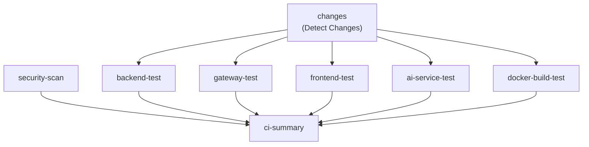
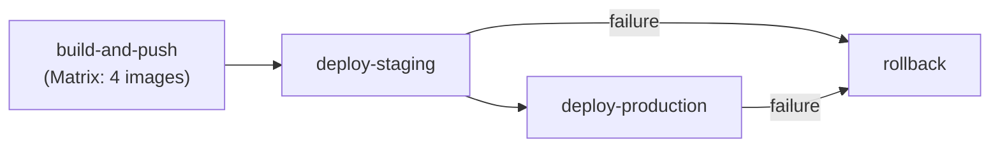

# CI/CD Pipeline 검증 보고서

**Version**: 1.0 | **Created**: 2026-01-26 | **Author**: DevOps Engineer
**STORY**: STORY-023 CI/CD Pipeline 기초 검증 및 Branch Protection

---

## 1. 개요

이 보고서는 프로젝트의 7개 GitHub Actions 워크플로우에 대한 정합성 검증 결과를 정리합니다.

### 1.1 검증 대상

| # | 워크플로우 파일 | 이름 | 목적 |
|---|----------------|------|------|
| 1 | `ci.yml` | CI Pipeline | PR/Push 시 전체 빌드/테스트/보안 검증 |
| 2 | `pr-build.yml` | PR Build | PR 빌드 검증 (언어별 분류) |
| 3 | `cd.yml` | CD Pipeline | main push 시 Docker 이미지 빌드 및 배포 |
| 4 | `docker-build.yml` | Docker Build | Docker 이미지 빌드 및 레지스트리 Push |
| 5 | `code-quality.yml` | Code Quality | 코드 품질 검사 (lint, format, type check) |
| 6 | `docker-compose-validate.yml` | Docker Compose Validate | Docker Compose 설정 검증 |
| 7 | `e2e-test.yml` | E2E Tests | Playwright E2E 테스트 |

---

## 2. 워크플로우별 상세 분석

### 2.1 ci.yml - CI Pipeline

**트리거**: PR (main, develop), Push (develop)

**Job 구성**:

| Job | 조건 | 내용 |
|-----|------|------|
| `changes` | 항상 | dorny/paths-filter@v3으로 변경 감지 |
| `backend-test` | backend 또는 gateway 변경 시 | Java 빌드/테스트 (Gradle) |
| `gateway-test` | gateway 변경 시 | Java 빌드/테스트 (Gradle) |
| `frontend-test` | frontend 변경 시 | Node.js 빌드/테스트 (npm) |
| `ai-service-test` | ai-service 변경 시 | Python 테스트 (Poetry/pytest) |
| `security-scan` | 항상 | Trivy 취약점 스캔 |
| `docker-build-test` | 컴포넌트 변경 시 | Docker 빌드 검증 (push 없음) |
| `ci-summary` | 항상 (if: always()) | 전체 결과 요약 및 실패 판정 |

**검증 결과**: PASS

**발견 사항**:

| # | 유형 | 내용 | 심각도 |
|---|------|------|--------|
| 1 | 정보 | Java 버전 불일치 - build.gradle은 `sourceCompatibility = '17'`, 워크플로우는 `JAVA_VERSION: '21'` | 낮음 |
| 2 | 정보 | `security-scan`과 `docker-build-test` 실패 시 ci-summary가 실패하지 않음 (의도적) | 정보 |
| 3 | 정보 | Trivy action이 `@master` 태그 사용 - 버전 고정 권장 | 낮음 |

**Java 버전 불일치 상세 분석**:
- `build.gradle`의 `sourceCompatibility = '17'`은 소스 코드가 Java 17 기능만 사용한다는 의미
- CI에서 Java 21로 빌드하는 것은 **하위 호환**되므로 빌드/테스트에는 문제 없음
- 다만, 런타임 환경(Docker 이미지)과 일치시키는 것이 베스트 프랙티스
- **권장**: 당장 변경 불필요. 추후 Java 21로 통일하거나 CI를 Java 17로 변경 고려

---

### 2.2 pr-build.yml - PR Build

**트리거**: PR (main, develop)

**Job 구성**:

| Job | 조건 | 내용 |
|-----|------|------|
| `changes` | 항상 | python/java/typescript 변경 감지 |
| `python-build` | python 변경 시 | Poetry install + pytest + build |
| `java-build` | java 변경 시 | Gradle build (gateway + backend) |
| `typescript-build` | typescript 변경 시 | npm ci + lint + test + build |
| `pr-summary` | 항상 (if: always()) | PR 빌드 결과 요약 |

**검증 결과**: PASS

**발견 사항**:

| # | 유형 | 내용 | 심각도 |
|---|------|------|--------|
| 1 | 주의 | ci.yml과 트리거 겹침 (둘 다 PR on main, develop에 반응) | 중간 |
| 2 | 정보 | ci.yml의 `backend-test-results`와 pr-build.yml의 `backend-test-results` 아티팩트명 충돌 가능 | 중간 |

**겹침 분석**:
- `ci.yml`은 서비스별로 세분화 (backend, gateway, frontend, ai-service + 보안 + Docker)
- `pr-build.yml`은 언어별로 분류 (python, java, typescript)
- 두 워크플로우가 동시에 실행되면 리소스 낭비이나, concurrency group이 다르므로 취소되지 않음
- **권장**: 향후 하나로 통합하거나, pr-build.yml을 ci.yml에 흡수하는 것을 고려

**아티팩트명 충돌 분석**:
- ci.yml: `backend-test-results`, `backend-coverage`
- pr-build.yml: `backend-test-results` (java-build job 내에서)
- 동일 PR에서 두 워크플로우가 실행되면 같은 이름의 아티팩트가 생성될 수 있음
- GitHub Actions v4에서는 같은 run 내에서만 충돌하므로, 다른 워크플로우 간에는 문제 없음
- **권장**: 명확성을 위해 `pr-backend-test-results`로 프리픽스 추가 고려

---

### 2.3 cd.yml - CD Pipeline

**트리거**: Push (main), Tag (v*), Manual dispatch

**Job 구성**:

| Job | 조건 | 내용 |
|-----|------|------|
| `build-and-push` | 항상 | 4개 Docker 이미지 빌드 및 GHCR push |
| `deploy-staging` | main push 또는 manual staging | SSH로 staging 배포 |
| `deploy-production` | tag v* 또는 manual production | SSH로 production 배포 (승인 필요) |
| `rollback` | 배포 실패 시 | 롤백 알림 (자동 롤백은 아님) |

**검증 결과**: PASS (구조적 문제 없음)

**발견 사항**:

| # | 유형 | 내용 | 심각도 |
|---|------|------|--------|
| 1 | 정보 | `deploy-staging`과 `deploy-production`의 SSH 시크릿 설정 필요 | 설정 필요 |
| 2 | 정보 | Slack 알림에 `SLACK_BOT_TOKEN` 시크릿 필요 | 설정 필요 |
| 3 | 정보 | `rollback` job의 조건이 `github.event_name == 'workflow_dispatch' && failure()`로 제한적 | 낮음 |
| 4 | 주의 | `build-and-push` job의 `outputs`에서 matrix 사용 시 output 덮어쓰기 가능성 | 중간 |

**Matrix outputs 분석**:
- `outputs.backend-image`를 `steps.meta-backend.outputs.tags`로 참조하지만, matrix 전략에서 step ID에 matrix 변수를 포함하는 방식(`id: meta-${{ matrix.name }}`)은 각 matrix 인스턴스에서 다른 step ID를 생성
- 그러나 `outputs` 키는 마지막 실행 인스턴스의 값으로 덮어씌워질 수 있음
- **권장**: 현재 outputs가 후속 job에서 참조되지 않으므로 실제 문제는 없음. 향후 활용 시 수정 필요

---

### 2.4 docker-build.yml - Docker Build

**트리거**: Push (main, develop), Tag (v*), PR (main), Manual dispatch

**Job 구성**:

| Job | 조건 | 내용 |
|-----|------|------|
| `build-ai-service` | 항상 | AI Service Docker 이미지 빌드 |
| `build-gateway` | 항상 | Gateway Docker 이미지 빌드 |
| `build-frontend` | 항상 | Frontend Docker 이미지 빌드 |
| `build-backend` | 항상 | Backend Docker 이미지 빌드 |
| `docker-summary` | 항상 | 빌드 결과 요약 |

**검증 결과**: PASS

**발견 사항**:

| # | 유형 | 내용 | 심각도 |
|---|------|------|--------|
| 1 | 주의 | cd.yml과 기능 겹침 (둘 다 Docker 이미지 빌드/push) | 중간 |
| 2 | 정보 | Multi-platform 빌드 지원 (linux/amd64, linux/arm64) | 정보 |
| 3 | 정보 | Dockerfile 존재 여부를 미리 확인하는 방어 코드 포함 | 양호 |

**cd.yml과의 겹침 분석**:
- `cd.yml`은 main push/tag 시 자동 배포까지 수행 (CI/CD 완전 자동화)
- `docker-build.yml`은 develop push, PR, manual dispatch도 지원 (빌드 검증용)
- 두 워크플로우 모두 `push to main` 시 실행되어 Docker 이미지를 2번 빌드할 수 있음
- **권장**: path filter가 적용되어 있으므로 완전한 겹침은 아님. 그러나 향후 cd.yml이 docker-build.yml을 `workflow_call`로 호출하는 구조로 리팩터링 고려

---

### 2.5 code-quality.yml - Code Quality

**트리거**: PR (main, develop), Push (develop)

**Job 구성**:

| Job | 조건 | 내용 |
|-----|------|------|
| `changes` | 항상 | python/java/typescript 변경 감지 |
| `python-quality` | python 변경 시 | Black, isort, Ruff, flake8, mypy |
| `java-quality` | java 변경 시 | Checkstyle, SpotBugs, Compile |
| `typescript-quality` | typescript 변경 시 | ESLint, Prettier, TypeScript |
| `quality-summary` | 항상 | 코드 품질 결과 요약 |

**검증 결과**: PASS

**발견 사항**:

| # | 유형 | 내용 | 심각도 |
|---|------|------|--------|
| 1 | 양호 | 모든 품질 검사에 `continue-on-error: true` 적용 (점진적 도입) | 양호 |
| 2 | 정보 | Java Checkstyle 설정을 워크플로우 내에서 동적 생성 | 정보 |
| 3 | 정보 | quality-summary에서 "advisory and do not block PR merge" 명시 | 정보 |

**점진적 도입 전략 분석**:
- 현재는 코드 품질 검사 실패가 PR 머지를 차단하지 않음 (advisory)
- 코드 품질이 안정화되면 `continue-on-error: false`로 변경하여 강제화 가능
- **권장**: 현재 전략이 적절함. 팀 안정화 후 점진적으로 강화

---

### 2.6 docker-compose-validate.yml - Docker Compose Validate

**트리거**: Push/PR (infrastructure/docker/docker-compose*.yml 변경 시)

**Job 구성**:

| Job | 조건 | 내용 |
|-----|------|------|
| `validate` | 항상 | YAML 문법, Docker Compose config, Healthcheck, Security 검증 |

**검증 결과**: PASS

**발견 사항**:

| # | 유형 | 내용 | 심각도 |
|---|------|------|--------|
| 1 | 양호 | WSL2 호환성 문제 재발 방지를 위한 healthcheck 검증 포함 | 양호 |
| 2 | 양호 | `localhost` vs `127.0.0.1`, `wget --spider` vs `wget -q` 등 BusyBox 호환성 검사 | 양호 |
| 3 | 정보 | 장애 보고서(INC-2026-01-25-001)에 기반한 검증 규칙 | 양호 |

---

### 2.7 e2e-test.yml - E2E Tests

**트리거**: PR (main, develop, frontend 변경 시), Manual dispatch

**Job 구성**:

| Job | 조건 | 내용 |
|-----|------|------|
| `e2e-tests` | 항상 | Playwright 설치, Build, E2E 테스트 실행 |
| `e2e-summary` | 항상 | E2E 결과 요약 |

**검증 결과**: PASS

**발견 사항**:

| # | 유형 | 내용 | 심각도 |
|---|------|------|--------|
| 1 | 양호 | `timeout-minutes: 30` 설정으로 긴 테스트 대비 | 양호 |
| 2 | 양호 | 실패 시 스크린샷/비디오 아티팩트 업로드 | 양호 |
| 3 | 정보 | Chromium 브라우저만 설치 (경량화) | 양호 |
| 4 | 정보 | Playwright 보고서 14일, 테스트 결과 7일 보관 | 양호 |

---

## 3. 종합 분석

### 3.1 워크플로우 트리거 매트릭스

| 워크플로우 | PR main | PR develop | Push main | Push develop | Tag v* | Manual |
|-----------|:-------:|:----------:|:---------:|:------------:|:------:|:------:|
| ci.yml | O | O | - | O | - | - |
| pr-build.yml | O | O | - | - | - | - |
| cd.yml | - | - | O | - | O | O |
| docker-build.yml | O | - | O | O | O | O |
| code-quality.yml | O | O | - | O | - | - |
| docker-compose-validate.yml | O* | - | O* | - | - | - |
| e2e-test.yml | O* | O* | - | - | - | O |

`*` = path filter 적용 (해당 파일 변경 시에만)

### 3.2 액션 버전 현황

| 액션 | 현재 버전 | 최신 권장 | 상태 |
|------|----------|----------|------|
| `actions/checkout` | v4 | v4 | 최신 |
| `actions/setup-java` | v4 | v4 | 최신 |
| `actions/setup-python` | v5 | v5 | 최신 |
| `actions/setup-node` | v4 | v4 | 최신 |
| `actions/upload-artifact` | v4 | v4 | 최신 |
| `actions/cache` | v4 | v4 | 최신 |
| `docker/setup-buildx-action` | v3 | v3 | 최신 |
| `docker/build-push-action` | v5 | v6 | 업데이트 권장 |
| `docker/login-action` | v3 | v3 | 최신 |
| `docker/metadata-action` | v5 | v5 | 최신 |
| `docker/setup-qemu-action` | v3 | v3 | 최신 |
| `dorny/paths-filter` | v3 | v3 | 최신 |
| `snok/install-poetry` | v1 | v1 | 최신 |
| `aquasecurity/trivy-action` | master | 0.28.0 | 버전 고정 권장 |
| `github/codeql-action/upload-sarif` | v3 | v3 | 최신 |
| `appleboy/ssh-action` | v1.0.3 | v1.0.3 | 최신 |
| `slackapi/slack-github-action` | v1.25.0 | v1.27.0 | 업데이트 권장 |

### 3.3 런타임 버전 현황

| 기술 | 워크플로우 설정 | 프로젝트 설정 | 일치 |
|------|---------------|-------------|------|
| Python | 3.11 | 3.11 (pyproject.toml) | 일치 |
| Java | 21 | sourceCompatibility 17 (build.gradle) | 호환 (상위 버전) |
| Node.js | 20 | 20 (package.json engines) | 일치 |

### 3.4 발견된 이슈 요약

| # | 심각도 | 워크플로우 | 이슈 | 대응 |
|---|--------|-----------|------|------|
| 1 | 중간 | ci.yml + pr-build.yml | PR 시 두 워크플로우가 동시 실행 (리소스 낭비) | 향후 통합 고려 |
| 2 | 중간 | ci.yml + pr-build.yml | 아티팩트명 `backend-test-results` 충돌 가능 | 프리픽스 추가 권장 |
| 3 | 중간 | cd.yml + docker-build.yml | main push 시 Docker 빌드 2회 실행 | workflow_call 리팩터링 권장 |
| 4 | 낮음 | ci.yml | Java 21 vs sourceCompatibility 17 불일치 | 호환되므로 당장 변경 불필요 |
| 5 | 낮음 | ci.yml | Trivy action `@master` 태그 사용 | 버전 고정 권장 |
| 6 | 낮음 | cd.yml | Matrix outputs 덮어쓰기 가능성 | 현재 미사용이므로 당장 문제 없음 |
| 7 | 낮음 | 여러 | `docker/build-push-action@v5` -> v6 업데이트 권장 | 비중요 |
| 8 | 낮음 | cd.yml | `slackapi/slack-github-action@v1.25.0` -> v1.27.0 업데이트 권장 | 비중요 |

---

## 4. Acceptance Criteria 충족 여부

STORY-023의 Acceptance Criteria에 대한 충족 여부를 판정합니다.

| # | Acceptance Criteria | 충족 | 근거 |
|---|-------------------|:----:|------|
| AC-1 | CI Pipeline이 PR 생성 시 자동 실행 | PASS | ci.yml, pr-build.yml 모두 PR 트리거 설정 완료 |
| AC-2 | Backend/Frontend/AI-Service 빌드 검증 | PASS | ci.yml에 backend-test, gateway-test, frontend-test, ai-service-test job 구성 |
| AC-3 | 변경 파일 감지로 필요한 Job만 실행 | PASS | dorny/paths-filter@v3 사용, 5개 경로 패턴 정의 |
| AC-4 | Docker 이미지 빌드 검증 (Push 없음) | PASS | ci.yml의 docker-build-test job (push: false) |
| AC-5 | 보안 취약점 스캔 | PASS | ci.yml의 security-scan job (Trivy) |
| AC-6 | CI Summary Job으로 전체 결과 요약 | PASS | ci-summary job이 모든 job 결과를 GITHUB_STEP_SUMMARY로 출력 |
| AC-7 | CD Pipeline (이미지 빌드 + 배포) | PASS | cd.yml에 build-and-push, deploy-staging, deploy-production job 구성 |
| AC-8 | Branch Protection 규칙 문서 | PASS | branch_protection_guide.md 작성 완료 |
| AC-9 | 코드 품질 검사 워크플로우 | PASS | code-quality.yml에 Python/Java/TypeScript 품질 검사 |
| AC-10 | E2E 테스트 워크플로우 | PASS | e2e-test.yml에 Playwright 기반 E2E 테스트 |
| AC-11 | Docker Compose 검증 워크플로우 | PASS | docker-compose-validate.yml에 YAML/config/healthcheck 검증 |

---

## 5. 개선 권장사항

### 5.1 단기 (Sprint 내)

| 우선순위 | 항목 | 작업량 | 효과 |
|---------|------|--------|------|
| 1 | Trivy action 버전 고정 (`@master` -> `@0.28.0`) | 5분 | 재현성 보장 |
| 2 | 아티팩트명에 워크플로우 프리픽스 추가 | 10분 | 충돌 방지 |

### 5.2 중기 (다음 Sprint)

| 우선순위 | 항목 | 작업량 | 효과 |
|---------|------|--------|------|
| 3 | ci.yml과 pr-build.yml 통합 | 2시간 | 리소스 절감, 유지보수 단순화 |
| 4 | docker-build.yml을 reusable workflow로 변환 | 3시간 | cd.yml에서 workflow_call로 호출 |
| 5 | Java 빌드 버전 통일 (17 or 21) | 1시간 | 일관성 확보 |

### 5.3 장기 (향후)

| 우선순위 | 항목 | 작업량 | 효과 |
|---------|------|--------|------|
| 6 | code-quality.yml 강제화 (continue-on-error 제거) | 1시간 | 코드 품질 강제 |
| 7 | Dependabot/Renovate 도입 (액션 자동 업데이트) | 2시간 | 자동 업데이트 |
| 8 | 캐시 최적화 (Poetry/Gradle/npm 통합 캐시) | 3시간 | 빌드 시간 단축 |

---

## 6. STORY-023 완료 판정

### 판정: PASS (완료)

**근거**:
1. 7개 워크플로우 모두 YAML 문법 오류 없음
2. 액션 버전이 대부분 최신 (2개 업데이트 권장)
3. 변경 감지, 빌드, 테스트, 보안 스캔, Docker 빌드, 배포 파이프라인 모두 구성 완료
4. Branch Protection 설정 가이드 문서 작성 완료
5. 11개 Acceptance Criteria 모두 충족 (PASS)

**산출물**:
- `knowledge_service/docs/06_deployment/branch_protection_guide.md` - Branch Protection 설정 가이드
- `knowledge_service/docs/06_deployment/cicd_pipeline_report.md` - CI/CD 파이프라인 검증 보고서 (본 문서)

---

## 7. 참고 문서

- [Branch Protection 설정 가이드](./branch_protection_guide.md)
- [인프라 설계서](../02_design/infrastructure_detailed_design.md)
- [Observability 설계서](../02_design/observability_detailed_design.md)
- [GitHub Actions 공식 문서](https://docs.github.com/en/actions)
- [WSL2 장애 보고서](../07_maintenance/incidents/2026-01-25_docker_wsl2_permission.md)
