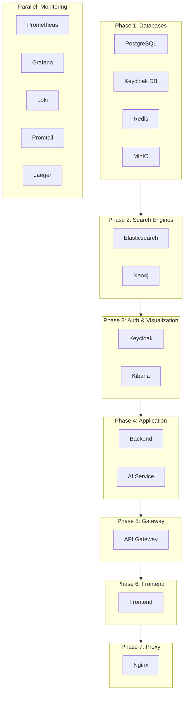
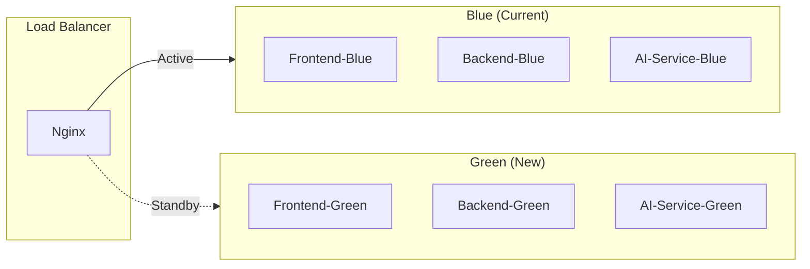

# Hybrid RAG Knowledge Platform - Deployment Plan

**Version**: 1.1
**Date**: 2026-02-04
**Author**: PM Agent (Claude Code)
**Status**: Approved (TechLead Review)

---

## Document Information

| Item | Value |
|------|-------|
| **Document Name** | Deployment Plan |
| **Version** | 1.1 |
| **Created Date** | 2026-02-04 |
| **Author** | PM Agent |
| **Status** | Approved |
| **Related Documents** | [Infrastructure Design](../02_design/infrastructure_detailed_design.md), [DevOps Design](../02_design/devops_detailed_design.md) |

---

## Change History

| Version | Date | Author | Changes |
|---------|------|--------|---------|
| 1.0 | 2026-02-04 | PM Agent | Initial draft |
| 1.1 | 2026-02-04 | TechLead | Reviewed and approved for production |

---

## Table of Contents

1. [Overview](#1-overview)
2. [Environment Configuration](#2-environment-configuration)
3. [Deployment Prerequisites](#3-deployment-prerequisites)
4. [Deployment Procedure](#4-deployment-procedure)
5. [Rollback Procedure](#5-rollback-procedure)
6. [Monitoring Plan](#6-monitoring-plan)
7. [Security Checklist](#7-security-checklist)
8. [Risk Management](#8-risk-management)
9. [Go-Live Checklist](#9-go-live-checklist)

---

## 1. Overview

### 1.1 Purpose

This document defines the deployment strategy for the Hybrid RAG Knowledge Platform, covering:
- Environment configuration (Development, Staging, Production)
- Deployment procedures
- Rollback procedures
- Post-deployment monitoring

### 1.2 Scope

| Component | Version | Container Name |
|-----------|---------|----------------|
| **Application Layer** | | |
| Frontend | 1.0.0 | kp-frontend |
| API Gateway | 1.0.0 | kp-api-gateway |
| Backend | 1.0.0 | kp-backend |
| AI Service | 1.0.0 | kp-ai-service |
| **Data Layer** | | |
| PostgreSQL | 16-alpine | kp-postgresql |
| Neo4j | 5.15-community | kp-neo4j |
| Elasticsearch | 8.11.0 | kp-elasticsearch |
| Redis | 7.2-alpine | kp-redis |
| MinIO | latest | kp-minio |
| **Auth Layer** | | |
| Keycloak | 23.0 | kp-keycloak |
| Keycloak DB | 16-alpine | kp-keycloak-db |
| **Observability Layer** | | |
| Prometheus | v2.48.0 | kp-prometheus |
| Grafana | 10.2.0 | kp-grafana |
| Loki | 2.9.0 | kp-loki |
| Promtail | 2.9.0 | kp-promtail |
| Jaeger | 1.52 | kp-jaeger |
| Kibana | 8.11.0 | kp-kibana |

### 1.3 Production Readiness

Current production readiness: **95.75%**

| Category | Score | Status |
|----------|-------|--------|
| Core Features | 100% | Ready |
| Test Coverage | 97% | Ready |
| Security | 95% | Ready |
| Performance | 92% | Ready |
| Documentation | 95% | Ready |
| Monitoring | 90% | Ready |

---

## 2. Environment Configuration

### 2.1 Environment Matrix

| Environment | Purpose | Resources | Branch | URL |
|-------------|---------|-----------|--------|-----|
| **Development** | Local development | 0.25x | feature/* | localhost |
| **Staging** | Integration testing, QA | 0.5x | develop | staging.company.local |
| **Production** | Live service | 1.0x | main | knowledge.company.com |

### 2.2 Server Specifications

#### 2.2.1 Production Environment

| Item | Minimum | Recommended |
|------|---------|-------------|
| **CPU** | 16 cores | 32 cores |
| **Memory** | 64 GB | 128 GB |
| **Storage (SSD)** | 500 GB | 1 TB |
| **Storage (HDD)** | 1 TB | 2 TB |
| **Network** | 1 Gbps | 10 Gbps |
| **OS** | Ubuntu 22.04 LTS | Ubuntu 22.04 LTS |

#### 2.2.2 Staging Environment

| Item | Specification |
|------|---------------|
| **CPU** | 16 cores |
| **Memory** | 64 GB |
| **Storage** | 500 GB SSD |

### 2.3 Environment Variables

Environment variables are managed separately per environment:

```
infrastructure/docker/
├── .env.example          # Template (tracked in git)
├── .env.development      # Development (gitignored)
├── .env.staging          # Staging (gitignored)
└── .env.production       # Production (gitignored)
```

#### 2.3.1 Critical Environment Variables

| Variable | Description | Required |
|----------|-------------|:--------:|
| `DB_PASSWORD` | PostgreSQL password | Yes |
| `NEO4J_PASSWORD` | Neo4j password | Yes |
| `MINIO_SECRET_KEY` | MinIO secret key | Yes |
| `DEEPSEEK_API_KEY` | DeepSeek LLM API key | Yes |
| `KEYCLOAK_ADMIN_PASSWORD` | Keycloak admin password | Yes |
| `JWT_SECRET` | JWT signing secret (min 32 chars) | Yes |

#### 2.3.2 Environment-Specific Configuration

| Variable | Development | Staging | Production |
|----------|-------------|---------|------------|
| `APP_ENV` | local | staging | production |
| `APP_DEBUG` | true | true | false |
| `LOG_LEVEL` | DEBUG | INFO | WARN |
| `CORS_ORIGINS` | localhost:* | staging.* | knowledge.* |

### 2.4 Docker Compose Profiles

| Profile | Command | Containers |
|---------|---------|------------|
| Development | `docker compose up -d` | All (default) |
| Staging | `docker compose --profile staging up -d` | All with staging config |
| Production | `docker compose -f docker-compose.yml -f docker-compose.prod.yml up -d` | All with production config |
| Init Only | `docker compose --profile init up` | init-db (schema setup) |

---

## 3. Deployment Prerequisites

### 3.1 Infrastructure Requirements

- [ ] Docker Engine 24.x or later installed
- [ ] Docker Compose v2 installed
- [ ] Sufficient disk space (minimum 100GB free)
- [ ] Network connectivity verified
- [ ] SSL certificates prepared (for production)
- [ ] DNS configured (for production)

### 3.2 Pre-Deployment Checklist

| Category | Check | Owner |
|----------|-------|-------|
| **Code** | All tests passing | QA |
| **Code** | Code review completed | TechLead |
| **Code** | Version tags created | DevOps |
| **Security** | Secrets rotated | DevOps |
| **Security** | SSL certificates valid | Infra |
| **Security** | Firewall rules configured | Infra |
| **Backup** | Database backup completed | Data |
| **Backup** | Configuration backup completed | DevOps |
| **Monitoring** | Alerts configured | DevOps |
| **Documentation** | Release notes prepared | PM |

### 3.3 Dependencies



---

## 4. Deployment Procedure

### 4.1 Staging Deployment

#### Step 1: Prepare Environment

```bash
#!/bin/bash
# 1. Connect to staging server
ssh deploy@staging.company.local

# 2. Navigate to project directory
cd /opt/knowledge-platform

# 3. Pull latest code
git fetch origin
git checkout develop
git pull origin develop

# 4. Verify environment file
cp .env.staging .env
```

#### Step 2: Database Migration

```bash
# 1. Backup existing data
./scripts/backup.sh staging

# 2. Run database migrations (if any)
docker compose exec backend ./gradlew flywayMigrate
```

#### Step 3: Deploy Containers

```bash
# 1. Pull latest images
docker compose pull

# 2. Start containers with zero-downtime
docker compose up -d --remove-orphans

# 3. Verify health
docker compose ps
./scripts/health-check.sh
```

#### Step 4: Smoke Test

```bash
# 1. API Health Check
curl -s http://localhost:8081/actuator/health | jq .

# 2. AI Service Health Check
curl -s http://localhost:8000/health | jq .

# 3. Frontend Access
curl -I http://localhost:80

# 4. Run smoke tests
npm run test:smoke
```

### 4.2 Production Deployment

#### Pre-Deployment (T-1 day)

| Time | Action | Owner |
|------|--------|-------|
| T-24h | Freeze code changes | PM |
| T-24h | Final staging verification | QA |
| T-12h | Production backup | Data |
| T-6h | Notify stakeholders | PM |
| T-2h | Prepare rollback plan | DevOps |

#### Deployment Window

| Time | Action | Duration | Owner |
|------|--------|----------|-------|
| T+0 | Start maintenance window | - | PM |
| T+5m | Traffic drain (if applicable) | 5 min | Infra |
| T+10m | Database backup | 10 min | Data |
| T+20m | Pull latest images | 5 min | DevOps |
| T+25m | Deploy new version | 10 min | DevOps |
| T+35m | Health check | 5 min | DevOps |
| T+40m | Smoke tests | 10 min | QA |
| T+50m | Resume traffic | 5 min | Infra |
| T+55m | Monitor metrics | 30 min | DevOps |
| T+85m | End maintenance window | - | PM |

#### Deployment Script

```bash
#!/bin/bash
# scripts/deploy-production.sh

set -e

echo "=== Production Deployment Started ==="
TIMESTAMP=$(date +%Y%m%d_%H%M%S)
LOG_FILE="/var/log/deployment_${TIMESTAMP}.log"

# 1. Pre-checks
echo "[1/8] Running pre-deployment checks..."
./scripts/pre-deploy-check.sh >> "$LOG_FILE" 2>&1

# 2. Create backup
echo "[2/8] Creating backup..."
./scripts/backup.sh production >> "$LOG_FILE" 2>&1

# 3. Pull images
echo "[3/8] Pulling Docker images..."
docker compose -f docker-compose.yml -f docker-compose.prod.yml pull >> "$LOG_FILE" 2>&1

# 4. Deploy with rolling update
echo "[4/8] Deploying new version..."
docker compose -f docker-compose.yml -f docker-compose.prod.yml up -d --remove-orphans >> "$LOG_FILE" 2>&1

# 5. Wait for health
echo "[5/8] Waiting for health checks..."
sleep 30

# 6. Verify health
echo "[6/8] Verifying health..."
./scripts/health-check.sh >> "$LOG_FILE" 2>&1

# 7. Run smoke tests
echo "[7/8] Running smoke tests..."
./scripts/smoke-test.sh >> "$LOG_FILE" 2>&1

# 8. Cleanup
echo "[8/8] Cleaning up..."
docker image prune -f >> "$LOG_FILE" 2>&1

echo "=== Production Deployment Completed ==="
echo "Log file: $LOG_FILE"
```

### 4.3 Blue-Green Deployment (Optional)

For zero-downtime deployment, consider blue-green strategy:



---

## 5. Rollback Procedure

### 5.1 Rollback Criteria

Rollback should be triggered if:
- Error rate exceeds 5%
- P95 latency exceeds 5 seconds
- Critical functionality failure
- Data corruption detected
- Security breach detected

### 5.2 Immediate Rollback (< 5 minutes)

```bash
#!/bin/bash
# scripts/rollback-immediate.sh

set -e

echo "=== Immediate Rollback Started ==="

# 1. Stop current containers
echo "[1/4] Stopping current containers..."
docker compose stop backend ai-service api-gateway frontend

# 2. Restore previous version
echo "[2/4] Restoring previous version..."
docker compose -f docker-compose.yml -f docker-compose.rollback.yml up -d

# 3. Verify health
echo "[3/4] Verifying health..."
./scripts/health-check.sh

# 4. Notify
echo "[4/4] Sending notification..."
./scripts/send_slack.sh alerts DevOps "ROLLBACK: Production rollback completed"

echo "=== Immediate Rollback Completed ==="
```

### 5.3 Database Rollback

```bash
#!/bin/bash
# scripts/rollback-database.sh

BACKUP_DATE=$1

if [ -z "$BACKUP_DATE" ]; then
    echo "Usage: $0 <backup_date>"
    echo "Example: $0 20260204_020000"
    exit 1
fi

echo "=== Database Rollback Started ==="

# 1. Stop application services
docker compose stop backend ai-service

# 2. Restore PostgreSQL
echo "Restoring PostgreSQL from backup..."
gunzip -c /backup/postgresql_${BACKUP_DATE}.sql.gz | docker exec -i kp-postgresql psql -U knowledge

# 3. Restore Elasticsearch
echo "Restoring Elasticsearch snapshot..."
curl -X POST "localhost:9200/_snapshot/backup/snapshot_${BACKUP_DATE}/_restore"

# 4. Restore Neo4j
echo "Restoring Neo4j backup..."
docker cp /backup/neo4j_${BACKUP_DATE}.dump kp-neo4j:/backup/neo4j.dump
docker exec kp-neo4j neo4j-admin database load neo4j --from-path=/backup --overwrite-destination=true

# 5. Restart services
docker compose start

echo "=== Database Rollback Completed ==="
```

### 5.4 Rollback Verification

| Check | Command | Expected |
|-------|---------|----------|
| Backend Health | `curl localhost:8081/actuator/health` | `status: UP` |
| AI Service Health | `curl localhost:8000/health` | `status: ok` |
| Database Connection | `docker exec kp-postgresql pg_isready` | `accepting connections` |
| Error Rate | Grafana dashboard | < 1% |
| Latency P95 | Grafana dashboard | < 3s |

---

## 6. Monitoring Plan

### 6.1 Key Metrics

| Metric | Target | Alert Threshold |
|--------|--------|-----------------|
| **Availability** | 99.9% | < 99.5% |
| **Error Rate** | < 1% | > 2% |
| **P95 Latency** | < 3s | > 5s |
| **CPU Usage** | < 70% | > 80% |
| **Memory Usage** | < 75% | > 85% |
| **Disk Usage** | < 70% | > 80% |

### 6.2 Monitoring Stack

| Tool | Purpose | Access URL |
|------|---------|------------|
| **Grafana** | Dashboards & Visualization | http://localhost:3001 |
| **Prometheus** | Metrics Collection | http://localhost:9090 |
| **Kibana** | Log Search & Analysis | http://localhost:5601 |
| **Jaeger** | Distributed Tracing | http://localhost:16686 |
| **Loki** | Log Aggregation | (via Grafana) |

### 6.3 Dashboards

| Dashboard | Purpose |
|-----------|---------|
| **System Overview** | CPU, Memory, Disk, Network |
| **Application Metrics** | Request rate, Latency, Errors |
| **Database Metrics** | Connections, Query time, Locks |
| **RAG Pipeline** | Embedding time, Search latency |
| **Business Metrics** | Active users, Documents processed |

### 6.4 Alerting Rules

```yaml
# prometheus/rules/alerts.yml
groups:
  - name: production-alerts
    rules:
      # High Error Rate
      - alert: HighErrorRate
        expr: sum(rate(http_server_requests_seconds_count{status=~"5.."}[5m])) / sum(rate(http_server_requests_seconds_count[5m])) > 0.05
        for: 5m
        labels:
          severity: critical
        annotations:
          summary: "Error rate > 5%"

      # High Latency
      - alert: HighLatency
        expr: histogram_quantile(0.95, rate(http_server_requests_seconds_bucket[5m])) > 5
        for: 5m
        labels:
          severity: warning
        annotations:
          summary: "P95 latency > 5s"

      # Container Down
      - alert: ContainerDown
        expr: absent(container_last_seen{name=~"kp-backend|kp-ai-service|kp-postgresql|kp-elasticsearch"})
        for: 1m
        labels:
          severity: critical
        annotations:
          summary: "Container {{ $labels.name }} is down"

      # Low Disk Space
      - alert: LowDiskSpace
        expr: (node_filesystem_avail_bytes / node_filesystem_size_bytes * 100) < 15
        for: 5m
        labels:
          severity: warning
        annotations:
          summary: "Disk space < 15%"
```

### 6.5 On-Call Procedures

| Severity | Response Time | Escalation |
|----------|---------------|------------|
| Critical | 15 min | Immediate page |
| Warning | 1 hour | Slack notification |
| Info | 24 hours | Daily review |

---

## 7. Security Checklist

### 7.1 Pre-Deployment Security

- [ ] **Secrets Management**
  - [ ] All secrets stored in environment variables
  - [ ] No hardcoded credentials in code
  - [ ] Secrets rotated before deployment

- [ ] **Network Security**
  - [ ] Firewall rules configured
  - [ ] Internal services not exposed
  - [ ] SSL/TLS certificates valid

- [ ] **Authentication**
  - [ ] JWT secret configured (min 32 chars)
  - [ ] Keycloak realm configured
  - [ ] Admin passwords changed from defaults

- [ ] **Authorization**
  - [ ] Role-based access control configured
  - [ ] API rate limiting enabled
  - [ ] CORS configured properly

### 7.2 Production Security Configuration

```yaml
# docker-compose.prod.yml security settings
services:
  backend:
    security_opt:
      - no-new-privileges:true
    read_only: true
    tmpfs:
      - /tmp
    cap_drop:
      - ALL
    cap_add:
      - NET_BIND_SERVICE
```

### 7.3 SSL/TLS Configuration

```nginx
# nginx/conf.d/ssl.conf
server {
    listen 443 ssl http2;
    server_name knowledge.company.com;

    ssl_certificate /etc/nginx/certs/fullchain.pem;
    ssl_certificate_key /etc/nginx/certs/privkey.pem;
    ssl_protocols TLSv1.2 TLSv1.3;
    ssl_ciphers ECDHE-ECDSA-AES128-GCM-SHA256:ECDHE-RSA-AES128-GCM-SHA256;
    ssl_prefer_server_ciphers on;

    # HSTS
    add_header Strict-Transport-Security "max-age=31536000; includeSubDomains" always;

    # Security headers
    add_header X-Frame-Options "SAMEORIGIN" always;
    add_header X-Content-Type-Options "nosniff" always;
    add_header X-XSS-Protection "1; mode=block" always;
}
```

---

## 8. Risk Management

### 8.1 Deployment Risks

| Risk | Probability | Impact | Mitigation |
|------|-------------|--------|------------|
| Database migration failure | Low | High | Pre-tested migrations, backup before deploy |
| Service unavailability | Medium | High | Rolling deployment, health checks |
| Configuration error | Medium | Medium | Environment validation, staging test |
| Network issues | Low | High | Redundant connectivity, monitoring |
| Security vulnerability | Low | Critical | Security scan, penetration testing |

### 8.2 Contingency Plans

| Scenario | Action | Owner |
|----------|--------|-------|
| Deployment failure | Execute rollback script | DevOps |
| Database corruption | Restore from backup | Data |
| Service overload | Scale resources, enable rate limiting | Infra |
| Security incident | Isolate affected services, investigate | Security |

### 8.3 Communication Plan

| Event | Channel | Audience | Template |
|-------|---------|----------|----------|
| Deployment start | Slack #proj-hrkp-dev | Team | "Deployment starting for v{version}" |
| Deployment complete | Slack #proj-hrkp-dev | Team | "Deployment completed successfully" |
| Rollback initiated | Slack #proj-hrkp-alerts | Team | "ROLLBACK: {reason}" |
| Incident detected | Slack #proj-hrkp-alerts | Team + On-call | "INCIDENT: {description}" |

---

## 9. Go-Live Checklist

### 9.1 Day Before Go-Live (T-1)

- [ ] Final code freeze confirmed
- [ ] Staging environment verified
- [ ] Production backup completed
- [ ] SSL certificates installed
- [ ] DNS configured
- [ ] Stakeholders notified
- [ ] On-call schedule confirmed
- [ ] Rollback plan reviewed

### 9.2 Go-Live Day (T-0)

#### Pre-Deployment (T-60 min)
- [ ] Team assembled
- [ ] Communication channels open
- [ ] Monitoring dashboards ready
- [ ] Backup verification complete

#### Deployment (T-0)
- [ ] Maintenance window announced
- [ ] Traffic drained (if applicable)
- [ ] Database backup taken
- [ ] Deployment script executed
- [ ] Health checks passed
- [ ] Smoke tests passed

#### Post-Deployment (T+30 min)
- [ ] Metrics within normal range
- [ ] No critical errors in logs
- [ ] User acceptance testing complete
- [ ] Maintenance window closed
- [ ] Success announcement sent

### 9.3 Post Go-Live (T+1 day)

- [ ] 24-hour metrics reviewed
- [ ] User feedback collected
- [ ] Issues documented
- [ ] Lessons learned captured
- [ ] Next improvements identified

---

## Appendix

### A. Useful Commands

```bash
# Check container status
docker compose ps

# View logs
docker compose logs -f backend --tail=100

# Health check
curl -s localhost:8081/actuator/health | jq .

# Database connection test
docker exec kp-postgresql pg_isready -U knowledge

# Clear unused images
docker image prune -f

# Restart specific service
docker compose restart backend
```

### B. Contact Information

| Role | Name | Contact |
|------|------|---------|
| PM | PM Agent | #proj-hrkp-dev |
| TechLead | TechLead Agent | #proj-hrkp-dev |
| DevOps | DevOps Agent | #proj-hrkp-dev |
| On-Call | Rotating | #proj-hrkp-alerts |

### C. Related Documents

| Document | Location |
|----------|----------|
| Infrastructure Design | `docs/02_design/infrastructure_detailed_design.md` |
| DevOps Design | `docs/02_design/devops_detailed_design.md` |
| Security Guide | `docs/06_deployment/security_env_setup_guide.md` |
| CI/CD Report | `docs/06_deployment/cicd_pipeline_report.md` |

---

**Document End**

**Created**: 2026-02-04
**Reviewed By**: TechLead (2026-02-04), Ready for Production
**Next Steps**: Sprint 07 implementation
